# DB Q&A

> Database interview questions and real-world scenario answers.

---

## Table of Contents

### Basic DB Questions

1. [What Is a Database Join? How Many Types of Joins Are There?](#1-what-is-a-database-join-how-many-types-of-joins-are-there)
2. [What Is an Index and Why Do We Need It?](#2-what-is-an-index-and-why-do-we-need-it)
3. [What Are ACID Properties in a Database?](#3-what-are-acid-properties-in-a-database)
4. [What Are Transaction Isolation Levels?](#4-what-are-transaction-isolation-levels)
5. [What Are Optimistic and Pessimistic Locking?](#5-what-are-optimistic-and-pessimistic-locking)
6. [What Is a Database Deadlock and How Do You Prevent It?](#6-what-is-a-database-deadlock-and-how-do-you-prevent-it)
7. [What Is the Difference Between Primary Key and Unique Key?](#7-what-is-the-difference-between-primary-key-and-unique-key)
8. [What Is a SQL Hint?](#8-what-is-a-sql-hint)
9. [What Is EXPLAIN in SQL?](#9-what-is-explain-in-sql)
10. [What Is Normalization and Denormalization?](#10-what-is-normalization-and-denormalization)
11. [What Is the N+1 Query Problem?](#11-what-is-the-n1-query-problem)
12. [What Is the Difference Between Offset and Cursor Pagination?](#12-what-is-the-difference-between-offset-and-cursor-pagination)

### Interview Q&A

13. [How Do You Optimize a Slow Query on a Large Table?](#13-how-do-you-optimize-a-slow-query-on-a-large-table)

---

## Basic DB Questions

## 1. What Is a Database Join? How Many Types of Joins Are There?

### The Question

> *"What is a database join? How many types of joins are there, and when do we use them?"*

### Answer

A **join** is used to combine rows from two or more tables based on a related column. In real applications, data is usually normalized into multiple tables. For example, user information may be in a `users` table, and order information may be in an `orders` table. If we want order details along with the user name, we need a join.

Example tables:

```sql
users
-----
id | name
1  | Ravi
2  | Priya
3  | Aman

orders
------
id  | user_id | amount
101 | 1       | 500
102 | 1       | 700
103 | 2       | 300
```

### Common Join Types

| Join Type | What It Returns |
|---|---|
| `INNER JOIN` | Only matching rows from both tables |
| `LEFT JOIN` | All rows from the left table, plus matching rows from the right table |
| `RIGHT JOIN` | All rows from the right table, plus matching rows from the left table |
| `FULL OUTER JOIN` | All rows from both tables, matched where possible |
| `CROSS JOIN` | Every combination of rows from both tables |
| `SELF JOIN` | A table joined with itself |

### INNER JOIN

Returns only records that match in both tables.

```sql
SELECT u.id, u.name, o.id AS order_id, o.amount
FROM users u
INNER JOIN orders o ON u.id = o.user_id;
```

Use this when you only need users who have orders.

### LEFT JOIN

Returns all records from the left table and matching records from the right table. If there is no match, right-side columns return `NULL`.

```sql
SELECT u.id, u.name, o.id AS order_id, o.amount
FROM users u
LEFT JOIN orders o ON u.id = o.user_id;
```

Use this when you want all users, including users who have not placed any order.

### RIGHT JOIN

Returns all records from the right table and matching records from the left table.

```sql
SELECT u.id, u.name, o.id AS order_id, o.amount
FROM users u
RIGHT JOIN orders o ON u.id = o.user_id;
```

In practice, many teams avoid `RIGHT JOIN` and rewrite it as a `LEFT JOIN` by changing table order, because `LEFT JOIN` is easier to read.

### FULL OUTER JOIN

Returns all records from both tables. Matching rows are combined, and non-matching rows appear with `NULL` values.

```sql
SELECT u.id, u.name, o.id AS order_id, o.amount
FROM users u
FULL OUTER JOIN orders o ON u.id = o.user_id;
```

Use this when you need to find all matched and unmatched records from both sides.

### CROSS JOIN

Returns every possible combination of rows.

```sql
SELECT u.name, p.plan_name
FROM users u
CROSS JOIN subscription_plans p;
```

Use this carefully. If one table has 1,000 rows and another has 1,000 rows, the result can become 1,000,000 rows.

### SELF JOIN

A self join joins a table with itself. It is useful for hierarchical data, such as employee and manager relationships.

```sql
SELECT e.name AS employee_name, m.name AS manager_name
FROM employees e
LEFT JOIN employees m ON e.manager_id = m.id;
```

### Join Flow

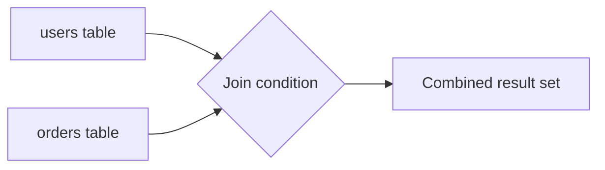

### TLDR

A join combines rows from multiple tables using a related column. `INNER JOIN` returns only matches, `LEFT JOIN` keeps all left-table rows, `FULL OUTER JOIN` keeps all rows from both tables, and `CROSS JOIN` creates all combinations.

---

## 2. What Is an Index and Why Do We Need It?

### The Question

> *"What is an index in a database, why do we need it, and how do we create one?"*

### Answer

An **index** is a database structure that helps the database find rows faster without scanning the entire table. It works like an index in a book. Instead of reading every page to find a topic, we look in the index and jump directly to the right page.

Without an index, this query may scan the full table:

```sql
SELECT id, name, email
FROM users
WHERE email = 'ravi@example.com';
```

If the `users` table has millions of rows, a full scan can be slow.

Create an index on the searched column:

```sql
CREATE INDEX idx_users_email
ON users (email);
```

Now the database can use the index to find matching rows quickly.

### Unique Index

If a column must be unique, use a unique index or unique constraint:

```sql
CREATE UNIQUE INDEX idx_users_email_unique
ON users (email);
```

This improves lookup speed and also prevents duplicate emails.

### Composite Index

If a query filters by multiple columns, use a composite index:

```sql
CREATE INDEX idx_orders_user_status_created_at
ON orders (user_id, status, created_at DESC);
```

This is useful for a query like:

```sql
SELECT id, amount, created_at
FROM orders
WHERE user_id = :userId
  AND status = 'COMPLETED'
ORDER BY created_at DESC
LIMIT 50;
```

The index should match the common filter and sort pattern.

### Index Flow

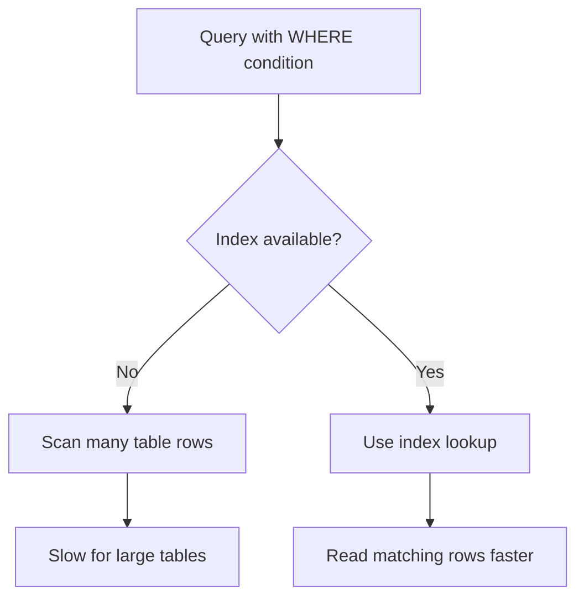

### When Indexes Help

- Columns used in `WHERE` filters.
- Columns used in `JOIN` conditions.
- Columns used in `ORDER BY`.
- Columns used for uniqueness checks.
- Frequently queried foreign key columns.

### When Indexes Can Hurt

Indexes are not free. Every insert, update, or delete must also update the indexes. Too many indexes can slow down write-heavy tables and consume extra disk space.

So we should create indexes based on real query patterns and verify them using:

```sql
EXPLAIN ANALYZE
SELECT id, name, email
FROM users
WHERE email = 'ravi@example.com';
```

### TLDR

An index helps the database find rows faster without scanning the full table. Use indexes on columns used in filters, joins, sorting, and uniqueness checks, but avoid unnecessary indexes because they add storage and write overhead.

---

## 3. What Are ACID Properties in a Database?

### The Question

> *"What are ACID properties in a database, and why are they important?"*

### Answer

**ACID** is a set of properties that make database transactions reliable. A transaction is a group of operations that should be treated as one unit.

Example: placing an order may include:

1. Insert order record.
2. Reduce inventory.
3. Insert payment record.

Either all these changes should happen, or none should happen.

### Atomicity

Atomicity means **all or nothing**.

If one step fails, the whole transaction rolls back.

```sql
BEGIN;

INSERT INTO orders (order_id, user_id, amount)
VALUES ('order-1', 'user-1', 500);

UPDATE inventory
SET quantity = quantity - 1
WHERE product_id = 'product-1';

COMMIT;
```

If the inventory update fails, the order insert should not remain committed.

### Consistency

Consistency means the database moves from one valid state to another valid state.

For example:

- order amount should not be negative
- email should remain unique
- foreign key should point to an existing user
- inventory quantity should not become invalid

Database constraints help maintain consistency.

### Isolation

Isolation means concurrent transactions should not interfere with each other incorrectly.

If two users place orders at the same time, each transaction should behave safely even though both are running together. Isolation level decides how strongly the database separates concurrent transactions.

### Durability

Durability means once a transaction is committed, the data should not be lost even if the system crashes.

The database writes committed changes safely using logs and storage mechanisms.

### ACID Flow

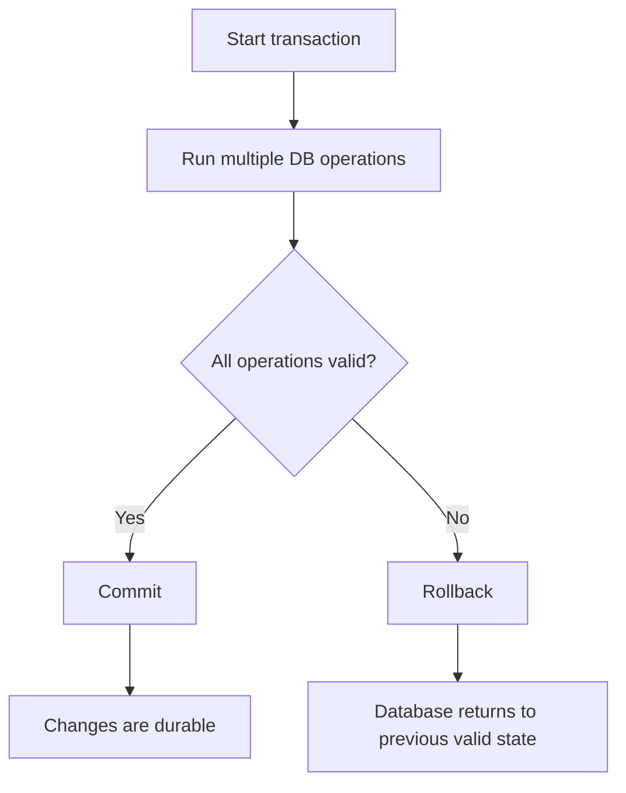

### Interview Summary

I would explain it like this:

> ACID properties make database transactions reliable. Atomicity means all operations in a transaction succeed or all roll back. Consistency means database rules and constraints remain valid. Isolation means concurrent transactions do not corrupt each other. Durability means committed data survives crashes. For example, in an order flow, order creation, inventory update, and payment record should commit together or roll back together.

### TLDR

ACID means Atomicity, Consistency, Isolation, and Durability. It ensures a transaction is all-or-nothing, keeps data valid, handles concurrent transactions safely, and preserves committed data after failures.

---

## 4. What Are Transaction Isolation Levels?

### The Question

> *"What are transaction isolation levels, and what problems do they prevent?"*

### Answer

Transaction isolation levels define how much one transaction can see changes made by another transaction while both are running.

Higher isolation gives safer reads but may reduce performance because the database needs more locking or version tracking.

### Common Read Problems

| Problem | Meaning |
|---|---|
| Dirty read | Reading uncommitted data from another transaction |
| Non-repeatable read | Reading the same row twice and getting different values |
| Phantom read | Running the same query twice and seeing new matching rows |

### Isolation Levels

| Isolation Level | What It Means |
|---|---|
| Read Uncommitted | Can read uncommitted changes; rarely used |
| Read Committed | Can read only committed data |
| Repeatable Read | Same row read stays consistent inside a transaction |
| Serializable | Strongest isolation; transactions behave as if executed one by one |

### Read Committed Example

In `READ COMMITTED`, a transaction does not see uncommitted data.

```sql
SET TRANSACTION ISOLATION LEVEL READ COMMITTED;

BEGIN;

SELECT balance
FROM account
WHERE account_id = 'A1';

COMMIT;
```

This is a common default in databases like PostgreSQL and Oracle.

### Repeatable Read Example

In `REPEATABLE READ`, if the same transaction reads the same row multiple times, it sees a consistent value.

```sql
SET TRANSACTION ISOLATION LEVEL REPEATABLE READ;

BEGIN;

SELECT balance
FROM account
WHERE account_id = 'A1';

-- Another transaction updates the same account and commits.

SELECT balance
FROM account
WHERE account_id = 'A1';

COMMIT;
```

The second read should still be consistent within the transaction.

### Serializable Example

`SERIALIZABLE` is the strongest isolation level.

```sql
SET TRANSACTION ISOLATION LEVEL SERIALIZABLE;

BEGIN;

SELECT SUM(amount)
FROM payments
WHERE user_id = 'user-1';

INSERT INTO payments (payment_id, user_id, amount)
VALUES ('payment-1', 'user-1', 100);

COMMIT;
```

This is safest for complex consistency rules, but it can cause more retries or transaction failures under high concurrency.

### Isolation Flow

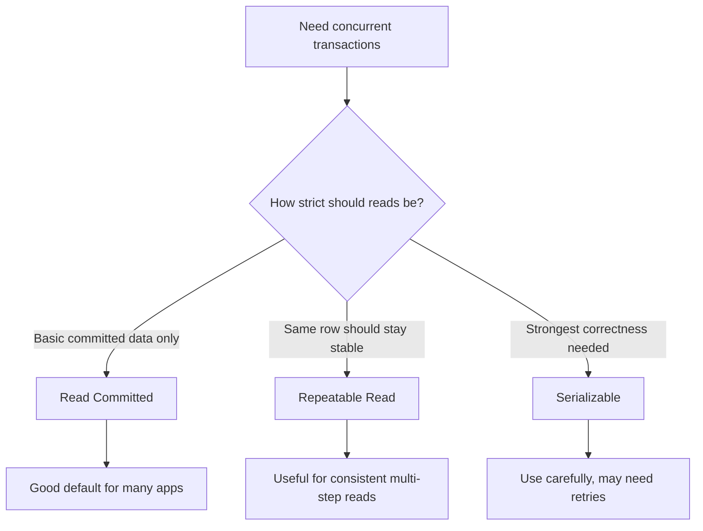

### Interview Summary

I would explain it like this:

> Isolation levels control how transactions see each other's changes. Read committed prevents dirty reads and is a common default. Repeatable read gives consistent repeated reads inside the same transaction. Serializable is the strongest level and makes transactions behave like they ran one by one, but it can reduce concurrency and require retries. I choose the level based on correctness needs and performance tradeoffs.

### TLDR

Isolation levels control visibility between concurrent transactions. `READ COMMITTED` is a common default, `REPEATABLE READ` gives stable repeated reads, and `SERIALIZABLE` is strongest but can reduce concurrency.

---

## 5. What Are Optimistic and Pessimistic Locking?

### The Question

> *"What are optimistic locking and pessimistic locking in a database? When should we use each one?"*

### Answer

Locking is used to handle **concurrent updates**. If two users or services try to update the same data at the same time, locking helps prevent lost updates, inconsistent data, or double processing.

The two most common database locking approaches are:

| Lock Type | Basic Idea | Best For |
|---|---|---|
| Optimistic locking | Do not lock first; check whether data changed when updating | Conflicts are possible but not very frequent |
| Pessimistic locking | Lock the row first; other transactions wait | Conflicts are frequent or the update must be strictly serialized |

### Optimistic Locking

Optimistic locking assumes that conflicts are rare. The application reads a row with a `version` column. During update, it updates the row only if the version is still the same.

Example table:

```sql
CREATE TABLE user_approval_request (
    request_id UUID PRIMARY KEY,
    status VARCHAR(20) NOT NULL,
    reviewed_by UUID,
    version INT NOT NULL DEFAULT 0
);
```

Admin A and Admin B both read the same row:

```text
request_id = R1
status = PENDING
version = 3
```

Admin A approves:

```sql
UPDATE user_approval_request
SET status = 'APPROVED',
    reviewed_by = :adminId,
    version = version + 1
WHERE request_id = :requestId
  AND version = :oldVersion;
```

If the update count is `1`, the update succeeded. If the update count is `0`, another transaction already changed the row, so the application should reject the action or ask the user to refresh.

In JPA, optimistic locking is commonly implemented with `@Version`:

```java
@Version
private Integer version;
```

### Pessimistic Locking

Pessimistic locking locks the row before updating it. Other transactions trying to update the same row must wait until the first transaction commits or rolls back.

Example:

```sql
BEGIN;

SELECT *
FROM user_approval_request
WHERE request_id = :requestId
FOR UPDATE;

UPDATE user_approval_request
SET status = 'APPROVED',
    reviewed_by = :adminId
WHERE request_id = :requestId;

COMMIT;
```

This is useful when conflicts are common and we want strict serialization. But it should be used carefully because it can reduce concurrency and may cause waiting or deadlocks if transactions are long.

### Conditional Update

For many approval workflows, a simple conditional update is enough:

```sql
UPDATE user_approval_request
SET status = 'APPROVED',
    reviewed_by = :adminId
WHERE request_id = :requestId
  AND status = 'PENDING';
```

This works well because approve and reject are terminal state transitions. If the row is still `PENDING`, one admin wins. If zero rows are updated, someone else already approved or rejected it.

This is often simpler than taking an explicit pessimistic lock.

### Deterministic Lock Ordering

Sometimes people also mention **deterministic locking** or **consistent lock ordering**. This is not usually a separate database lock type like optimistic or pessimistic locking.

It means that when a transaction must lock multiple rows, every transaction locks them in the same predictable order. This reduces deadlock risk.

Example: if a money transfer updates two accounts, always lock the smaller account ID first:

```sql
SELECT *
FROM account
WHERE account_id IN (:fromAccountId, :toAccountId)
ORDER BY account_id
FOR UPDATE;
```

If every transaction follows the same order, two transactions are less likely to hold opposite locks and wait on each other.

### Locking Flow

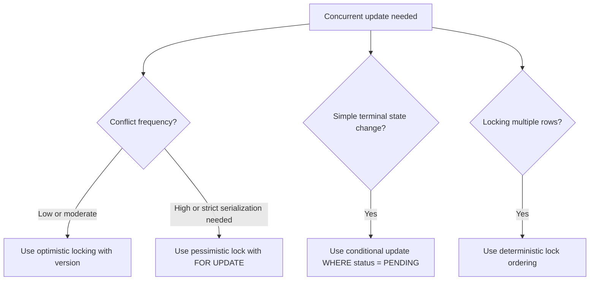

### TLDR

Optimistic locking uses a version check and fails if someone changed the row first. Pessimistic locking locks the row with `FOR UPDATE` so others wait. For approve/reject workflows, a conditional update like `WHERE status = 'PENDING'` is often the cleanest solution.

---

## 6. What Is a Database Deadlock and How Do You Prevent It?

### The Question

> *"What is a database deadlock, why does it happen, and how do we prevent it?"*

### Answer

A **deadlock** happens when two or more transactions wait for each other forever because each transaction holds a lock that the other transaction needs.

Example:

1. Transaction A locks account `A1`.
2. Transaction B locks account `A2`.
3. Transaction A tries to lock `A2` and waits.
4. Transaction B tries to lock `A1` and waits.

Now both transactions are stuck.

### Deadlock Example

Transaction A:

```sql
BEGIN;

SELECT *
FROM account
WHERE account_id = 'A1'
FOR UPDATE;

SELECT *
FROM account
WHERE account_id = 'A2'
FOR UPDATE;

COMMIT;
```

Transaction B:

```sql
BEGIN;

SELECT *
FROM account
WHERE account_id = 'A2'
FOR UPDATE;

SELECT *
FROM account
WHERE account_id = 'A1'
FOR UPDATE;

COMMIT;
```

Transaction A locks `A1` first, while Transaction B locks `A2` first. Then both wait for each other.

### How Databases Handle Deadlocks

Most databases detect deadlocks automatically. When a deadlock is found, the database kills or rolls back one transaction so the other can continue.

The application should catch the deadlock error and retry the failed transaction if it is safe to retry.

### How to Prevent Deadlocks

- Lock rows in a consistent order.
- Keep transactions short.
- Avoid user calls, API calls, or long processing inside a DB transaction.
- Add proper indexes so updates lock fewer rows.
- Retry failed transactions when the operation is idempotent.
- Use the right isolation level; do not use stronger isolation than needed.

### Consistent Lock Ordering Example

If transferring money between two accounts, always lock the smaller account ID first.

```sql
SELECT *
FROM account
WHERE account_id IN (:fromAccountId, :toAccountId)
ORDER BY account_id
FOR UPDATE;
```

This makes all transactions acquire locks in the same order and reduces deadlock risk.

### Deadlock Flow

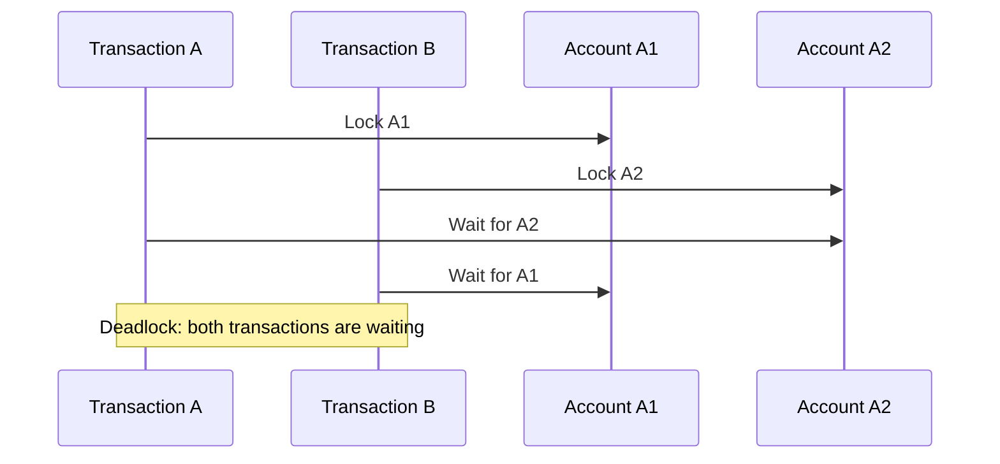

### Interview Summary

I would explain it like this:

> A deadlock happens when two transactions hold locks and each waits for the other to release its lock. For example, one transaction locks account A then B, while another locks B then A. Databases usually detect this and roll back one transaction. To prevent deadlocks, keep transactions short, lock rows in a consistent order, add proper indexes, avoid long work inside transactions, and retry safe operations.

### TLDR

A deadlock happens when transactions wait on each other's locks. Prevent it by keeping transactions short, locking rows in a fixed order, using proper indexes, and retrying safe failed transactions.

---

## 7. What Is the Difference Between Primary Key and Unique Key?

### The Question

> *"What is the difference between a primary key and a unique key? Can you explain with an example?"*

### Answer

A **primary key** uniquely identifies each row in a table. A **unique key** also prevents duplicate values, but it is used for additional columns that must be unique.

Simple way to remember:

- **Primary key**: main identity of the row.
- **Unique key**: another business value that should not be duplicated.

Example:

```sql
CREATE TABLE users (
    user_id UUID PRIMARY KEY,
    email VARCHAR(255) UNIQUE,
    mobile_number VARCHAR(20) UNIQUE,
    name VARCHAR(255) NOT NULL
);
```

Here:

- `user_id` is the primary key because it uniquely identifies the user row.
- `email` is unique because two users should not have the same email.
- `mobile_number` is unique because two users should not share the same mobile number.

### Main Differences

| Point | Primary Key | Unique Key |
|---|---|---|
| Purpose | Main identifier for a row | Prevents duplicate values in a column |
| Number per table | Usually one primary key | Can have multiple unique keys |
| Null value | Cannot be `NULL` | May allow `NULL` depending on database |
| Default indexing | Automatically indexed | Automatically indexed in most databases |
| Foreign key reference | Commonly referenced by foreign keys | Can also be referenced, but less common |

### Primary Key Example

```sql
CREATE TABLE orders (
    order_id UUID PRIMARY KEY,
    user_id UUID NOT NULL,
    amount DECIMAL(10, 2) NOT NULL
);
```

`order_id` uniquely identifies each order.

### Unique Key Example

```sql
CREATE TABLE users (
    user_id UUID PRIMARY KEY,
    email VARCHAR(255) NOT NULL,
    CONSTRAINT uk_users_email UNIQUE (email)
);
```

`email` is not the main row identity, but it must still be unique.

### Composite Primary Key

A primary key can also be made from multiple columns.

```sql
CREATE TABLE order_items (
    order_id UUID NOT NULL,
    product_id UUID NOT NULL,
    quantity INT NOT NULL,
    PRIMARY KEY (order_id, product_id)
);
```

This means the same product can appear only once per order.

### Composite Unique Key

A unique key can also be made from multiple columns.

```sql
CREATE TABLE user_roles (
    user_id UUID NOT NULL,
    role_name VARCHAR(50) NOT NULL,
    CONSTRAINT uk_user_roles_user_role UNIQUE (user_id, role_name)
);
```

This prevents assigning the same role to the same user multiple times.

### Relationship Example

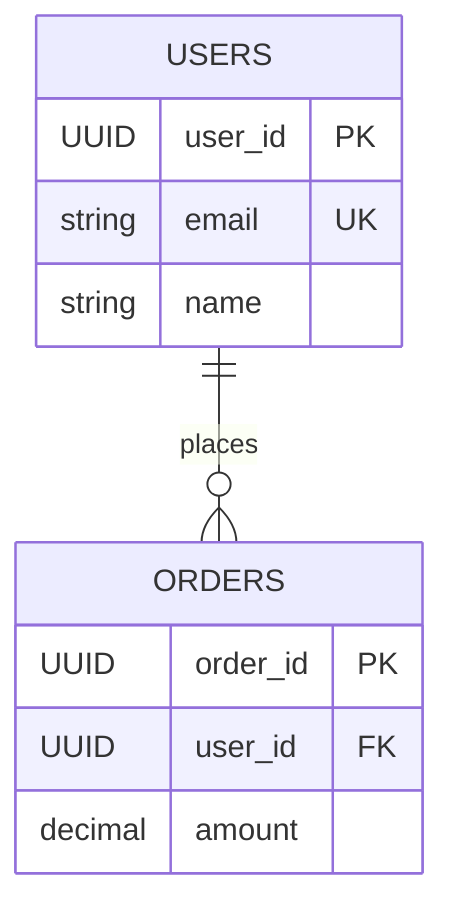

In this example, `users.user_id` is the primary key and `users.email` is a unique key. The `orders.user_id` column is a foreign key pointing to the user.

### Interview Summary

I would explain it like this:

> A primary key is the main identifier of a row and cannot be null. A unique key also enforces uniqueness, but it is used for additional business columns like email, mobile number, or username. A table usually has one primary key, but it can have multiple unique keys. For example, in a `users` table, `user_id` can be the primary key, while `email` and `mobile_number` can be unique keys.

### TLDR

A primary key uniquely identifies the row, while a unique key prevents duplicate values in other important columns. Use primary key for row identity, and unique key for business fields like email, username, or mobile number.

---

## 8. What Is a SQL Hint?

### The Question

> *"What is a SQL hint, why do we use it, and can you give an example?"*

### Answer

A **SQL hint** is an instruction given to the database optimizer to influence how it executes a query.

Normally, the database optimizer decides the execution plan by itself. It chooses things like:

- which index to use
- join order
- join algorithm
- whether to use parallel execution
- whether to scan a table or use an index

A hint tells the optimizer: **"Prefer this execution strategy for this query."**

### Why We Use SQL Hints

Hints are used when the optimizer chooses a bad plan even though a better path exists. This can happen when:

- table statistics are outdated
- data distribution is skewed
- the optimizer chooses the wrong index
- the query is very complex
- a critical query needs predictable performance

But hints should not be the first solution. Usually we should first check the query plan, create the right indexes, update statistics, and rewrite the query if needed.

### Oracle Hint Example

In Oracle, hints are written inside comments after `SELECT`.

```sql
SELECT /*+ INDEX(u idx_users_email) */
       u.user_id,
       u.name,
       u.email
FROM users u
WHERE u.email = 'ravi@example.com';
```

This tells Oracle to prefer the `idx_users_email` index for the `users` table alias `u`.

### MySQL Index Hint Example

In MySQL, we can use `FORCE INDEX`:

```sql
SELECT user_id, name, email
FROM users FORCE INDEX (idx_users_email)
WHERE email = 'ravi@example.com';
```

This tells MySQL to use the given index for this query.

### Join Order Hint Example

Some databases allow hints that influence join order or join method.

Example idea:

```sql
SELECT /*+ LEADING(o u) USE_NL(u) */
       o.order_id,
       u.name
FROM orders o
JOIN users u ON o.user_id = u.user_id
WHERE o.status = 'COMPLETED';
```

This asks the database to start with `orders` and use a nested-loop join for `users`.

### Query Plan Flow

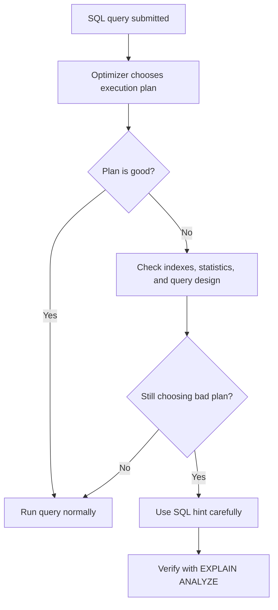

### Important Notes

- Hints are database-specific. Oracle, MySQL, SQL Server, and PostgreSQL handle them differently.
- PostgreSQL does not support optimizer hints natively in the same way Oracle does.
- Hints can become wrong later when data volume or data distribution changes.
- A hint can hide a deeper issue, such as missing indexes or stale statistics.
- Always verify with `EXPLAIN` or `EXPLAIN ANALYZE`.

### Interview Summary

I would explain it like this:

> A SQL hint is a way to guide the database optimizer when it is choosing an inefficient execution plan. For example, in Oracle we can use an index hint like `/*+ INDEX(u idx_users_email) */`, and in MySQL we can use `FORCE INDEX`. But I would not use hints as the first option. First I would check the query plan, indexes, statistics, and query design. I would use hints only for critical cases where the optimizer still chooses the wrong plan, because hints are database-specific and can become harmful as data changes.

### TLDR

A SQL hint guides the optimizer to use a specific execution strategy, such as a particular index or join method. Use it carefully after checking indexes, statistics, and the query plan, because hints are database-specific and can become stale.

---

## 9. What Is EXPLAIN in SQL?

### The Question

> *"What is `EXPLAIN` in SQL, why do we use it, and how does it help in query optimization?"*

### Answer

`EXPLAIN` shows the **query execution plan**. It tells us how the database plans to run a SQL query.

For example, it can show:

- whether the database will scan the full table
- whether it will use an index
- which join method it will use
- estimated number of rows
- estimated cost of the query
- order of table access

This is very useful when a query is slow, because we can see whether the database is doing something expensive, like scanning millions of rows.

### Basic Example

```sql
EXPLAIN
SELECT user_id, name, email
FROM users
WHERE email = 'ravi@example.com';
```

If there is no index on `email`, the plan may show a full table scan or sequential scan.

After adding an index:

```sql
CREATE INDEX idx_users_email
ON users (email);
```

Run `EXPLAIN` again:

```sql
EXPLAIN
SELECT user_id, name, email
FROM users
WHERE email = 'ravi@example.com';
```

Now the plan should ideally show that the database is using the email index.

### EXPLAIN vs EXPLAIN ANALYZE

`EXPLAIN` only shows the estimated plan. It does not actually run the query in many databases.

`EXPLAIN ANALYZE` runs the query and shows the actual runtime details.

PostgreSQL example:

```sql
EXPLAIN ANALYZE
SELECT user_id, name, email
FROM users
WHERE email = 'ravi@example.com';
```

`EXPLAIN ANALYZE` can show:

- actual execution time
- actual rows returned
- whether estimates were wrong
- where most time was spent

### Example Output Meaning

If we see something like this:

```text
Seq Scan on users
Filter: (email = 'ravi@example.com')
```

It means the database is scanning the table row by row. For a large table, this can be slow.

If we see something like this:

```text
Index Scan using idx_users_email on users
Index Cond: (email = 'ravi@example.com')
```

It means the database is using the index, which is usually faster for selective lookups.

### Query Optimization Flow

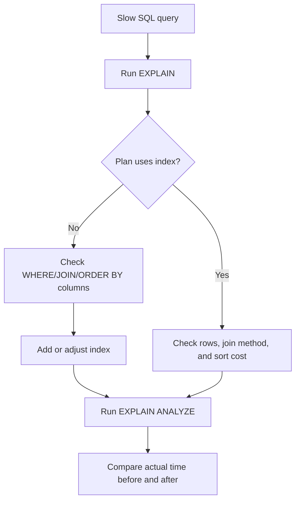

### What to Check in EXPLAIN

- **Sequential scan / full table scan**: may be slow on large tables.
- **Index scan**: usually good when filtering a small number of rows.
- **Nested loop join**: good for small datasets, but can be slow for large joins.
- **Hash join / merge join**: often better for larger joins.
- **Sort operation**: may be expensive if many rows are sorted.
- **Estimated rows vs actual rows**: if very different, table statistics may be outdated.

### Interview Summary

I would explain it like this:

> `EXPLAIN` shows the execution plan of a SQL query. It helps us understand whether the database is using an index, doing a full table scan, sorting many rows, or using an expensive join strategy. For performance debugging, I use `EXPLAIN` first to understand the plan, and `EXPLAIN ANALYZE` to run the query and compare actual execution time. This helps confirm whether an index or query rewrite actually improved performance.

### TLDR

`EXPLAIN` shows how the database plans to execute a query. Use it to check scans, index usage, join strategy, row estimates, and cost; use `EXPLAIN ANALYZE` when you need actual runtime numbers.

---

## 10. What Is Normalization and Denormalization?

### The Question

> *"What is normalization and denormalization in a database? When should we use each one?"*

### Answer

**Normalization** means organizing data into separate related tables to reduce duplication and keep data consistent.

Example normalized design:

```sql
CREATE TABLE users (
    user_id UUID PRIMARY KEY,
    name VARCHAR(255) NOT NULL,
    email VARCHAR(255) UNIQUE
);

CREATE TABLE orders (
    order_id UUID PRIMARY KEY,
    user_id UUID NOT NULL,
    amount DECIMAL(10, 2) NOT NULL,
    CONSTRAINT fk_orders_user FOREIGN KEY (user_id) REFERENCES users(user_id)
);
```

Here, user details are stored once in `users`, and orders refer to the user using `user_id`.

**Denormalization** means storing some duplicate or precomputed data to make reads faster.

Example denormalized design:

```sql
CREATE TABLE order_summary (
    order_id UUID PRIMARY KEY,
    user_id UUID NOT NULL,
    user_name VARCHAR(255) NOT NULL,
    user_email VARCHAR(255) NOT NULL,
    amount DECIMAL(10, 2) NOT NULL
);
```

Here, `user_name` and `user_email` are copied into the summary table so reporting queries do not need to join `orders` and `users`.

### When to Use Normalization

- Data consistency is more important.
- Same information should not be duplicated in many places.
- Transactional systems like user management, payments, and order processing.
- Updates should happen in one place.

### When to Use Denormalization

- Read performance is more important.
- Reports or dashboards need fast queries.
- Joins are too expensive at large scale.
- Data is read often but updated less frequently.

### Tradeoff

Normalization reduces duplicate data but may require more joins. Denormalization improves read speed but creates duplicate data, so we need a strategy to keep copies updated.

### Flow

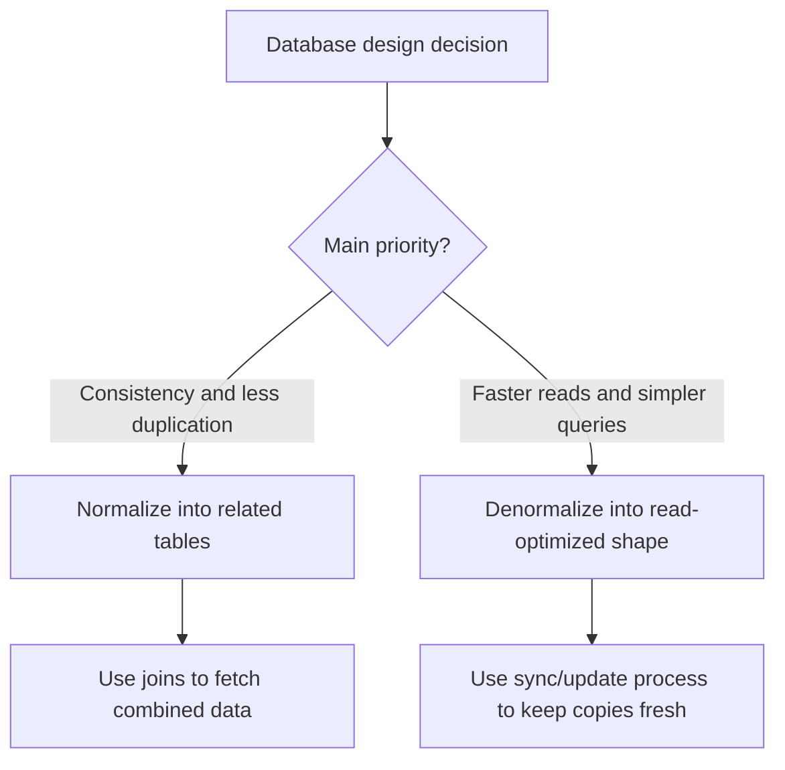

### Interview Summary

I would explain it like this:

> Normalization splits data into related tables to avoid duplication and maintain consistency. Denormalization intentionally duplicates or precomputes data to improve read performance. In transactional systems, I prefer normalized design first. For reporting or high-read APIs, I may denormalize into a read-optimized table or materialized view, but then I need a reliable way to keep that data updated.

### TLDR

Normalization reduces duplication and improves consistency. Denormalization duplicates or precomputes data to make reads faster, but it needs extra care to keep copied data correct.

---

## 11. What Is the N+1 Query Problem?

### The Question

> *"What is the N+1 query problem, why is it bad, and how do we solve it?"*

### Answer

The **N+1 query problem** happens when the application runs one query to fetch a list of records, then runs one extra query for each record in that list.

Example:

1. Fetch 100 orders.
2. For each order, fetch the user separately.

That becomes:

- 1 query for orders
- 100 queries for users
- total 101 queries

This is why it is called N+1.

### Problem Example

```sql
SELECT order_id, user_id, amount
FROM orders
LIMIT 100;
```

Then the application runs this for every order:

```sql
SELECT user_id, name, email
FROM users
WHERE user_id = :userId;
```

For 100 orders, this creates 101 database calls. Under load, this can cause slow APIs, high DB CPU, and connection pool exhaustion.

### Better Query With JOIN

```sql
SELECT o.order_id,
       o.amount,
       u.user_id,
       u.name,
       u.email
FROM orders o
JOIN users u ON o.user_id = u.user_id
LIMIT 100;
```

This gets the required order and user data in one query.

### Spring Boot / JPA Example

In JPA, N+1 often happens because of lazy loading:

```java
List<Order> orders = orderRepository.findAll();

for (Order order : orders) {
    System.out.println(order.getUser().getName());
}
```

If `user` is lazy-loaded, JPA may run one query for orders and then one query per order for users.

Common fixes:

- Use `JOIN FETCH`.
- Use `@EntityGraph`.
- Use DTO projection.
- Batch fetch related data.

Example `JOIN FETCH`:

```java
@Query("select o from Order o join fetch o.user")
List<Order> findOrdersWithUsers();
```

### Flow

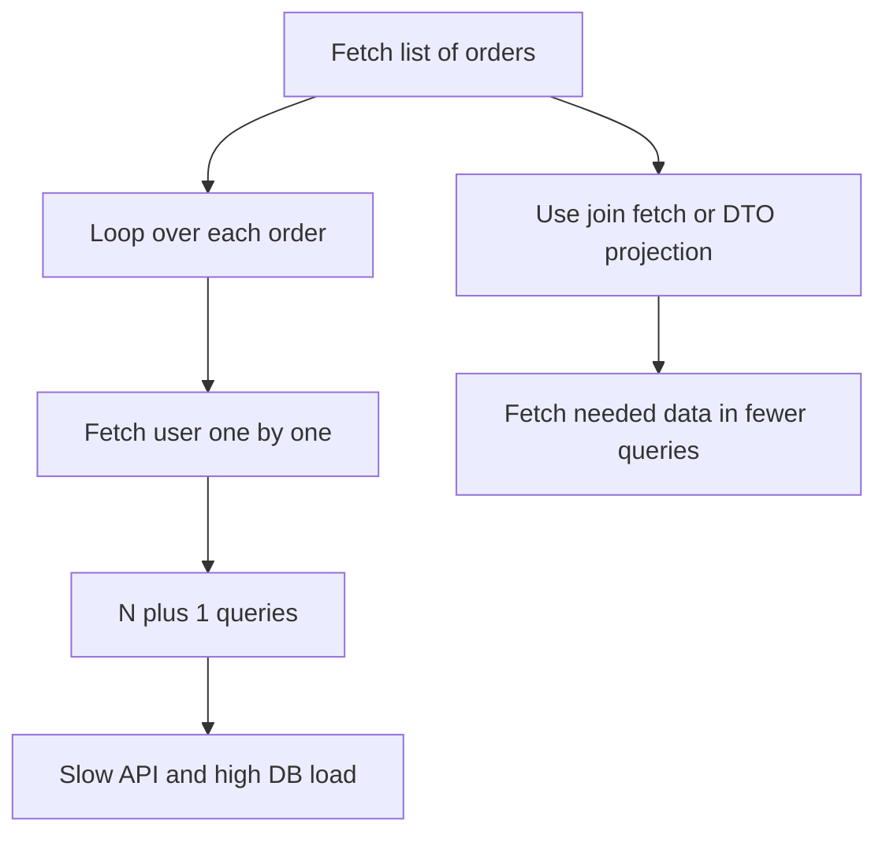

### Interview Summary

I would explain it like this:

> N+1 happens when the application fetches a list with one query and then fetches related data one row at a time. For example, one query fetches 100 orders and then 100 more queries fetch users. This is inefficient. I would solve it using a join, JPA `JOIN FETCH`, `@EntityGraph`, DTO projection, or batching, depending on the use case.

### TLDR

N+1 means one query for the main list plus one query per row for related data. Fix it by fetching related data intentionally with joins, fetch joins, entity graphs, DTO projections, or batching.

---

## 12. What Is the Difference Between Offset and Cursor Pagination?

### The Question

> *"What is the difference between offset pagination and cursor or keyset pagination? Which one should we use for large tables?"*

### Answer

Pagination is used when an API returns a list of records in smaller pages instead of returning everything at once.

### Offset Pagination

Offset pagination uses `LIMIT` and `OFFSET`.

```sql
SELECT order_id, amount, created_at
FROM orders
ORDER BY created_at DESC
LIMIT 20 OFFSET 100;
```

This means: skip 100 rows, then return 20 rows.

Offset pagination is simple and works well for small or moderate datasets. It is also easy for page numbers like page 1, page 2, page 3.

But for very large offsets, it can become slow because the database may still need to walk through skipped rows.

### Cursor / Keyset Pagination

Cursor pagination uses the last seen value from the previous page.

```sql
SELECT order_id, amount, created_at
FROM orders
WHERE created_at < :lastSeenCreatedAt
ORDER BY created_at DESC
LIMIT 20;
```

Instead of saying "skip 10000 rows", it says "continue after the last item I already saw."

For stable ordering, it is better to include a tie-breaker column such as `order_id`:

```sql
SELECT order_id, amount, created_at
FROM orders
WHERE (created_at, order_id) < (:lastSeenCreatedAt, :lastSeenOrderId)
ORDER BY created_at DESC, order_id DESC
LIMIT 20;
```

This works well with an index:

```sql
CREATE INDEX idx_orders_created_at_order_id
ON orders (created_at DESC, order_id DESC);
```

### Comparison

| Point | Offset Pagination | Cursor / Keyset Pagination |
|---|---|---|
| Query style | `LIMIT` + `OFFSET` | `WHERE value < lastSeenValue` |
| Best for | Small/medium lists, page numbers | Large tables, infinite scroll, APIs |
| Deep page performance | Can become slow | Usually faster |
| Consistency with new rows | Can skip or duplicate rows | More stable |
| Jump to page number | Easy | Not easy |

### Flow

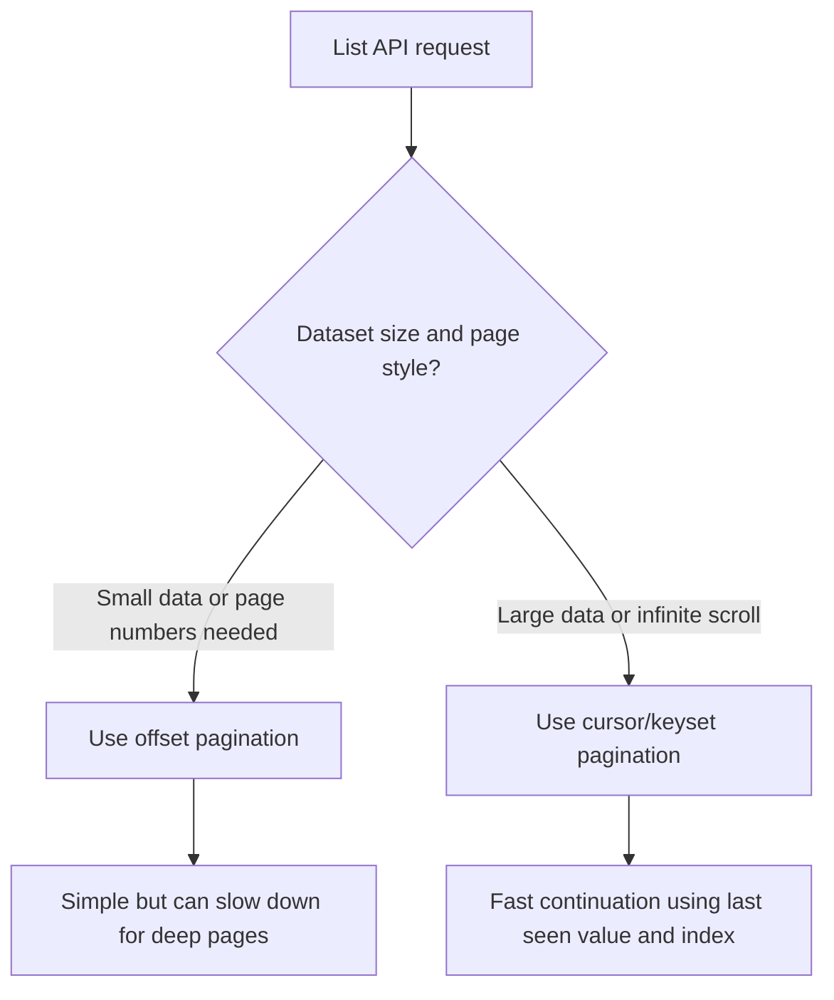

### Interview Summary

I would explain it like this:

> Offset pagination uses `LIMIT` and `OFFSET`, so it is simple and good for small datasets or page-number based UIs. But at deep pages, the database still has to skip many rows, so it becomes slower. Cursor or keyset pagination uses the last seen value, such as `created_at` and `id`, to fetch the next page. It is better for large tables and APIs because it can use an index efficiently and avoids expensive skipping.

### TLDR

Offset pagination is simple but can become slow for deep pages. Cursor/keyset pagination uses the last seen value and an index, so it is better for large datasets and infinite-scroll APIs.

---

## Interview Q&A

## 13. How Do You Optimize a Slow Query on a Large Table?

### The Question

> *"Suppose there is a large table and one API query is becoming slow as data grows. How do you improve the query so it does not take a lot of time?"*

### Short Answer

First identify the exact query pattern: which columns are used in `WHERE`, `JOIN`, `ORDER BY`, and pagination. Then create an index that matches that access pattern, return only required columns, paginate the response, and verify the improvement with `EXPLAIN ANALYZE`.

For example, if the API asks for **users approved by a specific admin**, and the query filters by `approved_by`, filters only approved users, and sorts by latest approval time, then a good composite index is:

```sql
CREATE INDEX idx_user_approval_approved_by_status_approved_at
ON user_approval_request (approved_by, status, approved_at DESC);
```

Then use pagination and verify the query using `EXPLAIN ANALYZE`.

### Example: Approved Users by Admin

```sql
CREATE TABLE user_approval_request (
    request_id UUID PRIMARY KEY,
    user_id UUID,
    name VARCHAR(255) NOT NULL,
    email VARCHAR(255) NOT NULL,
    status VARCHAR(20) NOT NULL,
    approved_by UUID,
    approved_at TIMESTAMP,
    rejected_by UUID,
    rejected_at TIMESTAMP,
    created_at TIMESTAMP NOT NULL
);
```

Here, `approved_by` stores the admin ID who approved the request.

### Slow Query Example

```sql
SELECT user_id, name, email, approved_at
FROM user_approval_request
WHERE approved_by = :adminId
  AND status = 'APPROVED'
ORDER BY approved_at DESC;
```

If the table has millions of rows and there is no proper index, the database may scan a large part of the table to find matching records. This becomes slower as the table grows.

### Optimized Query With Pagination

```sql
SELECT user_id, name, email, approved_at
FROM user_approval_request
WHERE approved_by = :adminId
  AND status = 'APPROVED'
ORDER BY approved_at DESC
LIMIT 50 OFFSET 0;
```

This is better because the API returns only one page of data instead of loading all approved users at once.

For very large data, cursor pagination is usually better than high-offset pagination:

```sql
SELECT user_id, name, email, approved_at
FROM user_approval_request
WHERE approved_by = :adminId
  AND status = 'APPROVED'
  AND approved_at < :lastSeenApprovedAt
ORDER BY approved_at DESC
LIMIT 50;
```

This avoids the database skipping thousands or millions of rows when the user goes to later pages.

### Recommended Index

```sql
CREATE INDEX idx_user_approval_approved_by_status_approved_at
ON user_approval_request (approved_by, status, approved_at DESC);
```

Why this order?

1. `approved_by` is used to find records for one admin.
2. `status` is used to return only approved records.
3. `approved_at DESC` helps the database return the latest approved users without doing a separate expensive sort.

With this index, the database can quickly find rows for one admin, filter approved rows, and return them in the required order.

### Query Flow

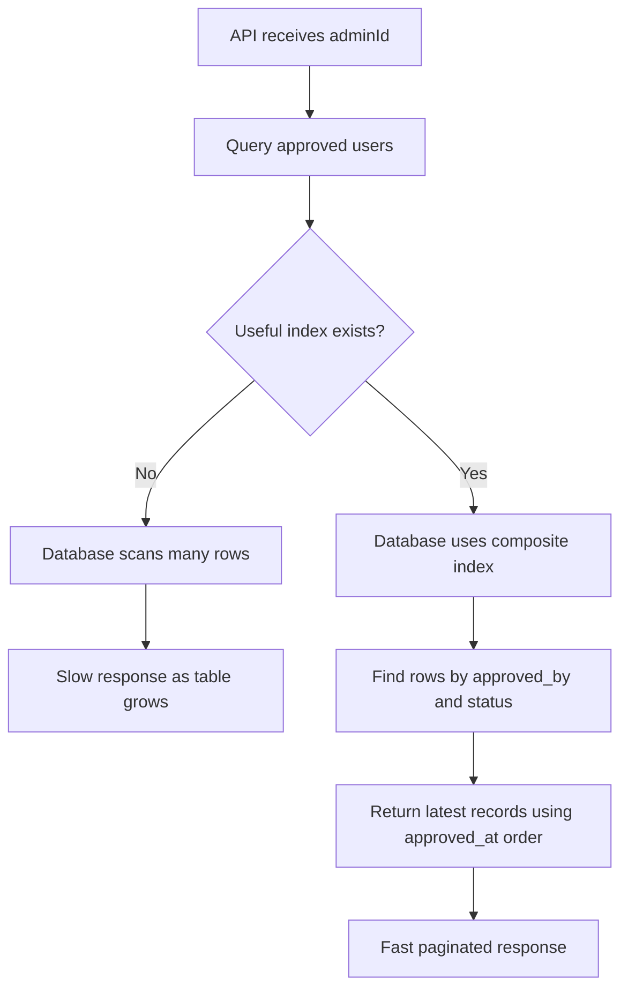

### Check With `EXPLAIN ANALYZE`

After adding the index, always verify the query plan:

```sql
EXPLAIN ANALYZE
SELECT user_id, name, email, approved_at
FROM user_approval_request
WHERE approved_by = 'admin-id'
  AND status = 'APPROVED'
ORDER BY approved_at DESC
LIMIT 50;
```

Look for an index scan using the new index. If the database is still doing a sequential scan, check:

- Whether the query condition matches the index columns.
- Whether the table statistics are updated.
- Whether the selected admin has too many matching rows.
- Whether the query is selecting large columns unnecessarily.

### Avoid `SELECT *`

Do not fetch every column if the API only needs a list view.

Bad:

```sql
SELECT *
FROM user_approval_request
WHERE approved_by = :adminId;
```

Better:

```sql
SELECT user_id, name, email, approved_at
FROM user_approval_request
WHERE approved_by = :adminId
  AND status = 'APPROVED'
ORDER BY approved_at DESC
LIMIT 50;
```

If the table has large JSON, document, address, profile, or metadata columns, avoiding `SELECT *` can reduce I/O and improve response time.

### Partial Index Option

If most queries only fetch approved users, and rejected or pending rows are not needed for this API, a partial index can be useful in PostgreSQL:

```sql
CREATE INDEX idx_approved_requests_by_admin
ON user_approval_request (approved_by, approved_at DESC)
WHERE status = 'APPROVED';
```

This index is smaller because it only stores approved rows. Smaller indexes are faster to scan and cheaper to keep in memory.

### Covering Index Option

If the list API always returns the same small set of columns, PostgreSQL can use an included-column index:

```sql
CREATE INDEX idx_user_approval_admin_approved_at_covering
ON user_approval_request (approved_by, status, approved_at DESC)
INCLUDE (user_id, name, email);
```

This can allow an index-only scan when visibility conditions are favorable, because the database can serve the query from the index without reading the full table rows.

### Partitioning for Very Large Tables

If the table grows extremely large, partitioning can help. For example, partition by `approved_at` month or year:

```text
user_approval_request_2026_01
user_approval_request_2026_02
user_approval_request_2026_03
```

Partitioning is useful when queries usually filter by date range, such as:

```sql
WHERE approved_by = :adminId
  AND status = 'APPROVED'
  AND approved_at >= :fromDate
  AND approved_at < :toDate
```

If there is no date filter, partitioning may not help much because the database may still need to check many partitions.

### Caching or Read Model

If the same admin-approved list is requested very frequently, caching can help:

- Cache the first page in Redis.
- Cache total counts separately.
- Invalidate cache when a new request is approved or rejected.

For reporting-heavy systems, we can also maintain a separate read-optimized table or materialized view. But this is usually a later optimization. The first step should be a correct index and pagination.

### Important Production Considerations

- Add indexes based on real query patterns, not guesswork.
- Use `EXPLAIN ANALYZE` before and after adding the index.
- Keep indexes limited, because every index slows down insert and update operations.
- Use pagination for every list API.
- Prefer cursor pagination for large datasets.
- Select only required columns.
- Consider a partial index if only approved rows are queried.
- Consider partitioning only when the table is very large and queries include a partition-friendly filter like date.

### Interview Summary

I would explain it like this:

> I would first check the exact query pattern. If the API needs to fetch users approved by a specific admin, I would create an index on `approved_by`. If the query also filters by `status` and sorts by `approved_at`, I would create a composite index like `(approved_by, status, approved_at DESC)`. Then I would make the API paginated so it never returns all rows at once. I would verify the improvement using `EXPLAIN ANALYZE` and confirm the database uses an index scan instead of a full table scan. For very large tables, I may consider a partial index for only approved rows, cursor pagination, partitioning by date, or a cached read model, but the first practical fix is the right index plus pagination.

### TLDR

Create an index that matches the query pattern, usually `(approved_by, status, approved_at DESC)`, and always paginate the API response. Verify with `EXPLAIN ANALYZE`; for very large tables, consider cursor pagination, partial indexes, partitioning, or a read-optimized cache.
