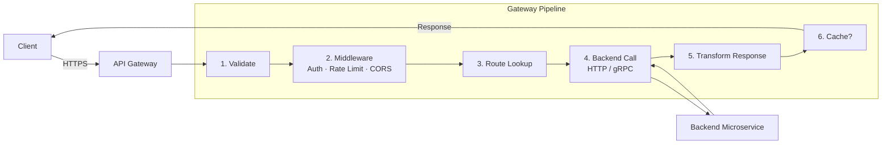
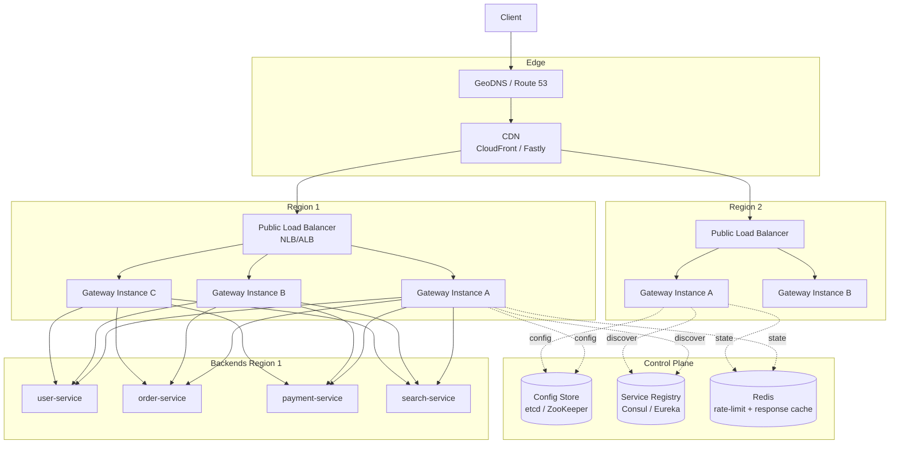
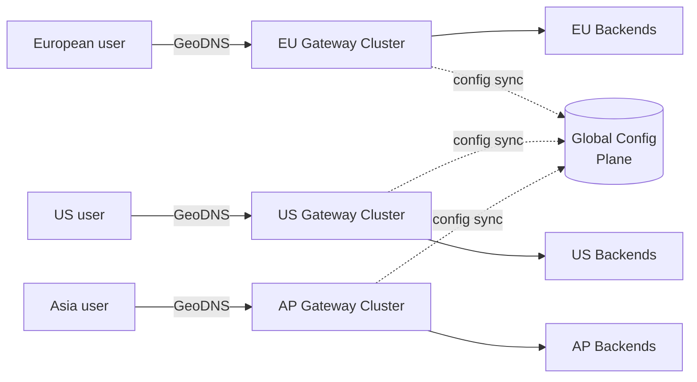
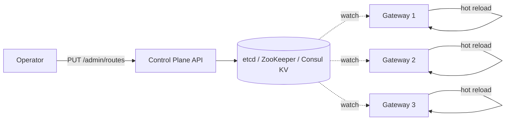
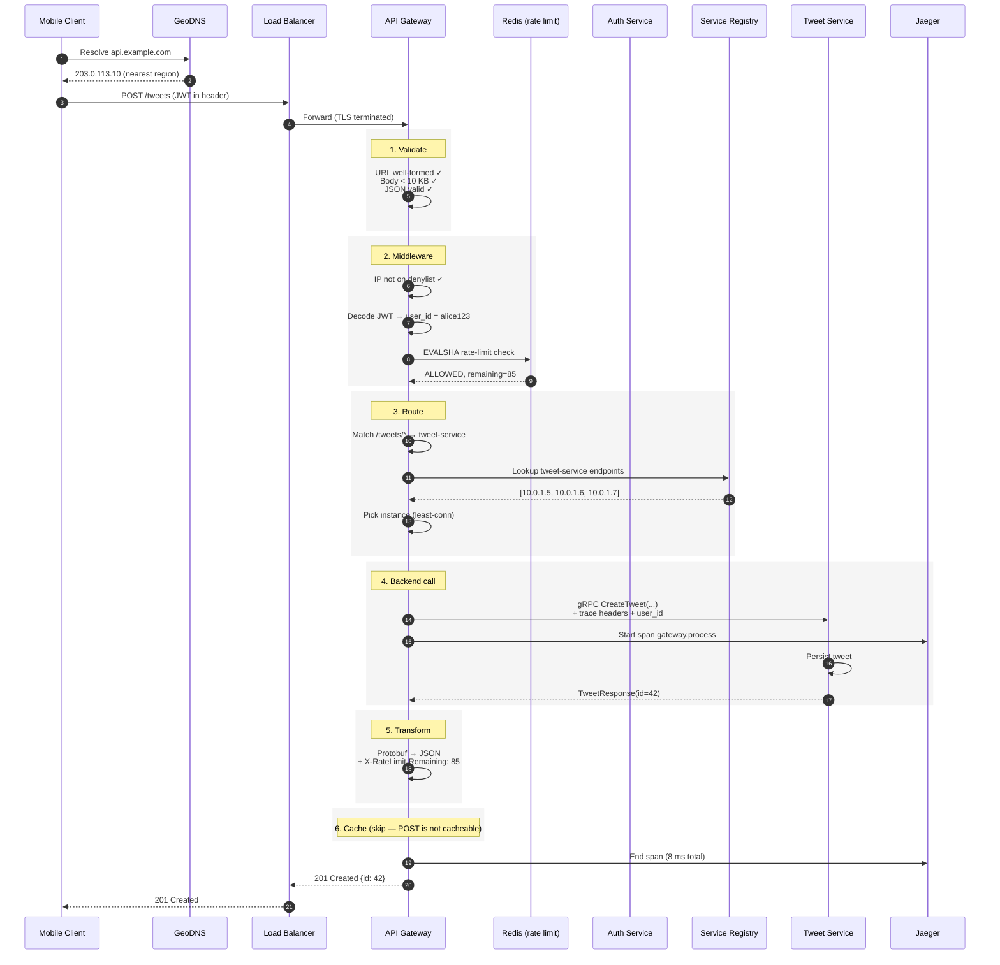

# API Gateway — System Design Deep Dive

> A comprehensive guide covering architecture, responsibilities, scaling, and interview expectations for designing an API Gateway. Based on the Hello Interview deep dive plus production patterns from AWS API Gateway, Kong, NGINX, and Envoy.

---

## Table of Contents

- [1. Understanding the Problem](#1-understanding-the-problem)
  - [1.1 What is an API Gateway?](#11-what-is-an-api-gateway)
  - [1.2 The Hotel Front Desk Analogy](#12-the-hotel-front-desk-analogy)
  - [1.3 Why API Gateways Emerged — Microservices](#13-why-api-gateways-emerged--microservices)
  - [1.4 Functional Requirements](#14-functional-requirements)
  - [1.5 Non-Functional Requirements](#15-non-functional-requirements)
- [2. The Set Up](#2-the-set-up)
  - [2.1 Core Entities](#21-core-entities)
  - [2.2 System Interface](#22-system-interface)
- [3. Core Responsibilities — Tracing a Request](#3-core-responsibilities--tracing-a-request)
  - [3.1 Step 1 — Request Validation](#31-step-1--request-validation)
  - [3.2 Step 2 — Middleware Pipeline](#32-step-2--middleware-pipeline)
  - [3.3 Step 3 — Routing](#33-step-3--routing)
  - [3.4 Step 4 — Backend Communication & Protocol Translation](#34-step-4--backend-communication--protocol-translation)
  - [3.5 Step 5 — Response Transformation](#35-step-5--response-transformation)
  - [3.6 Step 6 — Caching](#36-step-6--caching)
- [4. High-Level Architecture](#4-high-level-architecture)
- [5. Deep Dives](#5-deep-dives)
  - [5.1 Scaling — Horizontal Scaling](#51-scaling--horizontal-scaling)
  - [5.2 Scaling — Global Distribution](#52-scaling--global-distribution)
  - [5.3 High Availability & Fault Tolerance](#53-high-availability--fault-tolerance)
  - [5.4 Service Discovery Integration](#54-service-discovery-integration)
  - [5.5 Observability — Logging, Metrics, Tracing](#55-observability--logging-metrics-tracing)
  - [5.6 Security Hardening](#56-security-hardening)
  - [5.7 Configuration Management](#57-configuration-management)
- [6. Popular API Gateways](#6-popular-api-gateways)
  - [6.1 Managed Services](#61-managed-services)
  - [6.2 Open Source Solutions](#62-open-source-solutions)
  - [6.3 Comparison Matrix](#63-comparison-matrix)
- [7. API Gateway vs. Load Balancer vs. Service Mesh vs. BFF](#7-api-gateway-vs-load-balancer-vs-service-mesh-vs-bff)
- [8. When to Propose an API Gateway](#8-when-to-propose-an-api-gateway)
- [9. End-to-End Request Flow Walkthrough](#9-end-to-end-request-flow-walkthrough)
- [10. Common Interview Questions & Model Answers](#10-common-interview-questions--model-answers)
- [11. Architecture Decision Records (ADRs)](#11-architecture-decision-records-adrs)
- [12. Quick Reference Cheat Sheet](#12-quick-reference-cheat-sheet)
- [13. Glossary](#13-glossary)

---

## 1. Understanding the Problem

### 1.1 What is an API Gateway?

An **API Gateway** is a single entry point that sits in front of your backend services. It receives every client request, applies cross-cutting concerns (authentication, rate limiting, logging, etc.), and forwards the request to the appropriate backend service.

> "There's a good chance you've interacted with an API Gateway today, even if you didn't realize it." — *Hello Interview*

Think of it as a **reverse proxy with brains**. A vanilla reverse proxy forwards traffic; an API Gateway also enforces policy.

**One sentence definition:**
> An API Gateway is a server that acts as the single, policy-enforcing entry point between clients and a fleet of backend services.

### 1.2 The Hotel Front Desk Analogy

| Hotel | API Gateway |
|---|---|
| Guests arrive at the front desk | Clients send requests to the gateway |
| Guests don't go knock on the housekeeping office door | Clients don't talk to individual microservices |
| Front desk verifies reservation (ID check) | Gateway authenticates the request |
| Front desk enforces house rules ("no more than 4 guests per room") | Gateway enforces rate limits / quotas |
| Front desk routes the request to the right team (housekeeping, room service, concierge) | Gateway routes to the right microservice |
| Front desk delivers the response (towels, food) back to the room | Gateway returns the response to the client |

The hotel front desk pattern lets you reorganize back-office teams without ever confusing a guest. The same is true for microservices behind a gateway — you can split, merge, or rewrite services without breaking clients.

### 1.3 Why API Gateways Emerged — Microservices

```
Monolith Era (pre-gateway):
┌──────────┐
│  Client  │ ───▶ ┌──────────────┐
└──────────┘     │   Monolith    │
                 └──────────────┘

Microservices WITHOUT a gateway:
┌──────────┐ ───▶ ┌─────────────┐
│  Client  │ ───▶ ┌─────────────┐
│           │ ───▶ ┌─────────────┐
│           │ ───▶ ┌─────────────┐
└──────────┘     User / Order / Pay / Search / Notif / ...
   Client must know 12+ hostnames, auth schemes, retry rules.
   Every new service breaks every client.

Microservices WITH an API Gateway:
┌──────────┐     ┌─────────────┐     ┌────────────┐
│  Client  │ ───▶│ API Gateway │ ───▶│ Microsvcs  │
└──────────┘     └─────────────┘     └────────────┘
   One hostname. One auth scheme. Backend evolves freely.
```

As monoliths were broken down, the **N×M coupling problem** appeared: N clients had to know about M services. The gateway collapses this to **N → 1 → M**.

### 1.4 Functional Requirements

| # | Requirement |
|---|---|
| FR-1 | The gateway should expose a **single public endpoint** that all clients call |
| FR-2 | The gateway should **route** each request to the correct backend service based on path, method, headers, or query params |
| FR-3 | The gateway should **validate** incoming requests (URL well-formed, required headers/body present, payload size within limits) |
| FR-4 | The gateway should **authenticate** clients (JWT, API key, OAuth) and **authorize** access to specific routes |
| FR-5 | The gateway should **rate limit** and **throttle** abusive clients |
| FR-6 | The gateway should **transform** requests/responses between protocols (HTTP↔gRPC) and formats (JSON↔Protobuf) when needed |
| FR-7 | The gateway should optionally **cache** responses for cacheable GETs to reduce backend load |
| FR-8 | The gateway should **terminate SSL/TLS** so backends can speak plain HTTP internally |
| FR-9 | The gateway should **log, trace, and emit metrics** for every request |

**Out of scope (intentionally):**
- Business logic — the gateway should be thin
- Long-lived stateful connections in most designs (WebSockets are an exception, supported by some gateways)
- Heavy data processing or transformation pipelines

### 1.5 Non-Functional Requirements

| # | Requirement |
|---|---|
| NFR-1 | **Low latency overhead** — gateway processing should add **< 10 ms** p99 per request |
| NFR-2 | **Highly available** — target ≥ 99.99 % uptime (the gateway is on the critical path of every request) |
| NFR-3 | **Horizontally scalable** to millions of requests per second; instances must be **stateless** |
| NFR-4 | **Fault isolated** — failure in one backend service must not bring down the gateway |
| NFR-5 | **Secure by default** — TLS-only, sane authentication defaults, no credential leakage in logs |
| NFR-6 | **Observable** — every request emits structured logs, RED metrics (Rate/Errors/Duration), and a distributed trace span |

> **Key insight:** The gateway is on the **critical path for 100 % of traffic**. Its availability requirement is **strictly greater than** any single backend service's.

---

## 2. The Set Up

### 2.1 Core Entities

```
┌──────────┐       ┌────────────────┐       ┌──────────────────┐
│  Route   │──────▶│  Middleware    │──────▶│ Backend Service  │
└──────────┘       │   Pipeline     │       └──────────────────┘
                   └────────────────┘
```

| Entity | Description |
|---|---|
| **Route** | A rule mapping incoming requests (path + method + headers + query) to a backend service. E.g., `GET /users/*` → `user-service:8080`. |
| **Middleware** | A pluggable processing step run on every request. Examples: auth, rate-limiting, logging, response compression. Order matters. |
| **Backend Service** | The downstream microservice that actually handles the business logic. The gateway forwards the request and proxies the response. |
| **Client** | Anything calling the gateway — browser, mobile app, third-party developer, internal service. |
| **Policy / Plugin** | Configuration applied to a route or globally. E.g., "the `/admin/*` route requires `role=admin` and 10 req/s limit." |

### 2.2 System Interface

The API Gateway itself does not expose a business interface — it **exposes whatever your backend services expose**, unified under one host.

```
Client-facing surface (public):
  GET    https://api.example.com/users/{id}
  POST   https://api.example.com/orders
  GET    https://api.example.com/search?q=...
  POST   https://api.example.com/payments

Internal routing (private):
  /users/*    → http://user-service:8080
  /orders/*   → http://order-service:8081
  /search/*   → grpc://search-service:50051
  /payments/* → http://payment-service:8082
```

**Admin / control-plane interface:** Most gateways expose a separate admin API or dashboard to manage routes and policies.

```
PUT    /admin/routes/{routeId}        # create/update a route
DELETE /admin/routes/{routeId}        # remove a route
GET    /admin/routes                   # list routes
POST   /admin/plugins                   # attach a plugin (auth, rate-limit)
GET    /admin/metrics                   # observability
```

> **Security note:** The admin interface MUST be on a separate listener/port and locked down to the operations network — never expose `/admin/*` on the public internet.

---

## 3. Core Responsibilities — Tracing a Request

This is the heart of the deep dive. Every request flows through these six steps **in order**.



### 3.1 Step 1 — Request Validation

Before the gateway does anything expensive (auth, routing, cache lookup), it sanity-checks the request shape. This is **cheap rejection** — fail fast on garbage.

**What gets validated:**

| Check | Example failure | Response |
|---|---|---|
| URL is well-formed | `GET ///\\foo` | `400 Bad Request` |
| HTTP method allowed on the route | `DELETE /search` when only `GET` is configured | `405 Method Not Allowed` |
| Required headers present | Missing `Content-Type` on a `POST` with body | `400 Bad Request` |
| Body matches expected schema | Malformed JSON | `400 Bad Request` |
| Body size within limits | 50 MB upload on a 1 MB-limit route | `413 Payload Too Large` |
| API version supported | `GET /v99/users` | `404 Not Found` |

**Why it matters:** A malformed JSON payload from a buggy mobile app should be rejected in 100 µs at the edge — never propagated 4 hops deep into your service mesh where it will OOM a parser somewhere.

**Pseudocode:**

```java
public ValidationResult validate(HttpRequest req) {
    if (!isValidUri(req.getUri()))           return reject(400, "malformed URI");
    if (req.getContentLength() > MAX_BODY)   return reject(413, "payload too large");
    if (req.getMethod() == POST && req.getBody() != null) {
        if (!isValidJson(req.getBody()))     return reject(400, "invalid JSON");
    }
    Route route = routeTable.match(req);
    if (route == null)                        return reject(404, "no route");
    if (!route.allows(req.getMethod()))      return reject(405, "method not allowed");
    return ValidationResult.OK;
}
```

### 3.2 Step 2 — Middleware Pipeline

Middleware is the gateway's superpower. It's a chain of pluggable processors that run **before** the request is forwarded.

**Common middleware (in roughly the order they should run):**

| # | Middleware | Purpose | Failure response |
|---|---|---|---|
| 1 | **TLS termination** | Decrypt HTTPS so internal traffic is plain HTTP | `502 Bad Gateway` if cert expired |
| 2 | **IP allowlist / denylist** | Block bad actors at L3/L4 before spending CPU | `403 Forbidden` |
| 3 | **Authentication** | Verify identity via JWT, OAuth, API key, mTLS | `401 Unauthorized` |
| 4 | **Authorization** | Check permissions on the route | `403 Forbidden` |
| 5 | **Rate limiting / throttling** | Enforce per-client quotas | `429 Too Many Requests` |
| 6 | **Request size / quota check** | Enforce monthly data caps | `429` or `402 Payment Required` |
| 7 | **CORS handling** | Add `Access-Control-*` headers for browser clients | `403` on disallowed origin |
| 8 | **Request logging / tracing** | Generate request ID, start trace span | — |
| 9 | **Header injection** | Add `X-Forwarded-For`, `X-Request-Id`, propagate user identity to backend | — |
| 10 | **Response compression** | Gzip/Brotli the response | — |

> **Hello Interview tip:** *"The most popular and relevant to system design interviews are authentication, rate limiting, and IP whitelisting/blacklisting. My suggestion when introducing an API Gateway to your design is to simply mention 'I'll add an API Gateway to handle routing and basic middleware' and move on."*

#### Middleware Ordering Matters

The order is not arbitrary — **cheap rejections must come before expensive ones**:

```
✅ Correct order
IP denylist → Auth → Rate limit → Route → Backend
   1 µs       1 ms     2 ms       100 µs   50 ms

❌ Wrong order
Backend call → Auth (after the work is done — wasteful)
Rate limit → IP denylist (rate-limit DB hit for traffic we'd block anyway)
```

#### Pseudocode Pipeline

```java
public Response handle(HttpRequest req) {
    for (Middleware mw : pipeline) {            // ordered list
        Response early = mw.process(req);
        if (early != null) return early;        // short-circuit on rejection
    }
    Route route = router.match(req);
    Response upstream = backendClient.send(route, req);
    for (Middleware mw : reversePipeline) {     // response phase
        mw.postProcess(req, upstream);
    }
    return upstream;
}
```

### 3.3 Step 3 — Routing

The **routing table** is the heart of the gateway. It maps an incoming request to exactly one backend service.

**Match criteria (in priority order):**

1. **URL path** (most common) — `/users/*` → `user-service`
2. **HTTP method** — `GET /orders` vs. `POST /orders` can route differently
3. **Hostname** — `api.example.com` vs. `admin.example.com`
4. **Headers** — `X-API-Version: v2` → `user-service-v2`
5. **Query parameters** — `?canary=true` → `user-service-canary`

**Example route configuration (YAML):**

```yaml
routes:
  - id: user-route
    match:
      path: /users/*
      methods: [GET, POST, PUT, DELETE]
    backend:
      service: user-service
      port: 8080
      timeout: 2s
      retries: 2

  - id: order-route
    match:
      path: /orders/*
      methods: [GET, POST]
    backend:
      service: order-service
      port: 8081
    plugins:
      - rate-limit: { limit: 100, window: 1s }
      - require-auth: { scopes: [orders.read, orders.write] }

  - id: payment-route
    match:
      path: /payments/*
    backend:
      service: payment-service
      port: 8082
    plugins:
      - mtls-required: true            # extra security for $$$ endpoints
      - rate-limit: { limit: 10, window: 1s }
```

#### Routing Algorithms

For high request rates the routing table must support **O(log N) or O(1) lookups**, not linear scans.

| Algorithm | Complexity | Used by |
|---|---|---|
| **Trie / Radix tree on URL path** | O(L) where L = path length | NGINX, Envoy, Fastify |
| **Hash map on exact path** | O(1) | Simple gateways |
| **Linear scan with regex** | O(N) | ❌ Bad — only OK for tiny route tables |

#### Load Balancing to Backend

Once a route resolves to a service, the gateway must pick **which instance** of that service to call. Common strategies:

| Strategy | When to use |
|---|---|
| **Round robin** | Default, uniform instances |
| **Least connections** | Long-lived or variable-duration requests |
| **Consistent hashing** (by user-id) | Sticky sessions / cache locality |
| **Weighted** | Canary deploys / blue-green |
| **Latency-aware (EWMA)** | Multi-AZ, prefer fastest replica |

This is the **gateway-to-service** load balancing layer mentioned in [Section 7](#7-api-gateway-vs-load-balancer-vs-service-mesh-vs-bff).

### 3.4 Step 4 — Backend Communication & Protocol Translation

The gateway speaks **HTTP/1.1, HTTP/2, HTTP/3, gRPC, and WebSocket** outward to clients, and **whatever your services use** inward.

**Common translation scenarios:**

```
Client request                  Internal call
─────────────────              ──────────────────────────────
HTTP GET /users/123      →     gRPC userService.GetProfile{id:123}
HTTP POST /orders        →     Kafka publish "orders.created"
HTTP GET /search?q=foo   →     ElasticSearch HTTP query
GraphQL mutation         →     N internal REST calls (BFF style)
WebSocket /chat          →     gRPC streaming to chat-service
```

**Why translate at the gateway?**
- Clients (especially mobile/web) speak HTTP/JSON — friendly to firewalls, debuggers, browsers
- Internal services often prefer **gRPC + Protobuf** — 5–10× smaller payloads, lower CPU
- Translation at the edge lets backend teams pick the most efficient protocol without breaking clients

**Concrete pseudocode example:**

```java
// Client sends HTTP GET
GET /users/123/profile  Accept: application/json

// Gateway translates → gRPC
ProfileRequest req = ProfileRequest.newBuilder().setUserId("123").build();
ProfileResponse resp = userServiceStub.getProfile(req);

// Gateway translates response back to JSON
return jsonResponse(200, Map.of(
    "userId", resp.getUserId(),
    "name",   resp.getName(),
    "email",  resp.getEmail()
));
```

**Other backend integrations:**
- **AWS Lambda integration** (AWS API Gateway) — synchronously invoke a function as the backend
- **Message queue publish** — convert HTTP POST to Kafka/SQS message ("async API")
- **Service mesh handoff** — forward to a sidecar that handles mTLS + retries

### 3.5 Step 5 — Response Transformation

The response that comes back from the backend rarely goes to the client unchanged. The gateway applies:

| Transformation | Example |
|---|---|
| **Protocol translation** | gRPC Protobuf → JSON |
| **Field filtering / renaming** | Hide internal fields like `_internal_id`, rename `user_name` → `displayName` |
| **Header injection** | Add `X-RateLimit-Remaining`, `X-Request-Id`, CORS headers |
| **Status code normalization** | gRPC `NOT_FOUND` → HTTP `404` |
| **Error envelope wrapping** | Wrap raw error in `{ "error": { "code": ..., "message": ... } }` |
| **Compression** | Gzip / Brotli the body |
| **Aggregation** (BFF style) | Combine responses from 3 backend calls into one client response |

**Example (from the article):**

```
// Client sends a HTTP GET request
GET /users/123/profile

// API Gateway transforms this into an internal gRPC call
userService.getProfile({ userId: "123" })

// Gateway transforms the gRPC response into JSON and returns it
{
  "userId": "123",
  "name":   "John Doe",
  "email":  "john@example.com"
}
```

### 3.6 Step 6 — Caching

The final (and **optional**) step. If a response is deterministic and not user-specific, cache it.

**Strategies:**

| Strategy | When to use |
|---|---|
| **Full response caching** | Public, high-traffic, slow-changing endpoints (e.g., `/products/featured`) |
| **Partial caching** | Compose a response: cache product details, fetch live inventory |
| **Per-user caching** | Use `Vary: Authorization` header — careful with PII |
| **TTL-based invalidation** | Default — set `Cache-Control: max-age=300` |
| **Event-based invalidation** | Subscribe to Kafka topic; purge on `product.updated` |

**Where to put the cache:**

| Location | Pros | Cons |
|---|---|---|
| **In-process (local memory)** | Zero network hop, sub-µs latency | Not shared across gateway instances; small |
| **Distributed (Redis)** | Shared, large, durable | Adds 0.5–2 ms per lookup |
| **Two-tier (local + Redis)** | Best of both | More complex invalidation |

**Cache key design:**

```
Key = HTTP_METHOD + ":" + PATH + ":" + QUERY_PARAMS + ":" + VARY_HEADERS

Example:
"GET:/products/featured::"                          → public, no vary
"GET:/products/123::Accept=application/json"        → format-vary
"GET:/users/me::Authorization=Bearer abc..."        → per-user (use with care)
```

> **Anti-pattern:** Caching authenticated, user-specific responses without `Vary: Authorization` — you'll serve Alice's profile to Bob.

**Important caveat:** Caching at the gateway is mostly a CDN/edge concern. **Don't over-rotate on it in interviews** unless the problem is genuinely read-heavy with cacheable responses (e.g., a product catalog, news feed home page).

---

## 4. High-Level Architecture



**Layers explained:**

| Layer | Purpose | Stateful? |
|---|---|---|
| **GeoDNS** | Route users to nearest region | No |
| **CDN** | Cache static + cacheable API responses at the edge | Yes (cache) |
| **Public LB** | TCP/TLS termination, distribute across gateway instances | No |
| **API Gateway fleet** | Validate, auth, rate-limit, route, transform | **No (stateless)** |
| **Control plane** | Centralized config, service registry, shared cache | Yes |
| **Backend services** | Business logic | Varies |

> **Critical property:** The gateway tier is **stateless**. Any state (config, rate-limit counters, cached responses) lives in external stores. This is what makes horizontal scaling trivial.

---

## 5. Deep Dives

### 5.1 Scaling — Horizontal Scaling

> *"API Gateways are typically stateless, making them ideal candidates for horizontal scaling. You can add more gateway instances behind a load balancer to distribute incoming requests."* — Hello Interview

**The recipe:**

```
        ┌─────────────┐
Client →│ Public LB   │→ Gateway A ─┐
        │ (NLB/ALB)   │→ Gateway B ─┼→ Backend Services
        └─────────────┘→ Gateway C ─┘
                       → Gateway D ─┘
                       → ... add more on autoscale triggers
```

**Autoscaling triggers:**
- CPU > 60 % sustained for 2 minutes → add instance
- Request rate > 80 % of capacity → add instance
- p99 latency > target → add instance (usually a downstream symptom)

**Capacity planning rule of thumb:**

```
1 modern gateway instance (4 vCPU, 8 GB) handles:
  • ~20K req/s of plain HTTP forwarding
  • ~10K req/s with auth + rate-limit
  •  ~5K req/s with heavy transformation (JSON ↔ gRPC + caching)

For 1M req/s → ~100–200 instances + headroom.
```

#### Two layers of load balancing

A common confusion in interviews:

| Layer | What it does | Common implementation |
|---|---|---|
| **Client → Gateway** | Distributes incoming public traffic across gateway instances | AWS ELB/ALB, NGINX, GCP LB |
| **Gateway → Service** | Distributes outgoing traffic across backend service instances | Built into the gateway itself, or a service mesh sidecar |

> **Interview tip:** Don't get bogged down. Draw **one box labeled "API Gateway + LB"** — that's enough for most interviews.

### 5.2 Scaling — Global Distribution

For globally distributed users, deploy gateways in **multiple regions** like a CDN.



**Three pillars of global distribution:**

1. **Regional deployments** — gateway clusters in `us-east-1`, `eu-west-1`, `ap-southeast-1`, etc.
2. **DNS-based routing** — GeoDNS (Route 53 latency routing, Cloudflare, NS1) sends users to nearest region
3. **Config sync** — routing rules and policies must stay consistent across regions (push from central control plane)

**Latency win:** A European user hitting an EU gateway → EU backend avoids a transatlantic round trip. Typical savings: **80–150 ms per request**.

**Failover:** If `eu-west-1` is down, DNS health checks pull it out of rotation and users get routed to `us-east-1`. Capacity planning must account for one region being able to absorb the load of a peer.

### 5.3 High Availability & Fault Tolerance

The gateway is on **100 % of the request path**. Its SLO must be **stricter than any backend**.

| Risk | Mitigation |
|---|---|
| Gateway instance crash | Stateless + LB health checks → traffic shifts to peers in seconds |
| Entire AZ outage | Multi-AZ deployment with cross-zone load balancing |
| Entire region outage | Multi-region with GeoDNS failover |
| Backend service is slow | **Circuit breaker** — fail fast, return cached or default response |
| Backend service is down | **Fallback** — return 503 with retry-after, or stale cache |
| Config push gone wrong | **Canary rollout** of config + automatic rollback on error-rate spike |
| Rogue client sends 10× traffic | **Rate limit + adaptive concurrency** (e.g., Netflix's adaptive throttling) |

#### Circuit Breaker Pattern

```java
// Pseudocode — Hystrix / Resilience4j style
CircuitBreaker breaker = CircuitBreaker.ofDefaults("user-service");

Response response = breaker.executeSupplier(() ->
    backendClient.call(userService, req)
);

// States:
//   CLOSED  — calls pass through normally
//   OPEN    — fail fast for 30 s; return 503 immediately
//   HALF_OPEN — allow 1 test request; reset to CLOSED on success
```

**State diagram:**

```
              failures > threshold
   CLOSED ───────────────────────▶  OPEN
     ▲                                 │
     │ success                         │ wait timeout
     │                                 ▼
   HALF_OPEN ◀──── test request ──── (1 probe)
```

### 5.4 Service Discovery Integration

In dynamic environments (Kubernetes, EC2 autoscaling), backend IPs change constantly. The gateway must integrate with a **service registry**.

| Registry | How the gateway uses it |
|---|---|
| **Kubernetes DNS / Endpoints** | Resolve `user-service.default.svc.cluster.local` → list of pod IPs |
| **Consul** | Long-poll `/v1/health/service/user-service` for IP changes |
| **Eureka** (Spring Cloud) | Periodic pull of registry snapshot |
| **AWS Cloud Map** | DNS or HTTP discovery API |

**Pseudocode:**

```java
public class ServiceResolver {
    private final Map<String, List<Endpoint>> cache = new ConcurrentHashMap<>();

    @Scheduled(every = "10s")
    public void refresh() {
        for (String service : trackedServices) {
            List<Endpoint> live = registry.healthyEndpoints(service);
            cache.put(service, live);
        }
    }

    public Endpoint pick(String service, LoadBalancingStrategy lb) {
        return lb.choose(cache.get(service));
    }
}
```

### 5.5 Observability — Logging, Metrics, Tracing

The gateway sees every request — perfect spot for telemetry.

**RED metrics (must-have):**

| Metric | What |
|---|---|
| **R**ate | requests/sec per route |
| **E**rrors | error rate per route + status code breakdown |
| **D**uration | p50 / p95 / p99 latency per route |

**Plus USE metrics for the gateway itself:**

| Metric | Threshold |
|---|---|
| CPU utilization | < 70 % |
| Memory utilization | < 80 % |
| Saturation (queue depth) | < 100 pending requests per instance |

**Distributed tracing:**

```
Client request enters →
  Gateway generates trace_id = "abc123", span_id = "span_1"
  Gateway adds headers: traceparent: 00-abc123-span_1-01
  Gateway calls user-service →
    user-service creates child span_2, propagates trace_id
    user-service calls db → child span_3
  All spans sent to Jaeger / Zipkin / AWS X-Ray
  → Engineer sees full waterfall: gateway 2ms + service 45ms + db 12ms
```

**Standard implementations:**
- **OpenTelemetry** — vendor-neutral standard, supported by every gateway worth using
- **W3C Trace Context** — header format (`traceparent`, `tracestate`)

**Logging best practices:**
- Structured JSON logs — searchable in Elasticsearch / Datadog
- One log line per request with: `trace_id`, `client_id`, `route`, `status`, `latency_ms`, `bytes_in/out`
- **Never** log full request bodies (PII, credentials)
- **Never** log `Authorization` headers — redact

### 5.6 Security Hardening

The gateway is the **front door**. If it falls, everything falls.

| Threat | Mitigation |
|---|---|
| **DDoS** | Rate limit per IP + CDN/WAF in front + connection limits |
| **Credential stuffing** | Slow rate limit on `/login` + CAPTCHA after N failures |
| **Token theft** | Short-lived JWTs + refresh tokens + token binding |
| **Header injection** | Strip client-supplied `X-Forwarded-*` headers; rewrite from LB |
| **Path traversal** | URL normalization + canonical decoding before routing |
| **Internal endpoint leak** | Never proxy `/admin/*`, `/debug/*`, `/metrics` to public listener |
| **SSL stripping** | HSTS header + `Strict-Transport-Security: max-age=31536000` |
| **OWASP Top 10** | Run a Web Application Firewall (AWS WAF, Cloudflare, ModSecurity) in front |

**Defense in depth — the layering:**

```
Internet
   │
   ▼
[CDN + WAF]                ← OWASP rules, geo-block, bot detection
   │
   ▼
[DDoS protection]          ← AWS Shield, Cloudflare
   │
   ▼
[Public Load Balancer]     ← TLS termination
   │
   ▼
[API Gateway]              ← Auth, rate limit, validation
   │
   ▼
[Service mesh (mTLS)]      ← E2E encryption to backends
   │
   ▼
[Backend services]         ← Defense-in-depth: own auth checks
```

### 5.7 Configuration Management

Routes and policies change constantly. How do you push config to 100+ gateway instances without downtime?

**Pattern: Centralized config + watched updates**



**Properties to aim for:**

| Property | How |
|---|---|
| **Atomic updates** | Write whole config snapshots, not individual fields |
| **Hot reload** | No restart needed — gateway swaps in-memory routing table |
| **Validation before push** | Reject configs that fail schema or smoke tests |
| **Canary rollout** | Push to 1 % of instances first, watch error rate, then ramp |
| **Versioned + rollback-able** | Every config version stored; one-click rollback |
| **Audit log** | Who changed what, when |

---

## 6. Popular API Gateways

### 6.1 Managed Services

Cloud-provider gateways. Easiest to start with, deepest lock-in.

| Service | Strengths | Weaknesses |
|---|---|---|
| **AWS API Gateway** | Seamless Lambda integration · usage plans · WebSockets · throttling built-in · CloudWatch metrics | Cold starts · pricey at scale (~$3.50/M requests) · less flexible than open source |
| **Azure API Management** | Strong OAuth/OIDC · policy XML language · developer portal · multi-region · API versioning | Steep learning curve · expensive · slower iteration |
| **Google Cloud Endpoints / API Gateway** | Native gRPC · auto OpenAPI docs · deep GCP integration | Smaller feature set than AWS · less mature |

### 6.2 Open Source Solutions

Self-hosted. More work, more control, much cheaper at scale.

| Gateway | Built on | Strengths | Best for |
|---|---|---|---|
| **Kong** | NGINX + Lua | Huge plugin ecosystem · enterprise + OSS editions · Kubernetes-native | General purpose, large scale |
| **Envoy** | C++ from Lyft | Service mesh foundation (Istio, AWS App Mesh) · xDS dynamic config · best perf | Microservices + service mesh |
| **NGINX / NGINX Plus** | Pure C | Battle-tested · low memory · ubiquitous | Lightweight gateway / reverse proxy |
| **Traefik** | Go | Auto service discovery (Docker/K8s) · Let's Encrypt built in · simple config | Containerized / edge environments |
| **Tyk** | Go | GraphQL native · API analytics · multi-DC | API product teams |
| **Spring Cloud Gateway** | Java + Reactor | Java ecosystem · easy custom filters | Java/Spring shops |
| **Express Gateway** | Node.js | Lightweight · JS plugins | ⚠️ Largely unmaintained — avoid for new projects |

### 6.3 Comparison Matrix

| Feature | AWS API GW | Kong | Envoy | NGINX | Spring Cloud GW |
|---|---|---|---|---|---|
| Throughput per instance | N/A (managed) | ~30K rps | **~50K rps** | ~40K rps | ~10K rps |
| p99 latency overhead | ~10 ms | ~3 ms | **~1 ms** | ~2 ms | ~5 ms |
| Dynamic config | Yes | Yes | Yes (xDS) | Needs reload | Yes |
| gRPC support | Limited | Yes | **Native** | Yes | Yes |
| WebSocket | Yes | Yes | Yes | Yes | Yes |
| Hot reload | N/A | Yes | Yes | Limited | Yes |
| Plugin ecosystem | AWS-only | **Excellent** | Good | Limited | Java-only |
| Operational burden | **Zero** | Medium | High | Medium | Medium |
| Cost at 1B req/month | ~$3,500 | Infra only | Infra only | Infra only | Infra only |

---

## 7. API Gateway vs. Load Balancer vs. Service Mesh vs. BFF

These get confused constantly. Here's the cheat sheet.

| | API Gateway | Load Balancer | Service Mesh | BFF (Backend-for-Frontend) |
|---|---|---|---|---|
| **Layer** | L7 (application) | L4 (TCP) or L7 | L7 (sidecar) | L7 (application) |
| **Primary job** | Policy + routing for **external** traffic | Distribute traffic across instances | Policy + observability for **service-to-service** traffic | Aggregate & shape responses for a specific client |
| **Knows about business** | Lightly (routes, auth scopes) | No | No | **Yes — per-client** |
| **Auth** | Yes | No | mTLS only | Yes (delegates) |
| **Rate limit** | Yes (per user) | Rarely | Yes (per service) | Inherits from gateway |
| **Examples** | AWS API GW, Kong, Envoy | ELB, HAProxy | Istio, Linkerd | One BFF per app (mobile-bff, web-bff) |
| **In interview, mention when** | Microservices + external clients | Always (assumed) | Many services + need mTLS/policy between them | Multiple very different clients (mobile vs web vs partner API) |

**Visual:**

```
                Client
                  │
              ┌───▼────┐
              │  CDN   │
              └───┬────┘
                  │
            ┌─────▼─────┐
            │ Public LB │ ← Load Balancer (L4)
            └─────┬─────┘
                  │
        ┌─────────▼─────────┐
        │   API Gateway     │ ← Policy + routing for EXTERNAL traffic
        └─────────┬─────────┘
                  │
       ┌──────────┼──────────┐
       │          │          │
   ┌───▼──┐   ┌───▼──┐   ┌───▼──┐
   │ Svc1 │   │ Svc2 │   │ Svc3 │ ← Sidecars enforce policy between services
   │ proxy│   │ proxy│   │ proxy│   (Service Mesh)
   └──────┘   └──────┘   └──────┘
```

**BFF** sits **between gateway and services**, or sometimes replaces the gateway when each client type has very different needs:

```
Mobile app  ──▶ Mobile-BFF  ──┐
Web app     ──▶ Web-BFF     ──┼──▶ Microservices
Partner API ──▶ Partner-API ──┘
```

---

## 8. When to Propose an API Gateway

The TL;DR from Hello Interview:
> *"Use it when you have a microservices architecture and don't use it when you have a simple client-server architecture."*

### When to use ✅

- You have **microservices** (3+ backend services)
- You have **multiple client types** (mobile, web, third-party, partner)
- You need **centralized auth** that all services can rely on
- You need **rate limiting** to protect backends from abuse
- You want **a single public hostname** even though backends are split
- You need **request/response transformation** (gRPC ↔ HTTP, JSON shape changes)
- You want **central observability** (one place to see all traffic)

### When NOT to use ❌

- **Monolithic** application with one backend
- **Single internal client** with private network access
- **Ultra-low latency** systems where 1–10 ms gateway overhead is unacceptable (HFT, real-time gaming) — use direct connections + service mesh
- **MVP / prototype** — adds operational complexity you don't yet need
- **Heavy data streaming** — proxy through a gateway adds latency; use direct WebSocket / gRPC bidi

> **Critical interview advice:** *"While it's important to understand every component you introduce into your design, the API Gateway is not the most interesting. There is a far greater chance that you are making a mistake by spending too much time on it than not enough. Get it down, say it will handle routing and middleware, and move on."*

**The 30-second pitch in an interview:**
> "I'll put an API Gateway in front of these microservices. It handles routing, authentication, rate limiting, and TLS termination. We'll deploy it stateless behind a load balancer so it scales horizontally. Now, let me move on to the more interesting parts of this design..."

---

## 9. End-to-End Request Flow Walkthrough

Let's trace a realistic request — a mobile user posts a tweet.



**Timing budget:**

```
Total mobile-perceived latency: ~140 ms
├─ DNS:                  5 ms (cached on device)
├─ Network to LB:       30 ms (4G)
├─ LB → Gateway:         1 ms
├─ Gateway pipeline:     8 ms  ← our budget
│   ├─ Validate:         0.1 ms
│   ├─ JWT decode:       0.5 ms
│   ├─ Rate limit:       1.5 ms (Redis round trip)
│   ├─ Service lookup:   0.1 ms (cached)
│   ├─ gRPC call:        5 ms (Tweet service own latency)
│   └─ Response xform:   0.8 ms
├─ Gateway → LB → client: 30 ms
└─ Other:                66 ms (TLS handshake on cold conn, etc.)
```

---

## 10. Common Interview Questions & Model Answers

**Q1: Where exactly should authentication happen — gateway or service?**

> Both. The **gateway** validates the JWT signature and expiry — a cheap, common check that protects every service from unauthenticated traffic. The **backend service** still does fine-grained authorization (e.g., "can Alice edit *this specific* document?"). Defense in depth: never assume the gateway is the only line of defense.

**Q2: How do you avoid the API Gateway becoming a single point of failure?**

> Three things. (1) Deploy it **stateless and horizontally** behind a load balancer with health checks — instance failure is invisible. (2) **Multi-AZ** within a region; if a zone goes down the LB pulls those instances. (3) **Multi-region** with GeoDNS failover for full-region outages. The gateway tier targets ≥ 99.99 % availability because it's on 100 % of the request path.

**Q3: Won't the gateway add latency?**

> Yes, but a well-tuned gateway adds **1–5 ms p99**. That's tiny compared to backend service latency (10s–100s of ms). The tradeoff is overwhelmingly worth it for the centralized policy, security, and observability you get. If your application genuinely cannot tolerate 5 ms — e.g., HFT, real-time gaming — you skip the gateway and use a service mesh + direct connections.

**Q4: How is an API Gateway different from a Load Balancer?**

> A load balancer distributes traffic — that's it. It works at L4 (TCP) or simple L7 (round-robin HTTP). An API Gateway is L7 with **understanding**: it parses headers, validates JWTs, applies rate limits per user, routes based on URL patterns, transforms protocols. You usually have **both** — LB in front of the gateway fleet for instance-level distribution, and the gateway itself in front of the services.

**Q5: How does the gateway find backend instances when they autoscale?**

> Via a **service registry** — Consul, Eureka, Kubernetes Endpoints, or AWS Cloud Map. The gateway watches the registry for changes and updates its in-memory load-balancing pool every few seconds. New pods come up, register themselves, and start receiving traffic within ~10 s.

**Q6: How do you handle gateway configuration changes without downtime?**

> Push config to a centralized store (etcd, ZooKeeper, Consul KV). Each gateway instance **watches** the store and hot-reloads its routing table without restarting. Validate every change against a schema before push, do canary rollouts (1 % → 10 % → 100 %), and keep version history for instant rollback.

**Q7: What happens if a backend service is slow or down?**

> Use a **circuit breaker**. After N failures or timeouts to a backend, the gateway flips that route to OPEN — failing fast with 503 instead of holding connections open. After a cooldown, it sends a probe; on success it closes the breaker and resumes normal traffic. This prevents one bad service from cascading into resource exhaustion at the gateway.

**Q8: Should the gateway cache responses?**

> Only for **idempotent, non-user-specific** GETs (e.g., product catalog, public search results). User-specific responses are dangerous to cache without a strict `Vary: Authorization` header — you risk serving Alice's data to Bob. Most teams push caching to a **dedicated CDN** in front of the gateway rather than building it into the gateway itself.

---

## 11. Architecture Decision Records (ADRs)

### ADR-001 — Adopt API Gateway over direct client-to-service calls

**Status:** Accepted
**Context:** We have 12 microservices and multiple client apps (iOS, Android, web, partner API). Without a gateway, clients must know all 12 hostnames and reimplement auth/retry logic.
**Decision:** Deploy an API Gateway as the single public entry point.
**Consequences:**
- ✅ Single hostname, single auth scheme, single rate-limit policy
- ✅ Backends can be rewritten without client changes
- ✅ Centralized observability
- ❌ +5 ms p99 latency
- ❌ Gateway team becomes a coordination point

### ADR-002 — Choose Envoy over Kong

**Status:** Accepted
**Context:** Need ~50K RPS per instance, gRPC support, and integration with our existing Istio service mesh.
**Decision:** Use Envoy as the API Gateway (it already runs as our service mesh data plane).
**Consequences:**
- ✅ Reuse Envoy operational expertise
- ✅ Best-in-class gRPC and HTTP/2 support
- ✅ xDS dynamic config — no restarts
- ❌ Smaller plugin ecosystem than Kong
- ❌ C++ extensions are harder to write than Kong's Lua

### ADR-003 — Stateless gateways with Redis for shared state

**Status:** Accepted
**Context:** Need to autoscale gateway tier to absorb traffic spikes.
**Decision:** Gateway instances hold no per-request state. Rate-limit counters and response cache live in Redis Cluster.
**Consequences:**
- ✅ Trivial horizontal scaling
- ✅ Instance crash is invisible to users
- ❌ Every rate-limit check is a Redis round trip (~1 ms)
- ❌ Redis becomes a critical dependency — needs its own HA story

### ADR-004 — TLS termination at the gateway, plain HTTP internally

**Status:** Accepted (with mTLS planned)
**Context:** Need to inspect headers for routing and rate limiting.
**Decision:** Terminate TLS at the gateway. Internal traffic is plain HTTP within the VPC.
**Consequences:**
- ✅ Gateway can read URLs, headers, body for routing decisions
- ✅ Cheaper than re-encrypting on every internal hop
- ❌ Internal traffic is unencrypted — must trust the VPC
- 🔜 Plan to add mTLS via service mesh sidecars in next quarter

### ADR-005 — Multi-region active-active with GeoDNS

**Status:** Accepted
**Context:** 40 % of users are outside the US; transatlantic latency hurts.
**Decision:** Deploy gateway clusters in `us-east-1`, `eu-west-1`, `ap-southeast-1`. GeoDNS routes by latency.
**Consequences:**
- ✅ ~100 ms p99 latency reduction for non-US users
- ✅ Single-region outage doesn't take down the API
- ❌ Config sync complexity across regions
- ❌ 3× infrastructure cost

---

## 12. Quick Reference Cheat Sheet

```
┌──────────────────────────────────────────────────────────────────┐
│                    API GATEWAY CHEAT SHEET                      │
├──────────────────────────────────────────────────────────────────┤
│ ONE-LINER:                                                       │
│   Single entry point that does routing + cross-cutting policy   │
│   for a fleet of backend services.                                │
│                                                                  │
│ SIX-STEP PIPELINE:                                               │
│   1. Validate     → URL, headers, body, size                    │
│   2. Middleware   → Auth, rate-limit, CORS, logging             │
│   3. Route        → URL path + method → backend service         │
│   4. Backend call → HTTP/gRPC with retries + circuit breaker    │
│   5. Transform    → Protobuf↔JSON, headers, errors              │
│   6. Cache        → Optional; only for idempotent GETs          │
│                                                                  │
│ KEY PROPERTIES:                                                  │
│   ✓ Stateless (state lives in Redis/etcd)                       │
│   ✓ Horizontally scalable                                       │
│   ✓ < 10 ms p99 overhead                                        │
│   ✓ ≥ 99.99% availability                                       │
│                                                                  │
│ WHEN TO USE:                                                     │
│   ✅ Microservices with external clients                         │
│   ✅ Multiple client types                                       │
│   ❌ Monolith                                                    │
│   ❌ Ultra-low latency systems                                   │
│                                                                  │
│ POPULAR CHOICES:                                                 │
│   Managed:   AWS API Gateway · Azure APIM · GCP API Gateway     │
│   OSS:       Kong · Envoy · NGINX · Traefik · Spring Cloud GW   │
│                                                                  │
│ DON'T CONFUSE WITH:                                              │
│   Load Balancer:  L4 distribution, no business smarts           │
│   Service Mesh:   policy for INTERNAL service-to-service        │
│   BFF:            per-client response shaping                   │
│                                                                  │
│ INTERVIEW MANTRA:                                                │
│   "I'll add an API Gateway for routing and basic middleware."   │
│   …then MOVE ON. Don't dwell.                                   │
└──────────────────────────────────────────────────────────────────┘
```

---

## 13. Glossary

| Term | Definition |
|---|---|
| **API Gateway** | Reverse proxy with policy enforcement; single entry point for a microservices backend |
| **BFF (Backend-for-Frontend)** | A gateway-like service tailored to one specific client type |
| **Circuit Breaker** | Pattern that fails fast for a known-unhealthy backend to prevent cascade failure |
| **Control Plane** | The management layer that pushes config to gateway instances |
| **Data Plane** | The request-handling layer (the gateway instances themselves) |
| **Edge** | The network boundary closest to clients (CDN, edge locations) |
| **gRPC** | High-performance RPC protocol over HTTP/2 using Protobuf |
| **Hot Reload** | Update configuration without restarting the process |
| **JWT** | JSON Web Token — a signed, self-describing auth token |
| **mTLS** | Mutual TLS — both client and server present certificates |
| **Reverse Proxy** | Server that forwards client requests to one or more backends |
| **Route** | A rule mapping incoming requests to a backend service |
| **Service Discovery** | Mechanism for finding live backend instances (Consul, Eureka, K8s DNS) |
| **Service Mesh** | Infrastructure layer for service-to-service communication, usually via sidecars (Istio, Linkerd) |
| **Sidecar** | A co-deployed proxy that handles networking for a service (Envoy sidecar in Istio) |
| **SSL/TLS Termination** | Decrypting HTTPS at the edge so internal traffic is plain HTTP |
| **Throttling** | Slowing down (vs. outright rejecting) over-quota traffic |
| **xDS** | Envoy's family of dynamic configuration APIs (LDS, RDS, CDS, EDS) |

---

> **Final Reminder:** In a real system design interview, an API Gateway is a **box on the diagram and a sentence of explanation**. This document exists so you *understand* what's in that box — not so you can recite it for 20 minutes. Get it down, label it correctly, move on to the interesting parts of your design.
