# Dropbox — System Design

> **Difficulty:** Easy | **Pattern:** Handling Large Blobs
>
> Commonly asked at: Meta, Coinbase, Clio, Epic Games, and others.

---

## Table of Contents

- [Understanding the Problem](#understanding-the-problem)
  - [What is Dropbox?](#what-is-dropbox)
  - [Functional Requirements](#functional-requirements)
  - [Non-Functional Requirements](#non-functional-requirements)
- [The Set Up](#the-set-up)
  - [Planning the Approach](#planning-the-approach)
  - [Core Entities](#core-entities)
  - [API / System Interface](#api--system-interface)
- [High-Level Design](#high-level-design)
  - [1. Upload a File](#1-users-should-be-able-to-upload-a-file-from-any-device)
  - [2. Download a File](#2-users-should-be-able-to-download-a-file-from-any-device)
  - [3. Share a File](#3-users-should-be-able-to-share-a-file-with-other-users)
  - [4. Sync Files Across Devices](#4-users-can-automatically-sync-files-across-devices)
  - [Tying It All Together](#tying-it-all-together)
- [Deep Dives](#deep-dives)
  - [1. Supporting Large Files (Chunking)](#1-how-can-you-support-large-files)
  - [2. Making Uploads/Downloads/Syncing Fast](#2-how-can-we-make-uploads-downloads-and-syncing-as-fast-as-possible)
  - [3. Ensuring File Security](#3-how-can-you-ensure-file-security)
- [What is Expected at Each Level?](#what-is-expected-at-each-level)

---

## Understanding the Problem

### What is Dropbox?

Dropbox is a **cloud-based file storage service** that allows users to store and share files. It provides a secure and reliable way to store and access files from anywhere, on any device.

---

### Functional Requirements

#### Core Requirements

1. Users should be able to **upload** a file from any device.
2. Users should be able to **download** a file from any device.
3. Users should be able to **share** a file with other users and view the files shared with them.
4. Users can **automatically sync** files across devices.

#### Below the Line (Out of Scope)

- Users should be able to edit files.
- Users should be able to view files without downloading them.

> **Note:** Designing Blob Storage itself is a related but separate system design problem. It is out of scope here, but understanding how Blob Storage works is valuable background knowledge.

---

### Non-Functional Requirements

#### Core Requirements

1. The system should be **highly available** (prioritizing **availability over consistency**).
2. The system should support files **as large as 50 GB**.
3. The system should be **secure and reliable** — we should be able to recover files if they are lost or corrupted.
4. The system should make upload, download, and sync times **as fast as possible** (low latency).

#### Below the Line (Out of Scope)

- The system should have a storage limit per user.
- The system should support file versioning.
- The system should scan files for viruses and malware.

> **CAP Theorem Note:** Many candidates struggle with the CAP theorem trade-off here. You prioritize consistency over availability **only** if every read must receive the most recent write or the system breaks (e.g., stock trading). For a file storage system like Dropbox, it's perfectly okay if a user in Germany uploads a file and a user in the US can't see it for a few seconds — so we **favor availability**.

---

## The Set Up

### Planning the Approach

For product-design style questions, the plan is straightforward:

1. Build your design **sequentially**, going through functional requirements **one by one**.
2. This keeps you focused and prevents getting lost in the weeds.
3. Once functional requirements are satisfied, use non-functional requirements to guide **deep dives**.

---

### Core Entities

Start with a broad overview of the primary entities. At this stage you don't need every column — just enough to guide your thinking.

| # | Entity | Description |
|---|--------|-------------|
| 1 | **File** | The raw data (bytes) that users upload, download, and share. |
| 2 | **FileMetadata** | Metadata associated with the file: name, size, MIME type, uploader, etc. |
| 3 | **User** | The user of the system. |

> **Note on the ER diagram below:**
> - The **`File`** entity (raw bytes) is **not** a database table — it lives in **S3 / blob storage**, so it doesn't appear in the ER diagram. Only its *metadata* is in the DB.
> - **`SHARED_FILES`** in the diagram is **not** a fourth core entity — it's a **join table** (many-to-many) introduced later in the [Share a File](#3-users-should-be-able-to-share-a-file-with-other-users) section to model which users have access to which files.
>
> So: **3 conceptual entities** (File, FileMetadata, User) → **3 DB tables** (User, FileMetadata, SharedFiles) + **S3** (for the actual File bytes).

> In an actual interview, a short list like this is sufficient. Talk through the entities with your interviewer to ensure alignment.

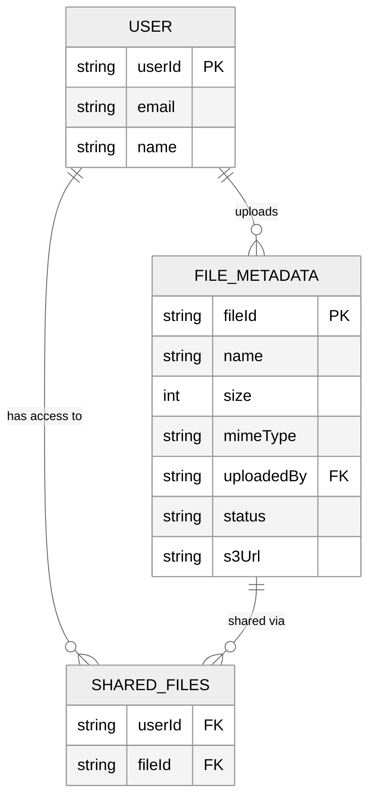

---

### API / System Interface

Define an endpoint for each functional requirement. User information is passed in **headers** (session token or JWT) — never in the request body for security reasons.

> **Tip:** Proactively communicate that APIs may evolve: *"I'm going to outline some simple APIs, but may come back and improve them as we delve deeper into the design."*

#### 1. Upload a File

```
POST /files
Request:
{
  File,
  FileMetadata
}
```

#### 2. Download a File

```
GET /files/{fileId} -> File & FileMetadata
```

#### 3. Share a File

```
POST /files/{fileId}/share
Request:
{
  User[]   // The users to share the file with
}
```

#### 4. Query Changes for Sync

```
GET /files/changes?since={timestamp} -> ChangeEvent[]
```

Each `ChangeEvent` includes:
- `fileId`
- Type of change: `created`, `updated`, `deleted`
- Updated metadata

By passing a `since` timestamp, the client efficiently fetches only the changes that occurred since its last sync.

---

## High-Level Design

### 1) Users should be able to upload a file from any device

When storing a file, we need to answer two questions:

1. **Where do we store the file contents** (raw bytes)?
2. **Where do we store the file metadata?**

#### Metadata Storage

Use a **NoSQL database** like **DynamoDB** (or a SQL database like PostgreSQL — either works well for this use case).

Our metadata is loosely structured, with few relations, and the main query pattern is fetching files by user. Schema:

```json
{
  "id": "123",
  "name": "file.txt",
  "size": 1000,
  "mimeType": "text/plain",
  "uploadedBy": "user1"
}
```

#### File Storage — Trade-off Analysis

##### ❌ Bad Solution: Upload File to a Single Server

- Store the file on the local file system of the application server.
- **Problems:** Single point of failure, storage limits, no redundancy, no scalability.

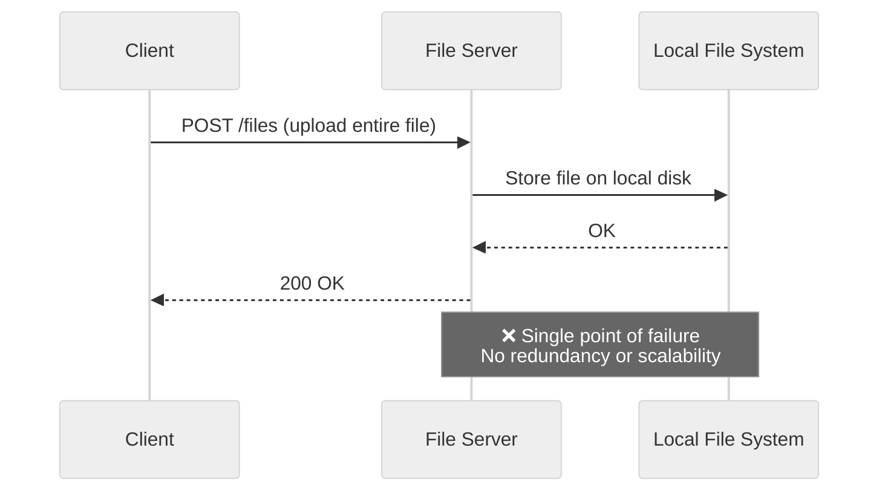

##### ✅ Good Solution: Store File in Blob Storage (S3)

- Upload file to the server → server forwards it to S3.
- **Better:** S3 provides durability (99.999999999% / 11 nines), redundancy, and scalability.
- **Problem:** The file is uploaded **twice** — once from client → server, then server → S3. Doubles bandwidth and latency.

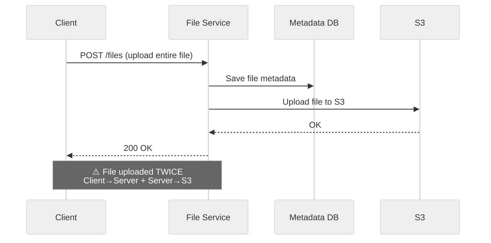

##### 🌟 Great Solution: Upload File Directly to Blob Storage (Presigned URLs)

- The client requests a **presigned URL** from the File Service.
- The File Service generates a presigned URL using the S3 SDK (a **purely local operation** — no call to S3 needed).
- The client uploads the file **directly to S3** using the presigned URL.
- S3 sends a notification on completed upload so the backend can update metadata.

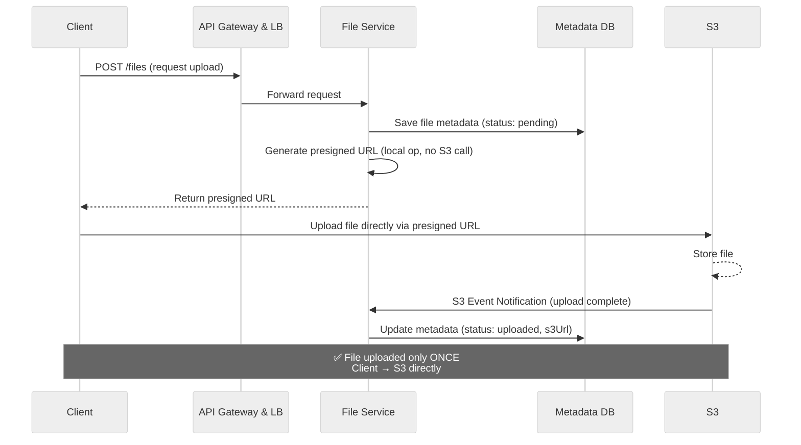

**Why this is great:**
- Eliminates double bandwidth usage.
- Offloads upload processing from our servers.
- Presigned URLs are time-limited and secure.

> **Pattern: Handling Large Blobs** — The direct upload approach using presigned URLs is a classic pattern for handling large file transfers efficiently. This pattern of bypassing application servers for data transfer, using signed URLs for security, and implementing chunked uploads for reliability appears across many distributed systems.

#### Where does the code actually run? (Client vs Backend)

Dropbox is split into two physically separate pieces:

| Piece | Where it runs | What it contains |
|-------|---------------|------------------|
| **Client app** | On the **user's own device** (macOS / Windows / iOS / Android native app, or a browser tab for the web app). Installed by the user. | UI, the local "Dropbox folder" watcher (`FSEvents` / `FileSystemWatcher`), and an **HTTP client** that talks to our backend and to S3. |
| **Backend (File Service, DB, etc.)** | In **our cloud** (e.g., AWS — EC2 / ECS / Lambda + RDS/DynamoDB + S3). The user never sees these machines. | Control plane: auth, metadata DB, presigned URL generation, permission checks, sync notifications. |

So **"the file on my device"** literally means a file sitting on the user's laptop disk, inside the folder the Dropbox client is watching. The Dropbox client app is the bridge between that local file and our cloud.

```
┌────────────────────────────────────┐          ┌──────────────────────────────────────────┐
│         YOUR DEVICE                │          │       DROPBOX'S CLOUD (AWS)              │
│  (your laptop / phone)             │          │                                          │
│                                    │          │   ┌──────────────────────────────────┐   │
│  ┌─────────────────────────────┐   │          │   │ API Gateway + File Service       │   │
│  │ Dropbox Client App          │   │  HTTPS   │   │ (the backend code we designed)   │   │
│  │  - Native desktop/mobile app│◀──┼─────────▶│   └──────────────────────────────────┘   │
│  │  - Written in C++/Swift/…   │   │          │                                          │
│  │  - Has a special folder     │   │          │   ┌──────────────────────────────────┐   │
│  │    on your filesystem       │   │          │   │ Metadata DB (DynamoDB / Postgres)│   │
│  │  - Watches for file changes │   │          │   └──────────────────────────────────┘   │
│  │  - Has a SYNC ENGINE        │   │          │                                          │
│  │    (background process)     │   │          │   ┌──────────────────────────────────┐   │
│  └─────────────────────────────┘   │          │   │ S3 Blob Storage                  │   │
│                                    │          │   └──────────────────────────────────┘   │
└────────────────────────────────────┘          └──────────────────────────────────────────┘
```

#### How does the device upload via a presigned URL? (There's no magic)

A **presigned URL is just a normal HTTPS URL** with a signature in the query string — e.g.:

```
https://my-bucket.s3.amazonaws.com/files/abc.txt
    ?X-Amz-Algorithm=AWS4-HMAC-SHA256
    &X-Amz-Expires=300
    &X-Amz-Signature=<hash>
```

The URL itself doesn't move bytes. The **client app** (running on the user's device) still has to do the HTTP `PUT` using a regular HTTP library. The signature only tells S3: *"this request is pre-authorized, accept it without an AWS login."*

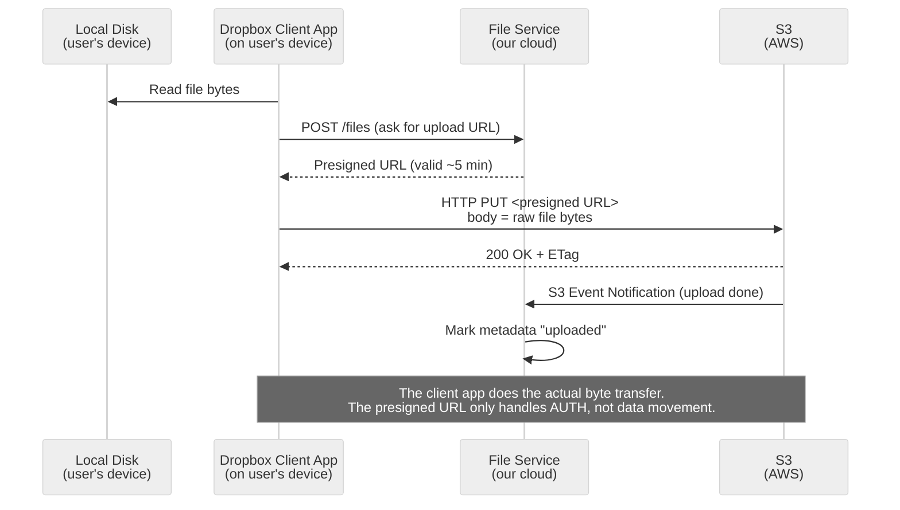

Key takeaways:
- The **client app** owns the HTTP code that streams bytes from disk → S3.
- The **backend** never touches the file body — it only hands out a pre-authorized target.
- Presigned URL ≠ a tunnel; it's just **"a URL S3 will trust for the next 5 minutes."**

---

### 2) Users should be able to download a file from any device

#### ❌ Bad Solution: Download Through File Server

- Client requests file → File Server fetches from S3 → returns to client.
- **Problem:** All download traffic flows through the server. Bottleneck and high bandwidth cost.

#### ✅ Good Solution: Download from Blob Storage

- File Service generates a presigned URL for S3 → client downloads directly from S3.
- **Better:** Offloads download traffic from our servers.

#### 🌟 Great Solution: Download from CDN

- Instead of giving users a direct S3 presigned URL, the File Service generates a **CDN signed URL** (e.g., CloudFront).
- The CDN fetches the file from S3 on the **first request** (cache miss) and serves from the **edge** on subsequent requests (cache hit).
- Users download from the **nearest CDN edge location** rather than from the S3 region directly.

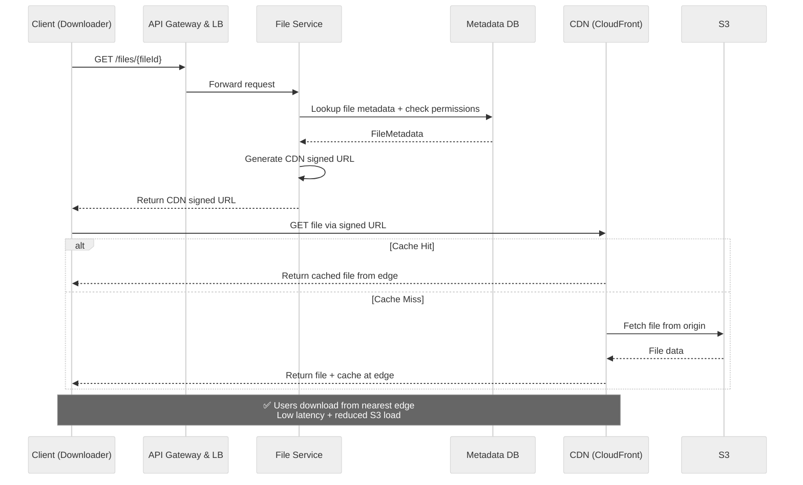

**Benefits:**
- Reduced latency for geographically distributed users.
- Lower load on S3.
- Automatic caching of popular files.

---

### 3) Users should be able to share a file with other users

Implementation is similar to Google Drive — enter the email of the user you want to share with. Users are already authenticated.

#### ❌ Bad Solution: Add a Sharelist to File Metadata

- Store an array of shared user IDs directly in the file metadata document.
- **Problem:** Querying "which files are shared with me?" requires scanning all file metadata. Doesn't scale.

#### ✅ Good Solution: Caching to Speed Up Fetching the Sharelist

- Cache the share list in-memory (e.g., Redis) for fast lookups.
- **Better:** Fast reads, but still has the underlying data model problem.

#### 🌟 Great Solution: Create a Separate Table for Shares

- Create a `SharedFiles` table:

| Column | Description |
|--------|-------------|
| `userId` | The user the file is shared with — **part of composite PK** |
| `fileId` | The shared file — **part of composite PK** |
| `sharedAt` *(optional)* | Timestamp the share was granted |
| `sharedBy` *(optional)* | The user who granted access (file owner) |

**Primary key = `(userId, fileId)` composite.** Using `userId` alone would limit each user to one shared file row — we need the pair to be unique, so a single user can have many shared files (one row per file).

- Query "Get all files shared with user X" → `WHERE userId = X` — fast because `userId` is the leading column of the PK index.
- Permission check "Can user X access file Y?" → `WHERE userId = X AND fileId = Y` — O(1) on the full PK.
- The composite PK also automatically blocks accidental duplicate share rows.

**Example query** — "list all files shared with user B" in a single round trip (avoids the N+1 problem of fetching metadata one fileId at a time):

```sql
SELECT fm.*
FROM SharedFiles s
JOIN FileMetadata fm ON s.fileId = fm.fileId
WHERE s.userId = 'B';
```

> For a NoSQL store like DynamoDB (no JOINs), the equivalent is: `Query` on `SharedFiles` by `userId` to get fileIds, then a single `BatchGetItem` on `FileMetadata` — still 2 calls, not N.

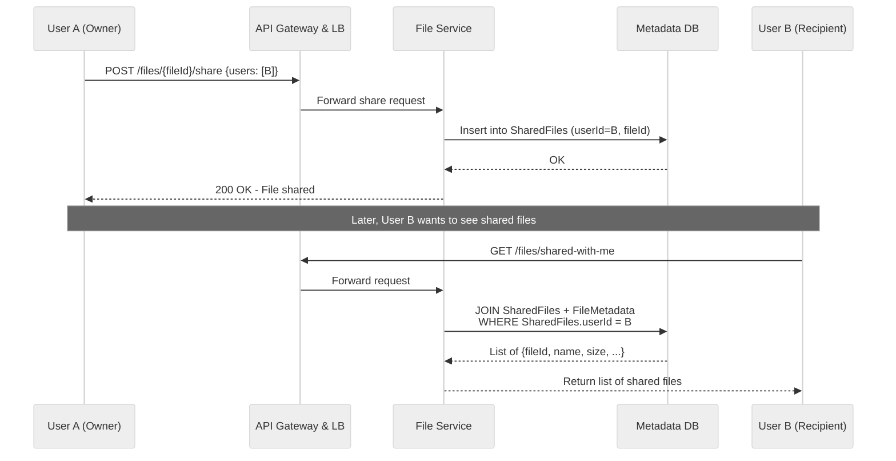

---

### 4) Users can automatically sync files across devices

At a high level, syncing keeps a copy of a file on each **client device** (locally) and in **remote storage** (the cloud). Two sync directions:

#### Local → Remote

When a user updates a file on their local machine, we sync changes to the remote server (source of truth). A **client-side sync agent** is needed that:

1. **Monitors** the local Dropbox folder for changes using OS-specific file system events:
   - `FileSystemWatcher` on Windows
   - `FSEvents` on macOS
2. When it detects a change, it **queues** the modified file for upload locally.
3. Uses our **upload API** to send changes to the server along with updated metadata.
4. Conflicts are resolved using a **"last write wins"** strategy — the most recent edit is saved.

> **Note on Versioning:** While out of scope, in practice you wouldn't overwrite the only file. Instead, you'd add a new file (or new chunks) and update a version number and pointer on the metadata.

#### File Versioning (out of scope — what it would take)

Versioning is marked **below the line** in our NFRs, but it's a common follow-up question. Here's a sketch of what we'd add **without** redesigning the rest of the system:

**Why bother?** Users overwrite files by mistake, ransomware encrypts everything, or you want to compare an old draft. Versioning = every save is preserved as a separate, restorable copy.

**Schema changes**

```
Version table  (new)
─────────────────────────────────────────
versionId    PK   (UUID)
fileId       FK → FileMetadata.fileId
s3Key        (path to this version's bytes in S3, or list of chunk fingerprints)
sizeBytes
createdAt
createdBy    FK → User.userId

FileMetadata  (add one column)
─────────────────────────────────────────
currentVersionId  FK → Version.versionId
```

**Storage strategy — two options**

| Approach | How | Storage cost |
|---|---|---|
| **Full copy per version** | Each save writes a brand-new S3 object | High — duplicates the whole file each time |
| **Chunk-level versioning** (Dropbox's real approach) | Reuse the CDC chunks from the [perf deep dive](#content-defined-chunking-cdc); a new version only stores the **changed** chunks and references the rest | Low — pays only for the delta |

**New APIs**

```
GET    /files/{id}/versions          → list all versions
GET    /files/{id}?version=<vid>     → download a specific version
POST   /files/{id}/restore?version=  → make an old version "current"
```

**Retention / GC** — you can't keep versions forever. Typical policies:
- Keep all versions for N days (e.g., 30 for free, 180+ for paid).
- After that, prune to one version per day, then one per week, etc.
- A background job walks the `Version` table and deletes orphaned chunks no longer referenced by any version.

**S3 shortcut** — instead of building this yourself, enable **S3 Object Versioning** on the bucket. S3 automatically keeps every `PUT` as a new version and gives each one a `versionId`. You'd still need the `Version` table for fast listing / restore UX, but S3 handles the durability of every version for free.

> So: **versioning is a 1-table + 3-API addition** that plugs neatly into the existing CDC chunk store. The reason it's "out of scope" isn't complexity — it's just that the core upload/download/share/sync flows already give a complete answer, and versioning would burn interview time on retention policies and GC.

#### Remote → Local

Each client needs to know when changes happen on the remote server. Two approaches:

| Approach | How It Works | Pros | Cons |
|----------|-------------|------|------|
| **Polling** | Client periodically asks server "has anything changed since my last sync?" | Simple | Slow to detect changes; wastes bandwidth |
| **WebSocket / SSE** | Server maintains open connection, pushes notifications on changes | Real-time updates | More complex; connections can drop |

#### Hybrid Approach (Best of Both)

Each client maintains a **single WebSocket (or SSE) connection** to the server — one per device/session, not per file.

- **Active notification:** Server pushes change events through WebSocket in real-time.
- **Periodic polling as safety net:** Client also polls periodically (e.g., every few minutes) using `GET /files/changes?since={timestamp}` to catch any missed changes.

This ensures **near-instant sync** with **eventual consistency** even if the WebSocket connection is temporarily interrupted.

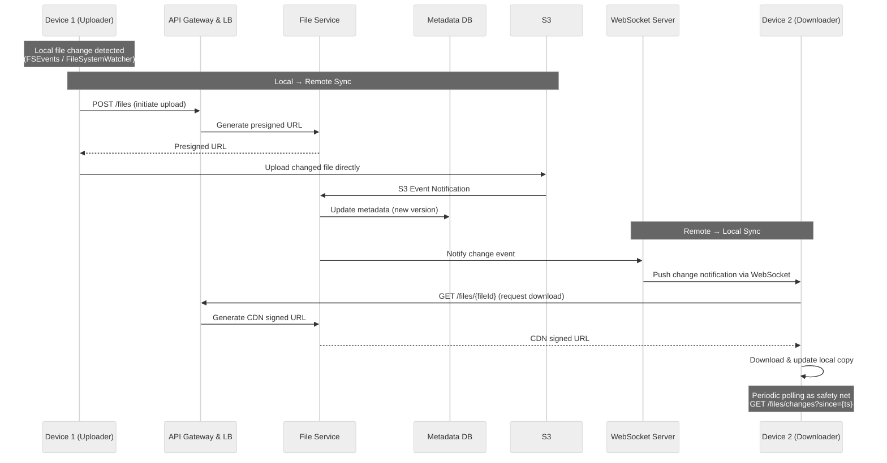

---

### Tying It All Together

The complete system with all functional requirements satisfied:

#### Component Breakdown

| Component | Responsibility |
|-----------|---------------|
| **Uploader (Client)** | Uploads files. Proactively identifies local changes and pushes updates to remote storage. |
| **Downloader (Client)** | Downloads files. Determines when a locally-held file has changed on the remote server and downloads changes. Can be the same client as the uploader. |
| **LB & API Gateway** | Routes requests, handles SSL termination, rate limiting, request validation, and authentication. |
| **File Service** | Reads/writes file metadata in the DB. Generates presigned URLs using the S3 SDK. Does **not** handle file uploads or downloads directly — it's the **control plane**. |
| **File Metadata DB** | Stores metadata: file name, size, MIME type, uploader, etc. Also stores the shared files table mapping files to authorized users for permission enforcement. |
| **S3** | Stores the actual files. Files are uploaded directly using presigned URLs generated by the File Service. |
| **CDN (CloudFront)** | Caches files close to users. For downloads, the File Service generates CDN signed URLs. CDN fetches from S3 on cache miss, serves from edge on cache hit. |

#### Full Architecture Diagram

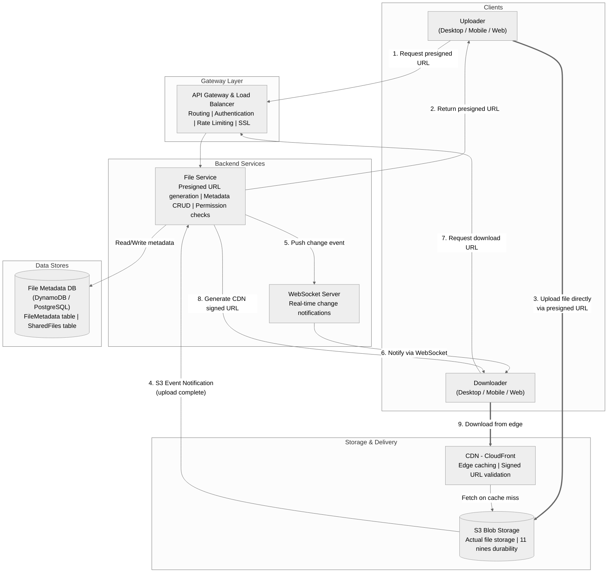

#### Data Model Summary

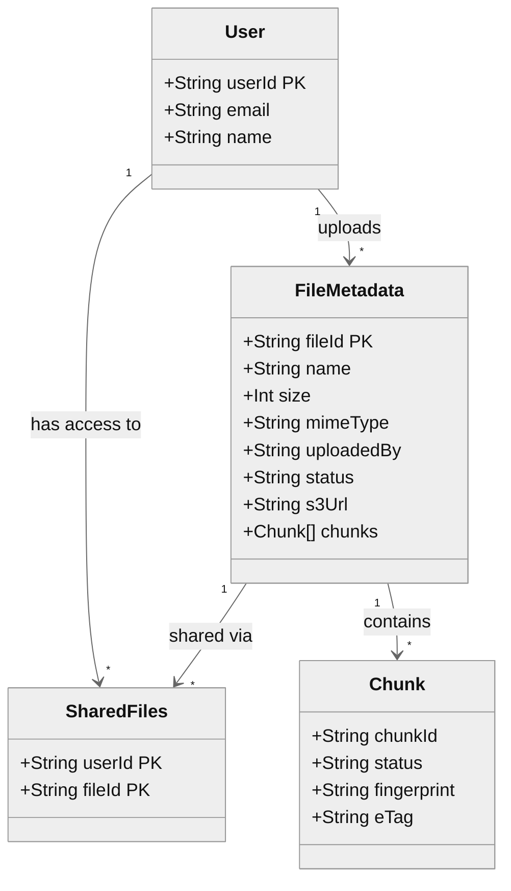

---

## Deep Dives

### 1) How can you support large files?

> This is the **meat of the problem** and where interviewers typically spend the most time.

#### User Experience First

Two key UX insights that should guide your design:

1. **Progress Indicator:** Users need to see upload progress — how far along it is and how long it will take.
2. **Resumable Uploads:** Users should be able to pause and resume. If they lose internet or close the browser, they shouldn't re-upload the 49 GB already sent.

#### Why a Single POST Fails for Large Files

| Problem | Explanation |
|---------|-------------|
| **Timeouts** | A 50 GB file at 100 Mbps: `50 GB × 8 bits/byte ÷ 100 Mbps = 4,000 seconds ≈ 1.11 hours`. Web servers have timeout limits far shorter than this. |
| **Browser/Server Limits** | Both browsers and servers impose payload size limits. Amazon API Gateway has a **hard 10 MB limit** that cannot be increased. |
| **Network Interruptions** | Large files are more susceptible to connection drops. A single failure means restarting the entire upload. |
| **User Experience** | Users are blind to progress — no idea if the upload is working or how long it will take. |

#### Solution: Chunking

Break the file into smaller pieces (typically **5–10 MB**) and upload them one at a time (or in parallel).

> **Critical:** Chunking **must** happen on the client. A common mistake is chunking on the server, which defeats the purpose since you'd still upload the entire file at once.

**Progress tracking** becomes straightforward: track each chunk's progress and update the progress bar as each chunk completes.

#### Resumable Uploads with Chunk Tracking

Update the `FileMetadata` schema to include a `chunks` field:

```json
{
  "id": "123",
  "name": "file.txt",
  "size": 1000,
  "mimeType": "text/plain",
  "uploadedBy": "user1",
  "status": "uploading",
  "chunks": [
    {
      "id": "chunk1",
      "status": "uploaded"
    },
    {
      "id": "chunk2",
      "status": "uploading"
    },
    {
      "id": "chunk3",
      "status": "not-uploaded"
    }
  ]
}
```

When a user resumes, check the `chunks` field → upload only the chunks that haven't been uploaded yet.

#### Keeping Chunks in Sync

##### ✅ Good Solution: Update Based on Client PATCH Request

- After each chunk is uploaded to S3, the client sends a `PATCH` request to the backend to update the chunk status.
- Simple, but relies on the client being honest.

##### 🌟 Great Solution: Server-Side Chunk Verification

- After the client reports a chunk as uploaded, the backend **verifies** the upload with S3's `ListParts` API before updating the metadata.
- More reliable and tamper-resistant.

#### File & Chunk Identification: Fingerprinting

You cannot naively rely on file names (two users could upload files with the same name). Instead, use a **fingerprint** — a cryptographic hash (e.g., **SHA-256**) derived from the file's content.

- **File fingerprint:** Used for deduplication and resumability checks.
- **Chunk fingerprints:** Used to identify which specific parts have been transmitted.
- The `fileId` in your metadata should be a unique identifier (UUID), while the fingerprint is a **separate field**.

> **Note:** The fingerprint identifies the file **content**, not the file record. Two different users uploading identical files produce the same fingerprint.

#### Complete Upload Flow for Large Files

1. **Client chunks the file** into 5–10 MB pieces and calculates a fingerprint for each chunk + the whole file.
2. **Client checks** if a file with the same fingerprint already exists. If it does and has status `"uploading"`, resume by fetching existing chunk statuses.
3. If the file doesn't exist, the client **POSTs to initiate a multipart upload**. The backend:
   - Calls S3's `CreateMultipartUpload` API to get an `uploadId`.
   - Generates presigned URLs for each part.
   - Saves file metadata with status `"uploading"`.
   - Returns `uploadId` + presigned URLs for each chunk.
4. **Client uploads each chunk** to S3 using its corresponding presigned URL. After each chunk:
   - Client sends a `PATCH` to the backend with chunk status and ETag.
   - Backend verifies with S3's `ListParts` API.
   - Backend marks the chunk as `"uploaded"` in the metadata.
5. **Once all chunks are `"uploaded"`**, the backend calls S3's `CompleteMultipartUpload` API with part numbers and ETags. S3 assembles all parts into a single object. Only after S3 confirms does the backend mark the file as `"uploaded"`.

Throughout this process, the client tracks progress and updates the UI.

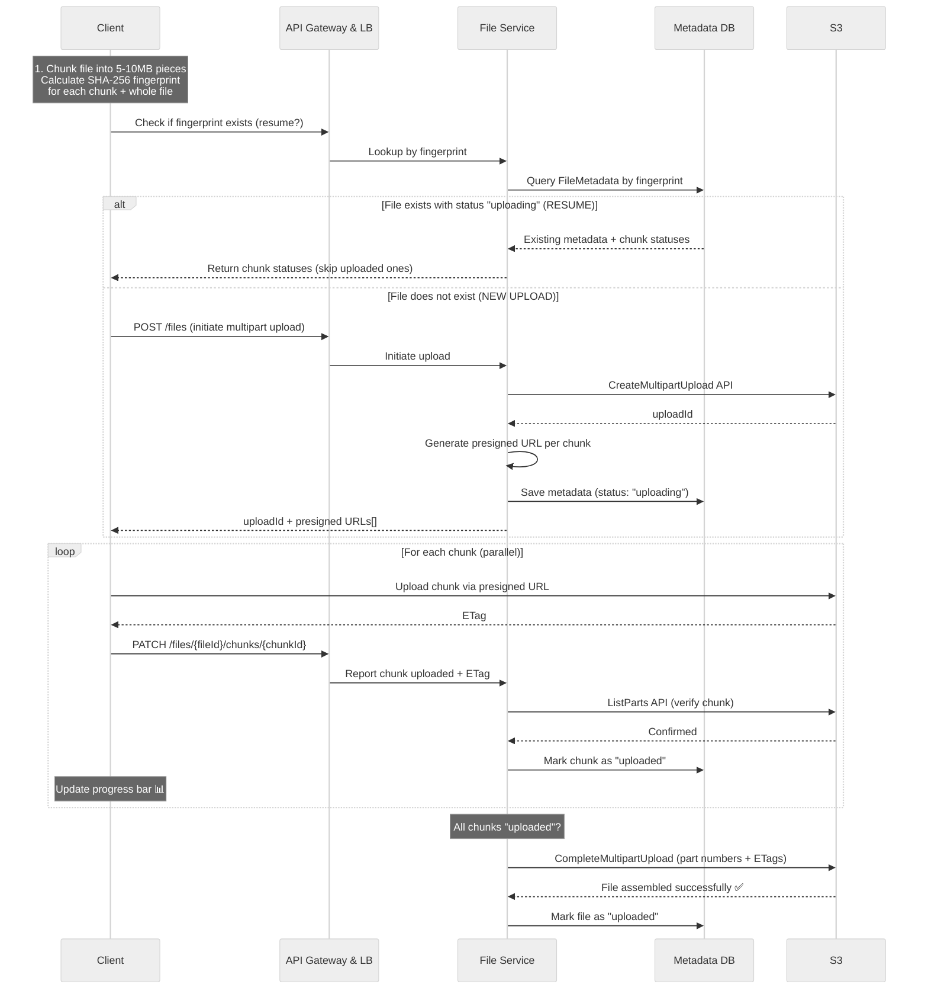

> **S3 Multipart Upload:** This is exactly what AWS S3's [Multipart Upload](https://docs.aws.amazon.com/AmazonS3/latest/userguide/mpuoverview.html) feature provides. AWS even offers a JavaScript SDK that handles chunking and uploading automatically. However, in an interview you must be able to **explain how it works** — not just reference it.

#### What About Chunked Downloads?

Not needed. Once `CompleteMultipartUpload` is called, S3 assembles all parts into **a single object**. Downloads work like any normal file — the client gets a presigned URL (or CDN signed URL) and downloads the complete file.

For very large files, S3 and HTTP natively support **Range requests**, which let the client:
- Download different byte ranges **in parallel**.
- **Resume** an interrupted download without starting over.

The client doesn't need to know anything about the original chunk boundaries.

---

### 2) How can we make uploads, downloads, and syncing as fast as possible?

#### Recap of Optimizations Already in Place

| Optimization | Applies To | How It Helps |
|-------------|-----------|--------------|
| **CDN** | Downloads | Caches files at edge locations closer to users, reducing latency. |
| **Chunking** | Uploads/Sync | Send multiple chunks **in parallel** to maximize bandwidth. Adaptive chunk sizes based on network conditions. |
| **Delta Sync** | Sync | Only sync the chunks that **actually changed**, not the entire file. |

#### Content-Defined Chunking (CDC)

> **Subtle but critical:** Fixed-size chunks (e.g., every 5 MB) break delta sync. Inserting a single byte near the beginning shifts all subsequent chunk boundaries, causing every chunk after the edit to produce a different fingerprint.

**Solution: Content-Defined Chunking (CDC)**

- Chunk boundaries are determined by the **file's content** using a **rolling hash** (like **Rabin fingerprinting**).
- A small edit only affects the chunks **immediately surrounding** the change.
- The vast majority of chunks remain identical.
- This is how systems like Dropbox actually achieve efficient delta sync in practice.

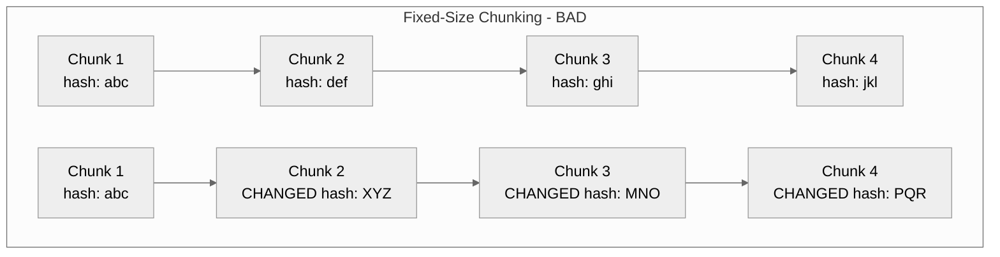

> ⬆️ Fixed-size: One small edit shifts all boundaries → ALL subsequent chunks change.

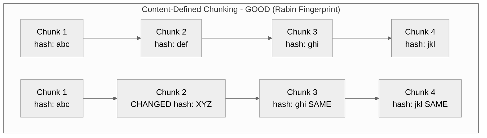

> ⬆️ CDC: Boundaries based on content → only the **affected chunk** changes, rest stay identical.

#### Compression

Compression reduces file size → fewer bytes transferred → faster uploads/downloads.

Since we're uploading directly to S3, compression happens **entirely on the client side**:
- Client compresses before uploading.
- Compressed data is stored in S3 as-is.
- Client decompresses after downloading.

**When to Compress:**

| File Type | Compression Ratio | Worth It? |
|-----------|------------------|-----------|
| **Text files** | High (5 GB → 1 GB or less) | ✅ Yes |
| **Media files (images, videos)** | Very low (< few percent) | ❌ No |

The client should implement logic to decide whether to compress based on **file type**, **size**, and **network conditions**.

**Compression Algorithms:**

| Algorithm | Characteristics |
|-----------|----------------|
| **Gzip** | Most widely used; broad support everywhere. |
| **Brotli** | Better compression ratios than Gzip (especially for text); supported by all modern browsers. |
| **Zstandard (zstd)** | Excellent balance of speed and ratio; compresses/decompresses significantly faster than Gzip. Strong choice for Dropbox-like systems. |

> **Important:** Always **compress before you encrypt**. Encryption introduces randomness that makes compression ineffective. Compressing first achieves a much higher compression ratio.

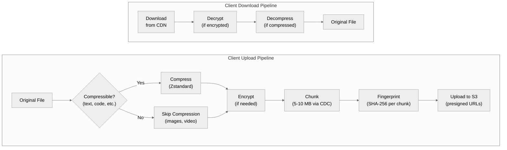

---

### 3) How can you ensure file security?

Security is critical for any file storage system. Three layers:

#### 1. Encryption in Transit

- Use **HTTPS** to encrypt data transferred between client and server.
- Standard practice, supported by all modern browsers.

#### 2. Encryption at Rest

- Enable **S3 server-side encryption**.
- When a file is uploaded, S3 encrypts it using a unique key and stores the key **separately** from the file.
- Even if someone gains access to the file, they can't decrypt it without the key.

#### 3. Access Control

- The `SharedFiles` table (or share cache) serves as a basic **ACL** (Access Control List).
- Download links are only shared with **authorized users**.

#### Preventing Unauthorized Link Sharing

**Problem:** An authorized user could share a download link publicly (on a forum, social media, etc.).

**Solution: Signed URLs with Short Expiration**

When a user requests a download link, generate a **signed URL** valid for a short period (e.g., 5 minutes).

> **Note:** Signed URLs are **bearer tokens** — anyone with a valid, unexpired URL can download the file. The short expiration limits exposure. For higher security, add **IP binding** or require **authentication cookies** alongside the signed URL.

**How Signed URLs Work (with CloudFront):**

| Step | Description |
|------|-------------|
| **1. Generation** | Server creates a signed URL incorporating: URL path, expiration timestamp, and optional restrictions (e.g., IP address). For CloudFront, the signature uses the content provider's **private key**. |
| **2. Distribution** | The signed URL is sent to the authorized user, who uses it to access the resource directly from the CDN. |
| **3. Validation** | When the CDN receives the request, it verifies the signature using the corresponding **public key** (registered with CloudFront), checks the expiration and restrictions. If valid → serve content. If not → deny access. |

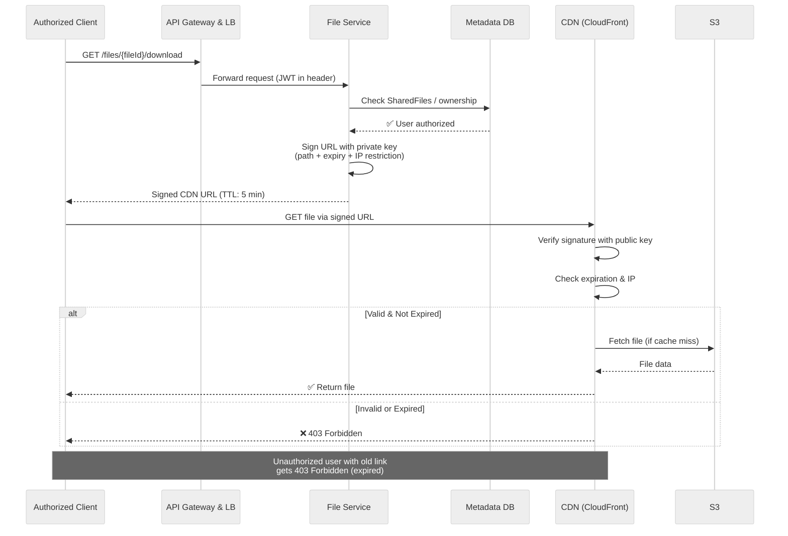

#### Security Layers Overview

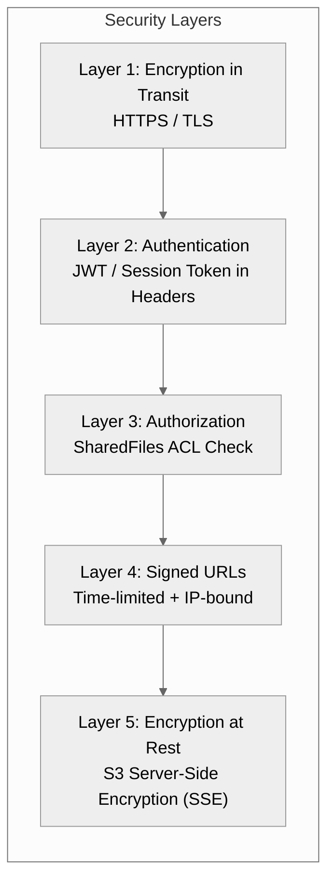

---

## What is Expected at Each Level?

### Mid-Level (E4)

| Aspect | Expectation |
|--------|-------------|
| **Breadth vs. Depth** | 80% breadth, 20% depth. |
| **High-Level Design** | Meets functional requirements, but components may be abstractions with surface-level familiarity. |
| **Probing the Basics** | Interviewer will confirm you know what each component does (e.g., "What does an API Gateway do?"). |
| **Driving the Interview** | Drive the early stages; interviewer may take over and drive later stages. |
| **The Bar** | Clearly define API endpoints and data model. Land on a functional high-level design for uploading, downloading, and sharing. Not expected to know presigned URLs or direct S3 upload. However, when prompted ("You're uploading the file twice, how can we avoid that?" or "How can you show progress while allowing resume?"), should reason through to a solution. |

---

### Senior (E5)

| Aspect | Expectation |
|--------|-------------|
| **Breadth vs. Depth** | 60% breadth, 40% depth. |
| **Depth of Expertise** | Go into technical detail in areas of hands-on experience. |
| **Advanced Design** | Know blob storage for large files, CDN for faster downloads. Discuss trade-offs and justify decisions. |
| **Architectural Decisions** | Clearly articulate pros/cons and impact on scalability, performance, maintainability. |
| **Problem-Solving** | Anticipate challenges, suggest improvements, identify bottlenecks. |
| **The Bar** | Quickly go through high-level design to spend time discussing large file uploads in detail. More proactive than mid-level. Many will have experience with file uploads and can speak about multipart upload APIs. |

---

### Staff+ (E6+)

| Aspect | Expectation |
|--------|-------------|
| **Breadth vs. Depth** | 40% breadth, 60% depth. |
| **Emphasis on Depth** | Deep dive into nuances. Demonstrate real-world experience even if you haven't solved this exact problem. |
| **Technology Choices** | Know which technologies to use **in practice**, not just theory. Draw from past experience. |
| **Proactivity** | Exceptional. Identify and solve issues independently. Interviewer intervenes only to focus, not to steer. |
| **Practical Application** | Clear understanding of how tools and systems are configured in real-world scenarios. |
| **Complex Problem-Solving** | Advanced scalability, distributed systems, load balancing, caching strategies. |
| **The Bar** | Deep, high-quality solutions. May steer conversation to areas of expertise. Solid understanding of trade-offs between solutions. Treat the interviewer as a peer. |

---

## Final Architecture Diagram (All Deep Dives Integrated)

This is the complete end-to-end architecture after folding in every deep dive — chunking + CDC, multipart upload, compression, fingerprint-based dedup/resume, CDN signed URLs, real-time sync, and encryption at every layer.

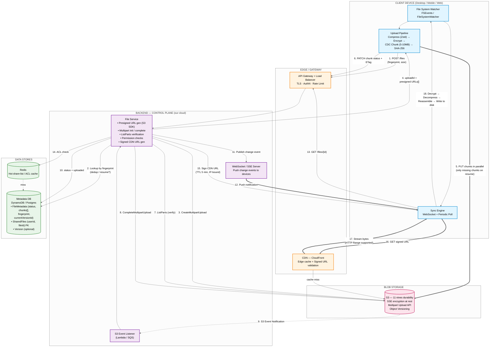

### Request flow legend

| # | Phase | What's happening |
|---|-------|------------------|
| 1–4 | **Upload init** | Client fingerprints file, asks backend; backend dedup-checks, opens S3 multipart upload, returns presigned URLs. |
| 5–7 | **Chunked upload** | Client streams chunks directly to S3 in parallel; backend verifies each via `ListParts`. |
| 8–10 | **Finalize** | `CompleteMultipartUpload` assembles parts; S3 event triggers metadata flip to `uploaded`. |
| 11–12 | **Sync fan-out** | File Service publishes a change event; WebSocket pushes it to every other device of every authorized user. |
| 13–17 | **Download** | Device requests file → backend signs short-lived CDN URL after ACL check → bytes streamed from nearest edge. |
| 18 | **Client reassembly** | Decrypt → decompress → write back to the watched local folder. |

### What each deep-dive concept maps to in the diagram

| Deep-dive concept | Where you see it |
|---|---|
| **Presigned URLs / direct-to-S3** | Step 5 — bytes bypass our backend entirely. |
| **Chunking + resumability** | Steps 4–7 — `chunks[]` in `FileMetadata` + `ListParts` verify. |
| **Content-Defined Chunking** | "CDC Chunk" inside the Upload Pipeline box. |
| **Compression before encryption** | Pipeline order: Compress → Encrypt → Chunk. |
| **Fingerprint dedup / resume** | Step 2 — lookup by SHA-256 fingerprint. |
| **CDN signed URL security** | Steps 15–16 — short TTL + IP-binding. |
| **Encryption at rest** | S3 SSE annotation on the storage block. |
| **Real-time sync hybrid** | WebSocket push (12) + periodic poll inside Sync Engine. |
| **Versioning (optional)** | `currentVersionId` + `Version` table inside the DB block. |

---

## Quick Reference Summary

```
Functional Requirements          Non-Functional Requirements
─────────────────────────        ───────────────────────────
• Upload a file                  • Availability > Consistency
• Download a file                • Support files ≤ 50 GB
• Share files                    • Secure & reliable
• Auto-sync across devices       • Low latency

Key Design Decisions
────────────────────
• Presigned URLs for direct S3 upload (bypass app servers)
• CDN (CloudFront) for fast downloads
• Separate SharedFiles table for efficient ACL
• Hybrid WebSocket + polling for real-time sync
• Client-side chunking (5-10 MB) for large files
• Content-Defined Chunking (CDC) for efficient delta sync
• SHA-256 fingerprinting for dedup & resumability
• S3 Multipart Upload API for chunk assembly
• Client-side compression (Zstandard) for text files
• Signed URLs with short TTL for security
• Encryption in transit (HTTPS) and at rest (S3 SSE)
```

---

*Reference: [Hello Interview — Dropbox System Design](https://www.hellointerview.com/learn/system-design/problem-breakdowns/dropbox)*
