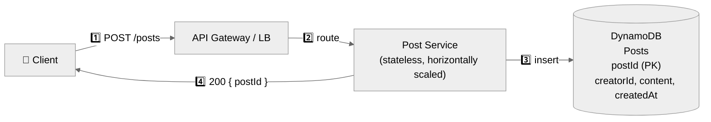
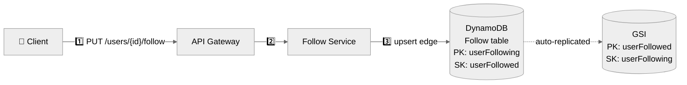
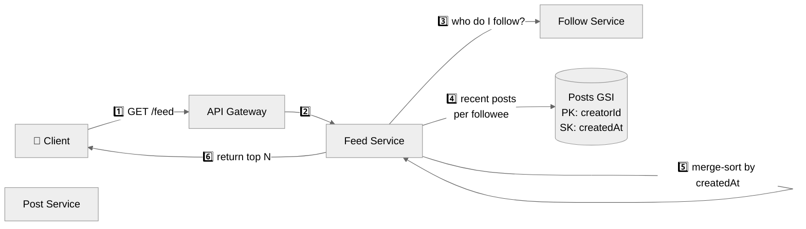
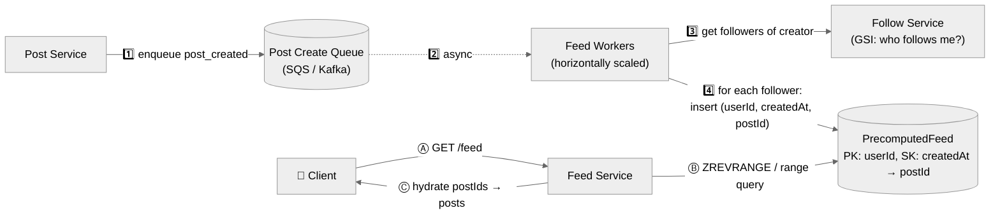
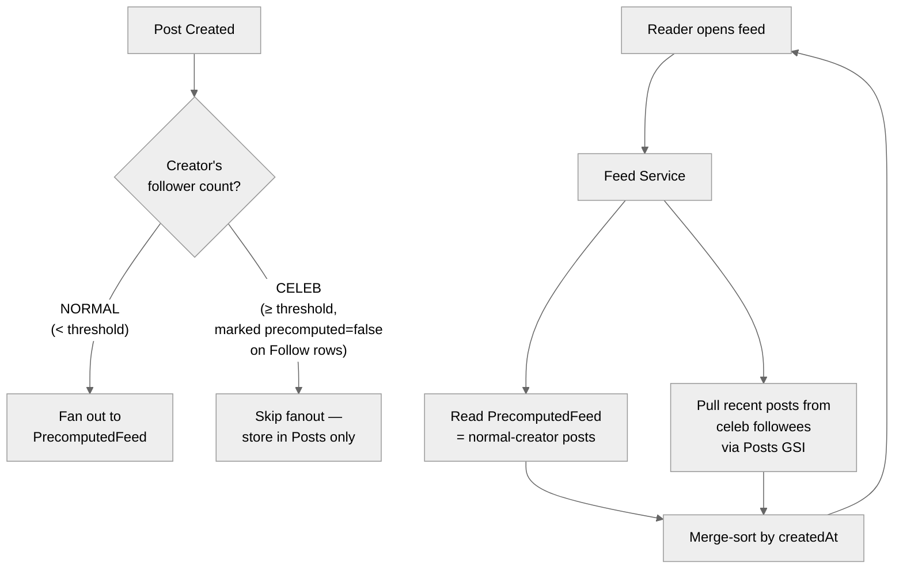
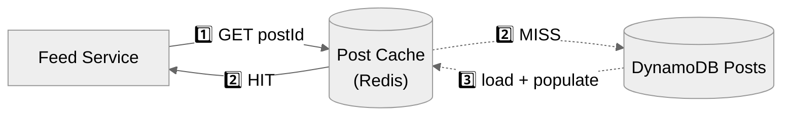
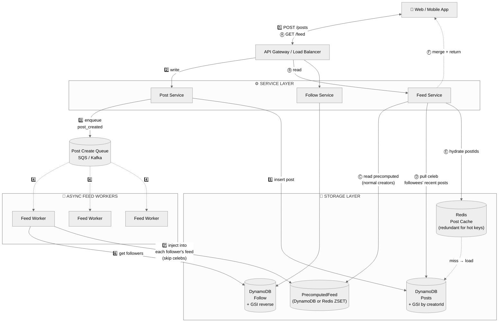

# Facebook News Feed — System Design

> Detailed system design for **Facebook's News Feed**, modeled on the HelloInterview breakdown.
> Walks through the problem **step-by-step**:
> **Requirements → Set Up (entities + API) → High-Level Design → Deep Dives → Final Architecture.**
>
> **Reference:** [HelloInterview — FB News Feed](https://www.hellointerview.com/learn/system-design/problem-breakdowns/fb-news-feed)

---

## Table of Contents
1. [Understanding the Problem](#1-understanding-the-problem)
   - [Functional Requirements](#11-functional-requirements)
   - [Non-Functional Requirements](#12-non-functional-requirements)
2. [The Set Up](#2-the-set-up)
   - [Planning the Approach](#21-planning-the-approach)
   - [Core Entities](#22-core-entities)
   - [API Design](#23-api-design)
3. [High-Level Design](#3-high-level-design)
   - [3.1 Create posts](#31-create-posts)
   - [3.2 Follow / unfollow](#32-follow--unfollow)
   - [3.3 View feed (naive)](#33-view-feed-naive)
   - [3.4 Page through the feed](#34-page-through-the-feed)
4. [Deep Dives](#4-deep-dives)
   - [DD1: Users following a LARGE number of users (fan-out on read)](#dd1-users-following-a-large-number-of-users-fan-out-on-read)
   - [DD2: Users with a LARGE number of followers (fan-out on write)](#dd2-users-with-a-large-number-of-followers-fan-out-on-write)
   - [DD3: Uneven (hot-key) reads of Posts](#dd3-uneven-hot-key-reads-of-posts)
5. [Final Architecture](#5-final-architecture)
6. [What Is Expected at Each Level](#6-what-is-expected-at-each-level)
7. [Appendix — Red Flags to Avoid](#appendix--red-flags-to-avoid)
8. [Appendix — Common Interviewer Follow-Ups](#appendix--common-interviewer-follow-ups)

---

## 1. Understanding the Problem

> **📰 What is Facebook News Feed?**
> A social-network product showing a **reverse-chronological** feed of posts from accounts a user follows. The classic system-design challenges are **fan-out** (how does a post reach all followers' feeds?) and **read-heavy scaling** (users open the feed constantly but post rarely).
>
> We model **uni-directional follow** relationships (not bidirectional friend), as in modern Facebook / Instagram / Twitter.

### 1.1 Functional Requirements

**Core (in scope):**

| # | Requirement |
|---|-------------|
| 1 | Users can **create posts**. |
| 2 | Users can **follow / unfollow** other users. |
| 3 | Users can **view a feed** of posts from people they follow, in **reverse-chronological** order. |
| 4 | Users can **page through** their feed (infinite scroll). |

**Below the line (out of scope):**
- Likes / comments / reactions.
- Privacy controls / restricted visibility.
- Authentication (assume the user is already authenticated; `userId` is in JWT).
- Media (images / videos) — mention but don't deep-dive.
- Ranked / ML feed (we deliver pure reverse-chrono).

> ✅ **Tip:** Always confirm scope. If interviewer wants ranking, the **storage + fanout** stays the same — only the merge step changes.

### 1.2 Non-Functional Requirements

> 📏 **Scale:** ~**2B users**. Each user can follow / be followed by an **unlimited** number of users. Read-to-write ratio is heavily skewed toward reads.

**Core (in scope):**

| # | Requirement |
|---|-------------|
| 1 | **Highly available**, prioritizing **availability over consistency**. |
| 2 | **Eventual consistency** OK — a post may take **up to 1 minute** to appear in followers' feeds. |
| 3 | **Latency** — posting and viewing the feed must complete in **< 500 ms**. |
| 4 | **Scale** — handle ~2B users; unlimited follows / followers per user. |

**Below the line:**
- Strong consistency on the feed.
- GDPR / regional data residency.
- End-to-end encryption.

> 💡 **Why eventual consistency?** A News Feed is not a bank. The 1-minute SLA on post visibility is what unlocks **async fan-out** — the single biggest scaling lever.

---

## 2. The Set Up

### 2.1 Planning the Approach

The hard part is the **fan-out problem**:
- A user following **millions of accounts** would explode the read path.
- A user with **millions of followers** would explode the write path.

We start with a **naive** design that meets the four FRs, then attack each scaling pain point in the deep dives.

### 2.2 Core Entities

| Entity | Fields |
|---|---|
| **User** | `userId`, `name`, ... (assumed already exists / authenticated). |
| **Follow** | `userFollowing` (the actor), `userFollowed` (the target), `createdAt`. Uni-directional. |
| **Post** | `postId`, `creatorId`, `content`, `createdAt`. |

### 2.3 API Design

```http
POST /posts
  body: { "content": { ... } }
  → 200 OK { "postId": "..." }

PUT  /users/{id}/follow                 # idempotent — follow
DELETE /users/{id}/follow               # unfollow (out of scope, listed for completeness)

GET  /feed?pageSize={N}&cursor={timestamp?}
  → { "items": Post[], "nextCursor": "..." }
```

> 💡 **Cursor = timestamp of the oldest post seen so far.** Reverse-chronological feeds page naturally with a `createdAt < cursor LIMIT N` query — no offset/skip required.

> 💡 **`PUT` for follow** makes the action idempotent (double-click safe); `DELETE` would be the unfollow.

---

## 3. High-Level Design

We tackle each FR in order, with a numbered diagram and prose walkthrough. We start naive and **flag** the scaling issues we'll fix in the deep dives.

> 💡 **How to read the diagrams:** numbers (`1️⃣`, `2️⃣`, …) show the **order of invocation**. Solid arrows are sync; dashed arrows are async.

### 3.1 Create posts



**Flow walkthrough:**
1. Client → `POST /posts` → **API Gateway / Load Balancer**.
2. Gateway routes to a stateless **Post Service** instance.
3. Post Service inserts a row into the **Posts** table in DynamoDB.
4. Returns `200 OK` with the new `postId`.

**Why DynamoDB for Posts?** Key-value, infinite horizontal scale, simple lookup-by-`postId`. **`postId` is the partition key** so writes are spread evenly across partitions. (Using `creatorId` as PK would create a hot partition for popular accounts.)

### 3.2 Follow / unfollow

A follow is a many-to-many edge. We model the graph **manually** in DynamoDB instead of using a graph DB (Neo4j) — our queries are simple lookups, not traversals.



**Flow walkthrough:**
1. Client → `PUT /users/{id}/follow`.
2. Gateway → **Follow Service**.
3. Follow Service writes `(userFollowing=me, userFollowed=id)` to the **Follow** table.
4. DynamoDB asynchronously updates the **GSI** (which has the keys reversed) so we can query "who follows me?" cheaply.

**Three query patterns supported:**

| Question | Query |
|---|---|
| Is A following B? | Point-lookup on `(A, B)` in the base table. |
| Who is A following? | Range scan with PK = A. |
| Who follows B? | Range scan on the **GSI** with PK = B. |

### 3.3 View feed (naive)

A new **Feed Service** assembles the feed. We add a **GSI on Posts** with `creatorId` as PK and `createdAt` as SK so we can pull "all posts by these N users in chronological order".



**Flow walkthrough:**
1. Client → `GET /feed`.
2. Gateway → **Feed Service**.
3. Feed Service asks **Follow Service** for the user's followee list.
4. For each followee, query the **Posts GSI** by `creatorId` ordered by `createdAt DESC`.
5. **Merge-sort** all those small lists in memory by timestamp.
6. Return the top N (page size).

> ⚠️ **Three red flags** — call these out verbally in the interview:
> 1. User may follow **lots** of people → step 4 fans out into thousands of queries.
> 2. Each followee may have **lots** of posts → unbounded data per query.
> 3. Total result set may be huge → wasteful sort/transfer.
>
> "I know this won't scale — I'll fix it in the deep dives." This is the right move; finish breadth first, then go deep.

### 3.4 Page through the feed

We already have everything we need. The **cursor is a timestamp** of the oldest post seen so far.

```http
GET /feed?pageSize=20&cursor=1715000000000
```

The Posts GSI is sorted by `createdAt`, so each followee query becomes:

```
WHERE creatorId = :id AND createdAt < :cursor
ORDER BY createdAt DESC
LIMIT :pageSize
```

Merge-sort, return top N, send back a `nextCursor` = `createdAt` of the last item returned.

**Flow walkthrough:**
1. Client sends the **previous page's last `createdAt`** as `cursor`.
2. Feed Service runs the same query as §3.3 but with the `createdAt < cursor` predicate added.
3. Returns the next N items + a new `nextCursor`.
4. Client appends to the scroll view.

> 💡 **Why timestamp cursors beat offset?** Offset breaks under concurrent inserts (you'd see duplicates or skip posts). A timestamp cursor is monotonically older with each page.

---

## 4. Deep Dives

### DD1: Users following a LARGE number of users (fan-out on read)

The naive read path does **fan-out on read** — one feed request fans out into hundreds of follow + post queries. With latency budget of 500 ms, this dies fast.

> 💡 **Rule of thumb:** 10–100 fanned-out requests is OK; **1000+ is not** for a low-latency endpoint.

**Solution: Fan-out on WRITE (precompute the feed).**

We add a **PrecomputedFeed** table:

```
Table: PrecomputedFeed
  PK: userId
  SK: createdAt
  Value: postId

(or equivalently a Redis ZSET keyed by userId, score = createdAt)
```

When a post is created, we **inject its `postId` into every follower's PrecomputedFeed** asynchronously. Reads then become a single point-lookup.



**Flow walkthrough (write side):**
1. Post Service writes the post and enqueues a `post_created` event to **SQS / Kafka**. User gets `200 OK` immediately.
2. **Feed Workers** consume the queue asynchronously (decoupled — workers can scale or backlog without slowing the post API).
3. Worker queries the Follow GSI for **everyone who follows the creator**.
4. Worker inserts `(followerId, createdAt, postId)` into **PrecomputedFeed** — one row per follower.

**Flow walkthrough (read side):**
- **Ⓐ** Client → `GET /feed`.
- **Ⓑ** Feed Service does a **single** range query on `PrecomputedFeed` by `userId` ordered by `createdAt DESC`. O(1) effective.
- **Ⓒ** Hydrate the `postId`s → full post bodies → return.

**Cap each user's feed at ~200 posts.** Storage:

```
200 posts × 10 bytes (postId) = 2 KB / user
2 KB × 2B users  = 4 TB total → trivial for a modern system
```

> 💡 If a user pages past the 200 cached posts, we **fall back to the naive query** (or just stop — most users never reach page 10 of any feed).

✅ **Now reading is O(1).** But we just shifted the pain to **writes** — the next deep dive.

---

### DD2: Users with a LARGE number of followers (fan-out on write)

A user with 100M followers means **one post = 100M PrecomputedFeed inserts**. We have a **1-minute SLA** to make this happen.

#### ❌ Bad: blast the requests synchronously

The Post Service tries to write all 100M rows in the request path. The API times out, retries pile up, the database melts. Don't do this.

#### ✅ Good: async workers (already shown in DD1)

Push `post_created` onto a queue, let Feed Workers chew through it. The **post API stays fast** (just enqueues), and we have up to 1 minute of headroom to drain the work.

For most users this is enough. The remaining issue is the **celebrity tail** — even with parallel workers, 100M writes per post is wasteful.

#### 🌟 Great: Async workers + **Hybrid Feed** (push for normal, pull for celebs)



**Flow walkthrough (write side):**
1. Post created → check the creator's follower count.
2. **Normal user (< threshold, e.g. 100k followers):** workers fan out to followers' PrecomputedFeeds (DD1 path).
3. **Celebrity:** **skip the fanout entirely**. Mark `precomputed=false` on the Follow edges so readers know they need to pull this user.

**Flow walkthrough (read side):**
1. Reader hits `GET /feed`.
2. Feed Service reads **PrecomputedFeed** (contains only normal creators' posts).
3. **Also** queries Posts GSI for the reader's small set of celeb followees (`creatorId IN (...) AND createdAt > last_cursor`).
4. **Merge-sort** the two streams by `createdAt`, return top N.

> 💡 **Why this works:** the celeb count per user is small (you don't follow millions of celebs), so the read-side pull is bounded and cheap. We trade **a few extra read queries** for **avoiding 100M writes per celeb post**.

| Strategy | Push (fanout-on-write) | Pull (fanout-on-read) | Hybrid (this) |
|---|---|---|---|
| Read latency | O(1) | Bad (N queries) | O(1) + small bounded pull |
| Write amplification | High for celebs | None | Bounded |
| Best for | Normal users | Tiny graphs / inactive readers | **Real-world social feeds** |

---

### DD3: Uneven (hot-key) reads of Posts

Most posts are read for a few days then forgotten. A few **viral posts** absorb millions of reads in hours, all hitting the same DynamoDB partition. Even DynamoDB struggles when a single key takes 500+ RPS while neighbors take zero — that's a **hot partition**.

#### ✅ Good: **Post Cache** (Redis) in front of Posts



**Flow walkthrough:**
1. Feed Service hydrates a `postId` → checks **Redis** first.
2. **HIT** → return immediately (sub-ms).
3. **MISS** → fall through to DynamoDB → store in Redis with TTL → return.

A standard cache-aside pattern. Spreads the keyspace across many Redis nodes via consistent hashing → no single hot partition on DynamoDB.

#### 🌟 Great: **Redundant Post Cache** (replicate hot keys)

For genuinely viral posts, **even one Redis node can become a hot key**. Trick: store the post under **multiple Redis keys** (e.g., `post:abc:0`, `post:abc:1`, … `post:abc:9`) and let clients pick a random replica.

```
Read path:
  shard = random(0, N-1)
  key   = f"post:{postId}:{shard}"
  GET key  →  any replica is fine, they're all the same content
```

**Flow walkthrough:**
1. When a post is detected as **hot** (e.g., RPS > some threshold), the cache layer **replicates** it across N Redis keys/nodes.
2. Each read picks a random shard `0..N-1` → load distributes evenly across nodes.
3. The post stays redundantly cached for the duration of the spike, then falls back to a single key.

| Strategy | Pros | Cons |
|---|---|---|
| Single cache key | Simple | Hot key can saturate one Redis node |
| Redundant caching | Spreads viral load across N nodes | More memory; need hot-key detection |

> 💡 **Posts are immutable in this design** (no edits) — that's what makes redundant caching safe. With editable posts, you'd need invalidation across all N replicas.

---

## 5. Final Architecture

The full picture, organized into **3 layers** (Client → Services → Storage) with **two clearly numbered flows** overlaid.

> 🟢 **Green numbers `1️⃣–7️⃣`** = WRITE flow (creating a post + fanout).
> 🔵 **Blue letters `Ⓐ–Ⓕ`** = READ flow (loading the feed).



### 🟢 WRITE PATH — User creates a post

| # | Step |
|---|------|
| **1️⃣** | Client → `POST /posts` → API Gateway. |
| **2️⃣** | Gateway routes to **Post Service**. |
| **3️⃣** | Post Service enqueues a `post_created` event to **SQS / Kafka**. |
| **4️⃣** | **Feed Workers** consume the queue asynchronously (post API already returned `200`). |
| **5️⃣** | Post Service inserts the post into **DynamoDB Posts** (source of truth). |
| **6️⃣** | Each Feed Worker queries the **Follow GSI** for the creator's followers. |
| **7️⃣** | Worker injects `postId` into each follower's **PrecomputedFeed** — **skipping celebrity creators** (their followers will pull at read time). |

### 🔵 READ PATH — User opens the feed

| # | Step |
|---|------|
| **Ⓐ** | Client → `GET /feed?cursor=...` → API Gateway. |
| **Ⓑ** | Gateway routes to **Feed Service**. |
| **Ⓒ** | Read pre-built feed (normal creators) from **PrecomputedFeed** — single range query. |
| **Ⓓ** | Pull recent posts from the user's **celeb followees** directly from **Posts GSI**. |
| **Ⓔ** | Hydrate `postId`s → full posts via **Post Cache (Redis)**, falling through to DynamoDB on miss. Hot posts use **redundant caching** to spread load. |
| **Ⓕ** | Merge-sort by `createdAt` → return top N + `nextCursor`. |

---

## 6. What Is Expected at Each Level

| Level | Expectations |
|---|---|
| **Mid-level (E4)** | Get the FRs/NFRs right. Define API + entities cleanly. Land a high-level design with Post / Follow / Feed services. May have **some** of the "good" deep-dive solutions but won't catch every scaling edge case. |
| **Senior (E5)** | Speed through HLD. Spend time in **at least 2 deep dives**. Proactively surface fan-out as the central problem; propose **hybrid feed** (push for normal, pull for celebs) without being prompted. Justify DynamoDB partitioning and the GSI patterns. |
| **Staff+ (E6+)** | Cover **all three** deep dives. Discuss **hot-partition** behavior in DynamoDB, **redundant cache** for viral posts, queue backpressure, worker scaling, fallback to naive query past the 200-post cap, cost trade-offs (Redis vs DynamoDB for PrecomputedFeed), and operational concerns (replaying the queue after a worker outage). |

---

## Appendix — Red Flags to Avoid

1. **❌ Synchronous fan-out** in the post API — never make the user wait for 100M writes.
2. **❌ `creatorId` as the PK on Posts** — celebrity creators become hot partitions. Use `postId` PK + GSI on `creatorId`.
3. **❌ Pure pull (fan-out on read) for everyone** — dies for users following thousands of accounts.
4. **❌ Pure push (fan-out on write) for everyone** — dies for celebs with 100M followers.
5. **❌ No cache in front of Posts** — viral posts will burn down DynamoDB.
6. **❌ Single Redis key for hot posts** — moves the hot partition from DynamoDB to Redis. Use redundant keys.
7. **❌ Offset-based pagination** — breaks under concurrent inserts. Use a timestamp cursor.
8. **❌ Skipping NFRs** — without numbers (500 ms, 2B users, 1-min staleness) you can't justify any architectural choice.
9. **❌ Pre-computing the feed for inactive users** — wastes storage. Pre-compute only for active users; rebuild lazily on login.
10. **❌ "Kafka-like in-memory queue"** — name actual products (SQS, Kafka, Redis). Vagueness is a yellow flag.

---

## Appendix — Common Interviewer Follow-Ups

### Q1: How do you decide the threshold between "normal" and "celebrity" creator?

It's a tunable knob. Common starting point: **100k followers**. Below threshold → push; above → pull. Track the producer-side cost (how many writes per post) and the reader-side cost (how many extra pulls per feed) — minimize the sum.

You can also store a `precomputed: bool` flag on each Follow row so readers immediately know whether to pull from the precomputed feed or query the creator's posts directly.

### Q2: Why DynamoDB instead of Postgres / MySQL?

Either works. DynamoDB is chosen for:
- **Effortless horizontal scale** — no manual sharding.
- **Predictable latency** at any scale (provided keys are well-distributed).
- Single-table or multi-table design fits the simple query patterns we have.

If you pick Postgres, **be ready to discuss partitioning, read replicas, and connection pooling** — same concepts, different toolset.

### Q3: Should PrecomputedFeed live in DynamoDB or Redis?

| | DynamoDB | Redis |
|---|---|---|
| Durability | ✅ Persistent | ⚠️ Cache (replicas + AOF needed) |
| Native queue ops | ❌ Read-modify-write | ✅ `LPUSH`, `LTRIM`, `ZADD`, `ZREVRANGE` |
| Cost at scale | Higher (managed pricing) | Lower (self-hosted) |
| Recovery if lost | N/A | Recompute from Posts in seconds |

**Redis is generally the better fit** — feeds are a glorified materialized view; losing them costs seconds of recompute, not data. Native list/zset ops avoid the read-modify-write trap of pushing into a DynamoDB array. DynamoDB is fine for an interview answer focused on simplicity.

### Q4: How do you handle a user who has paged past the 200-post cap?

Three options:
1. **Stop** — most users never reach page 10. Return empty + `null` cursor.
2. **Fall back to the naive query** — query Follow + Posts GSI for older posts.
3. **Lazily refill the precomputed feed** with older posts on demand.

The right answer depends on product priorities; #1 is what most production systems actually do.

### Q5: What happens to feeds when a user **follows** a new account?

Two choices:
1. **Lazy:** new posts from the followee start landing via fanout immediately. Old posts from that user appear only when the reader pages back into the merge-with-Posts fallback.
2. **Backfill:** asynchronously inject the followee's recent N posts into the new follower's PrecomputedFeed.

Lazy is cheaper and good enough for most products.

### Q6: How do you handle **deletes**?

**Soft delete with tombstones.**
1. Mark the Post as `deleted=true` in DynamoDB.
2. Don't scrub PrecomputedFeed (millions of writes again).
3. On hydration, filter out deleted posts.

Same trade-off as Twitter / Instagram — cheap at write, slightly more work at read.

### Q7: How do you ensure feeds are **eventually consistent within 1 minute**?

- Queue **must** be drainable in well under 60s under normal load → autoscale Feed Workers on queue depth.
- Kafka partitioning by `creatorId` → ordering preserved per creator; horizontal parallelism across creators.
- Monitor **end-to-end latency** = (post enqueued) → (last follower's feed updated). Page on >30s p95.

### Q8: How does a feed worker recover if it crashes mid-fanout?

- Use **at-least-once** delivery from the queue (SQS visibility timeout / Kafka offsets committed only after success).
- Make the `INSERT INTO PrecomputedFeed` **idempotent** — `(userId, createdAt, postId)` as the natural key; duplicate inserts are no-ops.
- Worst case: the queue replays the event → workers re-fanout → some duplicate `ZADD`s with identical scores (Redis dedupes by member) — safe.

### Q9: What's the trade-off you'd flag to your manager?

> "We're trading **post visibility latency (up to 1 minute)** for **reads that complete in <500 ms at any scale**. The architecture is fan-out-on-write for normal users, fan-out-on-read for celebrities, and async workers absorbing the burst. Cost: an extra storage tier (PrecomputedFeed) and a fleet of feed workers. Benefit: feed reads are O(1) and the post API stays sub-100ms regardless of follower count."

---

## Key Takeaways

1. **News Feed is a read-optimization problem** — pre-compute and cache feeds aggressively.
2. **Fan-out on write** for normal users → O(1) reads.
3. **Fan-out on read** for celebs → avoid 100M writes per post.
4. **Hybrid = the answer** for any real-world social product.
5. **Async workers + queue** decouple post latency from fanout cost.
6. **Cap precomputed feeds at ~200 posts** — costs ~4 TB total at 2B users.
7. **Redundant caching** spreads viral hot keys across multiple Redis nodes.
8. **Cursor pagination** with `createdAt` survives concurrent inserts.
9. **Eventual consistency (≤1 min)** is the unlock for everything above.
