# GoPuff — Local Delivery Service System Design

> **Difficulty:** Medium | **Pattern:** Scaling Reads
>
> Commonly asked at: Amazon, DoorDash, Instacart, Uber, and others.

---

## Table of Contents

- [Understanding the Problem](#understanding-the-problem)
  - [What is GoPuff?](#what-is-gopuff)
  - [Functional Requirements](#functional-requirements)
  - [Non-Functional Requirements](#non-functional-requirements)
- [The Set Up](#the-set-up)
  - [Planning the Approach](#planning-the-approach)
  - [Core Entities](#core-entities)
  - [API Design](#api-design)
- [High-Level Design](#high-level-design)
  - [1. Query Availability of Items by Location](#1-query-availability-of-items-by-location)
  - [2. Ordering Items](#2-ordering-items)
  - [Putting It All Together](#putting-it-all-together)
- [Deep Dives](#deep-dives)
  - [1. Incorporating Traffic and Drive Time](#1-incorporating-traffic-and-drive-time)
  - [2. Making Availability Lookups Fast and Scalable](#2-making-availability-lookups-fast-and-scalable)
- [Final Architecture Summary](#final-architecture-summary)
- [What is Expected at Each Level?](#what-is-expected-at-each-level)
- [Key Takeaways](#key-takeaways)

---

## Understanding the Problem

### What is GoPuff?

GoPuff delivers goods typically found in a convenience store via **rapid delivery** using **500+ micro distribution centers (DCs)**. The emphasis of this design is on **aggregating availability of items across local distribution centers** and allowing users to **place orders without double booking**.

---

### Functional Requirements

#### Core Requirements (In Scope)

1. **Customers can query availability** of items, deliverable within 1 hour, by location (the effective availability is the **union of all inventory across nearby DCs**).
2. **Customers can order multiple items** at the same time.

#### Below the Line (Out of Scope)

- Handling payments/purchases.
- Handling driver routing and deliveries.
- Search functionality and catalog APIs (the system is strictly concerned with availability and ordering).
- Cancellations and returns.

> **Note:** The emphasis is on aggregating availability across local distribution centers and allowing users to place orders **without double booking**. In other problems you may be more concerned with the product catalog, search functionality, etc.

---

### Non-Functional Requirements

#### Core Requirements (In Scope)

1. **Fast availability** — Availability requests should be fast (< 100ms) to support use-cases like search.
2. **Strong consistency for ordering** — Two customers should **not** be able to purchase the same physical product.
3. **Scale** — System should support **10k DCs** and **100k items** in the catalog across DCs.
4. **High order volume** — O(10M orders/day).

#### Below the Line (Out of Scope)

- Privacy and security.
- Disaster recovery.

> **Shorthand for Interviews:**
>
> | Requirement | Detail |
> |---|---|
> | Availability < 100ms | Fast reads for search/browsing |
> | Ordering strongly consistent | No double booking |
> | 10k DCs, 100k items | Scale of inventory |
> | ~10M orders/day | Write throughput |

---

## The Set Up

### Planning the Approach

Before designing the system, plan the strategy:

- Requirements are fairly straightforward, so take the **default approach**.
- Design a system which satisfies **functional requirements** without much concern for scale.
- In **deep dives**, bring back non-functional concerns one by one.
- Start by enumerating the **"nouns"** of the system, build out an **API**, then start drawing boxes.

---

### Core Entities

One important distinction for this problem is the difference between **Item** and **Inventory**. Think of it like the difference between a **Class** and an **Instance** in OOP:

- **Item** — A *type* of product (e.g., "Cheetos"). What customers see in the catalog.
- **Inventory** — A *physical instance* of an item, located at a specific DC. We sum up Inventory to determine the quantity available for a specific Item to a user.

| Entity | Description |
|---|---|
| **Item** | A type of item, e.g., Cheetos. What customers care about in the catalog. |
| **Inventory** | A physical instance of an item located at a DC. Summed up to get available quantity. |
| **DistributionCenter** | A physical location where items are stored. Used to determine which items are available to a user. |
| **Order** | A collection of inventory items ordered by a user (+ shipping/billing info). |

> **Tip:** Start with the most concrete physical or business entities (items, users) and work up to more abstract entities (orders, carts). This ensures you don't miss important entities.

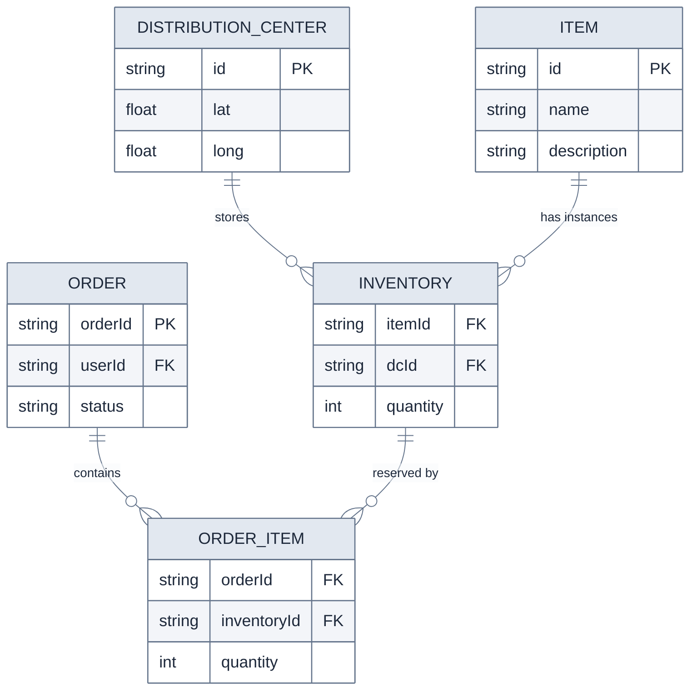

---

### API Design

We only need **two APIs** to meet requirements: one for availability and one for ordering. Location is passed to both — before an order can be processed, we must confirm inventory is available close enough for 1-hour delivery.

#### 1. Get Availability

```
GET /v1/availability?lat={LAT}&long={LONG}&keyword={}&page_size={}&page_num={}

Response:
{
  items: [
    {
      name: string,
      quantity: number
    }
  ]
}
```

#### 2. Place an Order

```
POST /v1/order

Request:
{
  lat: number,
  long: number,
  items: [ITEM_ID_1, ITEM_ID_2, ...]
}

Response: Order | Failure
```

> **Note:** We include location in both APIs. The order API uses the location to confirm the inventory is available close enough to deliver within 1 hour.

---

## High-Level Design

### 1. Query Availability of Items by Location

To satisfy this requirement, we need two steps:

1. **Find nearby DCs** — DCs close enough to deliver within 1 hour.
2. **Check inventory** — Query inventory across those DCs and return the union to the user.

Each step must be reasonably fast since end-to-end latency should be < 100ms.

---

#### Step 1: Find Nearby DCs (Nearby Service)

We need an internal service that takes `LAT` and `LONG` and returns a list of DCs within 1-hour delivery range. Assuming a table of DCs with their lat/long coordinates:

- A basic version uses **Euclidean distance**.
- A more sophisticated version uses the **Haversine formula** (accounts for Earth's curvature).
- Apply a simple threshold to get DCs within X distance as the crow flies.

> This isn't perfectly satisfying the 1-hour drive-time requirement, but we'll refine it in the deep dive.

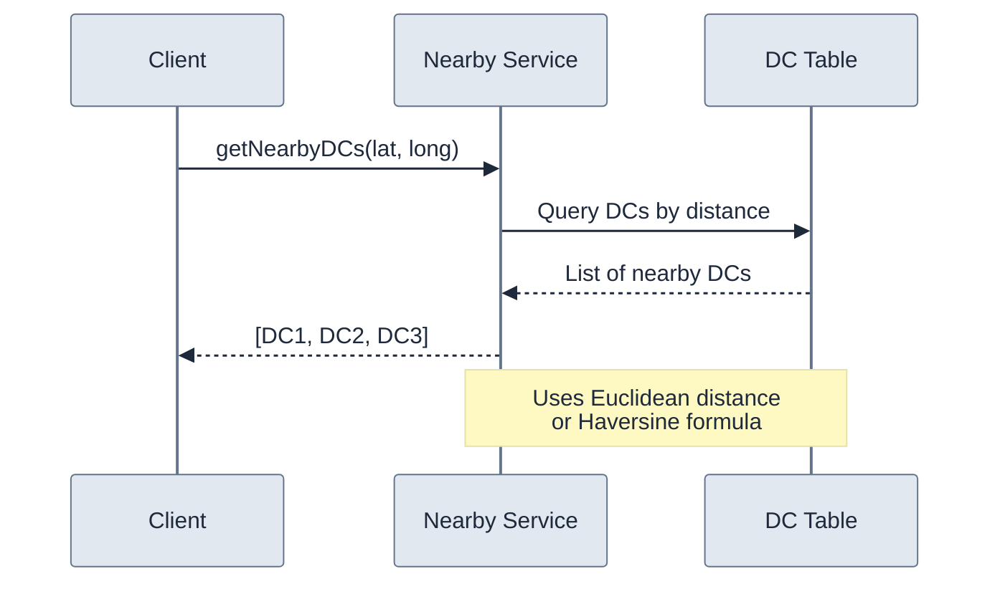

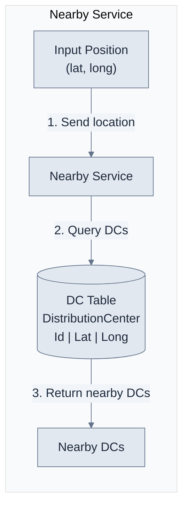

---

#### Step 2: Check Inventory (Availability Service)

Once we have nearby DCs, query the **Inventory** table and join with the **Item** table to get item names, descriptions, and quantities.

- Use a **Postgres** database for inventory data.
- Join inventory with item metadata before returning results.

> In many e-commerce systems, the "Catalog" is stored separately from inventory due to different consumers and workloads. We store them in the same database here for simplicity but would ideally separate them, add an Elasticsearch index for search, etc.

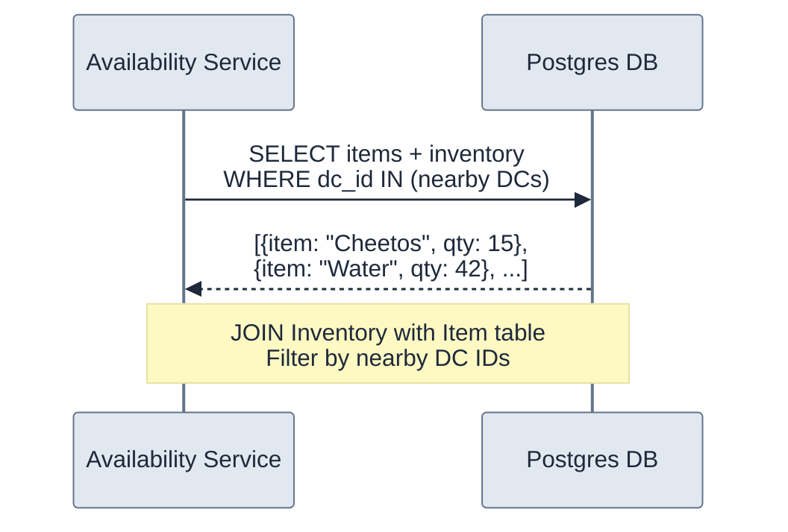

---

#### Full Availability Flow

Putting it all together:

1. User makes a request to the **Availability Service** with location and filters.
2. Availability Service fires a request to the **Nearby Service** with the user's location.
3. Nearby Service returns a list of DCs that can deliver to the location.
4. Availability Service queries the database with those DC IDs.
5. Results are summed up and returned to the client.

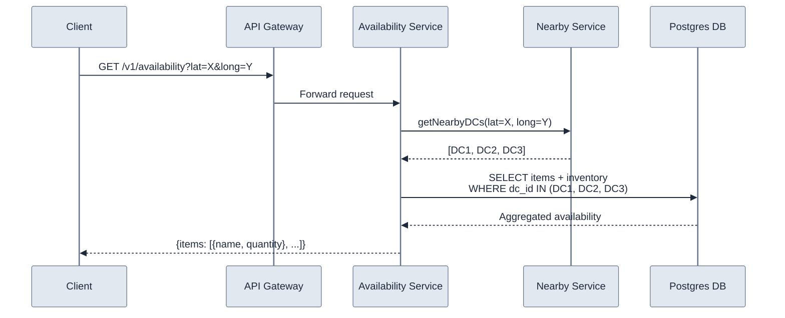

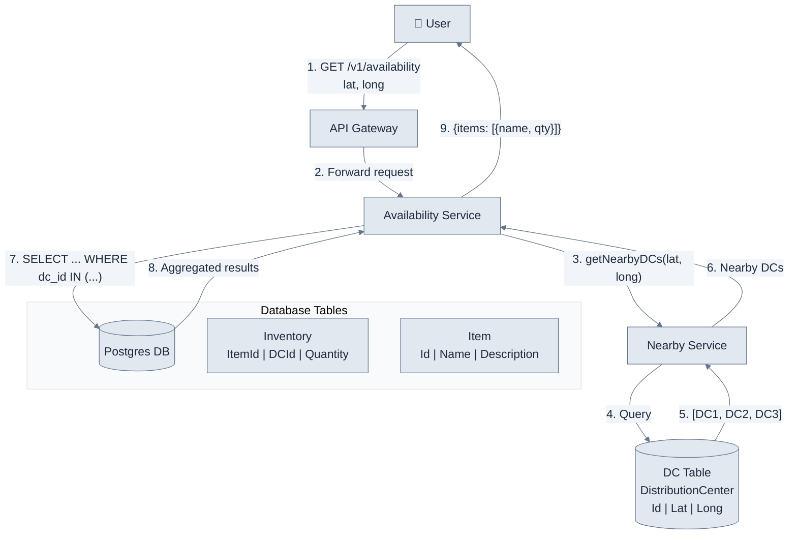

---

### 2. Ordering Items

For ordering, we require **strong consistency** — two users must not be able to purchase the same physical product.

This "double booking" problem is common across system design. We need some form of **locking** so only one user can hold a lock on inventory at a time while checking and recording the order.

---

#### ❌ Good Solution: Two Data Stores with a Distributed Lock

Use separate data stores for inventory and orders, coordinated by a distributed lock (e.g., Redis lock).

- **Problem:** Managing distributed transactions across multiple stores is complex, introduces additional failure modes, and is harder to reason about.

---

#### ✅ Great Solution: Singular Postgres Transaction

When atomicity of transactions is a requirement, it's helpful to have data **colocated in an ACID data store**. By leaning into our existing Postgres database, we keep the system simple.

**Order Process:**

1. User makes a request to the **Orders Service** to place an order for items A, B, and C.
2. Orders Service creates a **singular transaction** submitted to the Postgres leader:
   - a. Check inventory for items A, B, and C > 0.
   - b. If any items are out of stock → **transaction fails**.
   - c. If all items are in stock → record the order and update inventory status to "ordered".
   - d. A new row is created in the **Orders** table (and **OrderItems** table).
   - e. **Transaction is committed**.
3. If the transaction succeeds, return the order to the user.

> **Downside:** If any item becomes unavailable, the **entire order fails**. We return a meaningful error, but this is preferable to succeeding with an incomplete order (e.g., a device without its battery).

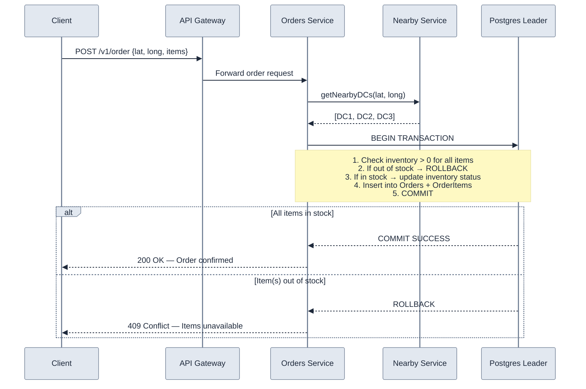

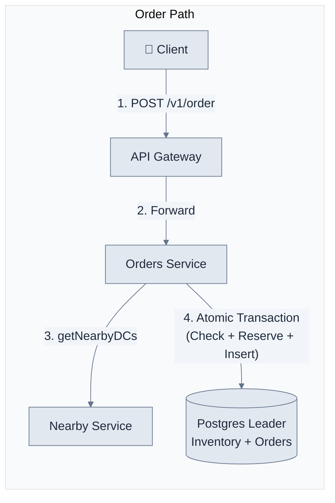

---

### Putting It All Together

The complete high-level design with both availability and ordering:

#### Component Breakdown

| Component | Responsibility |
|-----------|---------------|
| **API Gateway** | Routes requests, handles SSL termination, rate limiting, authentication. |
| **Availability Service** | Handles availability requests. Reads from read replicas. |
| **Orders Service** | Handles order placement. Writes to Postgres leader using atomic transactions. |
| **Nearby Service** | Shared service for looking up DCs close to a user's location. |
| **Postgres DB** | Single database for inventory and orders, partitioned by region. Read replicas for availability, leader for ordering. |

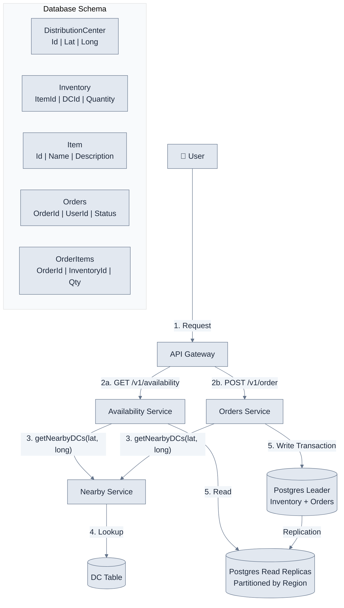

---

## Deep Dives

### 1. Incorporating Traffic and Drive Time

Our system currently determines nearby DCs based on simple distance calculations. But a DC over a river, across a border, or in heavy traffic may be **close in miles but far in drive time**. Since our requirements mandate 1-hour delivery, we need something more sophisticated.

---

#### ❌ Bad Solution: Simple SQL Distance

- Using raw Euclidean or Haversine distance in a SQL query.
- Does not account for traffic, roads, or physical barriers.
- May miss DCs that are close by road but far by straight-line distance, and vice versa.

---

#### ❌ Bad Solution: Travel Time Service Against All DCs

- For every availability request, call an external travel time API (e.g., Google Maps) for **all 10k DCs**.
- **Problem:** 10k API calls per availability request is far too slow and expensive to meet < 100ms latency.

---

#### ✅ Great Solution: Travel Time Service Against Nearby DCs

Use a **two-step approach**:

1. **Pre-filter with distance** — Use simple Haversine/Euclidean distance to narrow down to a small set of candidate DCs (e.g., within 50 miles). This is fast and eliminates the vast majority of DCs.
2. **Refine with travel time** — Call an external Travel Time Estimation Service only for the small set of candidate DCs to get accurate drive times, accounting for real traffic and road conditions.
3. **Cache results** — Cache the travel times between user zones and DCs. Travel times for a given zone don't change frequently (maybe refresh every few minutes).

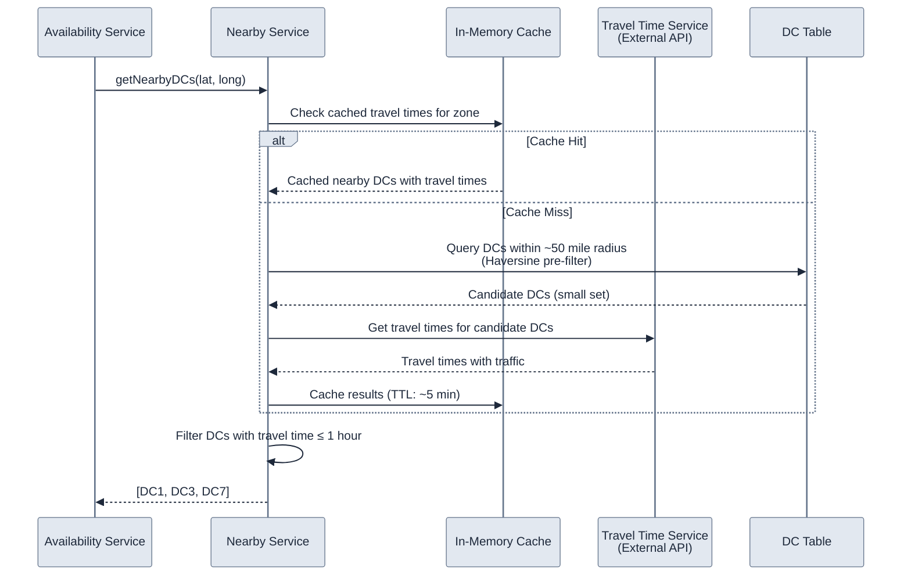

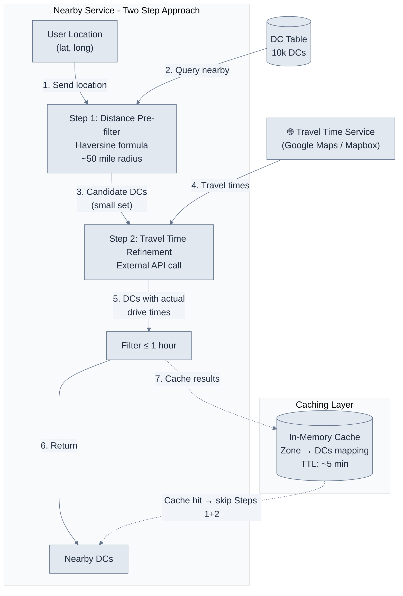

> **Key Insight:** The Nearby Service syncs with DC data and uses the Travel Time Service to incorporate traffic. By pre-filtering with distance, we reduce the external API calls from 10k → ~10-20, keeping latency well under 100ms.

---

### 2. Making Availability Lookups Fast and Scalable

Currently, once we have nearby DCs, we look up availability directly from the database. Let's estimate the load:

#### Quantitative Estimation

```
Orders/day:    10M
Seconds/day:   ~100k
Orders/sec:    10M / 100k = 100 orders/sec

Assume each user views ~10 pages before purchasing, and only 5% of users buy:

Queries/sec:   100 / 0.05 * 10 = 20,000 queries/second
```

> **20k queries/second** is a sizeable number. We clearly need to think about scaling.

> **Pattern: Scaling Reads** — Local delivery services like GoPuff demonstrate classic scaling reads patterns where inventory queries **vastly outnumber** actual purchases. With 20k queries/second for availability checks but only occasional inventory updates, **aggressive caching with short TTLs** becomes critical.

---

#### ✅ Great Solution: Query Inventory Through Cache (Redis)

Add a **Redis cache** in front of the database for availability queries:

- **Cache key:** `dc_id:item_id` → quantity
- **TTL:** Short (~1 minute) to keep data reasonably fresh.
- **Invalidation:** When an order updates inventory, invalidate (or update) the relevant cache entries.
- **Flow:** Check cache first → if miss, query DB and populate cache.

> Inventory data is a great candidate for caching — it changes relatively infrequently compared to how often it's read, and slight staleness (within 1 minute) is acceptable for availability queries.

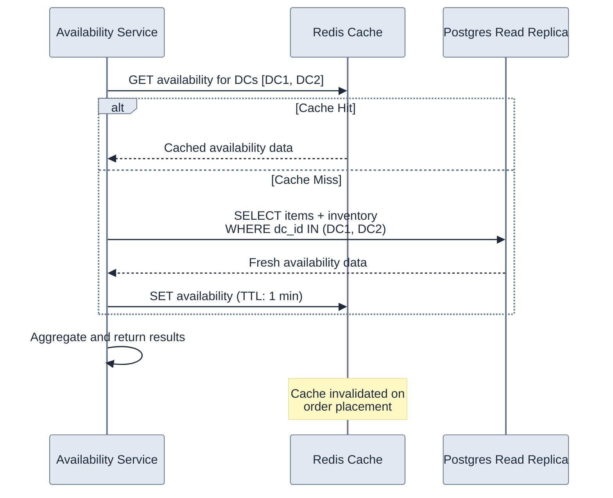

---

#### ✅ Great Solution: Postgres Read Replicas and Partitioning

For queries that miss the cache, optimize the database layer:

- **Read Replicas** — Distribute read load across multiple replicas. Availability queries read from replicas, not the leader.
- **Partitioning by Region** — Since availability is always scoped to a geographic area, partition the Inventory table by `region_id`. This ensures queries only hit the relevant partition.

| Strategy | Benefit |
|---|---|
| **Redis Cache** | Absorbs majority of read traffic. Sub-millisecond response times. |
| **Read Replicas** | Distributes cache-miss reads. No load on the leader from availability queries. |
| **Regional Partitioning** | Queries only scan relevant data. Reduces I/O and improves query speed. |

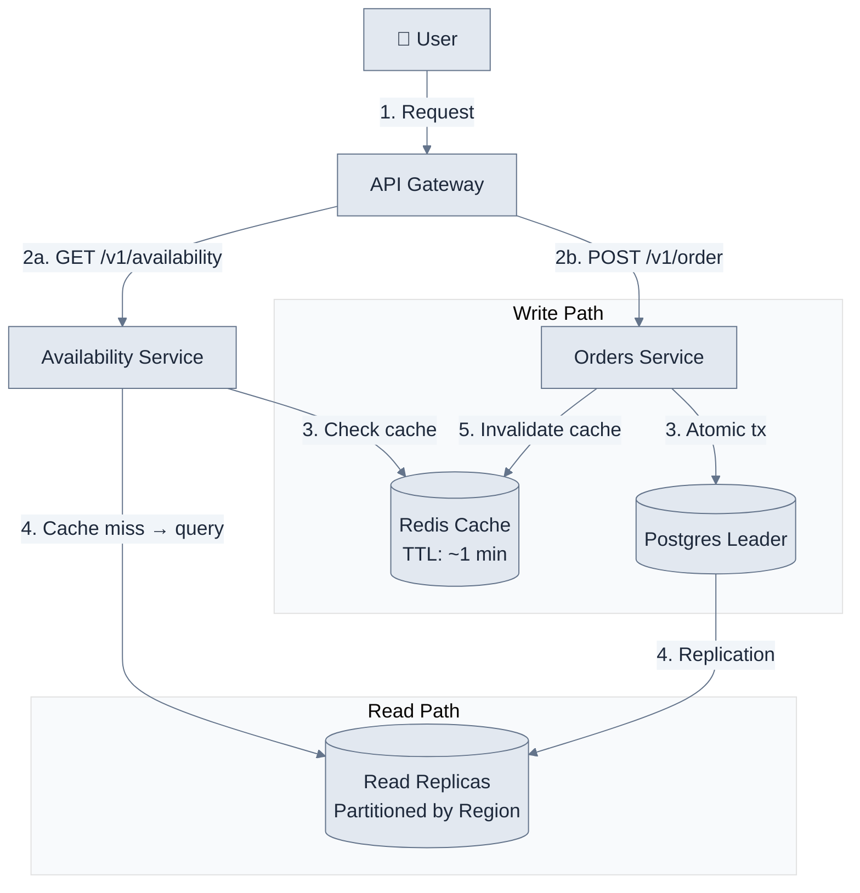

---

## Final Architecture Summary

The complete system with all optimizations:

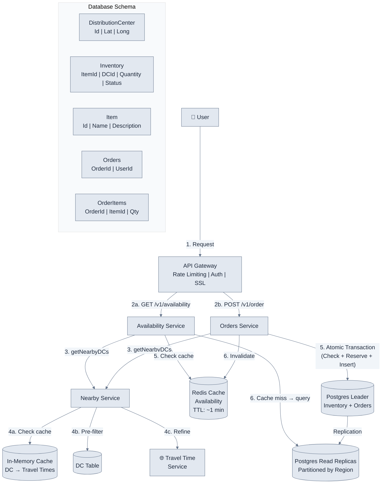

**Key Data Flow Summary:**

| Flow | Path |
|------|------|
| **Availability Query** | User → API Gateway → Availability Service → Nearby Service (cached) → Redis Cache (hit) or Read Replicas (miss) → User |
| **Place Order** | User → API Gateway → Orders Service → Nearby Service → Postgres Leader (atomic tx) → Invalidate Redis → User |

---

## What is Expected at Each Level?

### Mid-Level

| Aspect | Expectation |
|---|---|
| **Breadth vs. Depth** | ~80% breadth, 20% depth. |
| **Probing the Basics** | Interviewer confirms you understand each component (e.g., if using DynamoDB, know available indexes). |
| **Driving** | Drive early stages; interviewer may take over in later stages while probing your design. |
| **The Bar** | Clearly define API endpoints and data model. Create both routes: availability and orders. If using a "Bad" solution, have a good discussion but not expected to jump immediately to a great solution. |

### Senior

| Aspect | Expectation |
|---|---|
| **Breadth vs. Depth** | ~60% breadth, 40% depth. |
| **Advanced Design** | Familiar with advanced principles. Certain aspects (read volume, trivial partitioning) should jump out and have reasonable solutions. |
| **Articulating Decisions** | Clearly articulate pros/cons of architectural choices, especially impact on scalability, performance, maintainability. |
| **Proactivity** | Anticipate challenges and suggest improvements. Identify bottlenecks, optimize performance, ensure reliability. |
| **The Bar** | Speed through initial HLD to spend time optimizing critical paths. Expected to have optimized solutions for both atomic transactions (orders) and scaling (availability). |

### Staff+

| Aspect | Expectation |
|---|---|
| **Breadth vs. Depth** | ~40% breadth, 60% depth. |
| **Practical Experience** | "Been there, done that" expertise. Know *which* technologies to use from real-world experience. |
| **Proactivity** | Exceptional degree. Independently identify and solve issues. Anticipate problems and implement preemptive solutions. |
| **Complex Decisions** | Tackle complex technical challenges with decisions considering scalability, performance, reliability, and maintenance. |
| **The Bar** | Dive deep into 2-3 key areas with innovative thinking. Show unique insights for follow-up questions of increasing difficulty. Interviewer should come away having gained new understanding. |

---

## Key Takeaways

1. **Item vs. Inventory distinction** — Items are catalog entries (Cheetos); Inventory is physical instances at specific DCs. This distinction is critical for correct data modeling.

2. **Two-step location lookup** — Pre-filter by distance (fast, eliminates 99% of DCs), then refine with travel time API (accurate, handles traffic). Cache aggressively.

3. **ACID transactions for ordering** — Colocate inventory and orders in a single Postgres database. Use atomic transactions to prevent double booking instead of distributed locks.

4. **Scaling reads with caching** — 20k queries/sec for availability vs. ~100 writes/sec for orders. Use Redis cache (short TTL) + read replicas + regional partitioning.

5. **Quantitative estimation matters** — Backing into read volume from order volume (10M orders/day → 20k reads/sec) demonstrates you can identify bottlenecks with data.

6. **Regional partitioning is natural** — Availability is always scoped geographically. Partitioning inventory by region keeps queries efficient and enables horizontal scaling.
