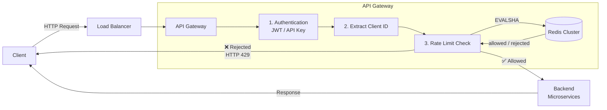
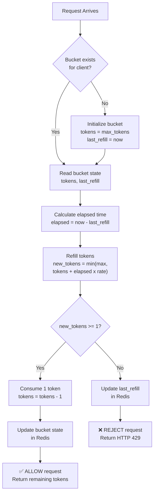
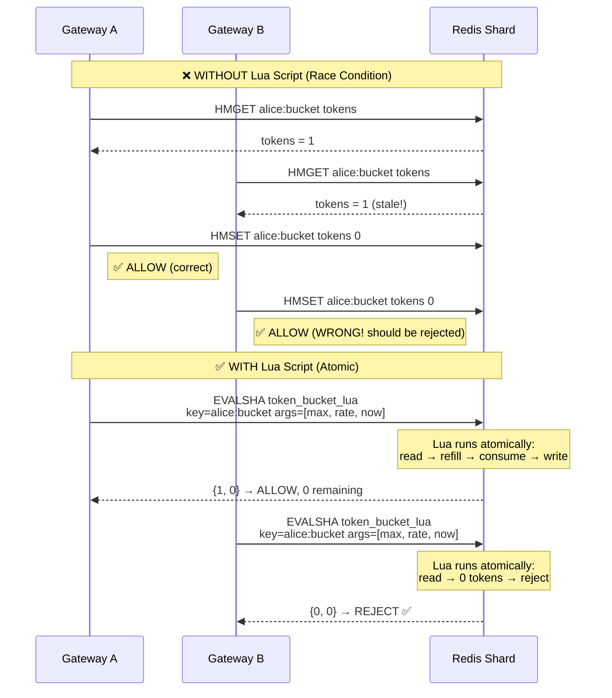
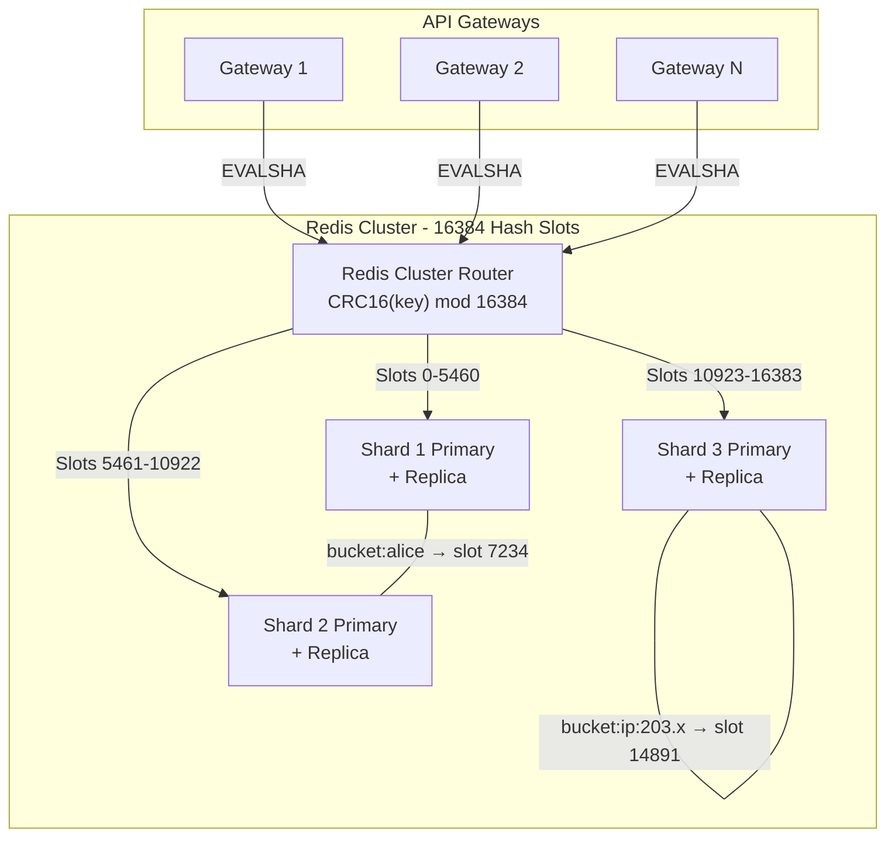
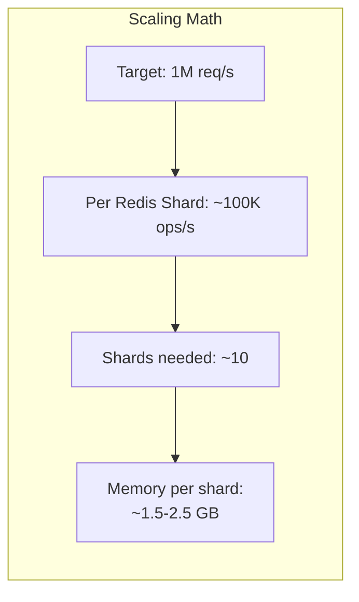
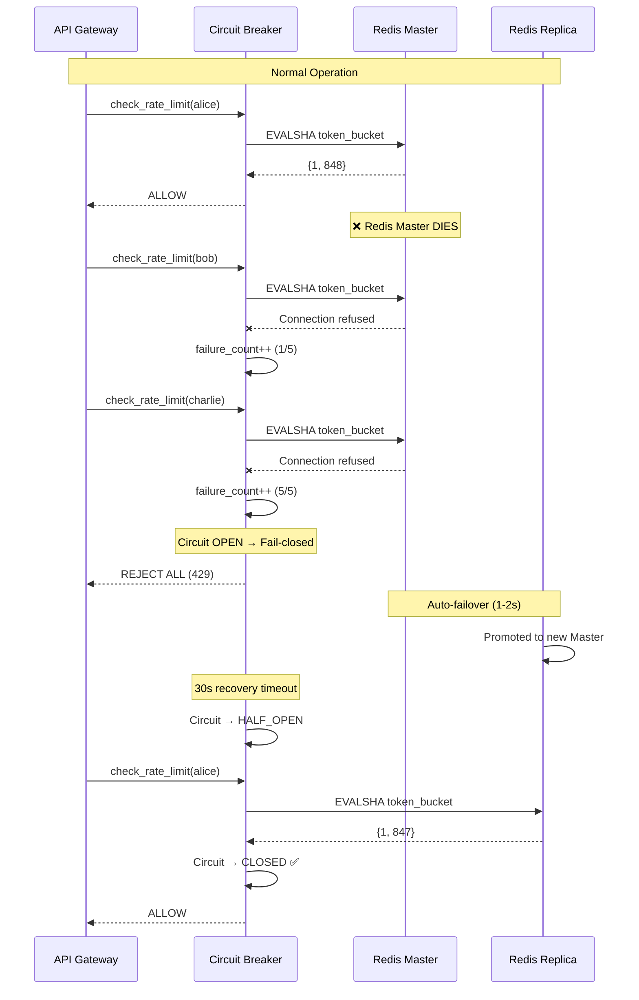
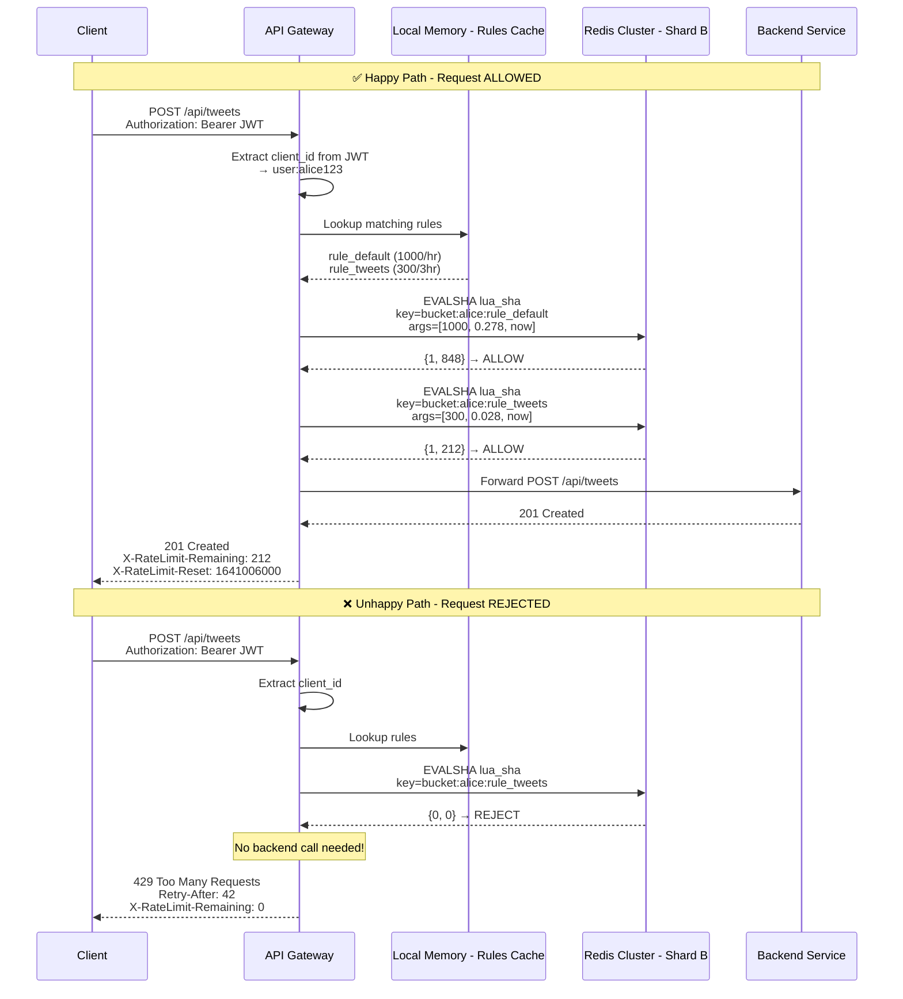
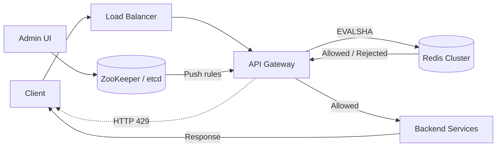

# Distributed Rate Limiter — System Design

> A comprehensive guide covering architecture, algorithms, scaling, and interview expectations for designing a distributed rate limiter.

---

## Table of Contents

- [1. Understanding the Problem](#1-understanding-the-problem)
  - [1.1 What is a Rate Limiter?](#11-what-is-a-rate-limiter)
  - [1.2 Functional Requirements](#12-functional-requirements)
  - [1.3 Non-Functional Requirements](#13-non-functional-requirements)
- [2. The Set Up](#2-the-set-up)
  - [2.1 Core Entities](#21-core-entities)
  - [2.2 System Interface](#22-system-interface)
- [3. High-Level Design](#3-high-level-design)
  - [3.1 Where to Place the Rate Limiter](#31-where-to-place-the-rate-limiter)
  - [3.2 Client Identification](#32-client-identification)
  - [3.3 Rate Limiting Algorithms](#33-rate-limiting-algorithms)
    - [3.3.1 Fixed Window Counter](#331-fixed-window-counter)
    - [3.3.2 Sliding Window Log](#332-sliding-window-log)
    - [3.3.3 Sliding Window Counter](#333-sliding-window-counter)
    - [3.3.4 Token Bucket (Recommended)](#334-token-bucket-recommended)
    - [3.3.5 Leaky Bucket](#335-leaky-bucket)
  - [3.4 Algorithm Comparison Matrix](#34-algorithm-comparison-matrix)
  - [3.5 Storing State — Why Redis?](#35-storing-state--why-redis)
  - [3.6 Handling Race Conditions](#36-handling-race-conditions)
  - [3.7 Responding to Exceeded Limits (HTTP 429)](#37-responding-to-exceeded-limits-http-429)
- [4. Deep Dives](#4-deep-dives)
  - [4.1 Scaling to 1M Requests/Second](#41-scaling-to-1m-requestssecond)
  - [4.2 High Availability & Fault Tolerance](#42-high-availability--fault-tolerance)
  - [4.3 Minimizing Latency Overhead](#43-minimizing-latency-overhead)
  - [4.4 Handling Hot Keys (Viral Content / DDoS)](#44-handling-hot-keys-viral-content--ddos)
  - [4.5 Dynamic Rule Configuration](#45-dynamic-rule-configuration)
- [5. Additional Considerations (Extra)](#5-additional-considerations-extra)
  - [5.1 Multi-Region Rate Limiting](#51-multi-region-rate-limiting)
  - [5.2 Rate Limiting at Different Layers](#52-rate-limiting-at-different-layers)
  - [5.3 Monitoring & Observability](#53-monitoring--observability)
  - [5.4 Rate Limit Bypass & Abuse Patterns](#54-rate-limit-bypass--abuse-patterns)
  - [5.5 Cost Analysis](#55-cost-analysis)
- [6. Interview Expectations by Level](#6-interview-expectations-by-level)
- [7. Quick Reference Cheat Sheet](#7-quick-reference-cheat-sheet)
- [8. End-to-End Request Flow Walkthrough](#8-end-to-end-request-flow-walkthrough)
- [9. Real-World Implementations](#9-real-world-implementations)
- [10. Common Interview Questions & Model Answers](#10-common-interview-questions--model-answers)
- [11. Architecture Decision Records (ADRs)](#11-architecture-decision-records-adrs)
- [12. Final Architecture Diagram](#12-final-architecture-diagram)
- [13. Glossary](#13-glossary)

---

## 1. Understanding the Problem

### 1.1 What is a Rate Limiter?

A **rate limiter** controls how many requests a client can make within a specific timeframe. It acts like a traffic controller for your API — allowing, for example, 100 requests per minute from a user, then rejecting excess requests with an **HTTP 429 "Too Many Requests"** response.

**Why do we need it?**

| Purpose | Description |
|---|---|
| **Prevent abuse** | Stop malicious users from overwhelming the system |
| **Protect servers** | Shield backend services from traffic bursts |
| **Ensure fairness** | Guarantee equitable resource distribution across users |
| **Cost control** | Prevent runaway API usage that inflates infrastructure costs |
| **SLA enforcement** | Enforce contractual usage limits for API consumers |
| **Compliance** | Meet regulatory requirements (e.g., financial APIs with transaction limits) |
| **Revenue protection** | Enforce different tiers of paid API access |

**Real-World Examples:**

| Company | Rate Limit Policy |
|---|---|
| **GitHub API** | 5,000 requests/hour for authenticated users; 60/hour for unauthenticated |
| **Twitter/X API** | 300 tweets/3 hours; 900 reads/15 minutes (varies by tier) |
| **Stripe API** | 100 read requests/sec; 25 write requests/sec per key |
| **AWS API Gateway** | 10,000 requests/sec per region (default); configurable per API |
| **Google Maps API** | 50 queries/second per project |
| **Discord API** | Varies per endpoint; uses bucket-based system with headers |

**Types of Rate Limiting:**

| Type | What It Limits | Example |
|---|---|---|
| **Request rate limiting** | Number of HTTP requests per time window | 100 API calls/minute |
| **Concurrent rate limiting** | Number of simultaneous active connections/requests | Max 10 parallel uploads |
| **Bandwidth/data rate limiting** | Amount of data transferred per time window | 1 GB download/hour |
| **Resource-based limiting** | Consumption of specific resources (CPU, memory, queries) | 10,000 database queries/hour |
| **Cost-based limiting** | Monetary cost of operations (common in ML/AI APIs) | $100/day spend cap on GPT-4 API |

> **Interview Tip:** Clarify with your interviewer which type of rate limiting they're asking about. The most common is request rate limiting, which is what we'll design here.

### 1.2 Functional Requirements

| # | Requirement |
|---|---|
| FR-1 | The system should **identify clients** by user ID, IP address, or API key to apply appropriate limits |
| FR-2 | The system should **limit HTTP requests** based on configurable rules (e.g., 100 API requests per minute per user) |
| FR-3 | When limits are exceeded, the system should **reject requests with HTTP 429** and include helpful headers (rate limit remaining, reset time) |

**Detailed Scenarios:**

```
Scenario 1: Authenticated User
  Alice (user_id: alice123) sends POST /api/tweets
  → Gateway extracts user_id from JWT in Authorization header
  → Checks rule: "users can send 300 tweets per 3 hours"
  → Alice has sent 299 → ALLOW (remaining: 0, reset: 1640995200)

Scenario 2: Anonymous User
  Unknown user from IP 203.0.113.42 sends GET /api/search
  → Gateway extracts IP from X-Forwarded-For header
  → Checks rule: "IPs can make 60 search requests per minute"
  → IP has made 60 → REJECT 429 (retry-after: 45s)

Scenario 3: Developer API Key
  Developer key "dk_abc123" sends GET /api/users/bulk
  → Gateway extracts key from X-API-Key header
  → Checks rule: "free-tier keys get 100 req/sec; paid keys get 1000 req/sec"
  → Key is free-tier, 85 requests this second → ALLOW (remaining: 14)
```

**Out of scope:**
- Complex querying or analytics on rate limit data
- Long-term persistence of rate limiting data
- Client-side rate limiting implementation
- Billing or metering (though rate limiting data can feed into billing systems)

### 1.3 Non-Functional Requirements

| # | Requirement |
|---|---|
| NFR-1 | Minimal latency overhead: **< 10ms per request check** |
| NFR-2 | **Highly available** — eventual consistency is acceptable (slight delays in limit enforcement across nodes are OK) |
| NFR-3 | Scale to **1M requests/second** across **100M daily active users** |

**Out of scope:**
- Strong consistency guarantees across all nodes

> **Key Insight:** Availability >> Consistency for rate limiters. A brief window where a user exceeds their limit by a few requests is far less damaging than rate-limiting becoming unavailable entirely.

**Back-of-Envelope Calculations:**

```
Scale:
  • 100M DAU
  • Average user makes ~100 API requests/day = 10B requests/day
  • Peak load ≈ 3× average (social media spikes during events)
  • 10B / 86,400 seconds ≈ ~115K req/s average
  • Peak: ~350K req/s, design for 1M req/s (3× headroom)

Storage per user (Token Bucket):
  • Key: ~30 bytes (e.g., "user:alice123:bucket")
  • tokens field: 8 bytes (double)
  • last_refill field: 8 bytes (timestamp)
  • Redis overhead per hash: ~100 bytes
  • Total per bucket: ~150 bytes
  • 100M users × 150 bytes = 15 GB
  • With 3 rule types per user: ~45 GB
  • Across 10 shards: ~4.5 GB per shard ← fits in memory comfortably

Network bandwidth:
  • Each rate limit check request: ~200 bytes
  • Each response: ~100 bytes
  • 1M req/s × 300 bytes = 300 MB/s total Redis network traffic
  • Per shard: ~30 MB/s ← well within Redis capacity

Latency budget:
  • Total request latency target: ~200ms
  • Rate limit check budget: < 10ms
  • Redis round-trip (same region): ~0.5–2ms
  • Budget remaining for compute: ~8ms ← comfortable margin
```

---

## 2. The Set Up

### 2.1 Core Entities

```
┌──────────┐       ┌──────────┐       ┌──────────┐
│  Request  │──────▶│  Client  │──────▶│   Rule   │
└──────────┘       └──────────┘       └──────────┘
```

| Entity | Description |
|---|---|
| **Rules** | Rate limiting policies defining limits for different scenarios. Each rule specifies parameters like requests per time window, which clients it applies to, and what endpoints it covers. E.g., "authenticated users get 1000 requests/hour" or "the search API allows 10 requests/minute per IP." |
| **Clients** | The entities being rate limited — users (by user ID), IP addresses, API keys, or combinations thereof. Each client has associated rate limiting state tracking current usage against applicable rules. |
| **Requests** | Incoming API requests to be evaluated against rate limiting rules. Each request carries context: client identity, endpoint being accessed, and timestamp that determines which rules apply. |

**How they interact:** When a **Request** arrives → identify the **Client** → look up applicable **Rules** → check current usage against those rules → decide whether to **allow** or **deny**.

### 2.2 System Interface

```
isRequestAllowed(clientId, ruleId) -> {
    passes: boolean,
    remaining: number,
    resetTime: timestamp
}
```

| Parameter | Type | Description |
|---|---|---|
| `clientId` | string | User ID, IP address, or API key |
| `ruleId` | string | Identifier for the rate limiting rule to check against |
| **Returns** | object | Whether request is allowed, remaining quota, and when the limit resets |

The returned data feeds directly into response headers:
- `X-RateLimit-Remaining` ← `remaining`
- `X-RateLimit-Reset` ← `resetTime`

---

## 3. High-Level Design

### 3.1 Where to Place the Rate Limiter

There are three main placement options:

| Option | Approach | Pros | Cons | Verdict |
|---|---|---|---|---|
| **In-Process** | Rate limiting logic runs inside each microservice | No extra network hop; simple | Each instance sees only its own traffic; no global enforcement | ❌ Bad |
| **Dedicated Service** | Separate rate limiter microservice | Centralized; clean separation | Extra network hop for every request; another service to maintain | ✅ Good |
| **API Gateway / Load Balancer** | Rate limiting at the gateway layer | Centralized control; no extra network hops; natural entry point | Tightly coupled with gateway | ✅✅ Great |

**Detailed breakdown of each option:**

**Option 1: In-Process (Bad)**
```
┌───────────────────────────────────────────────────┐
│  Microservice Instance 1                        │
│  ┌───────────────────────┐  ┌──────────────────┐  │
│  │  Rate Limiter (local) │  │ Business Logic  │  │
│  │  counter: {alice: 50}│  │                 │  │
│  └───────────────────────┘  └──────────────────┘  │
└───────────────────────────────────────────────────┘
┌───────────────────────────────────────────────────┐
│  Microservice Instance 2                        │
│  ┌───────────────────────┐  ┌──────────────────┐  │
│  │  Rate Limiter (local) │  │ Business Logic  │  │
│  │  counter: {alice: 50}│  │                 │  │
│  └───────────────────────┘  └──────────────────┘  │
└───────────────────────────────────────────────────┘

Problem: Alice sends 50 requests to Instance 1 and 50 to Instance 2.
Each instance thinks alice made only 50 requests.
Globally, alice made 100 — but neither instance knows that.
→ Rate limiting is BROKEN.
```

The only way in-process works is with **sticky sessions** (all of a user's requests go to the same instance), but this defeats the purpose of load balancing and creates hot spots.

**Option 2: Dedicated Service (Good)**
```
Client → Microservice 1 ───┐
                            ├───→ Rate Limiter Service ───→ Redis
Client → Microservice 2 ───┘
                            │
Client → Microservice 3 ───┘
```

This works because state is centralized, but every single API request requires an additional network hop to the rate limiter service. At 1M req/s, that's 1M extra HTTP calls per second. The rate limiter service itself becomes a bottleneck and single point of failure.

**Option 3: API Gateway / Load Balancer (Great) ← Our Choice**
```
                    ┌─────────────────┐
  Client ──────────▶│   API Gateway   │──────▶ Microservice 1
                    │  (Rate Limiter) │──────▶ Microservice 2
                    │                 │──────▶ Microservice 3
                    └────────┬────────┘
                             │
                             ▼
                        ┌─────────┐
                        │  Redis  │
                        └─────────┘
```

The API Gateway already sits on the request path. No extra network hops since the rate limit check is part of the gateway's processing pipeline. Examples:
- **AWS API Gateway** — built-in rate limiting via usage plans
- **Kong** — rate limiting plugin
- **NGINX** — `ngx_http_limit_req_module`
- **Envoy Proxy** — local and global rate limiting filters
- **Zuul / Spring Cloud Gateway** — rate limiter filters

#### Diagram: Rate Limiter Placement in API Gateway



### 3.2 Client Identification

Since the rate limiter lives in the API Gateway, it only has access to information in the HTTP request itself:

| Method | Source | Best For | Considerations |
|---|---|---|---|
| **User ID** | `Authorization` header (JWT token) | Authenticated APIs | Most precise; one limit per user regardless of device |
| **IP Address** | `X-Forwarded-For` header | Public APIs / unauthenticated | Shared IPs (NAT, corporate firewalls) can cause false positives |
| **API Key** | `X-API-Key` header | Developer/partner APIs | Each key holder gets their own limits |
| **Composite Key** | Combination of above | Multi-dimensional limiting | Most flexible; higher complexity |

**How the Gateway extracts client identity:**

```python
# Pseudocode for client identification at the API Gateway
def extract_client_id(request):
    # Priority 1: Try authenticated user ID from JWT
    auth_header = request.headers.get('Authorization')
    if auth_header and auth_header.startswith('Bearer '):
        token = auth_header[7:]  # Remove 'Bearer ' prefix
        claims = jwt_decode(token)  # Decode JWT (already verified by gateway)
        return f"user:{claims['user_id']}"  # e.g., "user:alice123"
    
    # Priority 2: Try API Key
    api_key = request.headers.get('X-API-Key')
    if api_key:
        return f"apikey:{api_key}"  # e.g., "apikey:dk_abc123"
    
    # Priority 3: Fall back to IP address
    ip = get_client_ip(request)  # Parse X-Forwarded-For chain
    return f"ip:{ip}"  # e.g., "ip:203.0.113.42"

def get_client_ip(request):
    # X-Forwarded-For: client, proxy1, proxy2
    # Only trust the LAST entry added by our own load balancer
    forwarded_for = request.headers.get('X-Forwarded-For', '')
    if forwarded_for:
        # Take the leftmost IP (original client)
        # BUT only if our infrastructure added the header
        ips = [ip.strip() for ip in forwarded_for.split(',')]
        return ips[0]
    return request.remote_addr
```

**Composite Key Examples:**

For the most robust rate limiting, use composite keys that combine multiple identifiers:

```
Key format: "{identifier_type}:{identifier_value}:{endpoint}:{rule_id}"

Examples:
  "user:alice123:global:rule_default_user"        → Alice's global limit
  "user:alice123:/api/search:rule_search"          → Alice's search-specific limit
  "ip:203.0.113.42:global:rule_default_ip"         → IP-level global limit
  "apikey:dk_abc123:/api/bulk:rule_bulk_endpoint"  → API key + endpoint limit
```

**In practice, layer multiple rules:**

```
Per-user limits:       "Alice can make 1000 requests/hour"
Per-IP limits:         "This IP can make 100 requests/minute"
Global limits:         "Our API can handle 50,000 requests/second total"
Endpoint-specific:     "Search API: 10 req/min; Profile updates: 100 req/min"
```

> **Important:** The rate limiter checks ALL applicable rules and enforces the **most restrictive** one. If Alice has quota remaining on her user limit but her IP has hit its cap, she gets blocked.

### 3.3 Rate Limiting Algorithms

> **Important — What lives WHERE?**
>
> This is a common point of confusion. Here's exactly what each component is responsible for:
>
> | Component | What It Stores / Does |
> |---|---|
> | **API Gateway (in-memory)** | Rate limiting **rules/config** (e.g., "100 req/min for users"). Cached from ZooKeeper/DB. Also: JWT decoding, client ID extraction, routing to correct Redis shard. |
> | **Redis** | Rate limiting **state/data** only — the raw numbers: `{tokens: 84.5, last_refill: 1640995200}`. Nothing else. Redis doesn't know what these numbers mean. |
> | **Redis Lua Script** | The algorithm **logic** (read state → calculate refill → decide allow/reject → update state). This runs INSIDE Redis to guarantee atomicity. |
>
> **The flow:**
> ```
> API Gateway                              Redis
> ┌──────────────────────┐                 ┌────────────────────────────┐
> │ 1. Extract client ID │                 │                            │
> │ 2. Look up rules     │                 │  Lua Script executes:      │
> │    (from memory)      │   EVALSHA ───▶  │  3. Read: tokens=84.5      │
> │                       │                 │  4. Calc: +2.7 = 87.2      │
> │                       │                 │  5. Consume: 87.2-1 = 86.2 │
> │                       │   ◀─── {1,86}  │  6. Write: tokens=86.2     │
> │ 7. Return response    │                 │  7. Return: allowed, 86    │
> └──────────────────────┘                 └────────────────────────────┘
> ```
>
> The **pseudocode below shows the algorithm logic conceptually** using local Python dictionaries (`self.buckets = {}`). In production, replace `self.buckets` with Redis calls — or better yet, the entire `is_allowed()` method becomes a Lua script running inside Redis.

#### 3.3.1 Fixed Window Counter

The simplest approach. Divides time into **fixed windows** (like 1-minute buckets) and counts requests in each window.

```
Time:    |---12:00:00---|---12:01:00---|---12:02:00---|
Alice:   |     100      |      5       |      42      |
Bob:     |      20      |     75       |      10      |
```

**Data structure:** Hash table mapping `clientId:windowStart → counter`

```json
{
  "alice:12:00:00": 100,
  "alice:12:01:00": 5,
  "bob:12:00:00": 20,
  "charlie:12:00:00": 0
}
```

**Pros:**
- Extremely simple to implement
- Minimal memory (one counter per client per window)
- O(1) time complexity for each check

**Cons:**
- **Boundary effect:** A user could make 100 requests at 12:00:59, then 100 more at 12:01:00 — effectively 200 requests in 2 seconds
- Potential for "starvation" if a user hits their limit early in a window

**Pseudocode Implementation:**

```python
# NOTE: This shows the algorithm LOGIC conceptually.
# In production, `self.counters` is NOT a local dict — it's Redis.
# The logic below would be a Lua script running inside Redis.

class FixedWindowCounter:
    def __init__(self, max_requests, window_size_seconds):
        self.max_requests = max_requests          # e.g., 100
        self.window_size = window_size_seconds     # e.g., 60
        self.counters = {}  # {"client:window_start": count}
    
    def is_allowed(self, client_id):
        # Determine the current window start
        now = current_timestamp()
        window_start = now - (now % self.window_size)  # Floor to window boundary
        key = f"{client_id}:{window_start}"
        
        # Get or initialize counter
        current_count = self.counters.get(key, 0)
        
        if current_count >= self.max_requests:
            return False  # Rate limited!
        
        # Increment counter
        self.counters[key] = current_count + 1
        
        # Cleanup old windows (optional, or use TTL)
        self._cleanup_old_windows(window_start)
        
        return True
```

**Redis Implementation:**
```redis
-- Fixed window in Redis (single commands, simple but not atomic)
SET     rate:alice:1640995200  0  EX 60  NX   -- Create counter if not exists
INCR    rate:alice:1640995200                   -- Atomic increment
-- If INCR result > max_requests, reject
```

**The Boundary Problem Visualized:**
```
Limit: 100 requests per minute

    Window 1              Window 2
|<--- 60 seconds --->|<--- 60 seconds --->|
                     |
             99 reqs |  100 reqs
          (last sec) | (first sec)
                     |
         |<-2 secs-->|
         199 requests in 2 seconds!  ← Almost 2× the intended limit
```

#### 3.3.2 Sliding Window Log

Keeps a **log of individual request timestamps** for each user. On a new request, remove timestamps older than the window, then check if the remaining count exceeds the limit.

```
Alice's log (limit: 8/minute):
[12:00:02, 12:00:15, 12:00:22, 12:00:31, 12:00:45, 12:00:50, 12:00:55, 12:00:58]
                                                                          ↑
                                                        9th request in rolling minute → REJECT
```

**Pros:**
- **Perfect accuracy** — always looking at exactly the last N minutes
- No boundary effects

**Cons:**
- **High memory** — for a user making 1000 req/min, you store 1000 timestamps
- Computational overhead scanning timestamp logs for each request
- Doesn't scale well with millions of users

**Pseudocode Implementation:**

```python
# NOTE: In production, self.logs is a Redis Sorted Set (ZSET), not a local list.
# The logic below runs as a Lua script inside Redis for atomicity.

class SlidingWindowLog:
    def __init__(self, max_requests, window_size_seconds):
        self.max_requests = max_requests
        self.window_size = window_size_seconds
        self.logs = {}  # {client_id: sorted_list_of_timestamps}
    
    def is_allowed(self, client_id):
        now = current_timestamp()
        window_start = now - self.window_size
        
        # Get or initialize the timestamp log
        if client_id not in self.logs:
            self.logs[client_id] = []
        
        log = self.logs[client_id]
        
        # Remove all timestamps outside the current window
        # (older than window_start)
        while log and log[0] <= window_start:
            log.pop(0)  # Remove oldest
        
        # Check if adding this request would exceed the limit
        if len(log) >= self.max_requests:
            return False  # Rate limited!
        
        # Allow the request and record the timestamp
        log.append(now)
        return True
```

**Redis Implementation (using Sorted Sets):**
```redis
-- Sliding window log using Redis sorted set
-- Score = timestamp, Member = unique request ID
ZREMRANGEBYSCORE  rate:alice  0  <window_start>   -- Remove old entries
ZCARD              rate:alice                       -- Count entries in window
-- If ZCARD result >= max_requests, reject
ZADD               rate:alice  <now>  <request_id>  -- Add this request
EXPIRE             rate:alice  <window_size>        -- Auto-cleanup
```

**Memory Analysis:**
```
For a user making 1000 req/min:
  • Each timestamp: 8 bytes + sorted set overhead ~50 bytes per entry
  • Per user: 1000 × 58 = ~58 KB
  • 100M users: 58 KB × 100M = 5.8 TB  ← Completely impractical!
  • Compare to Token Bucket: 150 bytes × 100M = 15 GB
```

#### 3.3.3 Sliding Window Counter

A clever **hybrid** that approximates sliding windows using fixed windows with math.

Maintains counters for the **current window** and the **previous window**. Estimates the "true" sliding window count by weighting:

```
Estimated count = (previous_window_count × overlap%) + current_window_count
```

**Example:** If you're 30% through the current minute:
- Count = (70% × previous minute's requests) + (100% × current minute's requests)

**Pros:**
- Much better accuracy than fixed windows
- Minimal memory — just two counters per client

**Cons:**
- Approximation (assumes traffic is evenly distributed within windows)
- Math can be tricky to implement correctly

**Detailed Worked Example:**

```
Rule: 100 requests per minute
Previous window (12:00:00 - 12:00:59): 84 requests
Current window  (12:01:00 - 12:01:59): 36 requests

Current time: 12:01:15 (we are 25% into the current window)

Weighted count = (prev_count × overlap%) + curr_count
               = (84 × 75%) + 36
               = 63 + 36
               = 99

Since 99 < 100 → ALLOW this request

Next request at 12:01:16:
Weighted count = (84 × 74.7%) + 37 = 62.7 + 37 = 99.7 → rounds to 100 → REJECT
```

**Pseudocode Implementation:**

```python
# NOTE: In production, self.windows is stored as Redis keys with TTL.
# The logic below runs as a Lua script inside Redis for atomicity.

class SlidingWindowCounter:
    def __init__(self, max_requests, window_size_seconds):
        self.max_requests = max_requests
        self.window_size = window_size_seconds
        self.windows = {}  # {client_id: {window_start: count}}
    
    def is_allowed(self, client_id):
        now = current_timestamp()
        current_window = now - (now % self.window_size)
        previous_window = current_window - self.window_size
        
        # How far are we into the current window? (0.0 to 1.0)
        elapsed_in_window = (now - current_window) / self.window_size
        
        # Get counters
        client_windows = self.windows.get(client_id, {})
        prev_count = client_windows.get(previous_window, 0)
        curr_count = client_windows.get(current_window, 0)
        
        # Weighted estimate
        overlap_fraction = 1.0 - elapsed_in_window  # How much of prev window overlaps
        estimated_count = (prev_count * overlap_fraction) + curr_count
        
        if estimated_count >= self.max_requests:
            return False  # Rate limited!
        
        # Increment current window counter
        if client_id not in self.windows:
            self.windows[client_id] = {}
        self.windows[client_id][current_window] = curr_count + 1
        
        return True
```

**Why the approximation is acceptable:**
Studies show that the sliding window counter has only a **~0.003% false positive rate** for most real-world traffic patterns. The approximation error only matters when traffic is extremely uneven within a window, which is rare at scale due to the law of large numbers.

#### 3.3.4 Token Bucket (Recommended)

Each client has a **bucket** that holds tokens up to a **burst capacity**. Tokens are added at a steady **refill rate**. Each request consumes one token. No tokens → request rejected.

```
┌───────────────────┐
│  Bucket (max: 100)│
│  ████████████░░░░  │  ← 75 tokens remaining
│  Refill: 10/min   │
└───────────────────┘
```

**Example:** Bucket holds 100 tokens (burst capacity), refills at 10 tokens/minute (steady rate).
- Client can burst up to 100 requests immediately
- Then sustain 10 requests/minute

**Data per client:** Just two values — `(current_tokens, last_refill_time)`

**Pros:**
- Simple to implement
- Memory efficient
- Naturally handles **bursty traffic** (real-world traffic is bursty)
- Used by **Stripe**, **AWS**, and many production systems

**Cons:**
- Choosing the right bucket size and refill rate requires tuning
- "Cold start" — idle clients start with full buckets

**This is our chosen algorithm** because it strikes the best balance between simplicity, memory efficiency, and handling real-world traffic patterns.

**Pseudocode Implementation:**

```python
# NOTE: In production, self.buckets is a Redis Hash (HMSET/HMGET).
# This entire is_allowed() method runs as a Lua script inside Redis.
# See Section 3.6 for the actual Lua script.

class TokenBucket:
    def __init__(self, max_tokens, refill_rate_per_second):
        self.max_tokens = max_tokens                    # Burst capacity (e.g., 100)
        self.refill_rate = refill_rate_per_second        # Steady rate (e.g., 10/sec)
        self.buckets = {}  # {client_id: {tokens, last_refill}}
    
    def is_allowed(self, client_id):
        now = current_timestamp()
        
        # Initialize bucket if first request
        if client_id not in self.buckets:
            self.buckets[client_id] = {
                'tokens': self.max_tokens,  # Start with full bucket
                'last_refill': now
            }
        
        bucket = self.buckets[client_id]
        
        # Step 1: Calculate token refill
        elapsed = now - bucket['last_refill']
        tokens_to_add = elapsed * self.refill_rate
        bucket['tokens'] = min(self.max_tokens, bucket['tokens'] + tokens_to_add)
        bucket['last_refill'] = now
        
        # Step 2: Try to consume a token
        if bucket['tokens'] >= 1:
            bucket['tokens'] -= 1
            remaining = int(bucket['tokens'])
            return True, remaining  # Allowed
        else:
            return False, 0  # Rejected
```

**Token Bucket Behavior Over Time:**
```
Bucket capacity: 10 tokens, Refill: 2 tokens/second

Time    Event              Tokens   Result
0.0s    Request arrives    10 → 9   ALLOW  (started full)
0.1s    Request arrives     9 → 8   ALLOW
0.2s    5 requests burst    8 → 3   ALLOW all 5
0.3s    Request arrives     3.2→2.2  ALLOW  (refilled 0.2 tokens in 0.1s)
1.0s    Request arrives     5.6→4.6  ALLOW  (refilled 1.4 tokens over 0.7s)
5.0s    Request arrives    10 → 9   ALLOW  (bucket refilled to max)
--- 10 rapid requests ---
5.0s    10 requests burst  10 → 0   ALLOW all 10
5.0s    Request arrives     0       REJECT (no tokens!)
5.5s    Request arrives     1 → 0   ALLOW  (refilled 1 token in 0.5s)
```

#### 3.3.5 Leaky Bucket

The **Leaky Bucket** is the sibling of the Token Bucket. Instead of adding tokens, think of a bucket with a hole at the bottom that "leaks" requests at a constant rate.

Requests enter the bucket (a FIFO queue). The bucket processes requests at a fixed rate. If the bucket (queue) is full when a new request arrives, it's dropped.

```
    Incoming requests
         │ │ │
         ▼ ▼ ▼
    ┌─────────────┐
    │  ▁ ▁ ▁ ▁ ▁   │  ← Queue (capacity = 5)
    │             │     If full, new requests
    │  ▁ ▁ ▁      │     are DROPPED
    └─────┬───────┘
          │
          ▼  ← Leaks at a CONSTANT rate (e.g., 10 req/sec)
    Processed requests
```

**Key Differences from Token Bucket:**

| Aspect | Token Bucket | Leaky Bucket |
|---|---|---|
| **Burst handling** | Allows bursts up to bucket capacity | Smooths out bursts; processes at constant rate |
| **Output rate** | Variable (can be bursty) | Constant (always steady) |
| **Queue** | No queue; immediate accept/reject | Has a queue; requests may wait |
| **Best for** | APIs where bursts are acceptable | Systems requiring steady, predictable output |
| **Used by** | Stripe, AWS | NGINX (`limit_req`), network traffic shaping |

**Pseudocode Implementation:**

```python
# NOTE: Same pattern — self.buckets is Redis, logic runs as Lua script.

class LeakyBucket:
    def __init__(self, capacity, leak_rate_per_second):
        self.capacity = capacity            # Max queue size
        self.leak_rate = leak_rate_per_second  # Constant output rate
        self.buckets = {}  # {client_id: {water_level, last_leak_time}}
    
    def is_allowed(self, client_id):
        now = current_timestamp()
        
        if client_id not in self.buckets:
            self.buckets[client_id] = {
                'water_level': 0,
                'last_leak_time': now
            }
        
        bucket = self.buckets[client_id]
        
        # Step 1: Leak water based on time elapsed
        elapsed = now - bucket['last_leak_time']
        leaked = elapsed * self.leak_rate
        bucket['water_level'] = max(0, bucket['water_level'] - leaked)
        bucket['last_leak_time'] = now
        
        # Step 2: Try to add water (incoming request)
        if bucket['water_level'] < self.capacity:
            bucket['water_level'] += 1
            return True  # Allowed (added to queue)
        else:
            return False  # Rejected (bucket overflow)
```

> **Interview Tip:** Most interviewers are happy with Token Bucket. Only bring up Leaky Bucket if asked about smoothing bursty traffic or if the interviewer specifically mentions constant-rate processing.

#### Diagram: Token Bucket Algorithm Flow



### 3.4 Algorithm Comparison Matrix

| Algorithm | Memory | Accuracy | Burst Handling | Complexity | Best For |
|---|---|---|---|---|---|
| Fixed Window Counter | ⭐⭐⭐ Very Low | ⭐ Low | ❌ Boundary spikes | ⭐⭐⭐ Simple | Simple use cases, prototyping |
| Sliding Window Log | ⭐ High | ⭐⭐⭐ Perfect | ✅ Smooth | ⭐⭐ Medium | When accuracy is paramount and scale is small |
| Sliding Window Counter | ⭐⭐⭐ Very Low | ⭐⭐ Good (approx) | ⭐⭐ Better than fixed | ⭐⭐ Medium | Good balance when bursts aren't important |
| **Token Bucket** | ⭐⭐⭐ Very Low | ⭐⭐ Good | ✅ Natural burst support | ⭐⭐⭐ Simple | **Production systems, bursty API traffic** |
| Leaky Bucket | ⭐⭐⭐ Very Low | ⭐⭐ Good | ❌ Smooths bursts (constant output) | ⭐⭐⭐ Simple | Traffic shaping, constant-rate processing |

### 3.5 Storing State — Why Redis?

> **To be very clear:** The API Gateway holds the **rules and decision-making orchestration** in memory. Redis holds ONLY the **numerical state** (counters, tokens, timestamps). The algorithm **logic** is shipped to Redis as a Lua script so it can execute atomically.

**What exactly is stored in Redis per algorithm?**

| Algorithm | Redis Key | Redis Value | Redis Data Type |
|---|---|---|---|
| Fixed Window Counter | `rate:{clientId}:{windowStart}` | `counter` (integer) | String (with INCR) |
| Sliding Window Log | `rate:{clientId}` | Set of timestamps | Sorted Set (ZSET) |
| Sliding Window Counter | `rate:{clientId}:{windowStart}` | `counter` (integer) | String (with INCR) |
| **Token Bucket** | `bucket:{clientId}:{ruleId}` | `{tokens: 84.5, last_refill: 1640995200}` | Hash (HMSET) |
| Leaky Bucket | `leak:{clientId}:{ruleId}` | `{water_level: 3, last_leak: 1640995200}` | Hash (HMSET) |

**Example: What's actually in Redis for Token Bucket?**

```redis
# Redis stores ONLY these tiny data points per client per rule:

127.0.0.1:6379> HGETALL bucket:user:alice123:rule_default
1) "tokens"
2) "84.5"              ← Just a number
3) "last_refill"
4) "1640995200"        ← Just a timestamp

127.0.0.1:6379> TTL bucket:user:alice123:rule_default
(integer) 3542          ← Auto-expires in ~59 minutes

# That's it! No rules, no logic, no config — just 2 numbers with a TTL.
```

**What the API Gateway holds in memory (NOT in Redis):**

```python
# These are cached in the gateway's local memory (from ZooKeeper/config DB)
rules = {
    "rule_default": {
        "max_tokens": 1000,
        "refill_rate": 0.278,   # tokens per second (≈1000/hour)
        "applies_to": "user:*",
        "endpoints": ["*"]
    },
    "rule_search": {
        "max_tokens": 10,
        "refill_rate": 0.167,   # ≈10/minute
        "applies_to": "user:*",
        "endpoints": ["/api/search"]
    }
}

# The gateway's rate limit check:
def check_rate_limit(client_id, endpoint):
    # 1. Find matching rules (from local memory — NO Redis call)
    matching_rules = find_rules_for(client_id, endpoint)
    
    # 2. For each rule, call Redis Lua script (THIS is the Redis call)
    for rule in matching_rules:
        result = redis.evalsha(
            LUA_SCRIPT_SHA,           # Pre-loaded Lua script hash
            keys=[f"bucket:{client_id}:{rule.id}"],
            args=[rule.max_tokens, rule.refill_rate, current_time()]
        )
        if not result.allowed:
            return REJECT_429
    
    # 3. All rules passed
    return ALLOW
```

Each token bucket tracks `(current_tokens, last_refill_time)`. This state must be **shared across all API gateway instances** — otherwise each gateway only sees a fraction of a client's traffic.

**Why not in-memory per gateway?**

If Alice makes 50 requests to Gateway A and 50 to Gateway B, each gateway thinks Alice made only 50 requests. Globally she made 100 and should be rate-limited. The algorithm becomes useless without centralized state.

**Why Redis?**

| Feature | Benefit |
|---|---|
| **Sub-millisecond latency** | Meets our < 10ms requirement |
| **In-memory storage** | Fast reads and writes |
| **Automatic cleanup** | `EXPIRE` removes inactive user buckets (e.g., after 1 hour) |
| **High availability** | Can be replicated across multiple instances |
| **Atomic operations** | `MULTI/EXEC` and Lua scripting prevent race conditions |
| **Battle-tested** | Used by virtually every major tech company for this purpose |
| **Rich data structures** | Hashes, sorted sets, strings — all useful for different algorithms |
| **Pub/Sub support** | Useful for pushing config updates to gateways |

**Why Not Other Stores?**

| Alternative | Why Not |
|---|---|
| **Memcached** | No atomic read-modify-write. No Lua scripting. No persistence. No pub/sub. Simpler but lacks critical features for safe rate limiting. |
| **DynamoDB / Cassandra** | Too slow for rate limiting (single-digit ms at best). Rate limit checks need sub-millisecond latency. Overkill for ephemeral data. |
| **In-memory (local)** | No shared state across gateways. Useless for distributed rate limiting. |
| **PostgreSQL / MySQL** | Way too slow for 1M writes/sec and not designed for this access pattern. |
| **etcd / ZooKeeper** | Designed for configuration/coordination, not high-throughput data. Limited to ~10K writes/sec. |

> **When Memcached might work:** If your rate limiting only needs simple increment operations (Fixed Window Counter) and you don't need atomicity guarantees, Memcached's `INCR` command works. But for Token Bucket (which needs atomic read-modify-write), Redis is the clear winner.

**Token Bucket Algorithm with Redis — Step by Step:**

1. Request arrives at Gateway A for user `alice`
2. Gateway fetches Alice's bucket state: `HMGET alice:bucket tokens last_refill`
3. Calculate tokens to add based on elapsed time since last refill:
   - If 30 seconds elapsed and refill rate is 1 token/sec → add 30 tokens (up to max capacity)
4. Update bucket state atomically:
   ```redis
   MULTI
   HSET alice:bucket tokens <new_token_count>
   HSET alice:bucket last_refill <current_timestamp>
   EXPIRE alice:bucket 3600
   EXEC
   ```
5. If tokens ≥ 1 → **allow** request, decrement by 1
6. If tokens = 0 → **reject** with 429

### 3.6 Handling Race Conditions

**The Problem:** The read (`HMGET`) happens **outside** the transaction. If two requests for the same user arrive simultaneously:

```
Gateway A: READ alice → 1 token left
Gateway B: READ alice → 1 token left    ← same stale value!
Gateway A: WRITE alice → 0 tokens, ALLOW
Gateway B: WRITE alice → 0 tokens, ALLOW ← should have been REJECTED!
```

Both gateways allow the request, but only 1 token was available. We allowed 2 requests when we should have allowed 1.

**The Solution: Redis Lua Scripting**

Move the **entire read-calculate-update** logic into a single atomic Lua script:

```lua
-- Rate limit check (runs atomically in Redis)
local key = KEYS[1]
local max_tokens = tonumber(ARGV[1])
local refill_rate = tonumber(ARGV[2])
local now = tonumber(ARGV[3])

local bucket = redis.call('HMGET', key, 'tokens', 'last_refill')
local tokens = tonumber(bucket[1]) or max_tokens
local last_refill = tonumber(bucket[2]) or now

-- Calculate token refill
local elapsed = now - last_refill
local new_tokens = math.min(max_tokens, tokens + (elapsed * refill_rate))

-- Try to consume a token
if new_tokens >= 1 then
    new_tokens = new_tokens - 1
    redis.call('HMSET', key, 'tokens', new_tokens, 'last_refill', now)
    redis.call('EXPIRE', key, 3600)
    return {1, new_tokens}  -- allowed, remaining
else
    redis.call('HMSET', key, 'tokens', new_tokens, 'last_refill', now)
    redis.call('EXPIRE', key, 3600)
    return {0, 0}  -- rejected, 0 remaining
end
```

Lua scripts in Redis are **atomic** — the entire script executes without interruption. This eliminates the race condition completely.

**How the Lua Script Is Deployed & Called:**

You write **one single Lua script** that works for **all users**. The user-specific part is just the **key** you pass to it — think of it like a reusable function.

```
Same script for everyone:    check_rate_limit(key, max_tokens, refill_rate, now)

Called with different keys:
  → check_rate_limit("bucket:alice", 1000, 0.278, now)       ← Alice
  → check_rate_limit("bucket:bob",   1000, 0.278, now)       ← Bob
  → check_rate_limit("bucket:ip:1.2.3.4", 100, 1.67, now)   ← An IP address
```

**Step 1: At gateway startup — load the script once:**

**Where the files live in your codebase:**
```
your-api-gateway/
  ├── src/
  │   ├── gateway_app.py          ← Your gateway application code
  │   ├── rate_limiter.py         ← Rate limiter module (loads & calls the Lua script)
  │   └── config/
  │       └── rules.yaml          ← Rate limiting rules (synced from ZooKeeper)
  ├── scripts/
  │   └── rate_limiter.lua        ← The Lua script YOU write (shipped to Redis at startup)
  └── tests/
      └── test_rate_limiter.py    ← Tests for rate limiting logic
```

```python
# rate_limiter.py — loads the Lua script from file and registers it with Redis

# Read the Lua script from your codebase
with open("scripts/rate_limiter.lua", "r") as f:
    LUA_SCRIPT = f.read()

# Redis hashes the script and returns a SHA1 identifier
SCRIPT_SHA = redis.script_load(LUA_SCRIPT)   # → "a1b2c3d4e5f6..."
# This SHA is reused for ALL subsequent calls — the full script is NOT sent each time
```

**The actual Lua script file (`scripts/rate_limiter.lua`):**

```lua
-- scripts/rate_limiter.lua
-- Token Bucket rate limiter — runs atomically inside Redis
-- ONE script for ALL users — the user's key is passed as KEYS[1]

local key = KEYS[1]
local max_tokens = tonumber(ARGV[1])
local refill_rate = tonumber(ARGV[2])
local now = tonumber(ARGV[3])

local bucket = redis.call('HMGET', key, 'tokens', 'last_refill')
local tokens = tonumber(bucket[1]) or max_tokens
local last_refill = tonumber(bucket[2]) or now

local elapsed = now - last_refill
local new_tokens = math.min(max_tokens, tokens + (elapsed * refill_rate))

if new_tokens >= 1 then
    new_tokens = new_tokens - 1
    redis.call('HMSET', key, 'tokens', new_tokens, 'last_refill', now)
    redis.call('EXPIRE', key, 3600)
    return {1, math.floor(new_tokens)}   -- {allowed, remaining}
else
    redis.call('HMSET', key, 'tokens', new_tokens, 'last_refill', now)
    redis.call('EXPIRE', key, 3600)
    return {0, 0}                         -- {rejected, 0 remaining}
end
```

**Step 2: Per request — call by SHA hash (one Redis round-trip):**

```python
# On every incoming request, the gateway calls EVALSHA (NOT EVAL)
# EVALSHA sends only the tiny SHA hash, not the entire script text

import time

def check_rate_limit(client_id, rule):
    result = redis.evalsha(
        SCRIPT_SHA,                                         # Pre-loaded script hash
        keys=[f"bucket:{client_id}:{rule.id}"],            # Which user's bucket
        args=[rule.max_tokens, rule.refill_rate, time.time()]  # Rule params + current time
    )
    return {"allowed": result[0] == 1, "remaining": result[1]}

# Same script, called with different keys:
check_rate_limit("user:alice123",    default_rule)    # Alice's request
check_rate_limit("user:bob456",      default_rule)    # Bob's request
check_rate_limit("ip:203.0.113.42",  ip_rule)         # Anonymous IP
check_rate_limit("apikey:dk_abc123", developer_rule)  # Developer API key
```

**Summary:**

| What | How Many | Where It Lives |
|---|---|---|
| Lua script | **1** (loaded once at startup) | Your codebase → shipped to Redis via `SCRIPT LOAD` |
| Script SHA hash | **1** (returned by Redis) | Stored in gateway memory |
| Redis keys (state) | **1 per user per rule** (auto-created on first request) | Redis |
| `EVALSHA` calls | **1 per request** | Gateway → Redis |

> **Think of it like a stored procedure in a database:** you write it once, deploy it to Redis, and then call it by name (SHA). Redis executes it server-side, atomically, and returns the result. The script is just a text file in your codebase — not one script per user.

> **Pattern: Dealing with Contention** — Race conditions in distributed counters are a classic contention challenge. The solution is expanding the atomic boundary to include the entire read-modify-write sequence.

#### Diagram: Race Condition & Lua Script Solution



**Alternative: Redis WATCH (Optimistic Locking)**

Another approach is Redis's `WATCH` command for optimistic locking:

```redis
WATCH alice:bucket                           -- Watch for changes
tokens = HMGET alice:bucket tokens last_refill
-- Calculate new token count in application code
MULTI                                         -- Start transaction
HMSET alice:bucket tokens <new> last_refill <now>
EXEC                                          -- Execute atomically
-- If another client modified alice:bucket between WATCH and EXEC,
-- EXEC returns nil (transaction fails) → retry
```

**WATCH vs Lua scripting comparison:**

| Aspect | WATCH (Optimistic Locking) | Lua Script |
|---|---|---|
| **Network round trips** | 3+ (WATCH, HMGET, MULTI/EXEC) | 1 (EVALSHA) |
| **Contention handling** | Retry on conflict | No conflicts (atomic) |
| **Performance under load** | Degrades with contention (retries) | Constant (no retries) |
| **Complexity** | Medium (retry logic needed) | Low (single script) |
| **Best for** | Low-contention scenarios | **High-contention (our choice)** |

Lua scripting is strictly better for rate limiting because rate limit keys are frequently contested (multiple gateways hitting the same user's bucket).

### 3.7 Responding to Exceeded Limits (HTTP 429)

**Drop or Queue?**

| Strategy | When to Use |
|---|---|
| **Reject immediately (fail fast)** ✅ | Interactive APIs — this is our choice |
| Queue for later processing | Batch processing systems that can afford to wait |

Queuing creates more problems: consumes memory, users retry (more load), unpredictable response times.

**Response Format:**

```http
HTTP/1.1 429 Too Many Requests
X-RateLimit-Limit: 100
X-RateLimit-Remaining: 0
X-RateLimit-Reset: 1640995200
Retry-After: 60
Content-Type: application/json

{
  "error": "Rate limit exceeded",
  "message": "You have exceeded the rate limit of 100 requests per minute. Try again in 60 seconds."
}
```

**Key Headers:**

| Header | Purpose | Example |
|---|---|---|
| `X-RateLimit-Limit` | Maximum requests allowed in the window | `100` |
| `X-RateLimit-Remaining` | Requests left in the current window | `0` |
| `X-RateLimit-Reset` | Unix timestamp when the limit resets | `1640995200` |
| `Retry-After` | Seconds to wait before retrying | `60` |

These headers allow well-behaved clients to implement **proper backoff strategies** rather than hammering the API with failed requests.

---

## 4. Deep Dives

### 4.1 Scaling to 1M Requests/Second

**The Problem:**

A single Redis instance handles ~100K–200K operations/second. Each rate limit check needs multiple operations (at minimum `HMGET` + `HSET`). So one Redis instance realistically supports ~50K–100K rate limit checks/second.

At 1M req/s, we need **horizontal scaling**.

**Solution: Redis Sharding via Consistent Hashing**

```
                    ┌───────────────────────┐
                    │      API Gateways      │
                    └───────────┬────────────┘
                                │
               Consistent Hashing / Redis Cluster
                    ┌───────────┼───────────┐
                    ▼           ▼           ▼
              ┌──────────┐┌──────────┐┌──────────┐
              │ Redis 1  ││ Redis 2  ││ Redis 3  │  ... Redis N
              │(users A-G)│(users H-P)│(users Q-Z)│
              └──────────┘└──────────┘└──────────┘
```

**What is Consistent Hashing?**

Consistent hashing maps both keys (client IDs) and servers (Redis shards) onto a circular hash ring. Each key is assigned to the nearest server clockwise on the ring.

```
              Server A
                │
        ┌───────┴───────┐
        │               │
  Key 3 ◄               ► Key 1
        │               │
        └───────┬───────┘
                │
           Server B
                │
              Key 2

Key 1 → Server B (nearest clockwise)
Key 2 → Server B
Key 3 → Server A
```

**Why consistent hashing instead of simple modulo?**

| Approach | Add/Remove a Node | Impact |
|---|---|---|
| **Simple modulo** (`hash(key) % N`) | Changing N remaps almost ALL keys | Catastrophic: nearly all users lose their rate limit state |
| **Consistent hashing** | Only keys mapped to the affected node move | Minimal: only ~1/N of keys are remapped |

**Example with modulo disaster:**
```
3 nodes: hash("alice") % 3 = 1  → Node 1
         hash("bob")   % 3 = 2  → Node 2

Add a 4th node:
         hash("alice") % 4 = 0  → Node 0  ← MOVED! Lost state!
         hash("bob")   % 4 = 3  → Node 3  ← MOVED! Lost state!

With consistent hashing, adding a node only moves keys in the
affected segment — about 1/4 of keys instead of nearly all.
```

**Virtual Nodes:** In practice, each physical Redis shard gets multiple "virtual nodes" on the ring (e.g., 150–200 per shard) to ensure even distribution. Without virtual nodes, the distribution can be uneven, leading to hot shards.

**How it works:**

1. **Authenticated users** → hash their **user ID** to determine the Redis shard
2. **Anonymous users** → hash their **IP address**
3. **API key requests** → hash the **API key**

This ensures each client's rate limiting state lives on **exactly one shard**, while distributing load evenly.

**Math:**

| Metric | Value |
|---|---|
| Target throughput | 1M requests/second |
| Per-shard capacity | ~100K ops/sec |
| Shards needed | **~10 Redis shards** |

> **Production Tip:** Use **Redis Cluster** rather than managing individual instances. Redis Cluster automatically divides keys across 16,384 hash slots distributed across nodes. It handles routing automatically — no custom consistent hashing logic needed in your gateways.

#### Diagram: Redis Cluster Sharding with Consistent Hashing





**Redis Cluster Hash Slot Mechanism:**

```
Redis Cluster divides the key space into 16,384 hash slots:

  Slot 0       Slot 5460      Slot 10922     Slot 16383
  |            |              |              |
  v            v              v              v
  [  Node A   ][   Node B    ][   Node C    ]
  slots 0-5460  slots 5461-10922  slots 10923-16383

For any key:
  slot = CRC16(key) mod 16384
  
  CRC16("alice:bucket") = 7234  → 7234 mod 16384 = 7234  → Node B
  CRC16("bob:bucket")   = 14891 → 14891 mod 16384 = 14891 → Node C
```

**Adding a new shard to Redis Cluster:**
```
Before (3 nodes):
  Node A: slots 0-5460
  Node B: slots 5461-10922
  Node C: slots 10923-16383

After adding Node D (automatic resharding):
  Node A: slots 0-4095
  Node B: slots 4096-8191
  Node C: slots 8192-12287
  Node D: slots 12288-16383

Only ~25% of keys migrate — and Redis Cluster handles this automatically!
During migration, both old and new node can serve requests for migrating slots.
```

### 4.2 High Availability & Fault Tolerance

When a Redis shard goes down, all clients mapped to that shard lose rate limiting. Two failure modes:

| Strategy | Behavior | When to Choose |
|---|---|---|
| **Fail-Closed** ✅ | Reject all requests when Redis is unavailable | When system protection is critical (our choice) |
| **Fail-Open** | Allow all requests when Redis is unavailable | When availability matters more than protection |

**Why fail-closed for a social media platform?**

Rate limiting failures often coincide with traffic spikes (e.g., viral events). If Redis fails and we fail-open, the flood of requests could overwhelm backend databases → turning a rate limiter outage into a **complete platform failure**. Brief rejected requests are preferable to cascading collapse.

**Preventing Failures: Master-Replica Replication**

```
┌──────────────┐         ┌──────────────┐
│ Redis Master │────────▶│ Redis Replica│
│   (Shard 1)  │  async  │   (Shard 1)  │
└──────────────┘  repli- └──────────────┘
                  cation
```

- Each Redis shard gets one or more **read replicas** that continuously sync with the master
- When master fails → replica is **automatically promoted** to new master
- **Redis Cluster** has built-in failover (detects failures, promotes replicas without manual intervention)
- Typical failover time: **1–2 seconds** (modern Redis Cluster), worst case 15–30 seconds
- Trade-off: increased infrastructure cost + replica sync lag (usually negligible)

**Circuit Breaker Pattern for Redis Failures:**

Instead of making failing Redis calls repeatedly, implement a circuit breaker:

```python
class RateLimiterWithCircuitBreaker:
    def __init__(self):
        self.failure_count = 0
        self.failure_threshold = 5       # Open circuit after 5 failures
        self.recovery_timeout = 30       # Try again after 30 seconds
        self.circuit_state = 'CLOSED'    # CLOSED, OPEN, HALF_OPEN
        self.last_failure_time = None
    
    def check_rate_limit(self, client_id, rule_id):
        # Circuit is OPEN: don't even try Redis
        if self.circuit_state == 'OPEN':
            if time_since(self.last_failure_time) > self.recovery_timeout:
                self.circuit_state = 'HALF_OPEN'  # Try one request
            else:
                return self._fail_closed()  # Reject (fail-closed)
        
        try:
            result = self.redis_check(client_id, rule_id)
            
            # Success! Reset circuit
            if self.circuit_state == 'HALF_OPEN':
                self.circuit_state = 'CLOSED'
            self.failure_count = 0
            return result
            
        except RedisConnectionError:
            self.failure_count += 1
            self.last_failure_time = now()
            
            if self.failure_count >= self.failure_threshold:
                self.circuit_state = 'OPEN'
                log.alert("Circuit breaker OPENED - Redis unavailable")
            
            return self._fail_closed()
    
    def _fail_closed(self):
        return {'passes': False, 'remaining': 0, 'resetTime': now() + 60}
```

```
Circuit Breaker State Transitions:

  ┌─────────┐    5 failures     ┌────────┐    30s timeout    ┌───────────┐
  │ CLOSED  │ ────────────▶ │  OPEN  │ ────────────▶ │ HALF_OPEN │
  │ (normal)│               │(reject)│               │ (test one)│
  └────┬────┘               └────────┘               └─────┬─────┘
       ▲                                                  │
       │                  success                         │
       └──────────────────────────────────────────────┘
       (if test request fails → back to OPEN)
```

**Redis Sentinel vs Redis Cluster for HA:**

| Feature | Redis Sentinel | Redis Cluster |
|---|---|---|
| **Purpose** | HA (failover only) | HA + sharding |
| **Sharding** | No (single master) | Yes (automatic) |
| **Max throughput** | ~100-200K ops/s | Millions of ops/s |
| **Failover** | Automatic (Sentinel monitors) | Automatic (peer-to-peer) |
| **Use when** | Small scale, no sharding needed | **Our choice: need both HA and sharding** |

#### Diagram: High Availability with Failover & Circuit Breaker



### 4.3 Minimizing Latency Overhead

| Optimization | Impact | Complexity |
|---|---|---|
| **Connection pooling** ⭐ | Eliminates TCP handshake (20–50ms) per request | Low — most Redis clients handle it automatically |
| **Geographic distribution** ⭐ | Deploy Redis close to users (Tokyo user → Tokyo Redis) | Medium — complexity around cross-region consistency |
| **Redis pipelining** | Batch multiple commands in one round trip | Low |
| **Lua scripting** | Entire rate limit check in one atomic call | Low (already implemented) |
| **Local caching** | Cache recent rate limit decisions locally | High risk — stale cache = incorrect decisions |

**Connection pooling** is the most important optimization. Instead of a new TCP connection per rate limit check, gateways maintain a pool of persistent connections.

**Connection Pool Sizing:**

```
Formula: pool_size = (requests_per_second × avg_redis_latency) / 1000

Example:
  - Gateway handles 50K req/s
  - Average Redis round-trip: 1ms
  - Pool size = (50,000 × 1) / 1000 = 50 connections
  - Add 20% headroom: ~60 connections per gateway
  
  With 20 gateway instances: 20 × 60 = 1,200 total connections to Redis
  Redis default max connections: 10,000 → Plenty of room
```

**Latency Breakdown of a Rate Limit Check:**

```
Without optimization:
  TCP handshake:           20-50ms  ← eliminated by connection pooling
  TLS handshake:           10-30ms  ← eliminated by persistent connections
  Redis command:            0.1-1ms
  Network round trip:       0.5-2ms (same region)
  Application processing:   0.1ms
  Total:                   30-83ms  ❌ Exceeds 10ms budget!

With connection pooling:
  Redis command:            0.1-1ms
  Network round trip:       0.5-2ms (same region)
  Application processing:   0.1ms
  Total:                   0.7-3.1ms  ✅ Well within budget!

With Lua script (single round trip):
  Lua script execution:     0.1-0.5ms
  Network round trip:       0.5-2ms
  Total:                   0.6-2.5ms  ✅ Excellent!
```

**Geographic distribution** gives the biggest latency wins. For rate limiting, you can accept **eventual consistency between regions** in exchange for lower latency.

**Cross-region latency comparison:**
```
Same availability zone:    0.1-0.5ms
Same region (diff AZ):     1-2ms
US East → US West:         60-80ms
US East → EU West:         80-120ms
US East → APAC:            150-250ms

→ A user in Tokyo hitting a Redis in Virginia adds 150ms+ per request!
→ Deploy Redis in each major region to keep latency < 2ms
```

### 4.4 Handling Hot Keys (Viral Content / DDoS)

A **hot key** occurs when a single user/IP generates enough requests to overwhelm a single Redis shard (tens of thousands of req/s from one source).

**For Legitimate High-Volume Clients:**

| Strategy | Description |
|---|---|
| **Client-side rate limiting** | Encourage well-behaved clients to self-regulate; API SDKs can respect `Retry-After` headers |
| **Request batching** | Allow clients to batch operations into single requests |
| **Premium tiers** | Offer higher limits for power users, potentially with dedicated infrastructure |

**For Abusive Traffic:**

| Strategy | Description |
|---|---|
| **Automatic blocking** | When a client hits rate limits consistently (e.g., 10 times in a minute), temporarily block their IP/API key entirely via a blocklist |
| **DDoS protection** | Use services like Cloudflare, AWS Shield, or AWS WAF to detect and block malicious traffic before it reaches your rate limiter |
| **IP reputation scoring** | Maintain reputation scores and apply stricter limits to low-reputation IPs |

> **Key Insight:** Rate limiting ≠ DDoS protection. They tackle different problems. In production, you want **both**: rate limiting for abusive clients + DDoS/WAF solutions for large-scale attacks.

**Shared IP addresses:** Design rate limits to account for corporate NATs and public WiFi. Set higher limits for IP-based rate limiting and rely more on **authenticated user limits** where possible.

### 4.5 Dynamic Rule Configuration

Production systems need to adjust limits without deploying new code.

| Approach | How It Works | Latency | Complexity |
|---|---|---|---|
| **Poll-Based** ✅ Good | Gateways periodically poll a database/config service for rule changes | Seconds to minutes (poll interval) | Simple |
| **Push-Based** ✅✅ Great | Use ZooKeeper / etcd to push rule updates to gateways in real-time via watches | Near-instant | More infrastructure |

**Push-Based with ZooKeeper/etcd:**

```
┌──────────────┐     watch      ┌──────────────┐
│  API Gateway │◀───────────────│  ZooKeeper   │
│  API Gateway │◀───────────────│   / etcd     │
│  API Gateway │◀───────────────│              │
└──────────────┘                └──────┬───────┘
                                       │
                                  ┌────▼────┐
                                  │  Admin  │
                                  │   UI    │
                                  └─────────┘
```

1. Rules stored in ZooKeeper/etcd
2. Each API Gateway sets up a **watch** on the rules path
3. When an admin updates a rule, ZooKeeper pushes the change to all gateways instantly
4. Gateways cache rules in memory for fast lookup

> **Clarification:** Redis stores the **rate limit state** (token counts, timestamps). Rules (the policies) are stored separately in a database or config service and cached by the gateways.

---

## 5. Additional Considerations (Extra)

### 5.1 Multi-Region Rate Limiting

For global platforms serving users across continents, you need rate limiting in multiple regions.

**Two strategies:**

| Strategy | How It Works | Trade-off |
|---|---|---|
| **Independent per-region** | Each region has its own Redis cluster; limits apply per-region | Simple. User gets N requests in US + N in EU = 2N total |
| **Global with async sync** | Region-local Redis with periodic cross-region synchronization | More accurate globally, but added complexity and sync lag |

**Recommended approach:** Independent per-region rate limiting with **slightly lower per-region limits**.

```
Example: Global limit of 1000 req/hour
  → US region: 600 req/hour
  → EU region: 600 req/hour
  → APAC region: 600 req/hour
```

Over-provisioning per region is acceptable; the goal is preventing abuse, not exact accounting.

### 5.2 Rate Limiting at Different Layers

A defense-in-depth approach applies rate limiting at multiple layers:

```
┌─────────────────────────────────────────────────────────────┐
│  Layer 1: CDN / Edge (Cloudflare, AWS CloudFront)           │ ← DDoS protection, IP blocking
├─────────────────────────────────────────────────────────────┤
│  Layer 2: API Gateway (our main rate limiter)               │ ← Per-user, per-IP, per-key limits
├─────────────────────────────────────────────────────────────┤
│  Layer 3: Application-level (optional)                      │ ← Business logic limits (e.g., 5 posts/day)
├─────────────────────────────────────────────────────────────┤
│  Layer 4: Database-level (connection limits, query throttle) │ ← Last line of defense
└─────────────────────────────────────────────────────────────┘
```

### 5.3 Monitoring & Observability

Rate limiters need comprehensive monitoring to detect issues and tune limits:

| Metric | What to Track |
|---|---|
| **Rate limit hit rate** | % of requests being rejected (429s). A sudden spike may indicate an attack or misconfigured limits |
| **Redis latency** | P50, P95, P99 response times per shard |
| **Redis CPU / memory** | Per-shard resource utilization |
| **Shard distribution** | Ensure even key distribution across shards |
| **Fail-open/closed events** | Alerts when Redis becomes unavailable and fallback mode activates |
| **Top rate-limited clients** | Identify who's hitting limits most frequently |

**Dashboards and alerts:**
- Alert when any shard's P99 latency exceeds 5ms
- Alert when fail-closed mode activates
- Alert when a single client accounts for > 5% of total rate limit checks
- Dashboard showing rate limit utilization per endpoint

### 5.4 Rate Limit Bypass & Abuse Patterns

Common ways clients try to circumvent rate limits:

| Abuse Pattern | Mitigation |
|---|---|
| **IP rotation** | Combine IP-based with user-based limits; require authentication |
| **Account farming** | Monitor for coordinated behavior across accounts; device fingerprinting |
| **Slow & steady** | Set per-day limits in addition to per-minute limits |
| **Header spoofing** | Validate `X-Forwarded-For` chains; only trust known proxy headers |
| **Distributed attacks** | DDoS protection (Cloudflare, AWS Shield); global rate limits in addition to per-client limits |

### 5.5 Cost Analysis

**Redis infrastructure sizing for our target scale:**

| Component | Count | Estimated Monthly Cost |
|---|---|---|
| Redis Cluster shards (primary) | 10 | ~$3,000–$5,000 (AWS ElastiCache) |
| Redis replicas | 10–20 | ~$3,000–$10,000 |
| API Gateway instances | 20–50 | Varies by platform |
| ZooKeeper/etcd cluster | 3–5 nodes | ~$500–$1,000 |

**Memory calculation:**
- Each token bucket: ~50 bytes (tokens + last_refill + key overhead)
- 100M users: 100M × 50 bytes ≈ **5 GB** total
- With multiple rules per user: ~15–25 GB
- Distributed across 10 shards: **~1.5–2.5 GB per shard** (easily fits in memory)

---

## 6. Interview Expectations by Level

### Mid-Level

| Expectation | Details |
|---|---|
| **Focus** | 80% breadth, 20% depth |
| **Should demonstrate** | Craft a high-level design meeting functional requirements |
| **Must cover** | Explain one rate limiting algorithm (Token Bucket is fine), place rate limiter in API Gateway, identify Redis for shared state |
| **When probed** | Explain how Redis works and why it was chosen; recognize need to shard Redis for scale |
| **Okay to miss** | Won't proactively spot all design flaws; may need guidance on deep dives |

### Senior

| Expectation | Details |
|---|---|
| **Focus** | 60% breadth, 40% depth |
| **Should demonstrate** | Confidently discuss trade-offs between algorithms; explain design choices |
| **Must cover** | Consistent hashing, Redis Cluster, connection pooling, atomic operations (MULTI/EXEC), fail-open vs fail-closed, hot keys, latency optimization |
| **Proactive** | Identify potential issues without prompting; move quickly through basic algorithm discussion to spend time on distributed systems challenges |
| **Strong opinions** | Redis sharding strategies, failover scenarios, configuration management |

### Staff+

| Expectation | Details |
|---|---|
| **Focus** | 40% breadth, 60% depth |
| **Should demonstrate** | Deep understanding of distributed rate limiting in production; draw from real experience |
| **Exceptional proactivity** | Identify edge cases, discuss observability, suggest operational procedures without guidance |
| **Natural topics** | Multi-region deployments, data consistency across geographic boundaries, gradual rollouts, canary deployments |
| **Strong opinions** | Technology choices backed by experience; production operations, failure modes, system integration challenges |

---

## 7. Quick Reference Cheat Sheet

```
┌─────────────────────────────────────────────────────────────────┐
│              DISTRIBUTED RATE LIMITER CHEAT SHEET               │
├─────────────────────────────────────────────────────────────────┤
│                                                                 │
│  PLACEMENT:     API Gateway (centralized, no extra hops)        │
│  ALGORITHM:     Token Bucket (simple, memory-efficient, bursty) │
│  STATE STORE:   Redis (sub-ms latency, atomic ops, HA)          │
│  ATOMICITY:     Lua scripts in Redis (no race conditions)       │
│  SCALING:       Redis Cluster (consistent hashing, ~10 shards)  │
│  AVAILABILITY:  Master-replica with auto-failover               │
│  FAILURE MODE:  Fail-closed (protect backend from overload)     │
│  RESPONSE:      HTTP 429 + X-RateLimit-* headers                │
│  CONFIG:        Push-based via ZooKeeper/etcd                   │
│  LATENCY:       Connection pooling + geo-distribution           │
│  HOT KEYS:      Blocklists + DDoS protection + client-side RL  │
│                                                                 │
│  KEY NUMBERS:                                                   │
│  • 1M req/s target throughput                                   │
│  • 100M daily active users                                      │
│  • < 10ms latency overhead per check                            │
│  • ~50 bytes per token bucket                                   │
│  • ~5 GB total for 100M users (single rule)                     │
│  • ~10 Redis shards @ 100K ops/s each                           │
│                                                                 │
│  REMEMBER:                                                      │
│  • Availability >> Consistency for rate limiters                 │
│  • Rate limiting ≠ DDoS protection (need both)                  │
│  • Layer multiple rules (user + IP + global + endpoint)         │
│  • Redis stores STATE, config service stores RULES              │
│                                                                 │
└─────────────────────────────────────────────────────────────────┘
```

---

## 8. End-to-End Request Flow Walkthrough

This section traces a single request through the entire system from client to response.

### Happy Path (Request Allowed)

```
Step 1: Client sends request
  ┌──────────┐
  │  Client   │ ── POST /api/tweets ──▶
  │ (Alice)   │    Authorization: Bearer eyJhbG...
  └──────────┘

Step 2: Request hits API Gateway
  ┌──────────────────────────────────────────────┐
  │  API Gateway                                  │
  │                                               │
  │  a) Extract client ID from JWT:               │
  │     JWT decode → user_id: "alice123"          │
  │     rate_limit_key = "user:alice123"          │
  │                                               │
  │  b) Look up applicable rules (from memory):   │
  │     Rule 1: user:* → 1000 req/hour            │
  │     Rule 2: user:*:/api/tweets → 300/3hr      │
  │                                               │
  │  c) Determine Redis shard:                    │
  │     CRC16("user:alice123") mod 16384 = 7234   │
  │     → Shard B (slots 5461-10922)              │
  └──────────────────┬───────────────────────────┘
                     │
Step 3: Rate limit check via Lua script
                     │  EVALSHA <sha> 1 "user:alice123:rule1"
                     │          1000 0.278 1640995200
                     ▼
  ┌──────────────────────────────────────────────┐
  │  Redis Shard B                                │
  │                                               │
  │  Lua script executes atomically:              │
  │    1. HMGET user:alice123:rule1               │
  │       → tokens: 847, last_refill: 1640995190  │
  │    2. elapsed = 1640995200 - 1640995190 = 10s │
  │       refill = 10 × 0.278 = 2.78 tokens      │
  │       new_tokens = min(1000, 847 + 2.78)      │
  │                  = 849.78                      │
  │    3. 849.78 >= 1 → ALLOW                     │
  │       new_tokens = 849.78 - 1 = 848.78        │
  │    4. HMSET user:alice123:rule1               │
  │       tokens 848.78 last_refill 1640995200    │
  │    5. EXPIRE user:alice123:rule1 3600         │
  │    6. Return {1, 848}                         │
  └──────────────────┬───────────────────────────┘
                     │
Step 4: Check all rules (repeat for Rule 2)
  ┌──────────────────┴───────────────────────────┐
  │  API Gateway                                  │
  │                                               │
  │  Rule 1 result: ALLOW, remaining: 848         │
  │  Rule 2 result: ALLOW, remaining: 212         │
  │                                               │
  │  All rules pass → FORWARD request             │
  │  Use MOST RESTRICTIVE remaining: 212          │
  └──────────────────┬───────────────────────────┘
                     │
Step 5: Forward to backend + respond
                     ▼
  ┌──────────────────────────────────────────────┐
  │  Tweet Service                                │
  │  → Creates tweet → Returns 201 Created       │
  └──────────────────┬───────────────────────────┘
                     │
Step 6: Response to client
                     ▼
  HTTP/1.1 201 Created
  X-RateLimit-Limit: 300
  X-RateLimit-Remaining: 212
  X-RateLimit-Reset: 1641006000
  Content-Type: application/json
  {"id": "tweet_789", "text": "Hello world!", ...}
```

### Unhappy Path (Request Rejected)

```
Step 1-2: Same as above, but...

Step 3: Lua script returns {0, 0}
  │  tokens = 0.3, not enough to consume 1 token
  │  → REJECT

Step 4: Gateway returns 429 immediately (no backend call!)
  │
  ▼
  HTTP/1.1 429 Too Many Requests
  X-RateLimit-Limit: 300
  X-RateLimit-Remaining: 0
  X-RateLimit-Reset: 1641006000
  Retry-After: 42
  Content-Type: application/json
  {
    "error": "rate_limit_exceeded",
    "message": "Rate limit of 300 requests per 3 hours exceeded.",
    "retry_after": 42
  }

  Total latency: ~2-3ms (Redis check only, no backend call)
  ↑ This is a KEY benefit — rejected requests are cheap!
```

### Latency Budget Breakdown

```
                    Request arrives
                         │
                    ├─── 0.1ms  JWT decode + client ID extraction
                    ├─── 0.1ms  Rule lookup (in-memory)
                    ├─── 0.1ms  Compute Redis shard
                    ├─── 1.5ms  Redis Lua script (network + execution)
                    ├─── 0.1ms  Rule 2 check (same shard, pipelined)
                    ├─── 0.1ms  Decision + header construction
                    │
Rate limit overhead:  ~2ms total  ✅ Well within 10ms budget
                    │
                    ├─── 50-200ms  Backend service processing
                    │
                    Response sent
```

---

## 9. Real-World Implementations

### How Major Companies Do Rate Limiting

#### Stripe — Token Bucket with Redis

Stripe uses the **Token Bucket** algorithm with Redis for their API rate limiting:
- **Limits:** 100 read requests/sec and 25 write requests/sec per API key
- **Implementation:** Lua scripts in Redis for atomicity
- **Headers:** Standard `RateLimit-*` headers in every response
- **Special feature:** Separate limits for test mode vs live mode
- **Documentation:** Publishes detailed rate limit documentation and recommends exponential backoff

#### GitHub — Multi-tier Rate Limiting

GitHub layers multiple rate limits:
- **Primary rate limit:** 5,000 requests/hour for authenticated users (token)
- **Secondary rate limits:** Per-endpoint limits to prevent abuse of expensive operations
- **Search API:** 30 requests/minute (more expensive operations)
- **GraphQL API:** Point-based system where different queries cost different amounts
- **Implementation:** Returns `X-RateLimit-*` headers and `Retry-After`

#### Cloudflare — Edge Rate Limiting

Cloudflare applies rate limiting at the CDN edge:
- **Implementation:** In-memory counters at each edge PoP (Point of Presence)
- **Synchronization:** Eventual consistency across PoPs
- **Challenge:** A user hitting different PoPs gets separate counters
- **Solution:** Slight over-limit tolerance is acceptable at their scale
- **Advanced:** ML-based rate limiting that detects anomalous patterns

#### AWS API Gateway — Built-in Rate Limiting

AWS offers rate limiting as a managed service:
- **Token bucket** implementation built into the gateway
- **Burst limit:** Maximum concurrent requests (bucket size)
- **Rate limit:** Steady-state request rate (refill rate)
- **Throttling:** Returns 429 with `Retry-After` header
- **Per-method limits:** Different limits for different API methods
- **Usage plans:** Tie rate limits to API keys for different customer tiers

#### NGINX — Leaky Bucket (`limit_req`)

NGINX uses the **Leaky Bucket** algorithm:
```nginx
# NGINX rate limiting configuration
http {
    # Define a rate limiting zone
    # Zone "api" uses 10MB of shared memory
    # Rate: 10 requests per second per client IP
    limit_req_zone $binary_remote_addr zone=api:10m rate=10r/s;
    
    server {
        location /api/ {
            # Allow bursts of 20 requests, no delay for first 10
            limit_req zone=api burst=20 nodelay;
            
            # Custom error page for rate-limited requests
            limit_req_status 429;
            
            proxy_pass http://backend;
        }
    }
}
```

### Open-Source Rate Limiter Libraries

| Library | Language | Algorithm | Backend |
|---|---|---|---|
| **Resilience4j** | Java | Various | In-memory, Redis |
| **Flask-Limiter** | Python | Fixed Window, Sliding Window, Token Bucket | Redis, Memcached, in-memory |
| **express-rate-limit** | Node.js | Fixed Window | Redis, Memcached, in-memory |
| **Bucket4j** | Java | Token Bucket | Hazelcast, Redis, in-memory |
| **go-rate** | Go | Token Bucket | In-memory |
| **redis-cell** | Redis Module | Generic Cell Rate Algorithm (GCRA) | Redis (native) |

---

## 10. Common Interview Questions & Model Answers

### Q1: "Why not just use a database instead of Redis?"

**Answer:** Databases introduce too much latency for rate limiting. A rate limit check happens on **every single API request** — at 1M req/s, that's 1 million database queries per second just for rate limiting. Traditional databases add 5-20ms per query (disk I/O, connection overhead, query parsing). Redis operates in-memory with sub-millisecond response times. The total latency budget for rate limiting is < 10ms; a database query alone could exceed that. Additionally, we need atomic read-modify-write operations, which Redis handles natively with Lua scripts.

### Q2: "What happens if Redis goes down?"

**Answer:** We implement both **fail-closed** behavior and **high availability**:

1. **Immediate:** Circuit breaker pattern detects Redis failure after ~5 consecutive failures and stops making Redis calls
2. **Fail-closed:** While circuit is open, reject all requests (protect backend from overload)
3. **Recovery:** Redis Cluster with master-replica replication provides automatic failover in 1-2 seconds
4. **Monitoring:** Alert on-call engineers when fail-closed activates
5. **Alternative:** For less critical systems, fail-open (allow all) prevents user-visible impact at the cost of temporary rate limit bypass

### Q3: "How do you handle users who use multiple IP addresses?"

**Answer:** This is why we layer multiple identification methods:
- **Authenticated users:** Rate limit by user ID (works regardless of IP)
- **Unauthenticated users:** Rate limit by IP + device fingerprinting
- **API consumers:** Rate limit by API key
- **Defense in depth:** Global endpoint limits catch abuse even if individual limits are bypassed

### Q4: "What's the difference between rate limiting and throttling?"

**Answer:**

| Concept | Behavior | Analogy |
|---|---|---|
| **Rate limiting** | Hard reject after limit is exceeded | Bouncer: "Club is full, go home" |
| **Throttling** | Slow down requests but still process them | Speed bump: "Slow down, you can still pass" |
| **Backpressure** | Signal upstream to send less | Traffic light: "Stop sending until I'm ready" |

Rate limiting returns 429 immediately. Throttling might queue requests and process them slowly. Backpressure propagates upstream (e.g., TCP flow control, reactive streams).

#### Diagram: End-to-End Request Flow (Happy + Unhappy Path)



### Q5: "Can you implement rate limiting without a centralized store?"

**Answer:** Yes, but with trade-offs:

1. **Local counters with gossip protocol:** Each gateway maintains local counters and periodically shares them via gossip (like CRDT counters). Eventual consistency — may allow 2-3× the limit during convergence.
2. **Sticky sessions:** Route all of a user's requests to the same gateway instance. Breaks load balancing and creates hot spots.
3. **Probabilistic approach:** Each of N gateways enforces `limit/N` locally. Works if traffic is evenly distributed, but typically isn't.

None of these match the accuracy of centralized Redis. The centralized approach is preferred unless you have specific constraints (e.g., no Redis available, extreme latency requirements).

### Q6: "How would you test a rate limiter?"

**Answer:**

```
Unit Tests:
  ✓ Token bucket correctly allows requests within limit
  ✓ Token bucket correctly rejects requests over limit
  ✓ Tokens refill at the correct rate
  ✓ Burst capacity works (can use all tokens at once)
  ✓ Race condition test: concurrent requests don't over-allow
  ✓ Correct HTTP 429 response with proper headers
  ✓ Multiple rules: most restrictive wins

Integration Tests:
  ✓ End-to-end: send N+1 requests, verify first N succeed and N+1 gets 429
  ✓ Redis failover: kill master, verify replica promotion, verify service continues
  ✓ Circuit breaker: simulate Redis timeout, verify fail-closed behavior

Load/Performance Tests:
  ✓ Verify < 10ms overhead at target throughput (1M req/s)
  ✓ Redis shard performance under load
  ✓ Connection pool behavior under burst traffic

Chaos Tests:
  ✓ Kill random Redis shards during load test
  ✓ Introduce network partitions between gateway and Redis
  ✓ Simulate clock skew between gateways
```

### Q7: "How do you prevent clock skew issues across gateways?"

**Answer:** Since each gateway sends `now` as a parameter to the Lua script, clock skew between gateways could cause incorrect refill calculations. Mitigations:

1. **Use Redis server time:** Instead of gateway time, use `redis.call('TIME')` inside the Lua script
2. **NTP synchronization:** Ensure all gateways sync to the same NTP servers (typical drift < 1ms)
3. **Relative timestamps:** Use Redis's built-in monotonic clock for elapsed time calculations

### Q8: "How would you handle rate limiting for GraphQL APIs?"

**Answer:** GraphQL is trickier because a single request can vary enormously in cost:

```
# Simple query — should cost 1 "point"
query { user(id: "123") { name } }

# Expensive query — should cost 100+ "points"
query { 
  users(first: 100) { 
    name 
    posts(first: 50) { 
      title 
      comments(first: 100) { body } 
    } 
  } 
}
```

**Solution: Complexity-based rate limiting**
- Assign cost points to each field and connection
- Calculate total query cost before execution
- Rate limit based on total points consumed per time window
- GitHub does this: 5,000 points/hour for GraphQL API

---

## 11. Architecture Decision Records (ADRs)


### ADR-1: Token Bucket over Fixed Window

| | |
|---|---|
| **Decision** | Use Token Bucket algorithm |
| **Context** | Need an algorithm that handles bursty API traffic while enforcing overall limits |
| **Alternatives considered** | Fixed Window (too simple, boundary issues), Sliding Window Log (too memory-intensive), Sliding Window Counter (approximation) |
| **Rationale** | Token Bucket naturally handles bursts, uses minimal memory (2 values per client), and is widely proven in production (Stripe, AWS) |
| **Consequences** | Need to choose bucket size and refill rate carefully; idle users start with full buckets |

### ADR-2: API Gateway Placement

| | |
|---|---|
| **Decision** | Rate limiting at the API Gateway layer |
| **Context** | Need centralized rate limiting across all microservices |
| **Alternatives considered** | In-process (broken with load balancing), Dedicated service (extra network hop) |
| **Rationale** | No additional network hop since gateway is already on the request path; centralized control point |
| **Consequences** | Tightly coupled with gateway; harder to apply different limits per microservice |

### ADR-3: Redis as State Store

| | |
|---|---|
| **Decision** | Use Redis Cluster for token bucket state |
| **Context** | Need sub-millisecond shared state across all gateway instances at 1M req/s |
| **Alternatives considered** | Memcached (no atomic ops), DynamoDB (too slow), local memory (no sharing) |
| **Rationale** | Sub-ms latency, Lua scripting for atomicity, built-in HA with Cluster, proven at scale |
| **Consequences** | Redis becomes a critical dependency; need HA setup and circuit breaker |

### ADR-4: Fail-Closed Strategy

| | |
|---|---|
| **Decision** | Fail-closed when Redis is unavailable |
| **Context** | Rate limiter failures often coincide with traffic spikes |
| **Alternatives considered** | Fail-open (allow all traffic) |
| **Rationale** | For a social media platform, uncontrolled traffic during Redis outage could cascade into complete platform failure. Brief request rejections are preferable. |
| **Consequences** | Users may see brief unavailability during Redis failover (1-2 seconds) |

### ADR-5: Push-Based Configuration

| | |
|---|---|
| **Decision** | Use ZooKeeper/etcd for rule configuration with watches |
| **Context** | Need to update rate limits without code deployment |
| **Alternatives considered** | Poll-based (simpler but delayed) |
| **Rationale** | Near-instant propagation critical for emergency limit changes during incidents |
| **Consequences** | Additional infrastructure (ZooKeeper/etcd cluster); gateways need watch logic |

---

## 12. Final Architecture Diagram

The complete end-to-end architecture of the distributed rate limiter:

#### Diagram: Final Architecture (Mermaid)



```
┌─────────────────────────────────────────────────────────────────────────────────────────────────────────────────┐
│                                        DISTRIBUTED RATE LIMITER — FINAL ARCHITECTURE                          │
└─────────────────────────────────────────────────────────────────────────────────────────────────────────────────┘

                          ┌──────────────────────────────────────────────┐
                          │              ADMIN / OPS LAYER               │
                          │                                              │
                          │   ┌────────────┐      ┌──────────────────┐  │
                          │   │  Admin UI  │─────▶│  ZooKeeper/etcd  │  │
                          │   │  (CRUD     │      │  (Rule Store)    │  │
                          │   │   rules)   │      │                  │  │
                          │   └────────────┘      │  Rules:          │  │
                          │                       │  ├─ rule_default  │  │
                          │                       │  │   max:1000     │  │
                          │                       │  │   rate:0.278   │  │
                          │                       │  ├─ rule_search   │  │
                          │                       │  │   max:10       │  │
                          │                       │  │   rate:0.167   │  │
                          │                       │  └─ rule_bulk     │  │
                          │                       │      max:50       │  │
                          │                       │      rate:0.83    │  │
                          │                       └────────┬─────────┘  │
                          └────────────────────────────────┼────────────┘
                                                           │
                                              watch / push on change
                                                           │
┌──────────────────────────────────────────────────────────┼──────────────────────────────────────────────────────┐
│                                   API GATEWAY LAYER      │     (Multiple Instances Behind Load Balancer)       │
│                                                          ▼                                                     │
│   ┌───────────────────────────────────────────────────────────────────────────────────────────────────────┐    │
│   │   API GATEWAY INSTANCE 1                                                                             │    │
│   │                                                                                                       │    │
│   │   ┌──────────────────────┐   ┌─────────────────────────────┐   ┌──────────────────────────────────┐  │    │
│   │   │  1. RECEIVE REQUEST  │   │  2. IDENTIFY CLIENT         │   │  3. MATCH RULES (from memory)    │  │    │
│   │   │                      │──▶│                              │──▶│                                  │  │    │
│   │   │  POST /api/search    │   │  JWT → user:alice123        │   │  Matching rules:                 │  │    │
│   │   │  Auth: Bearer <jwt>  │   │  IP  → 203.0.113.42        │   │  ├─ rule_default (1000/hr)       │  │    │
│   │   │  X-API-Key: dk_abc   │   │  Key → apikey:dk_abc123    │   │  └─ rule_search (10/min)         │  │    │
│   │   └──────────────────────┘   └─────────────────────────────┘   └──────────────┬───────────────────┘  │    │
│   │                                                                                │                      │    │
│   │   ┌───────────────── Local In-Memory Cache ──────────────────────────┐         │                      │    │
│   │   │  Rules: { rule_default: {max:1000, rate:0.278, ...},            │         │                      │    │
│   │   │           rule_search:  {max:10,   rate:0.167, ...}, ... }      │         │                      │    │
│   │   │  Lua SHA: "a1b2c3d4e5f6..."                                     │         │                      │    │
│   │   │  Connection Pool: [conn1, conn2, ..., conn50]                    │         │                      │    │
│   │   └──────────────────────────────────────────────────────────────────┘         │                      │    │
│   │                                                                                │                      │    │
│   │                      ┌─────────────────────────────────────────────────────────┘                      │    │
│   │                      │                                                                                │    │
│   │                      ▼                                                                                │    │
│   │   ┌──────────────────────────────────────────────────────────────────────────────────────────────┐    │    │
│   │   │  4. CALL REDIS — FOR EACH MATCHING RULE                                                     │    │    │
│   │   │                                                                                              │    │    │
│   │   │  Rule 1:  EVALSHA "a1b2c3..."                                                               │    │    │
│   │   │             KEYS = ["bucket:user:alice123:rule_default"]                                     │    │    │
│   │   │             ARGS = [1000, 0.278, 1710841200.0]                                              │    │    │
│   │   │             ──────────────────────────────────────────────────────────┐                      │    │    │
│   │   │                                                                      │                      │    │    │
│   │   │  Rule 2:  EVALSHA "a1b2c3..."                                       │                      │    │    │
│   │   │             KEYS = ["bucket:user:alice123:rule_search"]              │  Pipeline / Serial   │    │    │
│   │   │             ARGS = [10, 0.167, 1710841200.0]                         │  (1 round trip each) │    │    │
│   │   │             ──────────────────────────────────────────────────────┐  │                      │    │    │
│   │   │                                                                  │  │                      │    │    │
│   │   │  ◀── {1, 862}  (allowed, 862 tokens remaining)                  │  │                      │    │    │
│   │   │  ◀── {1, 7}    (allowed, 7 tokens remaining)                    │  │                      │    │    │
│   │   │                                                                  │  │                      │    │    │
│   │   │  ALL rules passed? ──▶ YES ──▶ Forward to backend service       │  │                      │    │    │
│   │   │                   └──▶ NO  ──▶ Return HTTP 429                   │  │                      │    │    │
│   │   └──────────────────────────────────────────────────────────────────┴──┘                      │    │    │
│   │                                                                                                │    │    │
│   │   ┌──────────────────────────────────────────────────────────────────────────────────────────┐  │    │    │
│   │   │  5. RESPOND                                                                              │  │    │    │
│   │   │                                                                                          │  │    │    │
│   │   │  ✅ ALLOWED:                          ❌ REJECTED:                                       │  │    │    │
│   │   │  Forward request to backend            HTTP/1.1 429 Too Many Requests                    │  │    │    │
│   │   │  Add headers:                          X-RateLimit-Limit: 10                             │  │    │    │
│   │   │    X-RateLimit-Remaining: 7            X-RateLimit-Remaining: 0                          │  │    │    │
│   │   │    X-RateLimit-Limit: 10               Retry-After: 60                                   │  │    │    │
│   │   └──────────────────────────────────────────────────────────────────────────────────────────┘  │    │    │
│   └────────────────────────────────────────────────────────────────────────────────────────────────────┘    │
│                                                                                                             │
│   ┌─────────────────────────────────────────────────────────┐                                               │
│   │  API GATEWAY INSTANCE 2  (same logic, same Lua SHA)     │                                               │
│   └─────────────────────────────────────────────────────────┘                                               │
│   ┌─────────────────────────────────────────────────────────┐                                               │
│   │  API GATEWAY INSTANCE N  (same logic, same Lua SHA)     │                                               │
│   └─────────────────────────────────────────────────────────┘                                               │
└─────────────────────────────────────────────────────────────────────────────────────────────────────────────┘
                                                           │
                                                    EVALSHA calls
                                                           │
┌──────────────────────────────────────────────────────────┼──────────────────────────────────────────────────────┐
│                              REDIS CLUSTER LAYER         │     (Sharded by Key Hash Slot)                      │
│                                                          ▼                                                     │
│   ┌─────────────────────────────────────────────────────────────────────────────────────────────────────┐      │
│   │                                 Redis Cluster (16,384 Hash Slots)                                   │      │
│   │                                                                                                     │      │
│   │   ┌──────────────────────────┐  ┌──────────────────────────┐  ┌──────────────────────────┐         │      │
│   │   │  Shard 1 (Primary)       │  │  Shard 2 (Primary)       │  │  Shard 3 (Primary)       │         │      │
│   │   │  Slots 0–5460            │  │  Slots 5461–10922        │  │  Slots 10923–16383       │         │      │
│   │   │                          │  │                          │  │                          │         │      │
│   │   │  Lua Script (loaded):    │  │  Lua Script (loaded):    │  │  Lua Script (loaded):    │         │      │
│   │   │  SHA: a1b2c3d4e5f6...    │  │  SHA: a1b2c3d4e5f6...    │  │  SHA: a1b2c3d4e5f6...    │         │      │
│   │   │                          │  │                          │  │                          │         │      │
│   │   │  Keys:                   │  │  Keys:                   │  │  Keys:                   │         │      │
│   │   │  bucket:user:alice123    │  │  bucket:user:bob456      │  │  bucket:ip:203.0.113.42  │         │      │
│   │   │   :rule_default          │  │   :rule_default          │  │   :rule_default          │         │      │
│   │   │    → tokens: 862.0       │  │    → tokens: 445.2       │  │    → tokens: 78.0        │         │      │
│   │   │    → last_refill: 171... │  │    → last_refill: 171... │  │    → last_refill: 171... │         │      │
│   │   │    → TTL: 3542s          │  │    → TTL: 2810s          │  │    → TTL: 1200s          │         │      │
│   │   │                          │  │                          │  │                          │         │      │
│   │   │     ┌─────────────┐      │  │     ┌─────────────┐      │  │     ┌─────────────┐      │         │      │
│   │   │     │  Replica 1  │      │  │     │  Replica 1  │      │  │     │  Replica 1  │      │         │      │
│   │   │     └─────────────┘      │  │     └─────────────┘      │  │     └─────────────┘      │         │      │
│   │   └──────────────────────────┘  └──────────────────────────┘  └──────────────────────────┘         │      │
│   │                                                                                                     │      │
│   │   What Lua Script Does (atomically, inside Redis):                                                  │      │
│   │   ┌───────────────────────────────────────────────────────────────────┐                              │      │
│   │   │  1. HMGET key 'tokens' 'last_refill'                            │                              │      │
│   │   │  2. elapsed = now - last_refill                                  │                              │      │
│   │   │  3. new_tokens = min(max_tokens, tokens + elapsed * refill_rate) │                              │      │
│   │   │  4. IF new_tokens >= 1:                                          │                              │      │
│   │   │       new_tokens -= 1                                            │                              │      │
│   │   │       HMSET key tokens=new_tokens last_refill=now                │                              │      │
│   │   │       EXPIRE key 3600                                            │                              │      │
│   │   │       RETURN {1, remaining}  ← ALLOWED                          │                              │      │
│   │   │     ELSE:                                                        │                              │      │
│   │   │       HMSET key tokens=new_tokens last_refill=now                │                              │      │
│   │   │       EXPIRE key 3600                                            │                              │      │
│   │   │       RETURN {0, 0}          ← REJECTED                         │                              │      │
│   │   └───────────────────────────────────────────────────────────────────┘                              │      │
│   └─────────────────────────────────────────────────────────────────────────────────────────────────────┘      │
│                                                                                                                │
│   Fail-Open Strategy: If Redis is unreachable → allow request (availability over strictness)                   │
│   Circuit Breaker: After 5 consecutive failures → skip Redis for 30s → gradually retry                         │
└────────────────────────────────────────────────────────────────────────────────────────────────────────────────┘
                                                           │
                                                   (if allowed)
                                                           │
┌──────────────────────────────────────────────────────────┼──────────────────────────────────────────────────────┐
│                             BACKEND SERVICES LAYER       ▼                                                     │
│                                                                                                                │
│   ┌─────────────────┐   ┌─────────────────┐   ┌─────────────────┐   ┌──────────────┐                          │
│   │  Auth Service   │   │  Search Service │   │  User Service   │   │  Order Svc   │                          │
│   │  (POST /login)  │   │  (GET /search)  │   │  (GET /profile) │   │  (POST /buy) │                          │
│   └─────────────────┘   └─────────────────┘   └─────────────────┘   └──────────────┘                          │
│                                                                                                                │
└────────────────────────────────────────────────────────────────────────────────────────────────────────────────┘

┌────────────────────────────────────────────────────────────────────────────────────────────────────────────────┐
│                                     MONITORING & OBSERVABILITY                                                 │
│                                                                                                                │
│   ┌────────────────────┐   ┌─────────────────────┐   ┌────────────────────┐   ┌─────────────────────────┐     │
│   │  Prometheus        │   │  Grafana Dashboard  │   │  PagerDuty Alerts  │   │  ELK / Loki (Logs)     │     │
│   │  (Metrics)         │   │  (Visualization)    │   │  (Alerting)        │   │  (Audit Trail)         │     │
│   │                    │   │                     │   │                    │   │                         │     │
│   │  • req_total       │   │  • 429 rate trend   │   │  • 429 spike alert │   │  • rate_limited events │     │
│   │  • req_rejected    │   │  • latency p99      │   │  • Redis down      │   │  • client_id, rule_id  │     │
│   │  • redis_latency   │   │  • per-client usage │   │  • hot key alert   │   │  • timestamps          │     │
│   │  • tokens_remaining│   │  • Redis health     │   │  • latency > 10ms  │   │  • response headers    │     │
│   └────────────────────┘   └─────────────────────┘   └────────────────────┘   └─────────────────────────┘     │
└────────────────────────────────────────────────────────────────────────────────────────────────────────────────┘
```

**Component Summary:**

| Layer | Component | Responsibility |
|---|---|---|
| **Admin** | Admin UI | CRUD operations on rate limiting rules |
| **Admin** | ZooKeeper / etcd | Source of truth for rules; pushes changes to gateways via watches |
| **Gateway** | API Gateway (N instances) | Receives requests, identifies clients, matches rules, calls Redis, routes traffic |
| **Gateway** | Local Memory Cache | Caches rules + Lua SHA + connection pool for zero-latency lookups |
| **Data** | Redis Cluster (3+ shards) | Stores per-user per-rule state (`tokens`, `last_refill`); executes Lua script atomically |
| **Data** | Lua Script | Token Bucket algorithm: read → refill → decide → update → return (runs inside Redis) |
| **Backend** | Microservices | Business logic services; only receive requests that pass rate limiting |
| **Ops** | Prometheus + Grafana | Metrics collection, dashboards, trend analysis |
| **Ops** | PagerDuty | Alerting on anomalies (429 spikes, Redis failures, latency degradation) |
| **Ops** | ELK / Loki | Structured logs for audit trail and debugging |

**Data Flow Summary (Happy Path):**

```
1.  Client sends request → API Gateway
2.  Gateway extracts client_id (from JWT / API key / IP)
3.  Gateway finds matching rules (from local memory — 0 network cost)
4.  For each rule:
      Gateway calls → EVALSHA sha keys=[bucket:{clientId}:{ruleId}] args=[max, rate, now]
      Redis Lua script runs atomically:
        → Reads current state (tokens, last_refill)
        → Calculates token refill based on elapsed time
        → Checks if tokens >= 1
        → YES: decrements token, updates state, returns {1, remaining}
        → NO: updates state, returns {0, 0}
5.  If ALL rules return allowed → forward request to backend service
6.  If ANY rule returns rejected → return HTTP 429 with rate limit headers
7.  Metrics emitted to Prometheus; logs to ELK
```

---

## 13. Glossary

| Term | Definition |
|---|---|
| **Rate Limiter** | A system component that controls the rate of incoming requests to protect services |
| **Token Bucket** | Algorithm using a metaphorical bucket of tokens; each request consumes a token; tokens refill at a steady rate |
| **Leaky Bucket** | Algorithm using a metaphorical leaking bucket; requests enter a queue that drains at a constant rate |
| **Sliding Window** | A time-based window that moves continuously rather than resetting at fixed intervals |
| **Consistent Hashing** | A distributed hashing scheme that minimizes key redistribution when nodes are added/removed |
| **Hash Slot** | Redis Cluster divides the key space into 16,384 hash slots for data distribution |
| **Fail-Closed** | When a dependency fails, reject all requests (prioritize safety over availability) |
| **Fail-Open** | When a dependency fails, allow all requests (prioritize availability over safety) |
| **Circuit Breaker** | A pattern that stops calling a failing service after repeated failures, preventing cascade |
| **Connection Pooling** | Reusing a pool of persistent connections rather than creating new ones per request |
| **Lua Script (Redis)** | Server-side scripting in Redis that executes atomically, preventing race conditions |
| **HTTP 429** | Standard HTTP status code for "Too Many Requests" |
| **Backpressure** | A mechanism for signaling upstream components to reduce their request rate |
| **GCRA** | Generic Cell Rate Algorithm — a sophisticated rate limiting algorithm used in networking |
| **CRDT** | Conflict-free Replicated Data Type — data structures that can be replicated across nodes with eventual consistency |
| **NAT** | Network Address Translation — causes multiple users to share a single public IP address |

---

*Source: [Hello Interview — Distributed Rate Limiter](https://www.hellointerview.com/learn/system-design/problem-breakdowns/distributed-rate-limiter) with additional content on multi-region, observability, cost analysis, abuse patterns, real-world implementations, end-to-end flows, interview Q&A, and architecture decision records.*
