# Ticketmaster — System Design

> Detailed system design for an online ticket-booking platform (concerts, sports, theater).
> Walks through the problem **step-by-step**, exactly like the Hello Interview breakdown:
> **Requirements → Set Up (entities + API) → High-Level Design (one functional req at a time) → Deep Dives (one problem at a time) → Final Architecture.**

---

## Table of Contents
1. [Understanding the Problem](#1-understanding-the-problem)
   - [Functional Requirements](#11-functional-requirements)
   - [Non-Functional Requirements](#12-non-functional-requirements)
2. [The Set Up](#2-the-set-up)
   - [Planning the Approach](#21-planning-the-approach)
   - [Core Entities](#22-core-entities)
   - [API / System Interface](#23-api--system-interface)
3. [High-Level Design](#3-high-level-design)
   - [1) View Events](#31-users-can-view-events)
   - [2) Search Events](#32-users-can-search-for-events)
   - [3) Book Tickets](#33-users-can-book-tickets)
4. [Deep Dives](#4-deep-dives)
   - [DD1: Reserving Tickets During Checkout](#dd1-improve-the-booking-experience-by-reserving-tickets)
   - [DD2: Scaling the View API](#dd2-scaling-the-view-api-to-millions-of-concurrent-users)
   - [DD3: Real-Time Seat Map for Popular Events](#dd3-good-ux-during-high-demand-events)
   - [DD4: Low-Latency Search](#dd4-low-latency-search)
   - [DD5: Caching Search Results](#dd5-caching-frequently-repeated-search-queries)
5. [Final Architecture](#5-final-architecture)
6. [What Is Expected at Each Level](#6-what-is-expected-at-each-level)

---

## 1. Understanding the Problem

> **🎟️ What is Ticketmaster?**
> Ticketmaster is an online platform where users browse, search, and purchase tickets to live events (concerts, sports, theater, etc.).

### 1.1 Functional Requirements

**Core (in scope, top 3):**

| # | Requirement |
|---|-------------|
| 1 | Users should be able to **view events** (event details + interactive seat map). |
| 2 | Users should be able to **search for events** (keyword, date, location, type). |
| 3 | Users should be able to **book tickets** to events. |

**Below the line (out of scope):**
- Users can view their booked events.
- Admins / event coordinators can add or edit events.
- Dynamic pricing for popular events.
- Recommendations / personalization.

> ✅ **Tip:** lock the **top 3** functional requirements first and call out the rest as "below the line." Confirm with the interviewer before moving on.

### 1.2 Non-Functional Requirements

**Core (in scope):**

| # | Requirement |
|---|-------------|
| 1 | **Availability** for read paths (search & view); **strong consistency** for booking — *no double bookings*. |
| 2 | **Scalable** — handle massive spikes (e.g., 10M users for one popular on-sale event). |
| 3 | **Low-latency search** — p99 < 500 ms. |
| 4 | **Read-heavy** workload (≈ 100:1 read:write). |

**Below the line:**
- GDPR / data privacy.
- Fault tolerance & disaster recovery.
- PCI-compliant secure payments.
- CI/CD, automated testing.
- Backups.

---

## 2. The Set Up

### 2.1 Planning the Approach
Build the design **sequentially through the functional requirements first**, then layer in non-functional concerns via deep dives. Don't try to design everything at once.

### 2.2 Core Entities

| # | Entity | Description |
|---|--------|-------------|
| 1 | **Event** | Date, description, type, performer/team, venue. The central node. |
| 2 | **User** | Person interacting with the system. |
| 3 | **Performer** | Artist, team, group, etc. performing at the event. |
| 4 | **Venue** | Physical location. Holds address, capacity, and **seat map** (JSON layout of sections/rows/seats with coordinates used by the client to render the seat picker). |
| 5 | **Ticket** | One per seat per event. `eventId`, seat info (section/row/seat #), price, status (`available` / `reserved` / `sold`). Created when the event is created. |
| 6 | **Booking** | Groups one or more tickets bought together by a user. `userId`, `ticketIds[]`, total price, status (`in-progress` / `confirmed`). |

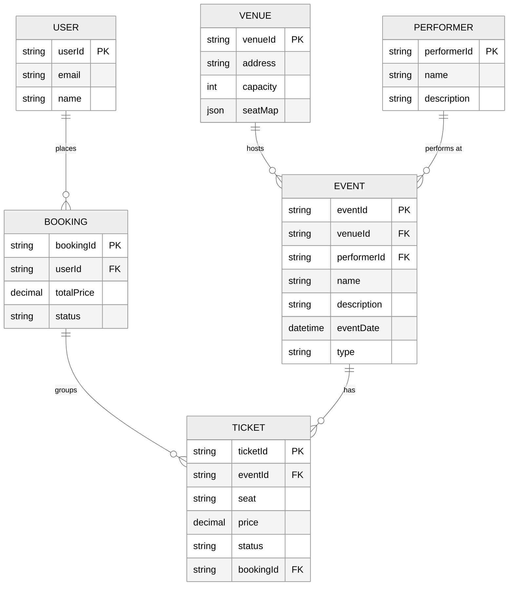

> 💡 **Why a separate `Booking` entity?**
> A user often buys **multiple tickets in one purchase** (e.g., 4 seats for the family). All 4 tickets share **one payment, one total price, one purchase timestamp**.
>
> - **If we put payment info on each `Ticket` row:** we'd duplicate `paymentId`, `totalPrice`, `purchaseStatus` across 4 rows. On refund or failure we'd have to update all 4 atomically and risk them drifting out of sync.
> - **With a separate `Booking` row:** the `Booking` models the *order* (1 row per purchase) and `Ticket` rows model the *seats* (N rows). The booking holds payment status and total; each ticket just points to its `bookingId`.
>
> Result:
> - 1 booking → many tickets (clean 1-to-many).
> - "Show me my orders" = `SELECT * FROM bookings WHERE userId = ?` (trivial).
> - Refund/cancel = update **one** booking row, not N tickets.
> - No duplicated payment data, no drift.

### 2.3 API / System Interface

#### 1. View an event
Returns event + venue + performer + tickets so the client can render the seat map.
```
GET /events/{eventId}
  -> { event, venue, performer, tickets[] }
```

#### 2. Search events
```
GET /events/search?keyword={kw}&start={startDate}&end={endDate}
                  &location={loc}&type={type}&page={n}&pageSize={s}
  -> Event[]
```

#### 3. Book tickets (v1 — will evolve into reserve + confirm)
```
POST /bookings/{eventId}
{
  "ticketIds": ["..."],
  "paymentDetails": { ... }
}
  -> { bookingId }
```

> Start simple. Tell the interviewer: *"This will evolve as we deal with contention."*

---

## 3. High-Level Design

We satisfy the functional requirements one at a time, layering components onto the diagram as we go.

---

### 3.1 Users can view events

When a user navigates to `/event/{eventId}` they should see event details + seat map + performer + venue info.

#### Components introduced
- **Client** — web/mobile.
- **API Gateway** — auth, rate limiting, routing.
- **Event Service** — handles event read APIs.
- **Events DB (PostgreSQL)** — stores `events`, `venues`, `performers`, `tickets`.

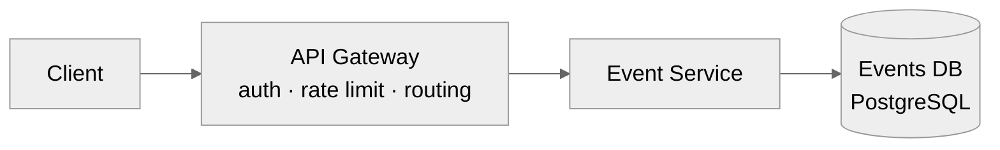

#### Flow
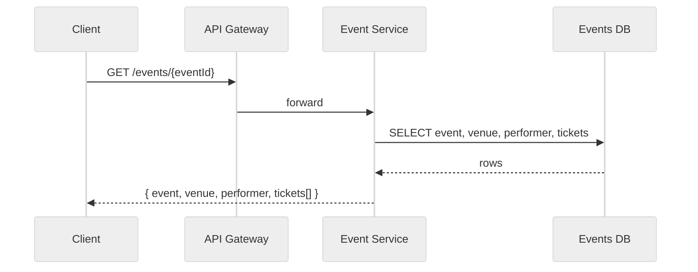

---

### 3.2 Users can search for events

Add a **Search Service** that accepts query params and filters the events table.

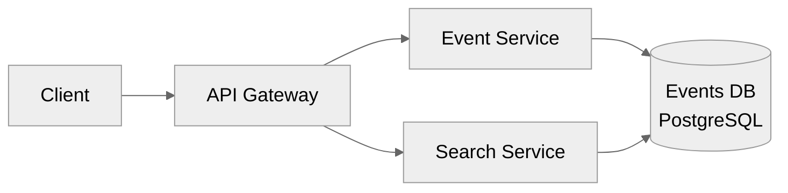

#### Flow
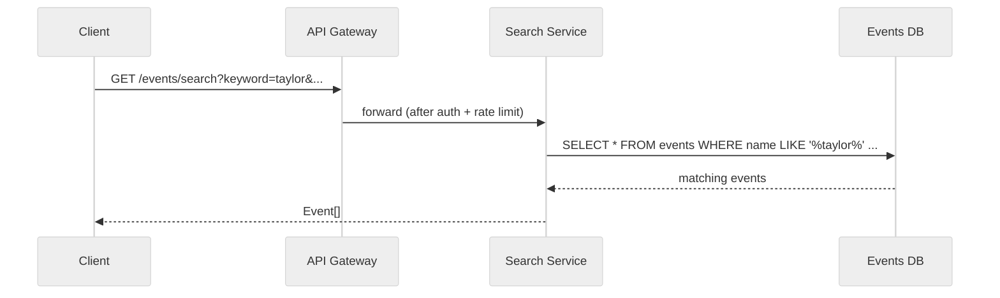

> ⚠️ `LIKE '%keyword%'` is a **full table scan** — slow as the catalog grows. Acknowledged here, fixed in [DD4](#dd4-low-latency-search).

---

### 3.3 Users can book tickets

Add **Booking Service**, **Tickets** & **Bookings** tables, and **Stripe** as the external payment processor.

> 🔁 **Pattern: Dealing with Contention** — two users trying to buy the same seat is the classic contention scenario. We need ACID transactions and a row-level lock or OCC.

#### DB choice
**PostgreSQL** — ACID, row-level locks (or OCC) prevent double-booking. Bookings/tickets/events are tightly coupled, so a **shared DB across services** is fine here ("DB-per-service" is a guideline, not dogma).

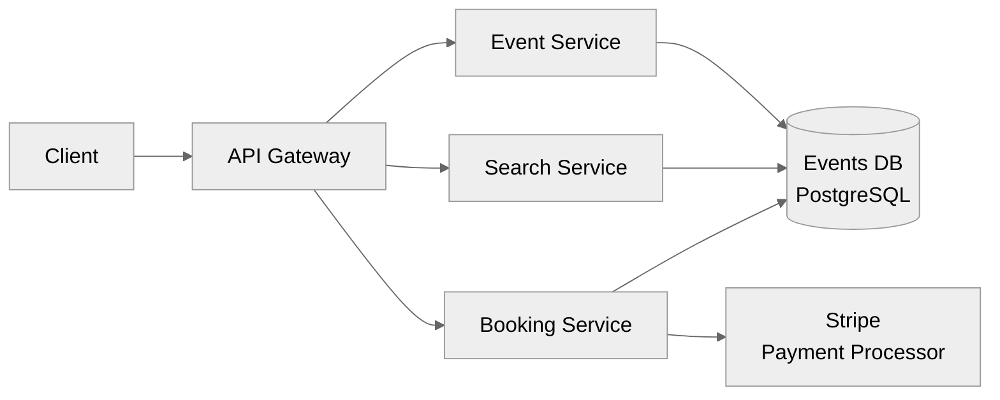

#### Naive booking flow (v1)
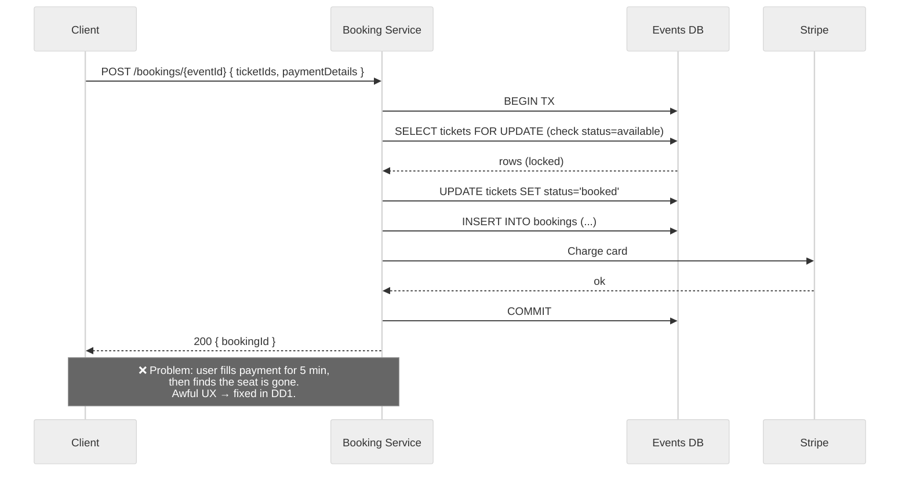

---

## 4. Deep Dives

We now address the non-functional requirements one at a time.

---

### DD1: Improve the booking experience by reserving tickets

**Problem:** Users shouldn't fill out 5 minutes of payment info just to lose the seat at the end. We need to **lock the seat for the user during checkout** (~10 minutes), auto-release on abandonment, mark `sold` on payment.

#### Options considered

| Option | Verdict |
|---|---|
| ❌ **Bad** — Long-running DB row lock | Holds DB connections, unbounded blocking, breaks on crashes. |
| ✅ **Good** — `status` + `expiresAt` column + cron job to release | Works, but cron lag means seats stay locked for minutes after expiry. |
| ✅✅ **Great** — Implicit status: `status + expiresAt` computed at read time (no cron) | No cron needed; reads treat expired locks as available. |
| ✅✅✅ **Great (chosen)** — **Distributed lock in Redis with TTL** | Atomic, fast, auto-expiring, decoupled from DB. |

#### Why a Redis distributed lock (in plain English)

> **The core problem:** When a user clicks a seat, we need to "hold" it for them for ~10 minutes while they enter payment, *without* changing the seat to `sold` in the DB (because they haven't paid yet). And if they walk away, the seat must come back automatically. The naive approaches all have issues:

| Naive approach | Why it's bad |
|---|---|
| Lock the DB row for 10 min | Holds an open DB transaction for 10 minutes. DB connections are precious — you'd run out. If the app crashes mid-checkout, the lock can leak. |
| Add a `reserved_until` column + cron job | Works, but cron runs every X seconds — so a seat can stay locked minutes after the timer expires. Also one more moving part to monitor. |
| App-level lock in Booking Service memory | Doesn't work — we have **multiple Booking Service instances** behind a load balancer. They don't share memory. |

> **What we actually need:**
> 1. A **shared, central place** all Booking Service instances can check ("is this seat held?").
> 2. **Atomic** — two requests racing for the same seat must have exactly one winner.
> 3. **Auto-expires** — if the user abandons checkout, the lock vanishes on its own (no cron, no cleanup job).
> 4. **Fast** — sub-millisecond, because users will hit "select seat" thousands of times per second on a hot drop.

Redis ticks every box:
- It's a separate, shared service all booking pods talk to → **central**.
- The `SET key value NX EX ttl` command is **atomic** and only succeeds if the key doesn't exist → exactly one winner.
- The `EX 600` argument tells Redis to delete the key after 600 seconds → **auto-cleanup, no cron**.
- In-memory → **microseconds per op**.

#### The Redis command, explained

```
SET lock:ticket:T123  user:U7  NX  EX 600
    └─────┬─────┘     └──┬───┘  │   └──┬─┘
          key            value  │      │
                                │      └─ expire after 600s (10 min TTL)
                                └─────── only set if key does NOT exist
```

- **First user wins:** `SET` succeeds, returns OK.
- **Second user (racing for same seat):** `SET` fails because key exists → service responds "seat unavailable, pick another."
- **Value = userId:** so when we later release the lock we can verify *we* own it (don't accidentally release someone else's lock).

#### Architecture


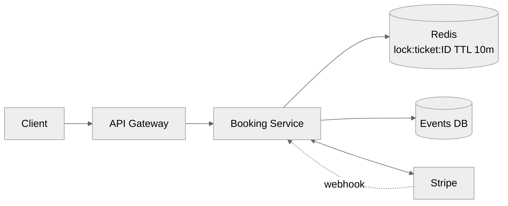

#### Flow

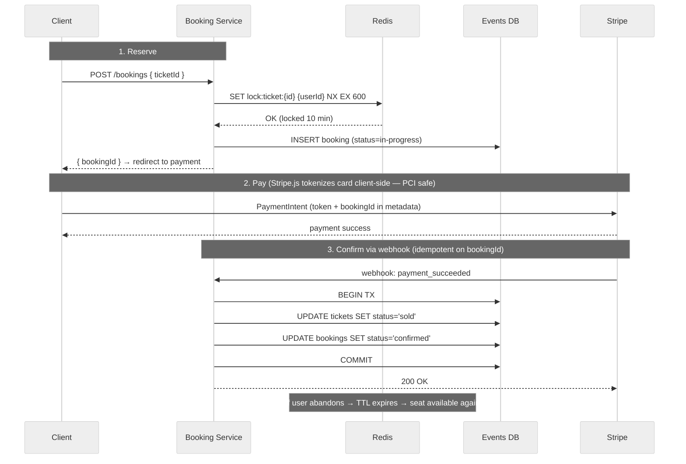

#### Walking through the flow in plain English

1. **User clicks seat A-12** in the seat map → browser sends `POST /bookings { ticketId: "T123" }`.
2. **Booking Service tries to grab the lock** in Redis: `SET lock:ticket:T123 user:U7 NX EX 600`.
   - ✅ If it succeeds → this user "owns" the seat for 10 minutes.
   - ❌ If it fails → another user already grabbed it; we return "seat unavailable" and the client picks another.
3. **Booking Service writes a `Booking` row** with status `in-progress` (so we have a record of the in-flight order) and returns `bookingId` to the client.
4. **Client navigates to the payment page**, sees a 10-minute countdown timer (the same TTL as the Redis lock).
5. **User enters card details** → `Stripe.js` tokenizes the card *in the browser* (PCI compliance — our server never sees the raw PAN). Token + `bookingId` are sent to Stripe via a `PaymentIntent`.
6. **Stripe processes the charge** and calls our **webhook** with `payment_succeeded`.
7. **Webhook handler runs a DB transaction:**
   - `UPDATE tickets SET status='sold' WHERE id='T123'`
   - `UPDATE bookings SET status='confirmed' WHERE id=B-...`
   - Now the source of truth (Postgres) reflects the sale. The Redis lock is no longer needed (it'll just expire harmlessly).
8. **What if the user abandons** (closes the tab at step 5)? Nothing happens immediately — but after 10 minutes the Redis key auto-expires. Now the seat appears available again to anyone who tries (`SET ... NX` succeeds for the next person).

> 🔑 **The big insight:** Redis holds *temporary, in-flight intent*. Postgres holds *permanent, confirmed truth*. The lock is the bridge — it gives the user breathing room to pay without committing the sale prematurely, and it cleans itself up if they ghost.

#### Transaction handling — what does `BEGIN TX … COMMIT` mean here?

The `BEGIN TX … COMMIT` block in step 7 is a **local Postgres ACID transaction** inside the Booking Service. It guarantees that the two updates either **both succeed or both fail**:

```sql
BEGIN;
  UPDATE tickets  SET status = 'sold'      WHERE id = 'T123';
  UPDATE bookings SET status = 'confirmed' WHERE id = 'B-456';
COMMIT;
```

If the service crashes between the two updates, Postgres rolls back automatically — we never end up with a confirmed booking pointing at an unsold ticket (or vice versa). This is just classical single-DB ACID; nothing distributed yet.

##### But wait — we have multiple microservices. Don't we need a *distributed* transaction?

You'd think so, but **no**. Here's the trick:

| Step | Where it happens | Storage | Atomicity needed? |
|---|---|---|---|
| Reserve seat | Booking Service → Redis | Redis | Atomic via `SET NX` |
| Create in-progress booking | Booking Service → Postgres | Postgres | Single-row insert (atomic by default) |
| Charge card | Stripe (external) | Stripe's DB | Stripe handles it |
| Mark ticket sold + booking confirmed | Booking Service → Postgres | Postgres | Local TX (the `BEGIN…COMMIT`) |

> Crucially, the Tickets, Bookings, and Events tables all live in **the same Postgres database** (we chose a shared DB earlier). So step 7 — the part that *must* be atomic — is just a **local single-DB transaction**. No 2PC, no saga, no distributed coordination needed for that step.

##### What about the work that spans Redis + Postgres + Stripe?

That's a **multi-step business workflow**, not a transaction. We make it safe with three patterns:

1. **Status as a state machine.** A booking moves through `in-progress → confirmed` (or `expired`/`cancelled`). At any point we can look at the booking row and know exactly what stage it's in. If we crash, we can resume.
2. **Idempotency on every external boundary.**
   - Stripe webhook handler keys on `bookingId`. If Stripe retries the webhook (which it will, on any 5xx), we check `bookings.status` first — if it's already `confirmed`, we just return 200 and skip the update. Same event processed 5 times → same final state.
   - Stripe's own `PaymentIntent` is idempotent (uses an idempotency key) — calling it twice with the same key won't double-charge.
3. **Compensating actions instead of rollback.** If something fails *after* the lock is held but *before* payment, we don't need to "undo" anything — the Redis TTL releases the seat automatically. If a payment succeeds but our DB write fails, the webhook is retried until it lands (idempotent), so we eventually converge.

##### Why not 2PC (two-phase commit) across services?

- **Stripe doesn't support it** — you can't ask an external SaaS to participate in your XA transaction.
- **Locks held during 2PC kill throughput** — exactly what we're trying to avoid in a high-contention system.
- **Operational nightmare** — coordinator failures leave participants stuck.
- We don't need it: the only multi-row write that *must* be atomic happens inside one Postgres DB → one local TX is enough.

##### What if we later split Bookings DB and Tickets DB?

Then we'd have a real distributed-transaction problem and would use the **Saga pattern**:

```
reserveTicket → createBooking → chargeCard → markSold → confirmBooking
       ↓ (on failure of any step, run compensations in reverse)
   releaseTicket   deleteBooking   refund   markAvailable   cancelBooking
```

Each step is local + idempotent; failures trigger compensating transactions. This is the standard answer when an interviewer pushes "what if these were separate services with separate DBs?" — but for this design we deliberately kept them in one DB to *avoid* that complexity.

> 💡 **Interview soundbite:** "I'm putting Bookings and Tickets in the same Postgres so the critical state change is one local ACID transaction. The rest of the flow (Redis lock, Stripe call, webhook) is a workflow held together by idempotency and a status state-machine, not a distributed transaction. If we ever split the DBs, we'd switch to a saga."

#### Key points
- **PCI compliance:** `Stripe.js` tokenizes the card in the browser; our server **never** sees the raw card number.
- **Idempotency:** webhook handler keys on `bookingId` and checks current status before mutating — Stripe retries are safe.
- **What if Redis dies?** Bring up a new instance; for ~10 min, multiple users could both reach payment for the same ticket. The DB transaction is still the source of truth — only one will succeed; the loser gets an error. Trade-off worth discussing (Redlock / Redis Sentinel improve this).

---

### DD2: Scaling the View API to millions of concurrent users

**Problem:** When tickets drop, millions hammer the same event page. Combine **horizontal scaling + load balancing + aggressive caching**.

> 🔁 **Pattern: Scaling Reads.**

#### Options considered

| Option | Verdict |
|---|---|
| ❌ Vertical scale only | Single point of failure, hits a ceiling fast. |
| ✅ Horizontal scale Event Service + LB | Necessary baseline. |
| ✅ Add Postgres **read replicas** | Offloads reads from the primary. |
| ✅✅ Add **Redis cache** for event payload | Cuts DB hits to near-zero on hot events. |
| ✅✅✅ **Great (chosen)** — Caching + Load Balancing + Horizontal Scaling + **CDN** for static event content | Edge cache near users; absorbs the spike. |

#### Architecture

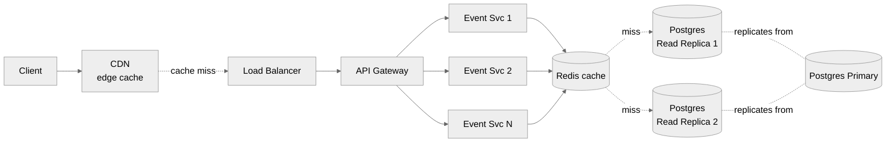

#### Notes
- **Static event content** (name, description, performer bio, venue layout, seat-map image) → CDN with long TTL.
- **Event payload** in Redis with shorter TTL (e.g., 30–60 s); invalidate on writes.
- **Don't cache seat status** in the same blob — it changes constantly. Fetch separately or stream updates ([DD3](#dd3-good-ux-during-high-demand-events)).
- **Event Service is stateless** → auto-scale on RPS / CPU.
- **Connection pooling** to Postgres via PgBouncer.

---

### DD3: Good UX during high-demand events

**Problem:** With popular events, the seat map goes stale in seconds. Users keep clicking sold seats and getting errors.

#### Options considered

| Option | Verdict |
|---|---|
| ❌ Polling every few seconds | Wasteful and still stale. |
| ✅ **SSE (Server-Sent Events)** for real-time seat updates | Good — server pushes diffs to subscribed clients. |
| ✅✅ **Great (chosen for hot events)** — **Virtual Waiting Queue** | Gate access entirely; admit users in waves. |

> 🔁 **Pattern: Real-Time Updates** (SSE / WebSocket / long polling).

#### Good — SSE for live seat updates

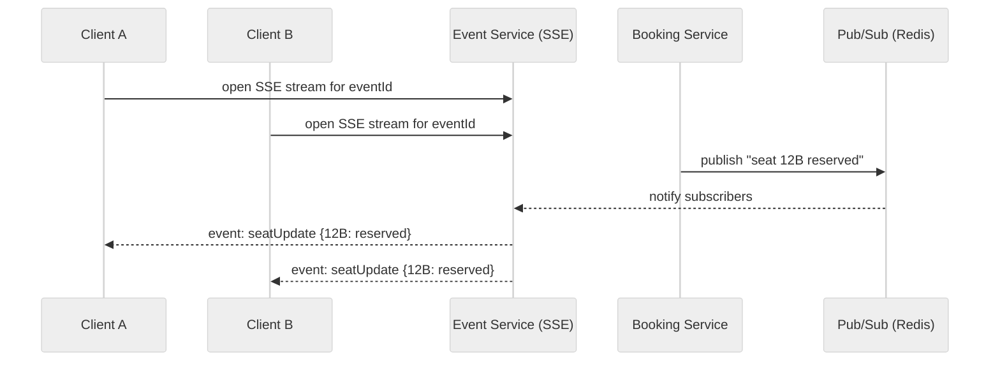

#### Great — Virtual Waiting Queue (for extremely popular events)

For *Taylor Swift on-sale* (10M users, 60K seats) even SSE is overkill. Admit users in waves.

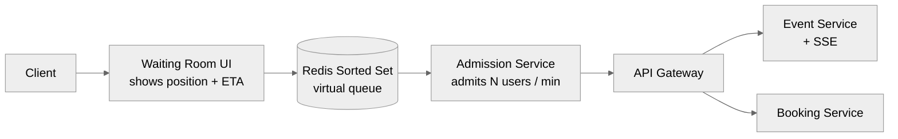

**Flow:**
1. User opens hot event → placed in **virtual queue** (Redis sorted set).
2. UI shows position + estimated wait.
3. **Admission Service** admits N users per minute (matched to booking-service capacity).
4. Admitted users get a short-lived token → can hit the live seat map (SSE) and reserve.
5. Everyone else just waits — they can't even hit the seat-map endpoint.

> 💡 Sometimes the best engineering answer is a **product** answer. Senior/Staff candidates think outside presumed constraints.

---

### DD4: Low-latency search

**Problem:** `SELECT ... WHERE name LIKE '%taylor%'` = full table scan. Won't meet 500 ms p99.

#### Options considered

| Option | Verdict |
|---|---|
| ✅ **Good** — Indexes + SQL query optimization | Works for prefix/equality, not arbitrary substring. |
| ✅✅ **Great** — Postgres **full-text index** (`tsvector` + GIN) | Fine at moderate scale, no extra infra. |
| ✅✅✅ **Great (chosen at scale)** — **Elasticsearch** | Inverted index, fuzzy/typo tolerance, relevance ranking, geo & aggregations. |

#### Chosen design — Elasticsearch fed by CDC

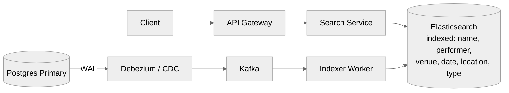

**Notes:**
- Denormalized `Event` document in ES.
- Sync via **CDC** (Debezium → Kafka → Indexer) — eventually consistent within seconds.
- Enable **node query cache** in ES.
- Shard ES by `event_date` (or event id with date routing).
- Search Service falls back to Postgres only on ES outage.

---

### DD5: Caching frequently repeated search queries

**Problem:** A few queries dominate (e.g., "Taylor Swift", "Lakers"). Hitting ES for every one wastes resources.

#### Options considered

| Option | Verdict |
|---|---|
| ✅ **Good** — Redis/Memcached in front of Search Service, key = normalized query | Solid L2 cache. |
| ✅✅ **Great (chosen)** — **Edge caching at CDN** + Redis as L2 | Best latency, absorbs hot queries before they reach the service. |

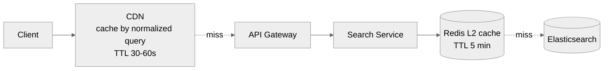

**Strategy:**
1. **Normalize** query (lowercase, sort params, strip whitespace) → cache key.
2. CDN caches GET responses for popular queries (30–60 s TTL).
3. Redis caches at the service tier for medium-popularity queries (a few minutes).
4. Short TTLs make invalidation simple — search results don't need to be perfectly fresh.
5. Optional **write-through invalidation** for queries that map to a single hot event when its data changes.

---

## 5. Final Architecture

Pulling everything together:

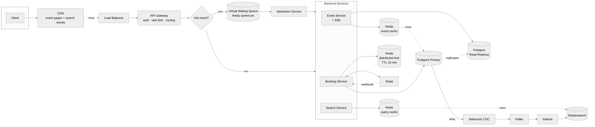

### Summary of choices

| Concern | Choice | Why |
|---|---|---|
| Transactional store | **PostgreSQL** | ACID, row locks, relational data. |
| Distributed lock | **Redis** w/ TTL | Atomic, fast, auto-expiring. |
| Search | **Elasticsearch** via **CDC (Debezium → Kafka)** | Sub-500ms full-text, fuzzy match. |
| Hot read scale | **CDN + Redis + Read Replicas** | Multi-tier cache absorbs spikes. |
| Real-time seat map | **SSE** | Push-only, simple, scales well. |
| Extreme spikes | **Virtual Waiting Queue** | Smooth load; deterministic UX. |
| Payments | **Stripe** + tokenization + idempotent webhooks | PCI compliance + safe retries. |
| Edge | **API Gateway** | Auth, rate limiting, routing. |

---

## 6. What Is Expected at Each Level

### Mid-level (E4)
- ~80% breadth, 20% depth.
- Clear API + data model.
- Functional HLD for view + book.
- Solves "no double booking" with at least the **status + expiry + cron** approach.

### Senior (E5)
- ~60% breadth, 40% depth.
- Speed through HLD; spend time on:
  - Search optimization (Elasticsearch).
  - Distributed lock for reservations.
  - Scaling: sharding, replication, caching, popular-event handling.
- Articulate trade-offs (Redlock vs Sentinel, shared DB vs per-service, SSE vs polling).

### Staff+ (E6+)
- ~40% breadth, 60% depth.
- Proactively drives 2–3 deep dives end-to-end (virtual waiting room, CDC pipeline, Redlock, idempotent webhooks, geo-sharded ES).
- Brings real-world judgment — picks tech they've actually used and explains *why*.
- Leaves the interviewer with a new perspective.

---

## Appendix — Patterns Touched

| Pattern | Used For |
|---|---|
| **Dealing with Contention** | Distributed locks, OCC, ACID transactions. |
| **Scaling Reads** | Caching, read replicas, CDN, horizontal scaling. |
| **Real-Time Updates** | SSE for live seat-map updates. |
| **Search Indexing** | Elasticsearch, full-text indexes, CDC pipeline. |
| **Idempotency** | Webhook handling keyed on `bookingId`. |
| **PCI Compliance** | Stripe.js tokenization — server never sees raw cards. |
| **Throttling / Admission Control** | Virtual waiting room for hot events. |
