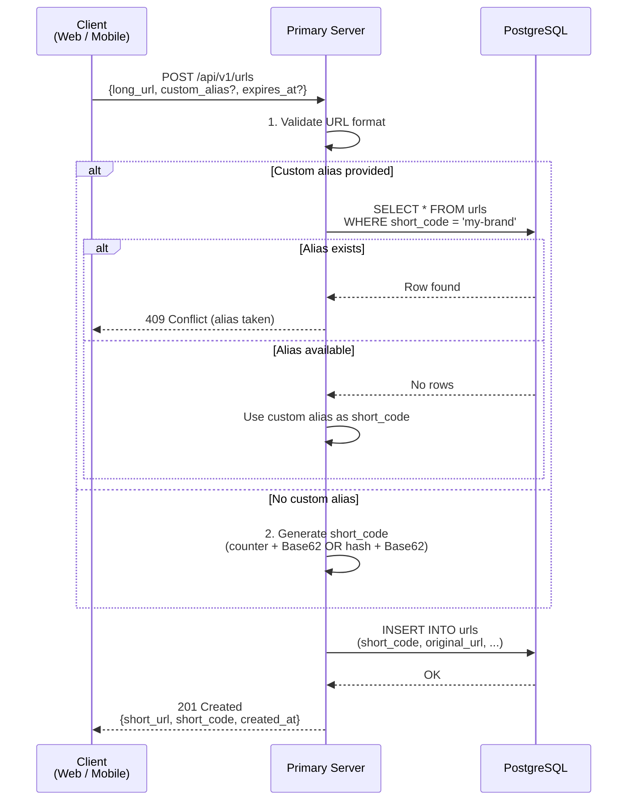
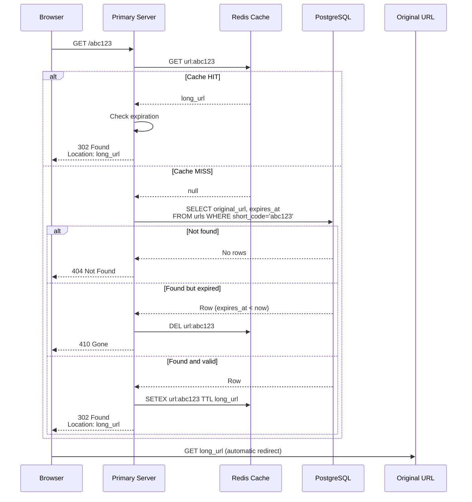
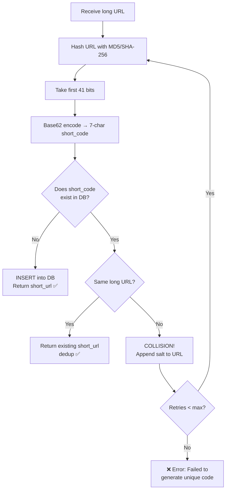
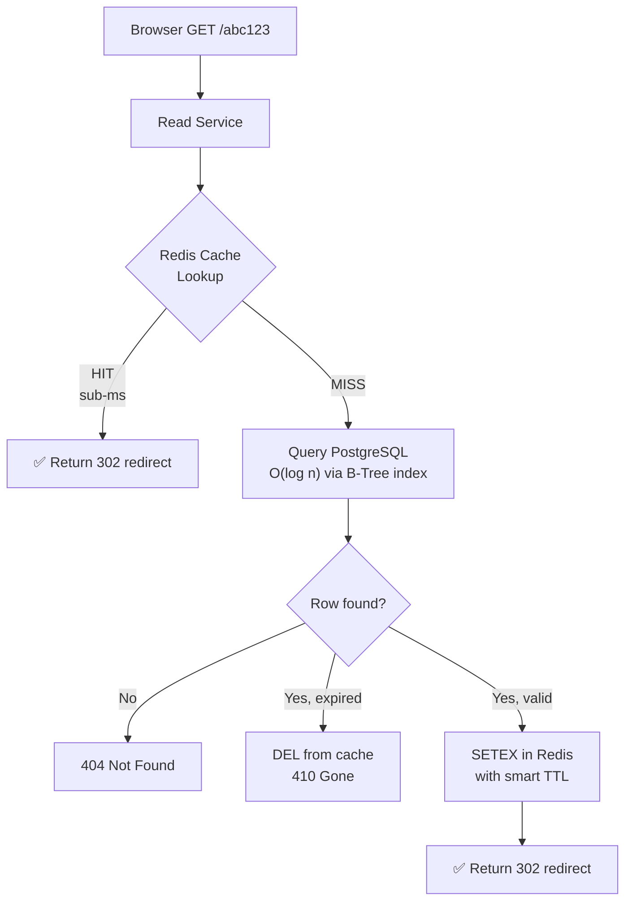
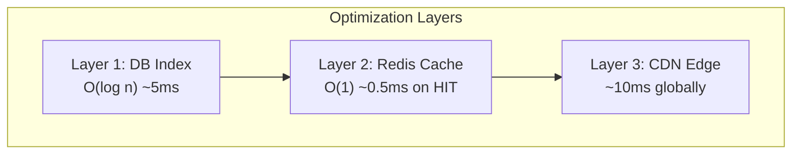
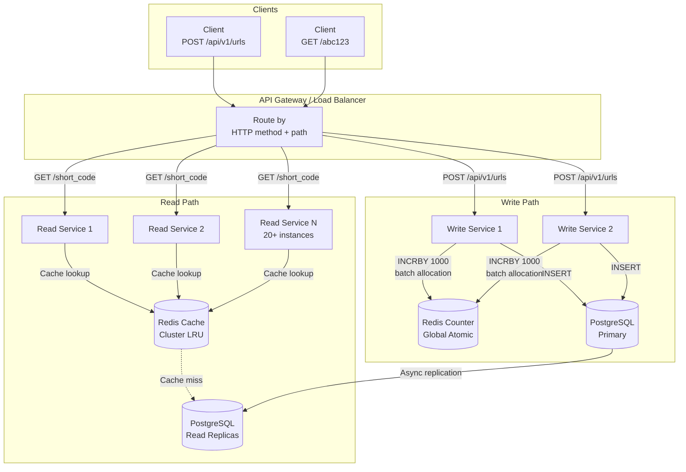
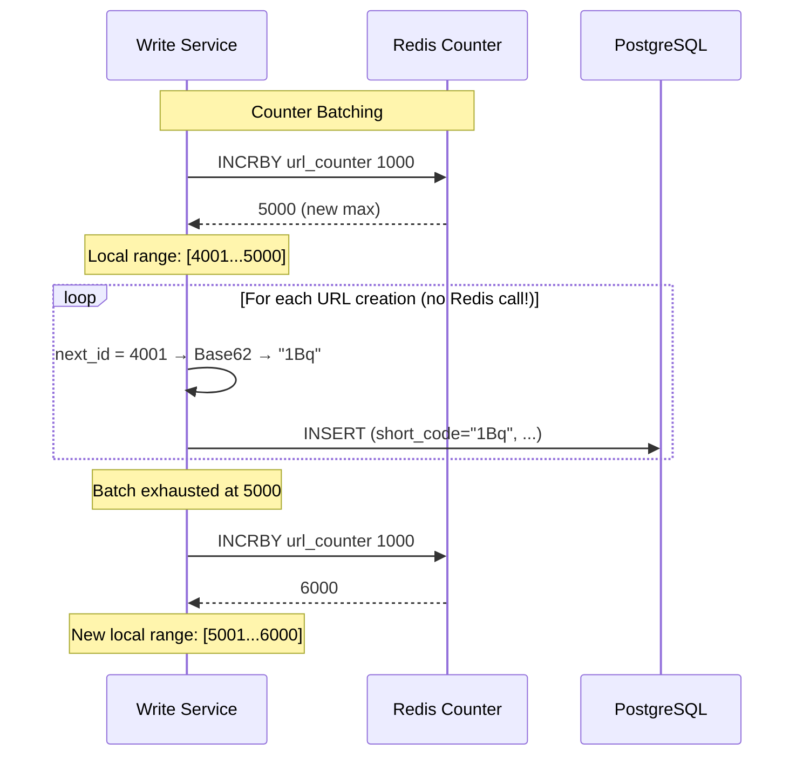
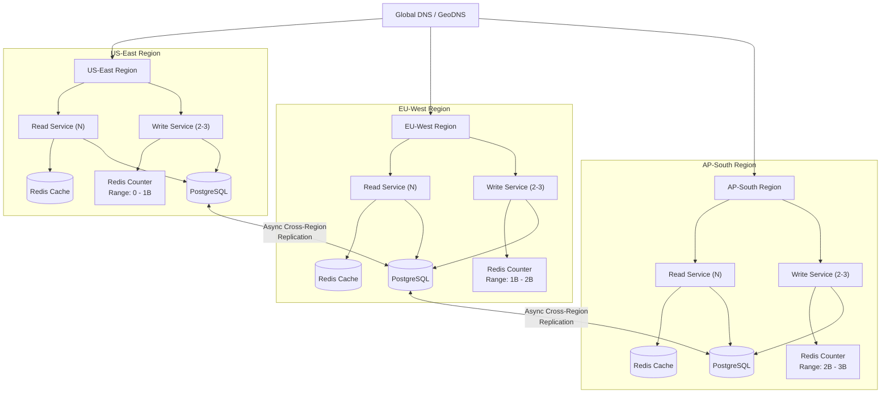

# System Design: URL Shortener (Bit.ly)

> **Difficulty**: Easy–Medium | **Pattern**: Scaling Reads | **Asked at**: Amazon, PayPal, Microsoft, Google, OpenAI, Uber, Meta, and more

---

## Table of Contents

1. [Interview Delivery Framework](#interview-delivery-framework)
2. [Problem Statement](#problem-statement)
3. [Functional Requirements](#functional-requirements)
4. [Non-Functional Requirements](#non-functional-requirements)
5. [Back-of-the-Envelope Estimation](#back-of-the-envelope-estimation)
6. [Core Entities & Data Model](#core-entities--data-model)
7. [API Design](#api-design)
8. [High-Level Design](#high-level-design)
9. [Deep Dive 1: Short Code Generation Strategies](#deep-dive-1-short-code-generation-strategies)
10. [Deep Dive 2: Making Redirects Fast](#deep-dive-2-making-redirects-fast)
11. [Deep Dive 3: Scaling to 1B URLs and 100M DAU](#deep-dive-3-scaling-to-1b-urls-and-100m-dau)
12. [Redirect Flow & HTTP Status Codes](#redirect-flow--http-status-codes)
13. [URL Expiry & Cleanup](#url-expiry--cleanup)
14. [Security Considerations](#security-considerations)
15. [Multi-Region Deployment](#multi-region-deployment)
16. [Monitoring & Observability](#monitoring--observability)
17. [Final Architecture](#final-architecture)
18. [What is Expected at Each Level](#what-is-expected-at-each-level)
19. [Common Interview Questions](#common-interview-questions)

---

## Interview Delivery Framework

Hello Interview recommends a structured 4-phase approach to deliver system design answers. Here's how it maps to this problem:

```
┌─────────────────────────────────────────────────────────────────────────┐
│                    INTERVIEW TIMELINE (~45 minutes)                     │
├───────────────┬───────────────┬────────────────┬───────────────────────┤
│  Phase 1      │  Phase 2      │  Phase 3       │  Phase 4              │
│  REQUIREMENTS │  THE SET UP   │  HIGH-LEVEL    │  DEEP DIVES           │
│  (5 min)      │  (5 min)      │  DESIGN        │  (10 min)             │
│               │               │  (10-15 min)   │                       │
├───────────────┼───────────────┼────────────────┼───────────────────────┤
│ • Functional  │ • Core        │ • URL creation │ • How to ensure       │
│   requirements│   entities    │   flow         │   uniqueness?         │
│ • Non-func    │ • API design  │ • URL redirect │ • How to make         │
│   requirements│   (REST)      │   flow         │   redirects fast?     │
│ • Clarify     │ • Data model  │ • Component    │ • How to scale to     │
│   scope       │   sketch      │   diagram      │   1B URLs + 100M DAU? │
└───────────────┴───────────────┴────────────────┴───────────────────────┘
```

### How to Use This Framework

**Phase 1 — Requirements (5 min):** Start by listing functional and non-functional requirements on the whiteboard. Tell the interviewer what's in scope and what's below the line. This shows you can prioritize and prevent scope creep.

**Phase 2 — The Set Up (5 min):** Define core entities (Original URL, Short URL, User), then write out the REST API endpoints. This creates a contract between client and server. Don't go deep into the data model yet — just a simple list.

**Phase 3 — High-Level Design (10–15 min):** Walk through each functional requirement one-by-one. Draw a basic system diagram (Client → Server → Database). Abstract away complex details ("some magic function generates the short code") — you'll fill them in during deep dives.

**Phase 4 — Deep Dives (10 min):** This is where you shine. Go back to your non-functional requirements and pick the most interesting/challenging ones. For URL shortener, the three big deep dives are: (1) ensuring uniqueness, (2) fast redirects, and (3) scaling.

> **Pro Tip**: Tell the interviewer your plan upfront: *"I'll start with requirements, then entities and API, then a simple high-level design, and then dive deep into the interesting problems."* This shows structure and lets them guide you.

---

## Problem Statement

Design a URL shortening service like **Bit.ly** that converts long URLs into shorter, manageable links. When a user clicks the short link, they are redirected to the original long URL.

**Why is this asked so often?** It touches on hashing, database design, caching, scaling reads vs writes, HTTP semantics, and distributed systems — all in a relatively contained problem.

### What is Bit.ly?

[Bit.ly](https://bitly.com/) is a URL shortening service that:
- Converts long URLs into shorter, manageable links (e.g., `https://example.com/very/long/path` → `https://bit.ly/3xK9f2`)
- Provides analytics for shortened URLs (click counts, geographic data, referrers)
- Supports custom branded short domains
- Processes **billions of clicks per month** across millions of active links

Designing a URL shortener is one of the most common **beginner-to-intermediate** system design interview questions. Despite its apparent simplicity, it covers a surprising depth of topics.

---

## Functional Requirements

### Core (In Scope)

| # | Requirement |
|---|-------------|
| FR-1 | Users submit a long URL and receive a shortened URL |
| FR-2 | Users access the original URL by visiting the shortened URL (redirect) |
| FR-3 | *(Optional)* Users can specify a **custom alias** (e.g., `short.ly/my-brand`) |
| FR-4 | *(Optional)* Users can specify an **expiration date** for the shortened URL |

### Below the Line (Out of Scope)

- User authentication and account management
- Analytics on link clicks (click counts, geographic data, referrers)
- Rate limiting per user (though we'll briefly discuss it in security)
- Link editing / updating after creation

> **Tip**: In the interview, explicitly call out what's in and out of scope. It shows you can prioritize.

### How to Present This on the Whiteboard

```
┌─────────────────────────────────────────────────┐
│          FUNCTIONAL REQUIREMENTS                 │
│                                                  │
│  ✅ IN SCOPE:                                    │
│  1. Shorten URL (long → short)                   │
│     - optional custom alias                      │
│     - optional expiration time                   │
│  2. Redirect (short → long)                      │
│                                                  │
│  ❌ OUT OF SCOPE:                                │
│  • User auth / accounts                          │
│  • Click analytics                               │
│  • Spam detection                                │
├─────────────────────────────────────────────────┤
│          NON-FUNCTIONAL REQUIREMENTS             │
│                                                  │
│  • Unique short codes                            │
│  • Low latency redirects (< 100ms)               │
│  • 99.99% availability (avail >> consistency)    │
│  • Scale: 1B URLs, 100M DAU                      │
└─────────────────────────────────────────────────┘
```

Draw this box on your whiteboard first. It anchors the entire conversation and you'll refer back to it during deep dives.

---

## Non-Functional Requirements

| # | Requirement | Target |
|---|-------------|--------|
| NFR-1 | **Uniqueness**: Each short code maps to exactly one long URL | 0 collisions |
| NFR-2 | **Low latency**: Redirection should be fast | < 100ms p99 |
| NFR-3 | **High availability**: System must be reliable | 99.99% uptime |
| NFR-4 | **Scalability** | 1B stored URLs, 100M DAU |
| NFR-5 | **Availability > Consistency** | Eventual consistency is acceptable |

### Key Insight: Read-Heavy System

The read-to-write ratio is extremely skewed:

```
Reads (redirects)  : Writes (URL creation)  ≈  1000 : 1
```

This asymmetry drives every major design decision — caching, database choice, service separation, and architecture.

**Why does this matter?** When your interviewer gives you "100M DAU", immediately compute the read/write ratio. For URL shortener:
- Almost all DAU interactions are **clicks** (reads) not **creations** (writes)
- This means: cache aggressively, optimize the read path, tolerate eventual consistency
- Your architecture should have **many more read servers** than write servers
- This is the single most important insight to communicate early in the interview

---

## Back-of-the-Envelope Estimation

These calculations help you reason about hardware, storage, and bandwidth during the interview.

### Traffic Estimates

| Metric | Calculation | Result |
|--------|-------------|--------|
| DAU | Given | 100M |
| URL creations/day | ~1 per 1000 DAU (write-light) | ~100K/day |
| Writes/second | 100K / 86400 | **~1.2 writes/sec** |
| Redirects/day | 100M DAU × ~10 clicks/day | ~1B/day |
| Reads/second | 1B / 86400 | **~12K reads/sec** |
| Peak reads/sec | ~3× average | **~36K reads/sec** |

### Storage Estimates

| Field | Size |
|-------|------|
| Short code | ~8 bytes |
| Long URL | ~100 bytes |
| Creation timestamp | ~8 bytes |
| Expiration date | ~8 bytes |
| Custom alias | ~100 bytes |
| User ID / metadata | ~80 bytes |
| **Total per row** | **~300–500 bytes** |

| Metric | Calculation | Result |
|--------|-------------|--------|
| 1B URLs | 500 bytes × 1B | **~500 GB** |
| 5 years growth | 100K/day × 365 × 5 | ~182M new URLs |

> **500 GB fits comfortably on a single modern SSD.** Sharding is not immediately necessary but may be needed for availability.

### Bandwidth Estimates

| Direction | Calculation | Result |
|-----------|-------------|--------|
| Incoming (writes) | 1.2 req/sec × 500 bytes | ~600 bytes/sec (negligible) |
| Outgoing (reads) | 12K req/sec × 500 bytes | ~6 MB/sec |

### Cache Memory Estimate

If we cache the top 20% of URLs (hot URLs follow a Pareto distribution):

```
20% of 1B URLs = 200M entries
200M × 500 bytes ≈ 100 GB of cache
```

This is achievable with a Redis cluster or a few high-memory nodes.

---

## Core Entities & Data Model

### Entities

```
┌─────────────┐     ┌──────────────┐     ┌──────────┐
│ Original URL │────▶│  Short URL   │◀────│   User   │
└─────────────┘     └──────────────┘     └──────────┘
```

### Database Schema

```sql
CREATE TABLE urls (
    short_code    VARCHAR(10)  PRIMARY KEY,
    original_url  TEXT         NOT NULL,
    custom_alias  VARCHAR(50)  UNIQUE,
    created_at    TIMESTAMP    NOT NULL DEFAULT NOW(),
    expires_at    TIMESTAMP    NULL,
    -- FK to users(user_id); NULL = anonymous link
    created_by    UUID         NULL REFERENCES users(user_id),

    CONSTRAINT unique_short_code UNIQUE (short_code)
);

-- Index for reverse lookup (optional, if dedup is needed)
CREATE INDEX idx_original_url ON urls(original_url);

-- Index for expiration cleanup
CREATE INDEX idx_expires_at ON urls(expires_at) WHERE expires_at IS NOT NULL;

-- Index for "show me my URLs"
CREATE INDEX idx_urls_user ON urls(created_by) WHERE created_by IS NOT NULL;
```

> **Where does `created_by` (UUID) come from?**
> It's a foreign key to the `users` table. The UUID is generated **once at signup** (e.g. Postgres `gen_random_uuid()` or Java `UUID.randomUUID()`), stored in `users(user_id)`, and embedded in the JWT issued at login. The API Gateway extracts it from the JWT on each authenticated request and the Write Service writes it into `urls.created_by`. For **anonymous shortening** (no login required), this column is left `NULL`.
>
> ```sql
> CREATE EXTENSION IF NOT EXISTS "pgcrypto";
>
> CREATE TABLE users (
>     user_id       UUID         PRIMARY KEY DEFAULT gen_random_uuid(),
>     email         VARCHAR(255) UNIQUE NOT NULL,
>     password_hash VARCHAR(72)  NOT NULL,   -- bcrypt
>     plan          VARCHAR(16)  DEFAULT 'free',
>     created_at    TIMESTAMPTZ  DEFAULT NOW()
> );
> ```

### Why These Indexes?

| Index | Purpose |
|-------|---------|
| Primary key on `short_code` | O(log n) lookup for redirects — the hot path |
| Index on `original_url` | Fast dedup check if same URL was already shortened |
| Partial index on `expires_at` | Efficient cleanup of expired URLs by background job |
| Partial index on `created_by` | Fast `SELECT … WHERE created_by = ?` for "my URLs" page |

---

## API Design

### 1. Shorten a URL

```http
POST /api/v1/urls
Content-Type: application/json

{
    "long_url": "https://www.example.com/some/very/long/url/with/params?x=1&y=2",
    "custom_alias": "my-brand",       // optional
    "expiration_date": "2026-12-31"    // optional, ISO 8601
}
```

**Response (201 Created):**
```json
{
    "short_url": "https://short.ly/abc123",
    "short_code": "abc123",
    "created_at": "2026-03-19T10:30:00Z",
    "expires_at": "2026-12-31T00:00:00Z"
}
```

**Error Responses:**

| Code | Scenario |
|------|----------|
| 400 | Invalid URL format |
| 409 | Custom alias already taken |
| 429 | Rate limit exceeded |

### 2. Redirect to Original URL

```http
GET /{short_code}
```

**Response (302 Found):**
```http
HTTP/1.1 302 Found
Location: https://www.example.com/some/very/long/url/with/params?x=1&y=2
Cache-Control: no-store
```

**Error Responses:**

| Code | Scenario |
|------|----------|
| 404 | Short code not found |
| 410 | URL has expired (Gone) |

### 3. Delete a URL (Optional)

```http
DELETE /api/v1/urls/{short_code}
Authorization: Bearer <token>
```

**Response**: `204 No Content`

---

## High-Level Design

> **Hello Interview approach**: Walk through each functional requirement one-by-one. Start with a simple diagram — Client, Primary Server, Database. Don't optimize yet. Abstract complex parts as "magic functions" — you'll unpack them in deep dives.

### Requirement 1: Users Should Be Able to Submit a Long URL and Receive a Shortened Version

The first thing we need is to figure out how a user's long URL becomes a short URL. Let's outline the core components:

```
┌────────┐      POST /urls      ┌────────────────┐        ┌──────────────┐
│        │─────────────────────▶│                 │       │              │
│ Client │                      │ Primary Server  │──────▶│   Database   │
│ (Web / │◀─────────────────────│                 │       │  (Postgres)  │
│ Mobile)│   { short_url }      │  1. Validate    │       │              │
│        │                      │  2. Gen code    │       │  Urls table: │
└────────┘                      │  3. Store in DB │       │  - short_code│
                                │  4. Return URL  │       │  - long_url  │
                                └────────────────┘       │  - created_at│
                                                          │  - expires_at│
                                                          └──────────────┘
```

**Step-by-step walkthrough of what happens when a user shortens a URL:**

**Step 1: Client sends request**

The user enters a long URL in our web app or calls our API. The client sends a `POST /urls` request to our Primary Server with the long URL, and optionally a custom alias and expiration date.

**Step 2: Server validates the URL**

The Primary Server receives the request and validates the long URL format. We use standard URL validation libraries (like Python's `urllib.parse`, Java's `java.net.URL`, or npm's `is-url`) to ensure:
- The URL has a valid scheme (`http://` or `https://`)
- The domain is resolvable
- The URL is not empty or malformed

If validation fails → return `400 Bad Request`.

**Step 3: Handle custom alias (if provided)**

If the user specified a custom alias (e.g., "my-brand"):
- Query the database: `SELECT * FROM urls WHERE short_code = 'my-brand'`
- If it already exists → return `409 Conflict` ("alias already taken")
- If available → use it as the short code

> **Important**: To prevent custom aliases from colliding with auto-generated codes in the future, consider prefixing generated codes with a character that custom aliases can't use, or store them in separate namespaces.

**Step 4: Generate a short code**

For now, we'll abstract this away as *some magic function* that takes in the long URL and returns a unique short code. We'll dive deep into exactly how this works in [Deep Dive 1](#deep-dive-1-short-code-generation-strategies).

```java
String shortCode = generateShortCode(); // Magic! We'll explain later.
```

**Step 5: Optionally check for deduplication**

Should we check if this exact long URL was already shortened?

Most URL shorteners **allow multiple short codes** for the same long URL because:
- Different users may want separate expiration dates
- Independent analytics tracking per short code  
- Privacy — don't reveal that a URL was already shortened by someone else

However, if storage efficiency is important, you could look up the long URL and return the existing short code. This is a **product decision** worth discussing with your interviewer.

**Step 6: Store in database**

Insert the mapping into our `urls` table:

```sql
INSERT INTO urls (short_code, original_url, created_at, expires_at, created_by)
VALUES ('abc123', 'https://www.example.com/very/long/url', NOW(), '2026-12-31', 'user-uuid');
```

**Step 7: Return the short URL**

Construct the full short URL and return it to the client:

```json
{
    "short_url": "https://short.ly/abc123",
    "short_code": "abc123",
    "created_at": "2026-03-19T10:30:00Z"
}
```

#### Diagram: URL Creation Flow



---

### Requirement 2: Users Should Be Able to Access the Original URL by Using the Shortened URL

Now the short URL is live. When someone clicks `https://short.ly/abc123`, their browser sends a request to our domain (`short.ly`), which we own. Our server handles all requests to that domain.

```
┌────────┐    GET /abc123     ┌────────────────┐               ┌────────────┐
│        │───────────────────▶│                │  Cache MISS   │            │
│Browser │                    │ Primary Server │──────────────▶│  Database  │
│        │◀──302 + Location───│                │◀──────────────│            │
│        │                    │ 1. Look up code│               └────────────┘
└────────┘                    │ 2. Check expiry│  Cache HIT    ┌────────────┐
   │                          │ 3. Redirect    │──────────────▶│Redis Cache │
   │                          └────────────────┘◀──────────────│            │
   │                                                           └────────────┘
   ▼
  Original URL
  (user lands here)
```

**Step-by-step walkthrough of what happens when a user clicks a short URL:**

**Step 1: Browser sends GET request**

User clicks `https://short.ly/abc123`. The browser sends `GET /abc123` to our Primary Server. Note: the user only typed (or clicked) the short URL — the browser does the rest automatically.

**Step 2: Server looks up the short code**

The server extracts `abc123` from the URL path and looks it up. First in cache (Redis), then in the database if cache misses. We'll optimize this in [Deep Dive 2](#deep-dive-2-making-redirects-fast).

```sql
SELECT original_url, expires_at FROM urls WHERE short_code = 'abc123';
```

**Step 3: Check if the URL has expired**

If the row has an `expires_at` field and the current date is past it:
- Return `410 Gone` — tells the client the resource existed but is no longer available
- Optionally clean up the cache entry

**Step 4: Server sends HTTP redirect**

If found and not expired, the server sends an HTTP redirect response:

```http
HTTP/1.1 302 Found
Location: https://www.example.com/very/long/url
```

The browser receives this and **automatically** navigates to the `Location` URL. The user never sees the redirect happen — it's instant and transparent.

**Step 5: If not found**

Return `404 Not Found`.

### Understanding HTTP Redirects: 301 vs 302

This is a critical design decision that interviewers love to probe. Both redirect the browser, but they behave very differently:

```
                     301 Permanent Redirect
┌────────┐  GET /abc  ┌────────┐  302   ┌───────────────┐
│Browser │───────────▶│ Server │───────▶│ Original URL  │
│        │            └────────┘        └───────────────┘
│        │  (Browser caches this!)
│        │  Next time: Browser goes DIRECTLY to original URL
│        │  (Our server is BYPASSED — no control!)
└────────┘

                     302 Found (Temporary)
┌────────┐  GET /abc  ┌────────┐  302   ┌───────────────┐
│Browser │───────────▶│ Server │───────▶│ Original URL  │
│        │            └────────┘        └───────────────┘
│        │  (Browser does NOT cache!)
│        │  Next time: Browser hits our server AGAIN
│        │  (We maintain full control!)
└────────┘
```

**We choose 302** because:
- Allows us to **update or expire** links after creation
- Lets us **track clicks** (each click hits our server)
- Prevents stale cached redirects if we need to change the destination
- Gives us full observability over link usage

> **In the interview**: Mention both options and explain the tradeoff. Saying "we'll prefer 302 so we maintain control over the redirect and can handle expiration" is a strong answer.

### Cleanup Strategy

**We use all three layers together — they each solve a different problem.** No single one is enough on its own.

| # | Mechanism | Where | What it does | Why we need it |
|---|-----------|-------|--------------|----------------|
| 1 | **Real-time check** | App server (on every redirect) | Compare `expires_at` vs `now()`. If expired → return `410 Gone` and `DEL` from Redis | **Correctness.** Guarantees users never get a stale redirect, even if the cache or cron hasn't cleaned up yet |
| 2 | **Redis TTL (`SETEX`)** | Cache layer | Auto-evicts the key from Redis when TTL elapses | **Cache hygiene.** Prevents Redis from serving expired entries and saves memory. Set TTL ≤ URL's remaining lifetime |
| 3 | **Cron / background job** | DB layer | Periodically `DELETE FROM urls WHERE expires_at < now()` in batches | **Storage reclaim.** Redis TTL doesn't touch Postgres. Without this, the DB grows forever with dead rows |

**Why not just one?**

- **Cron only** → DB stays clean, but Redis can still serve an expired URL until its TTL fires, and a user could hit a redirect *between* cron runs. Bad UX.
- **Redis TTL only** → Cache is clean, but Postgres bloats indefinitely. Also doesn't help on a cache miss that hits an expired DB row.
- **Real-time check only** → Correct, but Redis and DB both keep growing with dead data.

**So the rule of thumb:**

> Real-time check = *correctness*. Redis TTL = *cache cleanup*. Cron = *storage cleanup*. Use all three.

#### What the cache entry looks like

We use the simplest possible shape: **a plain string keyed by the short code**.

```
KEY:    url:abc123
VALUE:  "https://www.example.com/some/very/long/path?utm=foo"
TTL:    2592000     # 30 days, in seconds
```

Redis commands:

```bash
# On write (after creating the short URL)
SETEX url:abc123 2592000 "https://www.example.com/some/very/long/path?utm=foo"

# On read (the hot path)
GET url:abc123
# → "https://www.example.com/some/very/long/path?utm=foo"
```

**Why a plain string and not a hash/JSON?**

- 99% of reads just need the long URL — one `GET`, one network round-trip, microsecond latency.
- Tiny memory footprint (~160 bytes per entry including Redis overhead).
- Expiration is handled by Redis TTL; we don't need `expires_at` in the cache.

**Memory math:** ~100M hot URLs × ~160 bytes ≈ **16 GB** — fits on a single beefy Redis node or a small cluster.

> If you later need `expires_at` or `user_id` available without a DB hit (e.g., for analytics on the redirect path), upgrade the value to a Redis Hash or a small JSON blob. Don't do it preemptively.

#### Diagram: URL Redirect Flow (with Cache)



---

## Deep Dive 1: Short Code Generation Strategies

> **Hello Interview says**: *\"In our high-level design, we abstracted away the details of how we generate a short URL — now it's time to get into the nitty-gritty!\"*

This is the most critical deep dive and **the one interviewers care about most**. We need codes that are:
1. **Unique** — each short code maps to exactly one long URL
2. **Short** — it IS a URL shortener after all
3. **Efficiently generated** — fast enough for production throughput

### How Short Can We Go?

Using **Base62** encoding (a–z, A–Z, 0–9):

| Length | Possible Codes | Sufficient for? |
|--------|---------------|-----------------|
| 6 | 62⁶ ≈ 56.8B | ✅ More than enough for 1B |
| 7 | 62⁷ ≈ 3.5T | ✅ Massive headroom |
| 8 | 62⁸ ≈ 218T | ✅ Overkill |

**7 characters gives us 3.5 trillion combinations** — far more than we need.

---

### ❌ Bad: Using a Prefix of the Long URL

Take the first N characters of the long URL as the short code.

- **Pros**: Simple
- **Cons**: Extremely high collision rate. Many URLs share prefixes (`https://www.`). Not a real shortening strategy.

**Verdict**: Don't use this.

---

### ✅ Great Solution: Hash Function (MD5/SHA-256) + Base62

**Core idea**: Feed the long URL into a hash function, take a portion of the output, and Base62-encode it.

**How it works step-by-step:**

```
Step 1: Take the long URL
  "https://www.example.com/very/long/path?query=123"

Step 2: Hash it with MD5 (or SHA-256)
  MD5 → "e4d909c290d0fb1ca068ffaddf22cbd0" (128-bit hex string)

Step 3: Take the first 41 bits of the hash
  (41 bits gives us ~2.2 trillion values, which fits
   cleanly inside 62^7 ≈ 3.52 trillion — i.e. 7 Base62 chars)

Step 4: Base62 encode those bits
  → "kA9f3Bc" (7 characters)

Step 5: Use this as the short code
  → https://short.ly/kA9f3Bc
```

**Why 41 bits?** Each Base62 character carries log₂(62) ≈ 5.954 bits, so 7 chars hold up to floor(7 × 5.954) = **41 bits** without overflow (62^7 = 3.52T, and 2^41 = 2.2T fits inside it). If we took 43 bits (≈ 8.8T) the value could exceed 62^7 and require **8** chars to encode — inconsistent with our 7-char target.

**The pipeline at a glance — one-liner with each step's purpose:**

```
URL ──► HASH ──► TAKE 41 BITS ──► BASE62 ENCODE ──► 7-CHAR SHORT CODE
```

| Step | What | Why |
|------|------|-----|
| 1 | Take the long URL | Input |
| 2 | Hash it (MD5 / SHA-256) | Turn arbitrary text → fixed-size number, evenly spread |
| 3 | Keep only the first **41 bits** | Shrink it to fit the target space (2⁴¹ ≈ 2.2 T) |
| 4 | Base62 encode that number | Convert the integer → printable `a-z A-Z 0-9` |
| 5 | Result = **7 characters** | Because 62⁷ ≈ 3.52 T ≥ 2⁴¹ |

> Note: the 7 chars are *not* a separate slicing step — they fall out automatically because step 3 sizes the number to fit in exactly 7 Base62 digits.

**The Collision Problem:**

Since we're truncating a 128-bit hash to ~43 bits, we lose entropy. Different long URLs can produce the same short code. This is inevitable due to the pigeonhole principle — we're mapping a large space to a smaller one.

**Collision Handling — The Full Flow:**

```
                            ┌─────────────────────────┐
                            │    Receive long URL      │
                            └──────────┬──────────────┘
                                       ▼
                            ┌─────────────────────────┐
                            │  Hash(url) → short_code  │
                            └──────────┬──────────────┘
                                       ▼
                            ┌─────────────────────────┐
                       NO   │ Does short_code exist    │  YES
                    ┌───────│     in the DB?            │───────┐
                    │       └─────────────────────────┘       │
                    ▼                                          ▼
          ┌─────────────────┐              ┌──────────────────────────┐
          │ INSERT into DB  │              │ Is it the SAME long URL? │
          │ Return short_url│              └──────────┬───────────────┘
          └─────────────────┘                    YES  │  NO
                                            ┌────────┘  └─────────┐
                                            ▼                     ▼
                                   ┌────────────────┐   ┌─────────────────┐
                                   │ Return existing │   │   COLLISION!    │
                                   │ short_url       │   │ Append salt,    │
                                   │ (dedup)         │   │ re-hash, retry  │
                                   └────────────────┘   └─────────────────┘
```

**Collision handling in Java:**

```java
import java.security.MessageDigest;
import java.math.BigInteger;

public class UrlShortener {

    private static final int MAX_RETRIES = 5;
    private final JdbcTemplate db;
    private final RedisTemplate<String, String> redis;

    public String shortenUrlWithHash(String longUrl) throws Exception {
        String urlToHash = longUrl;

        for (int attempt = 0; attempt < MAX_RETRIES; attempt++) {
            // Step 1: Hash the URL with MD5
            byte[] digest = MessageDigest.getInstance("MD5")
                .digest(urlToHash.getBytes(StandardCharsets.UTF_8));

            // Step 2: Take first 41 bits as a long
            // (Use the first 6 bytes = 48 bits, then shift right by 7 to keep 41 bits)
            long hashInt = (new BigInteger(1, Arrays.copyOf(digest, 6))
                .longValueExact()) >> 7;

            // Step 3: Base62 encode and left-pad to exactly 7 chars
            String shortCode = padLeft(Base62.encode(hashInt), 7, '0');

            // Step 4: Try to insert; UNIQUE constraint detects collisions atomically
            try {
                db.update(
                    "INSERT INTO urls (short_code, original_url) VALUES (?, ?)",
                    shortCode, longUrl
                );
                return shortCode; // Success — no collision
            } catch (DuplicateKeyException e) {
                // Collision: short_code already exists. Is it the same URL (dedup)?
                String existing = db.queryForObject(
                    "SELECT original_url FROM urls WHERE short_code = ?",
                    String.class, shortCode
                );
                if (longUrl.equals(existing)) {
                    return shortCode; // Same URL — return existing code
                }
                // Different URL produced same code — salt and retry
                urlToHash = longUrl + attempt;
            }
        }
        throw new RuntimeException("Failed to generate unique short code after "
            + MAX_RETRIES + " retries");
    }

    private static String padLeft(String s, int len, char pad) {
        if (s.length() >= len) return s;
        StringBuilder sb = new StringBuilder(len);
        for (int i = s.length(); i < len; i++) sb.append(pad);
        return sb.append(s).toString();
    }
}
```

**Collision probability math (Birthday Problem):**

P(collision) ≈ 1 - e^(-n² / 2m)

Where n = number of URLs stored, m = size of the hash space.

| URLs stored (n) | Hash space (m = 62⁷) | Collision probability |
|---|---|---|
| 1 million | 3.5 trillion | ~0.00014% (negligible) |
| 100 million | 3.5 trillion | ~1.4% |
| 1 billion | 3.5 trillion | ~13% |

At 1B URLs, ~13% of insertions would collide. Each collision requires a retry (re-hash with salt), but retries are fast. In practice, this works fine.

#### Diagram: Hash + Base62 Code Generation with Collision Handling



| Pros | Cons |
|------|------|
| Deterministic (same input → same output) | Collisions possible (birthday problem) |
| No coordination needed across servers | Retry logic adds complexity |
| Stateless — easy to scale horizontally | Collision rate increases as DB fills |
| Can dedup same URL naturally | Requires DB lookup to verify uniqueness |
| Works in multi-region without coordination | Slightly slower due to hash computation |

---

### ✅ Great Solution: Unique Counter + Base62 Encoding

**Core idea**: Maintain a global auto-incrementing counter. Each new URL gets the next number, which is Base62-encoded to form the short code.

**How it works step-by-step:**

```
Step 1: Request comes in to shorten a URL

Step 2: Get the next counter value (atomically)
  Counter was 999,999 → now it's 1,000,000

Step 3: Base62 encode the counter value
  1,000,000 → Base62 → "4c92"

Step 4: Use this as the short code
  → https://short.ly/4c92

Step 5: Store mapping in DB
  short_code="4c92" → original_url="https://example.com/long"
```

**Why is this great?** Because a monotonically increasing counter **guarantees uniqueness by definition** — no two requests will ever get the same number.

**Visual example of counter progression:**

```
Counter    Base62     Short URL
─────────  ─────────  ─────────────────────
1          1          short.ly/1
62         10         short.ly/10
3844       100        short.ly/100
1000000    4c92       short.ly/4c92
100000000  6LAze      short.ly/6LAze
3.5T       zzzzzzz    short.ly/zzzzzzz  (7-char max!)
```

**Base62 Encoding Algorithm:**

```java
public final class Base62 {

    private static final String CHARSET =
        "0123456789abcdefghijklmnopqrstuvwxyzABCDEFGHIJKLMNOPQRSTUVWXYZ";
    private static final int BASE = 62;

    public static String encode(long num) {
        if (num == 0) return String.valueOf(CHARSET.charAt(0));
        StringBuilder sb = new StringBuilder();
        while (num > 0) {
            sb.append(CHARSET.charAt((int) (num % BASE)));
            num /= BASE;
        }
        return sb.reverse().toString();
    }

    public static long decode(String s) {
        long num = 0;
        for (char c : s.toCharArray()) {
            num = num * BASE + CHARSET.indexOf(c);
        }
        return num;
    }
}
```

| Pros | Cons |
|------|------|
| **Zero collisions** by design | Requires a centralized counter |
| Simple and predictable | Sequential = potentially guessable |
| Very fast generation | Counter is a single point of failure |
| No DB check needed for uniqueness | Needs coordination in distributed setup |

#### Diagram: Counter + Base62 Code Generation

> **Note on Redis**: In production you typically run **two separate Redis clusters** —
> one for the **counter** (durable, AOF-persisted, tiny) and one for the **URL cache**
> (large, volatile, LRU-evicted). They have very different durability and size needs.

```
                                       ┌──────────────────────┐
                                       │  Counter Redis       │
                                       │  (durable / AOF)     │
                                       │                      │
                                       │  url_counter = 999999│
                                       └──────────▲───────────┘
                                                  │ ② INCR
                                                  │    → 1,000,000
            ┌──────────┐  ① POST /shorten   ┌────┴─────────┐
            │  Client  │───────────────────▶│   Shorten    │
            │          │                    │   Service    │
            └──────────┘                    │              │
                  ▲                         │              │
                  │  ⑤ 201 Created          │              │
                  │     short.ly/4c92       │              │
                  └─────────────────────────│              │
                                            └────┬─────────┘
                                                  │ ③ Base62.encode(1,000,000)
                                                  │    → "4c92"
                                                  │
                                                  │ ④ INSERT (short_code="4c92",
                                                  │           original_url=...)
                                                  ▼
                                       ┌──────────────────────┐
                                       │     PostgreSQL        │
                                       │  urls table           │
                                       │  (source of truth)    │
                                       └──────────────────────┘


  Later, on REDIRECT (different flow, different Redis):

            ┌──────────┐   GET /4c92   ┌──────────────┐
            │ Browser  │──────────────▶│  Redirect    │
            │          │               │  Service     │
            └──────────┘               │              │
                  ▲                    └──┬───────────┘
                  │                       │ GET url:4c92
                  │ 302 long_url          ▼
                  │              ┌──────────────────────┐
                  └──────────────│   Cache Redis        │
                                 │   (volatile / LRU)   │
                                 │                      │
                                 │   url:4c92 → long_url│
                                 └──────────────────────┘
```

**Why two Redis?**

| | Counter Redis | Cache Redis |
|---|---|---|
| Purpose | Hand out unique IDs (`INCR`) | Speed up redirect lookups |
| Keys | `url_counter` (one key) | `url:<code>` (millions) |
| Persistence | **Must be durable** (AOF fsync) | Can be ephemeral |
| Size | Tiny | 10s of GB |
| Eviction | Never | LRU / TTL |
| If it dies | Cannot create new URLs ❌ | Slower redirects, still work ✅ |

> **Note**: In a distributed setup, the counter Redis is hit on every write. The optimization is **client-side batching** — each Shorten Service instance grabs 1,000 IDs at a time via `INCRBY 1000`, drastically reducing Redis load. See the [Distributed Counter section](#wait-but-how-does-the-counter-work-in-a-distributed-system) below.


**Custom Alias Handling:** To prevent custom aliases from colliding with counter-generated codes:
- Option A: Prefix generated codes with a reserved character (e.g., `_abc123`)
- Option B: Store custom aliases in a separate namespace
- Option C: Reserve a range of the counter space for auto-generated codes

---

### ✅ Alternative: Random Number + Base62

**Core idea**: Generate a cryptographically random number, Base62-encode it, and check if it already exists.

```java
import java.security.SecureRandom;

public class RandomCodeGenerator {

    private static final String CHARSET =
        "0123456789abcdefghijklmnopqrstuvwxyzABCDEFGHIJKLMNOPQRSTUVWXYZ";
    private static final SecureRandom RNG = new SecureRandom();

    public String generateRandomCode(int length) {
        while (true) {
            StringBuilder sb = new StringBuilder(length);
            for (int i = 0; i < length; i++) {
                sb.append(CHARSET.charAt(RNG.nextInt(CHARSET.length())));
            }
            String code = sb.toString();
            // Must check DB every time to ensure uniqueness
            Integer exists = db.queryForObject(
                "SELECT 1 FROM urls WHERE short_code = ?",
                Integer.class, code
            );
            if (exists == null) return code;
            // Collision — retry with a new random code
        }
    }
}
```

| Pros | Cons |
|------|------|
| Simple to implement | Collision risk (must check DB every time) |
| Not predictable/guessable | Gets slower as DB fills up |
| No coordination needed | Requires DB roundtrip for every generation |
| Works across regions | Worst-case: many retries at high fill rates |

**When to use**: When you need non-predictable codes and don't want the complexity of a hash function or centralized counter.

---

### 💡 Twitter Snowflake IDs (Advanced Alternative)

A common follow-up question: *"Can we use Snowflake IDs?"*

Snowflake generates 64-bit unique IDs with built-in timestamp and worker ID:

```
┌──────────────────────────────────────────────────────────────────┐
│ 0 │ 41 bits: timestamp │ 10 bits: machine ID │ 12 bits: sequence │
│   │   (69 years)       │   (1024 machines)   │   (4096/ms)       │
└──────────────────────────────────────────────────────────────────┘
```

Base62-encoding a 64-bit Snowflake ID produces an **11-character** string (vs 7 for counter-based). This is longer, but:
- **No centralized counter needed** — each machine generates IDs independently
- IDs are **roughly time-ordered**
- Built-in machine ID prevents cross-server collisions
- Used by Twitter, Discord, Instagram (with modifications)

**Verdict**: Valid approach that trades URL length (7 → 11 chars) for simpler distributed coordination. Worth mentioning if the interviewer asks about alternatives to a centralized counter.

---

### ✅ Alternative: Pre-generated Key Service (KGS)

**How it works:**

1. A background **Key Generation Service** pre-generates millions of unique short codes and stores them in a `keys` table.
2. When a URL is shortened, the Write Service picks an unused key from the pool.
3. Mark the key as "used" atomically.

```sql
-- Key pool table
CREATE TABLE key_pool (
    short_code  VARCHAR(7)  PRIMARY KEY,
    is_used     BOOLEAN     DEFAULT FALSE
);

-- Atomic claim
UPDATE key_pool
SET is_used = TRUE
WHERE short_code = (
    SELECT short_code FROM key_pool WHERE is_used = FALSE LIMIT 1 FOR UPDATE SKIP LOCKED
)
RETURNING short_code;
```

| Pros | Cons |
|------|------|
| No runtime computation for code generation | Pre-generation overhead |
| Codes can be random (not sequential) | Adds another component |
| Easy horizontal scaling | Key pool needs periodic refilling |
| Decouples generation from serving | Slightly more complex operations |

---

### Comparison Summary

| Criteria | Hash + Base62 | Counter + Base62 | Pre-generated KGS |
|----------|:------------:|:----------------:|:-----------------:|
| Uniqueness guaranteed? | ❌ (need retry) | ✅ | ✅ |
| Predictable codes? | ❌ | ⚠️ Yes (sequential) | ❌ |
| Needs coordination? | ❌ | ✅ (centralized counter) | ❌ (at read time) |
| Complexity | Medium | Low | Medium |
| Speed | Fast (+ rare retry) | Very fast | Very fast |
| **Recommended?** | ✅ Good | ✅ Great | ✅ Great |

### 🏆 Best Approach: Counter + Base62 with Redis

**Counter + Base62** is the best approach because:
- **Zero collisions** — a monotonically increasing counter guarantees uniqueness by definition, no retries needed
- **Simplest logic** — no hashing, no collision handling, no DB lookups during generation
- **Fastest** — just increment a counter and Base62 encode it
- **Scales horizontally** — use Redis `INCRBY` with **counter batching** (each Write Service grabs 1000 values at a time) to avoid per-request network calls
- **Multi-region friendly** — allocate disjoint counter ranges per region (region A: 0–1B, region B: 1B–2B) so no cross-region coordination is needed

The only trade-off is sequential/predictable codes, which is acceptable for most URL shorteners. If unpredictability is required, apply a fixed-width block cipher or hash on the counter value before Base62 encoding.

---

## Deep Dive 2: Making Redirects Fast

> **Hello Interview says**: *\"When dealing with a large database of shortened URLs, finding the right match quickly becomes crucial for a smooth user experience. Without any optimization, our system would need to check every single pair of short and original URLs in the database.\"*

This deep dive follows three progressive layers of optimization, each building on the previous one — exactly how you'd present it in the interview.

```
Layer 1: Database Index          → O(log n) lookups       → ~5ms
Layer 2: In-Memory Cache (Redis) → O(1) lookups on HIT    → ~0.5ms
Layer 3: CDN / Edge Computing    → Cached at edge          → ~10ms globally
```

---

### Good Solution: Add a Database Index

**The problem without it:**

Without an index on `short_code`, every redirect performs a **full table scan** — the database must check every row sequentially.

```
Without Index:
  1 billion rows × sequential scan = TERRIBLE performance
  O(n) = 1,000,000,000 comparisons worst case

With B-Tree Index on short_code (Primary Key):
  O(log n) = log₂(1,000,000,000) ≈ 30 comparisons
  ~5ms per lookup
```

**How a B-Tree index works visually:**

```
                          ┌─────────┐
                          │  [M]    │           Level 0 (root)
                          └────┬────┘
                     ┌─────────┼─────────┐
                     ▼         ▼         ▼
                ┌─────────┐ ┌─────────┐ ┌─────────┐
                │ [D, H]  │ │ [P, T]  │ │ [X]     │  Level 1
                └────┬────┘ └────┬────┘ └────┬────┘
              ┌──────┼──┐  ┌─────┼──┐  ┌─────┼──┐
              ▼      ▼  ▼  ▼     ▼  ▼  ▼     ▼  ▼
            ┌───┐ ┌───┐ ... Leaf nodes contain actual row pointers
            │A-C│ │E-G│     Each leaf has the short_code → row location
            └───┘ └───┘
```

To find `short_code = "kA9f3B"`, the DB traverses just ~30 levels down the tree instead of scanning 1B rows.

**Implementation** — it's the PRIMARY KEY, so the index is automatic:

```sql
CREATE TABLE urls (
    short_code VARCHAR(10) PRIMARY KEY,  -- B-tree index created automatically
    original_url TEXT NOT NULL,
    ...
);
```

**This is the baseline.** Any serious system needs this. But ~5ms per lookup is still too slow when you have 12K+ reads/second.

---

### Great Solution: In-Memory Cache (Redis)

**The insight**: Most URL traffic follows a **Zipfian distribution** — a small number of URLs get the vast majority of clicks. If we cache these hot URLs in memory, we can serve most reads without touching the database at all.

```
                    ┌──────────────────────────────────┐
                    │         TRAFFIC DISTRIBUTION      │
                    │                                    │
                    │  ████                               │
                    │  ████                               │
                    │  ████ █                              │
                    │  ████ ██                             │
                    │  ████ ████                           │
                    │  ████ ██████████████████████████ ... │
                    │                                    │
                    │  Top 1%     Long tail (millions)   │
                    │  of URLs    of URLs                 │
                    │  get 80%    get 20%                  │
                    │  of clicks  of clicks                │
                    └──────────────────────────────────┘
```

**Cache-Aside Pattern (Read-Through):**

This is the standard pattern for URL shortener caching:

```
┌────────┐   GET /abc123   ┌────────────────┐
│Browser │───────────────▶│  Read Service   │
│        │◀──302 redirect──│                 │
└────────┘                 │                 │
                           │  1. redis.GET   │
                           │     ("abc123")  │
                           │                 │
                           │     ┌─── HIT ──▶ Return long_url ✅
                           │     │            (sub-ms response)
                           │     │
                           │     └── MISS ──▶ 2. Query PostgreSQL
                           │                     SELECT original_url
                           │                     FROM urls
                           │                     WHERE short_code = 'abc123'
                           │
                           │                  3. redis.SETEX("abc123",
                           │                     ttl, long_url)
                           │
                           │                  4. Return long_url ✅
                           └────────────────┘
```

**Detailed Redis Cache Implementation:**

```java
import org.springframework.data.redis.core.StringRedisTemplate;
import java.time.Duration;
import java.time.Instant;

@Service
public class RedirectService {

    private static final Duration MAX_CACHE_TTL = Duration.ofHours(24);
    private final StringRedisTemplate redis;
    private final JdbcTemplate db;

    public ResponseEntity<Void> redirect(String shortCode) {
        String key = "url:" + shortCode;

        // ─── Step 1: Check Redis cache ───
        String cachedUrl = redis.opsForValue().get(key);
        if (cachedUrl != null) {
            // Cache HIT — serve directly (sub-millisecond)
            return ResponseEntity.status(HttpStatus.FOUND)
                .location(URI.create(cachedUrl)).build();
        }

        // ─── Step 2: Cache MISS — query database ───
        UrlRow row = db.query(
            "SELECT original_url, expires_at FROM urls WHERE short_code = ?",
            new Object[]{shortCode},
            rs -> rs.next()
                ? new UrlRow(rs.getString("original_url"), rs.getTimestamp("expires_at"))
                : null
        );
        if (row == null) {
            return ResponseEntity.status(HttpStatus.NOT_FOUND).build();
        }

        // ─── Step 3: Check expiration ───
        Instant now = Instant.now();
        if (row.expiresAt != null && row.expiresAt.toInstant().isBefore(now)) {
            redis.delete(key); // clean stale cache entry
            return ResponseEntity.status(HttpStatus.GONE).build();
        }

        // ─── Step 4: Populate cache with smart TTL ───
        Duration ttl;
        if (row.expiresAt != null) {
            Duration remaining = Duration.between(now, row.expiresAt.toInstant());
            ttl = remaining.compareTo(MAX_CACHE_TTL) < 0 ? remaining : MAX_CACHE_TTL;
        } else {
            ttl = MAX_CACHE_TTL;
        }
        redis.opsForValue().set(key, row.originalUrl, ttl);

        // ─── Step 5: Redirect ───
        return ResponseEntity.status(HttpStatus.FOUND)
            .location(URI.create(row.originalUrl)).build();
    }

    private record UrlRow(String originalUrl, java.sql.Timestamp expiresAt) {}
}
```

**Cache Design Decisions:**

| Decision | Choice | Rationale |
|----------|--------|-----------|
| **Cache technology** | Redis | Sub-ms latency, supports TTL natively, widely adopted |
| **Eviction policy** | LRU (Least Recently Used) | Hot URLs stay cached, cold URLs are evicted automatically |
| **Pattern** | Cache-aside (lazy loading) | Only cache what's actually requested — avoids wasting memory |
| **TTL** | Match URL expiration (or 24h default) | Prevents serving stale/expired URLs |
| **Write strategy** | Write-around | Don't cache on URL creation (most new URLs aren't accessed immediately) |
| **Key format** | `url:{short_code}` | Namespaced to avoid key collisions with other Redis uses |

**Cache Performance Impact:**

| Scenario | Avg Latency | DB Load | Cache Memory |
|----------|-------------|---------|-------------|
| No cache | ~5–10ms | 12K qps to DB | 0 |
| 80% hit rate | ~1ms | 2.4K qps to DB | ~20 GB |
| 95% hit rate | ~0.5ms | 600 qps to DB | ~50 GB |
| 99% hit rate | ~0.2ms | 120 qps to DB | ~80 GB |

With Zipfian distribution, a **95%+ cache hit rate** is realistic with moderate memory.

#### Diagram: Cache-Aside Pattern for Fast Redirects





**Cache Invalidation — When to Evict:**

| Event | Action |
|-------|--------|
| URL expires | Redis TTL handles this automatically |
| URL deleted by user | Explicitly `DEL url:{short_code}` from Redis |
| URL updated (rare) | Delete old cache entry, new request will repopulate |
| Cache full | LRU eviction removes least recently accessed URLs |

---

### Great Solution: CDN / Edge Computing

**The insight**: Even with Redis, every request still has to travel to our data center. For a global service, users in Tokyo hitting a server in Virginia add ~200ms of network latency. CDNs cache content at **edge locations** worldwide.

```
Without CDN:
  User in Tokyo ──── 200ms ────▶ Server in Virginia ──── 200ms ────▶ Response
  Total: ~400ms round trip + processing

With CDN:
  User in Tokyo ──── 10ms ────▶ CDN Edge in Tokyo (cached!) ──── 10ms ────▶ Response
  Total: ~20ms round trip
```

**How CDN caching works for URL shortener:**

```
┌────────────┐    GET /abc123    ┌─────────────────┐
│            │──────────────────▶│  CDN Edge Node   │
│  User in   │◀──302 redirect───│  (Tokyo)          │
│  Tokyo     │                  │                   │
└────────────┘                  │ Cache-Control:    │
                                │   max-age=3600    │
                                │                   │
                                │ HIT? ─▶ Serve     │
                                │         from edge │
                                │                   │
                                │ MISS? ─▶ Forward  │
                                │   to origin server│
                                └─────────┬─────────┘
                                          │
                                          ▼
                                ┌──────────────────┐
                                │  Origin Server    │
                                │  (Virginia)       │
                                └──────────────────┘
```

**Considerations:**
- Works best with **301 redirects** (CDN can cache permanent redirects longer)
- With **302 redirects**, CDN caching is shorter-lived (which is what we want for control)
- Must be careful with `Cache-Control` headers to prevent stale redirects
- CDN costs scale with number of edge locations and cache size

**When to add CDN:** When you have significant global traffic and want to reduce latency for international users. Not necessary for a single-region deployment.

---

### Database Design & Choice

Given our workload after caching:
- **~1 write/sec** (very low)
- **~600 reads/sec hitting DB** (95% served by cache)
- **~500 GB storage** (fits on one machine)

**Database comparison:**

| Database | Fit | Why? |
|----------|-----|------|
| **PostgreSQL** | ✅ Excellent | ACID, strong replication, mature ecosystem, your default choice |
| **MySQL** | ✅ Good | Similar to Postgres, equally capable for this workload |
| **DynamoDB** | ✅ Good | Key-value access pattern fits perfectly, auto-scaling, serverless |
| **Cassandra** | ⚠️ Overkill | Optimized for massive writes — we have ~1 write/sec |
| **MongoDB** | ⚠️ Works | No strong advantage over Postgres here |

> **Interview tip**: Pick the database you know best and justify it. *\"I'd use Postgres because I'm most familiar with it, it handles our workload easily, and it gives us ACID guarantees for our URL mappings.\"*

**Database Replication for High Availability:**

```
                  ┌──────────────┐
    Writes ──────▶│   Primary    │
                  │   (Leader)   │
                  └──────┬───────┘
                         │ Async Replication (streaming)
              ┌──────────┼──────────┐
              ▼          ▼          ▼
        ┌──────────┐ ┌──────────┐ ┌──────────┐
        │ Replica 1│ │ Replica 2│ │ Replica 3│
        │  (Read)  │ │  (Read)  │ │  (Read)  │
        └──────────┘ └──────────┘ └──────────┘
```

- **Single leader** receives all writes (URL creation)
- **Read replicas** handle the small percentage of redirect queries that miss the cache
- **Async replication** is fine since availability >> consistency for our use case
- If the primary fails, promote a replica to primary (automated via Postgres Patroni or AWS RDS)

---

## Deep Dive 3: Scaling to 1B URLs and 100M DAU

> **Hello Interview says**: *\"We've done much of the hard work to scale already! We introduced a caching layer which will help with read scalability. Now let's talk about scaling writes.\"*

This deep dive covers three aspects: (1) database sizing, (2) service separation, and (3) scaling the counter for writes.

---

### Step 1: Can Our Database Handle It?

Let's first check if scaling is even a problem:

```
Storage per URL:    ~500 bytes
Total URLs:         1 billion
Total storage:      500 bytes × 1B = 500 GB

Modern SSD:         Can handle 500 GB easily
Single Postgres:    Can handle 500 GB + indexes
Sharding needed?    NOT YET
```

The write volume is also tiny:
```
URL creations/day:  ~100K
Writes/second:      ~1.2
Postgres capacity:  Thousands of writes/sec easily
Write bottleneck?   ABSOLUTELY NOT
```

> **Key insight to communicate in the interview**: *\"Our dataset is only 500 GB and we have ~1 write/sec. A single Postgres instance handles this trivially. The real scaling challenge is reads, which we've already addressed with caching.\"*

**But what if the DB goes down?** Two strategies:

1. **Database Replication**: Primary-replica setup with async streaming replication. If primary fails, promote a replica. Use Postgres Patroni, AWS RDS Multi-AZ, or similar.

2. **Database Backups**: Periodic snapshots (e.g., every 6 hours) stored in S3. Last resort for disaster recovery.

---

### Step 2: Separate Read and Write Services

Coming back to our core observation — reads are 1000× more frequent than writes. We should **separate read and write paths** into independent microservices:

```
                          ┌─────────────────────────┐
                          │    API Gateway /         │
              ┌──────────▶│    Load Balancer          │◀──────────┐
              │           └──────────┬──────────────┘           │
              │                      │                           │
     POST /api/v1/urls        GET /{short_code}           Other routes
              │                      │                           │
              ▼                      ▼                           ▼
    ┌──────────────────┐  ┌──────────────────┐       ┌──────────────────┐
    │  Write Service   │  │   Read Service    │       │  Other APIs      │
    │  (2-3 instances) │  │  (20+ instances)  │       │                  │
    │                  │  │                   │       └──────────────────┘
    │  Responsibilities│  │  Responsibilities │
    │  ─────────────── │  │  ──────────────── │
    │  • Validate URL  │  │  • Check Redis    │
    │  • Get counter   │  │  • Fallback to DB │
    │  • Base62 encode │  │  • 302 redirect   │
    │  • Insert to DB  │  │  • Handle expiry  │
    └────────┬─────────┘  └────────┬──────────┘
             │                     │
             ▼                     ▼
    ┌──────────────────┐  ┌──────────────────┐
    │  Global Counter  │  │   Redis Cache     │
    │  (Redis)         │  │   (Cluster)       │
    └────────┬─────────┘  └────────┬──────────┘
             │                     │
             ▼                     ▼
    ┌──────────────────────────────────────────┐
    │              PostgreSQL                    │
    │    Primary (Writes) + Replicas (Reads)     │
    └──────────────────────────────────────────┘
```

**Why separate?**
- Read Service needs **20+ instances** at peak (36K reads/sec)
- Write Service only needs **2-3 instances** (1.2 writes/sec)
- Each scales independently — save money by scaling only what's needed
- Different deployment cadences — read service is simple and stable, write service changes when code generation logic changes
- Failure isolation — write service crashing doesn't break redirects

**How does the API Gateway route?**<br>
Based on HTTP method + path:
- `POST /api/v1/urls` → route to **Write Service** pool
- `GET /{short_code}` → route to **Read Service** pool

This is standard load balancer configuration (nginx, AWS ALB, Kong, etc.).

#### Diagram: Separated Read/Write Services with Counter Batching





---

### Step 3: Scaling the Counter Across Multiple Write Instances

Here's the critical problem: if we horizontally scale the Write Service to 3 instances, and each uses a local counter, they'll generate **duplicate short codes**!

```
❌ THE PROBLEM:

Write Service 1:  Counter = 1, 2, 3, 4, 5...
Write Service 2:  Counter = 1, 2, 3, 4, 5...  ← DUPLICATES!
Write Service 3:  Counter = 1, 2, 3, 4, 5...  ← DUPLICATES!
```

**Solution: Centralized Redis Counter**

Use a dedicated Redis instance to maintain the global counter. Redis is single-threaded and supports atomic `INCR` operations — perfect for this.

```
✅ THE SOLUTION:

                    ┌──────────────────┐
                    │   Redis Counter   │
                    │   (Single Source   │
                    │    of Truth)       │
                    │                    │
                    │   INCR counter     │
                    │   Current: 50001   │
                    └──────┬───────────┘
                     ┌─────┼─────┐
                     ▼     ▼     ▼
              ┌──────┐ ┌──────┐ ┌──────┐
              │ WS-1 │ │ WS-2 │ │ WS-3 │
              │=50001│ │=50002│ │=50003│  ← All unique!
              └──────┘ └──────┘ └──────┘
```

**But wait — is the extra network call a problem?**

Not really! In-datacenter Redis calls are ~0.1ms. But we can do even better with **counter batching**.

---

### Step 4: Counter Batching (The Optimization)

Instead of asking Redis for one counter value per URL, each Write Service requests a **batch of 1000 values** at once:

```
┌─────────────────┐                              ┌──────────────────┐
│ Write Service 1  │                              │                  │
│                  │  INCRBY counter 1000         │  Redis Counter   │
│ "Give me 1000   │─────────────────────────────▶│                  │
│  IDs please"    │                              │  Was: 0          │
│                  │◀─────────────────────────────│  Now: 1000       │
│ Local range:    │  Returns: 1                  │                  │
│ [1 ... 1000]    │  (start of your batch)       └──────────────────┘
│                  │
│ Next URL → 1    │                              ┌──────────────────┐
│ Next URL → 2    │                              │                  │
│ Next URL → 3    │  (no Redis call needed!)     │  Meanwhile...    │
│ ...             │                              │                  │
│ Next URL → 1000 │                              │  Write Service 2 │
│                  │                              │  requests batch  │
│ Batch exhausted!│  INCRBY counter 1000         │  Gets [1001-2000]│
│ "Give me 1000  │─────────────────────────────▶│                  │
│  more please"  │                              └──────────────────┘
│                  │
│ Local range:    │
│ [2001 ... 3000] │
└─────────────────┘
```

**Counter batching in Java:**

```java
import org.springframework.data.redis.core.StringRedisTemplate;

/** Allocates unique IDs using a Redis counter with client-side batching. */
public class CounterBatchAllocator {

    private final StringRedisTemplate redis;
    private final long batchSize;
    private long currentId = 0;
    private long maxId = 0;

    public CounterBatchAllocator(StringRedisTemplate redis, long batchSize) {
        this.redis = redis;
        this.batchSize = batchSize;
    }

    public synchronized long getNextId() {
        if (currentId >= maxId) {
            fetchNewBatch(); // batch exhausted — request another from Redis
        }
        return currentId++;
    }

    /** Atomically claim a batch of IDs from Redis. */
    private void fetchNewBatch() {
        // INCRBY is atomic — returns the NEW value after increment
        Long newMax = redis.opsForValue().increment("url_counter", batchSize);
        this.currentId = newMax - batchSize + 1;
        this.maxId = newMax + 1;
    }
}

// Usage in Write Service:
@Service
public class ShortenService {
    private final CounterBatchAllocator allocator;   // batchSize = 1000
    private final JdbcTemplate db;

    public String shortenUrl(String longUrl) {
        long counterValue = allocator.getNextId();
        String shortCode = Base62.encode(counterValue);
        db.update(
            "INSERT INTO urls (short_code, original_url) VALUES (?, ?)",
            shortCode, longUrl
        );
        return "https://short.ly/" + shortCode;
    }
}
```

**Benefits of batching:**

| Metric | Without Batching | With Batching (1000) |
|--------|-----------------|---------------------|
| Redis calls per URL | 1 | 1/1000 = 0.001 |
| Redis load (100K URLs/day) | 100K calls/day | 100 calls/day |
| Network latency per URL | ~0.1ms | ~0.0001ms (amortized) |
| Redis SPOF risk | High (every write depends on it) | Low (batch lasts a long time) |

**What if a Write Service crashes mid-batch?**

Some counter values from the unfinished batch are "lost." For example, if WS-1 had [5001-6000] and crashed at 5500, values 5501-6000 are never used. This is **perfectly fine** because:
- We need **uniqueness**, not **continuity** (no gaps doesn't matter)
- Lost values are a tiny fraction of the 3.5 trillion total space
- The database `UNIQUE` constraint on `short_code` is the ultimate safety net

**Redis High Availability:**

```
┌──────────────┐     Writes     ┌──────────────┐
│ Redis Primary│◀──────────────│ Write Service │
│              │               └──────────────┘
└──────┬───────┘
       │ Replication
       ▼
┌──────────────┐
│ Redis Replica│  ← Auto-promotes if Primary fails
│  (Sentinel)  │     (Redis Sentinel orchestrates)
└──────────────┘
```

- A single Redis instance handles **100K+ operations/sec** — far exceeding our needs
- With batching, Redis load is negligible
- **Redis Sentinel** or **Redis Cluster** provides automatic failover
- If Redis fails before replicating the latest counter, we might lose a few batch values — but uniqueness is preserved via the DB's `UNIQUE` constraint

### Horizontal Scaling Summary

| Component | Scaling Strategy | Nodes |
|-----------|-----------------|-------|
| Read Service | Horizontal (stateless) | 20+ |
| Write Service | Horizontal (stateless + batching) | 2–3 |
| Redis Cache | Redis Cluster (sharded) | 3–6 |
| Redis Counter | Single instance + Sentinel | 1 + 2 replicas |
| PostgreSQL | Primary + read replicas | 1 + 2–3 replicas |

---

## Redirect Flow & HTTP Status Codes

> This section consolidates all HTTP status code details for quick reference.

### 301 vs 302 — The Important Choice

| Aspect | 301 Permanent | 302 Found (Temporary) |
|--------|:------------:|:---------------------:|
| Browser caches? | ✅ Yes (indefinitely) | ❌ No |
| Subsequent requests hit our server? | ❌ No (browser goes direct) | ✅ Yes (always hits us) |
| Can update/expire links later? | ❌ Very difficult | ✅ Easy |
| Can track clicks? | ❌ No (browser bypasses us) | ✅ Yes |
| Performance for end user | ✅ Faster (no server round-trip) | ⚠️ Slightly slower |
| CDN cacheability | ✅ Highly cacheable | ⚠️ Short cache times |
| SEO impact | Passes link equity to destination | Does NOT pass link equity |

### Recommendation: Use 302 (and here's exactly why)

```http
HTTP/1.1 302 Found
Location: https://www.original-long-url.com/very/long/path
Cache-Control: no-store
```

**Choose 302 because:**
1. **Control**: We can change or delete a short URL at any time and the change takes effect immediately
2. **Expiration**: If a URL expires, users see `410 Gone` instead of being forever redirected
3. **Analytics**: Every click goes through our server, enabling future click tracking
4. **Debugging**: We can see every request in our logs for troubleshooting

**When would you use 301?** Only if:
- The short URL is a permanent alias (like a vanity URL that will never change)
- You want maximum performance and are willing to lose control
- You're using a CDN edge-caching strategy where serving from edge is critical

### Complete HTTP Status Code Reference

| Code | Status | When Used | Response Body |
|------|--------|-----------|---------------|
| **201** | Created | URL successfully shortened | `{ short_url, short_code }` |
| **302** | Found | Redirect to original URL | Empty (just `Location` header) |
| **400** | Bad Request | Invalid URL format or missing params | `{ error: "Invalid URL format" }` |
| **404** | Not Found | Short code doesn't exist in DB | `{ error: "URL not found" }` |
| **409** | Conflict | Custom alias already taken | `{ error: "Alias already exists" }` |
| **410** | Gone | URL existed but has expired | `{ error: "URL has expired" }` |
| **429** | Too Many Requests | Rate limit exceeded | `{ error: "Rate limit exceeded", retry_after: 60 }` |
| **500** | Internal Server Error | Unexpected server failure | `{ error: "Internal error" }` |

---

## URL Expiry & Cleanup

### Expiration Check (Real-time)

On every redirect, compare `expires_at` to current time:

```java
if (row.expiresAt != null && row.expiresAt.toInstant().isBefore(Instant.now())) {
    redis.delete("url:" + shortCode);                       // remove stale cache entry
    return ResponseEntity.status(HttpStatus.GONE).build();  // 410 Gone
}
```

### Background Cleanup Job

Run a periodic CRON job to delete expired URLs:

```sql
-- Run every hour
DELETE FROM urls
WHERE expires_at IS NOT NULL
  AND expires_at < NOW()
LIMIT 10000;  -- Batch to avoid long-running transactions
```

### Cache TTL Alignment

**The rule:**

```
TTL = min(time_until_url_expires, MAX_CACHE_TTL)
```

Two forces drive this:

1. **You can't cache longer than the URL is valid** — otherwise Redis would serve an already-expired URL.
2. **You shouldn't cache *too* long either** — the cache must remain bounded so cold entries fall out and hot data stays in memory.

**Three cases to handle:**

| Case | `expires_at` | Computed TTL | Why |
|------|--------------|--------------|-----|
| 1 | `now + 10 min` | **10 min** | shorter than cap — match URL lifetime |
| 1 | `now + 30 days` | **24h** | cap wins — don't pin cold entries |
| 2 | `NULL` (no expiry) | **24h** (default cap) | bounded so memory stays predictable |
| 3 | `< now` (already expired) | — (return `410 Gone`, `DEL` cache) | never cache an expired URL |

**Implementation:**

```java
Duration MAX_TTL = Duration.ofHours(24);
Duration ttl;

if (row.expiresAt == null) {
    ttl = MAX_TTL;                                                // case 2
} else {
    Duration remaining = Duration.between(Instant.now(), row.expiresAt.toInstant());
    if (remaining.isNegative() || remaining.isZero()) {
        return ResponseEntity.status(HttpStatus.GONE).build();    // case 3
    }
    ttl = remaining.compareTo(MAX_TTL) < 0 ? remaining : MAX_TTL; // case 1
}
redis.opsForValue().set("url:" + shortCode, row.originalUrl, ttl);
```

### TTL and LRU Work Together (Not Either/Or)

Redis runs **both** mechanisms simultaneously — whichever fires first removes the key:

```
┌──────────────────┬─────────────────────────────────────────────────┐
│ TTL expiry       │ Per-key timer set by SETEX. Removes one specific│
│                  │ key when its clock runs out — even if memory is │
│                  │ empty.                                          │
├──────────────────┼─────────────────────────────────────────────────┤
│ LRU eviction     │ Global policy (maxmemory-policy allkeys-lru).   │
│                  │ Removes the least-recently-used key when Redis  │
│                  │ hits maxmemory — even if TTL hasn't fired yet.  │
└──────────────────┴─────────────────────────────────────────────────┘
```

**How Redis actually cleans expired keys** (not all-at-once at second N):

- **Lazy expiration** — on every `GET`, if the key is past TTL → delete it now, return `nil`.
- **Active expiration** — background task, ~10×/sec, samples 20 random keys with TTLs and deletes the expired ones.

**LRU eviction is also approximate** — Redis samples `maxmemory-samples` (default 5) keys and evicts the oldest. Cheap, and close enough to true LRU.

**Production config for the URL cache:**

```
maxmemory 80gb
maxmemory-policy allkeys-lru
```

**Why both are needed:**

| If we used only… | Problem |
|------------------|---------|
| **Only TTL** | Cache could grow unbounded if write rate outpaces expiry → OOM crash |
| **Only LRU** | A stale (expired) URL that's still being clicked frequently would never leave the cache → wrong redirect served |
| **Both** | TTL keeps data fresh; LRU keeps memory bounded. Belt + suspenders. |

**Scenario walk-through for one cached short code:**

| Situation | What removes it |
|-----------|-----------------|
| Hot URL, plenty of free memory | **TTL** fires after 24h |
| Cold URL, cache full | **LRU** evicts it long before TTL |
| URL deleted by user / reported as spam | Explicit `redis.delete(...)` (bypasses both) |
| URL hits `expires_at` before TTL | Real-time check in app code → `410 Gone` + `DEL` |

---

## Security Considerations

### 1. Predictable Short Codes (Counter-based)

**Risk**: Sequential counter values let attackers enumerate all URLs.

**Mitigations:**
- Add a layer of indirection: hash or shuffle the sequential ID before Base62 encoding
- Use a **block cipher** (e.g., Format-Preserving Encryption) on the counter value
- Use a larger ID space to make brute-force impractical
- Implement **rate limiting** on redirect endpoints

### 2. Malicious URL Injection

**Risk**: Users shorten URLs that lead to phishing, malware, or spam.

**Mitigations:**
- Validate URL format on creation
- Check against **URL blacklists** (Google Safe Browsing API)
- Scan with anti-malware services
- Show a preview/interstitial page before redirecting (optional)

### 3. Abuse / DDoS

**Mitigations:**
- **Rate limiting** on URL creation (e.g., 100 URLs/hour per IP)
- **CAPTCHA** for anonymous users
- **API keys** for programmatic access
- **WAF** (Web Application Firewall) at the edge

### 4. Open Redirect Vulnerability

**Risk**: Short URLs used to disguise malicious destinations in phishing attacks.

**Mitigations:**
- Log all URL creations with source IP
- Flag frequently reported shortened URLs
- Allow reporting mechanism for suspicious links

---

## Multi-Region Deployment

For a globally available service with low latency:

### Counter Range Allocation

Allocate **disjoint counter ranges** per region to avoid cross-region coordination:

```
Region US-East:  Counter range 0         – 1,000,000,000
Region EU-West:  Counter range 1,000,000,001 – 2,000,000,000
Region AP-South: Counter range 2,000,000,001 – 3,000,000,000
```

Each region has its **own Redis counter instance** starting from its range base.

### Multi-Region Architecture

```
                    ┌─────────────────────────┐
                    │      Global DNS /        │
                    │   GeoDNS / Anycast       │
                    └────────┬────────────────┘
                             │
            ┌────────────────┼────────────────┐
            ▼                ▼                ▼
     ┌──────────┐    ┌──────────┐     ┌──────────┐
     │ US-East  │    │ EU-West  │     │ AP-South │
     │ Region   │    │ Region   │     │ Region   │
     │          │    │          │     │          │
     │ Read Svc │    │ Read Svc │     │ Read Svc │
     │ Write Svc│    │ Write Svc│     │ Write Svc│
     │ Redis    │    │ Redis    │     │ Redis    │
     │ DB (R/W) │    │ DB (R/W) │     │ DB (R/W) │
     └────┬─────┘    └────┬─────┘     └────┬─────┘
          │               │                │
          └───────────────┼────────────────┘
                          │
                  Cross-Region DB
                  Replication (Async)
```

- **Writes** go to the local region's Redis and DB
- **Reads** are served globally via distributed caches
- **Cross-region replication** ensures all regions can serve any short code
- The DB `UNIQUE` constraint on `short_code` is the **ultimate safety net** against duplicates

#### Diagram: Multi-Region Deployment



---

## Monitoring & Observability

> Staff+ candidates should proactively mention monitoring. It shows you think about **operating** systems, not just building them.

### Key Metrics to Track

| Metric | What It Tells You | Alert Threshold |
|--------|-------------------|-----------------|
| **Redirect latency (p50/p95/p99)** | Are redirects fast enough? | p99 > 100ms |
| **Cache hit rate** | Is caching effective? | < 90% |
| **URL creation rate** | Normal traffic vs abuse | > 10x normal |
| **Error rate (4xx/5xx)** | System health | 5xx > 0.1% |
| **Redis memory usage** | Cache capacity | > 80% allocated |
| **DB connection pool** | DB under stress | > 80% connections used |
| **Counter batch exhaustion rate** | Batch size tuning | Batches running out too fast |
| **Expired URL cleanup lag** | Background job health | > 1 hour behind |

### Logging Strategy

```
[INFO]  URL_CREATED    short_code=abc123  long_url=https://...  custom=false  ttl=86400
[INFO]  REDIRECT       short_code=abc123  cache=HIT  latency_ms=0.3
[INFO]  REDIRECT       short_code=xyz789  cache=MISS  latency_ms=4.2
[WARN]  URL_EXPIRED    short_code=old456  expired_at=2026-03-01
[ERROR] COLLISION      short_code=abc123  attempt=2  strategy=hash
[ERROR] REDIS_DOWN     failover=sentinel  recovery_ms=1200
```

### Health Check Endpoints

```http
GET /health          → 200 OK (basic liveness)
GET /health/ready    → 200 OK if DB + Redis are reachable (readiness)
GET /metrics         → Prometheus-format metrics export
```

---

## Final Architecture

```
┌──────────────────────────────────────────────────────────────────────┐
│                           CLIENTS                                    │
│                  (Web Browsers, Mobile Apps)                         │
└─────────────────────────┬────────────────────────────────────────────┘
                          │
                          ▼
┌──────────────────────────────────────────────────────────────────────┐
│                    CDN / Edge Network                                │
│              (Cache 301 redirects at edge)                           │
└─────────────────────────┬────────────────────────────────────────────┘
                          │
                          ▼
┌──────────────────────────────────────────────────────────────────────┐
│                 API Gateway / Load Balancer                          │
│          (Route POST → Write Service, GET → Read Service)            │
└──────────┬──────────────────────────────────┬────────────────────────┘
           │                                  │
           ▼                                  ▼
┌─────────────────────┐            ┌─────────────────────┐
│   Write Service     │            │   Read Service       │
│   (2–3 instances)   │            │   (20+ instances)    │
│                     │            │                      │
│ 1. Validate URL     │            │ 1. Check Redis Cache │
│ 2. Get counter batch│            │ 2. Fallback to DB    │
│ 3. Base62 encode    │            │ 3. Return 302        │
│ 4. Store in DB      │            │                      │
└────────┬────────────┘            └──────┬───────────────┘
         │                                │
         ▼                                ▼
┌──────────────────┐            ┌──────────────────┐
│  Global Counter  │            │   Redis Cache     │
│  (Redis)         │            │   (Cluster)       │
│  INCRBY + batch  │            │   LRU eviction    │
└────────┬─────────┘            └──────┬───────────┘
         │                             │
         ▼                             ▼
┌──────────────────────────────────────────────────────────────────────┐
│                        PostgreSQL                                    │
│              Primary (Writes) + Read Replicas (Reads)                │
│                                                                      │
│  urls: short_code | original_url | created_at | expires_at | ...     │
└──────────────────────▲───────────────────────────────────────────────┘
                       │
                       │ DELETE WHERE expires_at < NOW()
                       │ LIMIT 10,000  (batched)
                       │
          ┌────────────┴────────────┐
          │   Cleanup CRON Job      │
          │   (runs hourly)         │
          │                         │
          │ - Deletes expired rows  │
          │ - Reclaims storage      │
          │ - Independent worker    │
          └─────────────────────────┘
```

#### Diagram: Final Architecture (Mermaid)

```mermaid
flowchart TD
    subgraph Clients
        Browser[Web Browser / Mobile App]
    end

    subgraph Edge
        CDN[CDN / Edge Network<br/>Cache 302 redirects]
    end

    subgraph Gateway
        LB[API Gateway / Load Balancer<br/>Route POST → Write Service<br/>Route GET → Read Service]
    end

    subgraph Write Path
        WS[Write Service<br/>2-3 instances<br/><br/>1. Validate URL<br/>2. Get counter batch<br/>3. Base62 encode<br/>4. Store in DB]
        RedisCounter[(Redis Counter<br/>INCRBY + batch)]
    end

    subgraph Read Path
        RS[Read Service<br/>20+ instances<br/><br/>1. Check Redis Cache<br/>2. Fallback to DB<br/>3. Return 302]
        RedisCache[(Redis Cache Cluster<br/>LRU eviction)]
    end

    subgraph Database
        PG_Primary[(PostgreSQL Primary<br/>Writes)]
        PG_R1[(Replica 1<br/>Reads)]
        PG_R2[(Replica 2<br/>Reads)]
    end

    subgraph Background
        Cron[Cleanup CRON Job<br/>runs hourly<br/><br/>DELETE FROM urls<br/>WHERE expires_at &lt; NOW&#40;&#41;<br/>LIMIT 10,000]
    end

    Browser --> CDN
    CDN --> LB
    Browser --> LB

    LB -->|POST /api/v1/urls| WS
    LB -->|GET /short_code| RS

    WS --> RedisCounter
    WS --> PG_Primary

    RS --> RedisCache
    RedisCache -.->|Cache miss| PG_R1 & PG_R2

    PG_Primary -->|Streaming<br/>replication| PG_R1 & PG_R2
    Cron -->|Batch DELETE| PG_Primary

    CDN -.->|Cache miss| RS
```



---

## What is Expected at Each Level

### Mid-Level

- Produce a working **high-level design** for shortening + redirection
- Understand basic flow: user submits URL → generate short code → store → redirect
- Recognize **uniqueness** requirement, propose at least one approach (hashing or counter)
- Understand why **302 redirect** is preferred
- Discuss **basic database indexing**
- With prompting, recognize that **caching** helps given read-heavy workload

### Senior

- **Drive the conversation** proactively and identify key challenges
- Articulate **tradeoffs** between hashing (collision handling) vs counter-based (coordination overhead)
- Discuss **caching strategies** in detail, including invalidation for expired URLs
- Propose a reasonable **database choice** and justify it
- Recognize that **separating read/write services** makes sense
- Understand how to **scale the counter** across write instances via Redis

### Staff+

- See past the "textbook" solution and discuss **real production concerns**
- Structure design for **read-heavy workload** from the start
- Proactively cover **multi-region deployment**, counter range allocation, Redis failover
- Understand **security implications** of predictable short codes and propose mitigations
- Discuss **custom alias collision prevention** and cleanup strategies
- Show **product thinking** and **operational maturity** (monitoring, alerting, runbooks)
- Discuss how the system would **evolve** as requirements change

---

## Common Interview Questions

### Q1: Why not use auto-increment ID from the database?

Auto-increment works for a single DB instance but fails when you need:
- Multiple write instances (each has its own sequence — duplicates!)
- Predictable distribution across shards
- No single point of failure for ID generation

That said, **Postgres SEQUENCE** can work if you only have one write instance. It becomes problematic only when you horizontally scale writes. Redis counter with batching solves this elegantly.

### Q2: What if two users shorten the same URL?

Most URL shorteners **allow multiple short codes** for the same long URL because:
- Different users may want different expiration dates
- Independent analytics tracking per short code
- Privacy — don't reveal that a URL was already shortened by someone else
- Simpler implementation (no need to index and query by long_url)

If your interviewer specifically asks for dedup, add an index on `original_url` and check it before generating a new code.

### Q3: How do you handle Redis (counter) going down?

- **Redis Sentinel** or **Redis Cluster** with automatic failover (sub-second recovery)
- If Redis fails before replicating, a few counter values may be lost — but we only need uniqueness, not continuity
- The database `UNIQUE` constraint on `short_code` is the ultimate safety net
- Fallback: derive counter from `MAX(short_code)` in the DB + a safety offset (e.g., +10,000)
- With counter batching, each Write Service has a local batch that works even if Redis is temporarily unavailable

### Q4: Why not use NoSQL?

You can! DynamoDB, for example, works well for this key-value access pattern. But:
- The dataset is small (~500 GB)
- Write volume is low (~1/sec)
- PostgreSQL is simpler to operate and reason about
- Pick what you know best in the interview

**When DynamoDB would be better**: If you need auto-scaling, serverless deployment, or are already in the AWS ecosystem with DynamoDB expertise.

### Q5: How would you add analytics?

Analytics should be **completely decoupled** from the redirect path to keep redirects fast:

```
┌────────┐  GET /abc  ┌─────────────┐  302   ┌──────────┐
│Browser │──────────▶│Read Service │───────▶│ Original │
│        │           │             │        │   URL    │
└────────┘           │ ALSO: emit  │        └──────────┘
                     │ click event │
                     └──────┬──────┘
                            │ Async (fire-and-forget)
                            ▼
                     ┌──────────────┐
                     │    Kafka     │
                     │  Click Topic │
                     └──────┬──────┘
                            │ Consume
                            ▼
                     ┌──────────────┐    ┌──────────────┐
                     │  Analytics   │───▶│ ClickHouse / │
                     │  Service     │    │ TimescaleDB  │
                     └──────────────┘    └──────────────┘
```

- Emit a **click event** to Kafka on every redirect (non-blocking)
- Analytics service consumes events and aggregates data
- Store in a time-series DB (ClickHouse, TimescaleDB, or DynamoDB)
- This keeps the redirect path fast — no synchronous write for analytics

### Q6: What about link preview / OG tags?

When social media platforms (Slack, Twitter, Facebook) fetch a short URL for a link preview:
- Their bot/crawler follows the 302 redirect automatically
- Scrapes the destination page for Open Graph tags
- Our 302 redirect works transparently — no special handling needed
- The preview shows the destination page's metadata, not our shortener's

### Q7: Can the system handle a viral link?

Yes, because of **layered caching**:

```
1. CDN Edge          → Cached globally, serves millions
2. Redis Cache       → Absorbs repeated reads, sub-ms
3. Read Replicas     → Multiple DB copies share remaining load
4. Read Service      → Stateless, scales horizontally to 20+ nodes
```

A single viral link getting 1M clicks/hour:
- ~99.9% served from CDN edge or Redis cache
- Only ~1000 requests actually hit the database
- The system barely notices

### Q8: How do you prevent abuse (someone shortening millions of URLs)?

Multiple layers of defense:
1. **IP-based rate limiting**: Max 100 URLs/hour per IP (at API Gateway / WAF level)
2. **API key rate limiting**: Authenticated users get higher limits, tracked per key
3. **CAPTCHA**: For anonymous web users creating URLs
4. **URL blocklist**: Check against Google Safe Browsing API on creation
5. **Anomaly detection**: Alert on sudden spikes in URL creation from single source

### Q9: What happens if someone creates a short URL for a malicious site?

- **On creation**: Validate URL format, check against Safe Browsing API blacklists
- **On report**: Implement a reporting mechanism (`POST /api/v1/urls/{code}/report`)
- **On redirect** (optional): Show an interstitial warning page for flagged URLs
- **Automated**: Periodically re-scan stored URLs against updated blacklists

### Q10: Could you use Postgres SEQUENCE instead of Redis for the counter?

Yes, for a single-instance setup. Postgres SEQUENCE is:
- ACID-compliant
- Atomic (no duplicates)
- Simpler (fewer components)

But it has limitations:
- **Not horizontally scalable** — tied to one Postgres instance
- **Slightly higher latency** (~1-2ms vs Redis's ~0.1ms)
- **Restart behavior** — may have gaps after crashes (but gaps are fine for us)

Redis is preferred when you have **multiple write instances** that need a shared counter.

### Q11: How would you handle URL shortener for internal/enterprise use?

Key differences from public service:
- **Authentication required** — integrate with SSO/LDAP
- **Private namespaces** — each team gets their own short domain prefix
- **Audit logging** — track who created what, when
- **No CDN needed** — all traffic is internal
- **Tighter security** — VPN-only access, no public exposure
- **Smaller scale** — can use simpler architecture (single server + Postgres)

### Q12: What's the difference between Base62 and Base64?

| Encoding | Characters | URL-safe? | Use in short URLs? |
|----------|-----------|-----------|-------------------|
| **Base62** | `a-z, A-Z, 0-9` | ✅ Yes | ✅ Preferred |
| **Base64** | `a-z, A-Z, 0-9, +, /` | ❌ No (`+`, `/` have special meaning in URLs) | ❌ Avoid |
| **Base64URL** | `a-z, A-Z, 0-9, -, _` | ✅ Yes | ✅ Also works |

Base62 is the standard choice because every character is URL-safe without encoding.

---

## Key Takeaways

### The 30-Second Summary (If You Only Remember One Thing)

> URL Shortener = **Write** (generate unique short code, store mapping) + **Read** (lookup code, 302 redirect). Reads are 1000× writes. Cache aggressively. Use Base62-encoded counter for uniqueness.

### Decision Summary

| Topic | Decision | Why |
|-------|----------|-----|
| **Short code generation** | Counter + Base62 (primary) | Zero collisions, simplest |
| **Alternative generation** | Hash + Base62 | Stateless, no coordination |
| **Database** | PostgreSQL | ACID, mature, simple. Dataset is small (~500GB) |
| **Cache** | Redis with LRU eviction | Sub-ms reads, supports TTL natively |
| **Redirect type** | 302 Found | Maintain control, enable expiration + tracking |
| **Scaling reads** | Cache → CDN → horizontal Read Service | Layer by impact |
| **Scaling writes** | Redis counter with batching | Amortizes Redis calls, maintains uniqueness |
| **Counter HA** | Redis Sentinel / Cluster | Auto failover, DB UNIQUE as safety net |
| **Multi-region** | Disjoint counter ranges per region | No cross-region coordination needed |
| **Expiry** | Real-time check + background CRON cleanup | Two-layer: immediate + batch |
| **Service separation** | Read Service (20+ nodes) + Write Service (2-3 nodes) | Scale independently |

### How to Present This in 45 Minutes

```
0:00 - 0:05  Requirements (functional + non-functional + whiteboard)
0:05 - 0:10  Entities + API Design (POST /urls, GET /{code})
0:10 - 0:25  High-Level Design (creation flow, redirect flow, 302 vs 301)
0:25 - 0:35  Deep Dives (uniqueness: counter+base62, fast reads: index→cache→CDN)
0:35 - 0:40  Scaling (service separation, counter batching, multi-region)
0:40 - 0:45  Q&A / Discussion (security, analytics, production concerns)
```

---

*Reference: [Hello Interview — Bit.ly System Design](https://www.hellointerview.com/learn/system-design/problem-breakdowns/bitly)*
