# Notification System — System Design

> Detailed system design for a large-scale **notification platform** (push, email, SMS, in-app) that delivers millions of messages per day reliably, respects user preferences, and tolerates provider outages.
> Walks through the problem **step-by-step**, exactly like the Hello Interview breakdown:
> **Requirements → Set Up (entities + API) → High-Level Design (one functional req at a time) → Deep Dives (one problem at a time) → Final Architecture.**

> **Difficulty**: Medium | **Pattern**: Async Queue | **Asked at**: Meta, LinkedIn, Uber, Twitter, Amazon, Airbnb, Doordash, Flipkart

---

## Table of Contents
1. [Understanding the Problem](#1-understanding-the-problem)
   - [Functional Requirements](#11-functional-requirements)
   - [Non-Functional Requirements](#12-non-functional-requirements)
   - [Back-of-the-Envelope Estimation](#13-back-of-the-envelope-estimation)
2. [The Set Up](#2-the-set-up)
   - [Planning the Approach](#21-planning-the-approach)
   - [Core Entities](#22-core-entities)
   - [API / System Interface](#23-api--system-interface)
3. [High-Level Design](#3-high-level-design)
   - [1) Send a Notification via Any Channel](#31-producers-can-trigger-a-notification-to-one-or-more-users)
   - [2) Respect User Preferences](#32-users-can-set-per-channel-and-per-category-preferences)
   - [3) Render Templates with Personalisation](#33-notifications-are-rendered-from-templates-with-per-user-personalisation)
   - [4) Track Delivery Status](#34-producers-can-query-the-delivery-status-of-a-notification)
4. [Deep Dives](#4-deep-dives)
   - [DD1: Fan-Out at Scale — Bulk & Marketing Blasts](#dd1-fan-out-at-scale--bulk--marketing-blasts)
   - [DD2: Priority Queues — Transactional vs Marketing](#dd2-priority-queues--transactional-vs-marketing)
   - [DD3: Retries, DLQ, and Provider Circuit Breakers](#dd3-retries-dlq-and-provider-circuit-breakers)
   - [DD4: Idempotency and Deduplication](#dd4-idempotency-and-deduplication)
   - [DD5: Rate Limiting — Per User and Per Provider](#dd5-rate-limiting--per-user-and-per-provider)
   - [DD6: Quiet Hours and Time-Zone-Aware Delivery](#dd6-quiet-hours-and-time-zone-aware-delivery)
5. [Final Architecture](#5-final-architecture)
6. [What Is Expected at Each Level](#6-what-is-expected-at-each-level)
7. [Appendix — Common Interviewer Follow-Ups](#7-appendix--common-interviewer-follow-ups)
8. [Appendix — Patterns Touched](#appendix--patterns-touched)

---

## 1. Understanding the Problem

> **🔔 What is a Notification System?**
> A notification system is a platform that allows internal services (order service, auth service, social graph) to send messages to users across multiple channels — push, email, SMS, in-app — reliably, at scale, and in accordance with user preferences.
>
> Think of it as a **shared delivery infrastructure**: the order service shouldn't know anything about FCM, SES, or Twilio. It just says "tell user X their order shipped." The notification system figures out *what* to send, *where* to send it, and *whether* the user wants it.

### 1.1 Functional Requirements

**Core (in scope, top 4):**

| # | Requirement |
|---|-------------|
| 1 | Producers (internal services) can **trigger a notification** for a user or list of users, specifying event type and payload. |
| 2 | Users can **set preferences** per channel (push / email / SMS / in-app) and per category (transactional / marketing / social / security). |
| 3 | Notifications are rendered from **templates** with per-user personalisation (`{{name}}`, `{{orderId}}`). |
| 4 | Producers can **query delivery status** of a notification (sent / delivered / failed / read). |

> 1:1 vs bulk: a single API should handle both "notify user U about a password reset" and "notify 10M users about a new feature launch" — just different fan-out sizes.

**Below the line (out of scope):**
- Two-way conversations / reply flows (that's a messaging system).
- Building the channel providers (FCM, SES, Twilio) themselves.
- Real-time in-app banner rendering on the client (client-side concern).
- A/B testing of notification content (marketing layer on top).
- Legal opt-out / unsubscribe flows in full detail (we'll note them).

> ✅ **Tip:** Lock the **top 4** functional requirements and confirm "below the line" with the interviewer before moving on. The temptation is to scope-creep into marketing analytics or A/B testing — resist it.

### 1.2 Non-Functional Requirements

**Core (in scope):**

1. **At-least-once delivery** — a notification must reach its destination even if a worker crashes mid-flight. Duplicates are acceptable and must be handled at the consumer side.
2. **High throughput** — sustain **~50K notifications/sec at peak** (see estimation below) without dropping requests.
3. **Low latency for critical channels** — transactional push/SMS (**OTP, security alerts**) delivered in **< 5 seconds** end-to-end; marketing batch may take minutes.
4. **Fault tolerant against provider outages** — if FCM or SES is down, the system must retry automatically, fail over to a backup provider where possible, and alert on-call.
5. **Idempotent** — the same `idempotency_key` from a producer must result in exactly one logical notification, regardless of how many times the producer retries.

Tabular form for quick reference:

| # | Requirement | Target |
|---|-------------|--------|
| 1 | **At-least-once delivery** | Inbox-style queue + ack before delete |
| 2 | **Throughput** | ≥ 50K notifications/sec at peak |
| 3 | **Latency (critical)** | p99 < 5s for transactional push/SMS |
| 4 | **Provider fault tolerance** | Auto-retry + fallback; no SPOF |
| 5 | **Idempotency** | One logical notification per `idempotency_key` |

**Below the line:**
- Sub-second push latency (chat-grade; that's WhatsApp territory — requires persistent WebSocket).
- Full GDPR data-residency workflows.
- Detailed analytics / click-through tracking (marketing platform concern).

> ✅ **Tip:** The most interesting NFR is **idempotency** (#5) — flag it early. Internal services retry on failure; without idempotency the user gets spammed.

### 1.3 Back-of-the-Envelope Estimation

| Metric | Calculation | Result |
|---|---|---|
| DAU | Given | **~100M** |
| Avg notifications per user / day | Industry estimate | ~10 |
| Total notifications / day | 100M × 10 | **~1B / day** |
| Avg notifications / sec | 1B / 86400 | **~11.5K / s** |
| Peak notifications / sec | ~4× avg (marketing blast at 9 am) | **~50K / s** |
| Push share | ~70% of traffic | **~35K push/s peak** |
| Email share | ~20% | **~10K email/s peak** |
| SMS share | ~10% | **~5K SMS/s peak** |
| Avg notification payload size | ~500 B (template + metadata) | — |
| Storage / day (delivery records) | 1B × 200 B | **~200 GB / day** |
| Storage retained (90 days) | 200 GB × 90 | **~18 TB** |
| DB writes / sec (delivery records) | ~11.5K avg | **~15K writes/s (with retries)** |

> 💡 **Headline insight:** the **~50K notifications/sec** peak — all coming in bursts (cron marketing blasts, flash sales, NYE traffic spikes) — is what forces an **async queue** on the hot path. You cannot fan-out 50K provider API calls synchronously inside one request/response cycle.

---

## 2. The Set Up

### 2.1 Planning the Approach

Design **sequentially through the functional requirements first** — get a single transactional push working end-to-end before worrying about 50K/s fan-out. Then layer in preferences, templates, and status tracking. Deep dives will then tackle the hard problems: bulk fan-out, priorities, retries, idempotency, rate limits, and quiet hours.

> 🔁 **Pattern: Async Queue** — producers enqueue; workers deliver. This decouples the producer's latency from the provider's latency and absorbs traffic bursts naturally. Almost every scale problem in this design is solved by choosing the right queue topology.

### 2.2 Core Entities

We keep this list minimal — just the **nouns we need to reason about the problem**. Supporting tables (`DeliveryAttempt`, `TemplateVersion`) come later as implementation details.

| # | Entity | Description |
|---|--------|-------------|
| 1 | **NotificationRequest** | The intent to notify. Created by a producer, carries `event_type`, `user_id(s)`, `payload`, and an `idempotency_key`. |
| 2 | **UserPreference** | Per-user, per-category, per-channel opt-in/opt-out. Also stores timezone and quiet hours. |
| 3 | **Template** | The content blueprint for a given `event_type` and `channel`. Contains the subject/body with placeholder variables. |
| 4 | **NotificationDelivery** | One delivery attempt per `(request, user, channel)`. Tracks status, provider response, and retry count. |

> 💡 **Why separate `NotificationRequest` from `NotificationDelivery`?** One request can fan out to multiple users (bulk) and multiple channels per user (push + email). Separating request (the intent) from delivery (the attempt) lets us track each channel independently without duplicating the request payload.

#### Supporting tables introduced later (not core entities)

| Table | Why it exists | Introduced in |
|---|---|---|
| `DeliveryAttempt` | Log of individual retry attempts (provider response, latency) | [DD3](#dd3-retries-dlq-and-provider-circuit-breakers) |
| `TemplateVersion` | Immutable versions so in-flight notifications aren't broken by template edits | [3.3](#33-notifications-are-rendered-from-templates-with-per-user-personalisation) |
| `QuietHourQueue` | Notifications parked until after quiet hours | [DD6](#dd6-quiet-hours-and-time-zone-aware-delivery) |

#### ER diagram

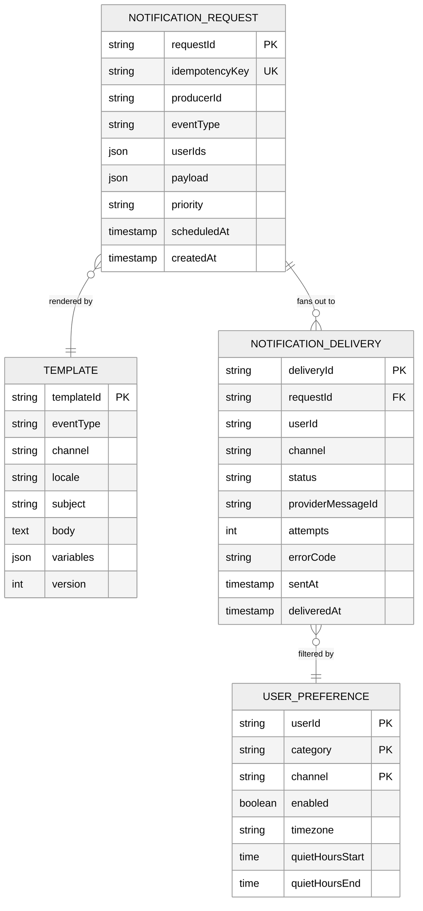

#### Table relationships

| From (child / many side) | FK column | Points to (parent / one side) | Cardinality | Plain English |
|---|---|---|---|---|
| `notification_delivery` | `request_id` | `notification_request.request_id` | N : 1 | One request fans out to many deliveries (one per user per channel). |
| `notification_delivery` | `user_id + channel` | `user_preference` | N : 1 | Each delivery is filtered by the user's preference for that channel + category. |
| `notification_request` | `event_type + channel` | `template.event_type + channel` | N : 1 | Many requests of the same type share one template. |

**Three queries this enables:**

| Question | Traversal |
|---|---|
| "What is the delivery status for request R?" | `notification_delivery WHERE request_id = R` — one row per (user, channel). |
| "What channels is user U opted into for marketing?" | `user_preference WHERE user_id = U AND category = 'marketing' AND enabled = true`. |
| "What template renders the 'order.shipped' push notification?" | `template WHERE event_type = 'order.shipped' AND channel = 'push'`. |

### 2.3 API / System Interface

We use **HTTPS + JSON** for all producer and consumer APIs. Notifications are delivered to end-users via external providers (FCM/APNs, SES/SendGrid, Twilio) — those are one-way outbound calls from our workers.

> 💡 **Why REST and not events?** Internal producers *can* publish to Kafka directly, but offering a REST endpoint lets any service trigger notifications without a Kafka client dependency. The REST handler is a thin wrapper that validates and enqueues — it adds no meaningful latency.

#### Producer API — triggering a notification

```
// Send a notification (single user or bulk)
POST /v1/notifications/send
Headers: Authorization: Bearer <service-token>
Request:
{
  "idempotency_key": "order-123-shipped",    // dedup key — same key = same notification
  "event_type":      "order.shipped",
  "user_ids":        ["u_abc"],              // 1 for transactional, up to millions for bulk
  "payload": {
    "order_id":       "123",
    "tracking_url":   "https://..."
  },
  "priority":        "high",                 // "high" | "low" — routes to different queues
  "channels":        ["push", "email"],      // optional override; default = system decides
  "scheduled_at":    null                    // null = send now; ISO8601 = future delivery
}
Response 202 Accepted:
{
  "request_id": "req_xyz",
  "status":     "QUEUED"
}
```

> **202 Accepted** — not 200 OK. The system has accepted and queued the request; it has *not* delivered the notification yet. Producers should not block on this.

#### Status API

```
// Poll delivery status for a request
GET /v1/notifications/{request_id}/status
Response:
{
  "request_id": "req_xyz",
  "deliveries": [
    { "user_id": "u_abc", "channel": "push",  "status": "DELIVERED", "delivered_at": "..." },
    { "user_id": "u_abc", "channel": "email", "status": "SENT",      "sent_at": "..." }
  ]
}
```

#### Preference API — user-facing

```
GET  /v1/users/{user_id}/preferences
PUT  /v1/users/{user_id}/preferences
Request body (PUT):
{
  "preferences": [
    { "category": "marketing", "channel": "email", "enabled": false },
    { "category": "transactional", "channel": "sms", "enabled": true }
  ],
  "timezone":          "America/New_York",
  "quiet_hours_start": "22:00",
  "quiet_hours_end":   "08:00"
}
```

---

## 3. High-Level Design

### 3.1 Producers can trigger a notification to one or more users

**The core loop:** a producer calls `POST /v1/notifications/send`, and a push notification lands on the user's phone.

**Naive (single-host) approach first:**

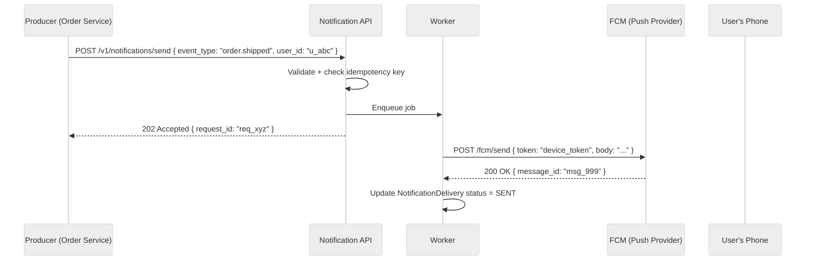

**Why a queue between API and Worker?**
- The producer gets an immediate `202` — it doesn't block waiting for FCM.
- Workers can be scaled independently of the API layer.
- Bursts are absorbed: a marketing blast enqueues 10M jobs; workers drain at their own pace.
- If a worker crashes, the job stays in the queue and is redelivered to another worker.

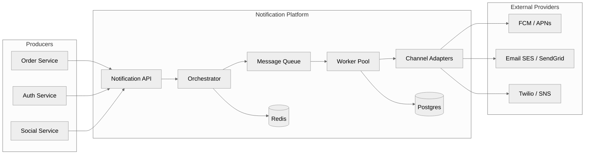

**Component responsibilities:**

| Component | Does what |
|---|---|
| **Notification API** | Validates request, checks idempotency key in Redis, persists `NotificationRequest`, enqueues to Orchestrator topic |
| **Orchestrator** | Resolves user preferences, selects channels, renders templates, fans out one job per (user, channel) to the appropriate queue |
| **Worker** | Pulls a (user, channel) job, calls the Channel Adapter, writes `NotificationDelivery` status |
| **Channel Adapter** | Thin wrapper over FCM / SES / Twilio; normalises request shape and provider error codes |
| **Redis** | Idempotency key cache (TTL 24h), rate-limit counters, quiet-hour scheduling |
| **Postgres** | Durable store for `NotificationRequest`, `NotificationDelivery`, `UserPreference`, `Template` |

### 3.2 Users can set per-channel and per-category preferences

Before a job is enqueued for delivery, the **Orchestrator** consults preferences to decide which channels to use.

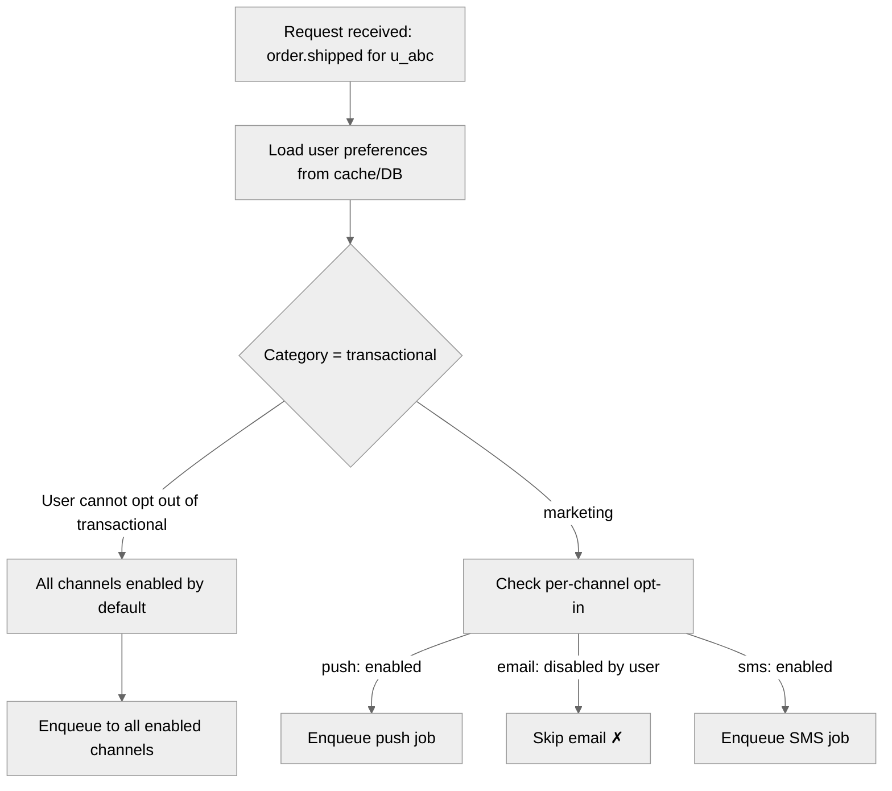

**Category rules:**

| Category | Can user opt out? | Default channels |
|---|---|---|
| `transactional` (OTP, receipts) | Partially — SMS/email required; push optional | Email + SMS |
| `security` (password reset, new device) | No — must receive at least one channel | Email + SMS |
| `social` (friend request, mention) | Yes — fully | Push + in-app |
| `marketing` (promotions, news) | Yes — fully | Push + email |

> 💡 **Why hard-require transactional / security?** Legal and UX: a user who opts out of all channels for "password reset" is locked out of their own account. Regulatory: GDPR and CAN-SPAM both carve out transactional messages from unsubscribe requirements.

**Preference caching:**
Preferences are read on every notification. Reading from Postgres on every job at 50K jobs/sec = 50K DB reads/sec — impractical. We cache preferences in **Redis** with a 5-minute TTL. On preference update, we invalidate the key immediately.

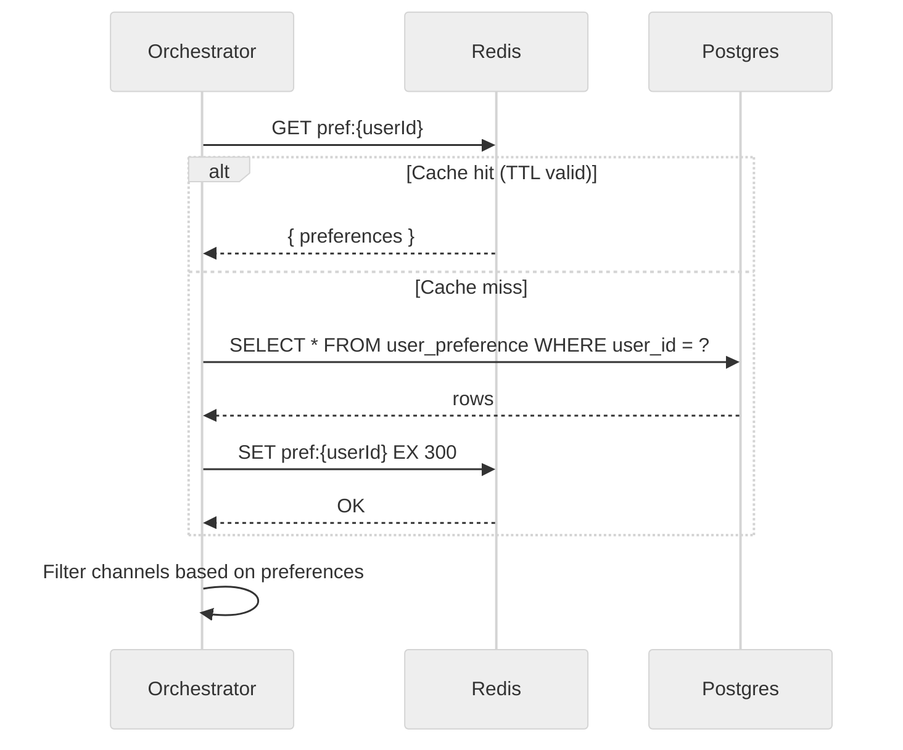

### 3.3 Notifications are rendered from templates with per-user personalisation

The **Orchestrator** renders the final message content before enqueuing a delivery job. Workers receive ready-to-send payloads — they don't know about templates.

**Template format:**

```
event_type: order.shipped
channel:    push
locale:     en-US
---
title: "Your order has shipped! 📦"
body:  "Hi {{name}}, order #{{order_id}} is on its way. Track it: {{tracking_url}}"
```

**Rendering flow:**

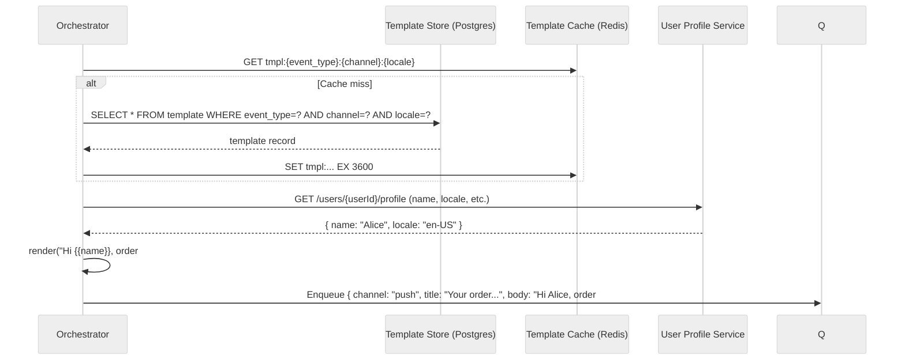

**Why render at orchestration time, not at worker time?**
- Workers are simple: receive a rendered payload, call the provider API, record status. No DB reads needed.
- Changing a template mid-flight doesn't affect already-enqueued jobs (important for correctness).
- Template rendering is CPU-bound (string substitution at scale); isolating it to the Orchestrator makes it easy to scale independently.

**Immutable template versions:**
Templates get a `version` number. A `NotificationDelivery` row records which `templateVersion` was used. This lets support teams see exactly what text was sent even after templates are updated.

### 3.4 Producers can query the delivery status of a notification

Every state transition is written to `NotificationDelivery`. Workers update the row after each provider call. Provider delivery webhooks (FCM delivered, SES bounced) update it again.

**Status state machine:**

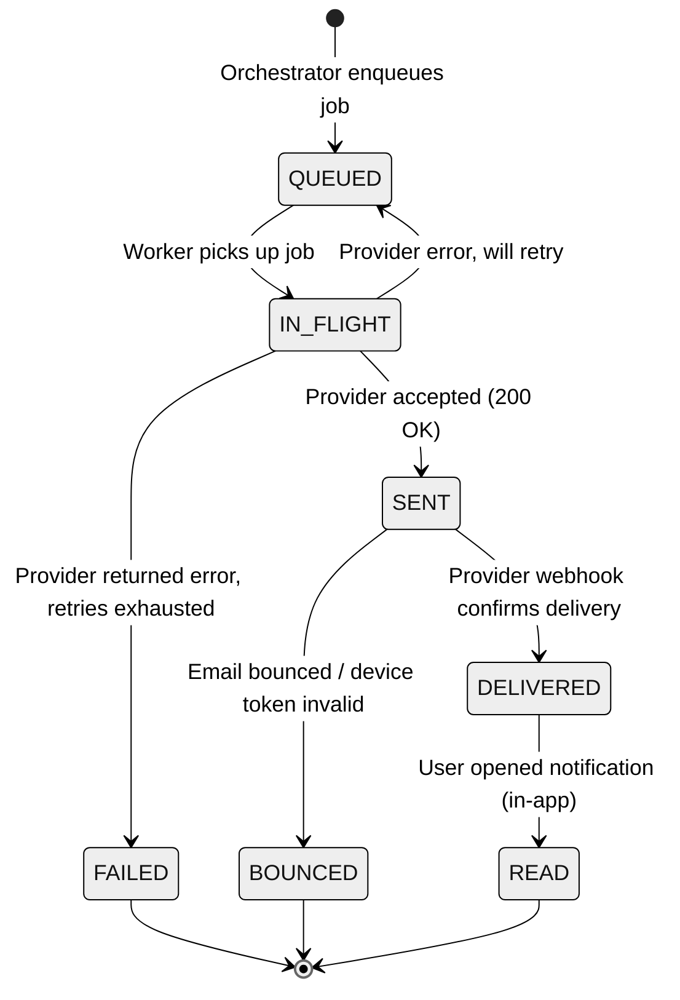

**Provider webhooks:**
FCM and SES support delivery webhooks (callbacks when the device actually receives the message or the email bounces). We expose a webhook receiver endpoint that updates `NotificationDelivery.status`.

```
POST /internal/webhooks/fcm
POST /internal/webhooks/ses
```

These are internal endpoints (not producer-facing), protected by provider-specific HMAC signature verification.

---

## 4. Deep Dives

### DD1: Fan-Out at Scale — Bulk & Marketing Blasts

**The problem:** a marketing blast to 10M users must be triggered by a single API call. The Orchestrator can't iterate 10M users synchronously — it would block for minutes and any crash would restart from zero.

**Bad approach — synchronous fan-out in the Orchestrator:**

```
POST /v1/notifications/send { user_ids: [id_1, id_2, ..., id_10M] }
Orchestrator loops over 10M user IDs:
  - Load preferences for each
  - Render template
  - Enqueue 1 job per (user, channel)
→ Single process, takes minutes, no fault tolerance
```

**Good approach — segmented fan-out with a Fan-Out Worker:**

```mermaid
%%{init: {'theme': 'neutral', 'themeVariables': {'fontSize': '18px'}}}%%
flowchart TD
    A[POST /send {user_ids: 10M, event_type: promo.summer_sale}] --> B[API: persist NotificationRequest, enqueue to Fan-Out Queue]
    B --> C[Fan-Out Worker: splits user list into batches of 1000]
    C --> D[Batch 1: users 0–999]
    C --> E[Batch 2: users 1000–1999]
    C --> F[... Batch 10000]
    D --> G[Orchestrator: resolve prefs + render per user]
    G --> H[Delivery Queue: 1 job per user per channel]
    H --> I[Channel Workers → FCM / SES / Twilio]
```

**Why 1,000-user batches?**
- Each batch is a separate queue message: if it fails, only 1,000 users are retried — not 10M.
- Batches can be processed in parallel across many Fan-Out Worker instances.
- Memory-bounded: loading 1,000 preference rows at once is cheap.

**Segment-based approach for very large audiences:**
For 100M+ blasts (think Twitter, Facebook scale), user lists are never passed inline. Instead:

```
POST /v1/notifications/send
{
  "event_type":  "promo.summer_sale",
  "audience_segment_id": "seg_vip_users",  // pre-computed segment in data warehouse
  "user_ids": null
}
```

The Fan-Out Worker reads user IDs from the segment (e.g., a pre-materialized set in S3 or a Kafka compacted topic) in a streaming fashion — never loading the full list into memory.

**Throughput math:**

| Stage | Target rate | Parallelism |
|---|---|---|
| Fan-Out workers (batch splitting) | 100 batches/s = 100K users/s | 10 workers |
| Orchestrator (pref lookup + render) | 10K users/s per instance | 50 instances |
| Channel workers (push) | 5K FCM calls/s per instance | 10 instances |
| Total fan-out time for 10M users | ~100 seconds | — |

> 💡 **100 seconds for 10M users is fine for marketing.** Marketing blasts are not time-critical. If you need faster, scale out more Fan-Out Workers and Orchestrator instances.

### DD2: Priority Queues — Transactional vs Marketing

**The problem:** a marketing email blast is filling the single delivery queue. A user triggers "forgot my password" — their OTP email is stuck behind 5M promo emails. They wait 15 minutes. They churn.

**Solution: separate queues by priority.**

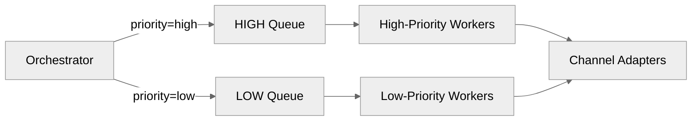

**Queue assignment rules:**

| Category | Priority | Queue | SLA |
|---|---|---|---|
| `security` | HIGH | High Queue | < 5s |
| `transactional` | HIGH | High Queue | < 5s |
| `social` | MEDIUM | Medium Queue | < 30s |
| `marketing` | LOW | Low Queue | < 10 min |

**Worker allocation:**
High-Queue workers are **always reserved** — they never drain Low Queue. Low-Queue workers are the majority (marketing is the bulk of volume). This prevents a marketing blast from ever starving a password reset.

```
High-Queue workers:    20 instances (reserved, never reassigned)
Medium-Queue workers:  30 instances
Low-Queue workers:     100 instances (autoscaled based on queue depth)
```

> 💡 **Interview insight:** Separate queues, not priorities within one queue. Most message queue implementations (Kafka, SQS) don't support true per-message priority efficiently. The clean solution is **separate queues with separate consumer groups and dedicated worker pools**.

**Autoscaling low-queue workers:**
Low-priority workers scale based on queue depth (Kafka consumer lag or SQS `ApproximateNumberOfMessages`). A 10M-message marketing blast auto-scales workers up; after drain, they scale back down. High-priority workers never autoscale — they're always there.

### DD3: Retries, DLQ, and Provider Circuit Breakers

**The problem:** FCM returns a 500. Should we retry? When? What if FCM is down for 30 minutes and we retry 10M jobs every 10 seconds?

#### Retry strategy

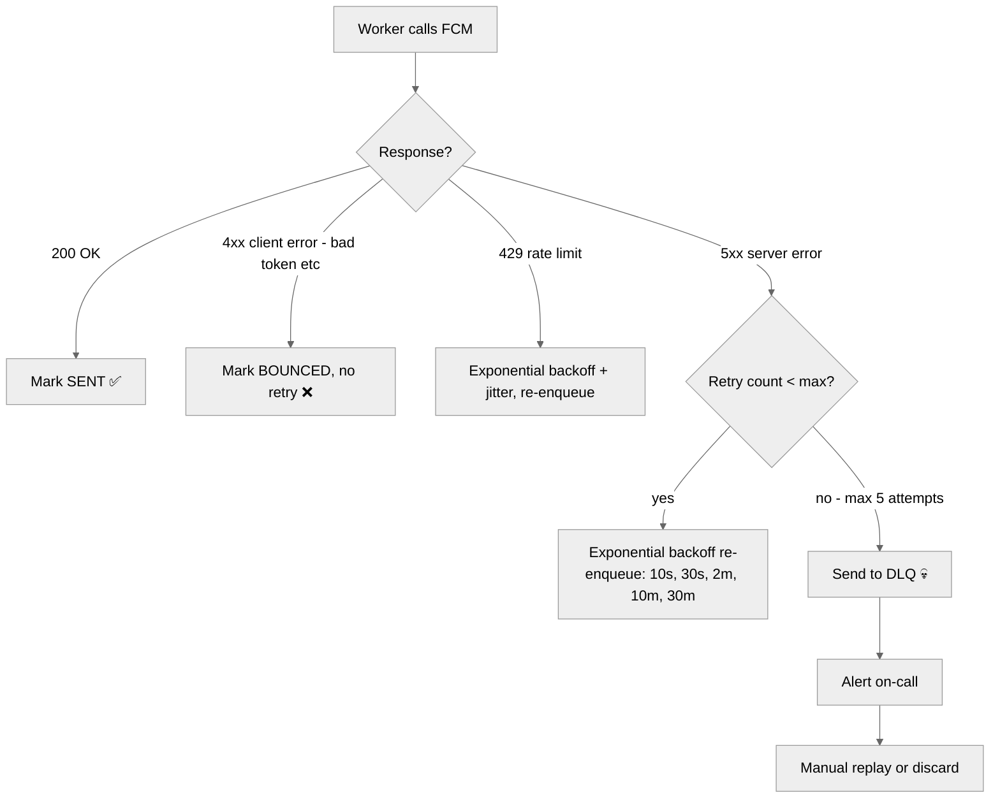

**Retry schedule (exponential backoff with jitter):**

| Attempt | Delay |
|---|---|
| 1st retry | 10s ± 3s |
| 2nd retry | 30s ± 5s |
| 3rd retry | 2m ± 15s |
| 4th retry | 10m ± 1m |
| 5th retry | 30m ± 3m |
| → DLQ | — |

**Why jitter?** Without jitter, all workers that hit the same FCM error at the same moment will retry at exactly the same time — creating a thundering herd that makes the recovery worse. Jitter spreads the retries.

#### Circuit Breaker — protecting providers

If FCM is returning 500s on 80% of calls, continuing to hammer it makes recovery slower. A **circuit breaker** per provider stops retrying when the error rate crosses a threshold.

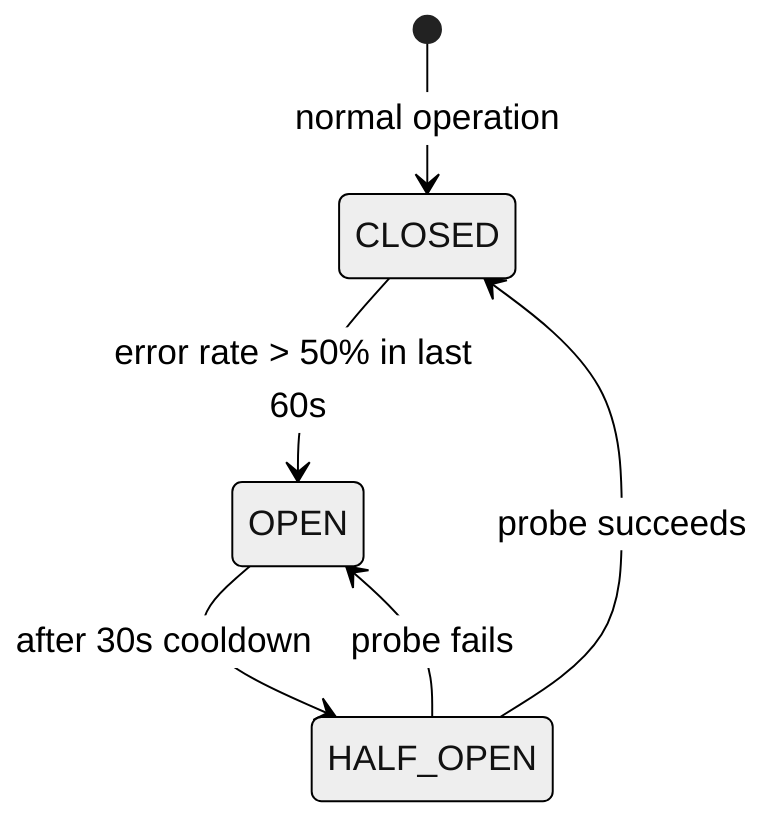

| State | Behaviour |
|---|---|
| **CLOSED** | All calls go through normally. |
| **OPEN** | Calls fail fast (no provider call); jobs re-enqueued with a delay. |
| **HALF_OPEN** | One probe request per 5s. If it succeeds, transition to CLOSED. |

Circuit breaker state is stored in **Redis** (shared across all workers for the same provider). A single Redis key per provider (`circuit:fcm`, `circuit:ses`) holds the current state and counters.

#### DLQ (Dead Letter Queue)

Jobs that exhaust retries land in the DLQ. DLQ consumers:
1. Write the final failure to `NotificationDelivery.status = FAILED` with the error code.
2. Trigger an alert if the DLQ depth exceeds threshold.
3. Support manual replay once the root cause is fixed.

> 💡 **DLQ is not "discard" — it's "park for investigation."** Engineers can inspect failed jobs, fix the bug (e.g. bad token format), and replay the DLQ. Without a DLQ, failed notifications are silently lost.

### DD4: Idempotency and Deduplication

**The problem:** the Order Service sends `POST /v1/notifications/send` and gets a network timeout. It retries. The user gets two "Your order shipped" push notifications.

**Solution: idempotency keys + a short-lived dedup cache.**

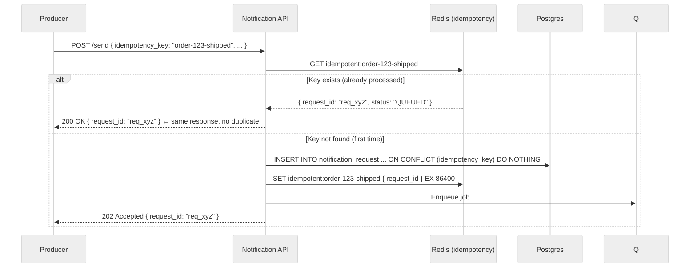

**Two-layer deduplication:**
1. **Redis cache (TTL 24h):** fast path — returns the original response within milliseconds for retries.
2. **Postgres `ON CONFLICT (idempotency_key) DO NOTHING`:** durable backstop in case Redis misses (TTL expired, Redis restart). The DB unique constraint guarantees one row.

**Worker-level deduplication:**
Because Kafka / SQS provide at-least-once delivery, a worker may process the same job twice. Workers check `NotificationDelivery.status` before calling the provider:

```sql
-- Before calling FCM
SELECT status FROM notification_delivery WHERE delivery_id = ?
-- If status = SENT or DELIVERED → skip, return early
-- If status = QUEUED or IN_FLIGHT → proceed
```

This makes workers **idempotent at the delivery level** regardless of how many times the queue redelivers the job.

### DD5: Rate Limiting — Per User and Per Provider

**The problem 1 — user spam:** a bug causes the Order Service to fire 500 "order shipped" events for the same user. Without a rate limit, the user receives 500 push notifications in seconds.

**The problem 2 — provider quotas:** FCM allows a maximum of 500K messages/min from our account. Twilio has per-number sending limits. Blowing these limits gets our account suspended.

#### Per-user rate limiting

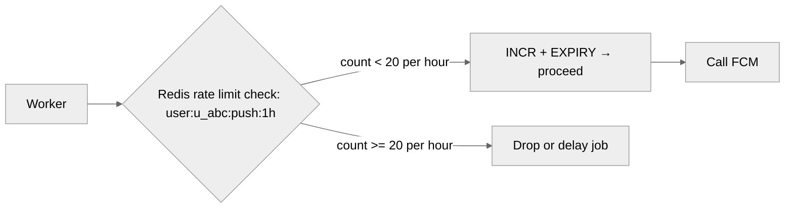

We use a **sliding window counter** in Redis per `(userId, channel, window)`:

```
Key:   ratelimit:push:u_abc:2024-01-15T14   (hourly bucket)
Value: integer counter
TTL:   2 hours (so it auto-expires)

Algorithm:
1. INCR ratelimit:push:u_abc:{current_hour}
2. If result > limit (e.g. 20/hour for push) → drop or delay
3. EXPIRE key 7200 (if first write)
```

**Per-category limits (example):**

| Channel | Category | Limit |
|---|---|---|
| Push | marketing | 3/day |
| Push | social | 20/hour |
| Email | marketing | 1/day |
| SMS | transactional | 10/hour |
| SMS | marketing | 1/week |

> 💡 **Transactional and security messages bypass rate limits.** An OTP request should never be dropped because the user already had 10 push today. Rate limits apply only to non-critical categories.

#### Per-provider rate limiting (token bucket)

```
Key:   ratelimit:provider:fcm
Algorithm: Token Bucket in Redis
  - Capacity: 8000 tokens (FCM limit: 500K/min → ~8K/sec)
  - Refill rate: 8000 tokens/sec
  - Worker: DECRBY ratelimit:provider:fcm 1 before each FCM call
  - If tokens < 1: back off 100ms and retry locally
```

All workers share the same token bucket in Redis, so the aggregate rate across all workers never exceeds the provider limit.

### DD6: Quiet Hours and Time-Zone-Aware Delivery

**The problem:** a social notification ("Alice commented on your photo") is triggered at 2 AM in the user's timezone. The user wakes up to a ping. They disable notifications. We lose a re-engagement vector.

**Solution: quiet hours check before enqueuing + a parked queue for delayed delivery.**

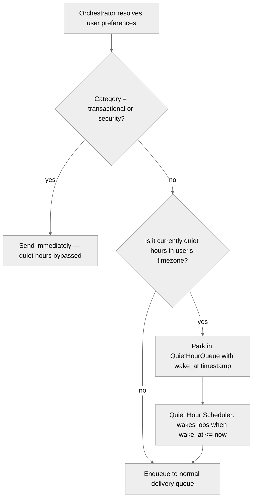

**Quiet Hour Scheduler:**
A lightweight Kafka Streams job (or a scheduled poll every minute) reads from the `QuietHourQueue` and re-enqueues jobs whose `wake_at` timestamp has passed.

```
QuietHourQueue message:
{
  "delivery_id":  "del_456",
  "wake_at":      "2024-01-15T08:00:00-05:00",   // user's local 8 AM
  "original_job": { ... }
}
```

The scheduler does a sorted query: `SELECT * FROM quiet_hour_queue WHERE wake_at <= NOW()` every minute, re-enqueues each job, and deletes the row. At ~10K parked notifications at any time, a single Postgres query per minute is trivial.

> 💡 **Why not use a Kafka delayed-message feature?** Kafka doesn't natively support per-message delays. Options: (1) a database-backed scheduler as above, (2) SQS delay queues (max 15 min), (3) a dedicated scheduler service (Temporal, Celery Beat). The DB scheduler is the simplest for this scale and delay range (hours, not milliseconds).

---

## 5. Final Architecture

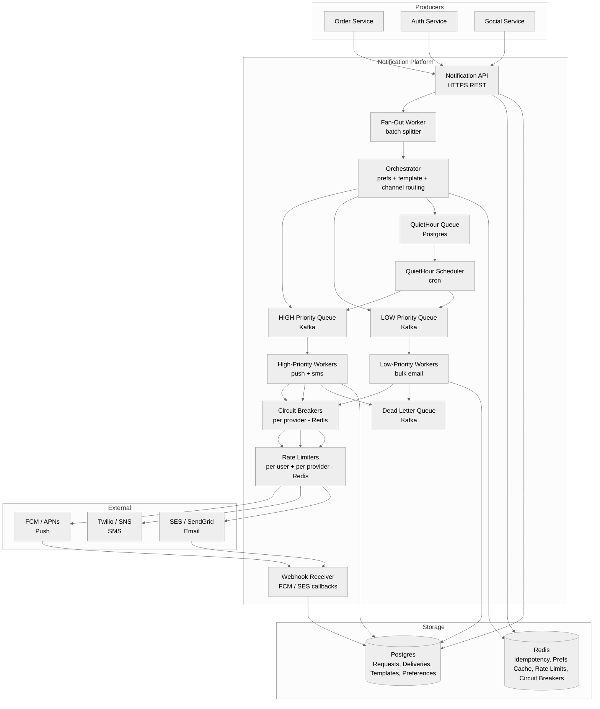

### Summary of choices

| Concern | Choice | Why |
|---|---|---|
| Producer interface | **REST API (202 Accepted)** | Simple, async, no Kafka client needed in callers |
| Fan-out | **Separate Fan-Out Worker + batch splitting** | Bounded memory, fault-tolerant, restartable |
| Queueing | **Kafka with separate topics per priority** | At-least-once, replay, separate consumer groups |
| Preference lookup | **Redis cache (5min TTL) + Postgres** | Avoid 50K DB reads/sec on hot path |
| Template rendering | **Orchestrator-time (not worker-time)** | Workers are simple; no DB reads needed at delivery |
| Priority | **Separate queues + dedicated worker pools** | High-priority never starved by marketing blasts |
| Retries | **Exponential backoff + jitter, max 5 attempts** | Avoids thundering herd; handles transient failures |
| DLQ | **Kafka dead-letter topic** | Park failures for investigation + manual replay |
| Circuit breaker | **Per-provider state in Redis** | Shared across all workers; fast recovery |
| Idempotency | **Redis TTL cache + Postgres unique constraint** | Two-layer; protects against retries at every level |
| Rate limiting | **Redis token bucket (provider) + sliding window (user)** | In-memory, sub-millisecond, shared across workers |
| Quiet hours | **Postgres-backed scheduler, 1-min poll** | Simple, low volume (~10K parked at any time) |
| Status tracking | **Postgres + provider webhooks** | Durable, queryable; webhooks for last-mile confirmed delivery |

---

## 6. What Is Expected at Each Level

### Mid-level (E4)
- ~80% breadth, 20% depth.
- Clear API (POST /send + status endpoint) + core entities.
- Identifies that synchronous delivery won't scale; proposes a queue + worker pattern.
- Basic preference check and template concept.
- Knows retries are needed; doesn't need to detail DLQ or circuit breakers.

### Senior (E5)
- ~60% breadth, 40% depth.
- Speeds through HLD; spends time on:
  - **Priority queues** — why one queue doesn't work; dedicated worker pools per priority.
  - **Idempotency** — two-layer Redis + DB unique constraint; worker-level dedup.
  - **Retry / DLQ** — exponential backoff with jitter, circuit breaker concept.
- Articulates trade-offs (Kafka vs SQS, fan-out strategies, DB vs Redis for preferences).
- Identifies quiet hours as a real product problem and proposes a scheduler approach.

### Staff+ (E6+)
- ~40% breadth, 60% depth.
- Drives 3+ deep dives end-to-end and brings real production judgment:
  - **DD1** — segment-based fan-out from S3/data warehouse, streaming user ID resolution, backpressure between Fan-Out and Orchestrator.
  - **DD3** — Redlock edge cases for circuit breakers, half-open probe strategy, DLQ replay semantics.
  - **DD4** — exactly-once semantics vs at-least-once + client dedup; why exactly-once is often not worth the complexity.
  - **DD5** — token bucket implementation in Redis with Lua scripts for atomicity; provider-specific quota negotiation.
- Mentions observability (queue lag, per-channel delivery rate, bounce rate, quiet-hour park depth as leading indicators).
- Discusses cell-based isolation (marketing blast in one cell can't starve transactional in another).

---

## 7. Appendix — Common Interviewer Follow-Ups

Questions an interviewer is very likely to ask. Have a 1-minute answer ready for each.

### Architecture & Queuing
1. **Why Kafka and not SQS or RabbitMQ?** → Kafka gives us replay (rewind to re-process a failed blast), high throughput (millions/sec), and compacted topics for segment-based fan-out. SQS is simpler but no replay. RabbitMQ can't scale to our throughput with durability. If the team is small and throughput is < 10K/s, SQS is fine.
2. **Why a separate Fan-Out Worker instead of doing fan-out in the Orchestrator?** → Fan-out for 10M users takes minutes. The Orchestrator needs to process many requests concurrently; tying it up in a 10-minute loop would starve other requests. Separate worker = separate failure domain.
3. **Why 202 Accepted and not 200 OK?** → 202 means "we've accepted and queued your request, but delivery hasn't happened yet." 200 OK would be a lie — the notification hasn't been sent at the time the API responds. Semantics matter for producers deciding whether to retry.

### Delivery & Reliability
4. **What's your delivery guarantee?** → **At-least-once**. Workers ack the queue message only after a successful provider call. If they crash before acking, the job is redelivered. Duplicates are suppressed by the idempotency key (dedup) and worker-level status check.
5. **Why not exactly-once?** → True exactly-once requires distributed transactions between the queue ack and the provider API call — no provider supports that. At-least-once + client-side dedup by `requestId` is the standard industry solution.
6. **What if Postgres is down when a worker tries to write delivery status?** → The worker retries the DB write. The job stays in-flight until the write succeeds. We don't ack the queue message until both the provider call *and* the DB write succeed. If Postgres is down long enough, jobs accumulate in the queue and are retried after recovery — no data is lost.

### Idempotency
7. **What if the idempotency key expires from Redis before the producer retries?** → The DB unique constraint on `idempotency_key` is the backstop. Even if the Redis TTL has expired, the `INSERT ... ON CONFLICT DO NOTHING` prevents a second row from being created. The worker won't process a duplicate because the `NotificationDelivery` row already has status SENT.
8. **Why 24h TTL for the idempotency key in Redis?** → Producers typically retry within minutes or hours of a failure. 24h covers essentially all retry windows. Beyond 24h, a re-send is probably intentional (daily digest, re-notification) and should have a fresh `idempotency_key`.

### Rate Limiting
9. **What happens to a notification that's dropped by the user rate limiter?** → For marketing, it's silently dropped (the user is already saturated; more won't help). For social, it may be delayed to the next window. We log the drop with a reason code so product teams can see suppression rates and tune limits.
10. **What if multiple workers are incrementing the same user rate limit counter simultaneously?** → Redis `INCR` is atomic — no race condition. Two concurrent INCR calls on the same key are serialised by Redis. No lock needed.

### Quiet Hours
11. **What about a notification that becomes irrelevant after being parked during quiet hours?** → Producers can set an `expires_at` on the request. The Quiet Hour Scheduler checks expiry before re-enqueuing: if `expires_at < now`, the job is dropped with status `EXPIRED`. Common for time-sensitive marketing ("flash sale ends in 4 hours").
12. **Why Postgres for the quiet hour queue and not Kafka?** → Kafka doesn't support delayed messages natively. We need to query "which jobs are ready to wake up now" — a DB SELECT with a time condition is the natural query. Kafka is append-only and doesn't support this pattern without extra complexity.

### Scale
13. **How would you scale to 10× — 10B notifications/day?** → Scale out: more Fan-Out Workers, more Orchestrator instances, more channel workers. Partition Postgres (or migrate to Cassandra/DynamoDB) for delivery records. Shard Redis by user ID for rate limits. The queue (Kafka) scales horizontally by adding partitions. No architectural change needed — just horizontal scale.
14. **How do you handle a rogue producer that sends 1M notification requests in 10 seconds?** → API-level rate limit per producer (service token): e.g. 1K req/min per service. The Fan-Out Worker also has a concurrency limit. Rogue blasts are queued but don't affect latency for other producers because Kafka partitions by producer ID.
15. **What metrics would you monitor?** → Queue lag per topic (leading indicator of backlog), p99 delivery latency per channel, delivery success rate per provider, DLQ depth (alarms if > 0 for high priority), circuit breaker state changes, per-user suppression rate, quiet-hour park depth.

### Preferences & Compliance
16. **How do you handle GDPR "right to be forgotten" for notifications?** → On user deletion: (1) purge `UserPreference` immediately; (2) set TTL on delivery records (e.g. 30 days) or anonymise `user_id`; (3) mark in-flight jobs as cancelled. Template personalisations are ephemeral (rendered at orchestration time, not stored in delivery records).
17. **How do you implement unsubscribe for marketing emails?** → Each email has a pre-signed unsubscribe link: `GET /unsubscribe?token=<signed JWT with userId+category>`. On click, the preference service sets `{ category: "marketing", channel: "email", enabled: false }`. CAN-SPAM requires honouring this within 10 business days; we do it immediately.

---

## Appendix — Patterns Touched

| Pattern | Used For |
|---|---|
| **Async Queue** | Decoupling producer latency from provider latency; absorbing burst traffic. |
| **At-Least-Once Delivery** | Queue + ack after success; worker-level dedup by status check. |
| **Priority Queues** | Separate Kafka topics + dedicated workers; transactional never starved by marketing. |
| **Fan-Out** | Fan-Out Worker splits large audience into 1,000-user batches; parallel orchestration. |
| **Circuit Breaker** | Per-provider state in Redis; fail-fast when FCM/SES is degraded. |
| **Exponential Backoff + Jitter** | Retry schedule for transient provider errors; avoids thundering herd. |
| **Dead Letter Queue** | Park exhausted retries for investigation; manual replay after root cause fix. |
| **Idempotency Key** | Redis TTL cache + DB unique constraint; dedup at API and worker level. |
| **Token Bucket** | Provider-level rate limiting shared across workers via Redis. |
| **Sliding Window Counter** | Per-user channel rate limiting in Redis. |
| **Cache-Aside** | User preferences and templates cached in Redis; DB is source of truth. |
| **Scheduler / Delayed Delivery** | Postgres-backed quiet-hour queue; 1-min poll re-enqueues ready jobs. |
| **Webhook Receiver** | Provider delivery callbacks update NotificationDelivery status (DELIVERED, BOUNCED). |
