# Twitter — System Design

> Detailed system design for **Twitter** (microblogging social media platform).
> Walks through the problem **step-by-step**, exactly like other Hello Interview-style breakdowns:
> **Requirements → Set Up (interface + data flow) → High-Level Design → Deep Dives → Final Architecture.**
>
> **References:** [CodeKarle Twitter Design](https://www.codekarle.com/system-design/Twitter-system-design.html), [HelloInterview Twitter](https://www.hellointerview.com/community/questions/twitter-amazon-product/cm6zh0pli00053b6qfm6cd9bu), [System Design Twitter (YouTube)](https://www.youtube.com/watch?v=Nfa-uUHuFHg)

---

## Table of Contents
1. [Understanding the Problem](#1-understanding-the-problem)
   - [Functional Requirements](#11-functional-requirements)
   - [Non-Functional Requirements](#12-non-functional-requirements)
2. [The Set Up](#2-the-set-up)
   - [Planning the Approach](#21-planning-the-approach)
   - [Core Entities](#22-core-entities)
   - [API Design](#23-api-design)
   - [Data Flow](#24-data-flow)
3. [High-Level Design](#3-high-level-design)
4. [Deep Dives](#4-deep-dives)
   - [DD1: Home Timeline — Push vs Pull vs Hybrid Fanout](#dd1-home-timeline--push-vs-pull-vs-hybrid-fanout)
   - [DD2: The Celebrity Problem (Famous Users)](#dd2-the-celebrity-problem-famous-users)
   - [DD3: Real-time Delivery for Live Users](#dd3-real-time-delivery-for-live-users)
   - [DD4: Search & Trending Topics](#dd4-search--trending-topics)
   - [DD5: Scaling, Caching, and Storage Choices](#dd5-scaling-caching-and-storage-choices)
5. [Final Architecture](#5-final-architecture)
6. [What Is Expected at Each Level](#6-what-is-expected-at-each-level)
7. [Appendix — Red Flags to Avoid](#appendix--red-flags-to-avoid)
8. [Appendix — Common Interviewer Follow-Ups](#appendix--common-interviewer-follow-ups)

---

## 1. Understanding the Problem

> **🐦 What is Twitter?**
> A microblogging social media platform where users post short updates (tweets), follow other users, and consume a personalized real-time feed mixing followed content with discovery.
>
> The defining engineering challenges are: **read-heavy workload** (~1000:1 R/W ratio), the **fanout problem** (a celebrity tweet must reach 100M+ followers), and **low-latency feed rendering** (<200 ms p95).

### 1.1 Functional Requirements

**Core (in scope):**

| # | Requirement |
|---|-------------|
| 1 | Users can **post a tweet** (text ≤ 280 chars + optional media). |
| 2 | Users can **follow / unfollow** other users (asymmetric, directed). |
| 3 | Users can view their **home timeline** (tweets from people they follow). |
| 4 | Users can view a **user timeline** (a specific user's tweets). |
| 5 | Users can **search** tweets and users by keywords / hashtags. |

**Below the line (out of scope):**
- Direct Messages (DMs).
- Twitter Spaces / live audio.
- Ads / monetization platform.
- Verification (Twitter Blue).
- Likes / Retweets / Replies (we'll mention but not deep-dive).

> ✅ **Tip:** Always confirm scope. Likes/retweets are usually in-scope but follow the same fanout pattern as tweets, so we don't deep-dive separately.

### 1.2 Non-Functional Requirements

> 📏 **Scale (clarify with interviewer):** ~**500M DAU**, ~**1B tweets/day** (~12K tweets/sec avg, ~36K peak), ~**25B timeline reads/day** (~290K reads/sec avg, ~870K peak). Avg user has **200 followers**; celebrities have **100M+**.

**Core (in scope):**

| # | Requirement |
|---|-------------|
| 1 | **Read latency** — home timeline < **200 ms p95**. |
| 2 | **Read-heavy** — system tuned for ~**1000:1** read-to-write ratio. |
| 3 | **Availability** — 99.99% on reads, 99.9% on writes. |
| 4 | **Eventual consistency OK** — a tweet showing up a few seconds late in followers' feeds is acceptable. |
| 5 | **Durability** — once a tweet is acked, it must not be lost. |
| 6 | **Scalability** — handle viral spikes (10× normal traffic on major events). |

**Below the line:**
- Strong consistency on the timeline.
- GDPR / data deletion compliance.
- End-to-end encryption.

> 💡 **Why eventual consistency?** Twitter is a social feed, not a banking system. Optimizing for read latency and scale is worth the trade-off of "your followers see your tweet 2 seconds late."

---

## 2. The Set Up

### 2.1 Planning the Approach
Twitter is a classic **read-optimized social platform**. Two core problems drive the design:
1. **Fanout** — when User A tweets, how do tweets reach all their followers' timelines fast?
2. **Timeline assembly** — when User B opens the app, how do we serve a personalized feed in <200 ms?

We'll **pre-compute and cache aggressively** to keep reads cheap, even if writes become expensive.

### 2.2 Core Entities

| Entity | Fields |
|---|---|
| **User** | `user_id`, `username`, `display_name`, `bio`, `created_at` |
| **Tweet** | `tweet_id` (TimeUUID), `user_id`, `content`, `media_urls[]`, `created_at`, `reply_to_id` |
| **Follow** | `follower_id`, `followee_id`, `created_at` |
| **Timeline** | `user_id`, `tweet_ids[]` (cached, sorted by score/time) |

### 2.3 API Design

```http
POST   /v1/tweets                        # Post a tweet
       body: { content, media_ids[] }
GET    /v1/tweets/{tweet_id}             # Get a single tweet
DELETE /v1/tweets/{tweet_id}             # Delete a tweet

POST   /v1/users/{user_id}/follow        # Follow a user
DELETE /v1/users/{user_id}/follow        # Unfollow

GET    /v1/users/{user_id}/timeline      # User timeline (their tweets)
       ?cursor=<cursor>&limit=20
GET    /v1/feed/home                     # Home timeline (from follows)
       ?cursor=<cursor>&limit=20

GET    /v1/search?q=<query>              # Search tweets/users
```

> 💡 **Cursor-based pagination** (not offset) — handles concurrent inserts gracefully in an infinite-scroll feed.

### 2.4 Data Flow

**Write path** (post a tweet):
1. Client sends `POST /tweets` with content.
2. Tweet is **persisted** in the source-of-truth datastore.
3. A `tweet_posted` event is **published to Kafka**.
4. Async consumers handle: **fanout to follower timelines**, **search indexing**, **trends counting**.
5. Client gets `201 Created` immediately (fanout is async).

**Read path** (home timeline):
1. Client sends `GET /feed/home`.
2. Timeline Service looks up the user's **pre-computed timeline** in cache.
3. Merges with **recent tweets from celebrities** the user follows (pulled at read time).
4. Hydrates tweet IDs → tweet bodies → returns to client.

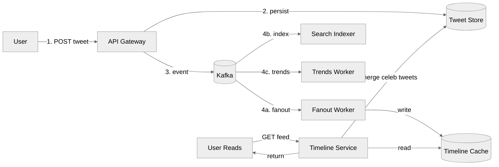

**Flow walkthrough:**
- **Write side (top half):** `User → API Gateway → Tweet Store` (synchronous persist) → publishes a Kafka event → three async workers fork off (fanout, search index, trends) → fanout worker writes into the Timeline Cache.
- **Read side (bottom half):** `User → Timeline Service` reads the pre-built cache, *also* merges in fresh tweets pulled from the Tweet Store (for celebs), then returns the merged feed.
- The **Kafka boundary** is the key decoupling point — writes return fast; everything heavy happens async.

---

## 3. High-Level Design

A first cut that satisfies the functional requirements before we tackle the hard problems.

> 💡 **How to read these diagrams:** numbers (`1️⃣`, `2️⃣`, ...) show the **order of invocation**. Solid arrows are synchronous calls; dashed arrows are async (event-driven).

### 3.1 Write path — "User posts a tweet"

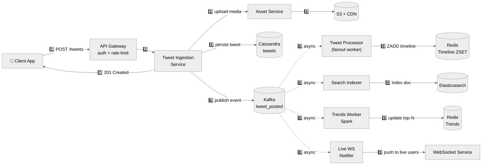

**Step-by-step:**
1. Client sends `POST /v1/tweets`.
2. Gateway authenticates and routes to **Tweet Ingestion**.
3-4. Media (if any) is uploaded to **S3** via Asset Service and a CDN URL is returned.
5. Tweet row is persisted in **Cassandra** (source of truth).
6. A `tweet_posted` event is published to **Kafka**.
7. Service responds **`201 Created`** — the user does **not** wait for fanout.
8-9. Async consumers do their work in parallel: fanout to followers, search indexing, trends counting, live-user notification.

### 3.2 Read path — "User opens home timeline"

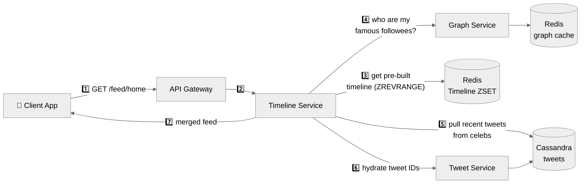

**Step-by-step:**
1. Client sends `GET /v1/feed/home`.
2. Gateway routes to **Timeline Service**.
3. Read pre-computed timeline (non-celeb tweets) from **Redis** — this is the hot path, sub-ms.
4. Get the user's **famous followees** from Graph Service (also cached in Redis).
5. Pull recent tweets from those celebs directly from **Cassandra** (small set, manageable).
6. **Hydrate** tweet IDs → full tweet objects via Tweet Service.
7. **Merge + rank** the two streams and return to client.

### 3.3 Components at a glance

| Component | Purpose | Storage |
|---|---|---|
| **API Gateway** | Auth, rate limit, routing | — |
| **User Service** | Profile / auth | MySQL + Redis |
| **Graph Service** | Follow relationships | MySQL + Redis |
| **Tweet Ingestion Service** | Persist new tweets, publish events | Cassandra |
| **Asset Service** | Upload images/videos | S3 + CloudFront CDN |
| **Tweet Service** | Read tweets by ID/user | Cassandra |
| **Timeline Service** | Build/serve home timeline | Redis cache |
| **Tweet Processor** | Fanout worker | Kafka consumer |
| **Search Service / Indexer** | Full-text search | Elasticsearch + Redis |
| **Live WebSocket Service** | Real-time push to live users | In-memory connections |
| **Trends Service** | Trending topics | Spark Streaming + Redis |
| **Kafka** | Event backbone (decoupling, replay) | — |

> 💡 This naive picture works for normal users but **breaks for celebrities**. We fix that in [DD2](#dd2-the-celebrity-problem-famous-users).

---

## 4. Deep Dives

### DD1: Home Timeline — Push vs Pull vs Hybrid Fanout

The core engineering question of Twitter: **how do we build the home timeline?**

#### Option A — Pull (Fanout-on-Read)

When user opens the app:
1. Look up everyone they follow (200 users avg).
2. Query each followee's recent tweets.
3. Merge-sort by timestamp.
4. Return top N.

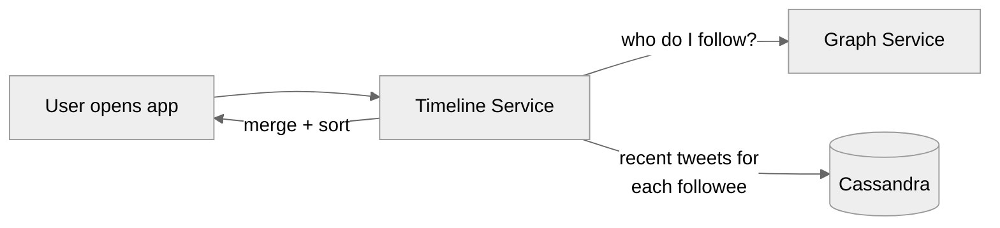

**Flow walkthrough (Pull):**
1. User opens the app → hits **Timeline Service**.
2. Timeline Service asks **Graph Service**: *"who does this user follow?"* (returns ~200 user IDs).
3. For each followee, query **Cassandra** for their recent tweets.
4. Merge-sort all results by timestamp → take top N → return to user.

> ⚠️ Notice the read does **200+ Cassandra queries per timeline load** — this is why pure pull doesn't scale.

| ✅ Pros | ❌ Cons |
|---|---|
| Cheap writes (no fanout) | **VERY** expensive reads — 200+ subqueries per timeline load |
| Always fresh | Read latency dies under load |
| No wasted work for inactive users | Poor cache utilization |

#### Option B — Push (Fanout-on-Write)

When user posts a tweet:
1. Look up all their followers.
2. Inject tweet ID into **each follower's pre-built timeline** (Redis sorted set).
3. Reads are O(1) — just read the cache.

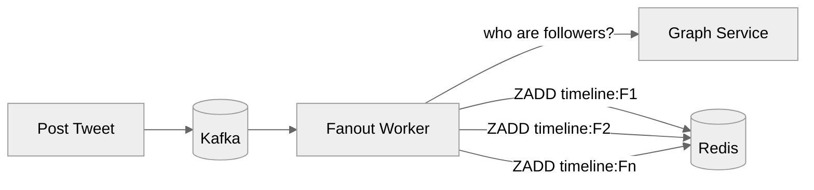

**Flow walkthrough (Push):**
1. User posts a tweet → event is published to **Kafka**.
2. **Fanout Worker** consumes the event.
3. Worker asks **Graph Service** for the author's follower list.
4. For *every* follower, worker `ZADD`s the tweet ID into that follower's Redis timeline (`timeline:F1`, `timeline:F2`, … `timeline:Fn`).
5. Reads later are O(1) — just `ZREVRANGE timeline:user_id 0 49`.

> ⚠️ For a celeb with 100M followers, step 4 means **100M Redis writes for one tweet** — unscalable.

| ✅ Pros | ❌ Cons |
|---|---|
| **O(1) reads** — just `ZREVRANGE` | Write amplification — 1 tweet → N writes |
| Sub-ms timeline retrieval | Disaster for celebs (100M writes per tweet) |
| Easy to merge / rank later | Wasted work for inactive users |

#### Option C — Hybrid (What Twitter Actually Uses) ✓

```
┌─────────────────────────────────────────────────────────────────┐
│                   HYBRID FANOUT STRATEGY                         │
│                                                                  │
│  NORMAL user posts (< 1M followers):                            │
│    → Fanout-on-WRITE (push to follower timelines)               │
│                                                                  │
│  FAMOUS user posts (≥ 1M followers):                            │
│    → Do NOT fan out                                             │
│    → Tweet stored in Cassandra only                             │
│    → On timeline read, MERGE:                                   │
│        (a) pre-computed timeline from Redis (normal users)      │
│        (b) recent tweets from famous users they follow (pull)   │
│                                                                  │
│  Best of both worlds:                                           │
│    • Most users get instant timelines (cached)                  │
│    • Celebrities don't trigger 100M writes                      │
└─────────────────────────────────────────────────────────────────┘
```

#### Timeline Service logic (pseudocode)

```python
def get_home_timeline(user_id):
    # 1. Pre-built timeline from normal followees
    tweet_ids_normal = redis.zrevrange(f"timeline:{user_id}", 0, 49)

    # 2. Pull from celebrities (small set, manageable)
    celeb_ids = graph_service.get_famous_followees(user_id)
    tweet_ids_celeb = tweet_service.recent_tweets(celeb_ids, limit=20)

    # 3. Merge + rank by timestamp/score
    merged = merge_and_rank(tweet_ids_normal, tweet_ids_celeb)[:50]

    # 4. Hydrate (tweet_id -> full tweet object)
    return tweet_service.batch_get(merged)
```

#### Redis timeline storage

```
Key:    timeline:user_123
Type:   Sorted Set (ZSET)
Score:  timestamp (or ranking score)
Value:  tweet_id

Operations:
  ZADD          timeline:user_123 <score> <tweet_id>     # On fanout
  ZREVRANGE     timeline:user_123 0 49                   # Get latest 50
  ZREMRANGEBYRANK timeline:user_123 0 -801               # Cap at 800
TTL: 7 days for active users; evict for inactive users.
```

#### User segmentation drives fanout decisions

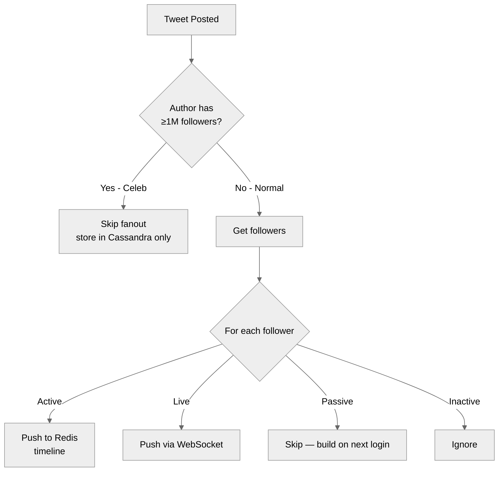

**Flow walkthrough (decision tree):**
1. **Tweet posted** → Tweet Processor checks the author.
2. **Author check:** Does the author have ≥1M followers?
   - **Yes (Celeb):** Stop here — tweet stays in Cassandra, no fanout. Followers will pull it at read time.
   - **No (Normal user):** Continue to step 3.
3. **Get followers** from Graph Service → iterate.
4. **For each follower**, classify and act:
   - **Active** (used app in last 3 days) → `ZADD` to their Redis timeline.
   - **Live** (currently online with WS open) → also push via WebSocket for instant delivery.
   - **Passive** (dormant) → skip; build their timeline lazily on next login.
   - **Inactive** (deactivated) → ignore entirely.

> 💡 The decision tree is the **whole hybrid strategy** in one picture — each branch saves us from a different scaling pitfall.

| User Type | Definition | Fanout Strategy |
|---|---|---|
| **Famous** | ≥ 1M followers | Pull-on-read (no fanout) |
| **Active** | Used app last 3 days | Push to Redis timeline |
| **Live** | Currently online (WS connected) | Push via WebSocket immediately |
| **Passive** | Account exists, dormant | Lazy — build on login |
| **Inactive** | Soft-deleted | Ignore |

---

### DD2: The Celebrity Problem (Famous Users)

The "Bieber problem": **Justin Bieber has 100M followers**. With pure fanout-on-write, one tweet = 100M Redis writes = system meltdown.

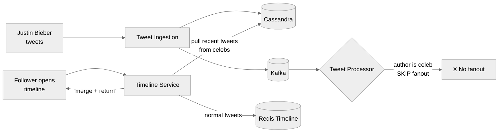

**Flow walkthrough:**
- **Top half — Celeb posts:**
  1. Bieber tweets → **Tweet Ingestion** persists to **Cassandra**.
  2. Event published to **Kafka**.
  3. **Tweet Processor** consumes the event, checks `is_famous == true`, and **skips fanout entirely** (no Redis writes).
- **Bottom half — Follower reads:**
  1. Follower opens timeline → **Timeline Service** invoked.
  2. Reads pre-built timeline (only non-celeb tweets) from **Redis**.
  3. Pulls recent celeb tweets directly from **Cassandra** (a small `WHERE user_id IN (...)` query).
  4. **Merges** the two streams by timestamp/score → returns to user.

> 💡 The work is **shifted from write-time to read-time** — 1 expensive read per follower (cheap, cacheable) instead of 100M writes per tweet (catastrophic).

#### Strategy details

1. Mark users with **≥1M followers** as `is_famous=true` (a flag in User Service).
2. When a famous user tweets:
   - Persist in Cassandra (normal).
   - Publish to Kafka (search/analytics still need this).
   - **Skip the fanout step.**
3. When *any* user reads their home timeline:
   - Read pre-computed timeline from Redis (contains only **non-famous** tweets).
   - Get list of famous users they follow (cached in Graph Service Redis).
   - Pull recent tweets from those celebs (Cassandra `WHERE user_id IN (...) ORDER BY tweet_id DESC`).
   - Merge + rank + return.
4. **Cache the merged result** with a short TTL (~30 s) so refreshes don't re-merge.

#### Edge case — celeb follows celeb

If Donald Trump (celeb) follows Elon Musk (celeb), Trump still wants Musk's tweets near-real-time. The famous-followee set is small, so we **directly push between celebs** (a special small-cardinality fanout).

```
Two celebs => bidirectional small-set fanout (cheap)
Celeb -> normal users => skip fanout (use pull-on-read)
Normal user -> their followers => normal push fanout
```

---

### DD3: Real-time Delivery for Live Users

For users currently online, we want **sub-second** tweet delivery without polling.

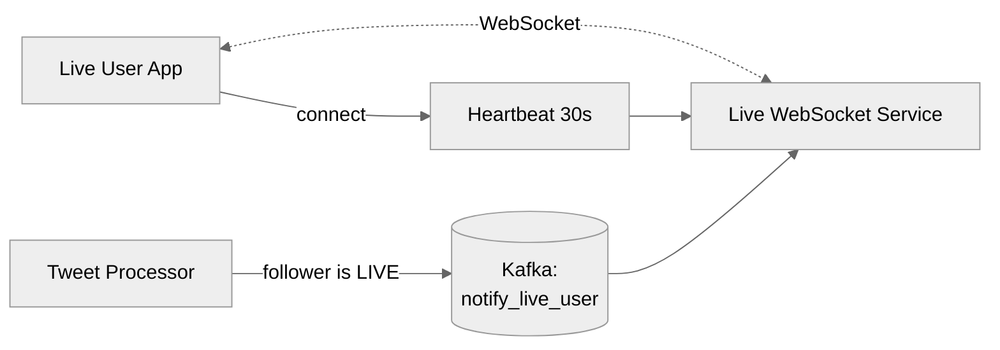

**Flow walkthrough:**
1. **Live user opens app** → establishes a persistent **WebSocket** to the Live WS Service → user marked `LIVE` in Redis.
2. **Heartbeat** every 30s keeps the connection alive (and lets the server detect disconnects).
3. When *anyone* tweets, the **Tweet Processor** scans the follower list. For each follower flagged `LIVE`, it publishes a `notify_live_user` event to **Kafka**.
4. **Live WS Service** consumes the event, finds the WebSocket connection (consistent hash on `user_id`), and pushes the tweet down the wire.
5. App receives the push instantly → prepends to the in-memory timeline (no refresh needed).
6. User closes app → WS disconnects → user marked offline.

#### Scaling WebSockets

| Concern | Solution |
|---|---|
| **Connection count** | Each WS server holds ~100K connections; horizontal scaling |
| **Routing** | Consistent hashing by `user_id` → which WS server holds my conn |
| **Stickiness** | Sticky session at LB layer (or service mesh routes by hash) |
| **Health** | Heartbeats every 30 s; dead connections evicted |
| **Failover** | If WS server dies, client reconnects → re-registered on new node |

> 💡 The WS service is **stateful** — be explicit in the interview that this is the only stateful tier and explain how connection routing works.

---

### DD4: Search & Trending Topics

#### Search

**Storage:** **Elasticsearch** for full-text search with relevance scoring, hashtag/mention lookups, and time/user filters.

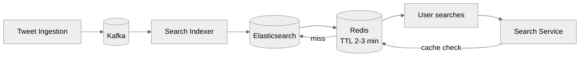

**Flow walkthrough:**
- **Indexing path (top):**
  1. Every new tweet flows through **Tweet Ingestion** → published to **Kafka**.
  2. **Search Indexer** consumes the event and writes a denormalized document to **Elasticsearch** (with hashtags, mentions, content tokens).
- **Query path (bottom):**
  1. User searches → hits **Search Service**.
  2. Service first checks **Redis** (TTL 2–3 min). On a **HIT** → return immediately.
  3. On **MISS** → query Elasticsearch → store the result in Redis → return to user.

> 💡 During trending events, a single search query may serve thousands of users — the Redis cache deflects 90%+ of ES load.

**Why cache search results?** Trending events cause many users to search the same terms. A 2-minute Redis cache reduces ES load by 10–100×.

**ES document:**
```json
{
  "tweet_id": "...",
  "user_id": "...",
  "content": "tokenized text",
  "hashtags": ["#worldcup"],
  "mentions": ["@user"],
  "created_at": "2026-05-10T...",
  "engagement_score": 1234
}
```

#### Trending Topics

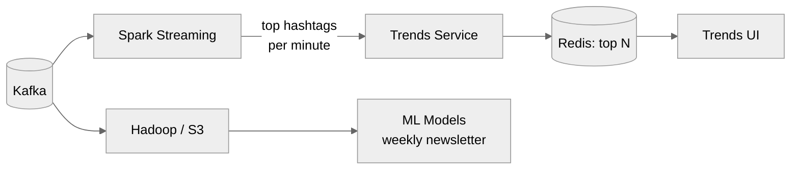

**Flow walkthrough:**
- **Real-time path (top):**
  1. **Kafka** streams tweet events → **Spark Streaming** processes a sliding 5-min window.
  2. Spark counts hashtag occurrences → publishes top-N to **Trends Service**.
  3. Trends Service writes the list to **Redis** (per region + global).
  4. **Trends UI** reads from Redis on every page load — always fresh, sub-ms.
- **Batch path (bottom):**
  1. Same Kafka topic is also dumped into **Hadoop / S3** for archival.
  2. Nightly **ML jobs** crunch this data for: most-engaged tweets, recommendation training, weekly digest emails to passive users.

- **Spark Streaming** sliding window (e.g., 5 min) counts hashtag occurrences and updates Redis with top-N **globally and per-region**.
- **Hadoop** batch jobs run nightly for: most-engaged tweets, recommendation training data, weekly digest emails to passive users (re-engagement).
- Trends are temporary, so Redis is sufficient — no durable store needed.

---

### DD5: Scaling, Caching, and Storage Choices

#### Storage decision matrix

| Data | Storage | Why |
|---|---|---|
| **Users** | MySQL + Redis | Relational, finite, strong consistency for auth |
| **Follow graph** | MySQL + Redis | Relational, simple lookups (followers / following) |
| **Tweets** | Cassandra | High write throughput, time-series, partitioned by `user_id` |
| **Timelines (cache)** | Redis (ZSET) | Sub-ms reads, time-sortable |
| **Search index** | Elasticsearch | Full-text, relevance, hashtag/mention queries |
| **Media** | S3 + CloudFront CDN | Cheap, durable, edge-cached |
| **Events** | Kafka | Decoupling writes from fanout/search/analytics; replayable |
| **Trends** | Spark + Redis | Streaming aggregations, temporary data |
| **Analytics** | Hadoop / S3 + Spark | Batch processing |

#### Why Cassandra for tweets?

```
- 12K+ writes/sec average, 36K+ peak
- A single MySQL handles ~5-10K writes/sec → won't scale
- Cassandra: masterless, append-only, partitioned by user_id
- Tunable consistency (CL=ONE for tweets is fine)
- Query pattern: "give me tweets for user_id ordered by time" → matches partition key + clustering perfectly
```

```sql
CREATE TABLE tweets (
  user_id  BIGINT,
  tweet_id TIMEUUID,                       -- time-ordered, globally unique
  content  TEXT,
  media_urls LIST<TEXT>,
  PRIMARY KEY (user_id, tweet_id)
) WITH CLUSTERING ORDER BY (tweet_id DESC);
```

> 💡 **TimeUUID** = lexicographic order = chronological order, so `LIMIT 50` gives you the latest 50 tweets without a sort.

#### Caching strategy (multi-layer)

```
┌─────────────────────────────────────────────────────────────┐
│                    READ PATH CACHING                         │
│                                                              │
│  Browser/App  →  CDN (static)  →  API Gateway              │
│       │                                                      │
│       ▼                                                      │
│   Timeline Service                                           │
│       │                                                      │
│       ├─► Redis: pre-computed timeline   (HOT)             │
│       ├─► Redis: user info               (HOT)             │
│       ├─► Redis: graph (followers/ing)   (HOT)             │
│       │                                                      │
│       └─► Cassandra / MySQL              (COLD - fallback) │
└─────────────────────────────────────────────────────────────┘
```

#### Capacity (back-of-the-envelope)

```
WRITES:
  500M users × 2 tweets/day = 1B tweets/day
  → ~12K tweets/sec avg, ~36K peak

READS:
  500M users × 50 timeline loads/day = 25B reads/day
  → ~290K reads/sec avg, ~870K peak

FANOUT (worst case if no hybrid):
  12K tweets/sec × 200 avg followers = 2.4M timeline writes/sec
  Celeb tweet (100M followers) = 100M writes per tweet  ← UNSCALABLE

STORAGE (tweets only, ~300 bytes each):
  1B/day × 300 B = 300 GB/day → ~110 TB/year
  Plus 3× replication and media (S3, separate).
```

> 💡 The **fanout numbers** prove why hybrid is mandatory.

---

## 5. Final Architecture

The full picture, organized into **3 layers** (Client → Services → Storage) with **two clearly numbered flows** overlaid.

> 🟢 **Green numbers `1️⃣–7️⃣`** = WRITE flow (posting a tweet).
> 🔵 **Blue numbers `Ⓐ–Ⓖ`** = READ flow (loading the home timeline).

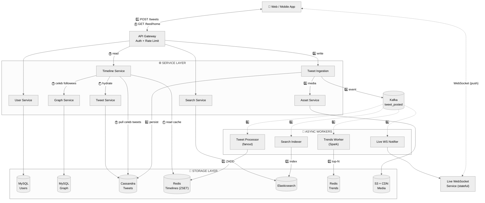

### 🟢 WRITE PATH — User posts a tweet

| # | Step |
|---|------|
| **1️⃣** | Client → `POST /v1/tweets` → API Gateway. |
| **2️⃣** | Gateway authenticates → routes to **Tweet Ingestion**. |
| **3️⃣** | Media (image/video) uploaded via **Asset Service** → S3 + CDN URL returned. |
| **4️⃣** | Tweet persisted in **Cassandra** (source of truth). |
| **5️⃣** | `tweet_posted` event published to **Kafka**. Client immediately receives **`201 Created`**. |
| **6️⃣** | Async consumers fork off: Tweet Processor (fanout), Search Indexer, Trends Worker, Live WS Notifier. |
| **7️⃣** | Each worker writes to its target store (Redis timelines, Elasticsearch, Redis trends) and pushes to live WebSocket users. |

### 🔵 READ PATH — User opens home timeline

| # | Step |
|---|------|
| **Ⓐ** | Client → `GET /v1/feed/home` → API Gateway. |
| **Ⓑ** | Gateway routes to **Timeline Service**. |
| **Ⓒ** | Read pre-computed timeline (non-celeb tweets) from **Redis ZSET** — sub-ms hot path. |
| **Ⓓ** | Look up user's **famous followees** via Graph Service (Redis-cached). |
| **Ⓔ** | Pull recent tweets from those celebs directly from **Cassandra**. |
| **Ⓕ** | **Hydrate** tweet IDs → full tweet bodies via Tweet Service. |
| **Ⓖ** | Merge + rank both streams → return to client. If client is **LIVE**, future tweets arrive via WebSocket push. |

---

## 6. What Is Expected at Each Level

| Level | Expectations |
|---|---|
| **Mid-level (E4)** | Get the FRs/NFRs right. Identify the read-heavy nature. Propose a basic push fanout. Use Redis for caching. Mention Kafka for decoupling. |
| **Senior (E5)** | Identify the celebrity problem **without prompting**. Propose hybrid fanout. Distinguish active/passive/live/famous users. Justify Cassandra over MySQL for tweets. Discuss Elasticsearch for search. |
| **Staff (E6+)** | Discuss capacity numbers, partitioning strategy (shard Redis by user_id, Cassandra by user_id). Trade-offs of eventual consistency. Failure scenarios — Kafka backpressure, Redis node loss, ES reindexing. WebSocket scaling and stateful service operation. Cost optimizations (don't fanout to inactive users, TTL on cache). |

---

## Appendix — Red Flags to Avoid

1. **❌ Pure fanout-on-write for everyone** — breaks for celebrities.
2. **❌ Pure fanout-on-read for everyone** — read latency dies.
3. **❌ Storing tweets in MySQL/Postgres** — won't scale to billions of writes.
4. **❌ No active/passive distinction** — wastes memory pre-computing for dormant users.
5. **❌ No caching layer** — Cassandra alone can't hit <200 ms p95 reads.
6. **❌ Synchronous fanout in the request path** — user shouldn't wait for fanout. Respond `201`, fanout async.
7. **❌ Forgetting media** — images/videos need a separate asset pipeline (S3 + CDN).
8. **❌ Single Redis instance** — must shard (Redis Cluster) and replicate.
9. **❌ No idempotency on POST /tweets** — network retries create duplicates. Use a client request ID.
10. **❌ Coupling search and feed** — different scaling characteristics; keep ES separate.

---

## Appendix — Common Interviewer Follow-Ups

### Q1: How do you handle a deleted tweet showing up in millions of cached timelines?

**Lazy deletion.** Mark tweet as deleted (tombstone) in Cassandra. **Don't** scrub every timeline. On read, hydrate tweet IDs → tweet bodies → filter out deleted ones. Optionally publish a `tweet_deleted` Kafka event so live WS clients drop it.

This is "expensive at write, cheap at read" vs "cheap at write, expensive at read" — we choose the latter.

### Q2: How do you keep the Redis timeline cache from growing unbounded?

1. **Cap at 800 tweets per user** (`ZREMRANGEBYRANK`).
2. **TTL inactive users** (7-day TTL; rebuild on login).
3. **Don't pre-compute for passive users at all.**
4. **Shard Redis by `user_id % N`.**
5. **Disk persistence (AOF/RDB)** so restarts don't require full rebuild.

### Q3: What if a user follows a celebrity for the first time? Do they backfill?

Yes. On `POST /follow`:
1. Insert into Graph Service (MySQL + Redis).
2. Async backfill: pull last ~50 tweets from the followee, ZADD into the follower's Redis timeline.
3. Future tweets flow through normal fanout (or pull-on-read for celebs).

### Q4: How does this system handle a sudden viral tweet (1M retweets in 5 minutes)?

- **Kafka absorbs the spike** — tweets land in queue immediately, fanout catches up.
- **Tweet Processor scales horizontally** — Kafka consumer groups.
- **Redis Cluster shards load** — no single hot node.
- **CDN serves viral media** — origin protected.
- **Graceful degradation** — under extreme load, return slightly stale timelines.

### Q5: Push vs Pull — give me one rule of thumb.

- Author has **< 1M followers** → **PUSH** (fanout-on-write).
- Author has **≥ 1M followers** → **PULL** (fanout-on-read at consumer side).
- Reader is **LIVE** → **WebSocket push** in addition to cache.
- Reader is **PASSIVE/INACTIVE** → don't fanout to them; build lazily or skip.

### Q6: How does Cassandra survive a node failure?

Cassandra is **masterless**, replicates RF=3:
1. Reads/writes use tunable consistency (e.g., `QUORUM` = 2 of 3).
2. One node down → other 2 still serve.
3. **Hinted handoff** stores writes for the down node, replays when it returns.
4. **Read repair** fixes inconsistencies during reads.
5. **Anti-entropy repair** runs periodically.

For tweets, even `CL=ONE` is acceptable (a few seconds of replication lag is fine).

### Q7: How would you add DMs (Direct Messages) on top of this?

DMs are a different problem — don't reuse the timeline architecture:
- **Storage:** Cassandra partitioned by `conversation_id`, clustered on `(message_id TIMEUUID)`.
- **Real-time:** Same WS service, routed by conversation participants.
- **Read receipts:** Track `last_read_message_id` per user.
- **Optional E2E encryption** with client-side keys.

### Q8: How do you ensure ordering in the timeline?

- Tweets use **TimeUUID** (globally unique + time-sortable).
- Redis ZSET uses timestamp as score → automatic chronological order.
- Merging celeb + normal timelines = simple merge-sort by score.
- For ranked feeds (Twitter's default today), replace timestamp with a **predicted-engagement score** from an ML ranker; merge logic is the same.

### Q9: What's the trade-off you'd flag to your manager?

> "We're choosing **eventual consistency on the timeline** for ~10× read throughput. Cost: a tweet may take 1–5 seconds to appear in a follower's feed during peak load. Benefit: we can serve <200 ms p95 reads at 870K req/sec without breaking the bank. For a social product this is the right call — for a banking app it would not be."

---

## Key Takeaways

1. **Twitter is a read optimization problem** — pre-compute and cache timelines aggressively.
2. **Hybrid fanout** — push for normal users, pull for celebrities.
3. **Segment users** — active / passive / live / famous each get different treatment.
4. **Kafka is the backbone** — decouples writes from fanout / search / analytics.
5. **Cassandra for tweets, Redis for timelines, Elasticsearch for search, MySQL for users/graph.**
6. **Eventual consistency is your friend** — a few seconds of lag is acceptable.
7. **WebSocket push for live users** — only stateful tier; explicit scaling story.
8. **Plan for failure at every hot tier** — Redis Cluster, Cassandra RF=3, Kafka partitions, ES replicas.
