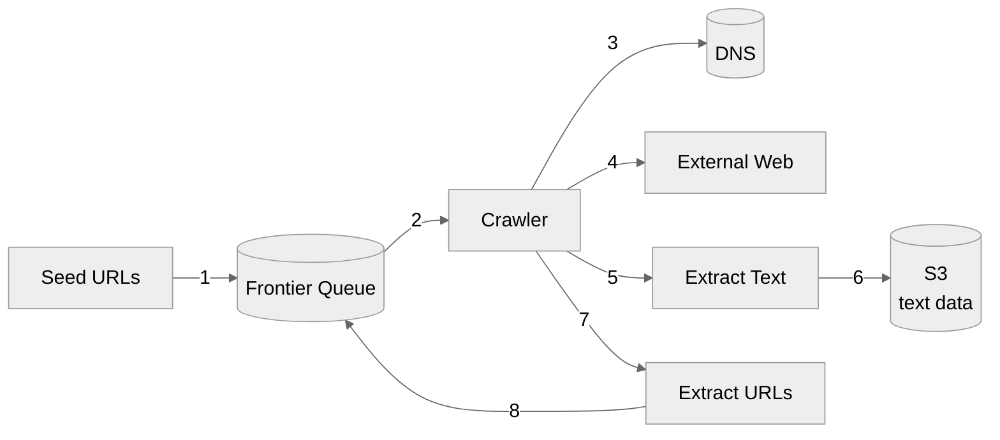
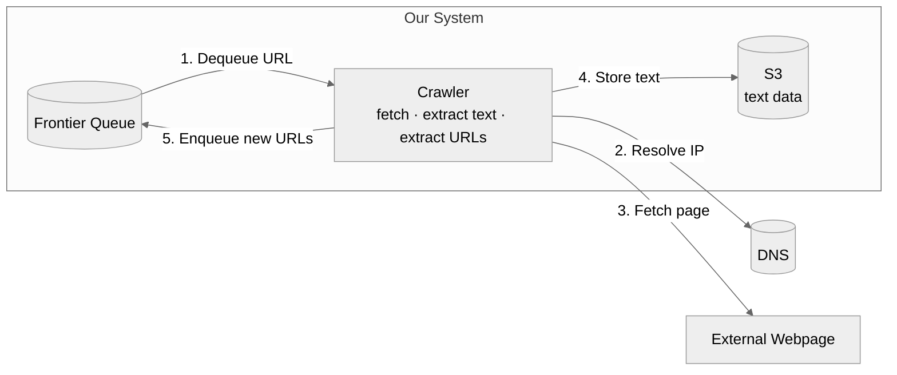
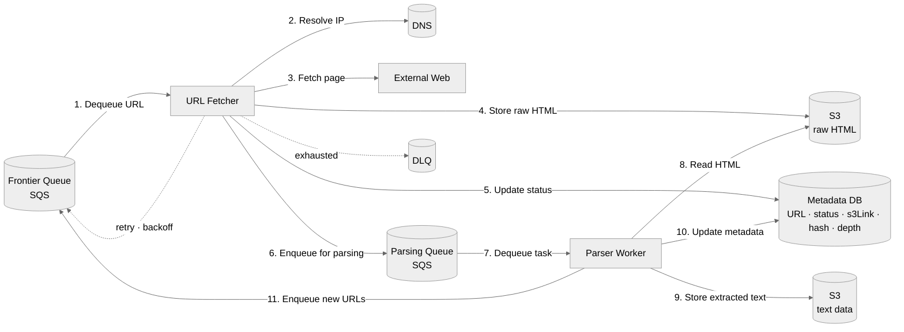
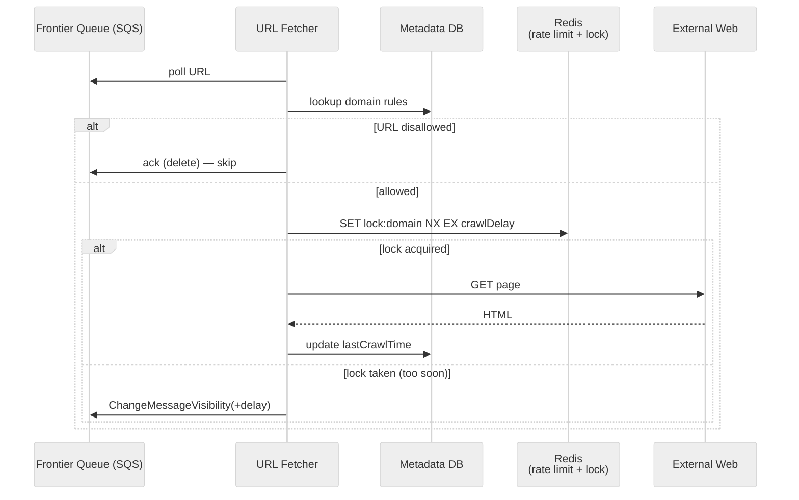
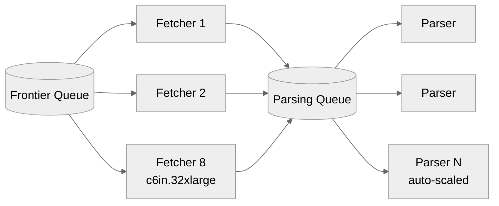
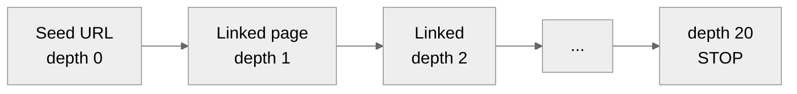
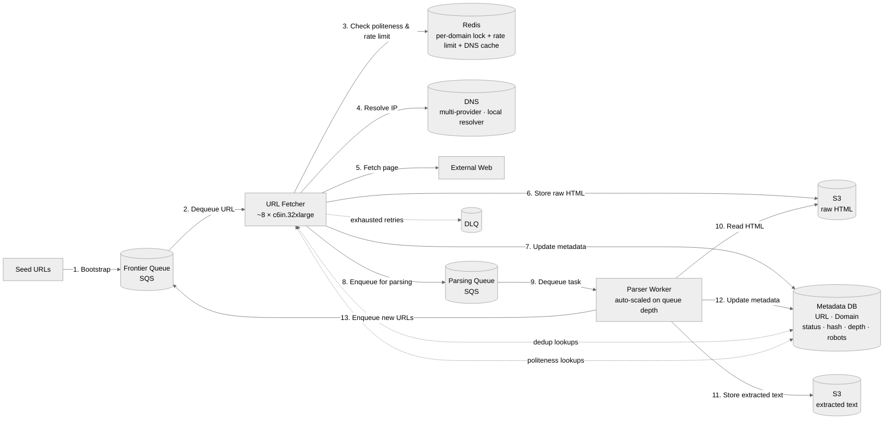

# Web Crawler — System Design

> Detailed system design for a large-scale **web crawler** (e.g., to collect text data from the web for training an LLM).
> Walks through the problem **step-by-step**, exactly like the Hello Interview breakdown:
> **Requirements → Set Up (interface + data flow) → High-Level Design → Deep Dives → Final Architecture.**

---

## Table of Contents
1. [Understanding the Problem](#1-understanding-the-problem)
   - [Functional Requirements](#11-functional-requirements)
   - [Non-Functional Requirements](#12-non-functional-requirements)
2. [The Set Up](#2-the-set-up)
   - [Planning the Approach](#21-planning-the-approach)
   - [System Interface](#22-system-interface)
   - [Data Flow](#23-data-flow)
3. [High-Level Design](#3-high-level-design)
4. [Deep Dives](#4-deep-dives)
   - [DD1: Fault Tolerance — Pipelined Stages, Retries, DLQ](#dd1-fault-tolerance--pipelined-stages-retries-dlq)
   - [DD2: Politeness — robots.txt + Rate Limiting](#dd2-politeness--robotstxt--rate-limiting)
   - [DD3: Scale to 10B Pages in 5 Days + Efficiency](#dd3-scale-to-10b-pages-in-5-days--efficiency)
   - [DD4: DNS at Scale](#dd4-dns-at-scale)
   - [DD5: Deduplication (URL + Content) and Crawler Traps](#dd5-deduplication-url--content-and-crawler-traps)
5. [Final Architecture](#5-final-architecture)
6. [What Is Expected at Each Level](#6-what-is-expected-at-each-level)
7. [Appendix — Patterns Touched](#appendix--patterns-touched)
8. [Appendix — Common Interviewer Follow-Ups](#appendix--common-interviewer-follow-ups)

---

## 1. Understanding the Problem

> **🕸️ What is a Web Crawler?**
> A program that automatically traverses the web by downloading pages and following links — used to index for search, collect data for research, or build training corpora for LLMs.
>
> For this design we'll build a crawler whose goal is to **extract text data from the web to train an LLM** (think GPT, Gemini, LLaMA-style data collection).

### 1.1 Functional Requirements

**Core (in scope):**

| # | Requirement |
|---|-------------|
| 1 | Crawl the web starting from a given set of **seed URLs**. |
| 2 | **Extract text data** from each page and store it for later processing. |

**Below the line (out of scope):**
- Actual processing of the text (e.g., training the LLM).
- Non-text content (images, video, audio).
- Dynamic JS-rendered content (would need headless browser).
- Authenticated / login-walled pages.

> ✅ **Tip:** Confirm seed URLs are *given* (almost always yes). If not, mention starting from popular search engines, news sites, social platforms, or web directories.

### 1.2 Non-Functional Requirements

> 📏 **Scale (clarify with interviewer):** ~**10B pages**, average **2 MB per page** (HTML + inline resources; raw HTML alone is closer to ~30 KB but plan for the worst case for bandwidth). Data must be available within **5 days** of starting the crawl.

**Core (in scope):**

| # | Requirement |
|---|-------------|
| 1 | **Fault tolerance** — handle failures gracefully, never lose progress. |
| 2 | **Politeness** — respect `robots.txt`, don't overload origin servers. |
| 3 | **Efficiency** — finish the crawl in under **5 days**. |
| 4 | **Scalability** — handle **10B pages**. |

**Below the line:**
- Security against malicious actors.
- Cost optimization.
- Compliance / legal / privacy.

> 💡 **Don't BOE-calc upfront.** Defer back-of-the-envelope math until a specific deep dive needs it (we'll do it in DD3).

---

## 2. The Set Up

### 2.1 Planning the Approach
This is **not a user-facing system** — there's no REST API to design. Instead, focus on the **abstract interface** (inputs/outputs) and the **data flow** that turns one into the other. That data flow is the scaffolding for the high-level design.

### 2.2 System Interface

| Direction | Value |
|---|---|
| **Input** | Seed URLs to start crawling from. |
| **Output** | Text data extracted from web pages (stored in blob storage like S3). |

### 2.3 Data Flow

The sequential steps from input to output:

1. Take a URL from the **frontier queue** and resolve its IP via **DNS**.
2. **Fetch HTML** from the external server using that IP.
3. **Extract text** from the HTML.
4. **Store text** in blob storage.
5. **Extract linked URLs** from the page and add them back to the frontier.
6. Repeat until the frontier is empty (or we've crawled enough).



> 💡 Start simple. We'll evolve this into a multi-stage pipeline in [DD1](#dd1-fault-tolerance--pipelined-stages-retries-dlq).

---

## 3. High-Level Design

A first cut that satisfies the functional requirements by literally implementing the data flow.

#### Components introduced
- **Frontier Queue** — backlog of URLs to crawl (Kafka / SQS / Redis — we'll decide later).
- **Crawler** — fetches page, extracts text, extracts links, pushes new URLs back to the frontier.
- **DNS** — resolves domain → IP.
- **Webpage** — external site (outside our system boundary).
- **S3 Text Data** — blob storage for the extracted text. Cheap, durable, infinitely scalable.



> ✅ This satisfies both functional requirements (crawl from seeds + store text). Now we layer on the non-functional requirements via deep dives.

---

## 4. Deep Dives

We address the non-functional requirements one at a time.

---

### DD1: Fault tolerance — pipelined stages, retries, DLQ

**Problem:** The Crawler is doing too much (DNS lookup, fetch, text extract, URL extract, store). If *any* step fails, **all** progress on that page is lost. **Fetching is the most failure-prone** step (server down, timeouts, oversized pages, TLS errors, etc.).

> 🔁 **Pattern: Pipelining for fault isolation.** Break the monolith into stages connected by queues so a failure in one stage doesn't blow away the work of the others. Each stage can also scale and be optimized independently.

#### Pipelined design

Split the Crawler into two stages connected by queues:

| Stage | Responsibility | Output |
|---|---|---|
| **URL Fetcher** | DNS lookup → fetch HTML → store **raw HTML** in S3. | Raw HTML in S3 + message on Parsing Queue. |
| **Parser Worker** | Read HTML from S3 → extract text → store text in S3 → extract URLs → push back to Frontier Queue. | Text in S3 + new URLs in Frontier. |

We also add a **Metadata DB** (DynamoDB or Postgres) — a `URL` table tracking each URL's status, S3 links, last-crawl time, content hash, depth.

> 🚫 **Anti-pattern alert:** Don't put the raw HTML *into the queue itself*. Queues aren't optimized for large payloads. Instead store HTML in S3 and put a tiny pointer (URL id + S3 link) on the queue.



#### Why two stages and not one?
- **Failure isolation:** A flaky webpage fetch doesn't block parsing for other pages.
- **Independent scaling:** Fetchers are I/O-bound (network); parsers are CPU-bound (parsing HTML). Scale each based on its own bottleneck.
- **Re-parseability:** If the ML team changes the text-extraction logic (e.g., now include image alt-text), we can **re-run the parser stage over the existing HTML in S3** — no need to re-crawl the entire web.

#### Retries on fetch failure

Many sites are flaky or temporarily down. We **must** retry, but with **exponential backoff** to avoid hammering a struggling host.

| Approach | Verdict |
|---|---|
| ❌ **Bad** — In-memory timer in the worker | Lost on crash; doesn't scale across pods. |
| ✅ **Good** — Kafka with manual exponential backoff | Works, but you build the retry/delay logic yourself. |
| ✅✅✅ **Great (chosen)** — **SQS with visibility timeouts + DLQ** | Native exponential backoff via `ChangeMessageVisibility`, native DLQ after N attempts, managed scaling. |

#### What if a worker crashes mid-message?

| Tech | Mechanism |
|---|---|
| **Kafka** | Messages stay in the log. Consumer commits offset only after successful fetch+store. Crash → next consumer picks up at the uncommitted offset. |
| **SQS** | Message is hidden by **visibility timeout** when read. Worker must explicitly delete it on success. Crash → timeout expires → message becomes visible again to another worker. |

> ✅ **Choice: SQS** — the visibility timeout + native DLQ + managed scale is just easier here. Kafka is a defensible alternative; pick what you've used.

#### Why we still need the Metadata DB

The queue message is just `{ urlId }`. The DB row tracks:
- `status` — `pending | fetched | parsed | failed`.
- `s3HtmlLink`, `s3TextLink` — pointers into S3.
- `lastCrawlTime` — for politeness (DD2).
- `contentHash` — for content dedup (DD5).
- `depth` — distance from a seed URL (DD5, crawler traps).

---

### DD2: Politeness — robots.txt + rate limiting

**Problem:** A naive crawler can hammer one origin and effectively DoS it. Two requirements:
1. **Respect `robots.txt`** — don't crawl `Disallow`'d paths; honor `Crawl-delay`.
2. **Rate-limit per domain** — industry standard ≈ **1 req/sec per domain** when no `Crawl-delay` is given.

#### What's `robots.txt`?
A file at `https://example.com/robots.txt` like:
```
User-agent: *
Disallow: /private/
Crawl-delay: 10
```
- `User-agent: *` → applies to all crawlers.
- `Disallow: /private/` → don't crawl anything under `/private/`.
- `Crawl-delay: 10` → wait 10s between requests to this domain. (Not part of the official RFC; Googlebot ignores it, but polite crawlers honor it.)

#### Storing robots.txt

Add a **Domain table** to the Metadata DB:

| Column | Purpose |
|---|---|
| `domain` (PK) | e.g., `example.com` |
| `robots` | parsed rules (allow/disallow paths, crawl-delay) |
| `lastCrawlTime` | timestamp of most recent fetch to this domain |

On first encountering a domain → fetch + parse `robots.txt` → save to the Domain table. (For simplicity, treat as one-time download; in production, refresh periodically.)

#### Politeness flow



#### Two layers of "wait"

1. **Per-domain lock with TTL = crawl delay (Redis):** `SET lock:example.com 1 NX EX 10`.
   - Atomic: only one fetcher gets the lock; others see it taken and **defer** the message.
   - Auto-expires after the delay → next fetcher can proceed.
2. **Sliding-window rate limiter (Redis):** Backstop for domains *without* `Crawl-delay` — enforce 1 req/sec/domain across all fetchers. **Add jitter** to avoid the thundering-herd problem (every fetcher retrying at the exact same tick when the window resets).

> 💡 **Why two mechanisms?** Some sites declare a `Crawl-delay` (e.g., 10s); others don't. The Redis lock enforces site-declared delays; the sliding window enforces our default polite floor.

#### Deferring instead of busy-waiting

When a fetcher pulls a URL but the per-domain lock is held, it **does not** sleep on the fetcher pod. Instead it calls SQS's `ChangeMessageVisibility` to push the message back into the future:

```python
sqs.change_message_visibility(
    QueueUrl=...,
    ReceiptHandle=msg.receipt,
    VisibilityTimeout=remaining_crawl_delay_seconds,
)
```

The fetcher pod immediately moves on to a different URL (different domain). This keeps fetchers maxed out instead of idling.

> ⚠️ **Gotcha:** SQS's `DelaySeconds` only applies to *newly sent* messages. For in-flight messages (our case) you must use `ChangeMessageVisibility`. Max defer is 12 hours per call.

---

### DD3: Scale to 10B pages in 5 days + efficiency

**Problem:** One machine can't crawl the internet in 5 days. How many do we need, and how do we keep them busy?

> 💡 **Why we delayed the BOE math:** Doing it now lets us reason about the *post-pipeline* architecture (fetchers vs parsers separately) instead of an undifferentiated "crawler".

#### Back-of-the-envelope — fetcher count

Fetchers are I/O-bound. Bandwidth, not CPU, is the cap.

| Quantity | Value |
|---|---|
| Pages | 10B |
| Avg page size | 2 MB |
| NIC on a network-optimized AWS instance (e.g., `c6in.32xlarge`) | 200 Gbps |
| Theoretical pages/sec on one instance | 200 Gbps ÷ 8 ÷ 2 MB ≈ **12,500 pages/sec** |
| Realistic utilization (latency, retries, polite waits, DNS) | ~30% → **3,750 pages/sec** |
| Time on one machine | 10B ÷ 3,750 ≈ 2.67M sec ≈ **30.9 days** |
| Machines needed for 5 days | 30.9 ÷ 5 ≈ **~7–8 machines** |

> ✅ **8 beefy network-optimized instances** ≈ 5 days. Comfortably under requirement.

#### "But we're rate-limited to 1 req/sec/domain — how can we hit 3,750 pages/sec?"

**The aggregate is across millions of domains in parallel.** Each fetcher holds thousands of concurrent connections to *different* sites. Any single domain still sees ≤ 1 req/sec; the total throughput across all domains is huge. This is a frequently-asked clarifying question.

#### Parser workers — auto-scale dynamically

Parsers are simpler (download HTML from S3 → parse → write text to S3). Don't bother sizing them analytically — **auto-scale based on Parsing Queue depth**:
- Lambda triggered by SQS, **or**
- ECS / Fargate / Kubernetes HPA on queue length.

If the Parsing Queue grows → spin up more parser workers. If it drains → scale down.

#### Deployment topology



---

### DD4: DNS at scale

**Problem:** At thousands of req/sec across millions of unique domains, DNS becomes a real bottleneck. The classic Mercator crawler paper found DNS could consume up to **70%** of a thread's time before they built a custom resolver.

#### Mitigations

| Technique | What it does |
|---|---|
| **DNS caching** (per-fetcher + shared Redis) | All URLs to the same domain reuse one resolution. Cache TTL ≈ DNS TTL. |
| **Multiple DNS providers (round-robin)** | Avoid single-provider rate limits; spread load (e.g., Route 53 + Cloudflare + Google DNS). |
| **Local recursive resolver** | Run your own (e.g., Unbound) — eliminates round-trips through 3rd-party. |
| **Pre-resolve in batch** | When the parser extracts a batch of new URLs, resolve their domains async before they're crawled. |

> 💡 **Interview soundbite:** "Most candidates skip DNS. Calling it out — and especially the multi-provider trick — signals real-world experience."

---

### DD5: Deduplication (URL + content) and crawler traps

**Problem:** Crawling the same content twice burns bandwidth, money, and time. Two distinct dedup levels are needed, plus a guard against pathological infinite-link sites.

#### Layer 1: URL-level dedup

Before adding a URL to the Frontier Queue:
```
SELECT 1 FROM url WHERE url = ?
-- if exists, skip
```
A unique index on `url` keeps the lookup O(log n). Cheap and catches the obvious case.

#### Layer 2: Content-level dedup

URL dedup misses two huge cases:
- `http://example.com` and `http://www.example.com` serve identical content.
- Totally different domains often mirror the same content (depressing fact about the internet).

After fetching, hash the content (e.g., SHA-256 over normalized HTML) and compare to seen hashes:

| Approach | Verdict |
|---|---|
| ✅✅ **Great (chosen)** — Hash column on URL table, GSI/index on `hash` | Simple, exact, modern indexes scale fine. |
| ✅ **Bloom filter** | Memory-efficient, probabilistic; cool but **overkill** here. Risk of false positives (skipping real new content). |

```
1. Fetch HTML.
2. hash = sha256(normalize(html))
3. SELECT 1 FROM url WHERE hash = ?
4. If hit → skip parse + storage; just record the URL pointing at existing content.
5. If miss → save HTML to S3, parse, store text, write hash.
```

> 💡 The bloom filter answer impresses some, but for a single one-time crawl the indexed-hash approach is simpler and exact.

#### Crawler traps

A page that links to itself (or to deeper variants of itself) infinitely — calendar pages with `?date=…`, faceted search with infinite filter combos, session-id'd URLs.

**Solution: max depth.** Add `depth` to the URL table; seed URLs are depth 0; each followed link is `parent.depth + 1`. If `depth > 15–20`, **don't enqueue**.

> ⚠️ **Depth = link hops from a seed**, NOT URL path segments. Big distinction interviewers will probe.



---

## 5. Final Architecture

Pulling everything together:



### Summary of choices

| Concern | Choice | Why |
|---|---|---|
| Frontier + Parsing queue | **SQS** | Native visibility timeouts, exponential backoff, DLQ, fully managed. |
| Blob storage | **S3** | Cheap, durable, infinite scale; great for HTML + text. |
| Metadata | **DynamoDB or Postgres** | Index on `url` and `hash`; small rows, high RPS. |
| Politeness | **Redis lock + sliding-window rate limiter + jitter** | Atomic, fast, prevents thundering herd. |
| Retries | **SQS visibility timeout + DLQ** | Built-in; no custom retry code. |
| Fault isolation | **Pipelined stages (Fetch → Parse)** | Stage failures don't lose other progress; enables re-parsing. |
| DNS | **Cache + multi-provider + local resolver** | Avoid 70%-time DNS bottleneck. |
| Dedup | **URL index + content hash index** | Simple, exact, scales. |
| Trap defense | **Max depth (15–20)** | Cheap, effective. |

---

## 6. What Is Expected at Each Level

### Mid-level (E4)
- ~80% breadth, 20% depth.
- Implements the simple high-level design that crawls the web from seeds.
- Knows the basics of `robots.txt` and politeness.
- Has *some* idea of scaling; deep knowledge of queueing/rate-limit internals not required.

### Senior (E5)
- ~60% breadth, 40% depth.
- Drives the pipeline split (Fetcher / Parser) for fault tolerance.
- Articulates politeness with both `robots.txt` AND rate limiting; explains the Redis lock + jitter.
- Sizes fetcher count with a BOE; auto-scales parsers from queue depth.
- Picks SQS vs Kafka with justification.

### Staff+ (E6+)
- ~40% breadth, 60% depth.
- Drives 3+ deep dives end-to-end: pipelining + retry semantics, politeness with deferred visibility, DNS (multi-provider), content dedup with hashing, crawler-trap defense.
- Brings real-world judgment (e.g., "DNS is often 70% of thread time" / "use multiple DNS providers").
- Discusses extensions: dynamic content (headless browser), HEAD-request size guard, URL Scheduler for continual crawls, priority queues.
- Leaves the interviewer with a new perspective.

---

## Appendix — Patterns Touched

| Pattern | Used For |
|---|---|
| **Pipelining for fault isolation** | Splitting Crawler into Fetcher + Parser stages. |
| **Queue + DLQ + visibility timeout** | Retries with exponential backoff (SQS). |
| **Distributed lock with TTL (Redis)** | Per-domain crawl delay enforcement. |
| **Sliding-window rate limiting + jitter** | Polite global rate cap; avoid thundering herd. |
| **Defer-don't-block** | `ChangeMessageVisibility` instead of sleeping on the worker. |
| **External blob storage for large payloads** | Raw HTML in S3, pointer in queue. |
| **Dedup via index / hash** | URL-level + content-level dedup. |
| **Probabilistic data structures (alternative)** | Bloom filter for content dedup. |
| **Caching at multiple layers** | DNS cache (per-pod + shared Redis). |
| **Auto-scaling on queue depth** | Parser workers via Lambda / ECS / HPA. |
| **Max-depth defense** | Crawler-trap mitigation. |

---

## Appendix — Common Interviewer Follow-Ups

Have a 1-minute answer ready for each.

### Architecture & Pipelining
1. **Why split Fetcher and Parser?** → Fault isolation, independent scaling (I/O-bound vs CPU-bound), and re-parseability over stored HTML if extraction logic changes.
2. **Why store raw HTML in S3 instead of just the text?** → Lets us re-run text extraction later without re-crawling. Raw HTML is the immutable source of truth.
3. **Why not put HTML directly on the queue?** → Queues aren't designed for large payloads; it's slow and expensive. Put a pointer (S3 key) instead.

### Queues & Retries
4. **SQS or Kafka — which and why?** → SQS for managed scale + native visibility timeouts + native DLQ + simpler ops. Kafka is fine if you need replay or higher throughput per partition; pick what you've used.
5. **What's a DLQ and when does a message go there?** → Dead-letter queue. After N failed redeliveries, SQS moves the message there for manual inspection. Prevents poison messages from blocking the queue forever.
6. **What if a fetcher crashes mid-fetch?** → Visibility timeout expires → message becomes visible → another fetcher picks it up. The message is only deleted after success.
7. **How do you implement exponential backoff in SQS?** → On retry, call `ChangeMessageVisibility` with `2^attempt * base` seconds (capped). Track attempt count in message attributes or via SQS's `ApproximateReceiveCount`.

### Politeness
8. **What is robots.txt?** → Per-domain file declaring which paths are off-limits and (optionally) `Crawl-delay`. We fetch + parse + cache it per domain.
9. **What if robots.txt changes?** → In production, refresh periodically (e.g., daily). For a one-time crawl it's fine to fetch once.
10. **You have 8 fetchers — how do you enforce 1 req/sec/domain across all of them?** → Centralized Redis: `SET lock:<domain> 1 NX EX 1`. Atomic; only one fetcher wins per second.
11. **Why jitter?** → Without it, when the rate-limit window resets, all waiting fetchers retry simultaneously → only one succeeds → others retry → loop. Jitter desynchronizes them.
12. **Why defer instead of sleep?** → Sleeping wastes a fetcher worker for seconds. Deferring (via `ChangeMessageVisibility`) frees the worker to crawl a *different* domain immediately.

### Scale & Efficiency
13. **How many machines do you need and why?** → ~8 network-optimized AWS instances. Derived from 10B pages × 2 MB ÷ (200 Gbps × 30% utilization) ÷ 5 days.
14. **You said 1 req/sec/domain — how can you hit thousands of pages/sec?** → Aggregate across millions of domains in parallel. Each fetcher holds thousands of concurrent connections to *different* sites.
15. **How do you size parser workers?** → Don't size analytically — auto-scale based on Parsing Queue depth (Lambda / ECS / HPA).
16. **Why are fetchers sized differently than parsers?** → Fetchers are I/O-bound (network is the bottleneck → big NIC). Parsers are CPU-bound (HTML parsing) → many small workers.

### DNS
17. **Why is DNS a problem at this scale?** → Each new domain needs multiple round-trips through the DNS hierarchy. Mercator paper showed DNS could consume 70% of thread time.
18. **How do you mitigate?** → Per-fetcher cache + shared Redis cache + multiple DNS providers in round-robin + a local recursive resolver (e.g., Unbound).

### Deduplication
19. **What's the difference between URL dedup and content dedup?** → URL dedup catches re-discoveries of the same link. Content dedup catches different URLs serving identical bytes (e.g., `example.com` vs `www.example.com`, mirrored sites).
20. **How do you compute and look up content hash?** → SHA-256 over normalized HTML; index the `hash` column in the Metadata DB; lookup is O(log n).
21. **Bloom filter — pros and cons?** → Memory-efficient and fast, but false positives mean you'd skip real new content. For a one-time crawl, an indexed hash column is simpler and exact.
22. **What's a crawler trap and how do you defend?** → Pages that link to themselves infinitely (calendars, faceted search, session ids). Defense: max depth (15–20 hops from a seed).

### Storage
23. **Why S3?** → Cheap, durable (11 nines), infinitely scalable, no provisioning. Ideal for write-once-read-many blobs.
24. **What goes in the Metadata DB vs S3?** → Small structured records (status, pointers, hash, depth) → DB. Large opaque blobs (HTML, text) → S3.
25. **DynamoDB or Postgres for metadata?** → DynamoDB if write-heavy + need high RPS at low ops cost. Postgres if you want richer queries and joins. For 10B rows, DynamoDB scales more naturally.

### Failure & Edge Cases
26. **What if a webpage is huge (e.g., 1 GB)?** → Send an HTTP `HEAD` first; check `Content-Length`; skip if over a threshold (e.g., 10 MB).
27. **What if a site uses heavy JavaScript (React/Angular)?** → Need a headless browser (Puppeteer, Playwright) — orders of magnitude more expensive. Out of scope here, but call it out.
28. **How do you handle dynamic / login-walled content?** → Out of scope for our design. Would need session/cookie management and likely allowlists.
29. **What if the same content has 100 different URLs (mirrors)?** → Content-hash dedup catches this. We store the content once and record all URL aliases.

### Beyond the Core Design
30. **How would you support continual / scheduled re-crawls?** → Add a **URL Scheduler** service. Parser writes new URLs to the Metadata DB (not directly to the queue). Scheduler picks URLs based on last-crawl time, popularity, change frequency.
31. **How would you implement priority crawling (popular domains first)?** → Multiple SQS queues at different priorities; fetchers poll high-priority first. Kafka equivalent: separate topics per priority tier.
32. **How would you monitor system health?** → Datadog / Prometheus on: fetch success rate, fetch latency p99, parser queue depth, DLQ size, dedup hit rate, DNS error rate, S3 PUT latency, per-domain rate-limit hit rate.
