# Uber — System Design

> Detailed system design for a real-time ride-sharing platform (fare estimation, ride requests, driver matching, accept/decline + navigation).
> Walks through the problem **step-by-step**, exactly like the Hello Interview breakdown:
> **Requirements → Set Up (entities + API) → High-Level Design (one functional req at a time) → Deep Dives (one problem at a time) → Final Architecture.**

> **Difficulty**: Hard | **Pattern**: Real-Time Updates + Multi-Step Processes | **Asked at**: Uber, Lyft, DoorDash, Meta, Google, Amazon

---

## Table of Contents
1. [Understanding the Problem](#1-understanding-the-problem)
   - [Functional Requirements](#11-functional-requirements)
   - [Non-Functional Requirements](#12-non-functional-requirements)
   - [Back-of-the-Envelope Estimation](#13-back-of-the-envelope-estimation)
2. [The Set Up](#2-the-set-up)
   - [Planning the Approach](#21-planning-the-approach)
   - [Core Entities](#22-core-entities)
   - [API / System Interface](#23-api--system-interface)
3. [High-Level Design](#3-high-level-design)
   - [1) Fare Estimation](#31-riders-can-input-start--destination-and-get-a-fare-estimate)
   - [2) Request a Ride](#32-riders-can-request-a-ride-based-on-the-estimated-fare)
   - [3) Match a Nearby Driver](#33-riders-are-matched-with-a-nearby-available-driver)
   - [4) Driver Accept / Decline + Navigate](#34-drivers-can-acceptdecline-a-request-and-navigate-to-pickupdrop-off)
4. [Deep Dives](#4-deep-dives)
   - [DD1: High-Volume Location Updates + Proximity Search](#dd1-high-volume-location-updates--proximity-search)
   - [DD2: Reducing Location-Update Overload (Adaptive Pings)](#dd2-reducing-location-update-overload-adaptive-pings)
   - [DD3: Preventing Double-Booking of a Driver](#dd3-preventing-double-booking-of-a-driver)
   - [DD4: No Dropped Ride Requests Under Peak Load](#dd4-no-dropped-ride-requests-under-peak-load)
   - [DD5: Driver Doesn't Respond → Fallback](#dd5-driver-doesnt-respond--fallback)
   - [DD6: Scaling Globally — Geo-Sharding](#dd6-scaling-globally--geo-sharding)
5. [Final Architecture](#5-final-architecture)
6. [What Is Expected at Each Level](#6-what-is-expected-at-each-level)
7. [Appendix — Common Interviewer Follow-Ups](#7-appendix--common-interviewer-follow-ups)

---

## 1. Understanding the Problem

> **🚗 What is Uber?**
> Uber is a ride-sharing platform that connects passengers with nearby drivers in personal vehicles. Riders open the app, request a ride from A to B, and within ~minute are matched with a driver who is then guided to the pickup and drop-off points. The hard parts are **real-time driver location tracking at city scale**, **fast geospatial matching**, and **strong consistency** so that a driver is never offered to two riders at once.

### 1.1 Functional Requirements

**Core (in scope, top 4):**

| # | Requirement |
|---|-------------|
| 1 | Riders can **input pickup + destination** and **get a fare estimate** (price + ETA). |
| 2 | Riders can **request a ride** based on the estimated fare. |
| 3 | On request, the rider is **matched with a nearby available driver**. |
| 4 | Drivers can **accept / decline** a request and **navigate to pickup → drop-off**. |

> A "ride" is just the lifecycle from accepted request → drop-off. The interesting design lives in *matching* and the *real-time location plumbing* underneath it.

**Below the line (out of scope):**
- Post-trip ratings (rider ↔ driver).
- Scheduled / future rides.
- Ride categories (X, XL, Comfort, Pool/UberPool).
- Payments, promo codes, fare splitting.
- Onboarding, KYC, driver background checks.
- In-app messaging between rider and driver (just another real-time channel — same plumbing).

### 1.2 Non-Functional Requirements

**Core (in scope):**

1. **Low-latency matching** — a ride request gets a driver (or a "no driver found" response) in **< 1 minute**.
2. **Strong consistency on driver assignment** — a driver is **never** offered to two riders at the same time, and a ride is never accepted by two drivers.
3. **High throughput** at peak — handle bursts like **100K ride requests / minute from the same metro** (NYE, concerts, airport surges) without dropping requests.
4. **Accurate, fresh driver locations** — used by matching; freshness target ~5s without melting the DB.
5. **Geographic scale** — globally distributed; latency dominated by intra-region traffic, not cross-region.

Tabular form for quick reference:

| # | Requirement | Target |
|---|-------------|--------|
| 1 | **Low-latency matching** | match (or fail) within **60s** |
| 2 | **Strong consistency** in driver assignment | exactly one rider per driver, exactly one driver per ride |
| 3 | **High throughput** under surges | **100K req/min** per metro w/o drops |
| 4 | **Fresh driver locations** for matching | ≤ 5s staleness |
| 5 | **Geo-scale** | regional sharding, low cross-region calls |

**Below the line:**
- GDPR / data residency.
- Fraud / collusion detection.
- Full PCI compliance for payments.
- Detailed CI/CD and ops tooling.

> ✅ **Tip:** Lock the **top 4** functional requirements and **top 5** non-functional, then call everything else "below the line" and confirm with the interviewer. **Strong consistency** (#2) is the most interesting NFR — flag it early.

### 1.3 Back-of-the-Envelope Estimation

| Metric | Calculation | Result |
|---|---|---|
| Monthly riders | Given | **~150M** |
| Daily active drivers | Given | **~5M** |
| Drivers online at peak | ~2× DAU | **~10M concurrent** |
| Location ping interval (naive) | every 5s | — |
| Location updates / sec (naive) | 10M / 5 | **~2M writes/s** |
| Ride requests / day | Industry estimate | **~25M/day** |
| Avg ride requests / sec | 25M / 86400 | **~290/s** |
| Peak ride requests / sec | ~5× avg | **~1.5K/s** |
| Peak ride requests / min in one metro (NYE) | Given | **~100K/min** |
| Proximity searches / sec | ≈ ride requests + driver dispatch retries | **~3K/s peak** |
| Avg ride duration | Industry estimate | **~15 min** |
| In-flight rides at peak | 290/s × 900s | **~260K** |
| Driver location record size | ~50B (id, lat, lon, ts) | — |
| Hot location footprint in Redis | 10M × 50B + overhead | **~2–4 GB** |

> 💡 **Headline insight:** the **~2M location writes/sec** number is what shapes the whole design. It tells you immediately that you can't dump location updates straight into a regular DB — you need an **in-memory geospatial store** (Redis GEO) on the hot path and only checkpoint when needed. That single observation drives DD1.

---

## 2. The Set Up

### 2.1 Planning the Approach
Design **sequentially through the functional requirements first** (single-region, naive). Get fare → request → match → accept/decline working end-to-end as one happy path. Then layer in scale, consistency, and failure handling in the deep dives.

> 🔁 **Patterns at play.**
> 1. **Real-time updates** — pushing ride offers to drivers, pushing match results to riders, streaming driver locations.
> 2. **Multi-step process** — a ride is a long-lived workflow (request → offer-driver-1 → wait 10s → maybe offer-driver-2 → accepted → en-route → completed). This is the **durable execution** territory (Temporal, Step Functions).

### 2.2 Core Entities

We keep this list minimal — just the **nouns we need to reason about**. Supporting things (status enums, payment refs, etc.) are implementation details we'll add as we go.

| # | Entity | Description |
|---|--------|-------------|
| 1 | **Rider** | The passenger. Identified by `riderId`. |
| 2 | **Driver** | The provider. Identified by `driverId`. Has a vehicle and an availability state. |
| 3 | **Fare** | An *estimate* created when a rider asks "how much from A to B?". Carries price + ETA + the locked-in route info. Has its own ID so we can reference it from a ride. |
| 4 | **Ride** | The actual job from request → drop-off. Links one rider, one driver, one fare. Carries `status` (REQUESTED → MATCHING → ACCEPTED → EN_ROUTE → IN_PROGRESS → COMPLETED \| CANCELLED). |
| 5 | **Location** | The current `(lat, lon, ts)` of a driver. *Not* stored as a normal table row — it lives in an in-memory geospatial store (see [DD1](#dd1-high-volume-location-updates--proximity-search)). |

> 💡 **Why separate `Fare` from `Ride`?** Because the rider sees the price *before* committing. The fare is a quote the server stands behind for ~few minutes; the ride is the irreversible commitment. Keeping them separate also lets us garbage-collect un-accepted quotes without touching the ride table.

> 💡 **Why call `Location` an entity but not a SQL table?** It's conceptually an entity (we reason about it), but its access pattern — millions of overwrites per second, queried by proximity — is so different from `Rider`/`Driver`/`Ride` that it lives in Redis. Treating it as a first-class entity reminds us to design its lifecycle explicitly (TTL, cleanup of offline drivers, etc.).

#### ER diagram

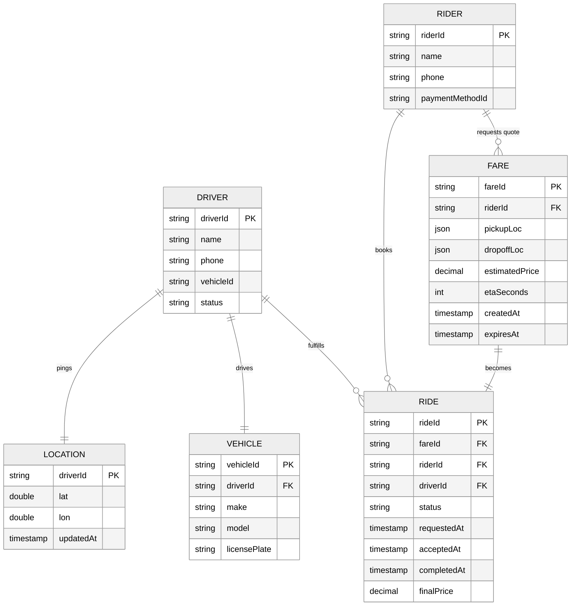

#### Table relationships (how the FKs wire everything together)

| From (child / many side) | FK column | Points to (parent / one side) | Cardinality | Plain English |
|---|---|---|---|---|
| `fare` | `rider_id` | `rider.rider_id` | N : 1 | A rider gets many quotes over time; each quote belongs to one rider. |
| `ride` | `fare_id` | `fare.fare_id` | 1 : 1 | A confirmed ride locks in one fare quote. |
| `ride` | `rider_id` | `rider.rider_id` | N : 1 | A rider takes many rides; each ride has one rider. |
| `ride` | `driver_id` | `driver.driver_id` | N : 1 | A driver fulfills many rides; each ride has at most one driver. |
| `vehicle` | `driver_id` | `driver.driver_id` | 1 : 1 (simplified) | Each driver has a current vehicle. |
| `location` | `driver_id` | `driver.driver_id` | 1 : 1 | Each driver has exactly one current location (most-recent overwrite). Lives in Redis, not SQL. |

> 🔑 **Rule of thumb:** the foreign key always lives on the **"many" side** of a 1-to-many relationship. To go from the *one* to the *many*, filter that FK (`SELECT * FROM ride WHERE driver_id = ?`). To go from the *many* to the *one*, do a point lookup on the parent's PK (`SELECT * FROM driver WHERE driver_id = ?`).

**Walking the graph (typical traversal paths):**

```
                ┌────────┐                  ┌────────┐
                │ riders │                  │drivers │
                └───┬────┘                  └────┬───┘
                    │                            │
                    │1:N                         │1:N
                    ▼                            ▼
                ┌────────┐                  ┌──────────┐
                │ fares  │                  │ vehicles │
                └───┬────┘                  └──────────┘
                    │                            │
                    │ 1:1                        │ 1:1
                    ▼                            ▼
                ┌────────┐                  ┌──────────┐
                │ rides  │◀─────────────────│location  │  (Redis GEO)
                └────────┘    matched by    └──────────┘
                    ▲             matcher
                    │
                    └── status: REQUESTED → MATCHING → ACCEPTED → …
```

**Four queries this enables:**

| Question | Traversal |
|---|---|
| "What's the rider's latest quote?" | `fare WHERE rider_id = ?` ORDER BY `created_at` DESC LIMIT 1. |
| "Who are the 10 nearest available drivers to (lat, lon)?" | `GEOSEARCH driver:geo FROMLONLAT lon lat BYRADIUS 5 km` in Redis (NOT a SQL scan). |
| "What's the current ride for this rider?" | `ride WHERE rider_id = ? AND status IN (REQUESTED, MATCHING, ACCEPTED, EN_ROUTE, IN_PROGRESS)`. |
| "Which rides did this driver complete today?" | `ride WHERE driver_id = ? AND status = COMPLETED AND completed_at >= today`. |

### 2.3 API / System Interface

We use **HTTPS + JSON** for the request/response APIs (fare, request ride, accept) and **WebSocket / push notifications** for the asynchronous parts (driver gets ride offer, rider gets matched).

> 💡 **Why not pure REST for everything?** Because the *core experience* is asynchronous: the rider asks for a ride and *waits* while the system goes hunting for a driver. We need server-initiated pushes to:
> - Tell the rider "matched with John, ETA 3 min".
> - Tell the driver "new ride offer — you have 10 seconds to accept".
> Polling would be too laggy and would melt the API gateway at peak.

#### Quick auth aside

The driver and rider IDs **always come from the session / JWT**, never from the request body. We will see candidates write `POST /rides { riderId, fare }` and lose a level — anyone can spoof another rider's ID.

```
Authorization: Bearer <JWT>
  → server extracts riderId / driverId from the verified token.
```

#### Endpoints (rider side)

```http
POST /fare
Body: { pickupLocation: {lat,lon}, destination: {lat,lon} }
→ 200 OK { fareId, estimatedPrice, etaSeconds, expiresAt }
```

- Creates a `Fare` row, quotes a price, and returns the ID. Server-generated price; client never supplies one.
- `expiresAt` lets us refuse a stale quote later ("price has changed, please re-quote").

```http
POST /rides
Body: { fareId }
→ 200 OK { rideId, status: "MATCHING" }
```

- Creates a `Ride` linked to the `Fare`. Returns immediately with `status: MATCHING`.
- The actual driver match happens **asynchronously**; the rider gets it pushed over a WS / SSE channel.
- We trust the server-stored fare; the client only forwards an ID.

```http
GET /rides/{rideId}
→ 200 OK { rideId, status, driver?, vehicle?, pickup, dropoff, ... }
```

- Status polling fallback (if WS dropped). Same data as the push payload.

#### Endpoints (driver side)

```http
POST /drivers/location
Body: { lat, lon }
→ 200 OK
```

- Called periodically by the driver client. **Driver ID from JWT**, never from body.
- This is the very hot endpoint — see [DD1](#dd1-high-volume-location-updates--proximity-search) and [DD2](#dd2-reducing-location-update-overload-adaptive-pings).

```http
PATCH /rides/{rideId}
Body: { action: "ACCEPT" | "DECLINE" }
→ 200 OK { rideId, status, pickup, dropoff, rider }
```

- The driver responds to a ride offer within the 10s window.
- On `ACCEPT`, the ride goes to `ACCEPTED` and the response carries pickup + rider details so the driver client can render the navigation screen.
- On `DECLINE` (or timeout), the matcher moves to the next candidate driver — see [DD5](#dd5-driver-doesnt-respond--fallback).

#### Push channels (server → client)

```
// rider WS / SSE channel
<- rideUpdate { rideId, status: "ACCEPTED", driver: {...}, vehicle: {...}, eta: 180 }

// driver mobile push (APNs / FCM) + WS
<- rideOffer { rideId, pickup, dropoff, estimatedFare, expiresInSeconds: 10 }
```

> 💡 **Why APNs/FCM for the driver offer, not just WS?** Because the driver's phone may be sleeping / app backgrounded. APNs/FCM wake the device. The WS push is the same content sent in parallel for foreground apps so the in-app UI updates instantly.

---

## 3. High-Level Design

We satisfy the functional requirements one at a time. Start with a **single region, no caching, no sharding** — clearly not production — then evolve in the deep dives.

---

### 3.1 Riders can input start + destination and get a fare estimate

#### Components introduced
- **Rider Client** — phone app (iOS/Android).
- **API Gateway** — auth, rate-limit, route to backend services.
- **Ride Service** — owns the `Fare` and `Ride` lifecycle.
- **Third-Party Mapping API** — Google Maps / Mapbox; gives us route distance + ETA.
- **Pricing Engine** — applies surge multiplier, vehicle-type pricing, taxes (abstracted here).
- **Database (Postgres)** — durable home of `Rider`, `Driver`, `Fare`, `Ride`.

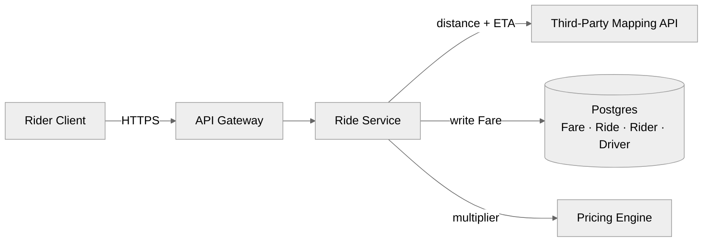

#### Step-by-step flow (rider taps "see fare")

1. **Rider** picks pickup + destination → client sends `POST /fare { pickup, destination }`.
2. **API Gateway** authenticates the JWT, applies a per-rider rate limit, forwards to **Ride Service**.
3. **Ride Service**:
   - Calls **Mapping API** with `(pickup, destination)` → gets `distance_m`, `eta_seconds`, route polyline.
   - Calls **Pricing Engine** with `(distance, eta, region, time-of-day, current surge factor)` → gets `estimatedPrice`.
   - `PUT Fare { fareId, riderId, pickup, dropoff, estimatedPrice, etaSeconds, expiresAt = now + 5min }` in Postgres.
4. Returns `{ fareId, estimatedPrice, etaSeconds, expiresAt }` to the client.

#### Flow diagram

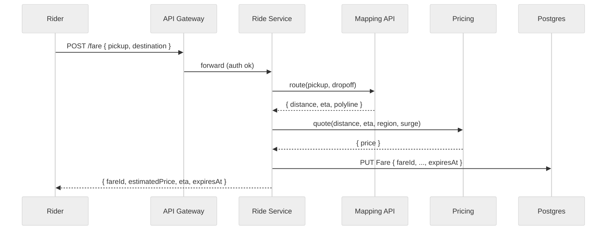

#### Sample `Fare` rows

| fareId | riderId | pickup (lat,lon) | dropoff (lat,lon) | estimatedPrice | etaSeconds | createdAt | expiresAt |
|---|---|---|---|---|---|---|---|
| `f_1001` | `r_42` | `(37.7749, -122.4194)` | `(37.7849, -122.4094)` | `$12.40` | `420` | `1716700000` | `1716700300` |
| `f_1002` | `r_42` | `(37.7749, -122.4194)` | `(37.6213, -122.3790)` *(SFO)* | `$48.75` | `1620` | `1716700060` | `1716700360` |
| `f_1003` | `r_77` | `(40.7128, -74.0060)` | `(40.7580, -73.9855)` | `$18.20` | `780` | `1716700100` | `1716700400` |

> 💡 **Why does the fare expire?** Two reasons. First, the **surge multiplier** can change in 5 minutes (rain starts, concert lets out). Second, locking in a quote forever would let riders abuse it by quoting at off-peak and requesting at peak. 5 minutes is the typical window.

> 💡 **Why Postgres, not Redis, for `Fare`?** A fare is durable business data — we want it logged for fraud, accounting, and audits. Postgres also makes the `Ride` join trivial. The location data is in Redis precisely because *that* doesn't need to be durable — see [DD1](#dd1-high-volume-location-updates--proximity-search).

---

### 3.2 Riders can request a ride based on the estimated fare

Naive version: **assume a driver is always available, and we trigger matching synchronously inside the API call.** We'll demolish the synchronous assumption in [3.3](#33-riders-are-matched-with-a-nearby-available-driver).

#### What's added
- A new `Ride` row referencing the chosen `Fare`.
- A *trigger* into the matching workflow (still abstracted at this step).

#### Step-by-step flow (rider taps "confirm ride")

1. Rider taps **Confirm** → client sends `POST /rides { fareId }`.
2. API Gateway → Ride Service.
3. **Ride Service**:
   - `SELECT Fare WHERE fareId = ? AND riderId = JWT.riderId AND expiresAt > now()`.
   - If the fare is expired or doesn't belong to this rider → 400, re-quote required.
   - Idempotency check: is there already a ride for this `fareId`? (Prevents double-booking on retry.) If yes, return the existing `rideId`.
   - `INSERT Ride { rideId, fareId, riderId, status: 'MATCHING', requestedAt: now() }`.
4. Trigger matching workflow (covered in [3.3](#33-riders-are-matched-with-a-nearby-available-driver)) — but importantly, the API returns *immediately* with `status: MATCHING`. The rider then waits on the WS channel for `rideUpdate { status: ACCEPTED, driver: ... }`.

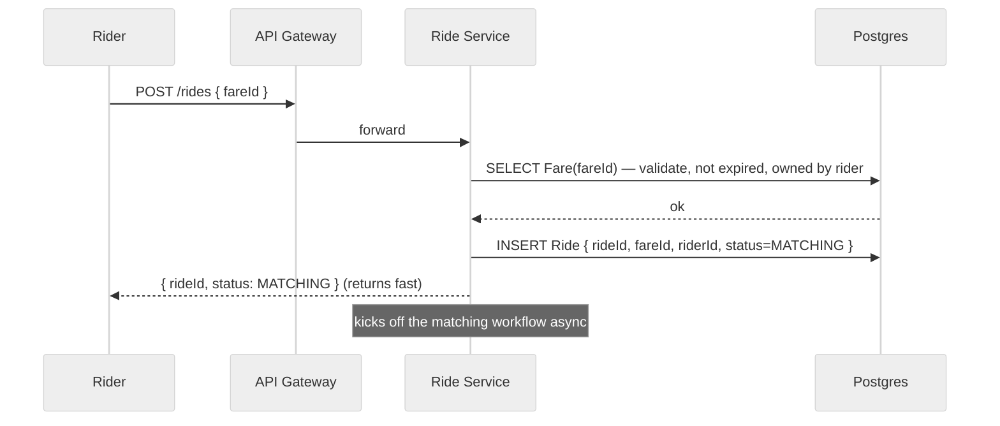

#### Sample `Ride` rows

| rideId | fareId | riderId | driverId | status | requestedAt | acceptedAt | completedAt | finalPrice |
|---|---|---|---|---|---|---|---|---|
| `ride_8001` | `f_1001` | `r_42` | `d_91` | `IN_PROGRESS` | `1716700050` | `1716700090` | `null` | `null` |
| `ride_8002` | `f_1002` | `r_42` | `null` | `MATCHING` | `1716700100` | `null` | `null` | `null` |
| `ride_8003` | `f_1003` | `r_77` | `d_55` | `COMPLETED` | `1716699000` | `1716699030` | `1716699850` | `$18.45` |

> 💡 **Why is the API "fire-and-forget" from the rider's perspective?** Matching could take up to a minute, and we don't want to hold an HTTP request open that long (load balancer timeouts, mobile network instability, retries that double-charge). Returning `MATCHING` immediately + a WS channel is the standard "async accepted, watch this channel for updates" pattern.

> 💡 **Idempotency.** Mobile networks retry. Two `POST /rides` with the same `fareId` must not create two rides. We enforce a unique constraint on `(fareId)` in the `Ride` table; the second insert fails and we return the existing ride.

---

### 3.3 Riders are matched with a nearby available driver

Now we actually *find a driver*. This is the heart of the system — and the part the high-level design intentionally **abstracts**, because the realistic answer (Redis GEO + ranking) is in [DD1](#dd1-high-volume-location-updates--proximity-search). At this level, just sketch the components.

#### Components introduced
- **Driver Client** — phone app for drivers; pings location periodically.
- **Location Service** — receives driver location pings, stores them.
- **Ride Matching Service** — given a ride request and current driver locations, picks the best driver.
- **Driver Location Store** — a place where driver locations live (placeholder for now; in [DD1](#dd1-high-volume-location-updates--proximity-search) we swap in Redis GEO).

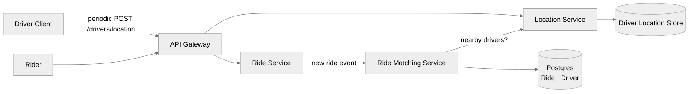

#### Step-by-step flow (Ride Service triggers matching)

1. Rider sends `POST /rides` (from [3.2](#32-riders-can-request-a-ride-based-on-the-estimated-fare)).
2. **Ride Service** publishes a `RideRequested { rideId, pickup, dropoff }` event to the **Ride Matching Service** (in [DD4](#dd4-no-dropped-ride-requests-under-peak-load) this becomes a Kafka queue; for now, an in-process call).
3. **Meanwhile**, every connected driver is continuously calling `POST /drivers/location { lat, lon }` every few seconds → the **Location Service** writes the latest `(driverId → lat, lon, ts)` to the location store.
4. **Matching Service**:
   - Asks the Location Service / store: "give me the K nearest **available** drivers within R km of `pickup`."
   - Ranks them by `(distance, driver_rating, ETA, vehicle_type, …)` — abstracted.
   - Picks the top driver → moves on to [3.4](#34-drivers-can-acceptdecline-a-request-and-navigate-to-pickupdrop-off).

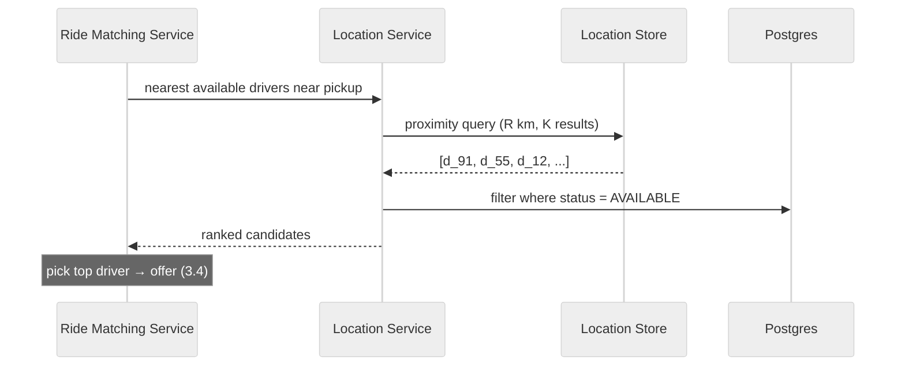

> ⚠️ **Problems with this naive sketch** (we'll fix in order):
> 1. **2M location writes/sec** will crush any normal DB — fixed in [DD1](#dd1-high-volume-location-updates--proximity-search).
> 2. The location pings themselves overload the network — fixed in [DD2](#dd2-reducing-location-update-overload-adaptive-pings).
> 3. Two riders' matchers both pick the same driver in the same millisecond — fixed in [DD3](#dd3-preventing-double-booking-of-a-driver).
> 4. Peak surges drop ride requests on the floor — fixed in [DD4](#dd4-no-dropped-ride-requests-under-peak-load).
> 5. The chosen driver leaves their phone face-down — fixed in [DD5](#dd5-driver-doesnt-respond--fallback).
> 6. We're running this single-region; the world is bigger — fixed in [DD6](#dd6-scaling-globally--geo-sharding).

---

### 3.4 Drivers can accept/decline a request and navigate to pickup/drop-off

Once the Matching Service has a top candidate, the **Notification Service** wakes that driver's phone and offers them the ride. The driver has a 10s window to accept or decline.

#### Components introduced
- **Notification Service** — sends push notifications via APNs (iOS) and FCM (Android), and an in-app push over the open WS for foregrounded apps.

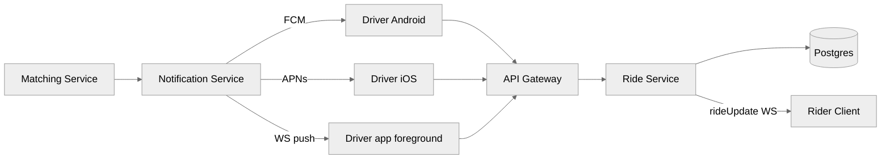

#### Step-by-step flow (driver accepts)

1. **Matching Service** picks the top driver `d_91` → calls **Notification Service** to push `rideOffer { rideId, pickup, dropoff, estFare, expiresInSeconds: 10 }`.
2. **Notification Service** fans out:
   - APNs / FCM (wakes the device, plays sound, shows offer).
   - WS push if the app is open.
3. **Driver** taps **Accept** → client sends `PATCH /rides/{rideId} { action: ACCEPT }`.
4. **Ride Service**:
   - Validates: ride still in `MATCHING`, driver matches the offer recipient, offer not expired (more on this in [DD3](#dd3-preventing-double-booking-of-a-driver) — there's a *lock* involved).
   - `UPDATE Ride SET status = ACCEPTED, driverId = ?, acceptedAt = now()`.
   - `UPDATE Driver SET status = ON_TRIP` (releases the lock from [DD3](#dd3-preventing-double-booking-of-a-driver)).
   - Responds to driver with `{ pickup, rider, dropoff, route }`.
5. **Ride Service** also pushes `rideUpdate { status: ACCEPTED, driver: d_91, vehicle: {...}, eta: 180 }` to the rider over WS.
6. **Driver navigates** using on-device GPS + the route polyline. The Mapping API does the turn-by-turn rendering on-device — our backend isn't in the data path for navigation.
7. On arrival, driver taps **Start Trip** → `PATCH /rides/{rideId} { action: START }` → status `IN_PROGRESS`.
8. On drop-off, driver taps **Complete** → `PATCH /rides/{rideId} { action: COMPLETE }` → status `COMPLETED`, final price computed, `Driver.status = AVAILABLE`, rider gets a final `rideUpdate`.

#### Flow diagram (focused on the accept step)

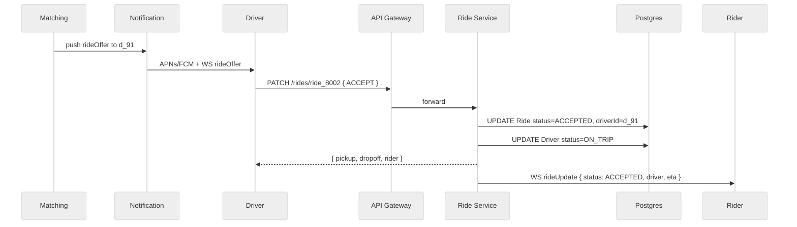

> 💡 **Why the driver gets the pickup coordinates in the *response*, not in the offer.** We don't want a driver to harvest pickup coordinates of N pending offers without accepting any. The offer payload includes a *fuzzed* pickup area + estimated fare. Only after accept do we hand over precise coordinates and rider details.

> 💡 **Why both APNs/FCM *and* WS?** WS is for the foregrounded app (fastest, includes in-app UI updates). APNs/FCM wakes the phone when the app is backgrounded — mobile OSes will not let your background WS stay open indefinitely. Belt + suspenders.

---

## 4. Deep Dives

The single-region naive design works on paper but breaks under our non-functional requirements. We now address them one at a time.

---

### DD1: High-volume location updates + proximity search

**Problem:** With ~10M concurrent drivers each pinging every 5s, we have **~2M writes/sec** *just for locations*, plus thousands of proximity searches per second from matching. A normal RDBMS or DynamoDB doesn't survive that — and proximity over raw `(lat, lon)` columns requires a full table scan because B-tree indexes can't index 2D coordinates efficiently.

> 🔁 **Pattern: Real-time updates → Geospatial indexing.**

#### Options considered

| Option | How it works | Verdict |
|---|---|---|
| ❌ **Direct writes to Postgres / DynamoDB; proximity via lat/lon scan** | Every ping is a row update; matching does `SELECT … WHERE earth_distance(...) < R`. | 2M writes/sec on a normal RDBMS is a non-starter — even DynamoDB at on-demand pricing would cost ~$200K/day. And proximity without a spatial index = full scan = unusable. |
| ✅ **Batch the writes + use PostGIS / a geospatial DB** | Aggregate pings for N seconds in memory, write a batch; PostGIS supports R-tree / GIST spatial indexes for fast `ST_DWithin`. | Way better than the naive version. Batching cuts writes by ~Nx. PostGIS spatial indexes turn proximity into a log-time query. But location data is N seconds stale, and we still have a durable-write cost we don't actually need (locations are ephemeral by nature). |
| ✅✅✅ **Redis GEO (in-memory geospatial store) — chosen** | `GEOADD driver:geo:<region> lon lat <driverId>` on every ping; `GEOSEARCH driver:geo:<region> FROMLONLAT lon lat BYRADIUS R km` for matching. Redis encodes (lat, lon) into a 52-bit geohash inside a sorted set. | Designed exactly for this. Sub-millisecond reads and writes, millions of ops/sec per shard, automatic eviction via a parallel TTL set. Loss of data on crash is acceptable — drivers re-ping within 5s. |

#### Chosen design — Redis GEO

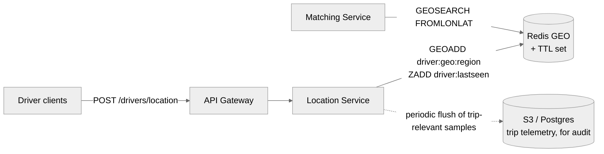

#### How a single location ping flows

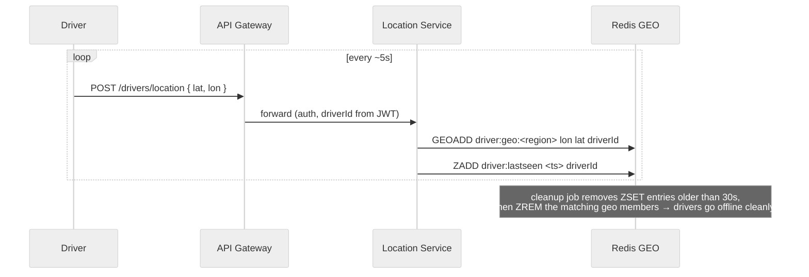

#### How matching uses it

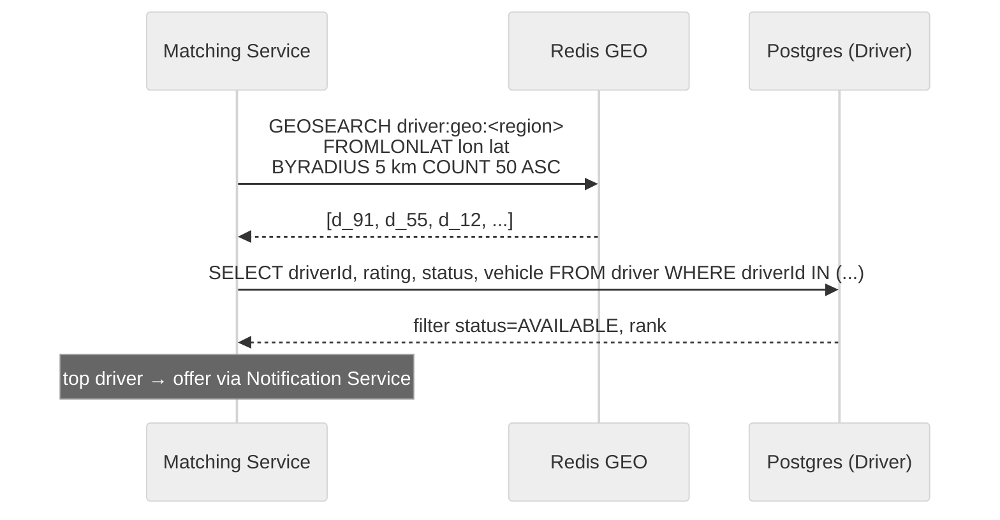

#### Why this works

1. **In-memory speed**: location updates and proximity searches are sub-ms; Redis can do 100K+ ops/sec per node.
2. **Geohash indexing**: Redis encodes lat/lon into a 52-bit integer score in a sorted set. Proximity queries use that geohash prefix to scan only relevant tiles, not the whole world.
3. **Idempotent overwrites**: `GEOADD` overwrites the previous location for a driver — there's no append-only log to garbage-collect.
4. **Acceptable data loss**: if a Redis node dies, all drivers re-ping within ~5s and the state self-heals. Compare that to losing a payment row.

#### Durability / failover

| Concern | Mitigation |
|---|---|
| Redis crash | Redis Sentinel or Redis Cluster with a replica per shard → automatic failover in ~seconds. |
| Need to survive AZ outage | Replica in a different AZ. |
| What if Redis is gone for minutes? | All drivers re-ping; state rebuilds. Matching is degraded during the gap, but no permanent damage — durable data (rides, payments) is in Postgres untouched. |
| Forensics / replay | The Location Service can also sample 1-in-N pings into an S3/Kafka log for offline audit / trip telemetry — bytes are cheap when batched. |

#### Stale-driver cleanup

A driver who turns off their app stops pinging. We don't want them lingering in the geo set forever (matching would offer them rides they can't see).

- Maintain a **companion sorted set** `driver:lastseen` keyed by `(driverId → timestamp)`.
- A cleanup job runs every 30s: find members with `ts < now - 30s`, `ZREM` from `driver:lastseen` *and* `ZREM` from `driver:geo:<region>`.
- Same job also flips `Driver.status` in Postgres to `OFFLINE` if appropriate.

> 💡 **Why two structures (`driver:geo:<region>` + `driver:lastseen`)?** Redis GEO is a sorted set keyed by geohash, so you can't natively answer "who hasn't pinged in N seconds?" without scanning. The companion timestamp-sorted set gives us O(log N) range scans by recency, which is exactly the access pattern the cleanup job needs.

#### Sharding for scale

One Redis instance won't hold 10M driver locations + 100K ops/sec.

- Shard the geo set **by region** (or by H3 cell): `driver:geo:sf-bay`, `driver:geo:nyc`, etc.
- A proximity query for a pickup at coordinate X only needs to hit the 1–3 shards covering that area (plus its neighbors if the pickup is near a region boundary).
- Within a region, you can further shard by H3 cell at a chosen resolution — see [DD6](#dd6-scaling-globally--geo-sharding).

---

### DD2: Reducing location-update overload (adaptive pings)

**Problem:** Even with Redis GEO, the **network-level cost** of 10M drivers each calling our API every 5s is enormous. 2M req/s of mostly-redundant data also burns driver phone battery and data plans.

> 🔁 **Pattern: Move work to the edge (client).**

#### Options considered

| Option | How it works | Verdict |
|---|---|---|
| ❌ **Fixed 5s ping interval** | Driver client pings every 5s no matter what. | Wastes huge bandwidth when a driver is sitting parked, and *under*-samples when a driver is actively in a trip with sharp turns. Uniformly bad. |
| ✅ **Adaptive interval based on speed + context — chosen** | Client picks the ping interval dynamically. Stationary or slow → every 30s. On a trip → every 3–4s. Pre-pickup with rider waiting → every 2s. Near a metro hotspot → every 5s. | Cuts total traffic by ~5–10× in steady state while *improving* accuracy when it matters. The complexity lives entirely on the client. |
| ⚠️ **Server-driven cadence** | Server tells each driver how often to ping based on demand near them. | Powerful (server has the global picture), but adds a control loop and requires a downstream channel. Common as a *layer on top* of the adaptive client logic. |

#### Adaptive logic (on the driver client)

```
state determine_interval():
    if status == OFFLINE: return ∞   (don't ping)
    if status == IN_TRIP: return 3s  (tight tracking for the rider's "where's my driver" view)
    if status == EN_ROUTE_TO_PICKUP: return 2s
    if speed > 30 mph: return 4s
    if speed > 5 mph: return 8s
    if stationary > 60s: return 30s
    else: return 10s
```

| Driver state | Ping interval | Why |
|---|---|---|
| Idle, parked | 30s | Few changes; saves battery + data + server load. |
| Cruising for fares (no pax) | 8–10s | Moderate change; needs to be findable by the matcher. |
| Offered a ride / en route to pickup | 2s | Rider is watching the map; ETA must be tight. |
| In trip with passenger | 3s | Rider sees the live map; we also want a high-resolution trail for support disputes. |
| Highway speed | 4s | Lots of distance per second; need to keep up. |

> 💡 **Why not just always ping at 1Hz when accuracy matters and 0.1Hz otherwise?** Because of mobile radio behavior. Each ping requires the radio to wake up; clustered pings let the radio sleep between them. Going from 5s to 30s when idle is a ~6× battery win.

> 💡 **Don't ignore client design.** Junior candidates draw a "Driver Client" box and move on. Senior candidates recognize that for high-volume telemetry systems, **the client is part of the design**. Same reason a file upload service chunks/compresses on the client.

#### Server hook

The server still does its own sanity checks:
- Reject pings from drivers marked `OFFLINE` (defensive).
- If a `IN_TRIP` driver hasn't pinged in 30s, mark them `STALE` and notify the rider's app to show "reconnecting…".

---

### DD3: Preventing double-booking of a driver

**Problem:** Two riders A and B both request rides ~simultaneously. Both matchers happen to pick driver `d_91` as the best candidate. Without coordination, we'd `PATCH /rides/{rideId_A}` and `PATCH /rides/{rideId_B}` both successfully — and `d_91` accepts whichever offer arrives at his phone first, leaving the other rider abandoned with a "matched" message but no driver.

This is exactly the Ticketmaster "ticket reserved" problem. The fix is to **lock the driver for the duration of the offer (~10s)**.

> 🔁 **Pattern: Distributed lock with TTL.**

#### Options considered

| Option | How it works | Verdict |
|---|---|---|
| ❌ **In-process lock in each Matching Service instance** | Each instance keeps a local `Set<driverId>` of "currently offered" drivers. | Doesn't work across instances. We have many matchers running, and they have no shared memory. |
| ✅ **Database-level "outstanding offer" status** | `UPDATE Driver SET status='OFFER_PENDING' WHERE driverId=? AND status='AVAILABLE'` — only one matcher wins the conditional update. Reset via a cron job if no response in 10s. | Solves the race via the atomic conditional update, but the cleanup is a cron job — slow and clunky. If the matcher process crashes mid-offer, the driver stays "OFFER_PENDING" until cron finds them, blocking real bookings. |
| ✅✅✅ **Redis distributed lock with TTL — chosen** | `SET lock:driver:<driverId> <rideId> NX EX 10` before sending the offer. NX = only set if absent (atomic). EX = auto-expire in 10s. On accept, delete the lock. If no accept in 10s, the lock vanishes by itself. | Atomic, self-cleaning, sub-ms latency. The TTL is the timeout — no separate cron needed. Crash safety comes free. |

#### Chosen design — Redis lock

```mermaid
%%{init: {'theme': 'neutral', 'themeVariables': {'fontSize': '18px'}}}%%
sequenceDiagram
    participant MA as Matcher A (for rider A)
    participant MB as Matcher B (for rider B)
    participant L as Redis (locks)
    participant D as Driver d_91

    MA->>L: SET lock:driver:d_91 ride_A NX EX 10
    L-->>MA: OK (acquired)
    MB->>L: SET lock:driver:d_91 ride_B NX EX 10
    L-->>MB: nil (already held)
    Note over MB: skip d_91, try next candidate
    MA->>D: rideOffer { ride_A, 10s window }
    alt driver accepts in time
        D->>MA: PATCH /rides/ride_A ACCEPT
        MA->>L: DEL lock:driver:d_91
        Note over MA: ride status → ACCEPTED;<br/>Driver.status → ON_TRIP
    else timeout
        Note over L: lock expires after 10s automatically
        Note over MA: pass driver d_91 back to candidate pool
    end
```

#### Why this works

1. **Atomic acquisition**: `SET ... NX` is a single Redis op. Only one matcher's call returns OK.
2. **Auto-cleanup**: The `EX 10` TTL means even if Matcher A crashes after acquiring the lock, the lock vaporizes in 10s and the driver is bookable again. No cron.
3. **Per-driver granularity**: Locking the *driver* (not the ride) prevents the cross-rider race naturally.
4. **Fast**: Sub-ms operations; locking adds maybe 2ms to the matching pipeline.

#### Lock value matters

We store `rideId` as the lock *value* (not just OK). On `DEL`, we use a **check-and-delete** Lua script:

```lua
-- only delete if the lock is still ours (defensive against stale unlocks)
if redis.call("GET", KEYS[1]) == ARGV[1] then
    return redis.call("DEL", KEYS[1])
else
    return 0
end
```

This protects the case where:
- Matcher A acquired the lock, then froze for 11s.
- Lock expired; Matcher B grabbed it for a different ride.
- Matcher A wakes up, tries to `DEL` — without the check, it would release B's legitimate lock.

#### Additional safety net: the conditional `UPDATE` in Postgres

When the driver finally accepts, the Ride Service also does:

```sql
UPDATE Ride
SET status = 'ACCEPTED', driverId = ?, acceptedAt = now()
WHERE rideId = ? AND status = 'MATCHING';
```

If two offers somehow slipped through (e.g. clock skew on the lock TTL), only the first `UPDATE` succeeds — the row's `status` is already `ACCEPTED`, the second one's `WHERE` doesn't match, zero rows affected. Combined with the Redis lock this gives us defense in depth: **lock-out at offer time, conditional-write at accept time**.

> 💡 **Real-life caveats:** at very large scale, Redis-based locking has subtle edge cases under replica failover (the famous Redlock debate). For Uber-scale, Redis Cluster's failover semantics + the 10s TTL make this entirely safe — worst case is a brief window where a driver could be double-offered, and the conditional UPDATE in Postgres catches it.

---

### DD4: No dropped ride requests under peak load

**Problem:** During NYE / a concert / an airport surge, a single metro can spike to **100K ride requests/min**. The Matching Service can't scale fast enough to handle that burst synchronously — and if a matcher instance crashes mid-request, we lose that ride completely.

> 🔁 **Pattern: Async queue between request and processing.**

#### Options considered

| Option | How it works | Verdict |
|---|---|---|
| ❌ **Synchronous matching in Ride Service** | Ride Service calls Matching Service in-process. | Best-case OK, worst-case (matcher crash, network blip) loses the ride entirely. No replay. Scales linearly with matcher throughput. |
| ✅ **Async via SQS / RabbitMQ / SNS** | Ride Service publishes `RideRequested` to a queue; matchers consume it. | Decouples burst absorption from matching speed. Built-in retries. Easy to get started. The issue: most simple queues are FIFO global, so one stuck request blocks the queue. |
| ✅✅✅ **Kafka, partitioned by region, with at-least-once consumption — chosen** | One Kafka topic `ride.requests`, partitioned by `region` (or H3 cell). Matching Service instances consume per partition. Offsets are committed only **after** a successful match (or after the request is moved to a dead-letter / retry queue). | Per-region parallelism, durable replay if a matcher crashes (the message stays uncommitted, another instance picks it up), bounded blast radius (a stuck NYC partition doesn't slow SF), and we can scale matchers per partition. |

#### Chosen design — Kafka in front of matching

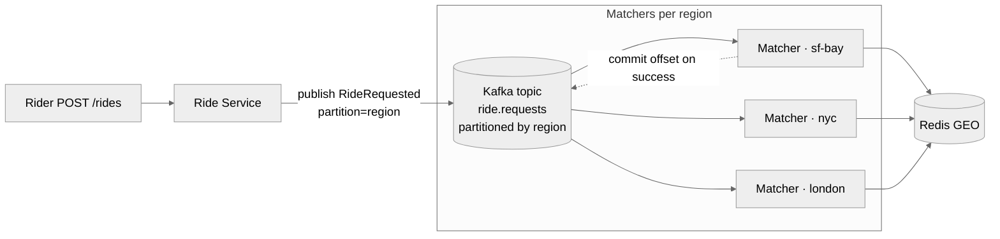

#### Flow

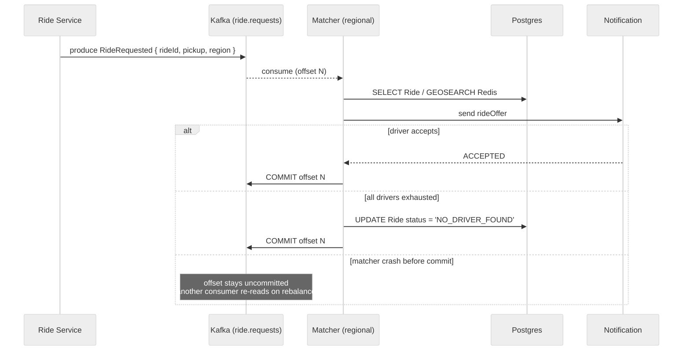

#### Why this design

1. **Burst absorption**: Kafka can buffer 100K+ msgs/sec per partition. The Matching Service can be slower than the spike without dropping anything.
2. **Per-region parallelism**: NYC's partition is consumed independently of SF's. A single overloaded region doesn't break the world.
3. **At-least-once with idempotency**: We commit the offset *only after* the ride matches or fails permanently. If the matcher crashes, a different consumer picks up at the same offset. Idempotency comes from the conditional `UPDATE Ride … WHERE status = 'MATCHING'` — a duplicate won't double-match.
4. **Backpressure visible**: Kafka consumer lag is a metric. If lag grows, autoscaling spins up more matcher instances in that region.

#### Optional: priority within a region

A vanilla Kafka topic is strictly FIFO per partition. If one ride request is taking a long time (driver after driver declines), it could block subsequent requests in that partition.

Options:
- **Separate topics for priority lanes**: airport pickups, peak surge, regular. Matchers consume all three with weighted fairness.
- **Move slow requests to a "retry" topic**: after the first driver decline, push to `ride.requests.retry` so the main lane keeps moving. The retry topic is consumed by the same matchers but with a small delay.

> 💡 **Why Kafka and not just SQS?** SQS doesn't support per-region partitioning natively, has limited message ordering, and reading the same message after a consumer crash requires "visibility timeout" tuning that's clumsy compared to Kafka's offset model. For a system whose central NFR is "no dropped requests at 100K/min in one metro", Kafka's strong durability + partitioning + at-least-once semantics is the correct tool.

---

### DD5: Driver doesn't respond → fallback

**Problem:** The driver's phone is face-down on the passenger seat, or they had a network blip. The 10s offer window ticks past. We need to (a) free up the rider's matching pipeline immediately, (b) try the next-best driver, (c) keep going until a driver accepts or we exhaust the candidate list, all **without losing the rider's request**.

> 🔁 **Pattern: Multi-step process / durable execution.**

#### Options considered

| Option | How it works | Verdict |
|---|---|---|
| ❌ **Single attempt, give up** | Send to one driver. If they don't accept, return "no driver found" to the rider. | Terrible UX. The next driver might be 0.5 km away and happy to take it. |
| ✅ **Delay queue (SQS delay or Kafka with timestamp)** | When the matcher offers driver D, also schedules a "timeout message" for now+10s. If the timeout fires before acceptance, it triggers a retry to the next candidate. | Works, but the matcher has to carry workflow state (which drivers tried, ranking position, ride state) somewhere durable, and reconciling "did the accept arrive after the timeout fired?" gets ugly fast. |
| ✅✅✅ **Durable execution framework (Temporal / Cadence / Step Functions) — chosen** | Model the whole matching attempt as a *workflow*. The workflow waits up to 10s per driver, falls through to the next one on timeout, persists its own state, and survives process restarts transparently. | This is what Uber actually built (Cadence → open-sourced → Temporal). Born for this. |

#### Chosen design — workflow-driven matching

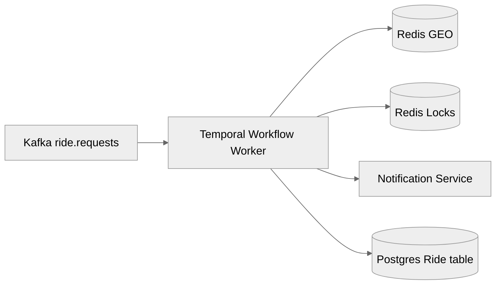

#### Workflow pseudocode

```
@workflow
def matchRide(rideId, pickup, region):
    candidates = matching_service.rank_nearby_drivers(region, pickup)   # GEOSEARCH + ranking
    for driver in candidates[:10]:                                       # try top 10 max
        if not acquire_lock(driver):
            continue                                                     # someone else just grabbed
        notification_service.send_offer(driver, rideId)
        try:
            # this is a durable wait — survives process crashes!
            outcome = workflow.wait_signal("driver_response", timeout=10s)
        except TimeoutError:
            release_lock(driver)
            continue
        if outcome == "ACCEPT":
            release_lock(driver)                                         # ride is now ON_TRIP anyway
            return SUCCESS(driver)
        else:  # DECLINE
            release_lock(driver)
            continue
    # exhausted
    db.update_ride(rideId, status="NO_DRIVER_FOUND")
    notification_service.tell_rider(rideId, "no drivers available")
    return FAILURE
```

#### Why durable execution is the right tool

| Property | Without Temporal | With Temporal |
|---|---|---|
| Survive matcher crash mid-attempt | manual recovery logic + cron | automatic — workflow resumes on a different worker with full state intact |
| 10s wait per driver | needs timers persisted somewhere ourselves | built in (`wait_signal(timeout=10s)`) |
| Trying drivers in order | manual loop state + persistence | natural — workflow code is just a loop |
| Visibility into stuck rides | grep logs across instances | Temporal UI shows every in-flight workflow and where it's stuck |
| Idempotency | DIY | activities are at-least-once with built-in dedupe |

> 💡 **Trade-off:** Temporal is a non-trivial system to operate. It's one more piece of infrastructure (workers, server, persistent storage). For a startup, the SQS delay queue is a perfectly fine starting point and Uber itself ran on simpler infra for years before building Cadence. But if the problem statement emphasizes "human-in-the-loop with timeouts and fallbacks across multiple steps", durable execution is the correct mental model.

#### What the rider sees while this is happening

The rider's WS channel gets periodic `rideUpdate` events:
- "Looking for a driver…" (immediately).
- (silently rotating through driver candidates).
- "Matched with John, 3 min away" (success).
- OR "No drivers available right now — please try again" (after exhaustion).

The rider never sees the individual driver rejections — that's an internal implementation detail.

---

### DD6: Scaling globally — geo-sharding

**Problem:** We've handled location updates (DD1), client cost (DD2), consistency (DD3), peak load (DD4), and workflow resilience (DD5) — all within one region. But Uber is global. Cross-region calls are slow (50–200ms intercontinental). And one region's database choking can't be allowed to take down another region's.

> 🔁 **Pattern: Shard by geography (the data has natural locality).**

#### Options considered

| Option | How it works | Verdict |
|---|---|---|
| ❌ **Vertical scaling** | Bigger DBs, bigger Redis, bigger everything. | Hits a ceiling fast; no fault isolation (one DB outage = global outage); expensive; no latency win for distant users. |
| ✅ **Horizontal scaling, single region per service** | Multiple replicas + sharded DB inside one mega-region. | Better, but latency for users far from the region is bad, and the region is still a single failure domain. |
| ✅✅✅ **Geo-sharded by region with read replicas — chosen** | Each region (e.g. NA-West, NA-East, EU, APAC) runs a full stack: API gateway, Ride Service, Matching, Redis GEO, Postgres primary. Each user is "homed" to their nearest region. Cross-region only happens at the boundary (e.g. a ride that crosses a region) or for global metadata. | Fault-isolated, low-latency, scales naturally. The only tricky part is the "boundary" case. |

#### Geo-sharding layout

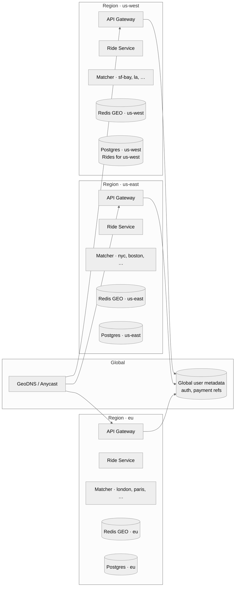

#### What's regional vs global

| Data | Lives where | Why |
|---|---|---|
| `Ride`, `Fare` rows | **Region** (the region of the pickup) | These are accessed hot from that region during the ride. Cross-region access is rare. |
| `Driver` location | **Region** Redis GEO | A driver only operates in one region at a time. |
| `Driver` profile / `Vehicle` | **Region** (driver's home) | Same — locality. |
| `Rider` profile, payment method, auth | **Global** (with regional read replicas) | A user might request a ride in any region they travel to. |
| Surge multipliers, pricing rules | **Region** | Computed locally per metro. |
| Trip telemetry archive | **Region S3** → global lake | Hot in-region, cold archive globally for analytics. |

#### Sub-regional sharding via H3

Inside a region, we further partition by **H3 cell** (Uber's open-source hex-grid library). Each cell at resolution 7 is ~5 km². Reasons:

- Redis GEO scales further: `driver:geo:h3:<cell_id>` rather than one giant `driver:geo:sf-bay` set.
- Proximity queries hit only ~7 cells (the target hex + 6 neighbors).
- Kafka partition key can be the H3 cell → matchers pin to cells, perfect parallelism.
- Surge pricing is naturally per-cell.

#### Boundary cases (rider near a region edge)

Most rides are entirely within one region. The interesting cases:

| Case | Resolution |
|---|---|
| Pickup in region A, dropoff also in A | All-in-A, trivial. |
| Pickup in A, dropoff in B | Ride is *owned* by A (where the pickup happened). Region A's matcher finds an A-region driver. Mapping API computes the cross-region route. The ride row lives in A; B has no record of it. |
| Pickup *very near* the A/B boundary | Matcher does a scatter-gather: GEOSEARCH in *both* A and B Redis shards. Slightly higher latency but ensures we find the closest driver. |
| User traveling, opens app in a foreign region | Their rider profile is fetched from the global metadata store. The new ride is created in the foreign region. |

#### Failure isolation

- A Redis outage in `us-east` does **not** affect `us-west`.
- A Postgres failover in `eu` affects only `eu` riders.
- The global metadata store is read-mostly; a brief outage there means "can't sign up new users for 30s" but in-flight rides continue.

#### Read replicas

Within each region, the Postgres primary takes writes; read replicas serve:
- Driver / rider profile reads.
- Recent ride lookups (`GET /rides/{rideId}` after the ride starts).
- The matcher's "filter candidates by status / rating" join.

Replication lag (single-digit ms within a region) is acceptable for everything except the consistency-critical write paths (ride status transitions, which always hit the primary).

---

## 5. Final Architecture

### End-to-end flow (everything together)

This is the **single picture** that ties FR1–FR4 and DD1–DD6 into one story. Follow a ride request from rider in SF to driver `d_91`.

```mermaid
%%{init: {'theme': 'neutral', 'themeVariables': {'fontSize': '16px'}}}%%
sequenceDiagram
    autonumber
    participant R as Rider (SF)
    participant GW as API Gateway (us-west)
    participant RS as Ride Service
    participant M as Mapping API
    participant DB as Postgres (us-west)
    participant K as Kafka ride.requests
    participant W as Matching Workflow (Temporal)
    participant RG as Redis GEO (us-west)
    participant L as Redis Locks
    participant N as Notification Service
    participant D as Driver d_91

    Note over R,GW: 1. Fare estimate (FR1)
    R->>GW: POST /fare { pickup, dropoff }
    GW->>RS: forward (JWT verified)
    RS->>M: route(pickup, dropoff)
    M-->>RS: distance, eta
    RS->>DB: PUT Fare { fareId, expiresAt=now+5min }
    RS-->>R: { fareId, price, eta }

    Note over R,DB: 2. Request ride (FR2)
    R->>GW: POST /rides { fareId }
    GW->>RS: forward
    RS->>DB: SELECT Fare(fareId), validate, idempotency check
    RS->>DB: INSERT Ride { status=MATCHING }
    RS->>K: produce RideRequested { rideId, pickup, region=us-west }
    RS-->>R: { rideId, status=MATCHING }

    Note over K,W: 3. Workflow-driven matching (FR3 + DD4 + DD5)
    K-->>W: consume (partition=us-west)
    W->>RG: GEOSEARCH driver:geo:sf-bay FROMLONLAT ... BYRADIUS 5km
    RG-->>W: [d_91, d_55, d_12, ...]
    W->>DB: filter by status=AVAILABLE, rating; rank

    Note over W,D: 4. Try top driver with lock + offer (DD3 + DD5)
    W->>L: SET lock:driver:d_91 ride_X NX EX 10
    L-->>W: OK (lock acquired)
    W->>N: send rideOffer to d_91
    N->>D: APNs/FCM + WS rideOffer (10s window)

    alt driver accepts in time
        D->>GW: PATCH /rides/ride_X { ACCEPT }
        GW->>RS: forward
        RS->>DB: UPDATE Ride SET status=ACCEPTED, driverId=d_91 WHERE status=MATCHING
        RS->>DB: UPDATE Driver SET status=ON_TRIP
        RS->>L: DEL lock:driver:d_91 (Lua check-and-del)
        RS->>R: WS rideUpdate { status=ACCEPTED, driver=d_91, eta }
        W->>K: commit offset
    else 10s timeout
        Note over W,L: lock auto-expires
        W->>W: next candidate, repeat
    else all candidates exhausted
        W->>DB: UPDATE Ride SET status=NO_DRIVER_FOUND
        W->>R: WS rideUpdate { status=NO_DRIVER_FOUND }
        W->>K: commit offset
    end

    Note over D,R: 5. Navigation + trip (FR4)
    D->>GW: POST /drivers/location every 2-5s (DD2 adaptive)
    GW->>RG: GEOADD driver:geo:sf-bay
    RS->>R: WS rideUpdate periodic ETA refresh

    Note over D,DB: 6. Complete
    D->>GW: PATCH /rides/ride_X { COMPLETE }
    GW->>RS: forward
    RS->>DB: UPDATE Ride SET status=COMPLETED, finalPrice, completedAt
    RS->>DB: UPDATE Driver SET status=AVAILABLE
    RS->>R: WS rideUpdate { status=COMPLETED, finalPrice }
```

**Reading the diagram as a single story:**

| Step | What's happening | Tied back to |
|---|---|---|
| 1 | Rider quotes a fare; price + ETA stored in Postgres with a 5-min expiry. | [3.1](#31-riders-can-input-start--destination-and-get-a-fare-estimate) |
| 2 | Rider confirms; Ride row inserted as `MATCHING`; event pushed to Kafka **per region**. API returns immediately. | [3.2](#32-riders-can-request-a-ride-based-on-the-estimated-fare) · [DD4](#dd4-no-dropped-ride-requests-under-peak-load) · [DD6](#dd6-scaling-globally--geo-sharding) |
| 3 | Matching Workflow (Temporal) consumes the event, asks Redis GEO for nearby drivers, ranks them. | [3.3](#33-riders-are-matched-with-a-nearby-available-driver) · [DD1](#dd1-high-volume-location-updates--proximity-search) · [DD5](#dd5-driver-doesnt-respond--fallback) |
| 4 | Workflow tries each candidate in turn: **acquire Redis lock → offer → wait 10s → next on decline/timeout**. | [DD3](#dd3-preventing-double-booking-of-a-driver) · [DD5](#dd5-driver-doesnt-respond--fallback) |
| 5 | Driver navigates; client pings location at adaptive cadence; rider gets live ETA. | [3.4](#34-drivers-can-acceptdecline-a-request-and-navigate-to-pickupdrop-off) · [DD2](#dd2-reducing-location-update-overload-adaptive-pings) |
| 6 | Trip completes; Postgres records final price; driver returns to `AVAILABLE`. | [3.4](#34-drivers-can-acceptdecline-a-request-and-navigate-to-pickupdrop-off) |

> 💡 **The whole design in one line:** *Rider requests go through Kafka into a Temporal workflow, which picks drivers from Redis GEO, locks them in Redis, offers them via APNs/FCM, and persists the Ride state in Postgres — all sharded by region for global scale.*

---

### Component architecture (deployment view)

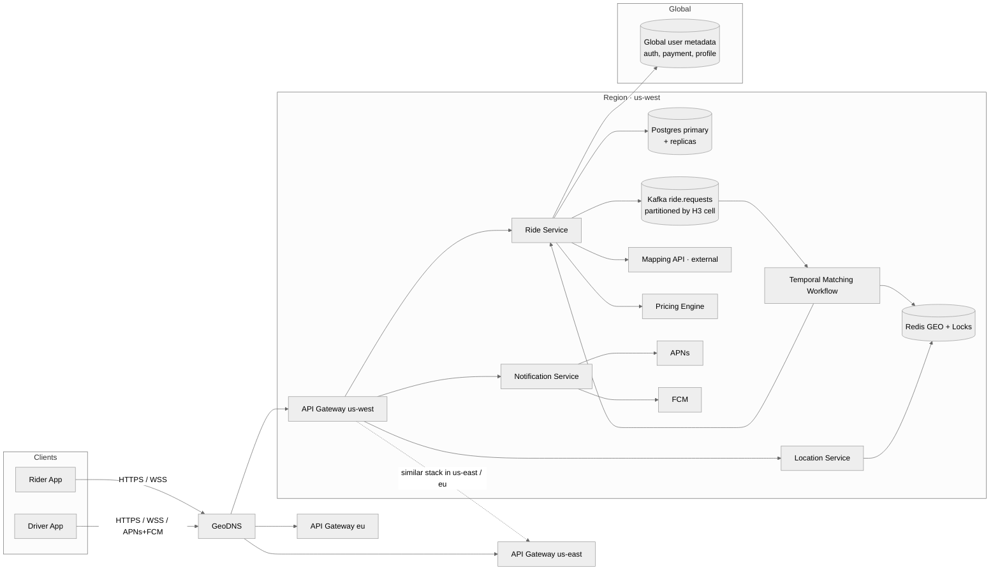

### Summary of choices

| Concern | Choice | Why |
|---|---|---|
| Client transport | **HTTPS + WSS for live updates + APNs/FCM for wake-up** | Async UX (matching takes seconds), background notifications needed. |
| API style | **REST for commands, push channels for events** | Standard async-accepted pattern. |
| Ride / Fare / Driver / Rider storage | **Postgres** | Relational data with strong consistency needs; transactions for status transitions. |
| Driver locations | **Redis GEO (sharded by region / H3 cell)** | 2M writes/sec + sub-ms proximity search; durability isn't important (drivers re-ping). |
| Driver lock during offer | **Redis SET … NX EX 10 + check-and-del Lua** | Atomic acquire + auto-cleanup via TTL; survives matcher crashes. |
| Ride request queue | **Kafka, partitioned by region** | Burst absorption, replay on crash, per-region parallelism. |
| Matching control flow | **Temporal / Cadence durable workflow** | Multi-step process with timeouts and retries that must survive crashes. |
| Notifications to driver | **APNs + FCM + WS (parallel)** | Foreground + background coverage. |
| Mapping / routing | **External (Google Maps / Mapbox)** | Not a differentiator; build vs. buy = buy. |
| Surge pricing | **Per H3 cell, recomputed every minute** | Geographic locality. |
| Geo distribution | **Region-homed stack + global user metadata** | Latency, fault isolation. |
| Sub-regional sharding | **H3 hexagons** | Cleaner boundaries than lat/lon strips; Uber's own library. |

---

## 6. What Is Expected at Each Level

### Mid-level (E4)
- ~80% breadth, 20% depth.
- Clear API + entities.
- Functional HLD for fare → request → match → accept.
- Recognizes that lat/lon column scans don't scale; gestures at "some spatial index" even if they don't name Redis GEO / quadtree.
- Lands on at least the "good" solution for the double-booking problem (DB conditional update with timeout cron).

### Senior (E5)
- ~60% breadth, 40% depth.
- Speeds through HLD; spends time on:
  - **DD1** — argues for Redis GEO with reasoning, knows about geohash + sorted set.
  - **DD3** — distributed lock with TTL, ideally mentions Redlock edge cases.
  - **DD4** — Kafka with at-least-once, idempotent matching.
- Articulates trade-offs (PostGIS vs Redis GEO, Kafka vs SQS, durable execution vs delay queue).
- Identifies the "boundary case" in geo-sharding.

### Staff+ (E6+)
- ~40% breadth, 60% depth.
- Drives 3+ deep dives end-to-end and brings real production judgment:
  - **DD1** — geohash precision trade-offs, H3 vs S2, scatter-gather across cells.
  - **DD4** — partition strategy, priority lanes, consumer lag as a load-shedding signal.
  - **DD5** — explicit Temporal workflow design, replay semantics, idempotency at activity level.
  - **DD6** — cross-region rides, eventual consistency for the rider's "where's my driver" view, global metadata read replicas.
- Mentions surge pricing as a cell-level signal, fraud detection paths, ETA prediction as an ML problem (not by hand).
- Knows when *not* to over-engineer (e.g. you don't need Temporal on day 1).

---

## 7. Appendix — Common Interviewer Follow-Ups

Questions an interviewer is very likely to ask. Have a 1-minute answer ready for each.

### Locations & Matching
1. **Why Redis GEO and not PostGIS?** → 2M writes/sec ephemeral data; durability not needed; PostGIS write amplification + WAL would crush it. Redis is in-memory, designed for exactly this; drivers re-ping in 5s if it crashes.
2. **How does Redis GEO actually index?** → Encodes (lat, lon) into a 52-bit interleaved geohash, stores it as the score in a sorted set per region. Proximity = sorted-set range scan over neighbors of the target geohash.
3. **What's H3 and why use it?** → Uber's open-source hex-grid library. Equal-sized cells (unlike lat/lon strips), exactly 6 neighbors per cell (cleaner than quadtree's 4 or 8), hierarchical (zoom in/out by cell resolution). We use it as both a Redis sharding key and a Kafka partition key.
4. **What's the staleness tolerance for driver locations?** → ~5s is fine for matching (driver in 5s moves ~70m at 30 mph, well within the search radius). For an active trip the rider's map can interpolate locally between pings.

### Consistency & Locking
5. **How do you guarantee a driver isn't offered to two riders?** → Redis lock with TTL acquired *before* sending the offer (`SET … NX EX 10`); defense in depth via the conditional `UPDATE Ride SET … WHERE status='MATCHING'`. Even if the lock fails, only one UPDATE succeeds.
6. **What about Redlock concerns?** → For a 10s TTL with our failover model, the worst case is a split-second double-offer. The conditional UPDATE makes us idempotent; no real harm. For longer-held locks you'd use Redlock or a CP store like etcd.
7. **Can the same ride be matched twice if Kafka redelivers?** → No. The matcher uses `UPDATE Ride … WHERE status='MATCHING'` as its terminal write; a redelivered message finds the ride already accepted and exits cleanly.

### Scale
8. **How do you handle a 10× spike (NYE in NYC)?** → Kafka absorbs the burst. The NYC partition has more matcher consumers spun up (autoscaling on consumer lag). Surge pricing kicks in to balance demand. Other regions' partitions are untouched.
9. **What if a region's Postgres goes down?** → That region's rides degrade; rider apps in that region show "service unavailable." Other regions are unaffected. The standby replica is promoted (single-digit minutes for RDS Multi-AZ).
10. **How do you reduce the location-update load?** → Adaptive intervals on the client based on speed and status (DD2). Cuts pings ~5–10× in aggregate. Server-side, Redis is the only thing that touches every ping.

### Multi-step / Reliability
11. **What if the matcher crashes after sending the offer but before recording the ride?** → Temporal workflow state is persisted; on restart a different worker resumes the workflow at the `wait_signal("driver_response")` step. Redis lock auto-expires after 10s if it was held. No ride is lost.
12. **What if the driver's accept arrives at the *exact same millisecond* as the timeout?** → The conditional `UPDATE Ride … WHERE status='MATCHING'` is the tiebreaker. Whichever transaction commits first wins. If the timeout's "move to next driver" wins, the driver's accept gets a 409 Conflict from the API.
13. **How do you handle a driver going offline mid-trip?** → Server marks them `STALE` after 30s without a ping; rider sees "reconnecting…". After a longer period (e.g. 5 min) we offer the rider a "request a new driver" option and refund. Trip telemetry has the last known location for support escalation.

### Fare & Pricing
14. **Why does the fare expire?** → Surge multiplier can change; prevents quote-then-wait-for-storm gaming. 5 min is the typical window.
15. **Where does the surge multiplier come from?** → Computed per H3 cell every ~minute from `(requests in last N min) / (available drivers in last N min)`. Lives in a separate cache so the Pricing Engine reads it in O(1).
16. **How is the *final* price computed if traffic was bad?** → Quote has a small tolerance band; if actual time exceeds the quote significantly (e.g. >25%), we may charge a delta but Uber typically eats it (UX > a few dollars of margin). Configurable per-market.

### Edge cases
17. **What if a rider requests a ride in a city with no drivers?** → Workflow exhausts candidates → updates Ride status to `NO_DRIVER_FOUND` → rider gets a clear "no drivers available" message + we don't charge. Logged for surge / supply analytics.
18. **What if a driver accepts a ride and then immediately cancels?** → Treated as a decline + small cancel penalty; matcher workflow resumes from the next candidate. The original ride row still exists; status moves back to `MATCHING` temporarily, then to next driver.
19. **What about cross-region rides (SF → San Jose across a region boundary)?** → Pickup region owns the ride. Matching happens in the pickup region. Routing is via Mapping API and doesn't care about our internal regions. The drop-off region has no data on this ride.

### Beyond the Core Design
20. **How would you add ride pooling (UberPool)?** → Matching becomes a constraint optimization: minimize total distance for K riders sharing one driver, subject to detour limits and capacity. Different objective function; same plumbing (Redis GEO + workflow). Often a separate microservice with a more expensive matcher.
21. **How would you add ratings post-trip?** → Independent service; subscribes to `RideCompleted` events. Each rating is a row in a `Rating` table; aggregated rating cached in `Driver`/`Rider` row. Doesn't affect any hot path.
22. **What metrics would you monitor?** → Matcher time-to-match p99, driver acceptance rate, Redis GEO ops/sec & memory, Kafka consumer lag per region, ride status transitions per minute, NO_DRIVER_FOUND rate per cell, lock acquisition failure rate, p99 fare quote latency.
23. **How would you A/B test a new ranking algorithm?** → Workflow consults a `RankingService` which is itself feature-flagged per region or per rider cohort. Compare match time, completion rate, cancellation rate between variants. Same plumbing; only the ranker changes.
24. **How do you keep driver and rider in sync about the ETA?** → Rider's WS channel gets `rideUpdate` every ~10s while en-route, recomputed from the driver's latest Redis GEO position via the Mapping API. ETA staleness < 15s in steady state.
25. **How would you support scheduled rides?** → Separate "scheduled rides" table; a cron / Temporal cron-workflow at pickup_time - 10 min produces a `RideRequested` event into Kafka as if the rider had just hit "request now". From there, identical pipeline.

---

## Appendix — Patterns Touched

| Pattern | Used For |
|---|---|
| **Real-Time Updates** | WS push for ride status, APNs/FCM for driver offers, adaptive driver pings. |
| **Geospatial Indexing** | Redis GEO + H3 cells for proximity search. |
| **Distributed Lock w/ TTL** | Driver lock during the 10s offer window. |
| **Async Queue (Kafka)** | Burst absorption for ride requests; per-region partitioning. |
| **Multi-Step / Durable Execution** | Temporal workflow drives match → offer → timeout → next-driver. |
| **At-Least-Once Delivery** | Kafka offsets committed only on success; idempotent via conditional UPDATE. |
| **Geo-Sharding** | Region-homed stacks; H3-cell sub-sharding within regions. |
| **CDN / Edge Bypass** | Mapping/routing computed on-device, not via our servers. |
| **TTL-based Cleanup** | Driver location staleness (30s), Fare expiry (5 min), driver lock (10s). |
| **Server-Stamped Truth** | Server is the only writer of `serverTs`, `finalPrice`, `surge multiplier` — clients never supply pricing data. |
