# WhatsApp — System Design

> Detailed system design for a real-time messaging platform (1:1 + group chats, media, offline delivery, multi-device).
> Walks through the problem **step-by-step**, exactly like the Hello Interview breakdown:
> **Requirements → Set Up (entities + API) → High-Level Design (one functional req at a time) → Deep Dives (one problem at a time) → Final Architecture.**

> **Difficulty**: Medium–Hard | **Pattern**: Real-Time Updates | **Asked at**: Meta, OpenAI, Anthropic, Databricks, Google, Amazon

---

## Table of Contents
1. [Understanding the Problem](#1-understanding-the-problem)
   - [Functional Requirements](#11-functional-requirements)
   - [Non-Functional Requirements](#12-non-functional-requirements)
   - [Back-of-the-Envelope Estimation](#13-back-of-the-envelope-estimation)
2. [The Set Up](#2-the-set-up)
   - [Planning the Approach](#21-planning-the-approach)
   - [Core Entities](#22-core-entities)
   - [API / System Interface](#23-api--system-interface)
3. [High-Level Design](#3-high-level-design)
   - [1) Start Group Chats](#31-users-can-start-group-chats-with-multiple-participants-limit-100)
   - [2) Send / Receive Messages](#32-users-can-sendreceive-messages)
   - [3) Receive Messages When Offline](#33-users-can-receive-messages-sent-while-they-are-not-online-30-days)
   - [4) Send / Receive Media](#34-users-can-sendreceive-media)
4. [Deep Dives](#4-deep-dives)
   - [DD1: Scaling to Billions of Concurrent Users](#dd1-scaling-to-billions-of-concurrent-users)
   - [DD2: Multiple Clients per User (Multi-Device)](#dd2-multiple-clients-per-user-multi-device)
   - [DD3: WebSocket Connection Failures](#dd3-websocket-connection-failures)
   - [DD4: Redis Pub/Sub Drops a Message](#dd4-redis-pubsub-drops-a-message)
   - [DD5: Out-of-Order Messages](#dd5-out-of-order-messages)
   - [DD6: "Last Seen" / Presence](#dd6-last-seen--presence)
5. [Final Architecture](#5-final-architecture)
6. [What Is Expected at Each Level](#6-what-is-expected-at-each-level)
7. [Appendix — Common Interviewer Follow-Ups](#7-appendix--common-interviewer-follow-ups)

---

## 1. Understanding the Problem

> **💬 What is WhatsApp?**
> WhatsApp is a messaging service that lets users send and receive encrypted messages (and calls) from their phones and computers. Famously built on Erlang and renowned for handling **billions of users with a tiny engineering footprint** (≈ 1–2M concurrent connections per host).

### 1.1 Functional Requirements

**Core (in scope, top 4):**

| # | Requirement |
|---|-------------|
| 1 | Users can **start group chats** with multiple participants (limit **100**). |
| 2 | Users can **send and receive messages** (text). |
| 3 | Users can **receive messages sent while they were offline** (kept up to **30 days**). |
| 4 | Users can **send and receive media** (images, video, audio, documents) in messages. |

> 1:1 chats are just a special case of group chats (2 participants), so we design for the general case.

**Below the line (out of scope):**
- Audio / video calling.
- Business / commerce integrations.
- Registration, onboarding, profile management.
- End-to-end encryption deep dive (we'll mention it; full crypto is out of scope).

### 1.2 Non-Functional Requirements

**Core (in scope):**

1. **Messages should be delivered to available users with low latency, < 500 ms.**
2. **We should guarantee deliverability of messages** — they should make their way to users (at-least-once, no silent drops).
3. **The system should be able to handle billions of users with high throughput** (we'll estimate this below — ~200M concurrent, ~140K msg/s peak).
4. **Messages should be stored on centralized servers no longer than necessary** (TTL ≤ 30 days; delete on ack ASAP).
5. **The system should be resilient against failures of individual components** (no SPOF — any single chat server, Redis node, or DB shard can die without losing messages).

Tabular form for quick reference:

| # | Requirement | Target |
|---|-------------|--------|
| 1 | **Low latency** delivery for online users | **p99 < 500 ms** end-to-end |
| 2 | **Guaranteed delivery** — messages must reach the recipient eventually | At-least-once |
| 3 | **Massive scale** — billions of users, hundreds of millions concurrent | ~200M concurrent WS |
| 4 | **Minimum centralized retention** — delete from servers ASAP after delivery | TTL ≤ 30 days |
| 5 | **Fault tolerant** — survive individual node failures | No SPOF |

**Below the line:**
- Exhaustive security treatment (we'll note TLS + E2EE at a high level).
- Spam / scraping defenses.
- GDPR data-residency workflows.

> ✅ **Tip:** Lock the **top 4** functional requirements and **top 5** non-functional, then call everything else "below the line" and confirm with the interviewer before moving on.

### 1.3 Back-of-the-Envelope Estimation

| Metric | Calculation | Result |
|---|---|---|
| Active users | Given | **~2B** |
| Concurrent connected users | ~10% of MAU | **~200M** |
| Avg messages per user / day | Industry estimate | ~20 |
| Total messages / day | 200M × 20 | **4B/day** |
| Avg msg/sec | 4B / 86400 | **~46K msg/s** |
| Peak msg/sec | ~3× avg | **~140K msg/s** |
| DB writes/sec (msg + inbox fan-out, mostly 1:1) | ~2× msg/s | **~100K writes/s** |
| Avg message size | text | ~100 B |
| Connections per chat server | Erlang/WhatsApp benchmark | **1–2M** |
| → Chat servers needed | 200M / 1.5M | **~130 servers** |
| Storage (30-day retention) | 4B × 100B × 30 | **~12 TB hot** |

> 💡 The headline insight: **200M concurrent WebSocket connections** is what shapes the entire design. Connections are the scarce resource, not CPU or storage.

---

## 2. The Set Up

### 2.1 Planning the Approach
Design **sequentially through the functional requirements first** (single-host, naive). Then layer in scale, fault tolerance, and multi-device in deep dives. Don't try to scale before the basics work.

> 🔁 **Pattern: Real-Time Updates** — persistent connections (WebSocket) for low latency, pub/sub for fan-out across servers, careful state management for reliability. This pattern dominates the whole problem.

### 2.2 Core Entities

We keep this list minimal — just the **nouns we need to reason about the problem**. Supporting tables (`ChatParticipant`, `Inbox`, `Attachment`) come later in the data model as implementation details.

| # | Entity | Description |
|---|--------|-------------|
| 1 | **User** | Owner of an account. Identified by `userId`. |
| 2 | **Chat** | A conversation between 2–100 users. 1:1 chats are just the N=2 case. |
| 3 | **Message** | A single message in a chat: contents, sender, server-stamped timestamp. |
| 4 | **Client** | A specific device (phone / laptop / tablet) belonging to a user. A user can have multiple clients. |

> 💡 **Why call out `Client` separately from `User`?** Because delivery is per-device. The same user might be online on their phone and offline on their laptop — the system has to deliver to both independently. This shapes the `Inbox` design later.

#### Supporting tables introduced later (not core entities)

| Table | Why it exists | Introduced in |
|---|---|---|
| `ChatParticipant` | Join table — who is in which chat | [3.1](#31-users-can-start-group-chats-with-multiple-participants-limit-100) |
| `Inbox` | Per-client queue of undelivered `messageId`s | [3.3](#33-users-can-receive-messages-sent-while-they-are-not-online-30-days) |
| `Attachment` | Media metadata + S3 pointer | [3.4](#34-users-can-sendreceive-media) |

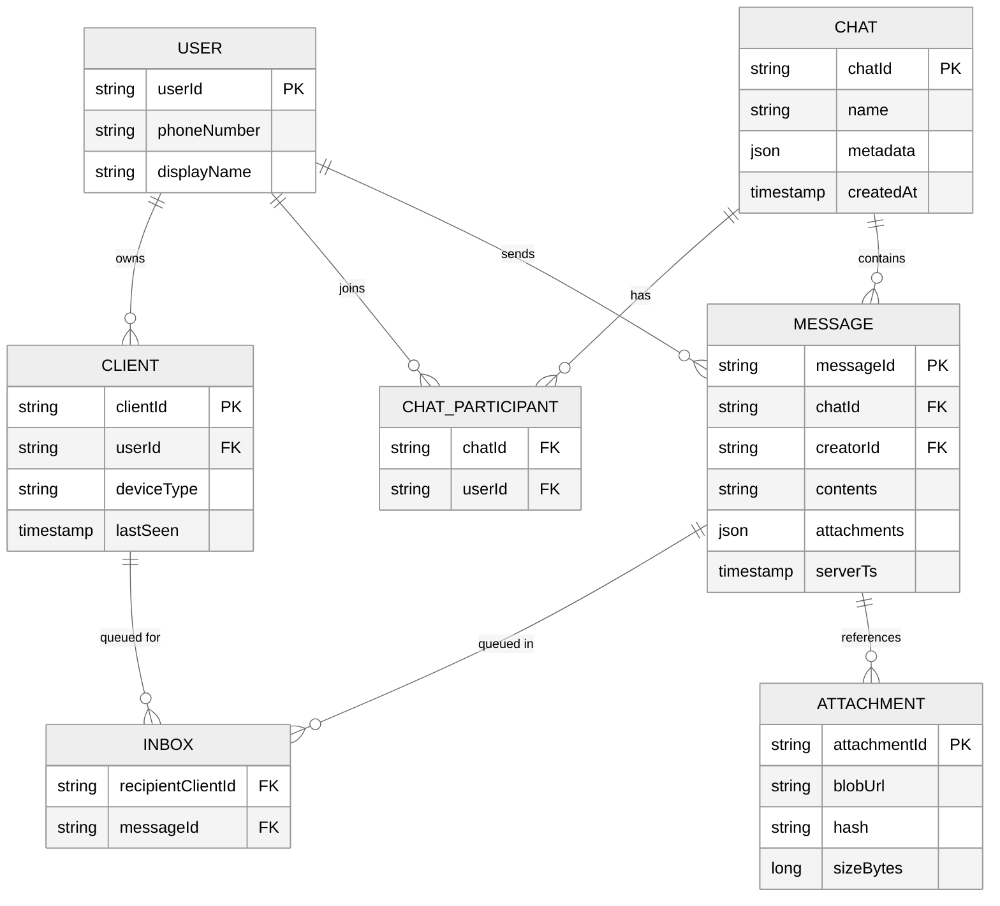

#### Table relationships (how the FKs wire everything together)

| From (child / many side) | FK column | Points to (parent / one side) | Cardinality | Plain English |
|---|---|---|---|---|
| `clients` | `user_id` | `users.user_id` | N : 1 | A user owns many devices; each device belongs to one user. |
| `chat_participants` | `chat_id` | `chats.chat_id` | N : 1 | A chat has many participant rows; each row points to one chat. |
| `chat_participants` | `user_id` | `users.user_id` | N : 1 | A user is in many chats; each row links one user to one chat. |
| `messages` | `chat_id` | `chats.chat_id` | N : 1 | A chat has many messages; each message belongs to exactly one chat. |
| `messages` | `creator_id` | `users.user_id` | N : 1 | A user sends many messages; each message has one sender. |
| `inbox` | `recipient_client_id` | `clients.client_id` | N : 1 | A client has many undelivered messages queued; each Inbox row targets one client. |
| `inbox` | `message_id` | `messages.message_id` | N : 1 | One message can be queued in many clients' Inboxes (group chat fan-out); each Inbox row references one message. |
| `attachments` | `message_id` *(optional)* | `messages.message_id` | N : 1 | A message can carry multiple attachments; each attachment belongs to one message. |

> 🔑 **Rule of thumb:** the foreign key always lives on the **"many" side** of a 1-to-many relationship. To go from the *one* to the *many*, filter that FK (`Query inbox WHERE recipient_client_id = ?`). To go from the *many* to the *one*, do a point lookup on the parent's PK (`GET messages WHERE message_id = ?`).

**Walking the graph (typical traversal paths):**

```
                ┌────────┐
                │ users  │
                └───┬────┘
        ┌───────────┼───────────┐
        │           │           │
        ▼           ▼           ▼
   ┌────────┐  ┌────────────────────┐  ┌──────────┐
   │clients │  │  chat_participants │  │ messages │
   └───┬────┘  └────────┬───────────┘  └────┬─────┘
       │                │                   │
       ▼                ▼                   │
   ┌────────┐      ┌─────────┐              │
   │ inbox  │◀─────┤  chats  │◀─────────────┘
   └────────┘      └─────────┘            chat_id
       ▲ message_id
       │
       └────── points back to messages
```

**Three queries this enables:**

| Question | Traversal |
|---|---|
| "What chats is user U in?" | `chat_participants` filtered by `user_id` → JOIN `chats` on `chat_id`. (Uses the `ChatParticipant-GSI` on DynamoDB.) |
| "Who's in chat C?" | `chat_participants` filtered by `chat_id` → JOIN `users` on `user_id`. |
| "What undelivered messages does device D have?" | `inbox` filtered by `recipient_client_id` → for each row, GET `messages` by `message_id`. |
| "Where do I push a new message?" | `messages.chat_id` → `chat_participants` (fan out to user_ids) → `clients` (fan out to client_ids, write Inbox + publish Pub/Sub `channel:user:<userId>`). |

**Why no FK from `users` directly to `chats`?** Because users and chats are an **M:N relationship** (one user is in many chats, one chat has many users). The `chat_participants` join table breaks the M:N into two 1:N relationships — the standard relational pattern. It also gives us a natural place to store per-participant metadata later (mute status, join timestamp, role, etc.).

#### Why `Inbox` is per-client, not per-user
A user may be online on their phone but offline on their laptop. The phone gets the message immediately; the laptop needs it queued. If `Inbox` were per-user we'd delete the entry on the phone's ack and the laptop would never get it. **One Inbox row per (clientId, messageId)** — delete only when *that* client acks.

### 2.3 API / System Interface

Unlike most products, chat uses a **bi-directional persistent connection (WebSocket over TLS)** because both client and server need to push events with low latency. REST would force constant polling.

> 🔁 **Pattern: Real-Time Updates.** WebSockets give us: 1 TCP connection per client, server-initiated pushes, low overhead, auto-reconnect at the client lib level.

#### Quick aside — what is `WSS`?

`WSS` = **WebSocket Secure** — the WebSocket protocol running over TLS, the same way `HTTPS` is HTTP over TLS. You'll see `-- WSS -->` on every client→server edge in the diagrams below; it's just the encrypted version of `ws://`.

| Scheme | Protocol | Default port |
|---|---|---|
| `ws://`  | WebSocket (plaintext) | 80 |
| `wss://` | WebSocket over TLS    | 443 |

Why we always use WSS (never plain WS) in production chat:

1. **Encryption in transit** — auth tokens, message metadata, and bodies aren't readable on the wire (this is on top of any end-to-end encryption applied to message contents themselves).
2. **Firewall / proxy friendly** — port 443 + TLS handshake looks like HTTPS to corporate proxies, mobile carriers, and middleboxes, so it gets through where custom TCP protocols would be blocked.
3. **One long-lived encrypted TCP socket per client** — the handshake cost (one TLS setup) is amortized over the entire session of pushes, acks, heartbeats, etc.

So whenever a diagram shows `client -- WSS --> chat server`, read it as: "one persistent, TLS-encrypted TCP connection carrying bi-directional JSON frames."

#### Why WebSockets here (and not REST / SSE / long polling)?

The killer requirement is **server → client push** with **< 500 ms latency**. The recipient's app needs to receive a message *the instant* the sender hits send — without the client having to ask "any new messages?" every few seconds. Let's compare the realistic options:

| Option | How it works | Why it loses for chat |
|---|---|---|
| ❌ **REST + short polling** | Client calls `GET /messages` every N seconds. | Tradeoff between latency (poll often → server load + battery drain) and freshness (poll rarely → slow delivery). With 200M users polling every 5s = 40M req/s of mostly-empty responses. |
| ❌ **Long polling** | Client opens an HTTP request; server holds it open until a message arrives, then responds. Client immediately reopens. | Better latency, but every message = new TCP/TLS handshake (~3 round-trips). High overhead, complex on mobile networks with NAT timeouts. |
| ⚠️ **SSE (Server-Sent Events)** | One-way HTTP stream server → client. | Push works! But it's **one-way** — client still needs a *second* channel (REST) to send messages. Two protocols to manage, no built-in client→server back-pressure. |
| ✅✅✅ **WebSocket (chosen)** | One TCP+TLS connection upgraded from HTTP, then **bi-directional binary/text frames**. Stays open for the user's whole session. | One connection carries both directions. ~2 bytes of framing overhead per message (vs. ~500B HTTP headers). Server can push to millions of clients without polling. |

**Concrete wins for our problem:**

1. **Latency**: Server can deliver in ~one RTT (the message frame). No "is there anything new?" round trips.
2. **Battery / data**: Mobile radios burn power waking up for HTTP polls. A kept-alive WebSocket lets the radio sleep between events.
3. **Scale**: One TCP socket per user instead of N requests/sec per user × 200M users.
4. **Symmetric**: Same channel for `sendMessage` (client → server) and `newMessage` (server → client) — including acks, heartbeats, typing indicators, presence — all on one connection.
5. **Firewall friendly**: WSS is on port 443 (looks like HTTPS to corporate proxies / mobile carriers), so it gets through where custom TCP protocols would be blocked.

**What we give up:** WebSocket connections are **stateful** (the chat server holds the socket in memory). That means horizontal scaling is harder than for stateless REST — which is exactly why we need Redis Pub/Sub later in [DD1](#dd1-scaling-to-billions-of-concurrent-users) to route messages between servers.

> 💡 **Real-world note:** WhatsApp actually uses a custom binary protocol over a raw TLS TCP connection (lighter than WebSocket framing), but WebSocket is the standard interview-grade answer and gives the same architectural properties.

#### Commands the client sends to the server

```
// -> createChat
{ "participants": ["u_2", "u_3"], "name": "Family" }
  -> { "chatId": "c_42" }

// -> sendMessage
{ "chatId": "c_42", "message": "hello", "attachmentIds": [] }
  -> { "status": "SUCCESS" | "FAILURE", "messageId": "m_991", "serverTs": "..." }

// -> createAttachment (returns a pre-signed S3 upload URL)
{ "hash": "sha256...", "sizeBytes": 524288, "mimeType": "image/jpeg" }
  -> { "attachmentId": "a_77", "uploadUrl": "https://s3.../?sig=...", "downloadUrl": "https://cdn.../a_77" }

// -> modifyChatParticipants
{ "chatId": "c_42", "userId": "u_9", "operation": "ADD" | "REMOVE" }
  -> "SUCCESS" | "FAILURE"

// -> ack (client confirms a server push was received)
{ "messageId": "m_991" }
  -> "OK"

// -> heartbeat (every 30s — see DD3)
{ "lastSeqByChat": { "c_42": 991, "c_77": 124 } }
  -> { "missing": [ ... ] }
```

#### Commands the server pushes to the client

```
// <- newMessage
{ "messageId": "m_991", "chatId": "c_42", "creatorId": "u_1",
  "message": "hello", "attachments": [], "serverTs": "..." }

// <- chatUpdate
{ "chatId": "c_42", "participants": ["u_1","u_2","u_3"] }

// <- presence (last seen / online)
{ "userId": "u_2", "online": true, "lastSeen": "..." }
```

#### The ack protocol — foundation of "guaranteed delivery"

This is the single most important rule in the whole system, so it deserves its own deep look.

**The problem:** When the server pushes `newMessage` over a WebSocket, it has *no way to know* the client actually received it. The TCP layer says "delivered to the OS buffer" — but the client app might have crashed, the user might have just yanked their phone off Wi-Fi, the OS might have killed the process to free memory. The bytes are gone, and we've already deleted them from our side. **Message lost.**

**The rule:** Every server → client push (`newMessage`, `chatUpdate`, etc.) must be **explicitly acknowledged** by the client. The server only deletes the message from its `Inbox` *after* receiving the ack. Until then, the message stays in the durable Inbox table and will be redelivered after reconnect.

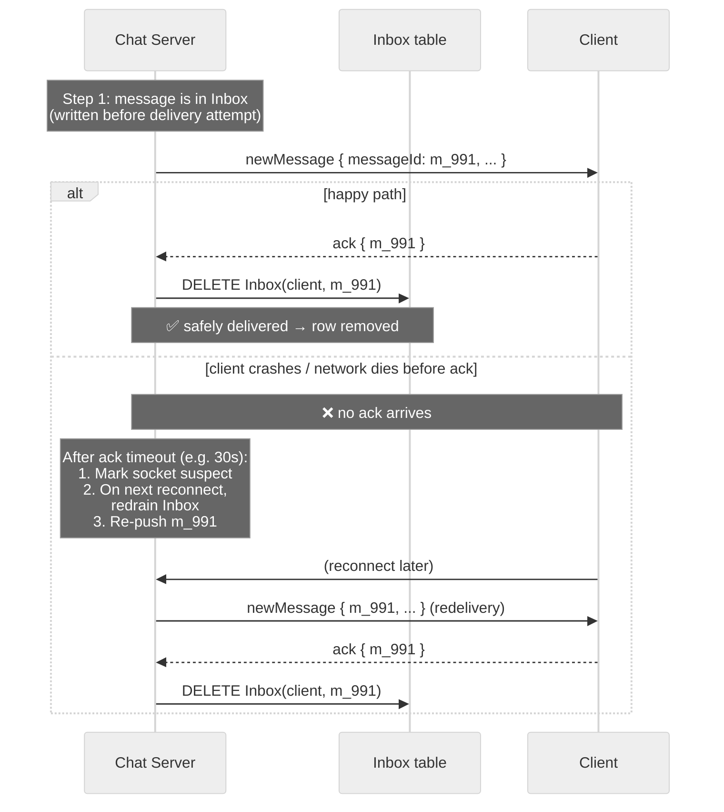

**Why this works (the invariants):**

1. **Inbox first, then push.** The server *always* writes to Inbox before attempting the WebSocket push. That way, even if the server crashes between writing and pushing, the message survives — a fresh chat server will redeliver after reconnect.
2. **Delete only on ack.** Without an ack, the row stays. TTL (30 days) is the absolute cap.
3. **Client dedupes by `messageId`.** Because we may redeliver, the same `messageId` can arrive twice — the client just drops duplicates silently. This is the standard **at-least-once delivery** pattern.

**Failure scenarios this protects against:**

| Scenario | What happens |
|---|---|
| WebSocket suddenly drops mid-push | TCP layer might have buffered the frame, but no ack arrived → Inbox keeps row → redeliver on reconnect. |
| Client app force-quit by OS | Server gets no ack → redeliver next time client opens app. |
| Client received the message but crashed before processing | Same — server has no ack, redelivers. Client dedupes by `messageId` so the user doesn't see it twice. |
| Phone goes offline for a week | All messages accumulate in Inbox. On reconnect, server drains the Inbox in order. |
| Server holding the WS crashes before push | Inbox row already exists (we wrote it first). New chat server picks up on client reconnect and delivers. |

**What this *doesn't* solve:** If the client never reconnects (uninstall, lost phone), the Inbox row sits until the 30-day TTL expires. That's fine — it's the "stored no longer than necessary" non-functional requirement.

> 💡 **Why not use TCP's own delivery guarantee?** TCP only guarantees bytes reach the *kernel* of the receiving machine. It says nothing about whether the application read them, whether the app crashed mid-parse, or whether the user actually saw the message. **App-level acks are the only way to know the client truly received and processed the message.** This is the same reason Kafka has consumer commits, why HTTP has 2xx status codes, and why every reliable messaging system in existence works this way.

> 💡 **Why this is the foundation of "guaranteed delivery":** Combined with the durable Inbox table (NFR #2) and the dedupe-by-`messageId` rule, the ack protocol gives us **at-least-once delivery** — every message reaches every intended client at least once, even through arbitrary network failures, server crashes, and OS-level process kills. Without acks, the best we could do is at-most-once, and chat would be a lot more frustrating.

---

## 3. High-Level Design

We satisfy the functional requirements one at a time. Start with a **single Chat Server** (clearly not production), then evolve in the deep dives.

---

### 3.1 Users can start group chats with multiple participants (limit 100)

#### Components introduced
- **Client** — phone / web / desktop with persistent WebSocket.
- **L4 Load Balancer** — TCP-level; WebSockets don't need L7 routing here, and L4 is cheaper and faster.
- **Chat Server** — stateful (holds WS connections), accepts commands, writes to DB.
- **DynamoDB** — fast K/V for `Chat` and `ChatParticipant` (also `Message`, `Inbox` later).

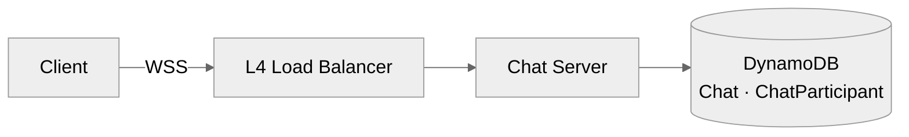

#### Step-by-step flow (what happens when the user creates a group)

1. **User taps "New group"** in the app, picks contacts (≤ 100), types a name, hits *Create*.
2. The client sends `createChat { participants: [...], name: "Family" }` over its already-open **WSS** connection to whichever **Chat Server** the L4 LB pinned it to.
3. The Chat Server validates: caller is authenticated, every `userId` exists, participant count ≤ 100, caller is in the participant list.
4. It generates a `chatId` (UUID) and issues a **single DynamoDB `transactWrite`** that inserts:
   - 1 row in `Chat` (id, name, createdAt, creator)
   - N rows in `ChatParticipant` (one per member)
   This is atomic — either the whole chat exists or none of it does (no half-created groups).
5. On success, the Chat Server replies on the same WSS frame: `{ chatId: "c_42" }`. The sender's UI flips to the new chat screen.
6. The Chat Server then iterates the participant list and, for any participant whose WebSocket it currently holds, pushes a `chatUpdate { chatId, participants }` event — their app shows "You were added to *Family*" instantly.
7. Participants who are **offline** or **on a different chat server** don't get the push now. They'll learn about the chat on next reconnect (their login sync reads `ChatParticipant-GSI` by `userId` and pulls all chats they belong to). Cross-server live notification comes later in [DD1](#dd1-scaling-to-billions-of-concurrent-users) via Redis Pub/Sub.

#### Flow
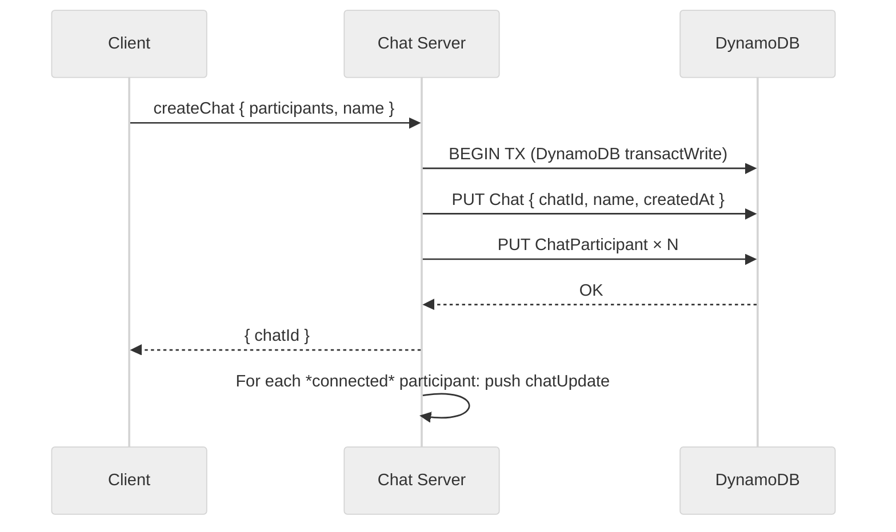

#### DynamoDB table design

For FR1 we only need two tables (a third — a GSI — is just an index on the second). Here's exactly what each row looks like:

**`Chat` — one row per chat (the chat's "header")**

| Attribute | Type | Example | Why |
|---|---|---|---|
| `chatId` *(PK)* | string | `"c_42"` | UUID we generate. Partition key → fast point lookup. |
| `name` | string | `"Family"` | Group name (null for 1:1 chats). |
| `createdAt` | timestamp | `1716700000` | For sorting / audit. |
| `creatorId` | string | `"u_1"` | Who started the chat. |
| `metadata` | JSON | `{ "icon": "...", "isGroup": true }` | Free-form: avatar, settings, mute defaults, etc. |

> 💬 You can think of this row as "everything about the chat *except* who's in it and what's been said." One row total per chat.

**`ChatParticipant` — one row per (chat, member) pair (the membership list)**

| Attribute | Type | Example | Why |
|---|---|---|---|
| `chatId` *(PK)* | string | `"c_42"` | Partition key — all rows for one chat live together. |
| `userId` *(SK)* | string | `"u_7"` | Sort key — uniqueness inside the chat + range scans. |
| `joinedAt` | timestamp | `1716700050` | Useful for "joined the group" system messages. |
| `role` | string | `"member"` \| `"admin"` | Permissions inside the chat. |

So a 5-person group = 1 row in `Chat` + 5 rows in `ChatParticipant`.

**`ChatParticipant-GSI` — same data, indexed the other way**

A GSI (Global Secondary Index) is a *re-indexed copy* of the table maintained by DynamoDB automatically. We need to answer two opposite questions, both fast:

| Question | Direction | Table that serves it |
|---|---|---|
| "Who is in chat `c_42`?" | chatId → userIds | base `ChatParticipant` table (`Query(chatId)`) |
| "What chats is user `u_7` in?" | userId → chatIds | the GSI (`Query(userId)`) |

Without the GSI, the second query would be a full table scan over hundreds of millions of rows.

| Index | Partition key | Sort key |
|---|---|---|
| `ChatParticipant-GSI` | `userId` | `chatId` |

#### Why "key/value" and why DynamoDB?

> 💡 **What "key/value" means here:** every query is a **point lookup or a range scan on a single partition key**. We never do JOINs, aggregations, or `WHERE x AND y AND z`. Everything is "give me chat `c_42`" or "give me all participants where `chatId = c_42`". That access pattern is the cleanest possible fit for a K/V store.

> 💡 **Why DynamoDB specifically?** Predictable single-digit-ms reads/writes, horizontal scale via consistent hashing on the PK, on-demand capacity, TTL built in (needed for Inbox cleanup in [3.3](#33-users-can-receive-messages-sent-while-they-are-not-online-30-days)), and `transactWrite` up to 100 items — perfect for our 100-participant cap (the entire chat + all members commit atomically in one transaction). Cassandra, ScyllaDB, or sharded MySQL would also work; we just don't need anything more sophisticated.

> 💡 **Why L4 not L7?** L7 LBs are great when you need path/header-based routing, body inspection, or HTTP-level features. We need none of that for raw WebSocket frames — L4 is faster, simpler, and supports orders of magnitude more concurrent connections.

---

### 3.2 Users can send/receive messages

Naive version: **assume all participants are online, connected to the same single Chat Server.** We'll demolish this assumption in DD1.

The Chat Server keeps an in-memory map:
```
HashMap<userId, WebSocketConnection>
```

#### Step-by-step flow (what happens when User A types "hello" and hits send)

1. **User A types "hello"** in chat `c_42` and taps send. The client immediately renders the message locally with a "sending" tick (optimistic UI).
2. The client serializes `sendMessage { chatId: "c_42", message: "hello", clientMsgId: "tmp_77" }` and writes it to the **already-open WSS frame** — no new TCP handshake.
3. The L4 LB routes the frame to the Chat Server holding A's WebSocket (same one as always — L4 5-tuple hashing keeps the connection sticky).
4. The Chat Server:
   1. Looks up `ChatParticipant` for `chatId` → `[A, B, C]`.
   2. Generates `messageId`, stamps `serverTs = now()` (NTP-synced).
   3. Returns `{ messageId, serverTs, status: SUCCESS }` to A → A's UI flips the tick from "sending" to "sent".
5. For each recipient (B, C), the Chat Server consults its in-memory `userId → WS` map:
   - **B is connected here** → push `newMessage { messageId, chatId, creatorId: A, message, serverTs }` directly over B's WSS.
   - **C is connected here too** (naive single-host assumption) → same push.
6. B's and C's clients render the message and immediately send back `ack { messageId }` on their own WSS frames.
7. The Chat Server receives the acks. In the naive design there's nothing to clean up because we haven't introduced the Inbox yet — but in [3.3](#33-users-can-receive-messages-sent-while-they-are-not-online-30-days) this is where we'd `DELETE Inbox(client, messageId)`.
8. If an ack doesn't come back within ~30s, the server treats the socket as suspect → the message will be redelivered after reconnect (see [ack protocol](#the-ack-protocol--foundation-of-guaranteed-delivery)).

> 💡 The whole happy-path round trip (A → server → B render → ack) typically takes **80–200 ms** on a healthy mobile network — well under our < 500 ms p99 target.

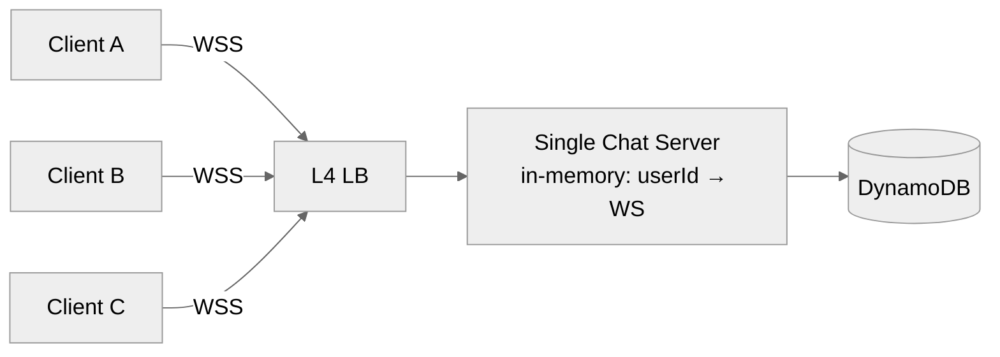

#### Flow
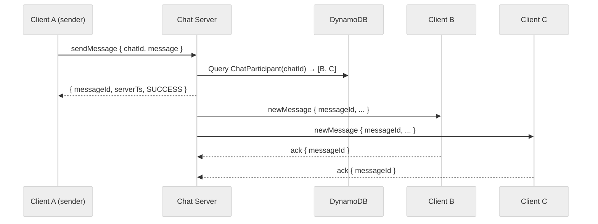

> ⚠️ **Problems with this naive version** (we'll fix in order):
> 1. What if B or C is **offline**? → fixed in [3.3](#33-users-can-receive-messages-sent-while-they-are-not-online-30-days).
> 2. What if B is on **a different Chat Server**? → fixed in [DD1](#dd1-scaling-to-billions-of-concurrent-users).
> 3. What if the **WebSocket is dead but not yet reaped**? → fixed in [DD3](#dd3-websocket-connection-failures).

---

### 3.3 Users can receive messages sent while they are not online (30 days)

Add two new tables: `Message` (durable storage) and `Inbox` (per-client undelivered queue with TTL).

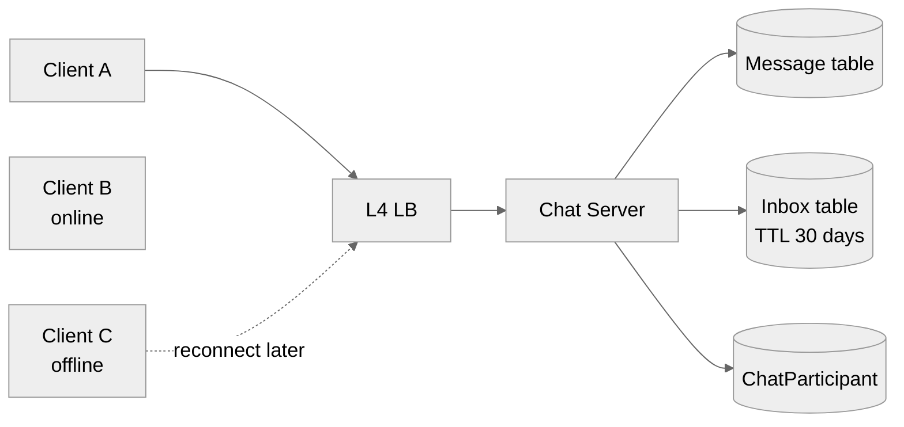

#### Step-by-step flow (what happens when A sends a message and C is offline)

**Send-time (C is asleep, phone in a drawer):**

1. **User A** types and sends as in [3.2](#32-users-can-sendreceive-messages). A's client sends `sendMessage` over WSS.
2. The Chat Server looks up `ChatParticipant(chatId)` → `[A, B, C]`.
3. Before doing anything visible, it **durably persists**:
   - 1 row in `Message { messageId, chatId, contents, serverTs, expiresAt = now + 30d }`
   - 1 `Inbox` row per recipient client: `Inbox(B_phone, messageId)`, `Inbox(C_phone, messageId)`, etc.
   *Durability first* — even if the server dies the next millisecond, the message is safe.
4. Server replies `SUCCESS` to A. A sees the single-tick "sent".
5. The server pushes `newMessage` to B (who's online), B acks, server **deletes the `Inbox(B, messageId)` row**.
6. C is offline — no WS to push to. The `Inbox(C, messageId)` row simply *stays put*, protected by the 30-day TTL.

**Catch-up time (C unlocks their phone hours later):**

1. The WhatsApp app on C's phone opens → its client library does a WSS handshake to the L4 LB, lands on some Chat Server (probably a different one — doesn't matter).
2. After auth, the Chat Server immediately runs `Query Inbox WHERE recipientClientId = C_phone` → gets back `[m1, m2, m3, ...]` (every message C missed, oldest first).
3. For each missing message: `GET Message(mX)` → push `newMessage` to C → wait for ack → `DELETE Inbox(C, mX)`.
4. C's app renders the backlog in `serverTs` order. From the user's perspective: "opened phone, all my messages arrived."
5. If C never comes back (phone lost, uninstall), the Inbox rows expire after 30 days via DynamoDB TTL — satisfying the "stored no longer than necessary" NFR automatically, no cron job needed.

> 💡 Notice the **per-client** Inbox: if C has both a phone and a laptop, there are two separate Inbox rows for the same message. The phone's row gets deleted when the phone acks; the laptop's row survives until the laptop comes online and acks separately. This is why [DD2](#dd2-multiple-clients-per-user-multi-device) makes per-client (not per-user) Inbox a hard requirement.

#### Send flow (mixed online + offline recipients)
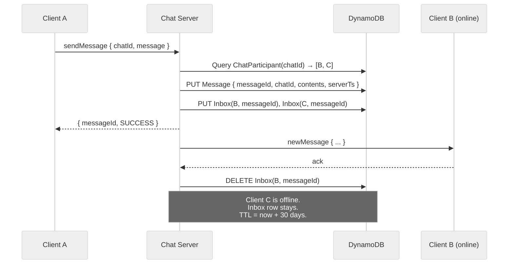

#### Reconnect / catch-up flow
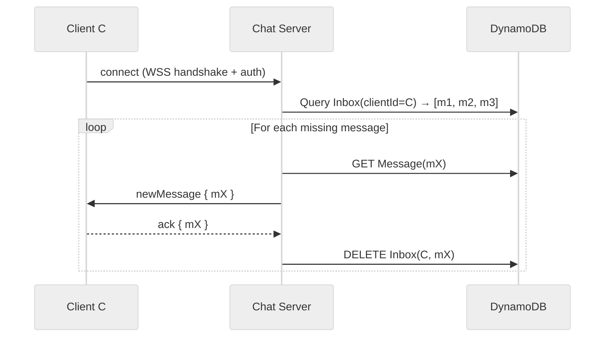

#### Table additions

| Table | PK | SK | TTL field | Notes |
|---|---|---|---|---|
| `Message` | `messageId` | — | `expiresAt = serverTs + 30d` | Single row per message; durable. |
| `Inbox`   | `recipientClientId` | `messageId` | `expiresAt` | One row per undelivered (client, msg). Deleted on ack. |

#### Write amplification check
- 1:1 chat: 1 `Message` PUT + 1 `Inbox` PUT (recipient only) = **2 writes**.
- 100-person group: 1 `Message` PUT + up to 100 `Inbox` PUTs = **up to 101 writes** (only for offline-on-some-client recipients; online ones never write Inbox… well, we *do* still write it, then ack immediately deletes — see optimization below).

> 💡 **Optimization (interviewer follow-up):** Skip Inbox writes for clients that are currently connected to *this* chat server — push first, only write Inbox if push fails. Halves write volume in the common case. Trade-off: more complex error handling and you give up the "Inbox is the durable source of truth" property.

> 💡 **Should we store message content in Inbox to avoid a second lookup?** Discussed in the appendix. For small text messages, **yes** — co-locate to save a round-trip on catch-up; for media-heavy messages, store a reference and resolve from `Message`.

---

### 3.4 Users can send/receive media

Media is **bandwidth- and storage-heavy** — terrible fit for the Chat Server (it would saturate the WebSocket and crush DynamoDB write costs). Use **purpose-built blob storage** instead.

> 🔁 **Pattern: Out-of-Band Uploads** — control plane (Chat Server) coordinates; data plane (S3 + CDN) carries the bytes.

#### Step-by-step flow (what happens when A sends a photo to B)

1. **User A picks a photo** from their gallery. The client computes a **SHA-256 hash** locally and reads the file size + MIME type.
2. Client calls `createAttachment { hash, sizeBytes: 524288, mimeType: "image/jpeg" }` over WSS.
3. Chat Server:
   1. Checks dedup: is any existing `Attachment` row already pointing at this hash? If yes → reuse its `blobUrl`, skip the upload (saves bandwidth + storage for forwarded memes).
   2. Otherwise creates `attachmentId`, writes an `Attachment` row with `status = pending`, generates a **pre-signed S3 PUT URL** (valid ~15 min, restricted to this exact key + content-length + hash).
4. Server replies `{ attachmentId, uploadUrl, downloadUrl }`.
5. **Client A uploads the bytes directly to S3** with an HTTP PUT to `uploadUrl`. The Chat Server is not in the data path — its CPU and bandwidth are untouched. S3 verifies the hash matches what was pre-signed.
6. On upload success, A's client calls `sendMessage { chatId, message: "check this out", attachmentIds: [attachmentId] }`.
7. Chat Server writes `Message` + `Inbox` rows as in [3.3](#33-users-can-receive-messages-sent-while-they-are-not-online-30-days). The `Message` row carries the `attachmentIds` array; it does *not* carry the bytes.
8. Push `newMessage` to B with the `downloadUrl` embedded. B's client receives the JSON frame instantly (~few KB).
9. **B's client fetches the image from the CDN** (`downloadUrl`), not from our infrastructure. The CDN caches it at the edge — when B's groupmates open the same chat, they hit the cache (huge win for forwarded media).
10. B's UI shows a thumbnail/loading placeholder while the CDN fetch is in flight, then the full image. Acks the `newMessage` over WSS as usual; Chat Server deletes `Inbox(B, messageId)`.

> 💡 **Why split into two calls (`createAttachment` then `sendMessage`)?** Because the upload might take seconds (large video on a slow network) while we want `sendMessage` to be instant. The user might also cancel mid-upload — easier to clean up an orphan `Attachment` row (a background job sweeps `status = pending` older than 1 hour) than to roll back a half-sent message.

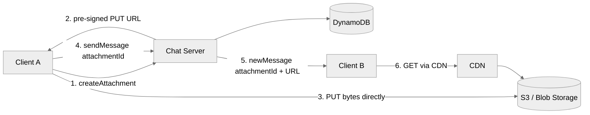

#### Flow
1. **Client A** wants to send a photo. It calls `createAttachment { hash, sizeBytes, mimeType }`.
2. **Chat Server** allocates an `attachmentId`, writes an `Attachment` row (status = `pending`), and returns a **pre-signed S3 PUT URL** + the public CDN download URL.
3. **Client A uploads directly to S3** — bytes never touch our Chat Server. The hash lets us dedupe on the server side.
4. Once upload finishes, Client A calls `sendMessage { chatId, message, attachmentIds: [a_77] }`.
5. Chat Server fans out `newMessage` with the CDN download URL embedded.
6. **Client B fetches the image from the CDN** — again, not from our servers. The CDN caches it at the edge for further viewers (perfect for group chats).

#### Why this design wins
| Approach | Verdict |
|---|---|
| ❌ **Bad** — store the bytes in DynamoDB | Massive cost, 400KB row limit, blows up replication. |
| ❌ **Bad** — stream bytes through Chat Server to S3 | Doubles bandwidth bill; chat server becomes a bottleneck for media. |
| ✅✅✅ **Great (chosen)** — pre-signed URL: client uploads & downloads directly via S3 + CDN | Chat Server stays light (control plane only); bandwidth scales independently; edge caching for popular media. |

> 💡 **End-to-end encryption (E2EE) note:** In real WhatsApp the client encrypts the media with a one-time symmetric key *before* upload, and sends the key in the (E2EE) message. The server stores only ciphertext. Same architecture; just add a client-side encrypt step before the S3 PUT.

---

## 4. Deep Dives

The single-host design works on paper but breaks under our non-functional requirements. We now address them one at a time.

---

### DD1: Scaling to billions of concurrent users

**Problem:** A single Chat Server holds maybe 1–2M WebSocket connections (Erlang/BEAM benchmark from real WhatsApp). With ~200M concurrent users we need **~130 Chat Servers**. As soon as we have >1 server, the in-memory `userId → WS` map breaks: User A on server S1 can't reach User B on server S2.

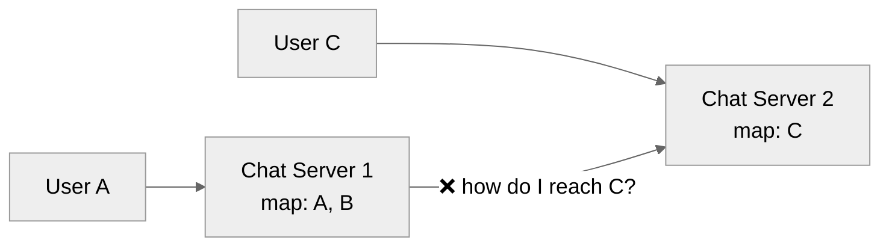

> 🔁 **Pattern: Real-Time Updates → Routing.**

#### Options considered

| Option | Verdict |
|---|---|
| ❌ **Bad** — broadcast every message to every chat server | O(N²) chatter; melts the network. |
| ❌ **Bad** — Kafka topic per user | Kafka tops out around tens of thousands of topics. 200M topics = no. |
| ✅ **Good** — Consistent hashing + chat registry in etcd/ZooKeeper | Works; chat servers look up "who owns user X" then forward. Complex on rebalance / node failure. |
| ✅✅✅ **Great (chosen)** — **Redis Pub/Sub channel per `userId`** | Redis treats channels as lightweight pointers in RAM → millions of channels are fine. Decoupling means chat servers don't need to know each other. |

#### Chosen design — Redis Pub/Sub fan-out

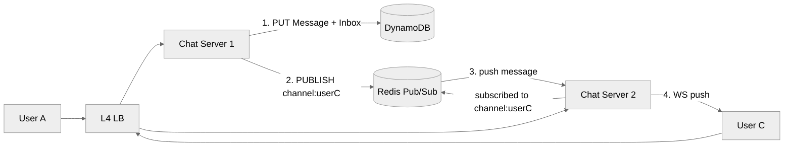

#### Flow
1. When **User C** connects to **Chat Server 2**, S2 calls `SUBSCRIBE channel:user:C` on Redis.
2. **User A** (on S1) sends a message to a chat containing C.
3. S1 writes `Message` + `Inbox(C, msgId)` to DynamoDB (durability first).
4. S1 calls `PUBLISH channel:user:C { newMessage payload }`.
5. Redis delivers to **whichever chat server(s) are subscribed** to that channel — here, S2.
6. S2 pushes the message over C's WebSocket. C acks → S2 deletes from Inbox.

> 💡 **Why per-user channels and not per-chat?** WhatsApp is dominated by **1:1 chats** with a 100-user cap on groups. A typical user is in hundreds of 1:1 chats but only a handful of large groups. Per-user channels minimize fan-out: each chat server subscribes to ~1.5M user channels (one per connected client), not millions of chat channels.
>
> For *large* groups (e.g. >25 users), switch adaptively to **per-chat channels** so we don't fan out the same message to 100 user channels. This is the "celebrity problem" senior interviewers love.

#### What about durability? Pub/Sub is "at most once"

Redis Pub/Sub **does not store** messages. If no subscriber is connected at publish time, the message is gone. That's why we **write to `Inbox` *before* publishing** — Pub/Sub is the fast path; Inbox is the durable backstop. When a chat server's Redis subscription hiccups, the next reconnect + inbox drain delivers the message.

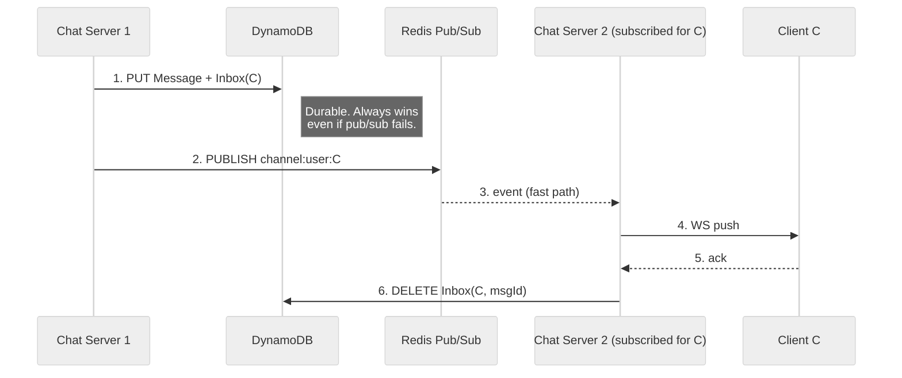

> 💡 **Why not Kafka?** Kafka is overkill: we want **fan-out push**, not a durable log. Kafka's strong ordering and replay are great for analytics; here they'd add latency. Plus Kafka caps out around tens of thousands of topics; Redis Pub/Sub channels are essentially free in RAM.

#### Bonus — connection placement and load balancing
- L4 LB does plain TCP round-robin or 5-tuple hashing.
- A separate **Chat Registry** (etcd) maps `clientId → chatServerId` so other parts of the system (e.g. presence service) can find where a user is connected. Updated on connect/disconnect.
- For >10M connections per region, use **DNS-based LB across multiple L4 LBs** (hardware LBs cap around 10M conns).

---

### DD2: Multiple clients per user (multi-device)

**Problem:** A user has a phone + laptop + tablet. If the phone receives a message and acks, the user-level Inbox entry is deleted — and the laptop never gets it when it wakes up.

#### Changes
1. New table `Client { clientId, userId, deviceType, lastSeen }` (cap **3 clients per account** to bound storage).
2. Switch `Inbox` from per-user to **per-client**: PK = `recipientClientId`.
3. On `sendMessage`: look up *all* clients for each recipient and write an Inbox row per (client, message).
4. On Pub/Sub: chat servers still subscribe to **`channel:user:<userId>`** — when a server receives, it pushes to *every WS* it holds for that user (across that user's clients connected here).

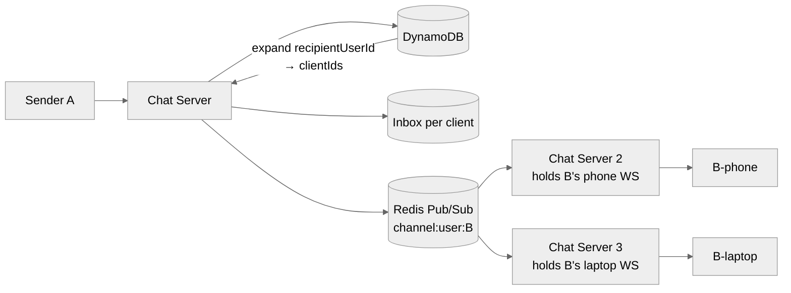

> 💡 Each client acks independently. The Inbox row for the laptop survives until the laptop comes online — even if the phone already received it.

> 💡 **Deactivation:** A `Client.lastSeen` older than (say) 30 days → mark inactive and stop writing to its Inbox. Otherwise an abandoned device's Inbox grows forever.

---

### DD3: WebSocket connection failures

**Problem:** Users sit on flaky networks (subway, elevator, bad Wi-Fi). The TCP socket might *look* open while actually being dead. TCP keep-alive defaults are minutes — way too slow for chat. If we keep pushing to a dead socket we lose messages.

#### Options considered

| Option | Verdict |
|---|---|
| ❌ **Bad** — rely on TCP timeouts | Minutes of latency before we detect death. |
| ✅ **Good** — server-side retry with ack timeout (resend if no ack in N sec) | Improves delivery, doesn't detect dead conns. |
| ✅✅✅ **Great (chosen)** — **Application-level heartbeats every ~30s** + ack timeouts + Inbox as backstop | Detects dead sockets in seconds; safe retries; nothing lost. |

#### Heartbeat protocol
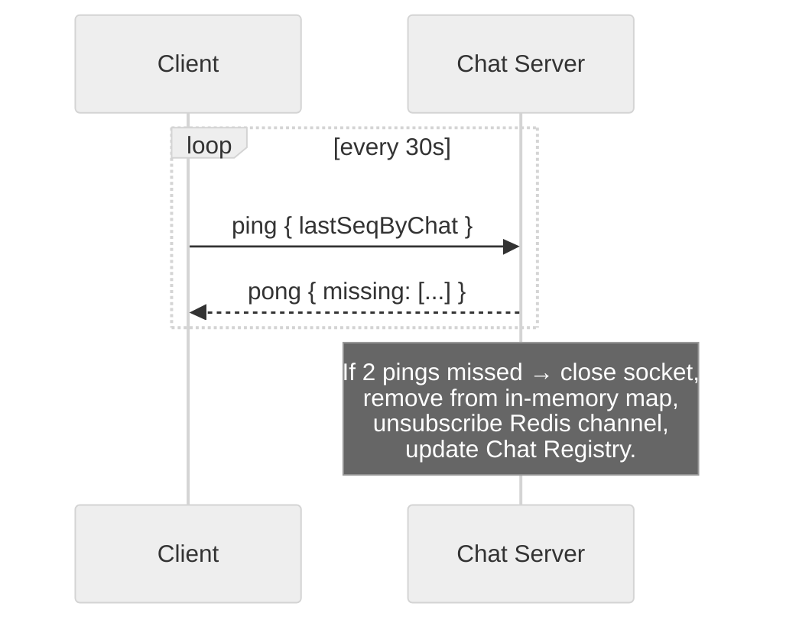

- Client sends `ping` every 30s; server responds with `pong`.
- 2 missed pings → server declares socket dead, releases resources.
- On reconnect (client logic), client drains its Inbox and resyncs.
- Bonus: `ping` carries `lastSeqByChat` (highest seq the client has seen per chat) → server can detect *missed messages* and resend them in `pong`. Doubles as DD4's solution.

---

### DD4: Redis Pub/Sub drops a message

**Problem:** Pub/Sub is at-most-once. If a chat server's Redis connection blips for 200 ms during a publish, that message is gone from the fast path. The Inbox guarantees eventual delivery, but how do we deliver it *quickly* to a client that's currently connected?

#### Options considered

| Option | Verdict |
|---|---|
| ✅ **Good** — periodic polling of Inbox (every N seconds) | Simple backstop, adds latency. |
| ✅ **Good** — sequence numbers per chat with client-side gap detection | Client notices gap, asks for missing. |
| ✅✅✅ **Great (chosen)** — **piggyback last-seen seq on heartbeat** | No extra round-trips; server resends gaps in `pong`. |

#### Sequence-number scheme
- Server stamps each message in a chat with a **monotonically increasing `seq`** (per chat).
- Client tracks `maxSeq` per chat locally.
- Every heartbeat: client sends `{ chatId → maxSeq }`.
- Server compares against actual max in DB; any gap → resend missing messages on the response.

> 💡 In practice production systems **combine all three**: heartbeats detect dead sockets, sequence numbers catch missing messages, periodic Inbox poll is the ultimate backstop. Defense in depth.

---

### DD5: Out-of-order messages

**Problem:** In a distributed system, messages can arrive at the server in a different order than they were sent. Forcing strict order requires buffering + delay (think Flink watermarks) — and users would rather see a new message immediately than wait for perfect ordering.

#### Solution: server-stamped timestamp + client-side sort

- All chat servers sync clocks via **NTP**.
- Each message is stamped `serverTs` on ingestion.
- Clients **display** messages ordered by `serverTs`.
- Result: **consistent ordering across all clients** (everyone sees the same order, even if it differs from physical send order).
- Occasionally a message will "pop in above" another — users find this acceptable (every chat app does this).

> 💡 Per-chat sequence numbers (from DD4) provide *gap detection*, not strict ordering. They're orthogonal: seq for "did I miss any?", timestamp for "what order to display?".

---

### DD6: "Last seen" / presence

**Problem:** Show "last seen 5 min ago" / "online now" without exploding DynamoDB writes (every heartbeat × 200M users = 200M/30s ≈ 7M writes/sec just for presence — absurd).

#### Options considered

| Option | Verdict |
|---|---|
| ❌ **Bad** — write `lastSeen` to DynamoDB on every heartbeat | 7M writes/sec for a cosmetic feature. No. |
| ✅✅✅ **Great (chosen)** — **derive presence from live WS connections + Redis cache** | Source of truth = "is there an open WS?". Cached snapshot for offline queries. |

#### Design
- A user is **online** iff at least one chat server holds an open WS for any of their clients.
- Each chat server periodically (e.g. every 60s) writes the set of `userIds` it has open to a Redis `SET presence:online` (or a sharded sorted-set with timestamps).
- On disconnect: server removes from the set and writes `lastSeen = now()` to a **Redis hash** (NOT DynamoDB).
- Periodically (e.g. every 5 min) flush the Redis `lastSeen` hash to DynamoDB so the data survives Redis restarts.
- Presence query: `GET presence:user:<id>` → Redis answers in <1ms.

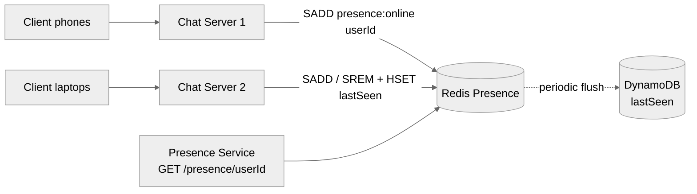

> 💡 Trade-off: a chat server crash could leak "online" entries for up to 60s until they expire. Acceptable for a cosmetic feature.

---

## 5. Final Architecture

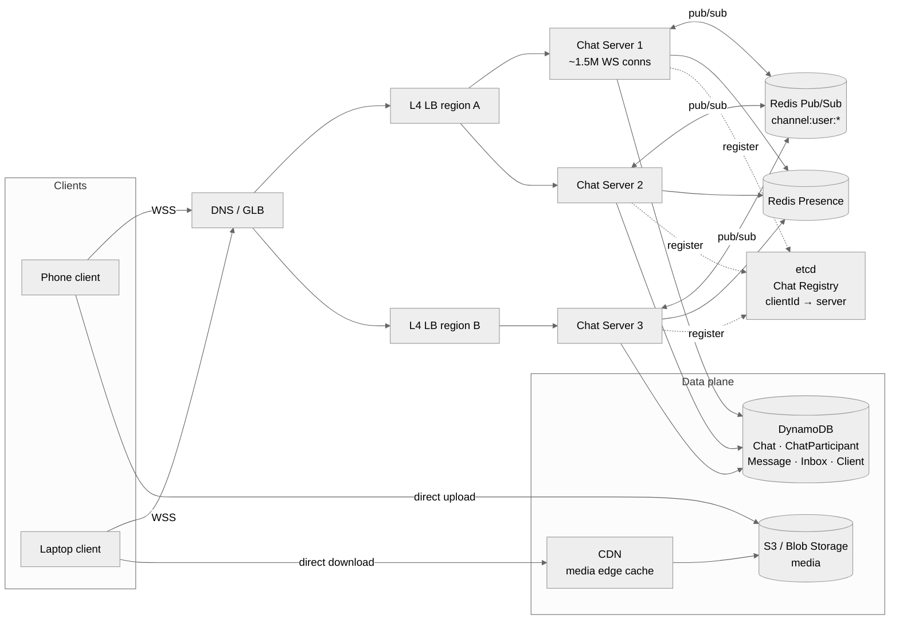

### Summary of choices

| Concern | Choice | Why |
|---|---|---|
| Transport | **WebSocket over TLS** | Bi-directional push; one TCP conn per client. |
| Load balancer | **L4** | No L7 features needed; cheaper, more conns/host. |
| Chat server | **Stateful, in-memory WS map** | Performance — keep hot path in RAM. |
| Storage | **DynamoDB** | Predictable K/V latency, TTL built in, scale-out. |
| Fan-out | **Redis Pub/Sub, channel per user** | Lightweight, millions of channels feasible. |
| Durability | **Inbox table written *before* publish** | Pub/Sub is at-most-once; Inbox is the backstop. |
| Multi-device | **Per-client Inbox + Client table (cap 3)** | Each device acks independently. |
| Dead conns | **App-level heartbeats every 30s** | Detect in seconds, not minutes. |
| Missed messages | **Per-chat seq # piggybacked on heartbeat** | Zero extra round-trips. |
| Ordering | **NTP + server-stamped timestamp, client sorts** | Good enough for chat; avoids costly buffering. |
| Media | **Pre-signed S3 PUT + CDN GET** | Bytes never touch chat servers. |
| Presence | **Redis live-conn set + periodic DB flush** | Avoids 7M writes/sec to durable store. |
| Routing registry | **etcd** | Strongly consistent K/V for `clientId → server`. |

---

## 6. What Is Expected at Each Level

### Mid-level (E4)
- ~80% breadth, 20% depth.
- Clear API + entities.
- Functional HLD for create-chat + send/receive + offline delivery + media.
- Knows the single-host design is unscalable; can articulate at least one scaling direction.

### Senior (E5)
- ~60% breadth, 40% depth.
- Speeds through HLD; spends time on:
  - **Routing / fan-out** (Redis Pub/Sub vs consistent hashing — pros/cons).
  - **Multi-device** with per-client Inbox.
  - **Failure modes** of WebSockets and Pub/Sub.
- Can articulate trade-offs (Kafka topic-per-user vs Redis channel-per-user, partition by user vs chat).

### Staff+ (E6+)
- ~40% breadth, 60% depth.
- Drives 2–3 deep dives end-to-end:
  - Adaptive partitioning for large chats (celebrity problem).
  - Cell-based / regional architecture for fault isolation.
  - End-to-end encryption integration (Signal protocol sketch).
  - Hard limits: L4 LB connection caps, Redis cluster sharding for Pub/Sub at 200M channels.
- Brings real production judgment — knows where the actual operational pain is.

---

## 7. Appendix — Common Interviewer Follow-Ups

Questions an interviewer is very likely to ask. Have a 1-minute answer ready for each.

### Connections & Routing
1. **Why WebSockets and not long polling or SSE?** → Bi-directional + low overhead. SSE is one-way (server→client); polling wastes mobile battery and adds latency.
2. **Why L4, not L7?** → No need for path/header routing on raw WS frames. L4 supports orders of magnitude more concurrent connections.
3. **How many WS connections per chat server?** → ~1–2M with Erlang/BEAM (real WhatsApp). With Java/Netty, ~250K–500K is more realistic. → ~130–800 chat servers for 200M concurrent.
4. **Why Redis Pub/Sub channel-per-user and not Kafka topic-per-user?** → Kafka tops out at tens of thousands of topics; Redis channels are lightweight pointers in RAM — millions are fine.
5. **What if a user is in a chat with someone whose chat server is far away?** → Pub/Sub delivers cross-server; latency is bounded by the inter-server hop, not the chat server's load.

### Durability & Delivery Guarantees
6. **What's your delivery guarantee?** → **At-least-once**. Inbox + ack ensures eventually delivered; duplicates are deduped on the client by `messageId`.
7. **Why write Inbox *before* publishing to Pub/Sub?** → Pub/Sub is at-most-once. If we publish first and the chat server crashes, the message is lost. Inbox first = durable; Pub/Sub is the fast path.
8. **What happens if DynamoDB is down?** → `sendMessage` returns FAILURE → client retries. We prefer correctness over availability for the write path (a chat that lies about sending is worse than one that asks the user to retry).

### Multi-Device & Sync
9. **How does my new laptop catch up on history when I install WhatsApp?** → On first connect, server queries `ChatParticipant-GSI` for all chats, then for each chat returns recent messages (paginated). Inbox handles undelivered ones.
10. **Why per-client Inbox not per-user?** → A user has multiple devices that may be offline independently. Per-user Inbox would delete the row on the first device's ack — other devices would never receive it.
11. **Why cap clients at 3?** → Bounds Inbox storage and Pub/Sub fan-out. Real WhatsApp also caps device count for similar reasons.

### Scale
12. **How would you scale Redis Pub/Sub to 200M channels?** → Sharded Redis cluster; route channel by consistent hashing on `userId`. Each chat server connects to all shards but only subscribes to channels for users it holds.
13. **What about hot users (celebrities) with millions of subscribers?** → Out of scope here (WhatsApp caps groups at 100). For Twitter-like fan-out, you'd switch to pull-based for celebrities.
14. **What if a chat server fails?** → All its WS conns drop; clients auto-reconnect (likely to a different server). Inbox + sequence numbers ensure no message loss. Redis subscriptions on the dead server are orphaned and reaped by Redis client TTL.

### Storage & Cost
15. **Why store message content in Inbox vs. just `messageId`?** → For small text, **co-locate** to avoid a second random-access read on catch-up. For media-heavy or large messages, store reference. Hybrid is common.
16. **30-day retention — how do you delete?** → DynamoDB TTL on `expiresAt`. Background process scrubs expired rows asynchronously, no manual cron.
17. **How much storage at steady state?** → 4B msgs/day × 100B × 30d ≈ 12 TB hot. Inbox is much smaller (most messages drain within seconds).

### Failures & Edge Cases
18. **What if the user is on a flaky network mid-conversation?** → Heartbeats detect dead socket in ~60s. Client reconnects, server sees the gap in the Inbox + seq, resends.
19. **What if Redis fan-out misses one server?** → Inbox is still written. That server's clients catch up via the next heartbeat (gap detection) or via Inbox poll on reconnect.
20. **How do you prevent duplicate delivery?** → Client dedupes by `messageId`. Server may resend if ack times out — client just drops the dup silently.
21. **What about ordering across servers?** → Server-stamped `serverTs` + NTP. Clients display by timestamp. Occasional out-of-order display is acceptable.

### Beyond the Core Design
22. **How does end-to-end encryption fit?** → Client encrypts message body with per-session key (Signal protocol / double ratchet). Server stores ciphertext only. Metadata (chatId, senderId, timestamp) stays plaintext for routing.
23. **How would you add typing indicators / read receipts?** → Same Pub/Sub channels; ephemeral events that don't write to Inbox (lossy is fine). Read receipts are just another message type.
24. **How do you support message edits / deletes?** → New message kinds: `editMessage`, `deleteMessage`. Fan out same as a regular message; clients apply mutations to their local copy. Server replaces the `Message` row.
25. **Regional / cell-based architecture?** → Pin a user (and their chats) to a home region for write affinity. Cross-region chats: messages tagged for replication. Disaster failover: secondary region takes over with eventually-consistent state.
26. **What metrics would you monitor?** → WS connection count per server, Pub/Sub publish→deliver lag, Inbox depth (alarms if growing), ack timeout rate, p99 send→deliver latency, heartbeat-miss rate.

---

## Appendix — Patterns Touched

| Pattern | Used For |
|---|---|
| **Real-Time Updates** | WebSockets, Pub/Sub fan-out, heartbeats. |
| **At-Least-Once Delivery** | Inbox + ack + idempotent client dedup. |
| **Out-of-Band Uploads** | Pre-signed S3 URLs for media. |
| **Stateful Fan-Out** | Chat servers hold WS state; Pub/Sub bridges them. |
| **Eventual Consistency** | Presence, last-seen, multi-device sync. |
| **Routing via Registry** | etcd `clientId → chatServerId`. |
| **TTL-based Cleanup** | DynamoDB TTL on Inbox + Message. |
