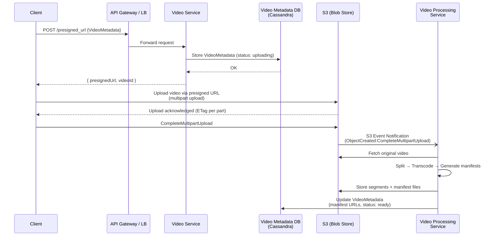
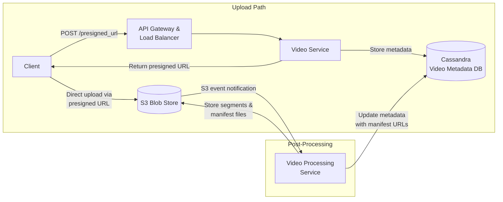
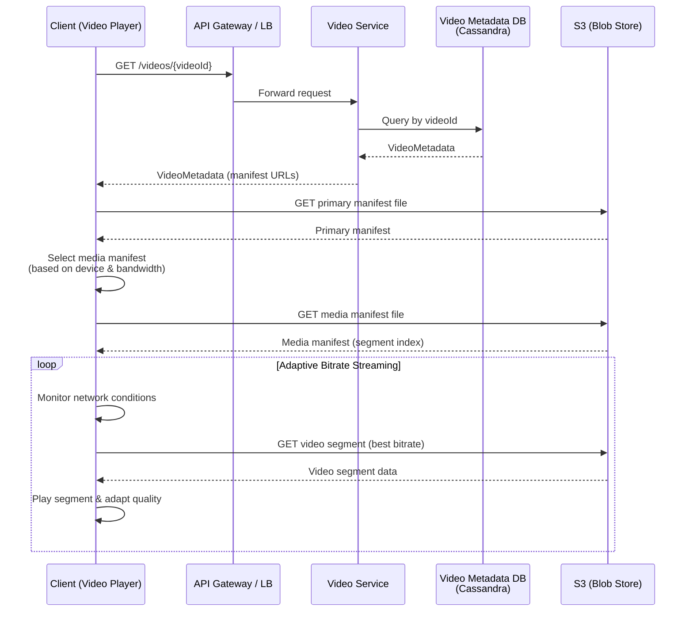
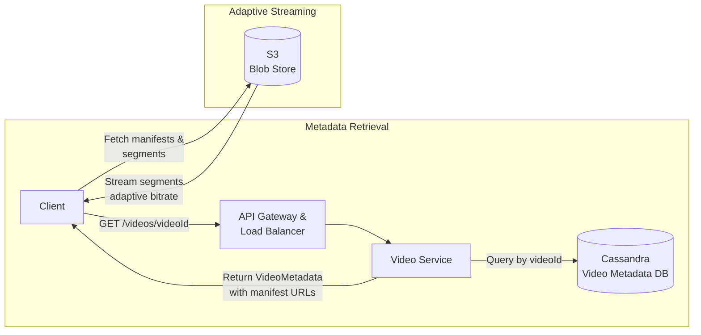
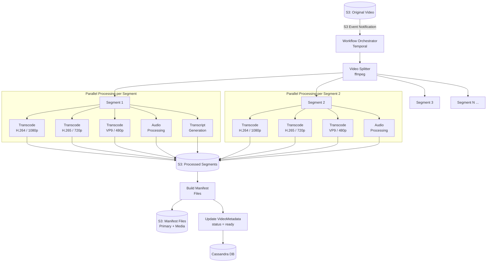
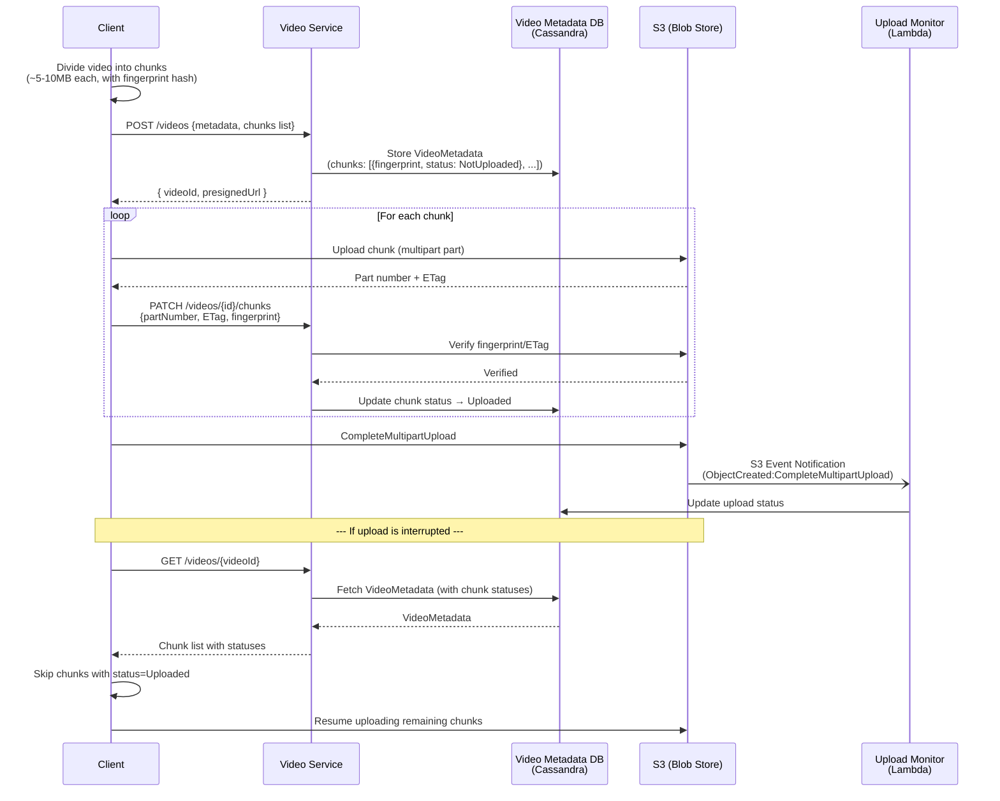
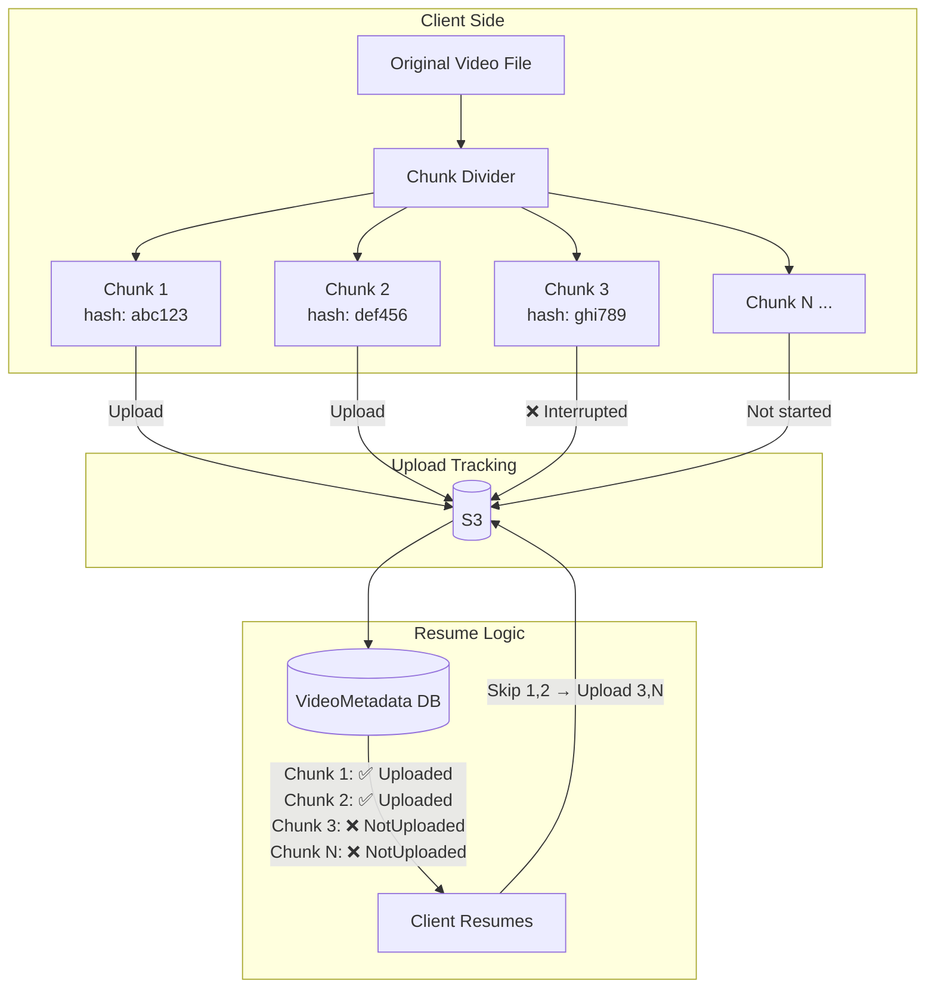
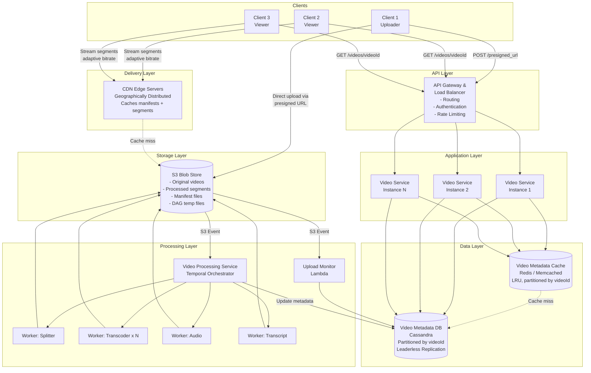
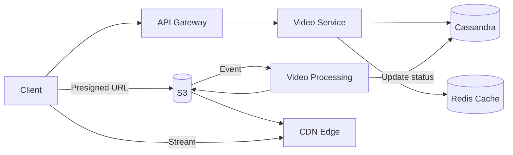

# YouTube System Design

> **Difficulty:** Hard
> **Asked at:** Amazon, Datadog, Meta, Snapchat, and more
> **Patterns Used:** Handling Large Blobs, Scaling Reads

---

## Table of Contents

- [Overview](#overview)
- [Functional Requirements](#functional-requirements)
- [Non-Functional Requirements](#non-functional-requirements)
- [The Set Up](#the-set-up)
  - [Planning the Approach](#planning-the-approach)
  - [Core Entities](#core-entities)
  - [API Design](#api-design)
- [High-Level Design](#high-level-design)
  - [Background: Video Streaming Fundamentals](#background-video-streaming-fundamentals)
  - [1. Users Can Upload Videos](#1-users-can-upload-videos)
  - [2. Users Can Watch (Stream) Videos](#2-users-can-watch-stream-videos)
- [Deep Dives](#deep-dives)
  - [1. Video Processing for Adaptive Bitrate Streaming](#1-video-processing-for-adaptive-bitrate-streaming)
  - [2. Resumable Uploads](#2-resumable-uploads)
  - [3. Scaling to High Traffic](#3-scaling-to-high-traffic)
  - [Additional Deep Dives](#additional-deep-dives)
- [Final Architecture Summary](#final-architecture-summary)
- [What is Expected at Each Level?](#what-is-expected-at-each-level)
- [Key Takeaways](#key-takeaways)
- [Interview Q&A — Frequently Asked Questions](#interview-qa--frequently-asked-questions)

---

## Overview

YouTube is a video-sharing platform that allows users to upload, view, and interact with video content. As of today, it is the **second most visited website in the world**. This design focuses on the core video-sharing aspects: **uploading** and **streaming** videos.

There is significant conceptual overlap between this question and designing **Dropbox**, particularly around file upload/download patterns. Understanding those fundamentals is helpful before diving into this problem.

---

## Functional Requirements

### Core Requirements (In Scope)

1. **Users can upload videos.**
2. **Users can watch (stream) videos.**

### Below the Line (Out of Scope)

- Users can view information about a video, such as view counts.
- Users can search for videos.
- Users can comment on videos.
- Users can see recommended videos.
- Users can make a channel and manage their channel.
- Users can subscribe to channels.

> **Note:** This question is mostly focused on the video-sharing aspects of YouTube. If you're unsure what features to focus on for a feature-rich app like YouTube, have a brief back-and-forth with the interviewer to figure out what part of the system they care the most about.

---

## Non-Functional Requirements

### Core Requirements (In Scope)

1. **High Availability** — Prioritize availability over consistency.
2. **Support large videos** — Handle uploads of 10s of GBs.
3. **Low latency streaming** — Even in low bandwidth environments.
4. **High scale** — ~1M videos uploaded per day, ~100M videos watched per day.
5. **Resumable uploads** — Allow users to resume interrupted uploads.

### Below the Line (Out of Scope)

- Protection against bad content in videos.
- Protection against bots or fake accounts.
- Monitoring and alerting.

> Given the small number of functional requirements, the non-functional requirements are **even more important** to pin down. They characterize the complexity of these deceptively simple "upload" and "watch" interactions. Enumerating these challenges is important, as it will deeply affect your design.

---

## The Set Up

### Planning the Approach

Before designing the system, plan your strategy:

- Build the design **sequentially**, going one by one through your functional requirements.
- This helps you stay focused and ensures you don't get lost in the weeds.
- Once you've satisfied the functional requirements, rely on your **non-functional requirements** to guide the deep dives.

### Core Entities

Start with a broad overview of the primary entities. At this stage, it is not necessary to know every specific column or detail. We will focus on these intricacies later when we have a clearer grasp of the system (during the high-level design). Initially, establishing these key entities will guide our thought process and lay a solid foundation as we progress towards defining the API.

For YouTube, the primary entities are straightforward:

| Entity | Description |
|---|---|
| **User** | A user of the system — either an uploader or viewer. |
| **Video** | A video that is uploaded/watched (the actual binary data). |
| **VideoMetadata** | Metadata associated with the video — uploading user, URL reference to a transcript, S3 URLs, etc. We'll go into more detail later about what specifically we'll be storing here. |

> In the actual interview, this can be as simple as a short list like this. Just make sure you talk through the entities with your interviewer to ensure you are on the same page.

### API Design

The API is the primary interface that users will interact with. We need an endpoint for each functional requirement.

#### Upload a Video

```
POST /upload
Request:
{
  Video,
  VideoMetadata
}
```

#### Stream / Watch a Video

```
GET /videos/{videoId} -> Video & VideoMetadata
```

> **Important:** Your APIs may change or evolve as you progress. In this case, our upload and stream APIs actually evolve significantly as we weigh the trade-offs of various approaches in our high-level design (more on this later). Proactively communicate this to your interviewer: *"I am going to outline some simple APIs, but may come back and improve them as we delve deeper into the design."*

---

## High-Level Design

### Background: Video Streaming Fundamentals

Before jumping into each requirement, it's worth laying out fundamental information about video storage and streaming.

> You don't need to be an expert on video streaming or video storage. However, understanding the fundamentals at a high level is enough to successfully navigate this question.

#### Video Codec

A video **codec** compresses and decompresses digital video, making it more efficient for storage and transmission. "Codec" is an abbreviation for **encoder/decoder**.

**Trade-offs:**
1. Time required to compress a file
2. Support on different platforms
3. Compression efficiency (how much the original file is reduced)
4. Compression quality (lossy or not)

**Popular codecs:** H.264, H.265 (HEVC), VP9, AV1, MPEG-2, MPEG-4

#### Video Container

A video **container** is a file format that stores video data (frames, audio) and metadata. A container might house information like video transcripts as well.

- **Codec** determines how a video is **compressed/decompressed**.
- **Container** dictates the **file format** for how the video is stored.
- Support for video containers varies by device/OS.

**Popular containers:**

| Container | Extension | Typical Use |
|---|---|---|
| **MP4** | .mp4 | Most universal — works on nearly all devices and browsers. |
| **WebM** | .webm | Open format by Google, optimized for web (Chrome, Firefox). |
| **MOV** | .mov | Apple ecosystem (QuickTime). |
| **MKV** | .mkv | Feature-rich, supports multiple audio/subtitle tracks. Common in media libraries. |
| **FLV** | .flv | Legacy Flash video — mostly deprecated. |
| **TS** | .ts | Transport Stream — used in HLS streaming for segments. |

#### Bitrate

The **bitrate** of a video is the number of bits transmitted over a period of time, typically measured in **kbps** (kilobits per second) or **Mbps** (megabits per second).

- High resolution videos with higher framerates (FPS) have significantly **higher bitrates**.
- Compression via codecs can reduce bitrate by compressing a larger video to a much smaller size before transmission.

#### Manifest Files

**Manifest files** are text-based documents that give details about video streams. There are typically **2 types**:

| Type | Description |
|---|---|
| **Primary Manifest** | The "root" file — lists all available versions (formats) of a video. Points to media manifest files. |
| **Media Manifest** | Represents a different version of the video. Lists links to segment/clip files. Used by video players to stream video by serving as an "index" to segments. |

A video version is typically split into **small segments, each a few seconds long**.

> **"Video format"** = a shorthand for a **container + codec** combination.

#### HLS vs. DASH — Streaming Protocols

Two dominant standards for adaptive bitrate streaming:

| Feature | **HLS** (HTTP Live Streaming) | **DASH** (Dynamic Adaptive Streaming over HTTP) |
|---|---|---|
| **Developed by** | Apple | MPEG (open standard) |
| **Manifest format** | `.m3u8` (playlist) | `.mpd` (Media Presentation Description) |
| **Segment format** | `.ts` (MPEG-2 Transport Stream) or `.fmp4` | `.m4s` (fragmented MP4) |
| **Browser support** | Safari native; other browsers via JS (hls.js) | All modern browsers via JS (dash.js); no native Safari |
| **Segment duration** | Typically 6s (default), 2-10s recommended | Flexible, commonly 2-6s |
| **Adoption** | Dominant in mobile/iOS ecosystem | More flexible, gaining adoption |
| **DRM** | FairPlay (Apple) | Widevine (Google), PlayReady (Microsoft) |

> Most large-scale video platforms support **both** HLS and DASH to maximize device compatibility. YouTube primarily uses DASH internally.

---

### 1. Users Can Upload Videos

When uploading a video, we need to consider:
1. **Where** do we store the video metadata (name, description, etc.)?
2. **Where** do we store the video data (frames, audio, etc.)?
3. **What** do we store for video data?

#### Video Metadata Storage

- Upload rate: ~1M videos/day → ~365M records/year.
- Use a database that can be **horizontally partitioned**, such as **Cassandra**.
- Cassandra offers **high availability** and lets us choose a **partition key**.
- Partition on `videoId` — we aren't worried about bulk-accessing videos, just querying individual videos (point lookups).

**Why Cassandra over other options?**

| Option | Why / Why Not |
|---|---|
| **Cassandra** ✅ | Leaderless replication → high availability. Tunable consistency. Excellent write throughput for ~1M uploads/day. Built-in horizontal scaling via consistent hashing. |
| **DynamoDB** ✅ | Also viable — managed, auto-scaled, single-digit ms latency. Good alternative if you prefer managed infra. |
| **PostgreSQL/MySQL** ❌ | Single-leader replication creates write bottlenecks at this scale. Sharding is manual and complex. |
| **MongoDB** ⚠️ | Could work with sharding, but less battle-tested for this write-heavy pattern at YouTube-scale. |

**VideoMetadata schema:**

```
VideoMetadata {
  videoId:      string    // partition key
  uploaderId:   string
  name:         string
  description:  string
  s3Urls:       string[]  // URLs for manifest files (populated after processing)
  status:       string    // uploading | processing | ready
  ...
}
```

> **Note:** We'll add more fields (like `chunks` for resumable uploads) later as we explore deep dives. Keep the schema simple at this stage.

> **Partitioning note:** Some systems require careful partitioning to read from a single node, or require relational DBs with ACID guarantees sharded by a domain key (e.g., Ticketmaster shards by concert ID). For YouTube, we can shard by `videoId` because we'd only ever do a **point look-up** by `videoId`.

#### Video Data Storage — Direct Upload to S3

For storing video data, uploading directly through our application server would be extremely inefficient for multi-gigabyte files. There is significant overlap between this problem and the Dropbox file upload design. The key insight is that it's most efficient to upload data directly to a **blob store like S3** via a **presigned URL** with **multi-part upload**.

##### Pattern: Handling Large Blobs

> Multi-gigabyte video files **bypass application servers entirely** using presigned URLs for direct S3 uploads, with resumable chunked transfers and CDN distribution. This same pattern applies to any system handling large files (photo storage, document sharing, backup services).

**API Evolution:** This design decision means we need to change our initial `POST /upload` API to a `POST /presigned_url` API. The server creates a presigned URL to enable the client to upload directly to S3. The request payload becomes just the video metadata (not the video file itself):

```
POST /presigned_url
Request:
{
  VideoMetadata  (name, description, etc.)
}
Response:
{
  presignedUrl: string,
  videoId: string
}
```

> **Presigned URL Security:** Presigned URLs should have a **short expiry** (e.g., 15-60 minutes). If the URL expires before the upload completes, the client can request a new one. This limits the window of exposure if a URL is leaked. The URL is scoped to a specific S3 key (object path) and HTTP method (PUT), so it cannot be reused to download or delete objects.

**Upload Flow:**
1. Client sends `POST /presigned_url` with video metadata to the Video Service.
2. Video Service stores metadata in the DB and generates a presigned S3 URL.
3. Client uploads the video binary **directly to S3** using the presigned URL.
4. S3 emits an event notification upon upload completion.

> **S3 Event Notifications:** When an object is created in S3, it can trigger events to **SNS**, **SQS**, **Lambda**, or **EventBridge**. For our system, the `s3:ObjectCreated:CompleteMultipartUpload` event signals that the full video file is ready for post-processing. This decouples the upload path from the processing path.

#### What Do We Store for Video Data?

Finally, when it comes to storing video, it's worthwhile to consider **what** we'll be storing. Understanding this will inform what deep dives we'll need to do later to clarify how we'll process videos to enable our system to successfully service our functional and non-functional requirements. Let's look at some options.

##### ❌ Bad Solution: Store the Raw Video

- Storing only the raw, original video format is problematic.
- Different devices and browsers support different **codecs and containers**. An iPhone may not support the same format as an Android device or a web browser.
- Users on slow connections can't stream high-resolution video — there's no way to serve a lower-quality version.
- No support for adaptive streaming.
- A single large file means long download times and no ability to start playback quickly.

##### ✅ Good Solution: Store Different Video Formats

- Transcode the original video into **multiple formats** (different codec + container combinations).
- For example: H.264/MP4 for broad compatibility, VP9/WebM for Chrome, H.265/HEVC for newer Apple devices.
- Supports a wider range of devices and resolutions.
- Allows serving different quality levels (1080p, 720p, 480p) based on user's bandwidth.
- Still has issues with **large monolithic files** for streaming — the client must download a significant portion before playback can begin.

##### ✅✅ Great Solution: Store Different Video Formats as Segments

- Split each video format into **small segments** (a few seconds each, typically 2-10 seconds).
- Store segments in S3.
- Generate **manifest files** that index these segments.
- Enables **adaptive bitrate streaming** — the client can switch between formats mid-playback based on network conditions.
- If a user's bandwidth drops while watching in 1080p, the player can seamlessly switch to 720p or 480p for the **next segment** without interrupting playback.
- This is exactly how services like YouTube, Netflix, and Twitch work in production.

#### Diagram: Video Upload Flow





---

### 2. Users Can Watch (Stream) Videos

Now that we're storing videos, users should be able to watch them. When initially watching a video, we can assume the system fetches the `VideoMetadata` from the video metadata DB.

**API Evolution:** Since we'll be storing video content in S3 (not in our DB), we need to modify our `GET /videos/{videoId}` endpoint. Instead of returning the Video binary, it returns just the `VideoMetadata`, which contains the URL(s) necessary to watch the video (manifest file URLs).

```
GET /videos/{videoId}
Response:
{
  VideoMetadata  (name, description, manifest URLs, etc.)
}
```

Let's look at the options we have when it comes to enabling users to watch videos.

#### ❌ Bad Solution: Download the Entire Video File

- Forces users to wait for the entire video to download before watching — this could be **minutes or hours** for large files.
- Wastes bandwidth if the user only watches part of the video (studies show most users don't finish videos).
- Poor experience on slow connections — no playback until full download.
- No way to adapt quality during playback.

#### ✅ Good Solution: Download Segments Incrementally

- Video is split into segments.
- Client downloads and plays segments **sequentially**.
- Users can start watching immediately as the first segments load — much better time-to-first-frame.
- Better experience, but doesn't adapt to network conditions. If the video was encoded in 1080p and the user is on a slow connection, they'll experience buffering.

#### ✅✅ Great Solution: Adaptive Bitrate Streaming

- Client uses the **primary manifest file** to discover all available video formats/qualities.
- Client monitors **network conditions** and **device capabilities** in real-time.
- Client dynamically selects the **best format/bitrate** for **each segment independently**.
- If bandwidth drops, the player switches to a **lower quality** format seamlessly — no buffering.
- If bandwidth improves, the player switches to a **higher quality** format — better experience.
- The streaming client never needs to interact with the backend after getting the initial metadata — it streams directly from S3/CDN using manifest files.
- This is the industry standard approach used by HLS (Apple) and DASH (open standard).

**Streaming Flow:**
1. `GET /videos/{videoId}` → returns `VideoMetadata` with manifest file URL(s).
2. Client fetches the **primary manifest file** (from S3/CDN).
3. Client selects the appropriate **media manifest file** based on device/network.
4. Client downloads **segments** referenced in the media manifest file.
5. Client **adapts** format/bitrate dynamically based on real-time conditions.

#### Diagram: Video Streaming / Watch Flow

> **Note:** This initial diagram shows the basic watch flow without caching or CDN. We'll add a **distributed cache** and **CDN** later in the [Scaling deep dive](#3-scaling-to-high-traffic) to handle hot videos and geo-distributed users.





---

## Deep Dives

### 1. Video Processing for Adaptive Bitrate Streaming

Smooth video playback is key for the user experience. To support adaptive bitrate streaming, the client needs to incrementally download segments of videos in varying formats to adapt to fluctuating network conditions.

#### Processing Pipeline

When a video is uploaded in its original format, it needs to be **post-processed** to make it available as a streamable video. The output of this pipeline is:

1. **Video segment files** in different formats (codec + container combinations) stored in S3.
2. **Manifest files** (a primary manifest + several media manifest files) stored in S3. The media manifest files reference segment files.

#### Step-by-Step Processing Order

| Step | Description |
|---|---|
| 1. **Split** | Split the original file into segments (using tools like `ffmpeg`). These segments will be transcoded and used to generate different video containers. |
| 2. **Transcode** | Convert each segment from one encoding to another. Also process other aspects — audio, transcript generation, etc. |
| 3. **Create Manifests** | Create manifest files referencing the different segments in different video formats. |
| 4. **Generate Thumbnails** | Extract representative frames at key timestamps. Generate multiple thumbnail sizes (small, medium, large) for different UI contexts (search results, player preview, homepage cards). |
| 5. **Mark Complete** | Mark the upload as "complete" in the metadata DB. |

> This design assumes we upload the original video in full first, before processing/splitting. Some video services start processing earlier if the client splits the video on upload into segments, enabling a "pipeline" where downstream work begins before the full upload completes.

#### DAG-Based Processing Architecture

This series of operations can be thought of as a **graph** of work — specifically a **Directed Acyclic Graph (DAG)**:

- Each operation is a step with fan-out/fan-in based on dependencies.
- **Segment processing** (transcoding, audio processing, transcription) can be done **in parallel** on different worker nodes since there are no dependencies between segments.

**Key Design Decisions:**

| Aspect | Decision |
|---|---|
| **Most expensive computation** | Video segment transcoding — CPU-bound, requires extreme parallelism across many machines/cores. |
| **Orchestration** | Use an orchestrator system (e.g., **Temporal**) to build the graph of work and assign worker nodes tasks at the right time. |
| **Temporary data** | Store intermediate files (segments, audio files, etc.) in S3. Pass URLs between workers instead of actual files. |

**Processing DAG Visualization:**

```
Original Video (S3)
       │
       ▼
  Video Splitter
       │
  ┌────┼────┬────────────────────┐
  ▼    ▼    ▼                    ▼
Seg1  Seg2  Seg3  ...         SegN
  │    │    │                    │
  ▼    ▼    ▼                    ▼
┌─────────────────────────────────────┐
│  For each segment (in parallel):    │
│  • Transcode to Format A            │
│  • Transcode to Format B            │
│  • Transcode to Format C            │
│  • Audio Processing                 │
│  • Transcript Generation            │
└─────────────────────────────────────┘
       │
       ▼
  Build + Store Manifest Files (S3)
       │
       ▼
  Mark Video Upload as "Done"
```

> You don't need to draw a full DAG with exact steps and precise transcoding examples. It's important to dive into the **explicit inputs and outputs** of video post-processing, and understand how to process videos in a **scalable and efficient** way.

#### Diagram: Video Processing DAG Architecture



---

### 2. Resumable Uploads

To support resumable uploads for larger videos, we need to track progress during the original upload. This has strong overlap with the Dropbox design for large file uploads.

#### Resumable Upload Flow

| Step | Description |
|---|---|
| 1 | The **client** divides the video file into **chunks**, each with a **fingerprint hash**. Chunk size: ~5-10MB. |
| 2 | `VideoMetadata` has a `chunks` field — a list of chunk JSONs, each with `fingerprint` and `status`. |
| 3 | Client sends `POST` to the backend to update `VideoMetadata` with the list of chunks, each with status `NotUploaded`. |
| 4 | Client uploads each chunk to S3 (via multipart upload). |
| 5 | S3 acknowledges each part upload with a **part number** and **ETag**. Client relays that to the backend (e.g., `PATCH /videos/{id}/chunks`). Server verifies the fingerprint/ETag via S3 APIs and updates the chunk to `Uploaded`. |
| 6 | Once the client calls `CompleteMultipartUpload`, S3 emits an **object-level notification** (e.g., `ObjectCreated:CompleteMultipartUpload`) once per object. This event kicks off downstream processing. |
| 7 | If the client **stops uploading**, it can **resume** by fetching the `VideoMetadata` to see which chunks are already uploaded and skip them. |

**Chunk vs. Segment:**

| Concept | Purpose |
|---|---|
| **Chunk** | Binary data for **upload** purposes. Useful for resumable uploading and throughput. |
| **Segment** | A playable part of a video for **streaming** purposes. Useful for adaptive bitrate streaming. |

> In practice, this is handled by **AWS multipart upload**. However, diving into the details in an interview demonstrates depth of understanding of how file uploads occur in practice.

#### Diagram: Resumable Upload Flow





---

### 3. Scaling to High Traffic

Our system assumes ~1M videos uploaded/day and ~100M videos watched/day. Let's analyze each major component:

#### Component Scalability Analysis

| Component | Scalability Characteristics |
|---|---|
| **Video Service** | Stateless; handles HTTP requests for presigned URLs and video metadata queries. **Horizontally scalable** with a load balancer. |
| **Video Metadata (Cassandra)** | Horizontally scales efficiently due to **leaderless replication** and **internal consistent hashing**. Videos uniformly distributed via `videoId` partition. ⚠️ A node housing a popular video might become **"hot"**. |
| **Video Processing Service** | Scales with internal coordination for distributing DAG work across worker nodes. Uses **internal queuing** to handle bursts. Queue depth can trigger **elastic scaling** for more worker nodes. |
| **S3** | Scales extremely well to high traffic/volumes. A bucket lives in a single region (with automatic replication across AZs). ⚠️ Cross-region replication or an external CDN is required for geo-distributed copies. Data center proximity can affect streaming latency for distant users. |

#### Solving the "Hot Video" Problem

| Solution | Details |
|---|---|
| **Cassandra Replication Tuning** | Replicate data to multiple nodes to share the burden of serving metadata for popular videos. |
| **Distributed Cache** | Add a cache (e.g., **Redis/Memcached**) to store popular video metadata. Use **LRU** eviction strategy, partitioned on `videoId`. Faster retrieval for popular videos and insulates the DB. |

#### Pattern: Scaling Reads

> Video platforms like YouTube demonstrate classic **scaling reads** challenges with billions of daily views. Popular videos create **read hotspots** requiring aggressive caching of metadata, CDN distribution for video content, and read replicas for database scaling. The read-to-write ratio is extreme — viral videos might be watched millions of times but uploaded only once.

#### CDN for Video Streaming

To address streaming latency for geographically distributed users:

- **CDNs** cache popular video files (both segments and manifest files).
- CDN edge servers are **geographically proximate** to users.
- Video data travels a **significantly shorter distance**, reducing buffering.
- If all data (manifest files + segments) is in the CDN, the client **never needs to interact with the backend** to continue streaming.

#### Diagram: Fully Scaled Architecture



---

### Additional Deep Dives

#### Speeding Up Uploads

- Instead of uploading the entire video first, **pipeline** the upload and post-processing.
- Client segments the video and uploads segments; the backend immediately starts processing each segment.
- Requires the client to play a role in video processing.
- Could create "garbage" segments if a video isn't fully uploaded.
- On average, improves the user experience and makes uploads faster.

#### Resume Streaming Where the User Left Off

- Many applications offer the ability to resume watching from where the user previously left off.
- Requires storing **more data per user per video** (e.g., last watched position, timestamp).

#### View Counts

- Different options for maintaining video counts: **exact** or **estimated**.
- This can easily be a dedicated deep-dive on its own.
- Consider approaches like distributed counters, eventual consistency, or batch aggregation.

---

## Final Architecture Summary

#### Diagram: Final Architecture (Mermaid)



### System Components

```
┌──────────┐     ┌──────────────────────────────┐     ┌──────────────┐
│          │     │   API Gateway & Load Balancer │     │              │
│  Client  │────▶│   - Routing                  │────▶│Video Service │
│          │     │   - Authentication            │     │ (Stateless)  │
│          │     │   - Rate Limiting             │     │              │
└──────────┘     └──────────────────────────────┘     └──────┬───────┘
     │                                                        │
     │                                                        │
     │  Upload via                                    ┌───────┴────────┐
     │  presigned URL                                 │                │
     │                                          ┌─────▼─────┐  ┌──────▼──────┐
     │                                          │  Video     │  │   Video     │
     │                                          │  Metadata  │  │  Metadata   │
     │                                          │  DB        │  │  Cache      │
     │                                          │ (Cassandra)│  │(Redis/LRU)  │
     │                                          └────────────┘  └─────────────┘
     │
     ▼
┌─────────┐    S3 Event     ┌─────────────────────────────┐
│         │───Notification─▶│  Video Processing Service   │
│   S3    │                 │  (Orchestrated via Temporal) │
│  (Blob  │◀────────────────│                             │
│  Store) │  Store segments │  ┌─────────┐ ┌───────────┐  │
│         │  + manifests    │  │Splitter │ │Transcoder │  │
└────┬────┘                 │  └─────────┘ └───────────┘  │
     │                      │  ┌─────────┐ ┌───────────┐  │
     │                      │  │ Audio   │ │Transcript │  │
     │                      │  │ Process │ │Generation │  │
     │                      │  └─────────┘ └───────────┘  │
     │                      └─────────────────────────────┘
     ▼
┌─────────┐
│   CDN   │◀──── Client streams video segments
│  (Edge  │      via adaptive bitrate streaming
│ Servers)│
└─────────┘
```

### Upload Flow Summary

1. Client → `POST /presigned_url` with metadata → Video Service
2. Video Service → stores metadata in Cassandra → returns presigned URL
3. Client → uploads video directly to **S3** (multipart, resumable chunks)
4. S3 → emits event notification on upload complete
5. Upload Monitor (Lambda) → stores chunk data
6. Video Processing Service → splits, transcodes, generates manifests → stores in S3
7. Video Processing Service → updates metadata with manifest URLs → marks as "done"

### Streaming Flow Summary

1. Client → `GET /videos/{videoId}` → Video Service
2. Video Service → checks **Cache** → falls back to Cassandra → returns VideoMetadata
3. Client → fetches **primary manifest file** from CDN/S3
4. Client → selects media manifest based on device/bandwidth
5. Client → downloads and plays **segments** from CDN (adaptive bitrate streaming)
6. Client → dynamically adjusts quality based on real-time network conditions

---

## What is Expected at Each Level?

### Mid-Level

| Aspect | Expectation |
|---|---|
| **Breadth vs. Depth** | Mostly focused on breadth (80% breadth, 20% depth). |
| **Probing the Basics** | Interviewer will confirm you know what each component does (e.g., what an API Gateway does at a high level). |
| **Driving** | Should drive the early stages but expect the interviewer to take over and probe during later stages. |
| **The Bar** | Clearly defined API endpoints and data model. Functional high-level design for video upload/playback. Should converge on ideas involving **multipart upload** and **segment-based streaming**. Should understand the need to interface with S3 directly. Should drive clarity about one relevant deep-dive topic. |

### Senior

| Aspect | Expectation |
|---|---|
| **Breadth vs. Depth** | ~60% breadth, ~40% depth. Go into technical details in areas of hands-on experience. |
| **Advanced Design** | Familiar with advanced system design principles and how technologies fit together. |
| **Articulating Decisions** | Clearly articulate pros and cons of architectural choices, especially impact on scalability, performance, and maintainability. |
| **Problem-Solving** | Anticipate potential challenges, suggest improvements, identify bottlenecks, optimize performance. |
| **The Bar** | Quickly go through initial high-level design to spend time on **video post-processing details** and **upload details**. Know about multipart upload for resumable uploads. Know how a video would be **post-processed efficiently** to create files for adaptive streaming. |

### Staff+

| Aspect | Expectation |
|---|---|
| **Breadth vs. Depth** | ~40% breadth, ~60% depth. |
| **Experience-Driven** | Draw from real-world experience. Know which technologies to use in practice, not just theory. |
| **Proactivity** | Exceptional proactivity — identify and solve issues independently, anticipate problems, implement preemptive solutions. Interviewer should intervene only to **focus**, not to **steer**. |
| **Decision-Making** | Consider scalability, performance, reliability, and maintenance. Advanced understanding of distributed systems, load balancing, caching strategies. |
| **The Bar** | Deep, high-quality solutions for all discussed topics. May steer conversation towards particularly interesting/relevant topics. Solid understanding of trade-offs between solutions. Treat the interviewer as a peer. |

---

## Key Takeaways

1. **Upload large files directly to S3** via presigned URLs — never route through your application servers.
2. **Multipart upload** enables resumable uploads and better throughput for large files.
3. **Segment-based storage** with manifest files is the foundation of modern video streaming.
4. **Adaptive bitrate streaming** dynamically adjusts video quality based on network conditions — critical for user experience.
5. **Video processing is a DAG** — use workflow orchestration (e.g., Temporal) for parallelism and fault tolerance.
6. **CDNs are essential** for serving video content at scale to geographically distributed users.
7. **Cassandra** works well for video metadata due to high availability, leaderless replication, and efficient point lookups by `videoId`.
8. **Caching** (LRU, distributed) solves the "hot video" problem for popular content metadata.
9. **Chunks ≠ Segments** — chunks are for upload; segments are for streaming.
10. The **read-to-write ratio is extreme** — design for reads, not writes.

---

## Interview Q&A — Frequently Asked Questions

### Q: Why not upload videos through the application server?

**A:** Video files can be 10s of GBs. Routing them through application servers would:
- **Saturate server bandwidth** — a single large upload could consume all available network I/O.
- **Block other requests** — the server would be occupied transferring bytes instead of handling business logic.
- **Increase latency** — data travels Client → Server → S3 instead of Client → S3 directly.
- **Increase cost** — you pay for the compute time to proxy the bytes plus the egress.

Using **presigned URLs**, the client uploads directly to S3. The application server only handles lightweight metadata operations.

### Q: How many presigned URLs are created per upload?

**A:** For a standard upload, **one presigned URL** is returned per video. The client uses S3's multipart upload API with that single URL (or more specifically, the upload is initiated and S3 returns an `uploadId` used for all subsequent part uploads).

For resumable uploads with chunk-level tracking, the client may request **one presigned URL per chunk**, or use a single multipart upload session. The choice depends on the granularity of resume tracking desired.

### Q: Do chunks get merged into one video before splitting into segments?

**A:** Yes. S3 **internally stitches** chunks together when `CompleteMultipartUpload` is called. The result is a single object in S3 containing the full original video. The video processing pipeline then downloads this full object, splits it into playable segments, transcodes them, and generates manifest files.

### Q: Why Cassandra and not a relational DB like PostgreSQL?

**A:** Key reasons:
1. **Scale**: ~1M writes/day, ~365M records/year. Cassandra handles this with horizontal scaling; PostgreSQL would require complex sharding.
2. **Availability over consistency**: YouTube prioritizes availability (AP in CAP theorem). Cassandra's leaderless, tunable consistency fits perfectly.
3. **Access pattern**: We only do **point lookups** by `videoId` — no joins, no complex queries. This matches Cassandra's strength with partition key lookups.
4. **No ACID needed**: We don't need transactions across rows (e.g., we're not coordinating seats like Ticketmaster).

### Q: What happens if video processing fails midway?

**A:** The workflow orchestrator (Temporal) provides **automatic retries with backoff** for individual tasks. If a transcode worker fails:
1. Temporal detects the failure (heartbeat timeout or explicit error).
2. The failed task is **rescheduled** to another worker.
3. Since intermediate outputs (segments) are stored in S3, completed work is **not lost**.
4. If the entire workflow fails after max retries, `VideoMetadata.status` remains `processing` and an alert is triggered.
5. A **dead letter queue** can capture persistently failing videos for manual investigation.

### Q: How does the CDN know which videos to cache?

**A:** CDNs use a **pull-based** caching model:
1. When a user requests a video segment from the CDN edge server, if it's a **cache miss**, the CDN fetches it from S3 (the origin).
2. The CDN caches the segment locally for subsequent requests.
3. **LRU or TTL-based eviction** removes less popular content.
4. Newly uploaded or viral videos naturally get cached as requests come in.
5. For anticipated viral content (e.g., a major creator's new upload), you could **pre-warm** the CDN by pushing content to edge servers proactively.

### Q: What is the difference between chunks and segments?

**A:**

| | **Chunk** | **Segment** |
|---|---|---|
| **Purpose** | Upload reliability | Streaming playback |
| **Created by** | Client (before upload) | Server (during post-processing) |
| **Size** | ~5-10 MB (optimized for network transfer) | ~2-10 seconds of video (optimized for playback) |
| **Format** | Raw binary data | Encoded in target codec/container |
| **Lifetime** | Temporary (merged by S3 after upload) | Permanent (stored in S3, served via CDN) |

### Q: How would you handle video deletion?

**A:** Video deletion involves:
1. **Soft delete** the `VideoMetadata` record (set `status: deleted`).
2. **CDN invalidation** — issue a cache invalidation request for all related manifest and segment URLs.
3. **Async S3 cleanup** — a background job deletes the actual segment files, manifest files, and original video from S3.
4. The soft delete ensures the video is immediately inaccessible, while the actual storage cleanup happens asynchronously.

### Q: What about content moderation?

**A:** While out of scope for this design, in production:
1. After upload, before marking `status: ready`, run the video through a **content moderation pipeline** (AI-based image/audio classification).
2. Flag videos that violate policies → manual review queue.
3. This adds a step to the DAG between transcoding and "mark complete."
4. Could also run periodically on existing content based on new policy rules.

### Q: How would you estimate storage requirements?

**A:** Back-of-envelope:
- **1M uploads/day**, average original video size: ~500 MB → **500 TB/day** raw uploads.
- After transcoding to ~5 formats × segments → roughly **2-3x** the original size → **~1-1.5 PB/day** processed.
- Over a year: **~365-550 PB** — this is why S3's virtually unlimited storage is essential.
- With **S3 Intelligent-Tiering** or **Glacier** for older/less-accessed videos, storage costs can be significantly reduced.
