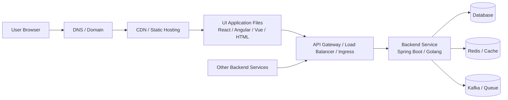
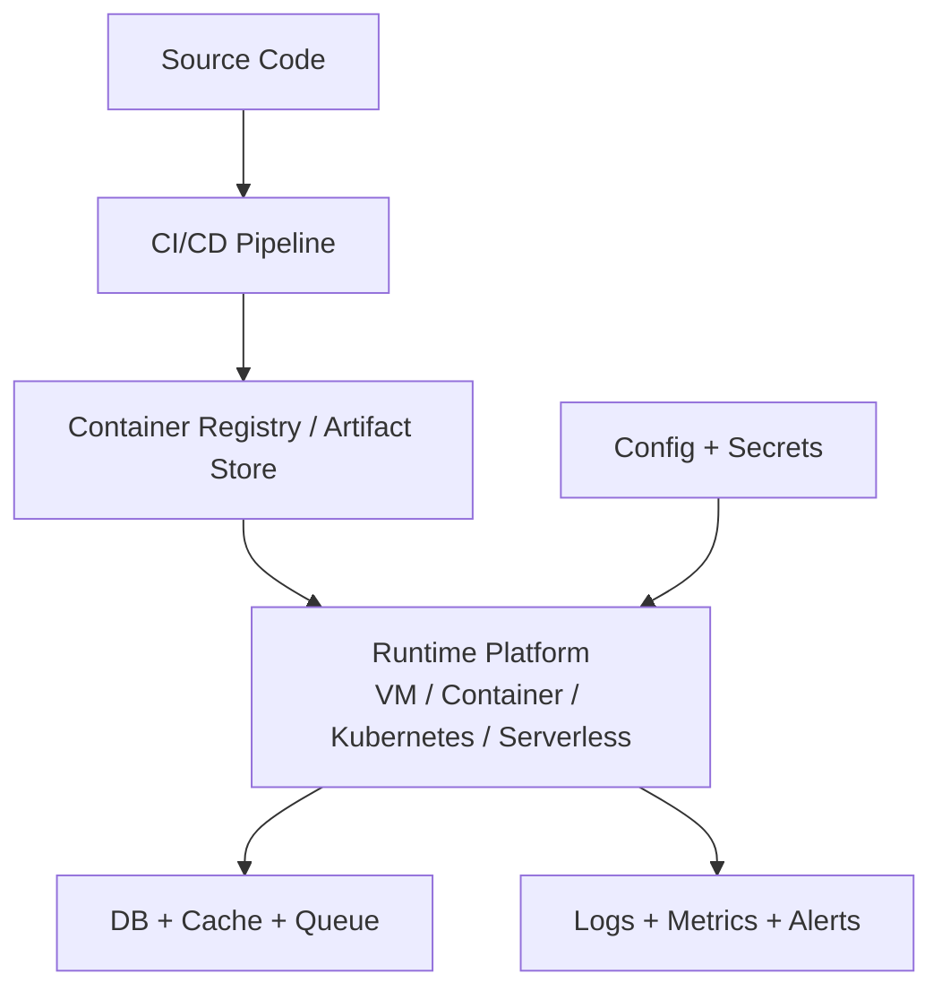
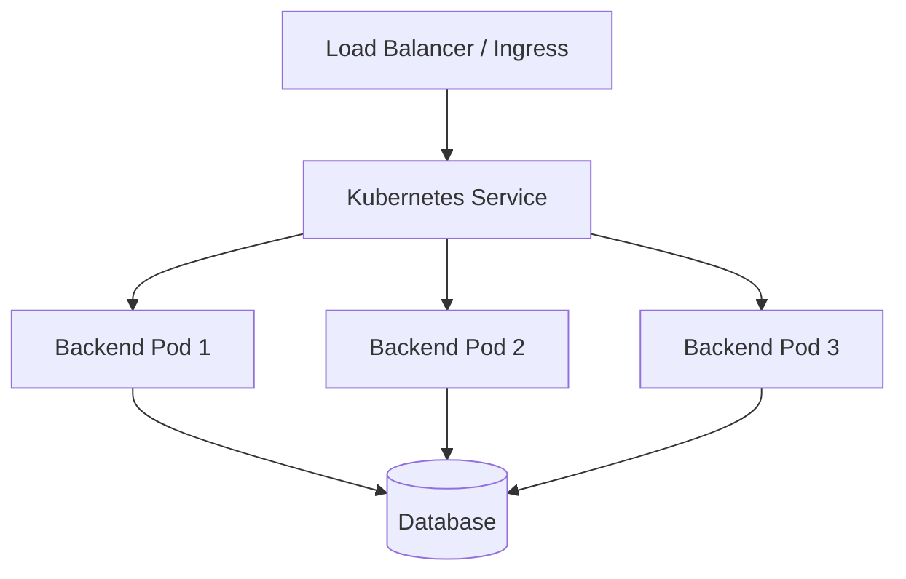
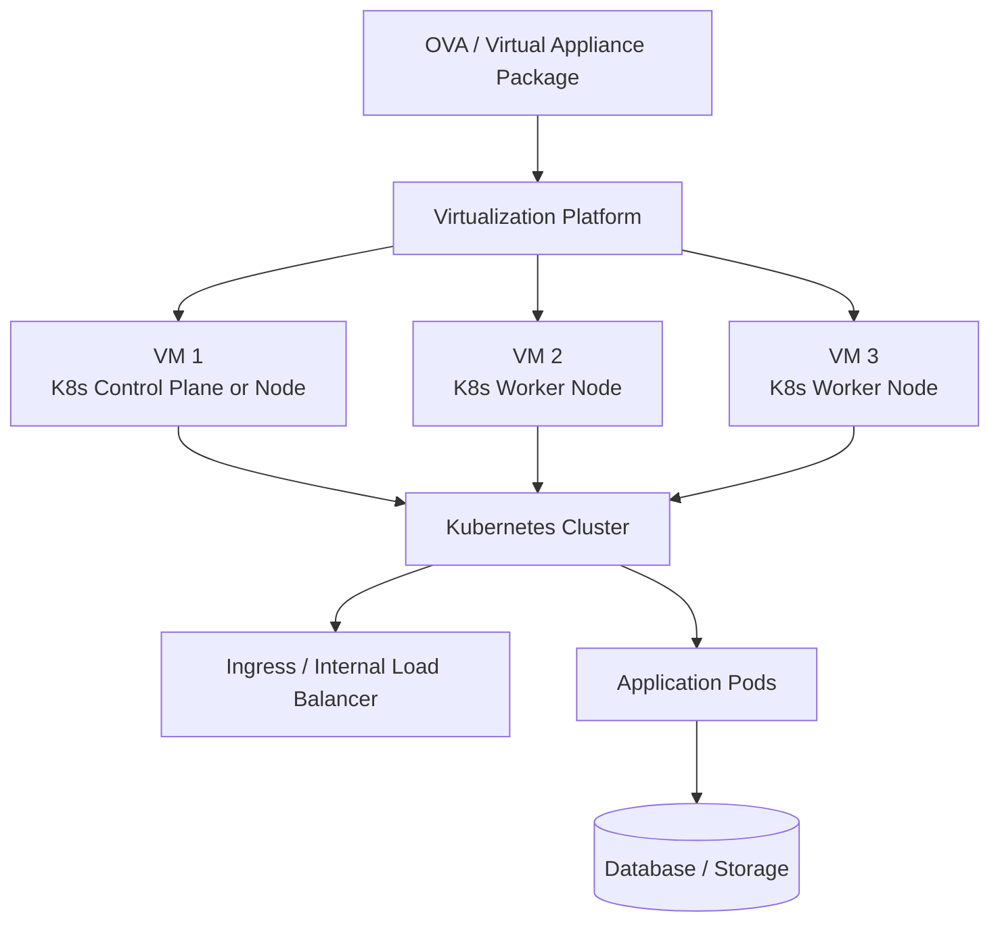
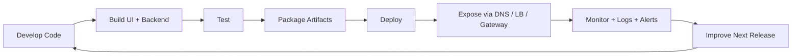

# Application Deployment Lifecycle Q&A

> Practical interview notes for explaining how UI and backend applications are deployed, how requests flow through the system, and how different deployment models compare.

---

## Table of Contents

1. [Where Do You Deploy a UI and Backend Application?](#1-where-do-you-deploy-a-ui-and-backend-application)
2. [What Services Are Needed to Run an Application in Production?](#2-what-services-are-needed-to-run-an-application-in-production)
3. [What Are the Common Ways to Deploy a Backend Service?](#3-what-are-the-common-ways-to-deploy-a-backend-service)
4. [How Does an OVA-Based Deployment with Kubernetes Inside VMs Work?](#4-how-does-an-ova-based-deployment-with-kubernetes-inside-vms-work)
5. [How Do You Explain the End-to-End Application Lifecycle in an Interview?](#5-how-do-you-explain-the-end-to-end-application-lifecycle-in-an-interview)

---

## 1. Where Do You Deploy a UI and Backend Application?

### The Question

> *"Suppose I have a UI application and a backend application. The UI sends REST API requests to the backend, and other backend services also call this service. Where should I deploy these applications?"*

### Answer

Usually, the **UI and backend are deployed separately**, because they have different runtime needs.

A UI application can be built in different ways depending on the framework and rendering style. For example, React, Angular, Vue, or a plain HTML/CSS/JavaScript frontend is often built into static files:

- `index.html`
- JavaScript bundle
- CSS files
- images and assets

These files can be deployed to static hosting or a CDN. The browser downloads the UI files and runs the application locally inside the browser.

If the UI uses **server-side rendering**, such as a server-rendered Node.js application, then it needs a runtime server also. In that case, the UI is deployed more like a backend service, usually on a VM, container platform, Kubernetes, or managed app platform.

The backend application, such as Java Spring Boot or Golang, runs as a server process. It needs compute, networking, configuration, database access, logs, metrics, and scaling.



In a typical production setup:

- The **UI** is deployed on CDN/static hosting if it is a browser-rendered frontend.
- The **UI** is deployed on compute if it needs server-side rendering.
- The **backend** is deployed on compute such as VMs, containers, Kubernetes, or serverless.
- The **database/cache/message broker** are deployed as managed services or internal infrastructure.
- Traffic enters through an **API Gateway, Load Balancer, or Ingress**.

### Example

For a normal browser-rendered UI plus backend application:

```text
User opens app.example.com
        ↓
UI files are served from CDN/static hosting
        ↓
Browser runs the UI and calls api.example.com/users
        ↓
Load Balancer routes request to backend service
        ↓
Backend processes request and talks to DB/cache/Kafka
        ↓
Backend returns JSON response to UI
```

### TLDR

Deploy a browser-rendered UI as static files on CDN/static hosting, and deploy a server-rendered UI on compute. Deploy the backend on compute such as VM, container platform, Kubernetes, or serverless. The UI calls backend REST APIs through a gateway, load balancer, or ingress.

---

## 2. What Services Are Needed to Run an Application in Production?

### The Question

> *"What are the different services or components needed when we deploy a real application?"*

### Answer

Deploying an application is not only about starting one process. A production application usually needs supporting components around it.

### Main Components

| Component | Purpose |
|---|---|
| DNS | Maps a domain name to the application entry point |
| CDN / Static Hosting | Serves UI files close to users |
| Load Balancer / API Gateway / Ingress | Receives traffic and routes it to backend services |
| Backend Compute | Runs the Java, Go, Node, or Python backend application |
| Database | Stores business data |
| Cache | Improves read performance and reduces DB load |
| Message Broker | Handles async communication and event processing |
| Secrets Manager | Stores passwords, tokens, certificates, and keys securely |
| Config Management | Stores environment-specific configuration |
| Logging | Helps debug production issues |
| Metrics and Alerts | Shows health, latency, errors, CPU, memory, and traffic |
| CI/CD Pipeline | Builds, tests, packages, and deploys the application |
| Container Registry | Stores Docker images if using containers |



### Interview Explanation

In an interview, a good answer is:

> "For production deployment, I need an entry point like a load balancer or API gateway, compute to run the backend, storage like database/cache/queue, secure configuration and secrets, monitoring/logging, and a deployment pipeline. For UI, I usually use CDN/static hosting. For backend, I choose VM, containers, Kubernetes, or serverless depending on scale and operational needs."

### TLDR

A production deployment needs more than code. It needs traffic routing, compute, database, cache, queues, secrets, config, monitoring, logging, and CI/CD so the application can run reliably and be operated safely.

---

## 3. What Are the Common Ways to Deploy a Backend Service?

### The Question

> *"What are the different ways to deploy a backend service, and when should we use each one?"*

### Answer

A backend service can be deployed in multiple ways. The right choice depends on team size, scale, operational maturity, cost, and how much control you need.

### Option 1: Virtual Machine Deployment

In this model, the backend runs directly on a VM.

```text
VM
 └── Java / Go backend process
```

Use this when:

- The system is small or simple.
- The team wants direct control over the server.
- The deployment process is not heavily containerized.

Tradeoff:

- Simple to understand, but scaling, patching, process management, and rollback need more manual work.

### Option 2: Container Deployment

In this model, the backend is packaged as a Docker image and deployed on a container platform.

```text
Docker Image
     ↓
Container Runtime
     ↓
Backend Service
```

Use this when:

- You want consistent deployment across environments.
- You want easier scaling and rollback.
- You want the same package to run in dev, test, and production.

Tradeoff:

- Requires container registry, image scanning, orchestration, and deployment automation.

### Option 3: Kubernetes Deployment

In this model, the backend runs as pods inside a Kubernetes cluster.



Use this when:

- You have multiple services.
- You need autoscaling, rolling deployment, self-healing, config/secrets, service discovery, and standard deployment patterns.
- Your team can operate Kubernetes properly.

Tradeoff:

- Very powerful, but operationally more complex than simple VM or managed app deployment.

### Option 4: Managed Platform

Examples include managed app platforms where you upload the application or container and the platform handles much of the infrastructure.

Use this when:

- You want faster deployment with less infrastructure management.
- You do not need deep control over orchestration.

Tradeoff:

- Easier to operate, but less flexible than managing your own Kubernetes or VM setup.

### Option 5: Serverless

In this model, code runs only when triggered by a request or event.

Use this when:

- Workload is event-driven.
- Traffic is unpredictable.
- You want to avoid managing servers.

Tradeoff:

- Not always suitable for long-running processes, heavy background jobs, special networking needs, or very low-latency workloads.

### TLDR

Use VMs for simple deployments, containers for portable packaging, Kubernetes for large multi-service systems, managed platforms for faster operations, and serverless for event-driven workloads. For many backend systems, Docker plus Kubernetes or a managed container platform is a strong production answer.

---

## 4. How Does an OVA-Based Deployment with Kubernetes Inside VMs Work?

### The Question

> *"Some enterprise applications are shipped as an OVA file. When deployed on a virtualization platform, it creates VMs, forms a Kubernetes cluster, and starts application pods. How does this model work, and how is it different from normal cloud deployment?"*

### Answer

An **OVA-based deployment** is common in enterprise or on-prem environments. Instead of directly deploying the app into an existing cloud service, the vendor or team packages a full appliance image.

That appliance image can contain:

- Operating system configuration
- Kubernetes components
- Container runtime
- Application images or image pull configuration
- Startup scripts
- Networking configuration
- Monitoring/logging agents
- Required system services

When the OVA is deployed on a virtualization platform, it creates one or more VMs. Those VMs then act as Kubernetes nodes. After the VMs come up, Kubernetes starts the required pods.



### Why Teams Use This Model

This model is useful when:

- The customer runs software in their own data center.
- The environment does not use public cloud services.
- The application needs to be shipped as a self-contained appliance.
- The vendor wants a controlled runtime environment.
- Installation should be repeatable without asking the customer to manually build Kubernetes from scratch.

### How It Differs From Cloud-Native Deployment

| Area | OVA / Appliance Model | Cloud-Native Model |
|---|---|---|
| Packaging | Full VM appliance image | Container image, Helm chart, Terraform, or deployment manifests |
| Runtime | VMs created from appliance | Managed Kubernetes, container platform, VM, or serverless |
| Operations | More self-contained; often on-prem | Uses cloud-managed services where possible |
| Scaling | May require adding more appliance VMs/nodes | Autoscaling is usually easier |
| Upgrades | Appliance upgrade process | CI/CD rollout, image update, Helm upgrade, rolling deployment |
| Control | Vendor controls more of the stack | Platform/team controls infrastructure pieces separately |

### Important Point

Even though the application eventually runs as Kubernetes pods, the deployment entry point is different.

In cloud-native deployment, you may directly deploy a Docker image or Kubernetes manifest into a cluster.

In OVA deployment, you first deploy the appliance VM image. That image brings up the VMs and Kubernetes environment, and then the application pods run inside that environment.

```text
OVA model:
OVA package → Virtualization platform → VMs → Kubernetes → Pods → Application

Cloud-native model:
Source code → Docker image → Registry → Kubernetes/ECS/VM/Serverless → Application
```

### TLDR

OVA deployment packages the runtime environment and application together as a virtual appliance. After deployment, it creates VMs, forms or joins a Kubernetes cluster, and starts pods. It is common for enterprise/on-prem software, while cloud-native deployment usually pushes containers directly to managed infrastructure.

---

## 5. How Do You Explain the End-to-End Application Lifecycle in an Interview?

### The Question

> *"How would you explain the full lifecycle of a UI plus backend application from development to production?"*

### Answer

I would explain it as a flow from code to running production traffic.

### Step-by-Step Lifecycle

1. **Development**
   - Developers write UI and backend code.
   - UI may be React, Angular, Vue, plain JavaScript, or a server-rendered UI framework.
   - Backend may be Spring Boot, Golang, Node.js, or another framework.

2. **Build**
   - Browser-rendered UI is built into static assets.
   - Server-rendered UI is built into a deployable server application.
   - Backend is built into a JAR, binary, or Docker image.

3. **Test**
   - Unit tests validate small logic.
   - Integration tests validate database, APIs, and dependencies.
   - Contract tests validate service-to-service communication.

4. **Package**
   - Static UI assets are packaged for CDN/static hosting.
   - Server-rendered UI is packaged as a container image or deployable artifact.
   - Backend is packaged as a container image or deployable artifact.

5. **Deploy**
   - Static UI is deployed to static hosting/CDN.
   - Server-rendered UI is deployed to compute.
   - Backend is deployed to VM, container platform, Kubernetes, managed platform, or serverless.

6. **Expose**
   - DNS points users to the application.
   - HTTPS certificates secure traffic.
   - Load balancer, API gateway, or ingress routes traffic to backend services.

7. **Operate**
   - Logs, metrics, traces, alerts, dashboards, and health checks are configured.
   - Autoscaling and rolling deployments keep the system stable.

8. **Improve**
   - Production issues, latency, errors, and user feedback are used to improve the next release.



### Strong Interview Answer

> "I separate UI and backend deployment. If the UI is browser-rendered, I build it into static assets and deploy it through CDN/static hosting. If it is server-rendered, I deploy it on compute like a backend service. The backend is packaged as a container, binary, or deployable artifact and runs on VM, Kubernetes, managed containers, or serverless. Traffic comes through DNS and HTTPS, then a load balancer/API gateway/ingress routes it to backend services. The backend connects to database, cache, queue, and other services. For production readiness, I add config, secrets, health checks, logs, metrics, tracing, alerts, autoscaling, and CI/CD."

### TLDR

The application lifecycle is code → build → test → package → deploy → expose → monitor → improve. UI and backend are usually deployed separately: browser-rendered UI on CDN/static hosting, server-rendered UI or backend on compute, with gateway/load balancer, database, secrets, logs, metrics, and CI/CD around it.
