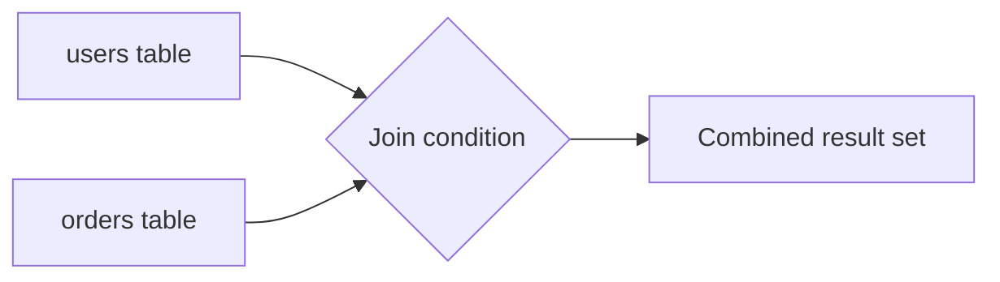
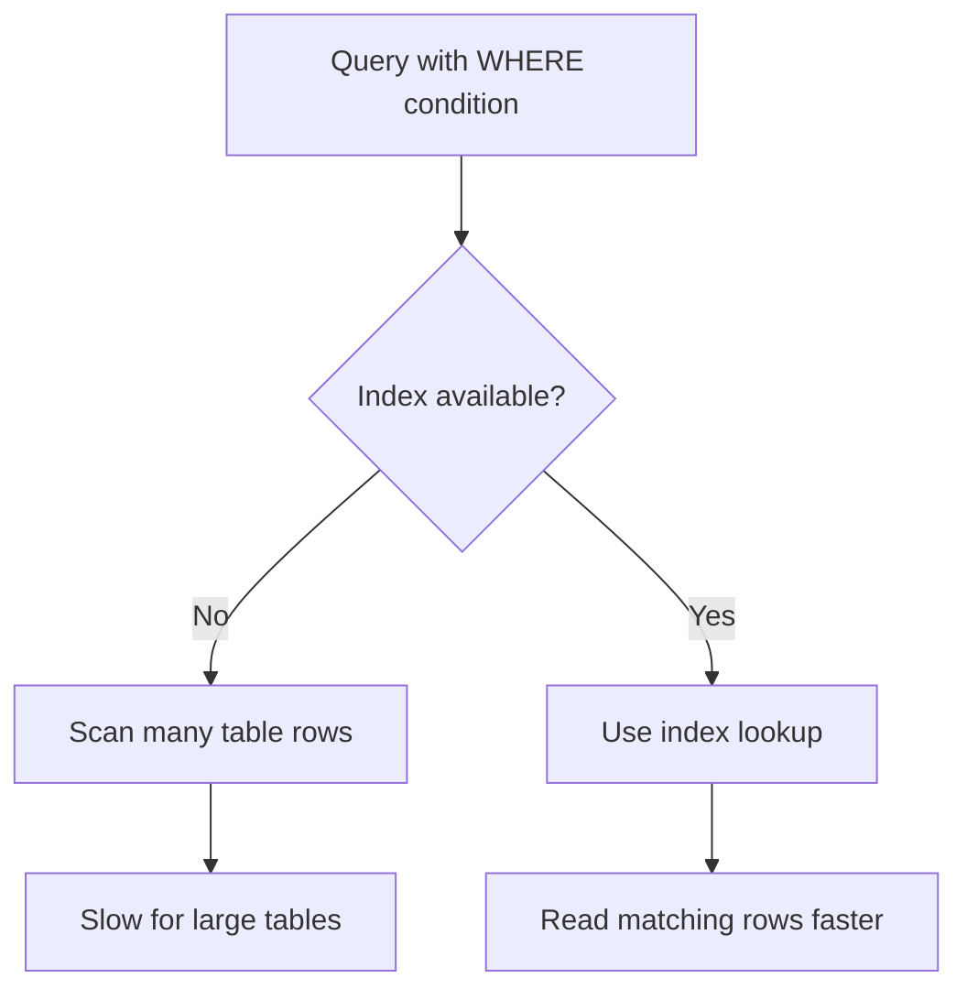
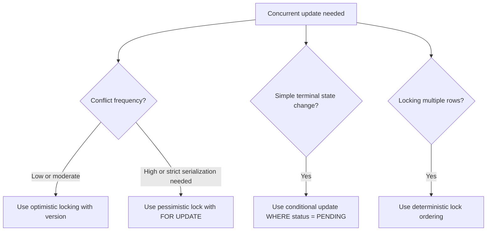
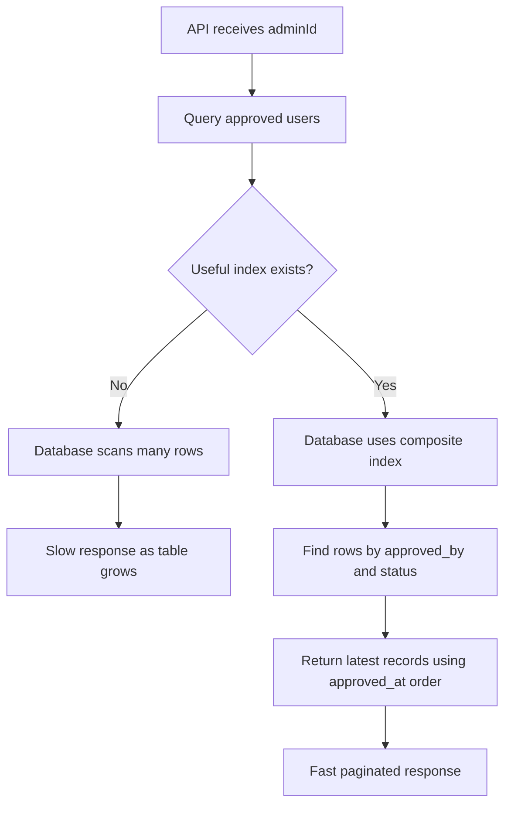

# DB Q&A

> Database interview questions and real-world scenario answers.

---

## Table of Contents

### Basic DB Questions

1. [What Is a Database Join? How Many Types of Joins Are There?](#1-what-is-a-database-join-how-many-types-of-joins-are-there)
2. [What Is an Index and Why Do We Need It?](#2-what-is-an-index-and-why-do-we-need-it)
3. [What Are Optimistic and Pessimistic Locking?](#3-what-are-optimistic-and-pessimistic-locking)

### Interview Q&A

4. [How Do You Optimize a Slow Query on a Large Table?](#4-how-do-you-optimize-a-slow-query-on-a-large-table)

---

## Basic DB Questions

## 1. What Is a Database Join? How Many Types of Joins Are There?

### The Question

> *"What is a database join? How many types of joins are there, and when do we use them?"*

### Answer

A **join** is used to combine rows from two or more tables based on a related column. In real applications, data is usually normalized into multiple tables. For example, user information may be in a `users` table, and order information may be in an `orders` table. If we want order details along with the user name, we need a join.

Example tables:

```sql
users
-----
id | name
1  | Ravi
2  | Priya
3  | Aman

orders
------
id  | user_id | amount
101 | 1       | 500
102 | 1       | 700
103 | 2       | 300
```

### Common Join Types

| Join Type | What It Returns |
|---|---|
| `INNER JOIN` | Only matching rows from both tables |
| `LEFT JOIN` | All rows from the left table, plus matching rows from the right table |
| `RIGHT JOIN` | All rows from the right table, plus matching rows from the left table |
| `FULL OUTER JOIN` | All rows from both tables, matched where possible |
| `CROSS JOIN` | Every combination of rows from both tables |
| `SELF JOIN` | A table joined with itself |

### INNER JOIN

Returns only records that match in both tables.

```sql
SELECT u.id, u.name, o.id AS order_id, o.amount
FROM users u
INNER JOIN orders o ON u.id = o.user_id;
```

Use this when you only need users who have orders.

### LEFT JOIN

Returns all records from the left table and matching records from the right table. If there is no match, right-side columns return `NULL`.

```sql
SELECT u.id, u.name, o.id AS order_id, o.amount
FROM users u
LEFT JOIN orders o ON u.id = o.user_id;
```

Use this when you want all users, including users who have not placed any order.

### RIGHT JOIN

Returns all records from the right table and matching records from the left table.

```sql
SELECT u.id, u.name, o.id AS order_id, o.amount
FROM users u
RIGHT JOIN orders o ON u.id = o.user_id;
```

In practice, many teams avoid `RIGHT JOIN` and rewrite it as a `LEFT JOIN` by changing table order, because `LEFT JOIN` is easier to read.

### FULL OUTER JOIN

Returns all records from both tables. Matching rows are combined, and non-matching rows appear with `NULL` values.

```sql
SELECT u.id, u.name, o.id AS order_id, o.amount
FROM users u
FULL OUTER JOIN orders o ON u.id = o.user_id;
```

Use this when you need to find all matched and unmatched records from both sides.

### CROSS JOIN

Returns every possible combination of rows.

```sql
SELECT u.name, p.plan_name
FROM users u
CROSS JOIN subscription_plans p;
```

Use this carefully. If one table has 1,000 rows and another has 1,000 rows, the result can become 1,000,000 rows.

### SELF JOIN

A self join joins a table with itself. It is useful for hierarchical data, such as employee and manager relationships.

```sql
SELECT e.name AS employee_name, m.name AS manager_name
FROM employees e
LEFT JOIN employees m ON e.manager_id = m.id;
```

### Join Flow



### TLDR

A join combines rows from multiple tables using a related column. `INNER JOIN` returns only matches, `LEFT JOIN` keeps all left-table rows, `FULL OUTER JOIN` keeps all rows from both tables, and `CROSS JOIN` creates all combinations.

---

## 2. What Is an Index and Why Do We Need It?

### The Question

> *"What is an index in a database, why do we need it, and how do we create one?"*

### Answer

An **index** is a database structure that helps the database find rows faster without scanning the entire table. It works like an index in a book. Instead of reading every page to find a topic, we look in the index and jump directly to the right page.

Without an index, this query may scan the full table:

```sql
SELECT id, name, email
FROM users
WHERE email = 'ravi@example.com';
```

If the `users` table has millions of rows, a full scan can be slow.

Create an index on the searched column:

```sql
CREATE INDEX idx_users_email
ON users (email);
```

Now the database can use the index to find matching rows quickly.

### Unique Index

If a column must be unique, use a unique index or unique constraint:

```sql
CREATE UNIQUE INDEX idx_users_email_unique
ON users (email);
```

This improves lookup speed and also prevents duplicate emails.

### Composite Index

If a query filters by multiple columns, use a composite index:

```sql
CREATE INDEX idx_orders_user_status_created_at
ON orders (user_id, status, created_at DESC);
```

This is useful for a query like:

```sql
SELECT id, amount, created_at
FROM orders
WHERE user_id = :userId
  AND status = 'COMPLETED'
ORDER BY created_at DESC
LIMIT 50;
```

The index should match the common filter and sort pattern.

### Index Flow



### When Indexes Help

- Columns used in `WHERE` filters.
- Columns used in `JOIN` conditions.
- Columns used in `ORDER BY`.
- Columns used for uniqueness checks.
- Frequently queried foreign key columns.

### When Indexes Can Hurt

Indexes are not free. Every insert, update, or delete must also update the indexes. Too many indexes can slow down write-heavy tables and consume extra disk space.

So we should create indexes based on real query patterns and verify them using:

```sql
EXPLAIN ANALYZE
SELECT id, name, email
FROM users
WHERE email = 'ravi@example.com';
```

### TLDR

An index helps the database find rows faster without scanning the full table. Use indexes on columns used in filters, joins, sorting, and uniqueness checks, but avoid unnecessary indexes because they add storage and write overhead.

---

## 3. What Are Optimistic and Pessimistic Locking?

### The Question

> *"What are optimistic locking and pessimistic locking in a database? When should we use each one?"*

### Answer

Locking is used to handle **concurrent updates**. If two users or services try to update the same data at the same time, locking helps prevent lost updates, inconsistent data, or double processing.

The two most common database locking approaches are:

| Lock Type | Basic Idea | Best For |
|---|---|---|
| Optimistic locking | Do not lock first; check whether data changed when updating | Conflicts are possible but not very frequent |
| Pessimistic locking | Lock the row first; other transactions wait | Conflicts are frequent or the update must be strictly serialized |

### Optimistic Locking

Optimistic locking assumes that conflicts are rare. The application reads a row with a `version` column. During update, it updates the row only if the version is still the same.

Example table:

```sql
CREATE TABLE user_approval_request (
    request_id UUID PRIMARY KEY,
    status VARCHAR(20) NOT NULL,
    reviewed_by UUID,
    version INT NOT NULL DEFAULT 0
);
```

Admin A and Admin B both read the same row:

```text
request_id = R1
status = PENDING
version = 3
```

Admin A approves:

```sql
UPDATE user_approval_request
SET status = 'APPROVED',
    reviewed_by = :adminId,
    version = version + 1
WHERE request_id = :requestId
  AND version = :oldVersion;
```

If the update count is `1`, the update succeeded. If the update count is `0`, another transaction already changed the row, so the application should reject the action or ask the user to refresh.

In JPA, optimistic locking is commonly implemented with `@Version`:

```java
@Version
private Integer version;
```

### Pessimistic Locking

Pessimistic locking locks the row before updating it. Other transactions trying to update the same row must wait until the first transaction commits or rolls back.

Example:

```sql
BEGIN;

SELECT *
FROM user_approval_request
WHERE request_id = :requestId
FOR UPDATE;

UPDATE user_approval_request
SET status = 'APPROVED',
    reviewed_by = :adminId
WHERE request_id = :requestId;

COMMIT;
```

This is useful when conflicts are common and we want strict serialization. But it should be used carefully because it can reduce concurrency and may cause waiting or deadlocks if transactions are long.

### Conditional Update

For many approval workflows, a simple conditional update is enough:

```sql
UPDATE user_approval_request
SET status = 'APPROVED',
    reviewed_by = :adminId
WHERE request_id = :requestId
  AND status = 'PENDING';
```

This works well because approve and reject are terminal state transitions. If the row is still `PENDING`, one admin wins. If zero rows are updated, someone else already approved or rejected it.

This is often simpler than taking an explicit pessimistic lock.

### Deterministic Lock Ordering

Sometimes people also mention **deterministic locking** or **consistent lock ordering**. This is not usually a separate database lock type like optimistic or pessimistic locking.

It means that when a transaction must lock multiple rows, every transaction locks them in the same predictable order. This reduces deadlock risk.

Example: if a money transfer updates two accounts, always lock the smaller account ID first:

```sql
SELECT *
FROM account
WHERE account_id IN (:fromAccountId, :toAccountId)
ORDER BY account_id
FOR UPDATE;
```

If every transaction follows the same order, two transactions are less likely to hold opposite locks and wait on each other.

### Locking Flow



### TLDR

Optimistic locking uses a version check and fails if someone changed the row first. Pessimistic locking locks the row with `FOR UPDATE` so others wait. For approve/reject workflows, a conditional update like `WHERE status = 'PENDING'` is often the cleanest solution.

---

## Interview Q&A

## 4. How Do You Optimize a Slow Query on a Large Table?

### The Question

> *"Suppose there is a large table and one API query is becoming slow as data grows. How do you improve the query so it does not take a lot of time?"*

### Short Answer

First identify the exact query pattern: which columns are used in `WHERE`, `JOIN`, `ORDER BY`, and pagination. Then create an index that matches that access pattern, return only required columns, paginate the response, and verify the improvement with `EXPLAIN ANALYZE`.

For example, if the API asks for **users approved by a specific admin**, and the query filters by `approved_by`, filters only approved users, and sorts by latest approval time, then a good composite index is:

```sql
CREATE INDEX idx_user_approval_approved_by_status_approved_at
ON user_approval_request (approved_by, status, approved_at DESC);
```

Then use pagination and verify the query using `EXPLAIN ANALYZE`.

### Example: Approved Users by Admin

```sql
CREATE TABLE user_approval_request (
    request_id UUID PRIMARY KEY,
    user_id UUID,
    name VARCHAR(255) NOT NULL,
    email VARCHAR(255) NOT NULL,
    status VARCHAR(20) NOT NULL,
    approved_by UUID,
    approved_at TIMESTAMP,
    rejected_by UUID,
    rejected_at TIMESTAMP,
    created_at TIMESTAMP NOT NULL
);
```

Here, `approved_by` stores the admin ID who approved the request.

### Slow Query Example

```sql
SELECT user_id, name, email, approved_at
FROM user_approval_request
WHERE approved_by = :adminId
  AND status = 'APPROVED'
ORDER BY approved_at DESC;
```

If the table has millions of rows and there is no proper index, the database may scan a large part of the table to find matching records. This becomes slower as the table grows.

### Optimized Query With Pagination

```sql
SELECT user_id, name, email, approved_at
FROM user_approval_request
WHERE approved_by = :adminId
  AND status = 'APPROVED'
ORDER BY approved_at DESC
LIMIT 50 OFFSET 0;
```

This is better because the API returns only one page of data instead of loading all approved users at once.

For very large data, cursor pagination is usually better than high-offset pagination:

```sql
SELECT user_id, name, email, approved_at
FROM user_approval_request
WHERE approved_by = :adminId
  AND status = 'APPROVED'
  AND approved_at < :lastSeenApprovedAt
ORDER BY approved_at DESC
LIMIT 50;
```

This avoids the database skipping thousands or millions of rows when the user goes to later pages.

### Recommended Index

```sql
CREATE INDEX idx_user_approval_approved_by_status_approved_at
ON user_approval_request (approved_by, status, approved_at DESC);
```

Why this order?

1. `approved_by` is used to find records for one admin.
2. `status` is used to return only approved records.
3. `approved_at DESC` helps the database return the latest approved users without doing a separate expensive sort.

With this index, the database can quickly find rows for one admin, filter approved rows, and return them in the required order.

### Query Flow



### Check With `EXPLAIN ANALYZE`

After adding the index, always verify the query plan:

```sql
EXPLAIN ANALYZE
SELECT user_id, name, email, approved_at
FROM user_approval_request
WHERE approved_by = 'admin-id'
  AND status = 'APPROVED'
ORDER BY approved_at DESC
LIMIT 50;
```

Look for an index scan using the new index. If the database is still doing a sequential scan, check:

- Whether the query condition matches the index columns.
- Whether the table statistics are updated.
- Whether the selected admin has too many matching rows.
- Whether the query is selecting large columns unnecessarily.

### Avoid `SELECT *`

Do not fetch every column if the API only needs a list view.

Bad:

```sql
SELECT *
FROM user_approval_request
WHERE approved_by = :adminId;
```

Better:

```sql
SELECT user_id, name, email, approved_at
FROM user_approval_request
WHERE approved_by = :adminId
  AND status = 'APPROVED'
ORDER BY approved_at DESC
LIMIT 50;
```

If the table has large JSON, document, address, profile, or metadata columns, avoiding `SELECT *` can reduce I/O and improve response time.

### Partial Index Option

If most queries only fetch approved users, and rejected or pending rows are not needed for this API, a partial index can be useful in PostgreSQL:

```sql
CREATE INDEX idx_approved_requests_by_admin
ON user_approval_request (approved_by, approved_at DESC)
WHERE status = 'APPROVED';
```

This index is smaller because it only stores approved rows. Smaller indexes are faster to scan and cheaper to keep in memory.

### Covering Index Option

If the list API always returns the same small set of columns, PostgreSQL can use an included-column index:

```sql
CREATE INDEX idx_user_approval_admin_approved_at_covering
ON user_approval_request (approved_by, status, approved_at DESC)
INCLUDE (user_id, name, email);
```

This can allow an index-only scan when visibility conditions are favorable, because the database can serve the query from the index without reading the full table rows.

### Partitioning for Very Large Tables

If the table grows extremely large, partitioning can help. For example, partition by `approved_at` month or year:

```text
user_approval_request_2026_01
user_approval_request_2026_02
user_approval_request_2026_03
```

Partitioning is useful when queries usually filter by date range, such as:

```sql
WHERE approved_by = :adminId
  AND status = 'APPROVED'
  AND approved_at >= :fromDate
  AND approved_at < :toDate
```

If there is no date filter, partitioning may not help much because the database may still need to check many partitions.

### Caching or Read Model

If the same admin-approved list is requested very frequently, caching can help:

- Cache the first page in Redis.
- Cache total counts separately.
- Invalidate cache when a new request is approved or rejected.

For reporting-heavy systems, we can also maintain a separate read-optimized table or materialized view. But this is usually a later optimization. The first step should be a correct index and pagination.

### Important Production Considerations

- Add indexes based on real query patterns, not guesswork.
- Use `EXPLAIN ANALYZE` before and after adding the index.
- Keep indexes limited, because every index slows down insert and update operations.
- Use pagination for every list API.
- Prefer cursor pagination for large datasets.
- Select only required columns.
- Consider a partial index if only approved rows are queried.
- Consider partitioning only when the table is very large and queries include a partition-friendly filter like date.

### Interview Summary

I would explain it like this:

> I would first check the exact query pattern. If the API needs to fetch users approved by a specific admin, I would create an index on `approved_by`. If the query also filters by `status` and sorts by `approved_at`, I would create a composite index like `(approved_by, status, approved_at DESC)`. Then I would make the API paginated so it never returns all rows at once. I would verify the improvement using `EXPLAIN ANALYZE` and confirm the database uses an index scan instead of a full table scan. For very large tables, I may consider a partial index for only approved rows, cursor pagination, partitioning by date, or a cached read model, but the first practical fix is the right index plus pagination.

### TLDR

Create an index that matches the query pattern, usually `(approved_by, status, approved_at DESC)`, and always paginate the API response. Verify with `EXPLAIN ANALYZE`; for very large tables, consider cursor pagination, partial indexes, partitioning, or a read-optimized cache.
