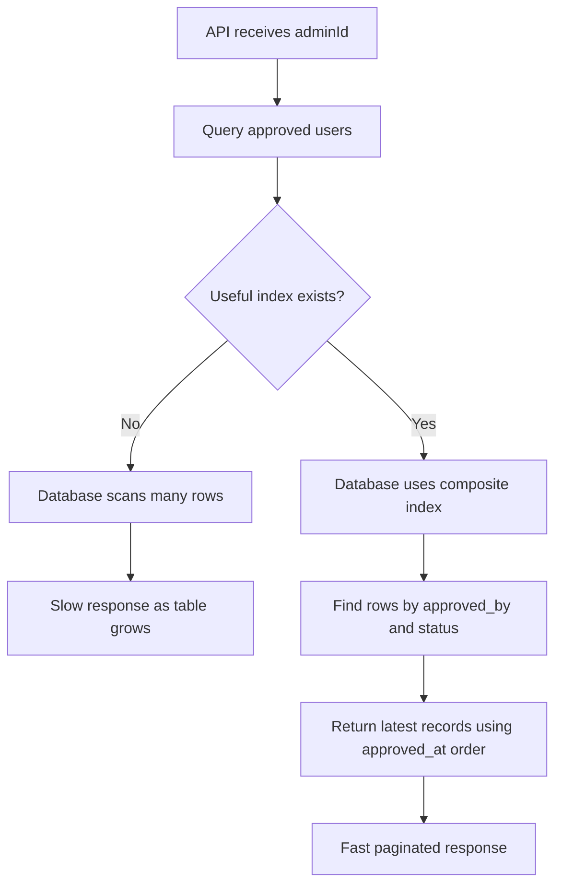

# DB Query Optimization Interview Questions

## Query Optimization for Approved Users by Admin

### The Question

> *"Suppose there is a table that stores user-related data submitted through a form. The table has columns like user ID, name, user details, status, and `approved_by`, where `approved_by` stores the admin user ID. The table has a huge amount of data and keeps growing. If we want to fetch the list of users approved by a specific admin, how can we improve the query so it does not take a lot of time?"*

### Short Answer

First identify the exact query pattern. If the common query is **"show users approved by this admin"**, then create the right index on the filtering and sorting columns.

For example, if the API filters by `approved_by`, filters only approved users, and sorts by latest approval time, then a good composite index is:

```sql
CREATE INDEX idx_user_approval_approved_by_status_approved_at
ON user_approval_request (approved_by, status, approved_at DESC);
```

Then use pagination and verify the query using `EXPLAIN ANALYZE`.

### Example Table

```sql
CREATE TABLE user_approval_request (
    request_id UUID PRIMARY KEY,
    user_id UUID,
    name VARCHAR(255) NOT NULL,
    email VARCHAR(255) NOT NULL,
    status VARCHAR(20) NOT NULL,
    approved_by UUID,
    approved_at TIMESTAMP,
    rejected_by UUID,
    rejected_at TIMESTAMP,
    created_at TIMESTAMP NOT NULL
);
```

Here, `approved_by` stores the admin ID who approved the request.

### Slow Query Example

```sql
SELECT user_id, name, email, approved_at
FROM user_approval_request
WHERE approved_by = :adminId
  AND status = 'APPROVED'
ORDER BY approved_at DESC;
```

If the table has millions of rows and there is no proper index, the database may scan a large part of the table to find matching records. This becomes slower as the table grows.

### Optimized Query With Pagination

```sql
SELECT user_id, name, email, approved_at
FROM user_approval_request
WHERE approved_by = :adminId
  AND status = 'APPROVED'
ORDER BY approved_at DESC
LIMIT 50 OFFSET 0;
```

This is better because the API returns only one page of data instead of loading all approved users at once.

For very large data, cursor pagination is usually better than high-offset pagination:

```sql
SELECT user_id, name, email, approved_at
FROM user_approval_request
WHERE approved_by = :adminId
  AND status = 'APPROVED'
  AND approved_at < :lastSeenApprovedAt
ORDER BY approved_at DESC
LIMIT 50;
```

This avoids the database skipping thousands or millions of rows when the user goes to later pages.

### Recommended Index

```sql
CREATE INDEX idx_user_approval_approved_by_status_approved_at
ON user_approval_request (approved_by, status, approved_at DESC);
```

Why this order?

1. `approved_by` is used to find records for one admin.
2. `status` is used to return only approved records.
3. `approved_at DESC` helps the database return the latest approved users without doing a separate expensive sort.

With this index, the database can quickly find rows for one admin, filter approved rows, and return them in the required order.

### Query Flow



### Check With `EXPLAIN ANALYZE`

After adding the index, always verify the query plan:

```sql
EXPLAIN ANALYZE
SELECT user_id, name, email, approved_at
FROM user_approval_request
WHERE approved_by = 'admin-id'
  AND status = 'APPROVED'
ORDER BY approved_at DESC
LIMIT 50;
```

Look for an index scan using the new index. If the database is still doing a sequential scan, check:

- Whether the query condition matches the index columns.
- Whether the table statistics are updated.
- Whether the selected admin has too many matching rows.
- Whether the query is selecting large columns unnecessarily.

### Avoid `SELECT *`

Do not fetch every column if the API only needs a list view.

Bad:

```sql
SELECT *
FROM user_approval_request
WHERE approved_by = :adminId;
```

Better:

```sql
SELECT user_id, name, email, approved_at
FROM user_approval_request
WHERE approved_by = :adminId
  AND status = 'APPROVED'
ORDER BY approved_at DESC
LIMIT 50;
```

If the table has large JSON, document, address, profile, or metadata columns, avoiding `SELECT *` can reduce I/O and improve response time.

### Partial Index Option

If most queries only fetch approved users, and rejected or pending rows are not needed for this API, a partial index can be useful in PostgreSQL:

```sql
CREATE INDEX idx_approved_requests_by_admin
ON user_approval_request (approved_by, approved_at DESC)
WHERE status = 'APPROVED';
```

This index is smaller because it only stores approved rows. Smaller indexes are faster to scan and cheaper to keep in memory.

### Covering Index Option

If the list API always returns the same small set of columns, PostgreSQL can use an included-column index:

```sql
CREATE INDEX idx_user_approval_admin_approved_at_covering
ON user_approval_request (approved_by, status, approved_at DESC)
INCLUDE (user_id, name, email);
```

This can allow an index-only scan when visibility conditions are favorable, because the database can serve the query from the index without reading the full table rows.

### Partitioning for Very Large Tables

If the table grows extremely large, partitioning can help. For example, partition by `approved_at` month or year:

```text
user_approval_request_2026_01
user_approval_request_2026_02
user_approval_request_2026_03
```

Partitioning is useful when queries usually filter by date range, such as:

```sql
WHERE approved_by = :adminId
  AND status = 'APPROVED'
  AND approved_at >= :fromDate
  AND approved_at < :toDate
```

If there is no date filter, partitioning may not help much because the database may still need to check many partitions.

### Caching or Read Model

If the same admin-approved list is requested very frequently, caching can help:

- Cache the first page in Redis.
- Cache total counts separately.
- Invalidate cache when a new request is approved or rejected.

For reporting-heavy systems, we can also maintain a separate read-optimized table or materialized view. But this is usually a later optimization. The first step should be a correct index and pagination.

### Important Production Considerations

- Add indexes based on real query patterns, not guesswork.
- Use `EXPLAIN ANALYZE` before and after adding the index.
- Keep indexes limited, because every index slows down insert and update operations.
- Use pagination for every list API.
- Prefer cursor pagination for large datasets.
- Select only required columns.
- Consider a partial index if only approved rows are queried.
- Consider partitioning only when the table is very large and queries include a partition-friendly filter like date.

### Interview Summary

I would explain it like this:

> I would first check the exact query pattern. If the API needs to fetch users approved by a specific admin, I would create an index on `approved_by`. If the query also filters by `status` and sorts by `approved_at`, I would create a composite index like `(approved_by, status, approved_at DESC)`. Then I would make the API paginated so it never returns all rows at once. I would verify the improvement using `EXPLAIN ANALYZE` and confirm the database uses an index scan instead of a full table scan. For very large tables, I may consider a partial index for only approved rows, cursor pagination, partitioning by date, or a cached read model, but the first practical fix is the right index plus pagination.
