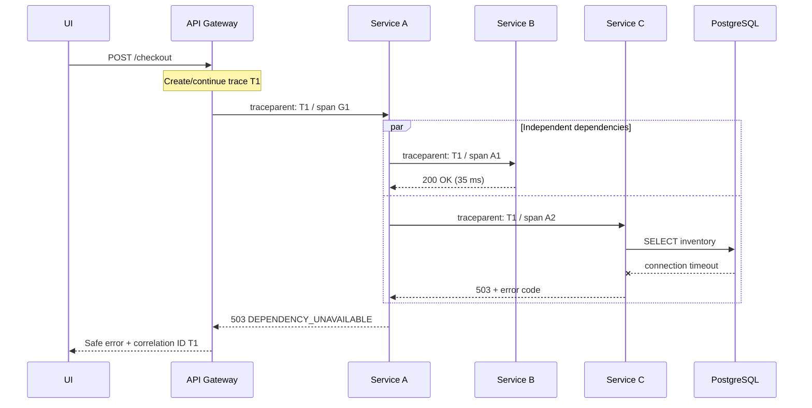
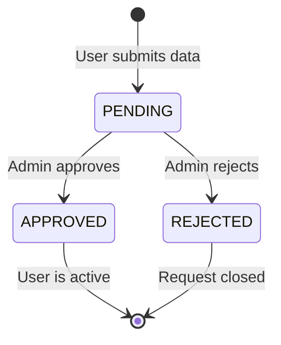
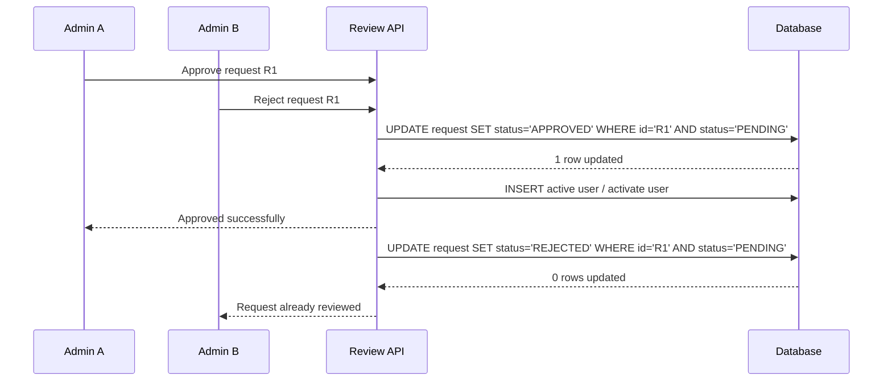
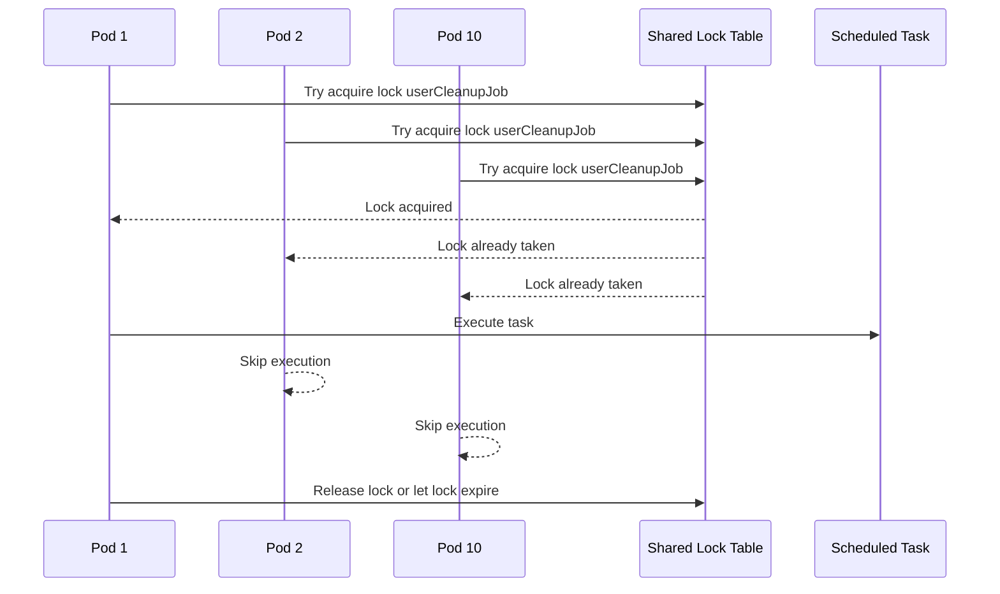
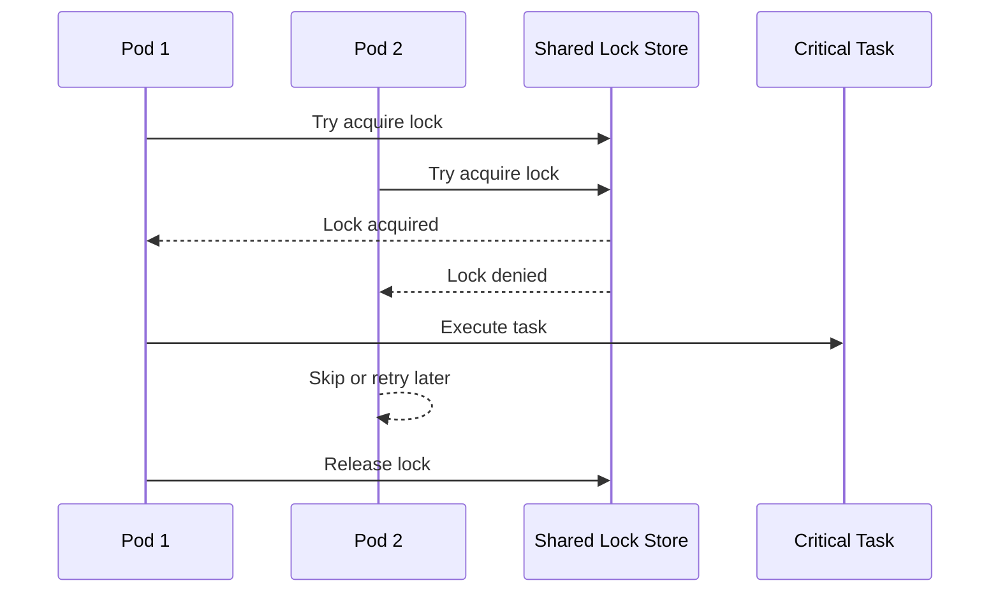

# Microservices Q&A

> Behavioural and technical scenario questions grounded in **Java / Spring Boot / Kafka / Kubernetes / PostgreSQL** experience.
> Use the **STAR** format: **S**ituation → **T**ask → **A**ction → **R**esult.

---

## Table of Contents

1. [How Do You Identify Which Microservice Is Failing?](#1-how-do-you-identify-which-microservice-is-failing)
2. [Tell Me a Scale Issue You Solved (Kafka Consumer Lag)](#2-tell-me-a-scale-issue-you-solved--kafka-consumer-lag)
3. [Tell Me About a Production Issue You Debugged](#3-tell-me-about-a-production-issue-you-debugged)
4. [How Did You Improve Performance of a Service?](#4-how-did-you-improve-performance-of-a-service)
5. [Describe a Time You Dealt With Data Inconsistency](#5-describe-a-time-you-dealt-with-data-inconsistency)
6. [Tell Me About a Deployment That Went Wrong](#6-tell-me-about-a-deployment-that-went-wrong)
7. [How Do You Handle Memory / Resource Issues in Production?](#7-how-do-you-handle-memory--resource-issues-in-production)
8. [Describe a Time You Optimised a Database Query](#8-describe-a-time-you-optimised-a-database-query)
9. [How Do You Design for High Availability?](#9-how-do-you-design-for-high-availability)
10. [Tell Me About a Difficult Bug That Took Days to Find](#10-tell-me-about-a-difficult-bug-that-took-days-to-find)
11. [How Do You Handle Backward Compatibility?](#11-how-do-you-handle-backward-compatibility)
12. [Tell Me About a Time You Disagreed With a Team Decision](#12-tell-me-about-a-time-you-disagreed-with-a-team-decision)
13. [What's the Most Complex System You've Worked On?](#13-whats-the-most-complex-system-youve-worked-on)
14. [Quick-Fire Technical Scenarios](#14-quick-fire-technical-scenarios)
15. [How Do You Prevent Multiple Admins From Approving or Rejecting the Same Request?](#15-how-do-you-prevent-multiple-admins-from-approving-or-rejecting-the-same-request)
16. [How Do You Run a Scheduled Task Only Once Across Multiple Pods?](#16-how-do-you-run-a-scheduled-task-only-once-across-multiple-pods)
17. [What Is a Distributed Lock and How Do You Implement It?](#17-what-is-a-distributed-lock-and-how-do-you-implement-it)

---

## 1. How Do You Identify Which Microservice Is Failing?

### The Question
> *"When a request comes from a UI into a REST API and that API depends on multiple microservices, how do you identify which microservice is failing?"*

### Answer

I would make the request observable from the browser-facing edge to every dependency. The core idea is to use **one trace ID for the complete request** and a different **span ID for each operation**, then correlate traces with logs and metrics.

Assume the UI calls an **API Gateway**, which calls **Service A**. Service A calls **Service B** and **Service C**, and Service C reads PostgreSQL.



#### 1. Instrument the complete call path

- Use **OpenTelemetry** agents/SDKs in the gateway and every service, and export spans through an OpenTelemetry Collector to a tracing backend such as Jaeger, Tempo, or Zipkin.
- Propagate the W3C Trace Context `traceparent` header on every HTTP call. It carries the trace ID, the current parent span ID, and trace flags. Each service creates a child span, records its duration/status, and forwards an updated header to the next dependency.
- Instrument the HTTP client, server, database driver, and message client—not just controller methods. Add useful attributes such as service name, route template, status code, dependency, deployment version, and exception type. Do not attach credentials or sensitive payloads.
- Keep a separate request/correlation ID only if it helps support teams or clients; include it alongside the trace and span IDs rather than using it as a replacement for tracing.

With this setup, the trace waterfall immediately shows that Gateway, A, and B completed, while the `A → C` span failed and C's database span timed out. The **first failed or unusually slow child span** is usually where investigation starts, although it may expose a deeper dependency rather than prove that the service itself is defective.

#### 2. Correlate the trace with structured logs

Every service should write structured JSON logs containing at least:

```json
{
  "timestamp": "2026-08-18T10:15:31Z",
  "level": "ERROR",
  "service": "service-c",
  "trace_id": "4bf92f3577b34da6a3ce929d0e0e4736",
  "span_id": "00f067aa0ba902b7",
  "request_id": "req-7f21",
  "operation": "reserveInventory",
  "error_code": "DB_CONNECTION_TIMEOUT",
  "duration_ms": 1502
}
```

Searching by `trace_id` reconstructs logs across Gateway, A, B, and C; filtering by `span_id` isolates one operation. Logs should explain the error with stable error codes and relevant identifiers, while excluding tokens, personal data, and full request bodies.

#### 3. Use metrics to confirm scope and impact

Tracing explains one request; metrics show whether it is an incident. I check **RED metrics** for each service and each outbound dependency:

- **Rate** — request volume and whether traffic changed.
- **Errors** — 5xx, timeouts, rejected calls, and circuit-breaker openings.
- **Duration** — p50/p95/p99 latency, separated by route and dependency.

A dependency dashboard should show `A → B`, `A → C`, and `C → PostgreSQL` health, plus pod CPU/memory/restarts, connection-pool saturation, database locks/slow queries, and queue lag where relevant. Alerts should identify the affected service and dependency, not only report that the gateway is returning 5xx.

#### 4. Distinguish where the failure occurred

| Evidence | Likely failure domain |
|---|---|
| Browser never reaches the gateway; DNS/TLS/CORS error | Client, DNS, CDN, ingress, or edge network |
| Gateway rejects before calling A | Authentication, rate limit, routing, gateway timeout, or bad request |
| A's server span fails before any child call | Service A validation, code, resource, or configuration failure |
| Outbound span from A has connection refused/DNS/TLS timeout and C has no matching server span | Network, service discovery, load balancer, policy, or C unavailable |
| C has a matching server span returning 5xx | Service C application failure; inspect its child spans and logs |
| C is healthy but its database span is slow/failing | Database, query, lock, connection pool, or credentials issue |
| REST request succeeds but later work is missing | Asynchronous producer, broker, consumer, dead-letter queue, or event-processing failure |

For Kafka or another broker, inject trace context into **message headers** and also carry an immutable event/correlation ID. The consumer creates a linked or child span and logs both IDs. Because asynchronous work may happen much later or be retried, I also inspect consumer lag, retry topics, dead-letter queues, and processing state.

#### 5. Investigate a concrete incident step by step

1. **Capture the evidence** — obtain the failing endpoint, UTC time window, response status, deployment/environment, and correlation ID from the client or gateway.
2. **Open the trace** — search by trace ID and inspect the critical path. In this example, `Gateway → A` takes 1.6 seconds, B returns in 35 ms, and `A → C` ends with `503` after 1.5 seconds.
3. **Follow the failed span** — C has a matching server span, so basic routing worked. Its child PostgreSQL span reports a connection timeout; this rules out B and narrows the failure below C's REST layer.
4. **Correlate logs** — search C's logs using the trace/span IDs. Confirm the stable error code and exception without relying on a single stack trace.
5. **Check metrics and changes** — verify whether C's error rate and database pool wait time increased, check database availability/locks, pod health, recent deployments, configuration changes, and whether all instances or only one zone/version are affected.
6. **Mitigate safely** — stop or roll back the bad change, restore the dependency or pool capacity, or temporarily degrade the optional feature. Validate recovery through RED metrics and fresh end-to-end traces.
7. **Prevent recurrence** — fix the root cause, add the missing alert/SLO and runbook, retain a regression test, and review whether timeout budgets and resilience settings are correct.

#### 6. Fail safely and return a useful client response

- Give each downstream call a timeout shorter than the caller's remaining deadline; propagate cancellation/deadline so abandoned work stops.
- Retry only transient failures, only when the operation is idempotent (or protected by an idempotency key), with a small bounded count, exponential backoff, and jitter. Never blindly retry validation errors, non-idempotent writes, or an already overloaded dependency.
- Use a **circuit breaker** to fail fast when C is unhealthy and a **bulkhead** to prevent C's exhausted threads/connections from consuming all of A's capacity. These controls limit blast radius; they do not replace diagnosis.
- If C is optional, return a documented partial/fallback response. If it is required, the gateway can return `503 Service Unavailable` (or an appropriate `504` for an upstream timeout) with a stable public error code and correlation ID—never C's stack trace or internal topology.

Example response:

```json
{
  "code": "DEPENDENCY_UNAVAILABLE",
  "message": "Checkout is temporarily unavailable. Please try again.",
  "correlationId": "4bf92f3577b34da6a3ce929d0e0e4736"
}
```

#### Practical limitations and best practices

- **Sampling:** Head sampling can discard the one failing trace. Prefer always retaining errors and very slow traces with tail-based sampling, while controlling cost for successful traffic.
- **Clock skew:** Synchronise hosts with NTP and trust parent/child span relationships and monotonic durations more than raw cross-host timestamps.
- **Broken propagation:** A missing `traceparent` creates disconnected traces. Test propagation across gateways, HTTP clients, queues, scheduled jobs, and third-party calls.
- **High-cardinality data:** Keep trace IDs in logs and exemplars, not as ordinary metric labels. Avoid user IDs and raw URLs in labels.
- **Observability failure:** Tracing backends can be delayed or unavailable, so retain metrics, structured logs, health endpoints, deployment markers, and runbooks as independent signals.

**Interview summary:** I locate the failing service by following a propagated trace to the first failed/slow span, use trace-correlated logs to explain the error, and use RED/dependency metrics to confirm impact. Then I inspect the deeper dependency—network, database, or broker—mitigate with bounded resilience controls, and return the client a safe error plus a correlation ID.

### TLDR

Use distributed tracing first, then correlate the same trace ID with logs and RED metrics. The failed or slow span tells you which service or dependency is failing, and the client should receive a safe error with a correlation ID.

---

## 2. Tell Me a Scale Issue You Solved — Kafka Consumer Lag

### The Question
> *"Tell me about a time you solved a scalability problem in production."*

### Answer (STAR Format)

**Situation:**
I was working on **order-service** — a Java Spring Boot microservice that processes order events from Kafka. The platform handles millions of transactions, and every order placement, status update, and payment confirmation produces Kafka messages. During scale testing at higher traffic volumes, we noticed the **Kafka consumer lag was growing continuously** — messages were piling up faster than the consumer could process them.

**Task:**
I was assigned to investigate and fix the consumer lag issue. The SLA required that order events be processed within **seconds**, but we were seeing lag of **tens of thousands of messages**, meaning some events were delayed by minutes. This was critical because if an order event is delayed, a customer might see stale order status, or a payment confirmation might not trigger shipment on time.

**Action:**

1. **Diagnosed the bottleneck** — I checked Kafka consumer group metrics using `kafka-consumer-groups.sh --describe` and saw that our topic had **multiple partitions** (e.g., 12 partitions), but the consumer was running with only **a single thread**. By Kafka's design, one consumer thread can only read from one partition at a time, so we were leaving 11 partitions starved.

2. **Root cause** — The Spring Kafka `@KafkaListener` was using the default `ConcurrentKafkaListenerContainerFactory` with `concurrency = 1`. This meant a single thread was sequentially polling all assigned partitions, creating a bottleneck.

3. **Solution — Match consumer threads to partition count:**
   ```java
   @Bean
   public ConcurrentKafkaListenerContainerFactory<String, String> kafkaListenerContainerFactory(
           ConsumerFactory<String, String> consumerFactory) {
       ConcurrentKafkaListenerContainerFactory<String, String> factory =
               new ConcurrentKafkaListenerContainerFactory<>();
       factory.setConsumerFactory(consumerFactory);
       // Match concurrency to partition count for maximum parallelism
       factory.setConcurrency(12); // = number of partitions on the topic
       factory.getContainerProperties().setAckMode(ContainerProperties.AckMode.MANUAL_IMMEDIATE);
       return factory;
   }
   ```

4. **Why this works (Kafka fundamentals):**
   - Kafka guarantees that **each partition is consumed by at most one thread** within a consumer group.
   - If you have 12 partitions and 1 thread → 1 thread reads all 12 sequentially (slow).
   - If you have 12 partitions and 12 threads → each thread reads 1 partition in parallel (12× throughput).
   - Having **more threads than partitions is wasteful** — extra threads sit idle because Kafka won't assign a partition to two threads in the same group.

5. **Additional optimisations:**
   - Tuned `max.poll.records` (from default 500 → optimised to 100) to reduce per-poll processing time and avoid rebalancing due to `max.poll.interval.ms` timeout.
   - Tuned `fetch.min.bytes` and `fetch.max.wait.ms` to balance latency vs throughput.
   - Added **per-partition lag monitoring** via Micrometer metrics exposed to Prometheus so we could alert before lag became critical.

**Result:**
- Consumer lag dropped from **tens of thousands to near-zero** within minutes of deployment.
- Throughput increased **~10-12×** (linear with partition count).
- Processing latency went from **minutes** back to **sub-second**.
- Added Grafana dashboards for real-time lag monitoring per partition.

### Technical Deep Dive (If Interviewer Asks Follow-ups)

**Q: Why not just add more partitions?**
> More partitions help, but only if you also increase consumer threads. Partitions alone don't speed up consumption — they just enable parallelism. Also, too many partitions increase Kafka broker overhead (more file handles, longer leader election, larger metadata). We found that 12 partitions with 12 consumer threads was the sweet spot for our message volume.

**Q: What about ordering guarantees?**
> Kafka guarantees ordering **within a partition**, not across partitions. We used the **order ID as the partition key**, so all events for a given order always land on the same partition and are processed in order. Events for different orders can safely be processed in parallel.

**Q: What happens if a consumer thread crashes?**
> Kafka triggers a **consumer group rebalance**. The partitions from the dead thread get reassigned to surviving threads. We set `session.timeout.ms = 10000` and `heartbeat.interval.ms = 3000` so Kafka detects a dead consumer within ~10 seconds and rebalances. During rebalance, there's a brief processing pause, but no messages are lost since offsets are committed.

**Q: How did you handle exactly-once processing?**
> We used **manual offset commits** (`AckMode.MANUAL_IMMEDIATE`) combined with **idempotent processing**. Each order event has a unique event ID — we store it in PostgreSQL and check for duplicates before processing. This makes the consumer safe against rebalance-triggered redeliveries.

### TLDR

Kafka lag was caused by too little consumer parallelism. Match consumer concurrency to partitions, tune polling, keep processing idempotent, and monitor per-partition lag.

---

## 3. Tell Me About a Production Issue You Debugged

### The Question
> *"Describe a difficult production issue you helped resolve."*

### Answer

**Situation:**
After a platform upgrade, **order-service** pods in Kubernetes started **intermittently returning 503 errors**. The service appeared healthy — readiness probes passed, no crash loops — but roughly 5-10% of API requests were failing.

**Task:**
Find and fix the root cause while the platform was running in a staging environment before the release went to customers.

**Action:**

1. **Checked pod logs** — No exceptions or errors during the 503 windows.
2. **Checked Kubernetes events** — `kubectl describe pod` showed pods were being **evicted and rescheduled** due to memory pressure on the node.
3. **Dug into JVM metrics** — Connected via `kubectl port-forward` to the Spring Actuator endpoint. Found that the **JVM heap was configured at 512MB** but the container memory limit was **also 512MB**. The JVM's **off-heap memory** (metaspace, thread stacks, NIO buffers, GC overhead) was pushing the container's RSS beyond the cgroup limit, triggering OOM kills by the kubelet.
4. **Fix:**
   - Set container memory limit to **768MB** (gave ~250MB headroom for off-heap).
   - Explicitly set JVM flags: `-Xmx384m -Xms384m -XX:MaxMetaspaceSize=128m`.
   - Added `-XX:+UseContainerSupport` (default since JDK 10+, but worth being explicit).
   - Set resource **requests = limits** to get a **Guaranteed QoS class** in Kubernetes, preventing eviction under node pressure.

**Result:**
- 503 errors dropped to **zero**.
- Pod restarts went from ~3-4/hour to **none**.
- Added a runbook documenting the JVM-in-container memory formula:
  `Container Limit = Xmx + MaxMetaspace + ThreadStack × ThreadCount + ~100MB buffer`

### TLDR

The 503 issue came from Kubernetes evicting pods because JVM memory plus off-heap usage exceeded the container limit. Fix it by sizing heap below the container limit, leaving off-heap headroom, and adding memory runbooks/alerts.

---

## 4. How Did You Improve Performance of a Service?

### The Question
> *"Give an example where you significantly improved a service's performance."*

### Answer

**Situation:**
The **order-service** order validation API was taking **800-1200ms** per call during scale testing with high traffic. Since this API is called during checkout, slow responses were causing **timeouts in upstream services**.

**Action:**

1. **Profiled with async-profiler** — Found 60% of time was spent in **database queries** — specifically, repeated SELECT queries for the same product/pricing data within a single request lifecycle.
2. **Added caching:**
   - Used **Spring `@Cacheable`** with a **Caffeine in-memory cache** (TTL = 5 minutes) for product catalog lookups that rarely change.
   - Cache key = `productId + regionCode` (high hit ratio since the same products are ordered repeatedly).
3. **Optimised the hot query:**
   - The original query did `SELECT * FROM orders WHERE user_id = ?` and then filtered in Java.
   - Rewrote to `SELECT id, product_id, status FROM orders WHERE user_id = ? AND status = 'ACTIVE'` — pushed filtering to the DB and reduced columns transferred.
   - Added a **composite index** on `(user_id, status)`.
4. **Enabled connection pooling tuning:**
   - HikariCP pool was at default 10 connections. Under load, threads were waiting for connections.
   - Increased to `maximumPoolSize = 20`, set `connectionTimeout = 5000ms`.

**Result:**
- API latency dropped from **800-1200ms → 50-80ms** (90th percentile).
- Database load reduced by **~70%** due to caching.
- Sustained peak traffic without timeouts.

### TLDR

Profile first, then optimize the real bottleneck. Caching repeated lookups, pushing filters to the DB, adding the right index, and tuning the connection pool reduced latency sharply.

---

## 5. Describe a Time You Dealt With Data Inconsistency

### The Question
> *"Tell me about a time you handled data inconsistency across services."*

### Answer

**Situation:**
**order-service** writes order state to **PostgreSQL** and also publishes state change events to **Kafka** for downstream consumers (audit, notifications, analytics). We discovered that occasionally, an order record was updated in the database but the **Kafka message was never published** — the downstream notification system showed stale data, and customers weren't getting order confirmation emails.

**Task:**
Ensure atomicity: either both the DB write and the Kafka publish succeed, or neither does.

**Action:**

1. **Identified the root cause** — The code was doing:
   ```java
   orderRepo.save(order);               // 1. DB write
   kafkaTemplate.send(topic, event);     // 2. Kafka publish
   ```
   If the app crashed or the Kafka broker was temporarily unreachable between step 1 and 2, the DB had the update but Kafka didn't.

2. **Implemented the Transactional Outbox Pattern:**
   - Instead of publishing to Kafka directly, we write the event to an **`outbox` table** in the **same database transaction** as the order update.
   ```java
   @Transactional
   public void updateOrder(Order order, OrderEvent event) {
       orderRepo.save(order);
       outboxRepo.save(new OutboxEvent(topic, key, serialize(event)));
   }
   ```
   - A separate **scheduled poller** (or Debezium CDC connector) reads the outbox table and publishes to Kafka, then marks the row as published.
   - Since both writes are in the same ACID transaction, they either both commit or both roll back.

3. **Added idempotency on the consumer side** — Consumers check the event ID before processing, so even if the outbox publisher retries, consumers don't double-process.

**Result:**
- Zero data inconsistencies between PostgreSQL and Kafka topics after the fix.
- Notification system became 100% reliable.
- Pattern was adopted by two other microservices in the platform.

### TLDR

Use the transactional outbox pattern when a DB update and Kafka publish must stay consistent. Write the business change and outbox event in one transaction, then publish asynchronously with idempotent consumers.

---

## 6. Tell Me About a Deployment That Went Wrong

### The Question
> *"Describe a deployment failure and how you handled it."*

### Answer

**Situation:**
During a release to the staging cluster, the new version of **order-service** introduced a **Flyway database migration** that added a NOT NULL column to an existing table. The migration ran successfully, but the **old pods (still running during rolling update)** started throwing `PSQLException: column "X" cannot be null` because the old code didn't set the new column.

**Task:**
Restore service immediately and prevent this from happening again.

**Action:**

1. **Immediate rollback** — Rolled back the Kubernetes deployment to the previous image tag:
   ```bash
   kubectl rollout undo deployment/order-service -n production
   ```
   But the **database migration had already run** — the schema was ahead of the code. The old code didn't know about the new column, but since it had a DEFAULT value, SELECT/INSERT wasn't affected. The issue was specific INSERTs in a code path that explicitly listed columns.

2. **Hotfix** — Made the new column **nullable initially**, with a DEFAULT value. Deployed the new code. Then ran a **backfill** migration in the next release to populate existing rows and add the NOT NULL constraint.

3. **Preventive measure — Adopted "expand-contract" migration pattern:**
   - **Expand phase** (release N): Add column as NULLABLE with DEFAULT. Deploy new code that writes to it.
   - **Contract phase** (release N+1): Backfill old rows, then ALTER to NOT NULL.
   - This guarantees backward compatibility during rolling updates.

**Result:**
- Staging downtime was ~8 minutes. No customer impact (caught in staging).
- Adopted expand-contract as a team standard for all schema changes.
- Added a **CI check** that flags NOT NULL columns without DEFAULT values in new migrations.

### TLDR

The deployment failed because a schema change was not backward compatible with old pods during rolling update. Use expand-contract migrations: add safely, deploy compatible code, backfill, then enforce constraints later.

---

## 7. How Do You Handle Memory / Resource Issues in Production?

### The Question
> *"Have you dealt with memory leaks or resource exhaustion in production?"*

### Answer

**Situation:**
**order-service** pods' memory usage was **slowly climbing over 48-72 hours** and eventually hitting the Kubernetes memory limit, causing OOM kills and pod restarts. The service appeared fine after restart but the leak would repeat.

**Action:**

1. **Captured a heap dump** before OOM:
   ```bash
   kubectl exec order-service-pod -- jcmd 1 GC.heap_dump /tmp/heap.hprof
   kubectl cp order-service-pod:/tmp/heap.hprof ./heap.hprof
   ```

2. **Analysed with Eclipse MAT (Memory Analyzer Tool):**
   - Found a **HashMap** growing unbounded with ~500K entries.
   - Traced it to a **local cache** that stored processed Kafka message IDs for deduplication — but had **no eviction policy**. Every processed message added an entry, and it never removed old ones.

3. **Fixed by replacing with a bounded, TTL-based cache:**
   ```java
   // Before: unbounded HashMap (leak!)
   private Map<String, Boolean> processedIds = new HashMap<>();

   // After: bounded Caffeine cache with TTL
   private Cache<String, Boolean> processedIds = Caffeine.newBuilder()
       .maximumSize(100_000)
       .expireAfterWrite(Duration.ofHours(1))
       .build();
   ```

4. **Added JVM memory metrics** to Prometheus/Grafana:
   - Heap used, non-heap used, GC pause time, GC frequency.
   - Set alerts for heap usage > 80% sustained for 10 minutes.

**Result:**
- Memory usage became **stable at ~300MB** heap regardless of runtime duration.
- No more OOM kills. Pod uptime went from ~48 hours to **indefinite**.

### TLDR

The memory issue was an unbounded in-memory map used for deduplication. Replace unbounded collections with bounded TTL caches, then monitor heap, non-heap, and GC metrics.

---

## 8. Describe a Time You Optimised a Database Query

### The Question
> *"Tell me about a slow query you identified and optimised."*

### Answer

**Situation:**
A reporting API that lists all orders with user details and product info was taking **15+ seconds** at scale. It was joining `orders`, `users`, and `products` tables.

**Action:**

1. **Ran EXPLAIN ANALYZE:**
   ```sql
   EXPLAIN ANALYZE
   SELECT o.*, u.username, p.product_name
   FROM orders o
   JOIN users u ON o.user_id = u.id
   JOIN products p ON o.product_id = p.id
   WHERE o.status = 'COMPLETED';
   ```
   Found a **Seq Scan** on `orders` (200K rows) and a **Nested Loop** join on `users`.

2. **Fixes applied:**
   - Added index: `CREATE INDEX idx_orders_status ON orders(status)` — eliminated the Seq Scan.
   - Added index: `CREATE INDEX idx_orders_user_id ON orders(user_id)` — turned Nested Loop into Index Scan.
   - Added **pagination** (`LIMIT/OFFSET` → later switched to **keyset pagination** for better performance at deep pages):
     ```sql
     WHERE o.id > :lastSeenId ORDER BY o.id LIMIT 100
     ```

3. **Application-level:**
   - Used **Spring Data JPA `@EntityGraph`** to avoid N+1 queries (Hibernate was lazily loading user for each order in a loop).
   - Added a **DTO projection** instead of fetching full entities — reduced data transferred from DB.

**Result:**
- Query time: **15 seconds → 120ms**.
- API response with pagination: **<200ms** consistently.

### TLDR

Use `EXPLAIN ANALYZE` to find scans, bad joins, and N+1 behavior. Add the right indexes, paginate, use DTO projections, and fetch related data intentionally.

---

## 9. How Do You Design for High Availability?

### The Question
> *"How have you designed a service for high availability?"*

### Answer

**In our services, we achieve HA through:**

1. **Multiple pod replicas** (minimum 2) behind a Kubernetes Service — if one pod dies, the other serves traffic immediately. Kubernetes restarts the dead pod automatically.

2. **Readiness & liveness probes:**
   - **Liveness** (`/actuator/health/liveness`) — checks if the JVM and Spring context are alive. Failure → pod restart.
   - **Readiness** (`/actuator/health/readiness`) — checks DB connectivity, Kafka connectivity. Failure → pod is removed from the Service load balancer (no traffic sent to it), but not restarted.

3. **Pod Disruption Budgets (PDB):**
   ```yaml
   apiVersion: policy/v1
   kind: PodDisruptionBudget
   metadata:
     name: order-service-pdb
   spec:
     minAvailable: 1
     selector:
       matchLabels:
         app: order-service
   ```
   Ensures at least 1 pod is always running during voluntary disruptions (node drain, upgrades).

4. **Anti-affinity rules** — Pods are spread across different nodes so a single node failure doesn't take out all replicas:
   ```yaml
   affinity:
     podAntiAffinity:
       preferredDuringSchedulingIgnoredDuringExecution:
         - weight: 100
           podAffinityTerm:
             labelSelector:
               matchLabels:
                 app: order-service
             topologyKey: kubernetes.io/hostname
   ```

5. **Kafka consumer group** — If a consumer pod dies, Kafka rebalances partitions to the surviving consumers. No messages lost, just brief rebalance pause.

6. **Database connection resilience** — HikariCP with retry on transient failures, combined with PostgreSQL running in HA mode (primary + standby with synchronous replication).

### TLDR

High availability needs multiple replicas, correct health probes, disruption protection, spread across nodes, resilient consumers, and HA dependencies. Readiness protects traffic routing; liveness handles stuck pods.

---

## 10. Tell Me About a Difficult Bug That Took Days to Find

### The Question
> *"Describe the most challenging bug you've investigated."*

### Answer

**Situation:**
Intermittent **duplicate order entries** were appearing in the database — roughly 1 in every 5000 requests. No consistent reproduction steps. Only happened under load.

**Action:**

1. **Hypothesis 1 — Race condition:**
   - Two Kafka consumer threads processing the same order's events simultaneously? No — Kafka guarantees one partition per thread, and we key by order ID.

2. **Hypothesis 2 — Consumer rebalance redelivery:**
   - During a rebalance, offsets might not have been committed. Checked — we use MANUAL_IMMEDIATE ack, so offsets are committed before moving on.

3. **Hypothesis 3 — Network retry at the API gateway level:**
   - Found it! The API gateway (upstream service) had a **retry policy with 2 retries on 5xx errors**. Occasionally, **order-service** returned a 500 due to a transient DB connection timeout. The gateway retried the same POST request. But the `@PostMapping` handler was not **idempotent** — it blindly inserted without checking if the record already existed.

4. **Fix:**
   - Added a **unique constraint** on `(user_id, product_id, idempotency_key)` in PostgreSQL.
   - Changed the insert logic to **upsert** (`INSERT ... ON CONFLICT DO UPDATE`).
   - Added an **idempotency key header** check — the caller sends a UUID; the service stores it and rejects duplicate UUIDs.

**Result:**
- Zero duplicate entries after the fix.
- Took **3 days** to find because the root cause was in the **upstream service's retry behavior**, not in our service itself. Lesson: always look at the full request path, not just your service.

### TLDR

Duplicate writes often come from retries against non-idempotent APIs. Add idempotency keys, unique constraints, and upsert/conflict handling, and inspect the full upstream request path.

---

## 11. How Do You Handle Backward Compatibility?

### The Question
> *"How do you ensure backward compatibility when making changes?"*

### Answer

1. **API versioning:**
   - REST APIs are versioned: `/api/v1/orders`, `/api/v2/orders`.
   - Old endpoints are maintained for at least **2 releases** after deprecation.
   - Added `@Deprecated` annotation + response header `Sunset: <date>`.

2. **Kafka message schema evolution:**
   - We use **Avro with Schema Registry** (or at minimum, a JSON schema with optional fields).
   - New fields are always **optional with defaults** — old consumers ignore them, new consumers read them.
   - Never remove or rename existing fields — only add new ones.

3. **Database migrations (expand-contract):**
   - Never ALTER a column type or DROP a column in the same release that introduces the change.
   - Add new → backfill → migrate code → drop old (across 2 releases).

4. **Feature flags:**
   - New features gated behind config flags so they can be toggled without redeployment.
   - Roll out to 10% → 50% → 100% with monitoring at each step.

### TLDR

Backward compatibility means old and new versions must run together safely. Version APIs, evolve events additively, use expand-contract DB changes, and control rollout with feature flags.

---

## 12. Tell Me About a Time You Disagreed With a Team Decision

### The Question
> *"Tell me about a time you disagreed with a technical decision. How did you handle it?"*

### Answer

**Situation:**
The team proposed using **Redis** for caching order data across service pods (shared distributed cache). I disagreed — I believed an **in-memory local cache (Caffeine)** was sufficient for our use case.

**My argument:**
- Order catalog data is **read-heavy, write-rare** (product metadata changes only during releases, not during normal operations).
- Cache invalidation in a distributed cache is complex and introduces a new failure point (Redis going down = cache miss storm + added latency).
- Our data size was small enough to fit in-process (~50MB per pod).
- Adding Redis meant a new infrastructure dependency that ops would need to manage, monitor, and patch.

**How I handled it:**
- I didn't just voice the concern — I **built a quick prototype of both approaches** and ran a benchmark.
- Local cache (Caffeine): **<1ms** lookup, zero network hops, zero failure modes.
- Redis: **2-5ms** lookup under load, requires connection pool management, and one extra pod/service to deploy.
- Presented the data in a team meeting. The team agreed that for our current scale (catalog data < 50MB, 2-3 pods), local cache was simpler and faster.
- We agreed to **revisit Redis if we scale to 10+ pods** where cache coherence across pods becomes more important.

**Result:**
- Shipped with Caffeine. Simpler, faster, fewer moving parts.
- Demonstrated a **data-driven approach** to technical decisions.

### TLDR

When disagreeing, bring data instead of opinions. Compare options with a prototype or benchmark, explain operational tradeoffs, and agree on when to revisit the decision.

---

## 13. What's the Most Complex System You've Worked On?

### The Question
> *"What's the most complex system you've worked on?"*

### Answer

A **large-scale distributed platform** that manages millions of transactions across a microservices architecture. It's complex because:

1. **Scale** — Millions of users, tens of thousands of concurrent requests, high-throughput event processing.

2. **Architecture** — ~30+ microservices running on a **Kubernetes cluster** across multiple nodes. Services include:
   - **order-service** (my team) — core order lifecycle management
   - **payment-service** — payment processing and reconciliation
   - **notification-service** — email, SMS, push notifications
   - **inventory-service** — stock tracking and reservation
   - **Kafka** — event backbone connecting all services
   - **PostgreSQL** — data persistence
   - **etcd** — distributed state / consensus for leader election

3. **Event-driven** — Services communicate primarily through Kafka topics, with REST APIs for synchronous queries. Each service owns its own data store (database-per-service pattern).

4. **Geo-redundancy** — Active-standby across data centres for disaster recovery, with database replication and cross-cluster failover.

5. **My role** — I own **order-service**, which handles the full order lifecycle, processes order events via Kafka, stores state in PostgreSQL, and exposes REST APIs consumed by the frontend and other services.

### TLDR

A complex system combines scale, many microservices, event-driven communication, persistence, and disaster recovery. Explain your own service ownership clearly, not just the overall architecture.

---

## 14. Quick-Fire Technical Scenarios

Short answers for rapid-fire interview rounds.

### Q: Your service is running slow. How do you diagnose?
1. Check **pod resource usage** (`kubectl top pod`) — CPU/memory throttling?
2. Check **application logs** for errors or slow DB queries.
3. Check **JVM metrics** (GC pauses via Actuator/Prometheus).
4. Check **downstream dependencies** (DB latency, Kafka lag, external API calls).
5. Run **async-profiler / jstack** to find hot methods or thread contention.

### Q: How do you handle a service that keeps crashing?
1. `kubectl describe pod` — check **exit code** (137 = OOM, 143 = SIGTERM).
2. Check **liveness probe** — is it too aggressive? (timeout too short, threshold too low).
3. Check **resource limits** — is memory limit too low for JVM?
4. Check **startup time** — does the app need a `startupProbe` for slow initialisation?
5. Check **init containers** — is a dependency not ready (DB, Kafka)?

### Q: How do you debug a Kafka consumer that's not processing messages?
1. Check **consumer group status**: `kafka-consumer-groups.sh --describe --group <group>`.
2. Is the consumer **assigned any partitions**? (0 partitions = another instance took them all).
3. Is the consumer **paused or stuck in poll()**? Check `max.poll.interval.ms`.
4. Is the **topic/partition empty**? Check latest offset vs committed offset.
5. Check for **deserialization errors** — a poison pill message can block the consumer.

### Q: Your database is getting slow under load. What do you check?
1. **Active connections** — Are you hitting `max_connections`? Is the connection pool exhausted?
2. **EXPLAIN ANALYZE** on slow queries — look for Seq Scan on large tables.
3. **Index usage** — `pg_stat_user_indexes` to find unused indexes and missing ones.
4. **Lock contention** — `pg_stat_activity` for blocked queries.
5. **Vacuum / bloat** — Dead tuples causing table bloat and slow scans.

### Q: How do you secure a REST API?
1. **Authentication** — JWT/OAuth2 tokens validated at the API gateway or Spring Security filter.
2. **Authorisation** — Role-based access control (RBAC). Check roles in `@PreAuthorize`.
3. **Input validation** — `@Valid` on request DTOs, reject unexpected fields.
4. **Rate limiting** — Prevent abuse with token bucket or sliding window.
5. **TLS everywhere** — No plain HTTP. Certificates managed by cert-manager in K8s.
6. **Audit logging** — Log who accessed what, when (without logging sensitive payloads).

### Q: How do you test microservices?
1. **Unit tests** — JUnit 5 + Mockito. Test business logic in isolation.
2. **Integration tests** — Testcontainers (spin up real PostgreSQL + Kafka in Docker for tests).
3. **Contract tests** — Spring Cloud Contract or Pact to verify API contracts between services.
4. **End-to-end tests** — Deploy full stack in a staging K8s cluster and run API test suites.
5. **Chaos testing** — Kill pods, introduce network latency, simulate disk failures.

### Q: What's the difference between horizontal and vertical scaling? Which did you use?
- **Vertical** = bigger machine (more CPU/RAM). Limited by hardware max. Requires downtime.
- **Horizontal** = more instances. Requires stateless design. Scales linearly.
- **We scale horizontally** — more pod replicas behind a K8s Service. Kafka consumer threads scale with partitions across pods. DB is the bottleneck for horizontal scaling, so we use read replicas + caching.

### TLDR

For rapid-fire scenarios, answer with the first checks and the likely failure domains. Keep responses short: inspect metrics/logs, isolate the dependency, apply the standard fix, and mention how you prevent recurrence.

---

## 15. How Do You Prevent Multiple Admins From Approving or Rejecting the Same Request?

### The Question
> *"Suppose a user submits data that must be reviewed by an admin before it becomes active. Multiple admins may open the same pending request. One admin may approve it while another admin tries to reject it at the same time. Once approved, the user should be saved in the database and returned in future user-detail APIs. How do you make sure the request is approved or rejected only once?"*

### Answer

This is a **concurrency control** problem in an approval workflow. The important rule is that approve and reject are **terminal actions**. A request can move from `PENDING` to either `APPROVED` or `REJECTED`, but once it reaches one of those final states, no other admin should be able to change it.

I would solve this with a combination of:

1. A clear request state machine.
2. An atomic conditional update in the database.
3. A transaction around approval and user creation.
4. A unique constraint or idempotency key to prevent duplicate user creation.
5. A clean API response when another admin has already completed the review.

### State Flow



Only `PENDING` requests are allowed to be reviewed. `APPROVED` and `REJECTED` are final states.

### Concurrent Admin Scenario



Even if both admins click at almost the same time, the database update is atomic. Only the first update can change the row from `PENDING` to a final status. The second update sees that the status is no longer `PENDING`, so it updates zero rows.

### Database Design

Example approval request table:

```sql
CREATE TABLE user_approval_request (
    request_id UUID PRIMARY KEY,
    email VARCHAR(255) NOT NULL,
    name VARCHAR(255) NOT NULL,
    status VARCHAR(20) NOT NULL,
    reviewed_by UUID,
    reviewed_at TIMESTAMP,
    version INT NOT NULL DEFAULT 0,
    created_at TIMESTAMP NOT NULL
);
```

Example active user table:

```sql
CREATE TABLE app_user (
    user_id UUID PRIMARY KEY,
    approval_request_id UUID NOT NULL UNIQUE,
    email VARCHAR(255) NOT NULL UNIQUE,
    name VARCHAR(255) NOT NULL,
    created_at TIMESTAMP NOT NULL
);
```

The `UNIQUE` constraint on `approval_request_id` ensures that the same approved request cannot create two users. The `UNIQUE` constraint on `email` protects against duplicate user accounts if email must be unique in the business domain.

### Approve API Logic

The approve API should not first read the status and then update it later without protection, because two admins could read `PENDING` at the same time. Instead, the state change itself should be conditional.

```sql
UPDATE user_approval_request
SET status = 'APPROVED',
    reviewed_by = :adminId,
    reviewed_at = now(),
    version = version + 1
WHERE request_id = :requestId
  AND status = 'PENDING';
```

Then check the update count:

- If update count is `1`, this admin successfully approved the request.
- If update count is `0`, the request was already approved or rejected by someone else.

After a successful update, create or activate the user in the same transaction:

```sql
BEGIN;

UPDATE user_approval_request
SET status = 'APPROVED',
    reviewed_by = :adminId,
    reviewed_at = now(),
    version = version + 1
WHERE request_id = :requestId
  AND status = 'PENDING';

-- Only run this insert if the update count is 1.
INSERT INTO app_user (user_id, approval_request_id, email, name, created_at)
SELECT gen_random_uuid(), request_id, email, name, now()
FROM user_approval_request
WHERE request_id = :requestId
  AND status = 'APPROVED';

COMMIT;
```

In Java or Spring Boot, I would put this inside a `@Transactional` service method. The repository method would return the number of rows updated. If the count is zero, I would throw a business exception such as `RequestAlreadyReviewedException`.

### Reject API Logic

Reject follows the same pattern:

```sql
UPDATE user_approval_request
SET status = 'REJECTED',
    reviewed_by = :adminId,
    reviewed_at = now(),
    version = version + 1
WHERE request_id = :requestId
  AND status = 'PENDING';
```

If one row is updated, the rejection is accepted. If zero rows are updated, another admin already made the decision.

### Why Not Just Check Status First?

This is unsafe:

1. Admin A reads request status as `PENDING`.
2. Admin B also reads request status as `PENDING`.
3. Admin A approves.
4. Admin B rejects based on the old value they already read.

This is called a **race condition**. The fix is to make the database update conditional on the latest current state, not on a stale value read earlier.

### Optimistic Locking Alternative

Another valid approach is optimistic locking using a `version` column.

Admin A and Admin B both load:

```text
request_id = R1
status = PENDING
version = 3
```

Admin A approves with:

```sql
UPDATE user_approval_request
SET status = 'APPROVED',
    version = version + 1
WHERE request_id = :requestId
  AND version = :oldVersion;
```

Admin A succeeds and version becomes `4`. Admin B tries to reject using old version `3`, so the update affects zero rows. The API then tells Admin B that the request has already changed and should be refreshed.

For this exact use case, checking `status = 'PENDING'` is usually enough. A version column is useful if there are more editable fields and you want to detect any concurrent modification.

### API Response

The API should be clear and safe:

```json
{
  "status": "ALREADY_REVIEWED",
  "message": "This request has already been reviewed by another admin."
}
```

Do not silently overwrite the earlier decision. Also do not expose unnecessary internal database details to the UI.

### Important Production Considerations

- **Transaction boundary**: approving the request and creating the user must happen in one transaction.
- **Unique constraints**: protect the user table from duplicate inserts.
- **Idempotency**: if the admin retries the same approve request because of a timeout, the backend should not create duplicate users.
- **Audit trail**: store `reviewed_by`, `reviewed_at`, and optionally the rejection reason.
- **UI refresh**: when one admin completes the review, other admins should see that the request is no longer pending.
- **Authorization**: only users with the admin role should call approve or reject APIs.
- **Event publishing**: if approval publishes an event like `UserApproved`, use an outbox pattern so the database change and event publishing stay reliable.

### Interview Summary

I would explain it like this:

> I would treat approve and reject as terminal state transitions. The request starts in `PENDING`, and the backend allows only one atomic transition from `PENDING` to either `APPROVED` or `REJECTED`. The approve and reject APIs should use a conditional database update like `WHERE request_id = ? AND status = 'PENDING'`. If the update count is one, that admin action wins. If it is zero, another admin already reviewed the request, so we return an "already reviewed" response. If approval creates the actual user record, I would wrap the status update and user insert in one transaction and also add unique constraints to prevent duplicates under retries. This guarantees the request is approved or rejected only once, even when multiple admins click at the same time.

### TLDR

Treat approve and reject as one-way state transitions from `PENDING`. Use an atomic conditional update, wrap approval plus user creation in one transaction, and enforce unique constraints for retry safety.

---

## 16. How Do You Run a Scheduled Task Only Once Across Multiple Pods?

### The Question
> *"Suppose we have a Spring Boot microservice deployed on Kubernetes with 10 pod replicas. There is a startup task or an `@Scheduled` task that must run only once, not once from every pod. How do you make sure only one pod executes it?"*

### Answer

In Kubernetes, every pod replica runs the same application code. So if we put only `@Scheduled` on a method, all 10 pods will trigger the same method at the same time.

That means this is not a normal scheduling problem. It is a **distributed coordination** problem. We need a shared mechanism outside the individual pod so all pod replicas can agree which one is allowed to run the task.

There are two common cases:

1. **One-time startup or deployment task**: run it using a Kubernetes `Job`, CI/CD step, or a migration tool like Flyway or Liquibase.
2. **Recurring scheduled task**: keep `@Scheduled`, but protect it with a distributed lock so only one pod runs it for each schedule.

### Why Plain `@Scheduled` Is Not Enough

```java
@Scheduled(cron = "0 0 * * * *")
public void runJob() {
    // This will run on every pod.
}
```

If there are 10 pods, this method can run 10 times for the same schedule. That can cause duplicate emails, duplicate reports, duplicate cleanup, duplicate billing, or duplicate data processing.

### Recommended Spring Boot Solution: ShedLock

For Spring Boot, a common practical solution is **ShedLock**. It allows all pods to wake up on schedule, but only the pod that acquires the shared lock executes the method.

The lock is declared in code, but the actual lock state is stored in a shared system such as:

- PostgreSQL / MySQL database table
- Redis key
- MongoDB collection
- Other supported shared stores

For a Spring Boot service that already uses PostgreSQL, a database-backed ShedLock is usually simple and reliable.

### High-Level Flow



All pods start the scheduler, but only one pod gets the lock. The others skip that execution.

### Database Lock Table

Create the ShedLock table once in the shared database:

```sql
CREATE TABLE shedlock (
    name VARCHAR(64) PRIMARY KEY,
    lock_until TIMESTAMP NOT NULL,
    locked_at TIMESTAMP NOT NULL,
    locked_by VARCHAR(255) NOT NULL
);
```

This table stores which job lock is currently held and until when.

Example row:

```text
name = userCleanupJob
lock_until = 2026-09-07 10:10:00
locked_at = 2026-09-07 10:00:00
locked_by = user-service-pod-3
```

### Spring Boot Configuration

Add scheduling and ShedLock configuration:

```java
@Configuration
@EnableScheduling
@EnableSchedulerLock(defaultLockAtMostFor = "10m")
public class SchedulerConfig {

    @Bean
    public LockProvider lockProvider(DataSource dataSource) {
        return new JdbcTemplateLockProvider(
            JdbcTemplateLockProvider.Configuration.builder()
                .withJdbcTemplate(new JdbcTemplate(dataSource))
                .usingDbTime()
                .build()
        );
    }
}
```

The important point is that all pods must use the same shared database. If every pod has its own local storage, the lock will not work.

### Scheduled Method With Lock

```java
@Scheduled(cron = "0 0 * * * *")
@SchedulerLock(
    name = "userCleanupJob",
    lockAtMostFor = "10m",
    lockAtLeastFor = "1m"
)
public void runUserCleanupJob() {
    // Only one pod executes this method for each schedule.
}
```

What this means:

- `@Scheduled` tells Spring when to trigger the method.
- `@SchedulerLock` tells ShedLock to acquire a distributed lock before running the method.
- `name` is the unique lock name for this job.
- `lockAtMostFor` is the safety timeout if the pod crashes.
- `lockAtLeastFor` keeps the lock for a minimum duration, which helps avoid duplicate execution due to clock differences or very fast jobs.

### Where Is the Lock Mentioned?

The lock is mentioned in two places:

1. **Database**: the `shedlock` table stores the actual lock state.
2. **Code**: the `@SchedulerLock` annotation declares that this method must acquire that lock before execution.

We normally do not manually write `SELECT FOR UPDATE` or manually lock a row. ShedLock handles the insert/update logic internally. The application code only declares the lock name and timings.

### What Happens If the Running Pod Crashes?

That is why `lockAtMostFor` is important.

Suppose Pod 3 gets the lock and starts the job, then crashes before releasing the lock. The lock will not stay forever. Once `lock_until` time passes, another pod can acquire the lock in the next schedule.

This prevents permanent blocking.

### Choosing `lockAtMostFor`

Set `lockAtMostFor` longer than the maximum expected job duration.

Example:

- If the job normally takes 2 minutes, use `lockAtMostFor = "10m"`.
- If the job may take 30 minutes, use `lockAtMostFor = "45m"` or more.

If `lockAtMostFor` is too short, another pod may acquire the lock while the first pod is still running, causing duplicate execution.

### For One-Time Startup Tasks

If the task must run only once during deployment, avoid putting it in every application pod startup.

Better options:

- Use a Kubernetes `Job`.
- Use a Helm hook or CI/CD deployment step.
- Use Flyway or Liquibase for database migrations.
- Use an application-level startup task only if it is protected by a distributed lock and is idempotent.

For example, DB migration should not be manually executed by every pod. Flyway and Liquibase already handle locking so only one migration runner applies the change.

### Other Possible Solutions

- **Kubernetes CronJob**: best if the task is independent from the application and can run as a separate workload.
- **Kubernetes leader election**: useful when one active pod should continuously act as a leader.
- **Quartz clustered scheduler**: good for advanced scheduling requirements.
- **Redis lock**: useful if Redis is already available and configured correctly with TTL.
- **Kafka partition ownership**: useful when work is event-driven and only one consumer should process a partition.

### Interview Summary

I would explain it like this:

> Plain `@Scheduled` is not enough in a Kubernetes deployment because every pod replica runs the same scheduler. If there are 10 pods, the job may run 10 times. For one-time deployment work, I would prefer a Kubernetes Job, CI/CD step, or Flyway/Liquibase migration. For recurring scheduled work inside Spring Boot, I would use a distributed lock such as ShedLock backed by a shared database or Redis. The scheduled method declares a lock name using `@SchedulerLock`, and the actual lock state is stored in a shared lock table. At runtime, all pods try to acquire the same lock, but only one pod succeeds and executes the job. The lock has a maximum duration so another pod can recover execution if the winning pod crashes.

### TLDR

Plain `@Scheduled` runs on every pod. Use a Kubernetes Job for one-time deployment work, or ShedLock with a shared DB/Redis lock so only one pod runs each scheduled execution.

---

## 17. What Is a Distributed Lock and How Do You Implement It?

### The Question
> *"What is a distributed lock, why do we need it in microservices, and how can we implement it in general or in Spring Boot?"*

### Answer

A **distributed lock** is a lock that works across multiple application instances, pods, or servers. It is stored in a shared external system, such as a database, Redis, ZooKeeper, or etcd, so every instance sees the same lock state.

In a single JVM, we can use `synchronized`, `ReentrantLock`, or an in-memory flag. But those work only inside one application instance. In Kubernetes, if we have 10 pods, each pod has its own memory. A local lock in Pod 1 is invisible to Pod 2, Pod 3, and the other pods.

That is why we need a distributed lock when only one instance should run a critical operation.

### Where We Use Distributed Locks

Common use cases:

- Run a scheduled job only once across multiple pods.
- Prevent multiple instances from processing the same business task.
- Ensure only one instance performs a cleanup, reconciliation, or report generation job.
- Protect a critical section that should not execute concurrently across services.
- Coordinate leadership when one active worker should perform a responsibility.

### High-Level Flow



Only the instance that acquires the lock runs the task. Other instances skip, wait, or retry based on the use case.

### Important Lock Requirements

A production-safe distributed lock should have:

1. **Atomic acquire**: two pods should not acquire the same lock at the same time.
2. **Expiry / TTL**: if the pod holding the lock crashes, the lock should expire automatically.
3. **Unique owner identity**: the system should know which pod owns the lock.
4. **Safe release**: only the owner should release its own lock.
5. **Idempotent task logic**: retries should not corrupt data or create duplicates.

Without expiry, one crashed pod can block the job forever. Without owner checking, one pod may accidentally release another pod's lock.

### Common Implementation Options

Distributed locks are not tied to Spring Boot. They can be implemented with different shared systems depending on the stack.

| Option | How It Works | Good For | Watch Out For |
|---|---|---|---|
| Database lock table | Store one row per lock and update it atomically | Apps that already depend on PostgreSQL/MySQL | DB load, correct timeout, transaction handling |
| Redis lock | Use `SET key value NX PX ttl` | Fast short-lived locks | Safe release, Redis availability, TTL correctness |
| ZooKeeper / etcd | Use ephemeral nodes or leases | Strong coordination and leader election | Operational complexity |
| Kubernetes Lease | Use the Kubernetes coordination API | Leader election inside Kubernetes | Mostly for cluster-native workloads |
| Cloud lock services | Use DynamoDB conditional writes, Spanner, Cosmos DB, etc. | Cloud-native systems already using those stores | Vendor-specific behavior and cost |

The common idea is always the same: acquire the lock atomically, set an expiry, run the task only if the lock is acquired, and release it safely.

### Generic Database Lock Approach

A simple database-backed lock table can look like this:

```sql
CREATE TABLE distributed_lock (
    lock_name VARCHAR(100) PRIMARY KEY,
    lock_until TIMESTAMP NOT NULL,
    locked_at TIMESTAMP NOT NULL,
    locked_by VARCHAR(255) NOT NULL
);
```

To acquire the lock, the application tries an atomic update only if the previous lock has expired:

```sql
UPDATE distributed_lock
SET lock_until = :newLockUntil,
    locked_at = now(),
    locked_by = :instanceId
WHERE lock_name = :lockName
  AND lock_until <= now();
```

If the update count is `1`, this instance owns the lock. If the update count is `0`, another instance owns it.

If the row does not exist yet, the application can try to insert it:

```sql
INSERT INTO distributed_lock (lock_name, lock_until, locked_at, locked_by)
VALUES (:lockName, :newLockUntil, now(), :instanceId);
```

Because `lock_name` is the primary key, only one instance can insert the same lock row.

### Generic Redis Lock Approach

In Redis, the common lock acquire command is:

```text
SET lock:userApprovalReconciliation pod-3 NX PX 600000
```

Meaning:

- `NX`: set the key only if it does not already exist.
- `PX 600000`: set an expiry of 600,000 milliseconds.
- `pod-3`: unique owner value, so the lock can be released safely only by the owner.

When releasing a Redis lock, do not blindly delete the key. First check that the key value still matches the owner. This avoids deleting a lock that another instance acquired after the old lock expired.

### ZooKeeper, etcd, and Kubernetes Lease

For systems that need stronger coordination or leader election, ZooKeeper and etcd are common. They support lease-like behavior: if the owner process dies or loses its session, the lock/lease disappears automatically.

In Kubernetes, leader election commonly uses the `Lease` resource from the coordination API. One pod becomes leader and renews the lease. If it stops renewing, another pod can become leader.

These approaches are useful when one active instance must continuously act as a leader. For simple scheduled jobs, ShedLock or a DB/Redis lock is often simpler.

### Spring Boot Implementation With ShedLock

For Spring Boot scheduled jobs, the common practical library is **ShedLock**. It is simple because we keep using Spring's `@Scheduled`, and ShedLock adds a distributed lock around the method.

Create the lock table once in the shared database:

```sql
CREATE TABLE shedlock (
    name VARCHAR(64) PRIMARY KEY,
    lock_until TIMESTAMP NOT NULL,
    locked_at TIMESTAMP NOT NULL,
    locked_by VARCHAR(255) NOT NULL
);
```

Configure ShedLock:

```java
@Configuration
@EnableScheduling
@EnableSchedulerLock(defaultLockAtMostFor = "10m")
public class SchedulerConfig {

    @Bean
    public LockProvider lockProvider(DataSource dataSource) {
        return new JdbcTemplateLockProvider(
            JdbcTemplateLockProvider.Configuration.builder()
                .withJdbcTemplate(new JdbcTemplate(dataSource))
                .usingDbTime()
                .build()
        );
    }
}
```

Use it on the scheduled method:

```java
@Scheduled(cron = "0 */5 * * * *")
@SchedulerLock(
    name = "userApprovalReconciliationJob",
    lockAtMostFor = "10m",
    lockAtLeastFor = "1m"
)
public void reconcileApprovedUsers() {
    // Only one pod runs this method at a time.
}
```

Here:

- `@Scheduled` decides when the method should run.
- `@SchedulerLock` says this method must acquire a distributed lock first.
- `name` is the lock key shared by all pods.
- `lockAtMostFor` releases the lock automatically if the pod crashes.
- `lockAtLeastFor` keeps the lock for a minimum time to avoid duplicate quick executions.

The code declares the lock, but the actual lock state is stored in the shared DB table.

### How It Works Internally

At the scheduled time, every pod calls the same method. Before running the method body, ShedLock tries to update or insert the row for the lock name.

Conceptually:

```sql
UPDATE shedlock
SET lock_until = :newLockUntil,
    locked_at = now(),
    locked_by = :podName
WHERE name = :lockName
  AND lock_until <= now();
```

If the update succeeds, that pod owns the lock and runs the task. If the update affects zero rows, another pod already owns the lock, so this pod skips the task.

ShedLock handles these details internally. We normally do not manually write this SQL in application code.

### When Not to Use a Distributed Lock

Do not use distributed locks as the first solution for every concurrency problem.

Better alternatives may be:

- **Database unique constraints** for duplicate prevention.
- **Optimistic locking** for concurrent updates to the same row.
- **Kafka consumer groups** for partitioned event processing.
- **Kubernetes Job or CronJob** for standalone one-time or scheduled workloads.
- **Idempotency keys** for safe API retries.

Use a distributed lock when you truly need only one application instance to run a section of logic.

### Interview Summary

I would explain it like this:

> A distributed lock is a shared lock stored outside the application so multiple service instances can coordinate. A normal Java lock only works inside one JVM, but in Kubernetes every pod has its own memory, so we need a shared lock when only one instance should run a task. Common implementations use a database lock table, Redis key with `NX` and TTL, ZooKeeper/etcd leases, Kubernetes `Lease`, or cloud-native conditional writes. The key requirements are atomic acquire, expiry, owner identity, safe release, and idempotent task logic. In Spring Boot scheduled jobs, I would usually use ShedLock with a shared DB or Redis because it integrates cleanly with `@Scheduled`.

### TLDR

A distributed lock is a shared lock stored outside the app so multiple pods or servers can coordinate. Common implementations use DB rows, Redis keys with TTL, ZooKeeper/etcd leases, Kubernetes `Lease`, or cloud conditional writes; in Spring Boot scheduled jobs, ShedLock is the common practical choice.

---

## Bonus: Framing Template

For any scenario question, structure your answer as:

```
"In my role on the backend team, we had [SITUATION].
I was responsible for [TASK].
I [ACTION — be specific about what YOU did, not the team].
This resulted in [RESULT — quantify: latency dropped X%, zero errors, etc.]."
```

**Pro tips:**
- Always say **"I"** not **"we"** when describing your actions.
- Quantify results: "reduced lag from 50K to zero", "latency dropped from 1.2s to 80ms".
- Mention tools by name: "I used async-profiler", "I ran EXPLAIN ANALYZE", "I configured ConcurrentKafkaListenerContainerFactory".
- If you don't have a real story for a question, adapt one from above to a slightly different scenario — the underlying pattern (diagnose → fix → prevent) is the same.

---

## Author

**Vipin K**
